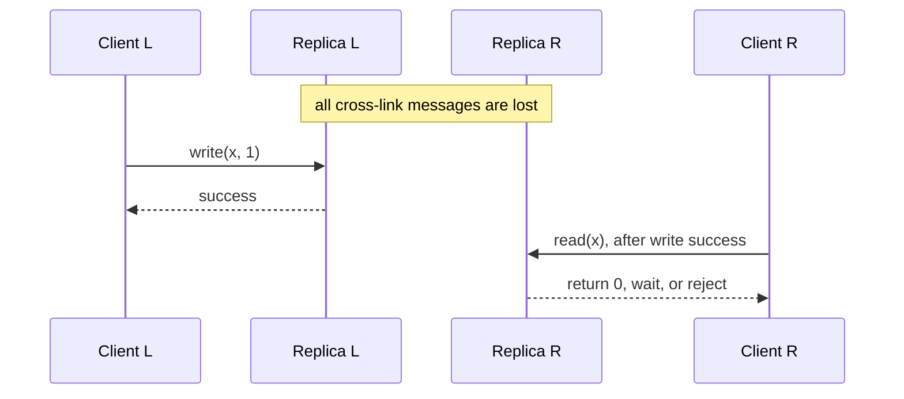

# CAP Theorem

The CAP theorem is commonly summarized this way: a distributed system can provide at most two of three guarantees: **Consistency, Availability, and Partition tolerance**. But this framing is misleading. Partitions are not optional; they are a fact of distributed systems. The real engineering question is what each operation does **during** a partition: preserve consistency or remain available. The choice belongs to an operation and data boundary, not permanently to a database product. When communication is healthy, PACELC adds another tradeoff: latency versus consistency. A system can make different choices for different operations and failure states; it is not permanently “CP” or “AP.”

| Property | Precise CAP meaning |
|---|---|
| **Consistency (C)** | Every completed operation fits one legal, real-time, single-copy order. In CAP, consistency means linearizability. |
| **Availability (A)** | Every request received by a non-failing node eventually returns a valid result under the object specification. A generic error or refusal is not a valid register result. |
| **Partition tolerance (P)** | The claimed guarantees continue to hold even when the network loses all messages between some participants. P describes the executions in scope; it is not an optional feature parallel to C and A. |

CAP is therefore an impossibility result about a specific execution. It is not a permanent classification, a normal-latency model, or a statement that every distributed operation makes the same tradeoff.

## Formal model

Gilbert and Lynch model an asynchronous message-passing service with at least two nodes and a read/write object. Messages can be delayed or lost indefinitely, and an algorithm cannot infer from silence whether a peer is slow, unreachable, or failed.

CAP consistency is **linearizability**, not ACID consistency, transaction serializability, sequential consistency, or eventual convergence. A history is linearizable when its completed operations, plus a permissible completion of some pending operations, can be placed in one legal sequential order that respects real time. If write `w` completes before read `r` begins, `r` must observe `w` or a later write in that order.

CAP availability is also narrower than everyday uptime. Every request delivered to a non-failing node must eventually receive a valid response, but the formal definition has no deadline. A response after 30 seconds is available in the theorem even if the product deadline was 200 ms. Conversely, a live minority node that returns `unavailable` may be well behaved operationally, but it does not satisfy CAP availability for a read/write register.

Partition tolerance quantifies over message loss. Calling a distributed service “CA” assumes away the execution CAP analyzes. It does not explain how the service behaves when communication actually fails.

## Why consistency and availability conflict

Consider replicas L and R storing `x = 0`.

R cannot distinguish two executions from its local state and received messages:

- `E0`: no write occurred at L.
- `E1`: L completed `write(x, 1)`, but the partition hid every message about it from R.

In `E0`, a legal register read returns `0`. If R makes the same decision in `E1`, returning `0` violates linearizability because the write completed before the read began. Returning `1` unconditionally makes `E0` invalid. Waiting for L or rejecting the read preserves consistency but violates CAP availability. Guessing cannot guarantee correctness in every admissible execution.

More replicas do not remove the construction. A partition can still separate reachable groups. Quorums decide which group may retain authority; they do not make every isolated live node both current and responsive.

## Production partitions are not clean cable cuts

The proof needs only missing communication, not a symmetric network split. Production protocols face several forms:

- **Symmetric partition:** neither side receives the other’s traffic.
- **Asymmetric partition:** A can reach B while B cannot reach A, so observers disagree about health and replication progress.
- **Partial or protocol-specific partition:** small packets, health checks, or one port work while large frames, TLS handshakes, DNS, or the replication protocol fail.
- **Gray failure:** a node is healthy from one observer and unusable from another because a disk, NIC queue, runtime, or dependency degrades selectively.
- **Overload-induced coordination failure:** queues and timeouts may prevent coordination within the operation’s useful window even though messages eventually arrive. This is operationally partition-like, but finite delay alone is not the indefinite message loss in CAP’s model.
- **Control-plane partition:** expired credentials, inconsistent membership, bad routes, or stale configuration block the messages that establish authority.

Diagnosis and repair differ across these failures. The operational question is whether the operation can obtain the evidence required by its contract before its deadline; the formal CAP question also covers executions in which required communication may never arrive. A green process health check is not evidence of current authority.

## What CAP does and does not say

CAP applies at the operation and data scope affected by missing communication:

- A consensus majority may continue serving linearizable operations while a minority rejects them. That is useful service availability, but it is not CAP availability for requests delivered to live minority nodes.
- A separately typed stale-read endpoint can remain available because its contract is weaker than linearizability. It must expose a version, frontier, or `as_of` time rather than present stale state as current.
- A commutative data type may accept writes on both sides because its contract permits concurrent versions and deterministic convergence.
- Different keys, tenants, commands, and endpoints may use different policies. A database-wide `CP` or `AP` label hides these boundaries.

CAP says nothing by itself about durability, multi-object atomicity, transaction isolation, Byzantine behavior, bounded staleness, normal-operation throughput, or reconciliation after healing.

The familiar condition `W + R > N` proves only that a read set and write set intersect under a particular membership. It does not by itself prove linearizability. The protocol must also keep membership and epochs coherent, define when a write is complete, durably retain acknowledged versions, order concurrent writes without trusting unsafe clocks, make reads select a version at least as new as the latest completed write, and handle retries, repair, and reconfiguration without exposing an older history. Sloppy quorums or changing replica sets can satisfy a cardinality formula while the actual sets containing an acknowledged value do not intersect. Quorum arithmetic is one lemma inside a protocol, not the protocol’s correctness proof. [Leaderless Replication](../02-distributed-databases/03-leaderless-replication.md) develops those missing conditions.

## CAP, consensus, and FLP

CAP and consensus answer related but different questions. CAP shows that a partitioned read/write service cannot guarantee both linearizability and a valid response from every non-failing request recipient. Consensus asks participants to agree on one value or ordered log while preserving agreement and validity. A consensus-backed service commonly preserves safety by allowing only a quorum side to make progress, which deliberately gives up availability on the other side.

The FLP result adds a liveness boundary: in a fully asynchronous system, no deterministic consensus algorithm can guarantee termination in every execution if even one process may crash. FLP does not say consensus can never complete. Production protocols preserve safety and obtain practical liveness by adding assumptions such as eventual timing bounds, randomized choices, failure detectors, stable leaders, or operator intervention. CAP is not a substitute for FLP, and FLP is not a proof that a stale read is acceptable. Both force the design to state which safety property survives uncertainty and under which assumptions progress resumes.

## Failure detection and client outcomes

Silence cannot distinguish a crashed peer from delayed messages, a paused runtime, overloaded storage, asymmetric filtering, or expired credentials. A timeout creates suspicion, not proof. Making it longer changes false-suspicion frequency and recovery speed; it does not turn silence into knowledge.

Safety must come from positive authority evidence such as a quorum certificate, term, epoch, or lease backed by stated clock-error bounds. Every protected side effect must validate that evidence. A process can be healthy and still hold an obsolete generation.

For each operation, define a product deadline and an externally meaningful outcome:

- `succeeded`: the requested guarantee was established and the operation completed; for a mutation, this includes establishing its durable effect;
- `rejected`: the operation definitely did not take effect under this identity;
- `pending`: a durable intent exists, but the business effect is unresolved;
- `stale`: a weaker, explicitly versioned result was returned;
- `unavailable`: the requested guarantee could not be established and no effect was attempted;
- `unknown`: an attempt may have committed, but the caller lacks decisive evidence.

Do not collapse `pending`, `unknown`, and `succeeded` into a generic success or failure response. For mutations, stable operation identity and outcome lookup are part of the partition contract, not an optional retry convenience.

## Partition policies

When authority or freshness cannot be proved, an operation has three defensible behaviors.

### Stop

Wait until the deadline or return a typed unavailable result rather than claim a current value. If a mutation might already have reached its commit point, return `unknown` with the same operation identity instead of claiming rejection. The client must reuse that identity and query the outcome before issuing a logically new command. Stop preserves a strong history only if the surviving authority is selected safely and old writers are fenced.

### Buffer

Durably accept an **intent** without claiming the business effect completed. The response must name the durability scope, operation identity, ordering rule, status endpoint, expiry or cancellation semantics, and backlog bound. Later execution must be idempotent. Buffering preserves intake availability, not immediate invariant completion; an unbounded local log merely converts a partition into future disk exhaustion.

### Diverge

Commit independently under a weaker contract, retain causal or version metadata, and reconcile explicitly. This is sound only when the domain defines how concurrent states merge, how deletions remain visible, and how irreconcilable conflicts reach an owner. Divergence cannot preserve a non-mergeable global invariant such as selling one final unit or enforcing an immediate revocation everywhere.

Choose per operation:

| Operation | Required guarantee | Partition behavior | Client result | Recovery obligation |
|---|---|---|---|---|
| Reserve the last unit | One successful owner | Stop, or buffer an intent | `unavailable`, `unknown`, or `pending`; never `reserved` without authority | Resolve once using a stable request ID |
| Read current balance | Linearizable read | Stop; optionally expose a separate stale endpoint | `unavailable` or `{value, frontier}` | None for a rejected read |
| Edit an offline draft | Deterministic convergence | Diverge locally | Local commit with causal token | Exchange and merge every edit |
| Append telemetry | Durable local acceptance; duplicates allowed | Buffer in a bounded log | Accepted with event ID and durability scope | Replay idempotently and expose backlog |
| Authorize after revocation | Current revocation state | Fail closed | Denied or unavailable | Record the decision and authority epoch |

Never change an endpoint’s success semantics implicitly during an incident. Switching inventory writes from quorum-conditional updates to local acceptance may restore responses by allowing both sides to sell the final unit. A weaker mode can be legitimate, but it needs a separate contract, authorization, response type, and audit trail.

## Recovery and reactivation

A useful control state is `NORMAL → AUTHORITY_UNPROVEN → RECOVERING → NORMAL`. Entering the restricted state can be conservative and based on suspicion. Leaving it requires stronger evidence.

Before reactivation, establish a new epoch, quorum certificate, or valid lease; fence every old writer at each storage and side-effect boundary; preserve and reconcile ambiguous operation identities; replay or merge divergent state; advance the serving replica to the required activation frontier; validate invariants; and confirm enough capacity to absorb redirected traffic and backlog drain. Routing changes and connection pools must stop sending work to the old generation. A timeout, elapsed lease without bounded-clock evidence, or green health endpoint is not sufficient.

### Ambiguous payment retry

Client C submits payment `p7` to side L. L commits it, but the response is lost during the partition. C times out and retries against R with a new identity. Both payments can later be valid. The safe API returns or accepts a stable operation ID before ambiguity, reuses it across routes, and exposes outcome lookup. A timeout means unknown, not aborted.

### Paused stale leader

Leader L pauses long enough for a quorum to elect a new leader with epoch 42. L resumes believing it still owns epoch 41 and writes to an external store that does not check epochs. The replicated log may remain correct while the external system accepts a stale leader’s effect. Election chooses current authority; fencing at the protected resource makes stale authority harmless.

## PACELC

PACELC asks: **if there is a Partition, choose Availability or Consistency; Else, choose Latency or Consistency**. It usefully moves attention from rare partitions to the coordination paid on healthy requests, but it is a design mnemonic, not another impossibility theorem or a vendor label.

The latency tradeoff is operation- and topology-specific. A valid leader lease can make many linearizable reads local after acquisition, while writes still wait for a quorum. A causal read waits only when its dependency frontier is missing. A coordinator near two replicas may see a different quorum order statistic from a client across an ocean. Shared network paths, queueing, and slow storage correlate tails, so the median replica latency does not predict quorum p99.

Batching changes the shape again. Group commit or replicated batches amortize fsync and network overhead, improving throughput, but add fill delay at low traffic and couple more operations to one slow batch. For a two-of-three quorum, the second acknowledgement determines the replica-arrival order statistic, but end-to-end latency also includes coordinator work, queue residence, durable flush semantics, and retry handling.

For example, if three durable acknowledgements in a measured topology arrive after 3 ms, 11 ms, and 40 ms, waiting for any two cannot complete before about 11 ms; waiting for all three cannot complete before about 40 ms. Local acknowledgement may finish near 3 ms but has a different durability and failover contract. The reusable fact is the required order statistic, not a fixed “consistency tax.”

PACELC does not decide transaction isolation, durability scope, freshness bounds, merge semantics, recovery cost, capacity under failover, or dollar cost. Those remain separate design obligations.

## Illustrative availability math

Suppose three replicas are independently unreachable with probability `p`, and a majority of two is sufficient. Majority unavailability is:

$$
P(\text{fewer than two reachable}) = 3p^2(1-p) + p^3
$$

At `p = 0.01`, the result is `0.000298`, or about `0.0298%`. This is an illustration of quorum arithmetic, not a production availability forecast. Zone loss, network policy, identity, configuration rollout, software bugs, dependencies, and overload create correlated failures. Client and coordinator placement also determine which replicas are reachable. Treating those events as independent can overstate resilience by orders of magnitude.

## Observability and verification

Record decisions at the semantic boundary: operation class, requested consistency mode, authority epoch and evidence, contacted replicas, commit frontier, deadline, stable request ID, and outcome category. Alert on quorum loss, one-way reachability, mode changes, fenced-write rejection, ambiguous retries, pending-intent age, divergence backlog, reconciliation failures, and recovery activation frontier. Aggregate uptime cannot show which promise was served.

Test safety and liveness as separate claims:

- Inject symmetric, asymmetric, partial, and protocol-specific message loss; long delay; process pause; clock movement; credential failure; coordinator crash; storage stall; and topology change.
- Check strong-operation histories with a linearizability checker across timeouts, retries, failover, and membership changes.
- Verify available or buffered operations finish within the product deadline under their stated weaker contract and remain within storage and replay bounds.
- Partition immediately before and after commit, retry through another route with the same identity, heal divergent logs, return a replica beyond retention, and reconfigure while isolated.
- Verify through fault injection that stale epochs are rejected at every external effect boundary, not only by the lock or consensus service.
- Exercise `AUTHORITY_UNPROVEN` and `RECOVERING`; verify that no route reopens before fencing, replay, invariant checks, and activation-frontier evidence complete.

A passing chaos run demonstrates behavior only for the implementation, executions, checker, workload, and assumptions tested. It is evidence, not a proof of arbitrary partition tolerance. A model proof is also bounded by its model; omitted storage, routing, retry, and side-effect behavior can still invalidate the production contract.

## Design decision

For every operation, specify:

1. the invariant and client-visible history model;
2. the authority evidence required for success;
3. whether partition behavior is stop, buffer, or diverge;
4. the deadline, durability scope, stable identity, and stale-data contract;
5. the reconciliation and reactivation evidence;
6. the safety and liveness tests that enforce the decision.

The useful CAP question is: **when required participants cannot communicate, which operations stop, which return a weaker result, which remain unresolved, and which may diverge?**

## Primary references

- Gilbert, S., and Lynch, N. [Brewer’s Conjecture and the Feasibility of Consistent, Available, Partition-Tolerant Web Services](https://doi.org/10.1145/564585.564601). SIGACT News, 2002.
- Brewer, E. [CAP Twelve Years Later: How the “Rules” Have Changed](https://doi.org/10.1109/MC.2012.37). IEEE Computer, 2012.
- Abadi, D. J. [Consistency Tradeoffs in Modern Distributed Database System Design](https://www.cs.umd.edu/~abadi/papers/abadi-pacelc.pdf). IEEE Computer, 2012.
- Chandra, T. D., and Toueg, S. [Unreliable Failure Detectors for Reliable Distributed Systems](https://hdl.handle.net/1813/7192). Journal of the ACM, 1996.
- Herlihy, M. P., and Wing, J. M. [Linearizability: A Correctness Condition for Concurrent Objects](https://doi.org/10.1145/78969.78972). ACM TOPLAS, 1990.
- Fischer, M. J., Lynch, N. A., and Paterson, M. S. [Impossibility of Distributed Consensus with One Faulty Process](https://doi.org/10.1145/3149.214121). Journal of the ACM, 1985.
