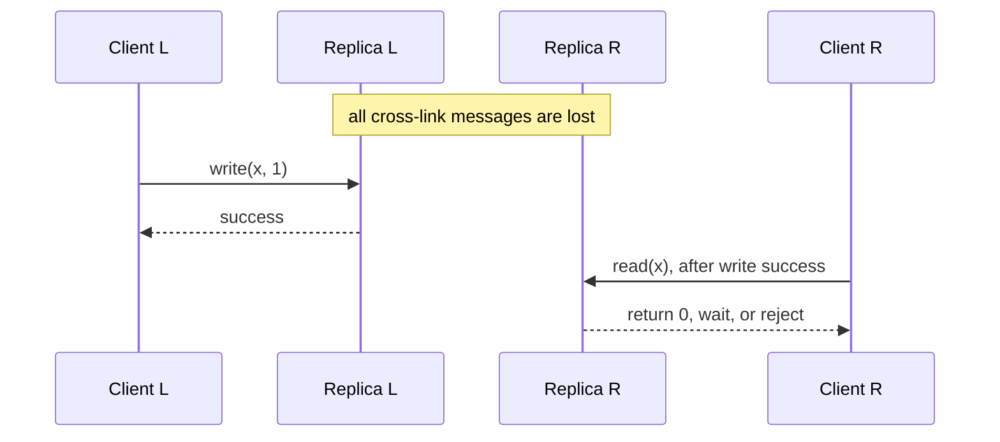

# CAP Theorem

The classic summary says a distributed system can provide at most two of three guarantees—**Consistency, Availability, and Partition tolerance**. That summary is useful but misleading. Partitions are not optional in a distributed system. During a partition, the real choice is whether each operation preserves consistency or remains available. When communication is healthy, PACELC adds the latency-versus-consistency tradeoff. A system is not permanently “CP” or “AP”; its operations make different choices under different failures.

| Property | CAP definition |
|---|---|
| **Consistency (C)** | Every completed operation fits one legal, real-time, single-copy order: linearizability. |
| **Availability (A)** | Every request received by a non-failing node eventually returns a valid result. An error does not satisfy the object’s contract. |
| **Partition tolerance (P)** | The guarantees must hold even when the network drops all messages between some nodes. |

CAP is an impossibility result about a specific execution, not a permanent database classification or a model of normal latency.

## Formal model

Gilbert and Lynch model an asynchronous message-passing service with at least two nodes and a read/write object. Messages may be delayed or lost indefinitely.

CAP’s consistency is **linearizability**, not ACID consistency, serializability, or eventual consistency. If write `w` completes before read `r` begins, `r` must observe `w` or a later write in the single-copy order.

CAP availability has no latency bound. A response after 30 seconds is formally available even if it misses the product deadline. It also applies to every non-failing request recipient, including a live node isolated from the current authority.

Partition tolerance is the execution condition. Calling a distributed service “CA” assumes away the failure CAP analyzes.

## Why consistency and availability conflict

Consider replicas L and R storing `x = 0`.

R cannot distinguish these executions:

- `E0`: no write occurred at L.
- `E1`: L completed `write(x, 1)`, but the partition hid it from R.

R must return `0` in `E0`. Returning `0` in `E1` violates linearizability. Waiting for L or rejecting the read preserves consistency but violates CAP availability. Guessing cannot guarantee correctness in every execution. More replicas do not remove the conflict; quorums only decide which partition may retain authority.

## What CAP does and does not say

CAP applies at the operation and data scope affected by the partition:

- A consensus majority may continue serving linearizable operations while the minority rejects them. That is operationally useful, but it is not CAP availability because live minority nodes cannot return valid current values.
- A stale-read endpoint can remain available because its contract is weaker than linearizability. It must expose freshness or version metadata instead of presenting stale state as current.
- A commutative data type may accept writes on both sides because its contract permits divergence and deterministic convergence.
- Different keys, tenants, and commands may use different policies. A database-wide `CP` or `AP` label hides those boundaries.

CAP says nothing about durability, multi-object transactions, Byzantine faults, normal-operation latency, bounded staleness, or post-partition reconciliation. `W + R > N` proves replica-set intersection only under specific membership, version, and read-repair assumptions; it does not by itself prove linearizability. See [Consistency Models](./04-consistency-models.md) and [Leaderless Replication](../02-distributed-databases/03-leaderless-replication.md).

## Failure detection and authority

Silence cannot distinguish a crashed node from delayed messages, a paused runtime, overloaded storage, asymmetric filtering, or expired inter-node credentials. A timeout creates suspicion, not proof.

Production systems recover liveness by adding assumptions: eventual timing bounds, reachable quorums, failure detectors, or leases with bounded clock error. Safety must come from authority evidence such as a quorum certificate, epoch, term, or fencing token. A healthy process without current authority must not serve strong operations.

For each command, define a product deadline and one of four outcomes:

- `committed`: the requested guarantee was established;
- `pending`: an intent was durably accepted, but the business effect is unresolved;
- `stale`: a weaker, explicitly versioned result was returned;
- `unavailable` or `unknown`: the guarantee or final outcome could not be established.

Do not collapse `pending`, `unknown`, and `committed` into a generic success response.

## Partition policies

When authority cannot be proved, an operation has three defensible behaviors:

1. **Stop:** wait or reject rather than claim a current result.
2. **Buffer:** durably accept an intent without claiming the business effect completed.
3. **Diverge:** commit under a weaker contract, retain causal metadata, and reconcile later through explicit [conflict resolution](../02-distributed-databases/04-conflict-resolution.md).

Choose per operation:

| Operation | Required guarantee | Partition behavior | Client result | Recovery obligation |
|---|---|---|---|---|
| Reserve the last unit | One successful owner | Stop or buffer an intent | `unavailable` or `pending`, never `reserved` | Resolve the intent once using a stable request ID |
| Read current balance | Linearizable read | Stop; optionally expose a separate stale endpoint | `unavailable` or `{value, as_of}` | None for a rejected read |
| Edit an offline draft | Deterministic convergence | Diverge locally | Local commit with causal token | Exchange and merge every edit |
| Append telemetry | Durable local acceptance; duplicates allowed | Buffer in a bounded log | Accepted with event ID and durability scope | Replay idempotently and expose backlog |
| Authorize after revocation | Current revocation state | Fail closed | Denied or unavailable | Record the decision and authority epoch |

Never change an endpoint’s success semantics implicitly during an incident. Switching inventory writes from quorum-conditional updates to local acceptance may restore responses by allowing both sides to sell the final unit.

## Recovery after the partition

A useful control state is `NORMAL → AUTHORITY_UNPROVEN → RECOVERING → NORMAL`. Enter the restricted state on suspicion. Exit only after establishing a new epoch or lease, fencing old writers, replaying or reconciling state, and reaching the required activation frontier.

A timed-out write may already have committed. Retrying it as a new command can duplicate a payment or reservation. Preserve request identities across routing changes and provide outcome lookup. For divergent data, retain tombstones and causal context until every returning replica is covered. [Failure Semantics](./06-failure-modes.md) covers fencing and recovery; [Multi-Region Architecture](../06-scaling/09-multi-region-architecture.md) covers promotion and failback.

## PACELC

PACELC asks: **if there is a Partition, choose Availability or Consistency; Else, choose Latency or Consistency**. It captures the cost of coordination during healthy operation, but it is a design mnemonic, not another impossibility theorem.

The latency tradeoff depends on the operation. A valid leader lease can make linearizable reads local; writes may still wait for a quorum; causal reads wait only when their dependencies are missing. Do not assign one `L/C` label to an entire product.

For example, if three durable acknowledgements arrive after 3 ms, 11 ms, and 40 ms, waiting for any two cannot complete before about 11 ms; waiting for all three cannot complete before about 40 ms. Local acknowledgement may finish near 3 ms but provides a different durability and failover contract. Quorum latency follows the required order statistic and the actual topology.

## Common failure patterns

| Failure | Root cause | Required control |
|---|---|---|
| Minority returns stale state through a strong-read API | Health was mistaken for authority | Reject or return a separately typed stale snapshot with its frontier |
| Client retries a timed-out committed write on the other side | Timeout was treated as abort | Stable idempotency key and outcome lookup |
| Operator enables local writes during quorum loss | Availability was restored by weakening the invariant | Pre-authorized modes with explicit response semantics and audit trail |
| Individually linearizable keys violate a transfer invariant | Per-key guarantees do not compose into transaction atomicity | Transaction protocol or invariant redesign |
| Paused leader resumes and writes to an external system | New epoch did not fence downstream effects | Propagate and validate fencing tokens at every side-effect boundary |

## Observability and verification

Record the operation class, requested consistency mode, authority epoch and evidence, contacted replicas, commit frontier, deadline, request ID, and outcome category. Alert on quorum loss, one-way reachability, mode changes, fenced-write rejection, ambiguous retries, pending-intent age, and reconciliation backlog. Uptime alone cannot show whether the system honored its semantic contract.

Test safety and liveness separately:

- Inject bidirectional, asymmetric, and partial message loss; delay; process pauses; clock movement; coordinator crashes; and topology changes.
- Check strong-operation histories with a linearizability checker across timeouts and failovers.
- Verify available operations meet the product deadline under their stated weaker contract.
- Partition before and after commit, retry through another route, heal divergent logs, return a replica beyond retention, and reconfigure while isolated.
- Verify replicas converge and forbidden modes cannot be enabled without authorization.

A passing chaos test proves behavior only for the executions and assumptions tested.

## Design decision

For every operation, specify:

1. the invariant and history model;
2. the authority evidence required for success;
3. whether partition behavior is stop, buffer, or diverge;
4. the deadline, durability scope, retry identity, and stale-data contract;
5. the reconciliation and reactivation procedure;
6. the safety and liveness tests that enforce the decision.

The useful CAP question is: **when required replicas cannot communicate, which operations stop, which return a weaker result, and which may diverge?**

## Primary references

- Gilbert, S., and Lynch, N. [Brewer’s Conjecture and the Feasibility of Consistent, Available, Partition-Tolerant Web Services](https://doi.org/10.1145/564585.564601). SIGACT News, 2002.
- Brewer, E. [CAP Twelve Years Later: How the “Rules” Have Changed](https://doi.org/10.1109/MC.2012.37). IEEE Computer, 2012.
- Abadi, D. J. [Consistency Tradeoffs in Modern Distributed Database System Design](https://www.cs.umd.edu/~abadi/papers/abadi-pacelc.pdf). IEEE Computer, 2012.
- Chandra, T. D., and Toueg, S. [Unreliable Failure Detectors for Reliable Distributed Systems](https://hdl.handle.net/1813/7192). Journal of the ACM, 1996.
- Herlihy, M. P., and Wing, J. M. [Linearizability: A Correctness Condition for Concurrent Objects](https://doi.org/10.1145/78969.78972). ACM TOPLAS, 1990.
