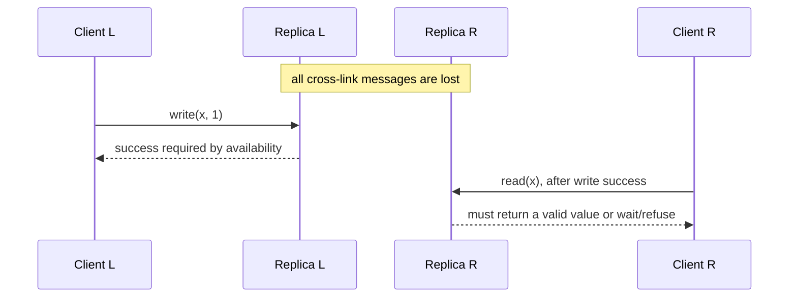

# CAP Theorem

CAP is an impossibility result about one narrow but important execution: replicas cannot communicate, yet clients can reach both sides. For a read/write object, the system cannot guarantee both linearizable behavior and a valid response from every non-failing node in that execution. The theorem does not classify a database forever, predict normal latency, or say “pick any two” from a menu.

This chapter owns the asynchronous partition tradeoff, its relationship to failure detection, and the operation-level policy a product must expose. [Consistency Models](./04-consistency-models.md) defines linearizability and weaker client-observable histories. [Failure Semantics](./06-failure-modes.md) owns fault taxonomy, suspicion, fencing, and recovery mechanics; [Multi-Region Architecture](../06-scaling/09-multi-region-architecture.md) owns regional placement and failover state machines.

## The model and the three terms

Gilbert and Lynch formalized Brewer’s conjecture for an asynchronous message-passing service with at least two nodes and a read/write data object. The network may lose arbitrarily many messages between components. Clients invoke operations and eventually receive responses—or do not.

### Consistency means atomic consistency

CAP’s `C` is atomic consistency, now normally called **linearizability**. Every completed operation must fit a legal single-copy order, and that order must respect real-time precedence: if write `w` returns before read `r` is invoked, `w` precedes `r`. For a register, `r` returns the last preceding write in that order.

This is not ACID’s invariant-preservation “C,” and it is not automatically serializability across transactions or keys. CAP needs only one register to prove impossibility. The full model and composition boundaries are in [Consistency Models](./04-consistency-models.md).

### Availability means every live recipient terminates

In the formal model, every request received by a non-failing node eventually returns a valid response under the object specification. Merely returning a transport error cannot count, or a service that rejects every call would be “available.” The definition has no deadline, percentile, or uptime window; practical availability is usually stronger because a response after the user deadline has no value.

“Non-failing” is also a model assumption, not something another node can know with certainty. A process can be alive yet unreachable or paused. CAP availability quantifies over the request’s actual recipient, including a live node isolated from the current authority.

### Partition tolerance quantifies over lost communication

Partition tolerance means the claimed properties must hold even when the network drops all messages on some links. `P` is therefore not an independent service feature comparable with `C` or `A`. It describes which executions the guarantee covers. If the design assumes communication never partitions, it has removed the theorem’s premise—not engineered a “CA distributed system.”

The proof does not require a clean cable cut. Long delay, asymmetric filtering, a stopped runtime, overloaded disk, expired inter-node credentials, or a bad route can be indistinguishable to the protocol during the operation. Their diagnosis and recovery differ, but the node lacking messages faces the same decision.

## Impossibility by indistinguishability

Consider two replicas, L and R, storing register `x = 0`.

Compare two executions from R’s perspective:

- `E0`: no write occurs at L; R receives no cross-link messages.
- `E1`: L accepts and completes `write(x,1)`; the partition hides every message from R.

R’s local state and incoming messages are identical in `E0` and `E1`. In `E0`, a legal register read must return `0`. Any algorithm making the same decision at R therefore returns `0` in `E1`, but the write completed before the read began, so linearizability requires `1`. Returning `1` unconditionally would make `E0` invalid. Waiting for L or refusing the read preserves consistency but violates formal availability.

Random choice does not guarantee both properties; some admissible execution still fails. More replicas do not remove the construction because a partition can separate reachable groups. Quorums choose which group may preserve authority, not how every isolated live node can remain both current and responsive.

## What CAP does and does not imply

CAP constrains an operation only while the information needed to linearize it cannot cross the partition. A majority side of a consensus group can often continue serving linearizable requests, while a minority rejects them. That is useful availability in an engineering sense, but it is not CAP availability because requests to live minority nodes do not receive valid register results.

The decision can differ by key, command, tenant, endpoint, or requested mode. A partition that separates replicas for account A says nothing about an independently placed account B. A read explicitly asking for “last locally observed value” has a weaker specification than a current balance read and can legally succeed. An operation on a commutative data type may accept concurrent updates because its contract is convergence, not a linearizable register.

CAP is silent about:

- durability after disks or regions are lost;
- atomicity and isolation across multiple objects;
- Byzantine or corrupt replicas;
- normal-operation throughput, cost, or latency;
- how stale an available response may be;
- how histories reconcile after communication heals.

Those are separate design obligations. In particular, `W + R > N` supplies set intersection only under specific replica-set and version assumptions; it is not a one-line proof of linearizability. [Leaderless Replication](../02-distributed-databases/03-leaderless-replication.md) covers the missing conditions.

## Failure detectors cannot reveal the present

In a fully asynchronous model, silence does not distinguish a crashed peer from a delayed message or paused process. A timeout produces **suspicion**, not knowledge. Making the timeout longer changes how often the system guesses wrong and how slowly it reacts; it cannot make the inference logically certain.

Real systems regain liveness by adding assumptions: eventual bounds on message and processing delay, a failure detector with stated accuracy/completeness, reachable quorums, or leases backed by bounded clock error. Safety comes from evidence such as a quorum certificate, monotonically increasing epoch, or fencing token—not from the timeout itself. A node that cannot prove authority must follow the partition policy even if its health endpoint is green.

Product deadlines add another layer. For command class `c`, define deadline `Dc` and what may be returned before it: committed result, typed unavailable, accepted-but-pending intent, or explicitly stale data. Formal CAP availability is unbounded termination; a bounded API SLO is an operational contract and must be tested separately.

## Three defensible partition behaviors

When authority or freshness cannot be established, an operation can stop, buffer, or diverge. These are different APIs:

1. **Stop.** Reject or wait rather than claim a current result. This preserves a strong history if the surviving authority and fencing protocol are sound. The client receives an ambiguous-outcome token when a commit might already exist.
2. **Buffer.** Durably accept an *intent* whose final outcome is pending. The response must not claim that inventory was reserved or money moved. Status lookup and idempotency connect later execution to the original intent.
3. **Diverge.** Commit independently on both sides under a weaker contract, retain causal/version metadata, and reconcile. This preserves write responsiveness but cannot uphold a non-mergeable global invariant. Merge semantics live in [Conflict Resolution](../02-distributed-databases/04-conflict-resolution.md).

A concrete policy matrix is more useful than labeling the whole database `CP` or `AP`:

| Operation | Required invariant/history | When authority is unprovable | Client-visible result | Healing obligation |
|---|---|---|---|---|
| Reserve the last unit | One successful owner; conditional linearizable update | Stop, or accept a non-committed intent | `unavailable` or `pending`, never `reserved` | Resolve intent once; preserve request ID |
| Read account balance | Current value required | Stop; optionally offer a separate stale endpoint | Typed unavailable or `{value, as_of}` | None for rejected read |
| Edit an offline draft | Per-user order plus deterministic convergence | Diverge locally | Committed local edit with causal token | Exchange every edit and resolve deterministically |
| Append telemetry | Durable local acceptance; duplicates permitted downstream | Buffer in bounded local log | Accepted with event ID and durability scope | Replay idempotently; expose backlog |
| Authorize after credential revocation | Revocation must take effect before protected action | Fail closed unless current authority is proved | Denied or unavailable | Audit decision and authority epoch |

The same endpoint must not silently switch rows in this table during an incident. A consistency downgrade changes the meaning of success and requires an explicit, authorized mode with an audit trail. Per-tenant policies still enforce authentication, residency, and quotas; a partition is not permission to bypass them.

## Authority state and healing boundary

A minimal control state distinguishes `NORMAL`, `AUTHORITY_UNPROVEN`, and `RECOVERING`. Entering the restricted state is conservative and may follow timeout suspicion. Leaving it requires stronger evidence: a new epoch or lease, fenced old writers, replayed or reconciled state, and validation that the serving replica reached the activation frontier.

Healing does not erase ambiguous outcomes. A timed-out write may have committed on the old authority; retrying it as a new command on the new side can duplicate a payment or reservation. Stable request identities and outcome lookup survive failover. For divergent operations, retain tombstones and causal context until every allowed returning replica is covered. [Failure Semantics](./06-failure-modes.md) owns these recovery mechanics, and [Multi-Region Architecture](../06-scaling/09-multi-region-architecture.md) owns promotion, routing, and failback.

## PACELC, used carefully

PACELC adds a normal-operation question: **if there is a partition, availability or consistency; else, latency or consistency**. It correctly reminds designers that coordination placement affects every healthy request, not only rare partitions. It is a design mnemonic, not an impossibility theorem or a stable vendor classification.

The `L/C` axis is not universal. A leader lease can make many linearizable reads local after lease acquisition; a causal dependency may force one request to wait while an unrelated request remains local; batching can improve throughput while adding latency; tail behavior depends on replica placement, queueing, and durability. PACELC also omits isolation, durability, freshness bounds, cost, and merge semantics.

**Illustrative calculation, not a vendor benchmark.** Suppose one write is sent to three replicas whose durable acknowledgements in a measured sample arrive after 3 ms, 11 ms, and 40 ms. Ignoring coordinator CPU, a policy waiting for any two cannot finish before about 11 ms; waiting for all three cannot finish before about 40 ms; local-only acknowledgement could finish near 3 ms but carries a different failure contract. The numbers change with topology and load. The reusable fact is that quorum latency follows the required order statistic, not a fixed “consistency overhead.”

**Illustrative independence model, not an availability forecast.** If each of three replicas were independently unreachable with probability `p`, majority unavailability would be `3p^2(1-p) + p^3`. At `p = 0.01`, that is about `0.000298`. Real partitions, configuration faults, and dependency failures are correlated, so multiplying independent-node probabilities can drastically overstate production resilience.

## Partition-specific failure traces

### Minority serves a stale value as current

The majority commits `role=admin_revoked`. An isolated replica answers `role=admin` through the same “strong read” endpoint because its process is healthy. The bug is not replication lag; the endpoint claimed linearizability without current authority. Stop the read or return a separately typed stale snapshot with its frontier.

### Timeout becomes a duplicate cross-side write

A client submits payment `p7` to side L and times out after L commits but before the response crosses. It retries against R with a new request ID. After healing, two valid payments exist. The partition policy must return/reuse a stable operation identity and treat timeout as unknown, not aborted.

### Dynamic downgrade breaks an invariant

During quorum loss, an operator changes inventory writes from conditional quorum to local acceptance to “restore availability.” Both sides sell the final unit. The setting restored responses by changing success semantics. Such a mode may be valid for draft edits, not for a single-owner reservation.

### Per-key strength fails a cross-key rule

Keys `debit` and `credit` are each linearizable on different reachable groups, but a transfer exposes one update without the other. CAP’s single-object result neither grants nor forbids transaction atomicity. Use a transaction protocol or redesign the invariant; per-key `CP` labels do not compose it.

### Old authority resumes after recovery

A paused leader misses an epoch change, wakes, and writes to an external store that does not check fencing tokens. The new side is internally consistent, yet the external effect splits. Timeout-based failure detection selected a candidate; fencing must make the old authority harmless.

## Observability and verification

Record decisions at the product boundary: operation class, requested consistency mode, authority epoch and evidence, contacted replica set, commit frontier, deadline, and outcome category (`committed`, `pending`, `stale`, `unavailable`, `unknown`). Observe one-way reachability, quorum formation, mode changes, fenced-write rejects, ambiguous retries, pending-intent age, divergence/conflict backlog, and recovery activation frontier. Aggregate uptime alone cannot show which semantic promise was served.

Test safety and liveness as separate claims. Generate histories with stable operation IDs while injecting bidirectional, asymmetric, and partial message loss; long delay; process pause; clock movement; coordinator crash; and topology changes. For strong operations, a linearizability checker must find no invalid successful history, including across timeout and failover. For available operations, every request to an in-scope live node must finish within the **product’s** stated deadline with a valid weaker result, and replicas must converge after the liveness assumptions return.

Exercise policy transitions: partition before and after commit, retry on the other side, heal with both divergent logs, return a replica beyond retention, and change configuration while isolated. Verify that forbidden modes cannot be enabled without authorization and that “pending” is never rendered as committed. A successful chaos run demonstrates behavior under the injected executions; it does not prove arbitrary partition tolerance.

## Decision framework

For every command, write the invariant and history model first. Identify the authority evidence it needs, then decide what the client sees when that evidence cannot be obtained: stop, pending intent, or a weaker divergent commit. State the deadline, durability scope, retry identity, stale-data label, and healing procedure. Finally, verify that routing and downstream side effects preserve the same decision.

CAP’s practical question is not “is this database AP or CP?” It is: **during an execution in which the required replicas cannot exchange information, which operation promises remain valid, which responses stop, and which histories are deliberately allowed to diverge?**

## Primary references

- Gilbert, S., and Lynch, N. [Brewer’s Conjecture and the Feasibility of Consistent, Available, Partition-Tolerant Web Services](https://doi.org/10.1145/564585.564601). SIGACT News, 2002.
- Brewer, E. [CAP Twelve Years Later: How the “Rules” Have Changed](https://doi.org/10.1109/MC.2012.37). IEEE Computer, 2012.
- Abadi, D. J. [Consistency Tradeoffs in Modern Distributed Database System Design](https://www.cs.umd.edu/~abadi/papers/abadi-pacelc.pdf). IEEE Computer, 2012.
- Chandra, T. D., and Toueg, S. [Unreliable Failure Detectors for Reliable Distributed Systems](https://hdl.handle.net/1813/7192). Journal of the ACM, 1996.
- Herlihy, M. P., and Wing, J. M. [Linearizability: A Correctness Condition for Concurrent Objects](https://doi.org/10.1145/78969.78972). ACM TOPLAS, 1990.
