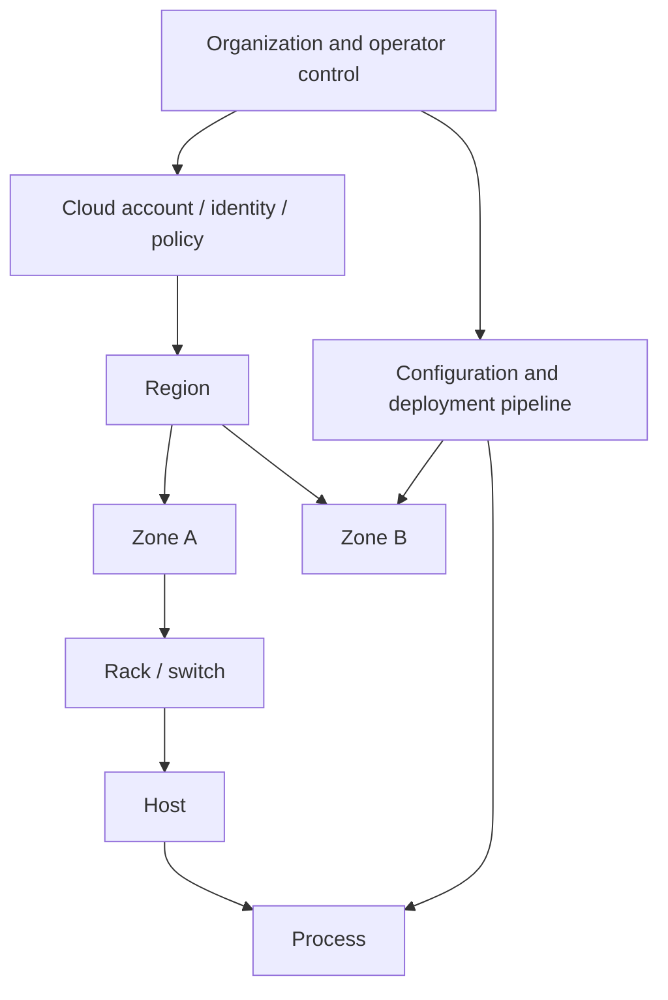

# Failure Semantics, Detection, and Recovery Boundaries

## TL;DR

A failure model is part of a system's correctness contract. It states which components may stop, restart, delay, omit, corrupt, or equivocate; which failures may be correlated; what evidence other components can observe; and which safety properties must survive when progress is impossible.

Production failures are rarely clean. A process may answer health checks while its disk stalls, one network direction may fail, an acknowledged write may have committed before the client timed out, a restarted worker may still hold stale authority, and a failover can overload the remaining capacity. The useful design questions are therefore:

- What state is durable, volatile, or externally visible at every interruption point?
- Which outcomes are distinguishable from the caller's evidence?
- How is stale authority fenced after failover or restart?
- Which failure domains are independent, and which share power, network, identity, configuration, or load?
- What work is admitted during degradation, and how is backlog drained after recovery?
- How will the invariants be tested under crash, delay, loss, reordering, duplication, partition, corruption, and operator error?

Safety and liveness must be separated. During uncertainty, a system may have to stop making progress to preserve an invariant. Redundancy improves availability only when replicas do not share the same fault and recovery does not create a second failure.

---

## 1. Specify the Failure Contract Before the Happy Path

For each operation, define externally meaningful outcomes:

| Outcome | What the caller knows | Safe next action |
|---|---|---|
| Committed success | operation effect and identity are durable | continue |
| Definitive rejection | no effect occurred under this operation identity | correct request or stop |
| Ambiguous | request or response may have been lost; effect may exist | retry with same operation identity or query status |
| Superseded/fenced | caller no longer has authority for this epoch | reacquire authority; never retry blindly |
| Indeterminate integrity | stored or replicated state may be corrupt | isolate, verify, repair from trusted evidence |

An API that returns only `200` or `500` hides the most important state: whether a timed-out mutation committed. A timeout proves only that the caller did not receive a response; it does not prove rollback. Retrying under a new identity can duplicate a payment or reservation, while refusing to retry can lose an operation that never committed. The safe protocol reuses a stable idempotency key and queries the recorded outcome until the caller can distinguish committed, rejected, or still unknown. [Idempotency and Operation Identity](./08-idempotency.md) defines that protocol; this chapter defines the failure semantics that make it necessary.

### 1.1 Safety, liveness, and durability

- **Safety:** something forbidden never happens; for example, two owners never both commit writes for the same lease epoch.
- **Liveness:** a valid operation eventually completes under stated timing and fault assumptions.
- **Durability:** once an operation reaches its documented commit point, its effect survives the documented failures.

These are not interchangeable. A minority replica may reject writes to preserve safety, sacrificing liveness until communication recovers. A queue may remain available by accepting work to local disk, but durability depends on whether that disk is within the promised failure domain.

### 1.2 An explicit model

A reviewable contract might say:

```text
Components:
  5 replicated state-machine nodes across 3 zones

Assumptions:
  at most 2 crash-stop or crash-recovery faults
  messages may delay, drop, duplicate, reorder, or partition
  stable storage can lose only writes not acknowledged after fsync
  nodes are authenticated but not Byzantine
  clocks have bounded drift only while synchronized

Required safety:
  one committed log entry per index
  only the current fenced leader may mutate the external resource

Required liveness:
  progress resumes after a majority can communicate for one election interval
```

Without the assumptions, “highly available” and “exactly once” are adjectives rather than claims.

---

## 2. Fault Taxonomy Without a False Hierarchy

Failure classes overlap; they are not a simple ladder where every level contains all lower behaviors.

### 2.1 Crash-stop and crash-recovery

In a crash-stop model, a failed process never returns. In crash-recovery, it may restart with durable state, a new process identity, and no trustworthy volatile state.

Crash recovery raises questions that crash-stop abstracts away:

- Was the last log record fully written, torn, or reordered?
- Which effects escaped to another system before the crash?
- Can an old network response arrive after restart?
- Does a restored snapshot reuse an epoch, nonce, or operation ID?
- How does the node prove it has caught up before serving?

A PID, container name, or hostname does not define an incarnation. Persist or obtain a monotonically increasing epoch when authority spans restarts.

### 2.2 Omission, duplication, reordering, and delay

A send, channel, or receive path can omit a message. Transport and application layers may duplicate it during retry. Concurrent paths may reorder it. Delay can be unbounded in the asynchronous model.

From the caller's point of view:

```text
request sent -> timeout
```

is compatible with all of these histories:

1. the request never arrived;
2. it arrived but did not commit;
3. it committed and the response was lost;
4. it is still queued and will execute later;
5. a response is delayed behind a newer retry.

Timeouts create suspicion and a latency boundary; they do not prove non-execution.

### 2.3 Timing and gray failure

A component can be correct but too slow for its caller's deadline. Gray failure is partial and observer-dependent: a storage node serves cached reads but stalls writes, a proxy can reach one shard but not another, or a host answers a shallow health check while packet loss makes real work unusable.

Model resource exhaustion as a failure mode:

- CPU throttling and long scheduler queues;
- stop-the-world pauses;
- memory pressure, paging, and allocation failure;
- disk tail-latency spikes and full filesystems;
- socket, thread, descriptor, connection, and ephemeral-port exhaustion;
- dependency quota or admission rejection.

Slow components often cause more system-wide damage than stopped components because they retain connections and work while triggering retries.

### 2.4 Value, storage, and software faults

A component may respond on time with an incorrect value because of data corruption, a stale replica, nondeterministic state-machine code, misconfiguration, schema mismatch, numeric overflow, or software defect. Checksums detect some corruption but not a validly encoded wrong value.

Replicating corrupt state three times does not make it correct. Recovery needs an independent source of truth or invariant: end-to-end checksum, immutable log, reconciliation against domain facts, quorum comparison, or backup with verified provenance.

### 2.5 Byzantine behavior

A Byzantine participant can behave arbitrarily, including sending conflicting statements to different peers. This model is relevant when participants cross trust domains, software/hardware compromise is in scope, or silent arbitrary faults must be tolerated.

The often-quoted $3f+1$ replicas to tolerate $f$ Byzantine faults belongs to a particular family of authenticated Byzantine consensus protocols and timing assumptions; it is not a universal sizing formula for every Byzantine system. PBFT, for example, uses quorums that intersect in enough correct replicas with $n \ge 3f+1$. Protocol choice must state authentication, synchrony, client, storage, and recovery assumptions.

For a single-organization data service, Byzantine consensus may add cost without addressing the dominant faults: bad deployments, stolen credentials, shared control planes, corrupt application writes, and correlated infrastructure loss. Cryptographic authentication and integrity checks are still valuable even when the consensus model is crash fault tolerant.

---

## 3. Failure Domains and Correlation

Redundancy only covers failures outside the shared domain.



Two replicas in different zones can still share:

- the same IAM principal or expired certificate chain;
- one DNS/control-plane dependency;
- a destructive configuration rollout;
- the same software defect and input;
- one regional service quota;
- a synchronized backup-deletion job;
- capacity assumptions that fail after either zone is lost.

### 3.1 Map each invariant to a domain

| Invariant | Threatened by | Containment mechanism |
|---|---|---|
| one active writer | partition, pause, stale lease holder | quorum lease plus downstream fencing token |
| acknowledged data survives one zone | correlated placement, premature ack | failure-domain-aware quorum and commit rule |
| tenant A cannot affect tenant B | shared queues/cache keys/control plane | isolation, quotas, cells, canonical tenant binding |
| rollout cannot corrupt all copies | simultaneous deployment | staged rollout, version skew testing, rollback artifact |
| backup is recoverable | shared credentials/key deletion | isolated account, independent key inventory, restore drill |

The blast radius is an architectural property. Cells and bulkheads reduce it only when routing, state, capacity, control plane, and operations respect the boundary; see [Cell-Based Architecture](../06-scaling/11-cell-based-architecture.md).

### 3.2 Common-mode testing

Killing one process proves little about zone loss or bad configuration. Exercise failures by domain:

- process pause/restart;
- host loss and disk corruption;
- rack/zone communication loss;
- asymmetric regional routing;
- identity/key/policy outage;
- deployment of a deterministic bug;
- operator deletion and backup restore;
- dependency quota exhaustion;
- loss of capacity plus a traffic spike.

---

## 4. Failure Detection Is Evidence, Not Truth

In a fully asynchronous system, a silent process cannot be distinguished with certainty from a correct process whose messages are delayed. Practical systems add timing assumptions and implement **failure detectors** that output suspicion.

### 4.1 Timeout design

A timeout combines:

```text
queue wait + connection acquisition + network + remote queue
+ remote execution + response + scheduler variance
```

Set it from the caller's end-to-end deadline and measured distributions, not a round number copied into every client. A timeout longer than the useful deadline wastes capacity; one below normal tail latency causes false suspicion and retry amplification.

Use monotonic elapsed time for deadlines. Wall clocks can jump during synchronization and are needed only when the protocol explicitly reasons about real time. Propagate a decreasing deadline through calls rather than giving every hop the original duration.

### 4.2 Heartbeats and accrual suspicion

Fixed “three missed heartbeats means dead” thresholds are easy to operate but adapt poorly to latency changes. Accrual detectors output a suspicion level derived from the observed arrival distribution; a higher threshold trades slower detection for fewer false positives.

Heartbeats need isolation from the work path only with care. A separate high-priority channel distinguishes a dead process from an overloaded work queue, but it can also report green while the application path is unusable. Pair process/liveness evidence with real readiness and end-to-end probes.

### 4.3 Membership dissemination

All-to-all heartbeat traffic grows quadratically. Gossip membership protocols such as SWIM use randomized probing, indirect probes, and infection-style dissemination to scale, while incarnation numbers prevent an old suspicion from overriding a newer “alive” state.

Membership is not consensus. Two nodes can temporarily hold different membership views. Do not derive exclusive write authority from gossip alone.

### 4.4 Asymmetric and partial connectivity

A can reach B does not imply B can reach A, and both reaching a health endpoint does not imply they can exchange protocol traffic. Detect from multiple vantage points and retain path-specific telemetry. During a partial partition, a node may reach the database but not the lease service, or the control plane but not peers.

The system should avoid declaring a partition topology from one observer's perspective. Authority should come from a quorum or fenced external coordinator, not from “I cannot see the old leader, therefore I am leader.”

---

## 5. Authority, Epochs, Leases, and Fencing

Failover creates a new owner before the old owner is proven dead. If the old process resumes, two actors may perform side effects.

```mermaid
sequenceDiagram
    participant A as Worker A, epoch 41
    participant C as Coordinator
    participant B as Worker B, epoch 42
    participant S as Storage
    A->>C: lease 41
    Note over A: long pause
    C->>B: lease 42
    B->>S: write(value, fence=42)
    S-->>B: accepted; highest=42
    A->>S: late write(value, fence=41)
    S-->>A: rejected as stale
```

A lease reduces overlapping ownership only under its clock and communication assumptions. A **fencing token** makes the protected resource reject stale owners. If the downstream database, object store, or device ignores the token, the lease service cannot prevent a paused client from acting.

Rules:

- tokens increase monotonically per protected scope;
- acquire/renew is durable at the coordinator's commit point;
- the resource remembers the highest accepted token;
- late messages are rejected even if credentials remain valid;
- authority is not restored from a process snapshot;
- expiration uses the protocol's stated clock-drift bound.

Leadership for replicated state machines is treated in [Leader Election and Fencing](../02-distributed-databases/09-leader-election.md); application locks in [Distributed Locks](./09-distributed-locks.md).

---

## 6. Crash Consistency and Recovery State Machines

### 6.1 Locate every irreversible boundary

For a mutation that touches a log, database, queue, and external API, enumerate crash points:

```text
receive request
  -> persist operation identity
  -> commit domain state
  -> enqueue event
  -> call external effect
  -> record effect receipt
  -> send response
```

At each arrow, ask what survives and what a retry observes. A local transaction cannot atomically commit an external email, payment network request, or object-store mutation. Use durable workflow/effect protocols where required; see [Effect Commit Protocols for Workflows](../18-workflow-job-systems/06-retry-idempotency-compensation.md).

### 6.2 Write-ahead recovery

Write-ahead logging requires more than `append()`:

1. encode record length/version/checksum;
2. write the log before the dependent state mutation;
3. reach the documented durability boundary (`fsync`, replicated quorum, or equivalent);
4. make replay deterministic or idempotent;
5. detect and truncate an incomplete tail safely;
6. checkpoint without losing the replay prefix;
7. test filesystem and hardware ordering assumptions.

The storage mechanics are in [Write-Ahead Logging](../03-storage-engines/04-write-ahead-logging.md). Recovery must distinguish “record durable but not applied” from “applied but completion marker absent.”

### 6.3 Rejoin, catch-up, and quarantine

A restarted replica should not serve because its process is healthy. It must:

- validate local identity, configuration, log, and snapshot;
- compare epoch and committed position with current membership;
- repair or replace divergent/corrupt state;
- catch up within bounded lag;
- enter read or write service only after required invariants hold.

If state fails integrity checks, quarantine it. Automatically copying a suspect replica to peers can convert a local corruption into a cluster-wide one.

### 6.4 Reconciliation

Retries prevent duplicate intent only when every consumer honors the operation identity. Reconciliation repairs facts after an unknown or failed path:

```text
desired domain state
vs durable execution log
vs external provider receipts
vs derived projections
```

Run reconciliation continuously, partition it for scale, and make repairs idempotent and auditable. “Operator will inspect the dead-letter queue” is not a recovery protocol.

---

## 7. Network Partitions and Healing

A partition is a communication failure that separates some participants from others; it may be partial, asymmetric, protocol-specific, or indistinguishable from process delay. The CAP theorem constrains consistency and availability when messages needed for coordination cannot arrive; its precise scope is in [CAP Theorem: Scope, Proof, and Design Consequences](./03-cap-theorem.md).

Operational partition handling requires:

1. **Authority:** only a quorum-backed/fenced side continues non-mergeable writes.
2. **Degradation:** define which reads, buffered writes, or local functions remain safe.
3. **Backlog:** bound hints, queues, leases, and retained versions while peers are absent.
4. **Healing:** exchange summaries, identify missing/divergent state, repair, and verify.
5. **Reintroduction:** rate-limit catch-up and prevent an old node from serving stale data.

### 7.1 Stop, buffer, or diverge

For each operation choose deliberately:

| Strategy | Valid when | Cost after healing |
|---|---|---|
| Reject without quorum | invariant is not mergeable | reduced availability |
| Serve a labeled stale read | consumer accepts a bounded snapshot | session/monotonic-read handling |
| Buffer intent without claiming commit | durable local capacity is bounded | drain, expiry, duplicate handling |
| Accept concurrent writes | domain has deterministic merge/conflict semantics | conflict detection, user-visible resolution |

Do not classify the whole database as “CP” or “AP” and stop reasoning. A balance transfer, shopping-cart add, presence heartbeat, and profile photo update can have different safe behaviors.

### 7.2 Repair protocols

Anti-entropy can compare Merkle trees, version vectors, log positions, or checksums to locate differences. Hinted handoff stores intended replicas' writes elsewhere temporarily, but hints need durability, limits, ownership, expiry, ordering, and a plan when the destination never returns.

Repair traffic competes with foreground traffic. After a long partition, sending every missing object at full speed can cause a second outage. Reserve capacity, prioritize safety-critical metadata, pace bulk transfer, and measure estimated time to convergence.

Conflicting application values require semantics described in [Conflict Resolution](../02-distributed-databases/04-conflict-resolution.md); byte-level replica repair must not silently choose last wall-clock timestamp when clocks and causality do not justify it.

---

## 8. Cascading Failure and Overload

A component failure shifts traffic and work to the survivors. If the steady state uses 80% of fleet capacity, losing one of four equal cells raises the others' ideal load from 80% to roughly:

$$
80\% \times \frac{4}{3} \approx 107\%
$$

Failover without reserve capacity is load redistribution, not resilience.

### 8.1 Retry amplification

Suppose a request fans out to five dependencies and each layer performs up to three attempts. If retries are nested without a shared budget, one top-level attempt can generate as many as:

$$
3^5 = 243
$$

downstream attempts along one failing chain. Real fan-out can make it worse. Retry at one owning layer, use a total deadline and attempt budget, add randomized backoff, and stop retrying overload or permanent failures. Detailed mechanics are in [Retries, Deadlines, and Hedging](../06-scaling/10-retries-timeouts-hedging.md).

### 8.2 Admission before collapse

Queues convert a short overload into latency; unbounded queues convert it into memory exhaustion and stale work. During failure:

- reject or shed low-priority work early;
- bound concurrency at the scarce resource;
- propagate backpressure rather than accepting infinite backlog;
- reserve capacity for recovery, health, and control operations;
- isolate tenants and critical paths;
- prefer explicit degraded responses to timeouts after expensive work.

See [Backpressure and Overload Control](../06-scaling/07-backpressure.md) and [Circuit Breakers as Adaptive Admission Control](../06-scaling/06-circuit-breakers.md).

### 8.3 Backlog recovery math

If arrivals continue at $\lambda=8{,}000$ jobs/s, recovered capacity is $\mu=10{,}000$ jobs/s, and the outage accumulated 18 million jobs, ideal drain time is:

$$
T = \frac{18{,}000{,}000}{\mu - \lambda}
  = \frac{18{,}000{,}000}{2{,}000}
  = 9{,}000\ seconds \approx 2.5\ hours
$$

This ignores cache misses, retries, expired work, and database recovery load. If $\mu \le \lambda$, the backlog never drains. Recovery objectives need surplus capacity and expiry/compaction policies.

---

## 9. Dependency and Control-Plane Failures

An end-to-end path is limited by its mandatory dependencies. If five independent serial dependencies are each 99.9% available, the simplified path availability is:

$$
0.999^5 \approx 99.50\%
$$

The independence assumption is often false, but the calculation exposes why adding a mandatory remote service to every request is an availability decision.

Classify dependencies:

- **hard data-path dependency:** operation cannot be correct without it;
- **soft enrichment:** can be omitted or served stale with explicit semantics;
- **control plane:** config, membership, keys, policy, placement, or deployment state;
- **observability:** must not block the operation, but loss reduces safe operability.

A healthy data plane may continue on last-known-good immutable configuration during a control-plane outage. Bound how long, preserve expiry and revocation rules, and ensure a corrupt control-plane update cannot instantly reach all cells. Validate and sign artifacts, stage activation, and retain rollback state locally.

Fallbacks are real production paths. A stale cache, default policy, secondary provider, or local configuration needs the same correctness, load, security, and testing discipline as the primary. “Fail open” is not a neutral availability choice when it widens authority or accepts money-moving operations.

---

## 10. Concrete Failure Traces

### 10.1 The ambiguous payment timeout

1. The service sends provider request `op-73`.
2. The provider commits the charge.
3. The response is lost.
4. The service marks the attempt failed and retries with a new ID.
5. The customer is charged twice.

The fix is a stable operation identity accepted by the provider plus a status/reconciliation path. A longer timeout only changes how often ambiguity appears.

### 10.2 Green health, unusable storage

1. A storage process answers `/health` from memory.
2. Its device has 30-second write stalls.
3. Load balancing continues sending full traffic.
4. Client timeouts trigger retries to every replica.
5. Connection pools fill and healthy replicas overload.

Use layered probes: process liveness, readiness based on bounded real work, and external SLO probes. Remove or down-weight a node based on observed service quality, with hysteresis to avoid flapping. Admission control must engage before retry load consumes survivors.

### 10.3 Paused leader writes after failover

1. Leader A holds a lease and pauses for 45 seconds.
2. A majority elects B in a new term.
3. B updates an external blob store.
4. A resumes and completes its old upload.
5. The blob store accepts the stale overwrite.

Consensus protected the internal log but not the external side effect. Include the term/fencing token in the downstream conditional write or route the effect through a fenced single owner.

### 10.4 Corruption copied by repair

1. A memory or software fault writes a validly checksummed but semantically invalid index segment.
2. The replica reports the newest version.
3. Anti-entropy treats version recency as truth.
4. The segment is copied to every replica.
5. The last good copy is deleted by compaction.

Use end-to-end/domain invariants, delayed garbage collection, immutable source logs, sampled recomputation, and quarantine. Version order proves recency, not correctness.

### 10.5 Recovery overload

1. A zone loses connectivity for 40 minutes.
2. Clients shift to the surviving zones, consuming their reserve.
3. The zone returns and every replica starts catch-up.
4. Repair saturates network and storage.
5. Foreground latency triggers retries and the whole region fails.

Use coordinated reintroduction, repair budgets, priority classes, staggered restart, and convergence-time telemetry. “The zone is back” is the beginning of recovery, not its completion.

---

## 11. Verification: Prove Invariants Under Faults

### 11.1 State-machine and history testing

Write the invariant before the fault campaign:

```text
no two successful withdrawals spend the same balance
every acknowledged queue item is delivered or remains recoverable
no stale fencing token mutates the resource
read-your-writes holds for a session token
```

Then record invocation/completion histories with operation IDs and revisions. A checker can test linearizability, serializability, or domain-specific properties. Green service metrics do not prove these histories are valid.

### 11.2 Test layers

1. **Deterministic unit/state-machine tests:** enumerate crash points and replay.
2. **Property and model tests:** generate operation/fault sequences and shrink failures.
3. **Component failpoints:** fail before/after log, commit, response, checkpoint, and cleanup boundaries.
4. **Distributed fault tests:** delay, drop, duplicate, reorder, partition, pause, restart, skew clocks, fill disks, and corrupt bytes.
5. **Load plus fault tests:** inject faults at peak traffic and cold-cache conditions.
6. **Recovery drills:** restore backups, rotate authority, rebuild indexes, reconcile external effects, and return capacity gradually.
7. **Controlled production experiments:** begin with contained cells and reversible faults after lower layers prove the mechanism.

Jepsen-style testing combines concurrent workloads, a fault “nemesis,” recorded histories, and a consistency checker. It proves only the tested workload, configuration, version, and fault set; a process-kill test does not establish behavior under asymmetric partition or disk corruption.

### 11.3 Failure-injection safety

The experiment platform itself needs scope, approvals, automatic aborts, blast-radius limits, identity, audit, and a reliable cleanup path. Verify the fault actually occurred. A chaos test that failed to apply its network rule and reported green is worse than no test because it creates false confidence.

---

## 12. Observability and Recovery Objectives

Observe evidence at the boundaries:

- operation outcomes: committed, rejected, ambiguous, fenced, indeterminate;
- timeout phase: queue, connect, remote execution, response;
- failure-detector suspicion and false-positive/false-negative indicators;
- leader/lease epoch changes and stale-token rejections;
- replication, repair, replay, and reconciliation lag;
- queue age and estimated drain time, not only queue length;
- capacity remaining after each failure domain is removed;
- corrupt-record quarantine and verification backlog;
- dependency/control-plane version and last successful refresh;
- recovery milestones and restored SLO, not merely process restart.

Recovery time objective (RTO) and recovery point objective (RPO) are workload contracts. Define them per operation class and failure domain. A service can have a five-minute process restart but a six-hour data convergence time; the latter is the real recovery for affected reads.

Alert on user-impacting symptoms and invariant threats. “One heartbeat missed” is diagnostic evidence; “quorum at risk,” “ambiguous mutation rate,” “revocation fence rejected,” or “backlog will miss expiry” is actionable impact.

---

## 13. Design Review Framework

For every important component and operation, answer:

1. Which crash, delay, omission, partition, corruption, resource, software, security, and operator faults are in scope?
2. Which faults may be correlated through zone, region, account, deployment, identity, or control plane?
3. What exactly has committed at each acknowledgment boundary?
4. How does a caller resolve an ambiguous outcome?
5. What volatile state is lost on restart, and can restoring it reuse authority or identity?
6. Who grants new authority, and which downstream resource enforces fencing?
7. What work remains safe without quorum or a dependency?
8. How are divergence, corruption, and derived-state drift detected and repaired?
9. Is there enough surviving capacity for failover, retry suppression, and backlog drain?
10. What invariant checker and fault campaign demonstrate the claim?
11. How is a repaired component reintroduced without causing recovery overload?
12. Which metric proves recovery is complete from the user's perspective?

A resilience design is incomplete if its failure story ends at “retry, fail over, and add replicas.” It must define ambiguous effects, stale authority, correlated faults, overload, repair, and verification.

---

## References

- [Unreliable Failure Detectors for Reliable Distributed Systems](https://doi.org/10.1145/226643.226647): Chandra and Toueg's failure-detector abstractions
- [SWIM: Scalable Weakly-consistent Infection-style Process Group Membership Protocol](https://www.cs.cornell.edu/projects/Quicksilver/public_pdfs/SWIM.pdf): scalable probing, suspicion, and membership dissemination
- [The Phi Accrual Failure Detector](https://doi.org/10.1109/RELDIS.2004.1353014): adaptive suspicion rather than a binary fixed timeout
- [Gray Failure: The Achilles' Heel of Cloud-Scale Systems](https://www.microsoft.com/en-us/research/publication/gray-failure-achilles-heel-cloud-scale-systems/): observer-dependent partial failures
- [Practical Byzantine Fault Tolerance](https://www.usenix.org/conference/osdi-99/practical-byzantine-fault-tolerance): concrete $3f+1$ Byzantine replication design and assumptions
- [The Part-Time Parliament](https://lamport.azurewebsites.net/pubs/lamport-paxos.pdf): safety and progress under partial synchrony in Paxos
- [How Complex Systems Fail](https://how.complexsystems.fail/): Richard Cook's concise model of interacting failure and defense
- [Google SRE: Addressing Cascading Failures](https://sre.google/sre-book/addressing-cascading-failures/): overload, retries, deadlines, and load shedding
- [Jepsen analyses](https://jepsen.io/analyses): fault-injected history checking against consistency claims
- [RFC 8633: Network Time Protocol Best Current Practices](https://www.rfc-editor.org/rfc/rfc8633): operational clock synchronization and security considerations
