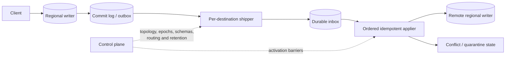

# Multi-Leader Replication

Multi-leader replication lets more than one site commit writes without first obtaining permission from a single remote leader. That can keep a disconnected client productive and remove an inter-region round trip from the foreground path. It also creates independent histories that must later be combined. The design is therefore not “single-leader replication, twice”: its core product contract is what a local acknowledgement means while other writers are unreachable.

Scope: replication streams between writable sites: durable capture, topology, ordering, deduplication, causal sessions, bootstrap, rejoin, and regional operations. [Conflict Resolution](./04-conflict-resolution.md) owns merge algebra and CRDT mechanics. [Partitioning Strategies](./05-partitioning-strategies.md) owns key placement, while [Consensus Algorithms](./08-consensus-algorithms.md) covers systems that choose one ordered history instead of reconciling several.

## Workload and consistency contract

Start with operations, not a topology diagram. For each command class, specify:

- where it may be accepted and which local durability boundary precedes success;
- whether a client needs read-your-writes, monotonic reads, causal visibility, or merely eventual convergence after communication resumes;
- whether concurrent updates commute, can be presented as siblings, or must be serialized;
- whether invariants span one key, several keys, tenants, or external systems;
- the maximum tolerable replication lag, conflict age, and recovery point after losing a site.

A typical active-active contract says that a write acknowledged in region A survives an A process restart, is usable immediately in A, and will eventually be delivered at least once to every healthy destination. It does **not** say that a simultaneous read in B sees the write, that wall-clock timestamps identify the real last writer, or that two locally valid transactions preserve a global invariant.

The distinction matters for money and scarce resources. If A and B can each decrement the last inventory unit, no deterministic merge can make both promises true. Route that item to one authority, allocate regional escrow quotas, or coordinate the reservation. Multi-leader replication is appropriate only for the remaining state whose concurrent outcomes have an explicit meaning.

## Durable state and invariants

Each committed mutation needs an immutable replication identity. A useful envelope contains:

```text
event_id              globally unique retry identity
origin_id, origin_epoch, origin_sequence
transaction_id, transaction_position
key and operation or after-image
causal_context        dependencies observed by the writer, when required
commit_time           diagnostic or tie-break input, not proof of causality
schema_version and resolver_version
tenant_id and data-classification metadata
```

Every destination durably tracks received events, applied events, per-origin contiguous sequence frontiers, gaps, and quarantined failures. The source tracks each destination’s acknowledged receive frontier so that it knows what log can be reclaimed. Tombstones and conflict metadata are data with their own retention rules, not temporary implementation details.

The following invariants make recovery reason-able:

1. An origin acknowledges only after the local mutation and its replication record share an atomic durable boundary.
2. A receiver acknowledges delivery only after the event is durable at that receiver.
3. Re-delivery has one logical effect. Deduplication covers both database changes and emitted side effects.
4. Events from an origin are applied in sequence, or an operation is explicitly proven safe under reordering. Transaction fragments become visible atomically when the contract promises that boundary.
5. Replicas that have received the same event set and use the same resolution version converge.
6. A progress frontier never advances across an unrecorded gap or a quarantined event.
7. Reclaimed history is older than every bootstrap, repair, and offline-replica requirement that can still legally return.

An `event_id` alone is not enough. If the deduplication marker commits and the data mutation does not, the event is lost; if the data commits and the marker does not, replay repeats it. They must be atomic, or the target operation must itself be conditional on a stored version.

## Architecture: data plane and control plane



The data plane commits, ships, receives, and applies mutations. The control plane owns the region set, origin epochs, replication routes, resolver and schema versions, tenant placement policy, and bootstrap or drain state. Separating them prevents a transient configuration view from rewriting history.

In a small full mesh, every origin sends directly to every other region. Delivery paths are short, but directed streams and credentials grow as `M(M-1)` for `M` regions. A hub or log fan-out reduces connections, yet the hub becomes a lag and availability dependency. Multi-hop topologies require immutable origin identity: a B-origin event forwarded by C must still be recognized as B’s event when it reaches A, or replication loops amplify it forever.

## Commit, ship, and apply protocol

For a local transaction, the writer changes application state and appends one or more ordered replication records in the same database transaction or WAL boundary. It then acknowledges locally. A shipper reads from a durable cursor, batches records without crossing unsupported transaction boundaries, and sends them with the destination’s topology epoch.

The receiver writes the batch to an inbox before acknowledging it. An applier then:

1. verifies tenant, schema, origin epoch, and sequence;
2. rejects duplicates and holds later records behind sequence gaps;
3. evaluates causal predecessors if the data type requires them;
4. applies the mutation and deduplication marker atomically;
5. records any semantic conflict without skipping the frontier silently;
6. advances the contiguous applied frontier and emits only idempotent downstream work.

Transport is normally at-least-once. Exactly-once *effect* comes from stable identity and atomic conditional application, not from a message broker label. A poison event must move into visible quarantine while its origin frontier remains blocked or explicitly records a policy decision; merely incrementing the cursor creates permanent divergence.

### Causal sessions without global serialization

A client response can carry a session token such as `{A: 914, B: 207}`. On a later request, a region either waits until its applied frontiers dominate that token, forwards to a region that does, or returns a defined “causal state unavailable” response. This supplies read-your-writes and monotonic reads across region changes without imposing one total order on unrelated writes.

Hybrid logical clocks can provide stable ordering inputs and bound clock anomalies, but they do not prove that two events are causally related. Version vectors or explicit dependency tokens do. If vector size grows with thousands of devices, scope causal metadata to a document, use dotted versions, or accept a weaker session contract.

Merge policy belongs in [Conflict Resolution](./04-conflict-resolution.md). The replication layer’s responsibility is to retain enough context for that policy and to apply one version of it deterministically. Changing a resolver while old events are in flight requires versioned semantics or an offline convergence rewrite.

## Topology and schema evolution

Adding a writable region is a state machine, not a load-balancer edit:

```text
ABSENT -> SNAPSHOTTING(L) -> CATCHING_UP(>L) -> VALIDATING
       -> READ_ONLY -> WRITE_ENABLED
```

Take a consistent snapshot at source frontier `L`, restore it, then apply every event after `L`. Validate row or range digests and wait for a declared lag bound before serving reads. Enable writes only after every existing site understands the new origin epoch and has a return path for its events. Removing a region reverses the process: stop new routing, drain accepted writes to all required destinations, preserve its origin identity through the rejoin window, then retire credentials and history.

Schema changes use expand–migrate–contract. Readers and appliers first learn both encodings; producers then emit the new representation; old events and offline sites are drained or translated; only then may the old field disappear. Replication records keep an immutable schema identifier. The general compatibility rules live in [Data Encoding](../03-storage-engines/07-data-encoding.md), and large data backfills should follow the log-boundary discipline in [Change Data Capture](../13-data-pipelines/04-change-data-capture.md).

## Specialized failure traces

### Acknowledgement outruns durable capture

Region A updates a row, replies success, and intends to enqueue replication afterward. The process loses power between those actions. A recovers the row from its database, but no other region can ever learn the mutation. If A is then lost permanently, an acknowledged write disappears. A transactional outbox or shared WAL boundary closes this gap.

### A loop repeats an external side effect

A’s event reaches B, B republishes it as a new B event, and C forwards both versions back to A. Database LWW may hide the duplicates, while a trigger sends three emails. Preserve origin identity, deduplicate before apply, and derive side-effect idempotency keys from the original event, not the receiving site.

### Local uniqueness creates two winners

A and B both accept `username = "river"` for different user IDs. Each local unique index is valid. When streams cross, neither row can be inserted without violating the constraint, and choosing a row does not retract the already-issued account promise. Globally scarce names need one routing authority or a reservation protocol; “repair later” is a business compensation, not database consistency.

### A returning site resurrects deleted data

B was offline longer than tombstone retention. A deletion replicated among the remaining sites and its marker was reclaimed. B returns with the old live value, which now looks like a new missing record and spreads. Rejoin through a fresh snapshot after the allowed offline horizon; never let a stale replica self-declare current.

### Mixed schemas block a frontier

A deploys a required new field and emits version 9. B’s applier understands only version 8, quarantines event 501, but incorrectly advances through event 502. B now advertises progress while permanently missing state. Schema gates must precede producer rollout, and sequence frontiers must expose—not skip—the blocked record.

## Capacity and cost model

Let global accepted mutation rate be `W` events/s, mean encoded event size `B`, writable regions `M`, retained-log time `T`, and mean apply CPU `c_apply` seconds/event. In a direct fan-out design:

```text
cross-region egress rate       ~= W * B * (M - 1)
replication-log bytes retained ~= W * B * T
balanced ingress per region    ~= W * B * (M - 1) / M
apply cores per region         >= W * (M - 1) / M * c_apply / target_utilization
```

Compression and batching reduce wire overhead but increase batch-loss retry size and head-of-line delay. Size for peak accepted rate plus replay, not just steady state. If incoming apply demand is `λ` and capacity is `μ`, a partition lasting `D` seconds creates roughly `λD` queued events; after healing, catch-up time is at least `λD / (μ-λ)`. When `μ <= λ`, the region never catches up.

Conflict exposure grows with both hot-key rate and visibility delay. For a key receiving writes as a Poisson process at rate `λ_k`, the chance another write arrives during replication window `Δ` is approximately `1 - e^(-λ_kΔ)`. This is an illustrative workload model, not a correctness bound; measure the actual per-key distribution because a few hot keys dominate.

Cost includes duplicated regional storage, egress, conflict retention, repair scans, and operator time. A design that saves 80 ms of write latency but doubles every byte across four destinations should make that exchange explicit.

## Security, isolation, and observability

Replication identities are privileged database writers. Use mutually authenticated, encrypted channels; short-lived credentials per direction; destination-side allow-lists for origins, tenants, schemas, and operations; and immutable audit records for topology or resolver changes. An applier must re-establish tenant and row-security context rather than bypass authorization because traffic is “internal.” Encrypt sensitive conflict payloads and bound who may inspect them.

Tenant placement and deletion policy travel with the event. A residency-restricted tenant must not enter a disallowed regional log, retry queue, backup, or quarantine store. Per-tenant rate and backlog quotas prevent one migration or hot tenant from consuming every apply worker; dedicated lanes are warranted when noisy-neighbor risk exceeds the efficiency of a shared stream.

The primary dashboard is a matrix of `origin -> destination`, showing durable-receive and applied frontiers, oldest unapplied age, bytes queued, gaps, retries, quarantine count, and event throughput. Add conflict counts by entity and resolver version, dedup hits, schema rejects, clock-offset diagnostics, and periodic key-range digests. End-to-end canary mutations reveal a stream that is connected but not applying.

Test histories, not just APIs: crash at every local-commit/outbox/inbox/apply boundary; duplicate, drop, delay, and reorder batches; partition one direction only; roll clocks; reuse a restored origin counter; hold a site offline past retention; mix schema and resolver versions; and inject a hot tenant. Property tests should assert convergence after delivering the same event set, replay idempotence, monotonic frontiers, and preservation of each declared business invariant.

## Decision framework

Use multi-leader replication when local or offline write acceptance is a product requirement, cross-site latency is material, and every concurrently writable command has a defensible reconciliation or ownership rule. Prefer [single-leader replication](./01-single-leader-replication.md) when writes can tolerate one authority and operational simplicity matters. Prefer consensus per partition when a single current value or cross-writer invariant must be decided synchronously. Prefer asynchronous replicas or CDC-fed views when only read locality is needed.

The decisive review question is: **what user-visible promise can two isolated sites both make, and how is that promise still true when their histories meet?** If the answer is “the timestamp winner,” the design is unfinished.

## Primary references

- Terry, D. B., et al. [Managing Update Conflicts in Bayou, a Weakly Connected Replicated Storage System](https://doi.org/10.1145/224056.224070). SOSP, 1995.
- Petersen, K., et al. [Flexible Update Propagation for Weakly Consistent Replication](https://doi.org/10.1145/268998.266711). SOSP, 1997.
- Saito, Y., and Shapiro, M. [Optimistic Replication](https://doi.org/10.1145/1057977.1057980). ACM Computing Surveys, 2005.
- Apache CouchDB. [Replication Protocol](https://docs.couchdb.org/en/stable/replication/protocol.html).
- MySQL. [Group Replication](https://dev.mysql.com/doc/refman/8.4/en/group-replication.html).
- Amazon DynamoDB. [Global tables: multi-active, multi-Region replication](https://docs.aws.amazon.com/amazondynamodb/latest/developerguide/GlobalTables.html).
