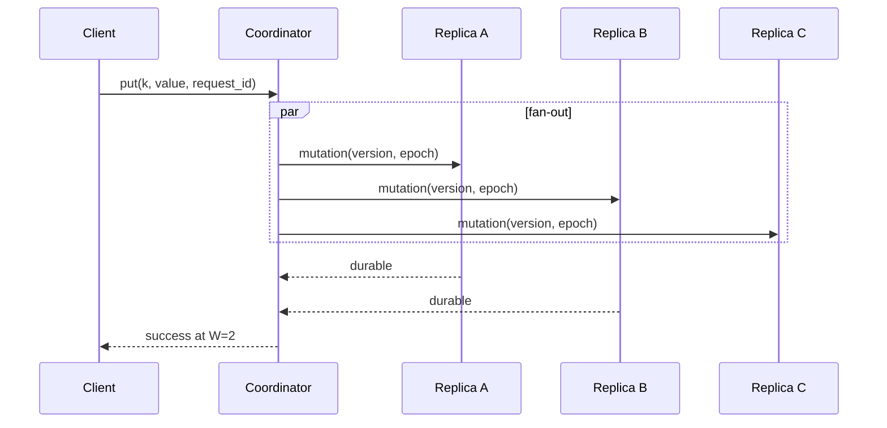

# Leaderless Replication

Leaderless replication assigns each key to a replica set but lets any reachable node coordinate its reads and writes. There is no elected per-key primary in the foreground path. Availability comes from completing against a subset of replicas; the cost is that versions, repair debt, and topology changes become part of normal request processing.

This chapter owns quorum coordination, replica selection, hinted handoff, anti-entropy, and membership interaction. [Conflict Resolution](./04-conflict-resolution.md) owns the semantics of siblings, last-writer-wins registers, and CRDTs. [Partitioning Strategies](./05-partitioning-strategies.md) owns how logical partitions map to nodes, and [SSTables and Compaction](../03-storage-engines/03-sstables-compaction.md) owns on-disk tombstone collection. A system may use leaderless replication above any of those storage choices.

## Contract and failure model

For each operation, define a replication factor `N`, acknowledgement requirement `W`, read response requirement `R`, whether the coordinator may substitute non-home replicas, and the version relation used to reconcile responses. Also define the failure model: crash-stop or crash-recovery nodes, lossy and reordered messages, network partitions, bounded or unbounded clock skew, and whether disks can lose acknowledged writes.

An acknowledgement normally means that at least `W` selected replicas durably recorded a version. It does not mean every replica has it, that a later low-consistency read will find it, or that a timed-out attempt did not commit. Likewise, “eventual consistency” needs a liveness condition: after writes stop, communication recovers, topology stabilizes, and repair continues, every live home replica converges.

Classify invariants before choosing consistency levels. Immutable blobs and add-wins sets can tolerate reconciliation. Unique usernames, non-negative balances, and compare-and-set require a conditional authority or a linearizable protocol; `QUORUM` as a product label does not manufacture those semantics.

## Replica state and invariants

A stored version needs more than `(key, value)`. Depending on the resolution model, it includes a logical tag or causal context, mutation identity, tombstone flag, schema version, origin, and expiry. Each node also keeps its topology epoch, natural replica ranges, durable hints, repair metadata, and bootstrap or decommission state.

The protocol should preserve these invariants:

1. A successful write is durable on at least the promised replica set under the request’s stated topology epoch.
2. Replaying a mutation has one logical effect; a retry identity is not confused with a version identity.
3. A read never compares versions using a relation that can disagree across coordinators.
4. Repair cannot replace a causally newer version with an older one.
5. A tombstone is removed only after no legal replica, hint, snapshot, or repair source can reintroduce the shadowed value.
6. Topology transitions do not let coordinators form incompatible replica sets without an explicit joint phase.
7. Per-tenant limits apply to foreground requests, hints, streaming, and repair—not just API traffic.

Wall-clock timestamps are convenient tags, but they depend on clocks for correctness when used as last-writer-wins authority. A stable tie-breaker makes the order total; it does not make it reflect real-time causality. See [Conflict Resolution](./04-conflict-resolution.md) for the distinction.

## Data path: write and read quorums

For key `k`, a coordinator reads the current topology epoch and computes an ordered preference list. The first `N` eligible nodes are the natural replicas. In a strict quorum write it sends the same immutable mutation to those nodes, waits for `W` durable acknowledgements, and returns the mutation identity and observed version context. Late acknowledgements are still recorded; a client timeout is an unknown outcome, not proof of failure.



A read queries enough natural replicas to obtain `R` acceptable responses. The coordinator compares their version metadata, returns the value or siblings required by the contract, and may repair stale replicas. Waiting only for the fastest `R` reduces latency but biases reads toward healthy, nearby replicas; that is useful only if the consistency promise accounts for it. Digest-first reads save response bytes but add another round trip when digests disagree.

### What `W + R > N` actually proves

If every successful write stores on `W` members and every read samples `R` members of the **same fixed set of `N` natural replicas**, then `W + R > N` guarantees that a read quorum intersects the replica set of every completed write. That set argument is valuable, but it is not by itself a proof of linearizability.

The reader must still identify the newest intersecting version correctly. Concurrent writes may be incomparable. Sloppy quorums may use different nodes. A write in progress may have reached fewer than `W` replicas: one read can observe it, while a later read misses it and returns an older version. The Attiya–Bar-Noy–Dolev atomic-register protocol closes this “new/old inversion” by assigning ordered tags and writing the selected value back to a quorum during reads. Most Dynamo-style eventually consistent stores choose lower read cost instead.

Two other quorum conditions serve different purposes. `W > N/2` forces successful write quorums to intersect, useful for detecting competing versions under an appropriate tag protocol. `R > N/2` makes read quorums intersect each other, but without read write-back it still does not fully order concurrent operations.

### Sloppy quorums and hints

During failure, a sloppy quorum may store a mutation on healthy nodes outside the natural set. The substitute keeps a durable hint saying which home replica should eventually receive it. This increases write availability, but the equation above no longer applies to natural replicas:

```text
home set for k:       {A, B, C}
partitioned write:    {C, D}       W=2, D holds a hint for A
partitioned read:     {A, B}       R=2
intersection:         empty, despite W + R > N
```

Hints are a short-outage optimization, not repair and not a second source of truth. They need byte and age limits, topology-aware delivery, checksums, and an explicit policy when the target is removed. Expiring a hint before another home replica receives its version reduces acknowledged durability.

## Repair and convergence

Read repair compares only keys that clients happen to read. It improves hot-key convergence but leaves cold data untouched and can add writes to latency-sensitive reads. Apply repairs with the original version identity; issuing a new “repair timestamp” can make stale data defeat a legitimate concurrent write.

Active anti-entropy compares all owned ranges. Replicas take compatible snapshots or stable version views, exchange range summaries such as Merkle-tree hashes, descend only into mismatching subranges, and stream the missing versions. A Merkle tree reduces comparison traffic when replicas are mostly equal; building trees and streaming differences still consume disk, network, cache, and compaction capacity.

Deletion makes convergence proof-sensitive. A tombstone can disappear only after every relevant replica has either observed it or can no longer legally contribute an older value. A time-based grace period is a conservative proxy for that proof, so the maximum repair interval and maximum node outage must remain shorter than the grace period. A node returning after the supported horizon should bootstrap from a current replica rather than join with old data.

The repair controller owns range scheduling, concurrency, checkpoints, and fairness. It must distinguish “range compared successfully” from “job launched,” retain enough state to resume after crashes, and avoid synchronizing every replica pair at once. Repair traffic needs an I/O budget below the point where it causes the foreground timeouts that create yet more hints.

## Membership and topology changes

Coordinators cannot safely switch replica maps independently. A new node first joins as a non-serving learner, receives a snapshot at a declared frontier, streams later mutations, validates range digests, and only then enters a joint routing epoch. During the joint phase, writes reach enough members of old and new sets to preserve the stated durability contract. After old coordinators have stopped using the prior epoch, ownership can finalize.

Removing or replacing a node likewise drains hints, streams its ranges, and fences the old identity. Reusing a node ID with an empty disk is dangerous: peers may interpret it as the old replica that has already seen tombstones. Use a fresh incarnation epoch and require explicit bootstrap. Logical partition movement itself is covered in [Partitioning Strategies](./05-partitioning-strategies.md).

## Specialized failure traces

### Timeout followed by a non-idempotent retry

Two replicas durably store `increment(+1)`, but their acknowledgements arrive after the client deadline. The client retries with a new identity and two replicas apply another increment. Both attempts were valid; the counter is now two. Reuse an idempotency key, or replicate a convergent counter operation whose identity is deduplicated.

### Read observes an incomplete write, then time goes backward

Write `v2` reaches only A before its coordinator pauses. Read X queries A and B and returns `v2`. Read Y starts after X finishes but queries B and C, returning completed `v1`. `W=2, R=2, N=3` did not help because `v2` had not completed on W replicas. Atomic-register read-back, a leader, or consensus is required if this inversion violates the API.

### Repair resurrects a delete

A and B store tombstone `t9`; C is offline with value `v7`. The grace period expires, compaction drops `t9`, and C returns before being rebuilt. Anti-entropy sees a value on C and absence elsewhere, so `v7` becomes live again. The root cause is an unsupported outage beyond the repair-and-retention contract, not “eventual consistency being slow.”

### Topology split creates two quorums

Half the coordinators use epoch 41 with replicas `{A,B,C}`; the rest use epoch 42 with `{C,D,E}`. Each accepts `W=2` on disjoint pairs. Later reads cannot infer a unique latest value from quorum intersection. Membership must be versioned, and activation must bridge old and new replica sets.

### Clock skew silently loses a write

A’s clock is five minutes fast. Its earlier value receives timestamp 500; B’s causally later correction receives 220 and loses under LWW everywhere. NTP monitoring limits frequency but cannot prove order. Use causal versions, a logical sequencer, or a merge that does not interpret physical time as truth.

## Capacity, overload, and cost

Let logical writes and reads be `Qw` and `Qr` operations/s, value plus metadata size be `B`, replication factor be `N`, and a replica sustain `Cw` durable writes/s at the chosen compaction budget. Approximate foreground work is:

```text
replica write requests/s       ~= Qw * N          if fan-out targets all N
minimum write acknowledgements = Qw * W
read responses/s               >= Qr * R          plus speculative requests
stored live bytes              ~= logical_bytes * N * space_amplification
write network bytes/s          ~= Qw * N * B
```

Sending only until `W` acknowledgements reduces immediate work only if the remaining replicas are deliberately repaired later; it does not erase the replication obligation. Quorum latency is an order statistic of replica latencies, not simply their mean. Increasing `R` or `W` can improve confidence while moving the request deeper into the straggler tail.

For data size `D` per replica and maximum full-repair interval `Trepair`, baseline sequential repair scan must exceed `D / Trepair`, before mismatch streaming. A failed node absent for `Tout` at incoming mutation rate `λ` creates roughly `λTout` versions of catch-up debt. Reserve measured headroom for hints, bootstrap, and repair simultaneously; a cluster whose foreground load consumes all sustainable I/O has no recovery capacity.

Backpressure begins per destination and per tenant. Bound coordinator in-flight requests, hint bytes, repair streams, and mutation queues. Reject or degrade weak-consistency traffic before memory exhaustion. Do not lower `W` automatically during an incident unless the API explicitly allows a durability-mode change and records which writes received it.

## Security, isolation, and observability

Replica RPC is an authorization boundary. Use mutual authentication, encryption, topology-epoch validation, and per-node identities; a compromised coordinator must not write arbitrary tenant ranges. Repair and bootstrap paths need the same row-level policy and auditability as foreground writes because they bypass normal application authorization.

Include `tenant_id` in the authenticated key namespace, encrypt sensitive values and hints, and isolate keys where equality or size leaks matter. Fair schedulers should cap per-tenant request, hint, and repair debt. Deletion obligations include every replica, hint store, snapshot, and quarantine stream; tombstone retention cannot be shortened merely to meet a storage target.

Observe coordinator latency separately from replica latency. Core signals are successful acknowledgements by consistency level, timeout-with-late-success count, unavailable versus timed-out requests, stale-version and sibling rates, per-node version age, hint bytes and oldest age, repair coverage frontier, streamed mismatch bytes, tombstone age, topology-epoch rejects, speculative requests, disk saturation, and per-tenant queueing. Periodic digest comparisons and end-to-end canary keys detect silent divergence that request success rates miss.

Verification should model arbitrary message loss, duplication, reordering, coordinator crashes, and membership changes. Jepsen-style history checking can test the advertised register or set semantics. Deterministic simulations should pause a write after every acknowledgement subset, overlap reads, advance tombstone GC, restore old disks, exhaust hint storage, and restart repair. Assert not only convergence but also acknowledgement durability, no new/old inversion when linearizability is claimed, monotonic topology epochs, idempotent retries, and tenant isolation.

## Decision framework

Leaderless replication fits high-availability key-value workloads where any node may coordinate, per-request consistency is useful, and repair capacity is a first-class subsystem. It is strongest when mutations are naturally idempotent or mergeable and the working set partitions evenly.

Choose [single-leader replication](./01-single-leader-replication.md) or a consensus-backed register when real-time order, conditional updates, or non-mergeable invariants dominate. Choose [multi-leader replication](./02-multi-leader-replication.md) when writable sites have explicit regional identity and asynchronous cross-site streams are the central concern. Whatever the choice, state the consistency contract in histories a client can observe—not in `ONE`, `QUORUM`, or `ALL` labels alone.

## Primary references

- DeCandia, G., et al. [Dynamo: Amazon’s Highly Available Key-value Store](https://www.allthingsdistributed.com/files/amazon-dynamo-sosp2007.pdf). SOSP, 2007.
- Attiya, H., Bar-Noy, A., and Dolev, D. [Sharing Memory Robustly in Message-Passing Systems](https://doi.org/10.1145/200836.200869). Journal of the ACM, 1995.
- Lakshman, A., and Malik, P. [Cassandra: A Decentralized Structured Storage System](https://www.cs.cornell.edu/projects/ladis2009/papers/lakshman-ladis2009.pdf). LADIS, 2009.
- Apache Cassandra. [Dynamo](https://cassandra.apache.org/doc/latest/cassandra/architecture/dynamo.html) and [Repair](https://cassandra.apache.org/doc/latest/cassandra/managing/operating/repair.html) architecture documentation.
- Basho Technologies. [Riak KV Concepts: Vector Clocks](https://riak.com/posts/technical/vector-clocks-revisited/index.html).
