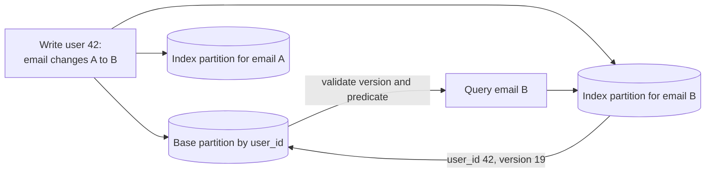

# Secondary Indexes in Distributed Databases

A primary-key lookup begins with a routing answer: the key identifies a logical partition and therefore a replica set. A query on email, status, location, or event time has no such route unless the system maintains another access path. A distributed secondary index is that path: another materialized copy whose consistency, placement, recovery, and cost must be designed.

A distributed secondary index must define maintenance and query semantics for local versus global placement, synchronous and asynchronous updates, online backfill, global uniqueness, scatter-gather, and freshness. [B-Trees](../03-storage-engines/01-b-trees.md) owns ordered page structures, [LSM Trees](../03-storage-engines/02-lsm-trees.md) owns the write-buffered storage pipeline, and [Search Index Architecture](../14-search-systems/01-inverted-indexes.md) owns analyzers, postings, relevance, and search-segment internals. [Partitioning Strategies](./05-partitioning-strategies.md) owns the routing map on which all three depend.

## Query and consistency contract

Inventory real query shapes before creating an index. Record equality and range predicates, sort order, limit, projection, expected selectivity, tenant boundary, result freshness, pagination stability, and whether the index must enforce uniqueness. A query such as “newest 50 open orders for merchant M” has a different physical requirement from “find any user with email E,” even if both mention one secondary field.

The important consistency choices are observable:

- **transactionally current:** after a base-row commit, every later qualifying index read reflects that mutation;
- **session current:** a caller can present a commit token and wait or fall back until the index includes it;
- **bounded stale:** index progress is no more than a declared time or log-distance behind;
- **eventual:** after mutations stop and maintenance recovers, the index converges;
- **candidate only:** the index may return stale positives, but the base record is revalidated before a result is exposed.

“Eventually consistent” must also define false negatives. Revalidating a candidate removes a stale positive; it cannot discover a missing entry. Search, authorization, billing, and deletion workflows often tolerate those two errors differently.

## State and invariants

A minimal global index entry is not merely `secondary_value -> primary_key`:

```text
(tenant_id, index_key, primary_key)
    -> projected_columns
       base_row_version
       index_schema_version
       optional expiry or tombstone metadata
```

The service also stores the index definition and build ID, partitioning epoch, lifecycle state, snapshot frontier, per-source change-log checkpoint, failed-event quarantine, and optimizer statistics. A local index may share a transaction and storage engine with its base partition; a global index is independently partitioned state and needs all of this explicit control metadata.

The core invariants are:

1. Every visible entry names one base identity and the base version from which it was derived.
2. Maintenance is idempotent and monotonic: an older backfill or retry cannot replace a newer derived entry.
3. Changing an indexed value removes the old key and creates the new key according to one declared atomicity or lag contract.
4. A strong index cannot omit a committed matching row. A candidate index cannot expose a row without rechecking authorization and the current predicate.
5. A unique index has one serializing owner for each normalized unique value.
6. Build activation occurs only after snapshot and change-stream coverage form a gap-free history.
7. Tenant identity participates in routing and comparison unless uniqueness is intentionally global across tenants.

Normalization is part of the schema. Case folding, collation, Unicode version, timezone conversion, null ordering, and expression semantics must produce the same key during foreground writes, backfill, and reads. Changing any of them creates a new index version; silently rebuilding in place can make equal values compare differently across partitions.

## Placement: local and global

A **local secondary index** lives with each base partition and covers only rows owned there. Base and index changes can normally commit atomically in one storage-engine transaction. A query containing the primary partition key is targeted; a query without it fans out to every candidate partition.

A **global secondary index** is partitioned by the secondary key, independently of the base table. Equality lookup can target one index partition and then fetch base rows by primary key. The write may touch a base partition plus one index partition, or two index partitions when an indexed value changes. That creates a distributed atomicity choice.



Partitioning an index by term is efficient for equality predicates but can hotspot a common value such as `status = pending`. Adding a deterministic bucket spreads writes, at the cost of querying all buckets. Range indexes need ordered partitions and split policy. Local indexes distribute writes naturally but turn unqualified queries into scatter-gather. These are routing tradeoffs, not B-tree versus LSM tradeoffs.

## Maintenance protocols

### Synchronous global maintenance

The base mutation, deletion of the old index entry, and insertion of the new entry participate in one transaction. Locks or intents cover every affected key; commit makes all changes visible together. This is the only straightforward way for the index to provide transactionally current reads or enforce a global uniqueness constraint.

The price is additional consensus groups or storage partitions in the commit fan-out, more contention on hot index keys, and an ambiguous outcome when the client loses the commit response. [Distributed Transactions](./07-distributed-transactions.md) covers atomic commit and isolation; the index definition must still decide which keys are locked and how stale readers behave.

### Asynchronous maintenance

The base transaction atomically appends a change record through its WAL or transactional outbox. An indexer consumes changes in source order, derives old and new keys, applies version-conditional mutations, and advances a durable checkpoint only after the index writes commit. Capture mechanics and snapshot boundaries are covered in [Change Data Capture](../13-data-pipelines/04-change-data-capture.md).

For a change from email A at version 18 to email B at version 19, the consumer removes `(A, pk)` only if its stored version is at most 19 and inserts `(B, pk)` with version 19. A delayed version-18 retry cannot recreate A or overwrite B. If the source log omits before-images, the indexer needs the prior derived key in its own state or must read a version-consistent base record; an arbitrary current read can race another update.

At-least-once delivery is expected. Stable mutation IDs and base versions make it harmless. A poison record stops or visibly gaps that source checkpoint; sending it to a dead-letter queue and advancing silently converts an operational error into a permanent false negative.

## Query protocol

An equality query routes to the index partition, reads entries in `(index_key, primary_key)` order, and obtains primary keys plus projection and versions. A non-covering query batches primary-key fetches by base partition. Before returning candidate-only results, it confirms that each base row is visible to the caller, still satisfies the predicate, and is at least the indexed version. A covering asynchronous index avoids base fetches but necessarily exposes its own freshness contract.

For a local index without the base partition key, the coordinator sends the predicate and limit to all relevant partitions, each returns its local top `K`, and the coordinator performs a stable merge. Latency follows the slowest required shard; work grows with fan-out, and `LIMIT 10` does not mean only ten rows are read globally. Hedging or skipping a slow shard changes completeness and must be an API decision.

Pagination uses a cursor containing the normalized sort tuple, primary-key tie-breaker, index/build epoch, and (where promised) snapshot or change frontier. Offset pagination across mutating shards duplicates or skips rows because earlier pages shift. If the referenced build is retired, the service should reject or deliberately translate the cursor rather than continue under different ordering semantics.

### Session freshness

An asynchronous base commit can return source coordinate `s`. A subsequent index query carrying `s` has three defensible outcomes: wait until the index checkpoint dominates `s`, route to a synchronous/base-table fallback, or return an explicit not-current response. Sleeping for an assumed replication delay supplies no guarantee and produces pathological tail latency during backlog.

## Uniqueness is a reservation protocol

A local unique index proves uniqueness only inside one base partition. An asynchronous global index cannot prevent two successful base writes from claiming the same value; it can merely discover them later.

To enforce global uniqueness, normalize the value and route it to one reservation key such as `(tenant, normalized_email)`. A conditional insert or serializable transaction changes that key from absent to `RESERVED(owner, request_id, expiry)`, then commits the base row and finalizes `OWNED(owner, base_version)`. Release is conditional on the owner and version so a delayed cleanup cannot delete a newer reservation. If reservation and base row cannot share a transaction, define expiry, reconciliation, and the user-visible outcome of each partial failure.

This is a small consistency service embedded in the index. High-contention names, quota slots, or inventory may require sharding by the constrained value, but they cannot be made coordination-free.

## Online build, replacement, and removal

Create a new index under a unique build ID and move it through explicit states:

```text
REGISTERED -> SNAPSHOT(L) -> BACKFILLING -> CATCHING_UP(>L)
           -> VALIDATING -> SHADOW_READ -> ACTIVE -> RETIRING -> DROPPED
```

At frontier `L`, establish a consistent base snapshot and begin retaining all later changes. Backfill snapshot rows with their base versions. Concurrently or afterward, apply changes after `L` using version-conditional writes. A snapshot value must never overwrite a newer streamed value. Activation requires full range coverage, contiguous source checkpoints, zero unresolved quarantine, compatible schemas, and validation such as partition counts, sampled query comparison, and range digests.

Shadow reads compare old and new paths without serving the new answer. Cut over by index version, not by mutating a name in place, so rollback is a metadata change while both builds remain maintained. To drop an index, first stop new query plans, wait out cursor and transaction leases, stop maintenance at a recorded frontier, then reclaim partitions. Database-wide migration patterns appear in [Database Schema Migrations](../15-deployment/03-database-migrations.md).

## Specialized failure traces

### Application dual-write creates a false negative

The application commits the base row, crashes before updating the global index, and never retries. Reading the base by ID works; querying the index never finds it. An atomic outbox or database log is required. Two unrelated client calls are not a replication protocol.

### Backfill defeats a concurrent update

The scanner reads `city=Paris, version=7`. A live change writes `city=Rome, version=8` to the index. The slow scanner then inserts the Paris entry without a version predicate. Both entries remain, or the stale one wins. Every derived mutation carries the base version and rejects regression.

### Low-cardinality term becomes one hot partition

Millions of orders enter `status=pending`, all targeting one global index partition. Base shards remain balanced while index latency and transaction aborts spike. Bucket `(status, hash(order_id) mod b)`, query `b` buckets in parallel, or model pending work as a dedicated partitioned queue rather than one posting list.

### Pagination crosses a rebuild

Page one is read from build 12 under collation A. Build 13 becomes active with collation B; the cursor is applied there and skips names whose relative order changed. Bind cursors to the build and retain it for the cursor lifetime, or terminate pagination with a retryable version error.

### Index omits tenant scope

The key is `(email, user_id)` instead of `(tenant_id, email, user_id)`. A lookup for one tenant returns another tenant’s primary key; the subsequent base fetch uses an internal bypass role and leaks the row. Tenant scope belongs in the authenticated key and must be rechecked at the base.

## Capacity, cost, and overload

Let base write rate be `Qw`. For index `j`, let `m_j` be average physical index mutations per base write: zero if unaffected, one for an insert, and usually two when an indexed key changes. With entry size `E_j` and replication factor `n_j`:

```text
index mutation rate       = Qw * sum(m_j)
index storage write bytes ~= Qw * sum(m_j * E_j * n_j)
steady index bytes        ~= rows * entries_per_row * entry_size * replication
async catch-up requirement: apply_capacity > arrival_rate
```

These exclude WAL, page or compaction amplification, which depend on the chosen [storage engine](../03-storage-engines/01-b-trees.md). A covering index adds projected bytes to every entry and rewrites them whenever an included value changes. Its saved base reads must repay storage, write, cache, and network cost.

For a local scatter query over `P` partitions, request count is `P` and latency is approximately the maximum shard latency plus merge time. A global equality query usually costs one index lookup plus base fetches to `F` distinct partitions. If selectivity returns `K` rows of base size `Brow`, response-side work is at least `K * Brow`; an index does not make an unselective query cheap.

An asynchronous lag backlog of `L` mutations drains in at least `L / (Capply - Qarrival)` seconds while traffic continues. If `Capply <= Qarrival`, it never recovers. Admission control should bound per-tenant query fan-out, candidate count, page size, backfill bandwidth, and maintenance queue age. Pause a backfill before it starves current index updates.

## Security, observability, and verification

Indexes duplicate sensitive values and often make them easier to enumerate. Encrypt storage and transport, authorize index predicates rather than trusting an internal query plan, audit broad scans, and avoid raw secrets as keys. Deterministic hashes support equality lookup but leak equality and are vulnerable to dictionary attacks on small domains; keyed tokens with rotation-aware versions are safer when exact search is required. Residency, retention, legal holds, and deletion apply to index entries, CDC logs, old builds, and query caches.

Operate from freshness and correctness signals: source and applied checkpoints, oldest lag by tenant and partition, maintenance retry/quarantine age, stale-positive rate after base validation, sampled false-negative comparisons, entry/base version mismatch, fan-out and candidate histograms, hot-key skew, backfill coverage, digest mismatches, unique-reservation contention, and query latency separated into index, fetch, and merge stages.

Tests should interleave base commits, key changes, deletes, replay, and backfill at every boundary; crash before and after checkpoint commits; reorder old and new versions; reshard the index while cursors are active; overload a low-cardinality key; and change collation or expression code. Model checks assert no false negatives for strong indexes, monotonic async application, correct old-key removal, single-owner uniqueness, cursor order, tenant isolation, and rollback to the prior build.

## Decision framework

Use a local index when writes must remain single-partition and queries already carry the base partition key, or when bounded scatter is acceptable. Use a synchronous global index for targeted reads that require transactional freshness or uniqueness and can afford cross-partition coordination. Use an asynchronous global index when low write latency matters and the product can name its stale-positive and false-negative behavior. Use denormalized query tables when one access pattern deserves an explicit schema and ownership lifecycle. Use a search engine when tokenization, relevance, and text retrieval (not merely alternate routing) are the requirement.

Before adding an index, quantify the query it makes cheaper and the writes, bytes, coordination groups, backfill time, and new correctness contract it adds. “Maybe useful later” is especially expensive in a distributed database.

## Primary references

- Mohan, C., and Narang, I. [Algorithms for Creating Indexes for Very Large Tables Without Quiescing Updates](https://doi.org/10.1145/130283.130337). SIGMOD, 1992.
- Graefe, G. [Modern B-Tree Techniques](https://doi.org/10.1561/1900000028). Foundations and Trends in Databases, 2011.
- Amazon DynamoDB. [Global Secondary Indexes](https://docs.aws.amazon.com/amazondynamodb/latest/developerguide/GSI.html) and [Local Secondary Indexes](https://docs.aws.amazon.com/amazondynamodb/latest/developerguide/LSI.html).
- Google Cloud Spanner. [Secondary indexes](https://cloud.google.com/spanner/docs/secondary-indexes).
- PostgreSQL. [Building Indexes Concurrently](https://www.postgresql.org/docs/current/sql-createindex.html#SQL-CREATEINDEX-CONCURRENTLY).
- MongoDB. [Read Operations to Sharded Clusters](https://www.mongodb.com/docs/manual/core/sharded-cluster-query-router/).
