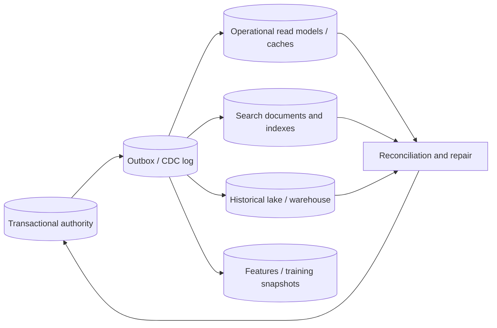

# Workload-Driven Data Modeling and Derived Projections

## TL;DR

Data modeling turns domain facts and invariants into storage shapes that make named operations correct and affordable. “Relational versus NoSQL” is too coarse: relational systems can denormalize and partition; key-value/document systems can maintain multiple indexes and transactions; distributed query engines can join, but with network, memory, and tail-latency costs.

Start from an access-and-mutation catalog: key/range predicates, cardinality, ordering, pagination, consistency, transaction boundary, latency/throughput, freshness, retention, and tenant/security scope. Keep one authoritative fact unless a measured workload justifies a projection. Every duplicate then needs identity, publication, staleness, reconciliation, rebuild, schema evolution, and deletion lineage.

Partition keys co-design locality and load distribution. Aggregate boundaries co-design transaction scope and contention. Secondary indexes, caches, search documents, and analytical tables are derived models for different workloads; they should not silently become competing sources of truth.

[Partitioning and Placement](./05-partitioning-strategies.md) owns partition algorithms and routing. [Database Sharding](../06-scaling/03-database-sharding.md) owns live application shard operations and resharding. This chapter owns the logical entity/aggregate/key/projection model that those mechanisms place.

---

## 1. Build the Operation Catalog

List production operations, not entities alone:

```text
Operation {
  principal and tenant scope
  read | write | read-modify-write | scan | aggregate
  predicates and expected selectivity
  result cardinality and size distribution
  sort order and pagination contract
  consistency/session/freshness requirement
  transaction and invariant boundary
  peak rate, concurrency, latency/deadline
  retention, deletion, audit and residency
  failure/retry semantics
}
```

Example:

| Operation | Predicate/order | Expected result | Contract |
|---|---|---:|---|
| open order | tenant + order ID | 1 order + ≤100 items | current, <50 ms p99 |
| recent customer orders | tenant + customer, newest first | first 50, stable cursor | ≤2 s stale acceptable |
| claim idempotency key | tenant + operation ID | create once | linearizable/unique |
| orders needing shipment | tenant/status/time | up to 10k/min | derived index ≤30 s lag |
| revenue by region/day | time/region aggregate | millions scanned | hourly analytical snapshot |

“Get all orders” is not a useful pattern. State the tenant, time bound, pagination, and maximum. Unbounded operations become incidents.

### 1.1 Core invariants

1. **Canonical identity:** every entity and version has stable identity; aliases and local IDs cannot collide across tenant/generation.
2. **One authority per fact:** duplicated shapes name their source and cannot accept independent conflicting writes.
3. **Invariant locality:** operations that must commit atomically fit one supported transaction boundary or use an explicit cross-boundary protocol.
4. **Bounded access:** online operations have a bounded partition/index/candidate and result plan.
5. **Deterministic ordering:** pagination has a total order and snapshot/revision contract.
6. **Projection lineage:** every derived row/document records enough source identity/revision to deduplicate, reconcile, and rebuild.
7. **Versioned semantics:** schema and data meaning evolve explicitly; readers do not infer from field presence alone.
8. **Tenant/security preservation:** primary keys, indexes, caches, search, analytics, and object references retain authorization scope.
9. **Deletion propagation:** authoritative deletion/tombstone reaches every projection and restore path under a measured objective.
10. **Observable divergence:** projection lag, missing/extra rows, hot keys, unbounded growth, and constraint failures are measurable.

---

## 2. Normalize Authority, Denormalize Work

Normalization and denormalization are not product categories. They are choices about update anomalies and read work.

### 2.1 Normalized authority

Store one fact once when:

- it changes frequently or under strict constraints;
- many unforeseen queries/relationships will evolve;
- transactions and foreign-key checks are valuable;
- the dataset/query fits one database or a distributed SQL engine within objectives;
- write correctness matters more than eliminating every join.

Normalization does not make inconsistency impossible—applications can still duplicate semantics, skip constraints, or integrate external systems—but it reduces the number of copies one transaction must maintain.

### 2.2 Denormalized projection

Materialize a duplicate when measured read cost, cross-boundary locality, latency, availability, or query-engine mismatch justifies it. A projection contract states:

```text
source authority and source revision
projection key and schema version
publication/commit protocol
freshness objective
idempotency/deduplication identity
ordering and deletion behavior
reconciliation and rebuild procedure
reader fallback during lag/failure
```

Examples include order summaries, unread counters, timeline entries, search documents, feature vectors, and warehouse facts.

A derived copy is not “just a cache” if product actions write it directly, no rebuild exists, or its loss loses user intent. Name authority honestly.

### 2.3 Read-time versus write-time join

A relational join resolves relationships during query execution. A denormalized projection performs the relationship expansion when source changes. Neither is free:

```text
read-time cost ≈ query rate × join/scan/network work per query

write-time cost ≈ source mutation rate × projection fan-out
                + replay/reconcile/rebuild work
```

The write-time option shifts latency and failure into a pipeline. It can lower online read cost while increasing storage, write amplification, staleness, and operational surface.

---

## 3. Aggregate and Transaction Boundaries

An aggregate is the state that one command must keep consistent, not every object reachable through domain relationships.

For an order:

```text
Order aggregate:
  order header
  line items needed to compute total/status
  version / state transition history reference

Outside:
  customer profile
  inventory ownership
  payment provider
  shipment service
```

`order.total == sum(lines)` may belong in one transaction. Inventory allocation or payment confirmation crosses authorities and needs reservation, idempotency, workflow/effect commit, or compensation—not an ever-growing order row that copies the world.

### 3.1 Avoid aggregates that are too large

A tenant, user, conversation, or account containing unbounded children becomes one hot/oversized transaction unit. Store children as separately keyed rows/documents and maintain bounded summaries. Use pagination and explicit versions.

### 3.2 Avoid aggregates that are too small

Splitting every line/property into independent stores can make one command require distributed transactions and partial-state handling. Co-locate data mutated and read together when its size/contention remain bounded.

### 3.3 Contention is part of the boundary

One aggregate with 10,000 writes/s serializes even if it is small. Shard commutative counters, allocate rights, append events, or redesign the invariant. A primary key defines not only lookup but the contention domain for locks, conditional updates, log ordering, and replicas.

---

## 4. Key Design

Separate concepts:

```text
business identifier     human/domain reference, may change or be reused
canonical entity ID     immutable identity
tenant/generation       isolation and lifecycle scope
partition key           placement/routing/load domain
clustering/sort key     order/range within partition
version/revision        optimistic concurrency/snapshot identity
```

### 4.1 Distribution and locality

A useful partition key balances:

- queries that should remain local;
- enough cardinality for parallelism;
- write/read skew and whale tenants;
- growth and split/move ability;
- tenant/residency/failure boundaries.

Hashing distributes but destroys natural range locality. Range partitioning supports ranges but creates hot ends under monotonic time/ID. Composite keys can preserve a useful prefix then add bucket/hash suffix.

### 4.2 Time-series bucketing

Instead of one forever-growing device partition:

```text
partition = (tenant, device, UTC_day_or_hour_bucket)
sort      = (event_time, stable_event_id)
```

Choose bucket from measured events/bytes/queries/compaction limits:

$$
rows_{bucket} = peak\ events/s \times bucket\ seconds
$$

For 250 events/s and one hour, $rows_{bucket}=900{,}000$. If an average encoded row plus index overhead is 350 bytes, logical data is about 300 MiB before engine replication/compaction. Shorten the bucket or subshard if that exceeds the tested envelope. Do not copy an ecosystem folklore limit; benchmark the exact engine/schema and workload.

### 4.3 Hot-key spreading

Write sharding adds suffixes:

```text
(tenant, post_id, shard=hash(event_id) mod 32)
```

Writes spread across 32 partitions; reads aggregate 32. Use only when write bottleneck justifies read fan-out and when operations are mergeable. Changing shard count needs versioned routing or rendezvous/directory state; `mod N` without version loses lookup ability after N changes.

### 4.4 IDs and ordering

Random IDs distribute but lack time locality. Time-ordered IDs improve index locality but can concentrate range-partition writes and leak timing. Include a stable unique tie-breaker in any ordered cursor. Never use client wall time alone for last-writer semantics or pagination.

---

## 5. Modeling Patterns by Store Shape

### 5.1 Relational rows

Use typed columns and constraints for stable, queried invariants. JSON can hold genuinely variable extension data, but promote frequently filtered/joined fields into typed/indexed columns or generated expressions. Avoid EAV as a default; it moves types, constraints, selectivity statistics, and joins into application code.

Indexes are additional sorted/projection state. Each accelerates named predicates/order while adding write, storage, cache, vacuum/compaction, and migration cost. Use query plans and production cardinality, not “index every foreign key” as the entire model.

### 5.2 Documents: embed versus reference

Embed when children are owned, bounded, written/read together, and share lifecycle. Reference when data is independently updated/shared, unbounded, large, separately secured, or queried independently.

Large documents amplify writes: updating one field may rewrite/replicate/index a full document or large storage unit. Concurrent writers to different fields may still conflict at document/version granularity. Test maximum and percentile size plus update frequency.

### 5.3 Wide-column/item collections

Composite partition/sort keys can co-locate multiple item types for query-first access:

```text
PK=TENANT#t#CUSTOMER#c  SK=PROFILE
PK=TENANT#t#CUSTOMER#c  SK=ORDER#time#id
PK=TENANT#t#ORDER#o     SK=META
PK=TENANT#t#ORDER#o     SK=ITEM#line
```

This may require duplicating order summary under customer and order collections. The two copies need one authoritative command plus transactional write when supported or ordered projection/reconciliation. A new access pattern can require a new secondary index or backfill, but not every query becomes one constant-time lookup: range result size, pagination, hot partitions, index propagation, and filter selectivity still matter.

### 5.4 Graph relationships

Graph models fit variable-hop relationship queries—authorization paths, social connections, dependency graphs—when traversal is central. They do not make unbounded traversal cheap. Bound depth/fan-out, index labels/properties, and decide whether edge/node updates need transactions. For predictable fixed joins, relational adjacency tables may be simpler.

### 5.5 Time-series/event models

Append immutable event identity, event time, ingestion time, source and schema. Late/corrected events need replacement/retraction semantics rather than silent overwrite. Separate raw event authority from rollups; rollups record window, watermark/completeness, source frontier and version so they can rebuild.

---

## 6. Secondary Indexes and Query Plans

[Secondary Indexes in Distributed Databases](./06-secondary-indexes.md) owns local/global maintenance mechanics. The model decides which queries justify them.

For each index:

```text
key columns / expression
included/projected fields
predicate/partial condition
sort/order
expected cardinality/selectivity
write and storage amplification
consistency/freshness
backfill/rebuild plan
tenant/security scope
```

### 6.1 Stable pagination

Offset pagination becomes slower and unstable under inserts/deletes. Prefer keyset cursors:

```sql
WHERE tenant_id = :tenant
  AND (created_at, order_id) < (:last_time, :last_id)
ORDER BY created_at DESC, order_id DESC
LIMIT 50
```

Bind the cursor to tenant, filters, sort and optionally snapshot/index revision. Without a snapshot, document whether later pages reflect concurrent changes and may omit/move results.

### 6.2 Covering versus write cost

Including projected columns can avoid base-row fetches, but duplicates every update into the index. Wide covering indexes consume cache/storage and increase migration time. Measure base lookup latency, hit ratio, row width, mutation rate and query volume.

### 6.3 Scatter-gather

If a query lacks the partition key, a coordinator may contact all shards or a global index. Approximate request work:

$$
fanout\ RPCs/s = query\ rate \times shards\ contacted
$$

At 2,000 queries/s across 200 shards, 400,000 shard RPCs/s occur before retries. Tail latency is influenced by the slowest required shard. Add a query-specific projection/global index, route by directory, move to analytics/search, or constrain the product operation.

---

## 7. Projection Publication and Maintenance

### 7.1 Same-transaction projection

When source and index/read model share a transactional store, update both atomically. This provides immediate consistency but increases transaction rows, locks, log bytes and failure coupling. Keep the projection derivable and periodically verify it.

### 7.2 Outbox and CDC

For external projections:

```text
source transaction
  -> authoritative mutation + outbox/change position
  -> ordered relay/CDC
  -> idempotent projection apply
  -> checkpoint
  -> reconciliation
```

Projection identity might be `(source_table, primary_key, source_version)` or a domain event ID. Apply only newer/expected revisions and handle deletion/tombstones. Multiple entities contributing to one document need a version/completeness protocol; independent field updates can publish combinations that never existed.

See [Outbox, Inbox, and Change Data Capture](../05-messaging/07-outbox-pattern.md) and [Change Data Capture](../13-data-pipelines/04-change-data-capture.md).

### 7.3 Rebuild

A rebuild pins a source snapshot/frontier, bulk builds under a new projection generation, consumes ordered changes after the frontier, validates, then atomically switches reader alias/pointer. Do not rebuild in place while readers see partial state.

Track old/new dual-read differences by key and reason. Delete old generation only after rollback and reader references expire.

### 7.4 Freshness semantics

“Eventually consistent” needs a number and behavior:

- maximum source-to-visible lag by percentile;
- read-your-writes/session path if required;
- UI/API indication of stale/incomplete state;
- fallback to source for critical reads;
- what happens when projection is unavailable or rebuilding.

A stale authorization or price projection may be unsafe even if a stale like count is acceptable. Classify per field/operation.

---

## 8. One Model per Workload, One Authority per Fact



- OLTP optimizes constrained writes and current state.
- Search optimizes lexical/vector/ranking retrieval and denormalized evidence.
- Analytics optimizes scans, history and columnar aggregation.
- ML features/datasets optimize point-in-time availability and reproducibility.

Each projection can be authoritative for its own derived artifact at a named source frontier, but product truth remains traceable to owned sources. Never allow analysts, search jobs, or cache repair to write domain authority implicitly.

### 8.1 External systems

Payments, identity providers, shipping, and customer systems may own facts outside your database. Store operation IDs, provider object IDs, receipts, observed versions and reconciliation state. A local row saying `paid=true` is a projection of provider/domain protocol, not proof by itself.

---

## 9. Schema and Semantic Evolution

### 9.1 Additive compatibility

Writers add optional/defaulted fields; readers tolerate unknowns; old writers remain valid until retired. Field absence, null and default may have different meanings—document them. Enumerations need unknown/future handling.

### 9.2 Semantic versioning of data

Changing cents to dollars, gross to net, UTC to local, or “active” definition can retain the same type while breaking consumers. Create a new field/feature/version or bind a semantics version and migrate explicitly. Schema validation alone cannot catch it.

### 9.3 Backfill

Backfills are production workloads:

- pin source and transformation revision;
- partition/checkpoint work;
- use idempotent conditional writes;
- throttle by primary/log/replica/index headroom;
- distinguish unknown/not-yet-backfilled from genuine default;
- monitor old/new coverage and errors;
- validate before making new readers depend on it.

### 9.4 Contract/removal

Prove old readers/writers/jobs, replicas, exports and backups no longer require a field/index before removing. Deployment inventory and telemetry are stronger than elapsed time. See [Database Schema Migrations](../15-deployment/03-database-migrations.md).

---

## 10. Capacity and Cost Model

For each authoritative/projection shape estimate:

```text
logical rows/objects
average and p99 encoded size
primary + index/projection write amplification
replication / erasure coding
cache working set and hit/miss fanout
query scanned/returned bytes and rows
mutation, CDC and rebuild rates
retention/version history
```

Suppose an order authority writes 5,000 mutations/s and maintains:

- primary + 3 relational indexes: 4 writes/mutation;
- an outbox row: 1 write/mutation;
- 2 async projections with average fan-out 3 and 1.

Synchronous database write units are roughly:

$$
5{,}000 \times (4+1) = 25{,}000\ writes/s
$$

Async projection writes are:

$$
5{,}000 \times (3+1) = 20{,}000\ writes/s
$$

before retries, compaction and replication. Denormalization moved work; it did not remove it.

### 10.1 Rebuild capacity

If a 12 billion-row projection rebuilds at 150,000 rows/s while source changes add 30,000 relevant rows/s, effective catch-up is 120,000 rows/s and ideal duration is:

$$
\frac{12\times10^9}{120{,}000}
=100{,}000\ seconds \approx 27.8\ hours
$$

If rebuild throughput is not greater than incoming change work, it never converges. Reserve source scan, network, target write/index/compaction and CDC capacity; avoid peak/failover overlap.

### 10.2 Bound rows and fan-out

The p99 document/partition/index-entry size and relationship degree often matter more than average. Enforce product caps or chunking for line items, group members, attachments, comments, and graph edges. A schema with an unbounded collection has an unbounded latency/cost path even if today's data is small.

---

## 11. Security, Privacy, and Governance

- Derive tenant/principal context from authenticated/authorized state and include it in primary/index/cache/search/object keys.
- Enforce row/document/resource policy at the owning service and data layer; projections must not widen visibility.
- Minimize copied sensitive fields. A denormalized search/analytics document expands breach and deletion scope.
- Record purpose, retention, residency and encryption/key lineage with datasets/projections.
- Tokenize or separate highly sensitive attributes; deterministic searchable forms leak equality/frequency and need explicit threat analysis.
- Prevent low-trust backfills/imports from overwriting authoritative or live projection generations.
- Treat dumps, debug samples, dead letters and rebuild staging as data copies with lifecycle/access.
- Apply current revocation/deletion tombstones before exposing restored historical data.

Authorization joins can become query design. “List every object Alice can access” may require a reverse relationship index or database predicate; see [Authorization at Scale](../10-security/07-authorization-patterns.md).

---

## 12. Concrete Failure Traces

### 12.1 Hot monotonic partition

1. Events partition by calendar date only.
2. All current writes target today's one partition.
3. Other partitions idle while one leader/shard throttles.
4. Client retries amplify load.

Add a stable entity/hash suffix or finer buckets and query fan-in deliberately. Partition count alone does not distribute a one-key workload.

### 12.2 Async projection applies duplicate increment

1. Source commits `like-added op-9` and outbox event.
2. Consumer increments `like_count` but crashes before checkpoint.
3. Event redelivers and increments again.

Apply by stable event identity or derive the count from unique source facts; reconcile periodically. “At least once” requires idempotent projection semantics.

### 12.3 Denormalized authorization goes stale

1. Search document embeds `visible_to_groups`.
2. Group revocation commits but index update lags.
3. Search retrieves/snippets the document for a removed user.

Use a freshness/revision fence for security-sensitive reads, authorization-aware candidate filtering against current state, and measurable revocation lag. Not every projection may use the same staleness budget.

### 12.4 Unbounded document reaches engine limit

1. All messages embed in one conversation document.
2. Every append rewrites/grows it; concurrent updates conflict.
3. It crosses item/document/transaction limits during a live conversation.

Store messages as bounded individually keyed entries/chunks with a conversation summary/index. Enforce limits before storage rejects.

### 12.5 Mutable cursor skips rows

1. Client fetches offset page 1 ordered by `created_at` only.
2. Concurrent inserts/deletes shift offsets and equal timestamps reorder.
3. Page 2 duplicates and omits items.

Use total `(created_at,id)` keyset order and state the snapshot/concurrent-change contract; bind cursor to tenant/filter/revision.

### 12.6 In-place rebuild exposes partial generation

1. A job truncates/repopulates a search/read table.
2. Readers query during rebuild.
3. Results fluctuate from empty to partial; writes race backfill.

Build a new generation from snapshot, catch up changes, validate, then atomically switch a pointer/alias.

### 12.7 Re-key dual writes diverge

1. Migration writes old and new key layouts independently.
2. New-layout write times out after commit; old layout succeeds.
3. Retry creates inconsistent versions.
4. Cutover reads missing/stale data.

Use one authoritative write plus ordered change propagation or a versioned idempotent dual-write protocol, compare continuously, and fence cutover by source position.

### 12.8 Semantic field change passes schema

1. `amount` changes from gross cents to net cents under same integer field.
2. Type/null checks pass and projections rebuild.
3. Reports/models silently shift.

Treat semantic change as new version/field, dual-compute/compare, update owners and lineage, then retire old meaning.

---

## 13. Observability and Verification

### 13.1 Signals

Measure:

- operation rate/latency/scanned/returned rows and bytes by named access pattern;
- query-plan changes, index hit/selectivity and scatter fan-out;
- partition/document/index-entry size and hot-key skew;
- lock/transaction contention by aggregate;
- primary/index/projection write amplification;
- CDC/outbox lag, duplicate/stale apply and dead-letter age;
- source-to-projection freshness and mismatch inventory;
- rebuild/backfill frontier, throughput and convergence estimate;
- schema/semantics versions and old-reader/writer population;
- deletion/revocation propagation;
- cross-tenant/isolation denials and missing context.

### 13.2 Model contract tests

- Generate maximum-cardinality/size aggregates and collections.
- Property-test domain invariants under concurrent commands/retries.
- Compare query results against a simple authoritative reference model.
- Inject duplicate, reordered, delayed and missing projection events.
- Build and switch projection generations during live writes.
- Restore old schemas/data and run compatibility/revocation tests.
- Force hot tenants/time ranges and measure shard/index fan-out.
- Run EXPLAIN/plan regression with production-like cardinality/skew.
- Attempt every access pattern with another tenant and colliding local IDs.
- Verify keyset pagination across concurrent inserts/deletes at a named snapshot mode.

### 13.3 Reconciliation

Use multiple strategies:

- count/sum/domain aggregates by partition and source frontier;
- deterministic content hashes over stable chunks;
- source-to-projection missing/extra/version mismatch joins;
- random samples plus targeted high-risk/hot entities;
- end-to-end business invariants.

Repair through the normal idempotent projection path, record evidence, and keep reconciliation from overwhelming foreground work.

---

## 14. Design Review Framework

Ask:

1. What are the exact read/write/scan/aggregate patterns, cardinalities, orders, consistency and latency objectives?
2. Which facts are authoritative, and which copies are derived with what freshness/rebuild contract?
3. Which invariants must be atomic, and do they fit the aggregate/transaction boundary under contention?
4. How do keys balance locality, distribution, tenant scope, growth and live movement?
5. What p99/max partition, document, relationship and result size is supported and enforced?
6. Which indexes/projections make each online plan bounded, and what write/storage/backfill work do they add?
7. How do pagination and readers bind to order and snapshot/revision?
8. How do retry, CDC replay, delete and rebuild preserve projection identity and ordering?
9. What happens when projection lag exceeds its budget or a new generation rebuilds?
10. How do schema and semantic changes coexist with old writers/readers/backups?
11. How are tenant authorization, privacy, residency and deletion preserved in every copy?
12. Which measurements and adversarial tests prove the model at real skew/cardinality?

Start normalized and flexible when requirements evolve and measured joins fit. Add workload-specific keys, indexes and projections when evidence justifies their recurring write, storage, migration and repair cost. A good model makes critical operations bounded and failures repairable; it does not optimize a diagram.

---

## References

- [Kleppmann, *Designing Data-Intensive Applications*, Chapter 2](https://dataintensive.net/) — data models, query languages and representation trade-offs
- [Amazon DynamoDB developer guide: Best practices for designing and using partition keys](https://docs.aws.amazon.com/amazondynamodb/latest/developerguide/bp-partition-key-design.html) and [NoSQL design](https://docs.aws.amazon.com/amazondynamodb/latest/developerguide/bp-general-nosql-design.html) — access-pattern and key design constraints
- [Apache Cassandra data modeling](https://cassandra.apache.org/doc/latest/cassandra/developing/data-modeling/intro.html) — query-driven tables and partition/clustering keys
- [MongoDB data-model design](https://www.mongodb.com/docs/manual/core/data-model-design/) — embedding/reference and document workload considerations
- [PostgreSQL multicolumn indexes](https://www.postgresql.org/docs/current/indexes-multicolumn.html), [partial indexes](https://www.postgresql.org/docs/current/indexes-partial.html), and [row security](https://www.postgresql.org/docs/current/ddl-rowsecurity.html) — query/index/security semantics
- [Chang et al., *Bigtable: A Distributed Storage System for Structured Data*](https://research.google/pubs/bigtable-a-distributed-storage-system-for-structured-data/) — row-key locality and tablet behavior
- [DeCandia et al., *Dynamo: Amazon's Highly Available Key-value Store*](https://www.allthingsdistributed.com/files/amazon-dynamo-sosp2007.pdf) — key partitioning, replication and conflict trade-offs
- [Helland, *Life beyond Distributed Transactions: An Apostate's Opinion*](https://www.cidrdb.org/cidr2007/papers/cidr07p15.pdf) — entity/transaction boundaries and workflow across them
- [Fowler, *CQRS*](https://martinfowler.com/bliki/CQRS.html) — distinct write/read models and their operational cost
