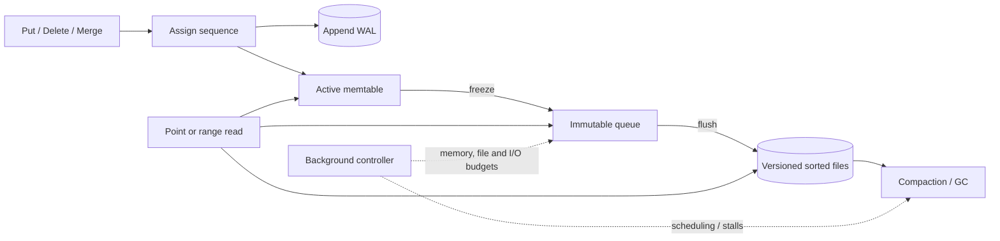

# LSM Trees

A log-structured merge tree turns foreground random writes into an append plus an in-memory ordered update. Immutable sorted files are produced later, and background work reconciles them. This shifts—not removes—cost: write latency becomes smooth while read amplification, space amplification, and deferred rewrite debt become operating concerns.

Scope: the end-to-end LSM pipeline: WAL and memtable admission, internal versions, point and range reads across components, recovery, snapshots, and overload control. [SSTables and Compaction](./03-sstables-compaction.md) owns immutable-file publication, compaction transactions, strategy mechanics, and safe version/tombstone collection. [Bloom Filters](./05-bloom-filters.md) owns filter mathematics, and [Write-Ahead Logging](./04-write-ahead-logging.md) owns general WAL recovery theory.

## Workload and service contract

Record sustained and burst write bytes, key and value sizes, update frequency, point-hit and point-miss rates, range widths, snapshot lifetime, delete/TTL behavior, durability latency, and device bandwidth shared with reads. LSMs excel when foreground random page modification is the constraint and background sequential work has headroom. They are less attractive when the same hot records are overwritten repeatedly, long ranges dominate, or the device is already saturated by reads.

Define acknowledgement precisely. A durable write normally means its WAL record has crossed the configured persistence boundary and the corresponding memtable mutation is visible. It does not mean the value is already in an SSTable, backed up, replicated, or immune to loss of the whole node. Group commit changes latency and throughput but not that boundary.

For reads, declare snapshot semantics and maximum acceptable staleness. A point lookup must return the newest visible version or a deletion. A range iterator must produce each user key once in comparator order at its snapshot, even though versions reside in several memtables and files.

## State and invariants

The logical map is represented by several physical components:

```text
WAL segments -> active memtable -> immutable memtable queue
                                -> versioned set of sorted files

control state: next sequence number, durable WAL frontier,
               manifest/version, flush frontiers, snapshots,
               comparator and format IDs, background-job state
```

An internal key commonly orders `(user_key ascending, sequence descending, kind)`. Kinds distinguish values, point tombstones, range tombstones, and perhaps merge operands. The descending sequence puts the newest version of a user key first within a sorted stream.

Correct implementations preserve these invariants:

1. Every acknowledged mutation is recoverable from a durable WAL or a durably published file.
2. Sequence identities are unique and never move backward after restart or restore.
3. A flush frontier advances only after the file and manifest transition are durable; only then can covered WAL be reclaimed.
4. Readers pin one coherent manifest version and snapshot sequence for their lifetime.
5. Among versions at or below a snapshot, the highest sequence controls visibility unless an explicit merge operator says otherwise.
6. Replaying WAL and retrying background work is idempotent with respect to sequence identity.
7. Memory, file count, and background debt are bounded by backpressure rather than process exhaustion.
8. Comparator, prefix-extractor, and merge-operator identities are persistent-format contracts.

A merge operator is application logic inside storage. It must be associative under the engine’s partial-merge plan and safe under replay; non-idempotent external effects have no place there. Changing its semantics while old operands remain requires versioned operands or a full materialization migration.

## Architecture: foreground and background planes



The foreground plane assigns order, appends WAL, changes memory, and reads a pinned view. The background plane flushes immutable state, schedules file maintenance, creates checkpoints, and reclaims obsolete WAL/files. The control loop meters both planes against memory and I/O budgets. Treating compaction as an unbounded maintenance thread is how a fast benchmark becomes a production write stall.

Memtables may be skip lists, balanced trees, tries, or hash-plus-ordered structures. The choice changes CPU, memory overhead, prefix performance, and concurrent insertion, but not the durable protocol. An arena allocator often makes freeze and reclamation cheap: once no reader pins an immutable memtable, the whole arena can be released.

## Write path and durability

A write batch receives a contiguous sequence range. The engine encodes a checksummed WAL record, appends it, applies the same batch to the active memtable, and acknowledges according to the durability mode. With synchronous durability, acknowledgement waits until the WAL bytes are confirmed durable. Group commit lets many batches share one persistence operation; their ordering and individual outcomes must still be deterministic after a short write or error.

When the active memtable reaches its configured budget, the engine freezes it and immediately installs a new active one. Flush workers write the immutable table as a sorted file and publish it through the manifest protocol described in [SSTables and Compaction](./03-sstables-compaction.md). Several immutable memtables absorb a burst, but their total memory is finite. If flush cannot keep up, writers slow and eventually stop before memory runs out.

WAL recycling uses the oldest unflushed sequence across all column families or trees sharing that log. Deleting a segment because one memtable flushed can lose another tree’s mutations. A checkpoint similarly pins one manifest plus every WAL segment needed to reach its advertised frontier.

Deletes append tombstones; they do not immediately remove older bytes. TTL expiration, snapshot visibility, replica repair, and lower-level overlap determine when a marker can be collected. Those proofs belong to the file lifecycle in [SSTables and Compaction](./03-sstables-compaction.md).

## Read path and MVCC

A point read captures snapshot sequence `S` and a manifest version. It searches the active memtable and immutable memtables, then selects candidate files whose key ranges may contain the key. Filters avoid most negative file reads; indexes locate the data block. The reader compares internal versions and returns the newest value at sequence `<= S`, unless a point or covering range tombstone hides it.

Searching “newest component first” is only safe when component recency is known and range tombstones or merge operands cannot require additional input. A robust implementation compares sequence metadata rather than assuming every L0 file or memtable has a simple total age.

A range scan creates one ordered iterator per relevant component and performs a k-way merge. For equal user keys, it consumes internal versions in sequence order, applies range-deletion coverage and snapshot rules, and emits at most one visible result. Read-ahead makes file access sequential, but CPU and memory grow with the number of overlapping runs. Bloom filters cannot rule out arbitrary ranges.

Snapshots pin old sequence visibility. Even when a newer value shadows an older one for current readers, background collection must retain the old version while any snapshot may need it. Long transactions therefore create physical space and rewrite pressure without issuing writes themselves.

## Recovery and restart

At startup, read and validate the current manifest, identify the maximum durably published flush frontier, and replay later WAL records in sequence order into new memtables. Checksums and record lengths distinguish a valid prefix from a torn tail. Replaying an already published sequence is harmless only if file and memtable visibility resolve by the same identity; blindly generating a new sequence duplicates it.

Recovery time is a service property. Let unrecovered WAL bytes be `Lwal`, sequential read bandwidth be `Bread`, and decode/apply capacity be `Rapply` bytes/s:

```text
restart replay time >= max(Lwal / Bread, Lwal / Rapply)
```

Large memtables reduce flush frequency but enlarge the failure replay window. Frequent flushes shorten restart while increasing file creation and background work. Recovery tests must include a crash during log rotation, a valid record followed by a torn record, and a manifest that intentionally excludes an otherwise complete orphan file.

## Amplification and capacity model

Use separate quantities rather than one vague “write amplification.” Let `F` be incoming encoded bytes/s that initially flush to files. Let `WA_file` be `(flush output + compaction output) / initial flush bytes`, as defined in [SSTables and Compaction](./03-sstables-compaction.md). If WAL and data files share a device, approximate write demand is:

```text
device write bytes/s ~= F * WAL_factor + F * WA_file
```

`WAL_factor` is near one before filesystem/device amplification, but compression and batching change it. This demand plus foreground reads, repair, snapshots, and free-space headroom must fit below sustainable—not burst—device bandwidth. If background capacity is lower than file work arriving, pending compaction bytes grow without bound.

For memtable target `M` bytes and incoming rate `F`, a memtable fills in roughly `M/F` seconds. With `n_imm` permitted immutable memtables, the burst cushion before a hard stall is at most `n_imm * M / F`, less time already consumed by flush. This is why immutable count is a pressure gauge, not free buffering.

For a point miss across `S` candidate runs with per-run filter false-positive probabilities `p_i`, expected unnecessary data-block reads are approximately `sum(p_i)`, assuming independent filter outcomes. [Bloom Filters](./05-bloom-filters.md) explains the limits of that independence and bit allocation. A range over `S` iterators performs `O(K log S)` merge-heap work for `K` internal entries before version suppression; obsolete versions can make `K` far exceed returned rows.

Stored bytes include live values, overwritten versions, tombstones, file-level space amplification, pinned snapshots, and temporary outputs. Size the volume for peak simultaneous input and output during background jobs. Running an LSM near full disk can deadlock reclamation because compaction needs free space to create the file that would let it delete inputs.

## Specialized failure traces

### Success precedes durable WAL

The engine inserts into the memtable and acknowledges, planning to flush the WAL buffer milliseconds later. Power fails first. The memtable and kernel buffer disappear, yet the caller received success. Durability modes may deliberately permit this risk, but the response and documentation must name it.

### Shared WAL is reclaimed too early

Column family A flushes through sequence 900 and deletes the containing WAL segment. Column family B, sharing that segment, has flushed only through 850. A crash loses B’s acknowledged mutations 851–900. Reclamation uses the minimum required frontier across every dependent memtable and checkpoint.

### L0 debt becomes a foreground outage

A burst freezes memtables faster than flush and compaction can absorb them. Overlapping first-level files accumulate, point reads fan out, cache misses consume device bandwidth, flush slows further, immutable memory fills, and writers stall. More write-buffer memory delays the symptom while increasing eventual debt; admission control and reserved background bandwidth restore stability.

### Old snapshot pins the entire rewrite chain

A forgotten analytical transaction holds sequence 100 while a hot key is updated millions of times. Current reads need only the newest value, but files containing older versions cannot be reclaimed. Space and compaction traffic rise until disk pressure affects all tenants. Bound snapshot age or move long analytics to a separate snapshot/export path.

### Comparator changes without rebuild

New code orders encoded keys differently but opens old runs under the new comparator. Point lookups skip the file range that actually contains a key, and merge iterators violate global order. Persist the comparator identity and refuse incompatible open; build a new tree instead.

### Non-associative merge yields restart-dependent values

A merge operator rounds after each partial sum. Background compaction combines operands `(a+b)+c`, while recovery combines `a+(b+c)`, producing different values. The engine converges only if merge algebra satisfies its documented grouping and ordering assumptions.

## Overload, isolation, and observability

Apply backpressure before the immutable queue or first file level reaches a hard limit. A controller can derive an allowed foreground byte rate from measured flush and background throughput, smooth it over time, and allocate it per tenant. Bound write batches, range-scan read-ahead, concurrent compactions, cache admission, and iterator count. Separate latency-critical reads from bulk scans so a recovery or backfill does not evict the entire block cache.

Tenant prefixes can make scans and deletion efficient but concentrate one tenant’s runs and compaction work. Hashing spreads writes but sacrifices ordered tenant export. Whichever layout is chosen, meter logical bytes, WAL bytes, retained versions, scan work, and background debt per tenant where possible. Encrypt WAL, temporary files, manifests, checkpoints, and backups; deletion is not physically complete until obsolete versions leave every file and snapshot. Key rotation may require rewriting old runs and must be included in background capacity.

Core signals are accepted bytes/s, WAL sync latency and group size, active and immutable memtable bytes, flush throughput and duration, files in the overlap-heavy first stage, pending compaction bytes, slowdown/stall time, block-cache hit rate, filter usefulness, point-read files consulted, range internal-entries per result, write/read/space amplification, oldest snapshot, free-space headroom, and recovery replay estimate. Break these down by tree or tenant rather than relying on process averages.

Verification uses a simple versioned ordered map as an oracle. Generate puts, deletes, merge operands, snapshots, and ranges; compare every visible result across arbitrary flush and compaction schedules. Cut power after every WAL append, sync, memtable freeze, file sync, and manifest step. Inject full disks, short writes, checksum corruption, stalled background threads, and enormous snapshots. Test N-1 format opening, backup restore plus WAL replay, and comparator/merge-operator rejection. Assert bounded memory and that throttling starts before hard stall.

## Migration and decision framework

Most tunable changes—memtable size, compression, filter policy, or background concurrency—affect newly produced files and converge gradually through normal maintenance. Comparator, internal-key, sequence, encryption, or merge semantics are format changes. Build a new column family or database, copy a consistent snapshot, tail later mutations, validate range digests and query results, then switch an atomic handle while keeping rollback state.

Choose an LSM when sustained ingest, sequential device writes, immutable snapshots, and high write concurrency outweigh added read and background complexity. Choose a [B+-tree](./01-b-trees.md) for predictable point/range latency and update locality in a cacheable working set. For TTL data, choose a file policy that can expire whole time windows rather than creating per-key deletion debt. The decisive capacity question is not “can the foreground append this fast?” but **can the whole system rewrite, read, repair, and reclaim this stream indefinitely?**

## Primary references

- O’Neil, P., Cheng, E., Gawlick, D., and O’Neil, E. [The Log-Structured Merge-Tree](https://doi.org/10.1007/s002360050048). Acta Informatica, 1996.
- Chang, F., et al. [Bigtable: A Distributed Storage System for Structured Data](https://www.usenix.org/legacy/event/osdi06/tech/chang.html). OSDI, 2006.
- Luo, C., and Carey, M. [LSM-based Storage Techniques: A Survey](https://doi.org/10.1007/s00778-019-00555-y). VLDB Journal, 2020.
- Dayan, N., Athanassoulis, M., and Idreos, S. [Monkey: Optimal Navigable Key-Value Store](https://doi.org/10.1145/3035918.3064054). SIGMOD, 2017.
- Dayan, N., and Idreos, S. [Dostoevsky: Better Space-Time Trade-Offs for LSM-Tree Based Key-Value Stores](https://doi.org/10.1145/3183713.3196927). SIGMOD, 2018.
- RocksDB. [Write Stalls](https://github.com/facebook/rocksdb/wiki/Write-Stalls) and [MemTable](https://github.com/facebook/rocksdb/wiki/MemTable) documentation.
