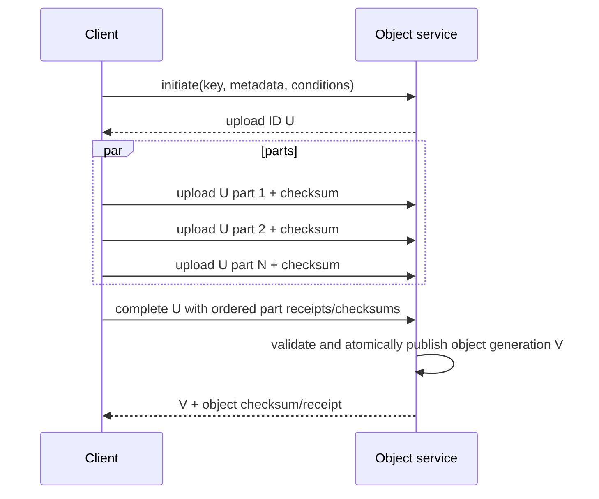

# Object Storage Architecture and Commit Protocols

## TL;DR

Object storage exposes a small key/object API over a large distributed metadata and blob-placement system. The abstraction is not a POSIX filesystem: a key is not a directory entry, rename is generally copy-plus-delete, append and in-place mutation are absent or service/tier-specific, and atomicity normally applies to one object version, not an arbitrary group of keys.

A production design must pin the exact provider/API consistency contract, conditional-request semantics, checksum behavior, versioning/lifecycle rules, event guarantees, regional replication, and encryption boundary. Do not rely on folklore such as a timeless “requests per prefix” number or assume every `ETag` is a content hash.

Build higher-level systems from immutable data objects plus a small, conditionally updated manifest/catalog pointer. Bind retries to upload/operation identity, validate end-to-end checksums, treat multipart completion as an ambiguous commit, and garbage-collect only after reachability and retention prove that no live manifest or restore point needs the bytes.

Durability comes from placement, replication/erasure coding, integrity detection, repair bandwidth, and control-plane correctness. A published “nines” target is a service claim under stated assumptions; it is not a substitute for a workload's own versioning, backup, deletion, and recovery protocol.

---

## 1. API Contract and State Model

Object-store APIs differ, but a useful logical model is:

```text
ObjectVersion {
  account/project and bucket/container
  canonical key bytes
  immutable version/generation ID
  payload length and content checksum(s)
  metadata/tags and metadata revision
  encryption key reference
  creation/retention/legal-hold state
  storage class and placement policy
  deletion marker/tombstone state
}

MultipartUpload {
  upload ID
  target bucket/key and preconditions
  part numbers, sizes, checksums, receipts
  initiation identity and expiry
  status: open | completing | committed | aborted
}
```

The human-friendly key can refer to a current generation while versioning retains older generations. “Overwrite” usually creates/replaces the key's current object atomically; storage nodes need not mutate old bytes in place.

### 1.1 Core invariants

1. **Atomic single-object visibility:** a reader sees a complete committed object generation or the prior/absent state, not partial bytes.
2. **Stable version identity:** an immutable generation/version ID identifies the bytes and metadata interpretation used by a reader.
3. **Conditional mutation:** create-if-absent and compare-and-swap evaluate against the provider's documented generation/ETag/precondition contract.
4. **End-to-end integrity:** the producer can verify that committed bytes equal intended bytes using an explicit checksum algorithm.
5. **Retry identity:** a lost response does not cause a logically distinct object/manifest commit accidentally.
6. **Manifest reachability:** consumers use only data objects referenced by a committed catalog/manifest revision.
7. **Safe reclamation:** lifecycle/garbage collection cannot delete data required by a live manifest, in-flight reader, retained version, backup, or legal hold.
8. **Tenant and encryption binding:** authorization, bucket/key scope, presigned capability, cache, audit, and encryption context agree on tenant/purpose.
9. **Recoverable versions:** every retained encrypted generation has required key material and restore metadata.
10. **Observable repair:** loss of redundancy, integrity failure, repair debt, and replication lag remain below declared risk/recovery bounds.

### 1.2 Pin provider semantics

Verify from versioned service documentation:

- read-after-create/overwrite/delete consistency;
- `LIST` consistency and pagination snapshot behavior;
- conditional headers or generation-match semantics;
- multipart part/complete atomicity and retry behavior;
- checksum versus ETag meaning;
- event delivery, order, duplication, and filtering;
- versioning, delete markers, retention, legal hold, and lifecycle;
- regional/multi-region placement and replication objectives;
- minimum/maximum object and part sizes;
- throttling dimensions and documented scaling guidance.

S3, Google Cloud Storage, Azure Blob, Swift, Ceph RGW, and compatible gateways are not interchangeable merely because they expose `PUT` and `GET`.

---

## 2. Planes and Internal Architecture

```mermaid
flowchart LR
    C[Client / SDK] --> FE[Front end<br/>auth, quotas, request parsing]
    FE --> META[Metadata and namespace plane]
    FE --> DATA[Blob/chunk data plane]
    META --> CAT[(Key/version index)]
    DATA --> PLACE[Placement and coding]
    PLACE --> FD1[(Failure domain A)]
    PLACE --> FD2[(Failure domain B)]
    PLACE --> FD3[(Failure domain C)]
    SCRUB[Integrity scrub and repair] --> FD1
    SCRUB --> FD2
    SCRUB --> FD3
    LIFE[Lifecycle / replication / retention control] --> META
    META --> EV[Event notification plane]
    OBS[(Usage, audit, durability telemetry)] <-- FE
    OBS <-- SCRUB
```

The **front end** authenticates, authorizes, validates conditions and sizes, applies quotas, and routes requests. The **metadata plane** maps `(bucket, key, version)` to object state and physical layout, orders single-key mutations, implements list indexes, and exposes conditional operations. The **data plane** stores chunks/shards and serves ranges. The **durability plane** scrubs integrity, detects missing/corrupt shards, and repairs them. Lifecycle and replication are asynchronous control systems with their own backlogs and failure modes.

A single-object write often stages data first and publishes metadata last:

```text
allocate placement
-> write/encode chunks with checksums
-> prove required durability threshold
-> conditionally commit metadata generation
-> return version/checksum receipt
```

The exact order is implementation-specific; the public commitment is the documented response/visibility contract. Data written but not referenced after a failed metadata commit becomes garbage to reclaim. Metadata committed before sufficient durable data would violate the durability promise.

---

## 3. Namespace and Consistency Semantics

### 3.1 Prefixes are not directories

The key `customers/42/report.pdf` is commonly a flat byte/string key whose slashes support prefix listing and UI conventions. Consequences:

- no atomic directory rename;
- copy/move of a prefix is many object operations;
- listing a prefix may require pagination across metadata partitions;
- deleting a “directory” is a recursive client/control operation;
- a zero-byte marker object may exist independently of descendants;
- permissions/lifecycle rules can be prefix-based even though the namespace is not a filesystem tree.

Do not use “rename temporary directory to final directory” as a transaction. Publish a manifest/catalog pointer only after all referenced immutable objects exist and validate.

### 3.2 Strong per-key consistency is not a multi-key transaction

Some managed stores document strong read-after-write and list consistency. That means a completed object mutation becomes visible under the stated contract; it does not atomically commit `part-0001`, `part-0002`, and `manifest.json` together.

For a dataset:

1. write immutable data files under unique content/attempt paths;
2. verify every receipt/checksum;
3. build an immutable manifest naming exact versions/generations;
4. conditionally advance a small catalog/root pointer;
5. readers pin the manifest/root revision for the operation;
6. reclaim unreachable data later.

This is the pattern used by lakehouse table formats and object-backed log/database systems. See [Lakehouse Table Formats](../13-data-pipelines/05-lakehouse-table-formats.md).

### 3.3 Conditional operations and fencing

Create-if-absent or generation/ETag match can serialize updates to one key:

```text
read root at generation G with value manifest M17
write immutable M18
update root to M18 only if generation == G
```

One contender succeeds; losers reread and rebase. The committed generation is a fencing/version value for consumers that verify it.

Do not infer a safe distributed lease from create-if-absent alone. A lease adds expiry, clock assumptions, renewal ambiguity, stale-holder fencing, and protected-resource enforcement. If an old holder can still mutate another resource, the object-store condition did not fence it. Use a consensus/transaction service when the coordination contract exceeds single-key CAS, or design downstream writes to verify a monotonically increasing epoch. See [Distributed Locks](../01-foundations/09-distributed-locks.md).

### 3.4 Pagination and snapshot identity

A multi-page list may or may not represent one snapshot as concurrent writes occur. Continuation tokens usually encode service state/order, not a portable transaction snapshot. A crawler must tolerate duplicate/missing-under-mutation behavior according to the documented API, or list from an immutable manifest rather than an actively changing prefix.

Never use list completion alone to declare a multi-object upload committed. The manifest is the membership authority.

---

## 4. Multipart and Resumable Upload Protocol

Large objects should upload in independently retryable ranges/parts:



### 4.1 Part identity and retries

A part number or offset has replace/retry semantics defined by the API. Persist the upload ID and accepted part receipts outside process memory for long uploads. Retrying a part should overwrite/reuse its logical slot, not append another semantic part.

Validate part size/order/count, full-object size, and a strong checksum. An ETag may be an opaque concurrency token or multipart construction rather than an MD5 hash. Request a documented checksum algorithm and store it in the producer's manifest.

### 4.2 Completion is an ambiguous commit

If `Complete` times out, the object may have committed. Do not initiate a new logical target blindly. Query upload/object state, retry completion according to the provider contract, or inspect the exact expected version/checksum. Use a unique immutable key when possible so duplicate high-level attempts cannot overwrite unrelated data.

### 4.3 Abandoned uploads

Uploaded parts consume capacity/cost but remain invisible as an object until completion. Lifecycle rules should abort old incomplete uploads only after the maximum legitimate pause and recovery procedure. Track bytes, age, and owner; a cleanup job must not race a resumable upload that still owns its ID.

---

## 5. Durability: Coding, Detection, and Repair

### 5.1 Replication and erasure coding

Three replicas store roughly $3D$ bytes for logical data $D$ and can survive two replica losses when placement is independent and one valid replica remains. A Reed–Solomon-style $(k,m)$ code creates $k$ data plus $m$ parity shards; any $k$ reconstruct the encoded stripe, with ideal storage overhead:

$$
overhead = \frac{k+m}{k}
$$

For $(10,4)$, ideal overhead is $1.4\times$. Real overhead also includes metadata, small-object packing/replication, checksums, versions, slack, and repair staging.

Erasure coding trades storage for read/repair amplification and tail sensitivity. Reconstructing a missing shard may read $k$ surviving shards and perform decode work. Local reconstruction codes add local parities to repair common failures with fewer reads at some extra space/complexity.

### 5.2 Durability model

Durability depends on:

- independent placement across device/rack/zone or declared domains;
- probability and correlation of shard loss;
- time to detection via checks/scrubbing;
- repair queue delay and effective repair bandwidth;
- additional failures during the degraded window;
- metadata/catalog durability;
- software/operator faults that delete or misreference all copies;
- encryption-key availability.

If 8 PiB of shards become under-redundant and repair sustains 40 GiB/s, ideal data movement alone needs:

$$
\frac{8 \times 1024^2\ GiB}{40\ GiB/s}
\approx 209{,}715\ seconds \approx 58.3\ hours
$$

before coding amplification, contention, or new failures. Repair capacity and prioritization determine the vulnerable window. Reserve it; do not assume idle foreground capacity appears during a zone/device incident.

### 5.3 Integrity hierarchy

Use checksums at:

- client payload/part;
- transport request where supported;
- stored shard/chunk;
- reconstructed object;
- higher-level manifest/file/record.

A checksum detects unexpected byte change, not semantic corruption produced before checksum calculation. The producer's content hash plus schema/domain validation catches a different class than storage scrubbing. Quarantine mismatches; do not overwrite every replica from an unverified “newest” copy.

---

## 6. Read Path and Performance Model

The front end resolves metadata, selects healthy shards/copies, and streams full or range bytes. Latency includes authorization, metadata lookup, queueing, storage/network, optional reconstruction, and first-byte transfer.

### 6.1 Range and parallel reads

Large analytical/media readers can issue bounded parallel range requests against immutable versions. Pin the version/generation so ranges cannot mix an overwrite. Align ranges with file-format units where possible: Parquet row groups/column chunks, video segments, index blocks.

Parallelism is not free. It increases request charges, connection/port use, metadata QPS, tail amplification, and competition. Determine the concurrency knee from open-loop load against the real region/object-size distribution.

### 6.2 Small-object tax

One billion 1 KiB logical objects contain about 0.93 TiB of payload, but each requires a metadata record, indexes, request operations, encryption/checksum state, and often inefficient coding/packing. If metadata and placement overhead average an illustrative 600 bytes/object, metadata alone is about:

$$
10^9 \times 600\ bytes \approx 559\ GiB
$$

before replicas. Compaction into immutable segment/container files can reduce request and metadata cost, at the price of an index and read amplification. Table/log formats own those segment manifests.

### 6.3 Hot keys and partitions

Modern managed services may repartition automatically; exact limits and ramp behavior change. Still model key and prefix/partition skew, especially for a new bucket, sequential load, one viral object, and `LIST` over one huge prefix. Use CDN/cache for public hot bytes, randomized or natural high-cardinality distribution where documented, and provider load tests rather than stale numeric folklore.

### 6.4 Cost ledger

Track:

```text
stored logical and physical bytes by class/version
PUT/GET/LIST/HEAD/range and lifecycle operations
data retrieval and inter-region/internet transfer
replication and repair traffic where self-operated
KMS/checksum operations
incomplete multipart and unreachable-object bytes
minimum-duration / early-deletion charges where applicable
```

Unit cost depends on object-size/request mix and region, not only GiB-month. Store provider prices as dated configuration; architecture examples should remain price-independent.

---

## 7. Events and Derived Processing

Object-created/deleted notifications are an asynchronous integration plane, not the object commit transaction. Depending on service/configuration, delivery may be at least once, reordered across keys, delayed, filtered, or occasionally require reconciliation.

An event should carry or lead to:

```text
bucket/key
immutable version/generation
event/operation identity
event type and time
payload checksum/size where available
sequencing metadata where documented
```

Consumers deduplicate by event identity or `(bucket,key,version,event type)`, read the exact version, and make output idempotent. Handle delete markers and overwrite versions explicitly. Periodically reconcile the authoritative manifest/list/catalog against processed state; a queue dead-letter path does not prove every object was observed.

Avoid consuming a temporary data object before its manifest commits. Trigger downstream dataset work from the committed catalog revision, not every file upload.

---

## 8. Lifecycle, Versions, Retention, and Deletion

Versioning can make overwrite/delete recoverable by creating a new generation or delete marker. It also multiplies storage and complicates privacy deletion. Lifecycle is a state machine:

```text
current hot -> current cold/archive
noncurrent retained -> noncurrent expired
delete marker retained/expired
legal hold / retention lock blocks deletion
incomplete multipart aborted
```

### 8.1 Safe garbage collection

For immutable data plus manifests:

1. mark roots: live catalog revisions, snapshots, in-flight transactions, readers/leases if required, backups and legal holds;
2. traverse exact version references;
3. identify unreachable generations;
4. wait the declared rollback/read/convergence grace period;
5. delete conditionally by version;
6. record and reconcile deletion.

Age alone can delete a slow reader's object or a retained rollback manifest's data. Prefix listing alone can race publication.

### 8.2 Object lock is not complete ransomware protection

Retention/WORM controls can prevent version deletion for a period, but recovery also depends on account/control-plane access, key availability, lifecycle configuration, catalog integrity, and independently authorized restore. Replication can copy malicious encryption or delete markers according to policy. See [Disaster Recovery and Data Reconstruction](../15-deployment/05-disaster-recovery.md).

### 8.3 Deletion semantics

Define whether delete hides the current key, creates a marker, erases one version, or schedules physical removal. Tenant erasure must cover versions, replicas, caches/CDNs, derived indexes, inventory, logs, and encryption keys within legal/backup rules. A restored old bucket must apply current deletion/authorization tombstones before exposure.

---

## 9. Security and Capability URLs

Authenticate bucket and object operations through workload/user identity and policy. Bind authorization to tenant, bucket, key/prefix, verb, version, size/content constraints where available, network/region, and expiry.

Presigned URLs are bearer capabilities. Scope them narrowly:

- exact bucket/key and method;
- short expiry;
- expected content length/type/checksum for uploads where supported;
- tenant-owned key prefix generated by the server;
- no permission to choose arbitrary destination/metadata;
- one-time application state when product semantics require it;
- audit linkage without putting the signature in logs.

Do not let a client turn a presigned upload into trusted published content. Validate/scan in a quarantine namespace, then publish an immutable version/manifest. Downloads can expose secrets through URL logs/referrers; prefer headers and controlled clients where necessary.

### 9.1 Encryption

Server-side encryption protects storage-media/control boundaries according to provider policy. Customer-managed keys add policy and deletion control but introduce KMS availability and recovery dependencies. Client/application encryption hides plaintext from the store but prevents server-side inspection/transform and requires authenticated metadata/key distribution. Bind tenant, object identity, version, purpose, and schema as authenticated context; see [Cryptographic Key and Data-Protection Architecture](../10-security/06-encryption.md).

Separate data read/write identities from lifecycle, replication, retention, and key administration. A compromised application writer should not shorten retention or delete the recovery vault.

---

## 10. Multi-Region and Recovery

“Multi-region bucket” can mean synchronous/managed placement within a location, asynchronous replication between buckets, or client-visible independent regions. Pin:

- write authority and routing;
- replication ordering and RPO;
- destination version/metadata/ACL/delete behavior;
- conflict behavior if both sides accept writes;
- failover promotion and stale-writer fencing;
- egress/latency/residency constraints;
- whether KMS keys and identity policies are recoverable in target region.

### 10.1 Failover

If one region is authoritative, promotion writes a new epoch/catalog root and fences old writers. DNS/routing alone is not fencing. New readers pin the recovered root; old clients with long-lived credentials cannot commit to a superseded generation.

If multiple regions accept writes to the same logical key, per-region object versions need an explicit conflict policy. Last physical timestamp may converge while losing intent. Prefer immutable unique keys plus a serialized manifest/root or partition ownership when the domain cannot merge.

### 10.2 Restore

Inventory exact object versions, manifests, key versions, and lifecycle state. Measure request-limited as well as bandwidth-limited restore. Millions of small objects can miss RTO despite few total bytes. Verify restored manifests and random/full object checksums, then rebuild derived indexes before traffic.

---

## 11. Concrete Failure Traces

### 11.1 Multipart completion times out

1. Client uploads all parts and calls complete.
2. Service commits generation V, but the response is lost.
3. Client starts a new upload to the same mutable key.
4. The second object overwrites V or creates an unwanted version; consumers see ambiguous content.

Persist upload and logical object identity. Query/retry completion and verify exact version/checksum before creating another attempt; prefer immutable unique keys plus manifest publication.

### 11.2 Two writers lose a manifest update

1. Writers read root generation G pointing to M10.
2. Each writes valid immutable M11a/M11b.
3. Both overwrite `root` without a generation precondition.
4. Last arrival wins and one dataset commit disappears.

Use conditional update on G; loser rereads/rebases. Garbage-collect its unreachable manifest/data later.

### 11.3 ETag mistaken for MD5

1. Client computes MD5 of a large file.
2. Multipart upload returns an ETag with provider-specific multipart meaning.
3. Client treats mismatch as corruption and retries indefinitely, or treats equality assumptions as integrity proof in another path.

Use documented checksum fields/algorithms and store the producer's content digest separately from the concurrency token.

### 11.4 Repair storm extends vulnerability

1. A failure domain becomes unavailable and many stripes lose redundancy.
2. Repair and foreground reads share the same network/storage limits.
3. Foreground retries consume capacity; repair queue age grows.
4. Another failure occurs before repair, making some stripes unrecoverable.

Reserve/priority-schedule repair, suppress retry amplification, repair the highest-risk stripes first, and alert on exposure bytes × age rather than only failed disk count.

### 11.5 Lifecycle deletes reachable versions

1. A rollback manifest references data generation V7.
2. Lifecycle expires all noncurrent data after 30 days using age alone.
3. Rollback is invoked on day 35.
4. Manifest exists but its files are gone.

Align retention with manifest reachability and rollback/backup roots, or copy protected release data into a separately governed class.

### 11.6 Event consumer misses dataset membership

1. Producer uploads 1,000 files and receives per-object events.
2. One event is delayed/quarantined.
3. Consumer lists the prefix during concurrent writes and concludes 999 is complete.
4. It publishes a partial derived dataset.

Trigger on an immutable manifest with declared file count/digests and reconcile processed versions. File events are hints/work triggers, not the multi-object commit.

### 11.7 Presigned upload crosses tenant scope

1. API accepts a caller-provided key when generating a presigned URL.
2. Tenant A requests `tenant-B/contracts/current`.
3. Storage validates the signature and writes exactly that key.
4. Application authorization was bypassed before storage.

Server derives canonical tenant destination, constrains size/checksum/type, writes to quarantine, and publishes only after ownership/content validation.

### 11.8 Replication copies destructive state

1. Compromised credentials encrypt/overwrite objects or create delete markers.
2. Cross-region replication faithfully propagates operations.
3. Both serving regions agree on the destructive state.
4. Operators discover that replication is not a time/control-isolated recovery copy.

Retain immutable versions under separate authority and rehearse catalog/key-aware restore.

---

## 12. Operations, Verification, and Migration

### 12.1 Observability

Track by bucket/tenant/class/region without unbounded key cardinality:

- request rate, latency, first-byte and throughput by operation/size;
- conditional-precondition failures and ambiguous completion reconciliations;
- multipart open count/bytes/age and abort results;
- checksum mismatch, corrupt/missing shards, redundancy level;
- repair backlog bytes/objects/age and effective bandwidth;
- replication lag and destination failures;
- current/noncurrent/delete-marker/incomplete/unreachable bytes;
- lifecycle transition/delete backlog and policy revision;
- event lag, duplicate/dedup, reconciliation mismatches;
- KMS latency/denial/key-version coverage;
- top hot prefixes/objects and throttling;
- manifest reachability and broken-reference scans.

### 12.2 Test the protocol

- Lose responses after part upload, complete, conditional root update, and delete.
- Reorder/retry multipart parts and complete calls.
- Race root CAS and garbage collection.
- Read ranges while the friendly key is overwritten; assert one pinned generation.
- Mutate payload, part, metadata, checksum and encryption context.
- Delay/duplicate/reorder events and compare with authoritative manifests.
- Simulate shard/domain loss with repair under foreground load.
- Restore millions of small and large versions using historical keys.
- Exercise retention/legal hold and prove privileged identities cannot bypass the designed boundary.
- Fail over regions with stale writers and long-lived clients.

### 12.3 Migrate safely

When moving providers/layouts:

1. inventory exact versions, metadata, ACL/policy, checksums, encryption, retention and events;
2. define semantic differences explicitly;
3. bulk-copy immutable versions with content verification;
4. stream new mutations through one ordered/idempotent path;
5. shadow reads by version and compare checksums/metadata;
6. cut over readers, then conditional manifest writer authority;
7. retain source for rollback and prove reverse catch-up;
8. migrate lifecycle/events/backup, not only bytes;
9. delete source only after retention and recovery gates.

“S3-compatible” syntax does not guarantee equivalent version, condition, event, retention, or consistency behavior.

---

## 13. Design Review Framework

Ask:

1. What exact consistency, conditional, checksum, list, event, version, and retention contract does this service/version provide?
2. Is data immutable and published through one conditional manifest/catalog transition?
3. How does a caller resolve timeout after multipart completion or pointer commit?
4. Which version/generation pins every read and range set?
5. What assumptions produce the durability objective, and what repair bandwidth bounds the degraded window?
6. How do small-object metadata/request costs and hot-key skew affect capacity?
7. Which roots make garbage collection safe, including readers, rollback, backup, legal hold, and deletion policy?
8. Are events merely work hints, with an authoritative reconciliation path?
9. How are tenant, capability URL, encryption, lifecycle, and admin authorities separated?
10. What exactly replicates across regions, what is the RPO, and how are stale writers fenced?
11. Can a full restore meet RTO with historical key versions and realistic object-count distribution?
12. Which migration test proves semantic (not merely API) compatibility?

Use object storage when immutable bulk bytes, parallel throughput, independent durability, and simple key/version access fit. Use a database/catalog for rich queries and multi-record transactions, a filesystem for POSIX rename/append semantics, and block storage beneath latency-sensitive mutable engines.

---

## References

- [Calder et al., *Windows Azure Storage: A Highly Available Cloud Storage Service with Strong Consistency*](https://dl.acm.org/doi/10.1145/2043556.2043571): front end, partition and stream layers
- [Muralidhar et al., *f4: Facebook's Warm BLOB Storage System*](https://www.usenix.org/conference/osdi14/technical-sessions/presentation/muralidhar): erasure-coded warm blob storage and fault domains
- [Huang et al., *Erasure Coding in Windows Azure Storage*](https://www.usenix.org/conference/atc12/technical-sessions/presentation/huang): local reconstruction codes and repair trade-offs
- [Warfield, *Building and operating a pretty big storage system*](https://www.allthingsdistributed.com/2023/07/building-and-operating-a-pretty-big-storage-system.html): published S3 architectural evolution
- [Amazon S3 data consistency model](https://docs.aws.amazon.com/AmazonS3/latest/userguide/Welcome.html#ConsistencyModel), [conditional requests](https://docs.aws.amazon.com/AmazonS3/latest/userguide/conditional-requests.html), [checksums](https://docs.aws.amazon.com/AmazonS3/latest/userguide/checking-object-integrity.html), and [performance design patterns](https://docs.aws.amazon.com/AmazonS3/latest/userguide/optimizing-performance.html): current service-specific contracts
- [Google Cloud Storage request preconditions](https://cloud.google.com/storage/docs/request-preconditions) and [consistency](https://cloud.google.com/storage/docs/consistency): generation/metageneration and service semantics
- [Azure Blob conditional headers](https://learn.microsoft.com/rest/api/storageservices/specifying-conditional-headers-for-blob-service-operations) and [data protection overview](https://learn.microsoft.com/azure/storage/blobs/data-protection-overview): concurrency and retained-version controls
- [OpenStack Swift architecture](https://docs.openstack.org/swift/latest/overview_architecture.html) and [Ceph erasure coding](https://docs.ceph.com/en/latest/rados/operations/erasure-code/): self-operated object/data placement designs
