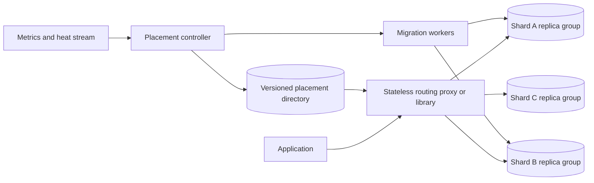
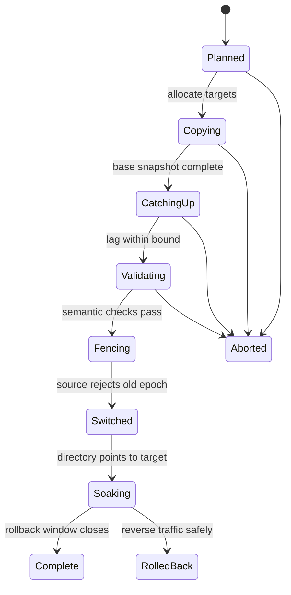

# Database Sharding

Sharding is an application and operational contract, not the expression `hash(key) % N`. Once data lives on multiple independently operated database groups, every request needs authoritative placement, every cross-shard operation needs explicit semantics, and every capacity change becomes an online data migration.

This chapter owns the sharding lifecycle: directory and request routing, shard isolation, resharding, tenant moves, and cutover safety. The mechanics and trade-offs of range, hash, and consistent-hash partitioning belong to [partitioning strategies](../02-distributed-databases/05-partitioning-strategies.md). Replication inside one shard belongs to the [replication](../02-distributed-databases/01-single-leader-replication.md) chapters.

Evidence labels are deliberate:

- **Documented** identifies a dated primary paper, engineering publication, or versioned official documentation.
- **Inference** states a consequence of the workload or published mechanism without claiming a private implementation.
- **Reference design** gives a reusable architecture rather than attributing a composite system to one company.

Unless a paragraph is explicitly marked **Documented** or **Inference**, its normative architecture and operational guidance belongs to the **Reference design**.

## When sharding is justified

**Reference design.** Start with a workload envelope, not a shard count:

- peak and sustained read/write operations by access path;
- live bytes, daily growth, index amplification, and retention;
- connection, memory, WAL, compaction, and replication ceilings;
- tenant/key skew and burst correlation;
- availability and regional-failover headroom;
- maximum acceptable move duration and cutover pause;
- query locality and transaction boundaries.

Shard only after a single replicated database group can no longer meet the envelope economically or operationally after sound schema/indexing, vertical scaling, read replicas, caching, and archival. Sharding may raise aggregate capacity, but it turns placement metadata, migration bandwidth, and partial failure into correctness concerns.

**Documented, MongoDB 8.0 guidance.** MongoDB's sharding FAQ advises beginning unsharded when the dataset fits on one server. Its operational guidance also warns that adding a shard starts balancing work and that the existing cluster needs enough capacity for migration without harming production traffic. These are product-specific statements, but the capacity lesson generalizes. [MongoDB sharding FAQ](https://www.mongodb.com/docs/manual/faq/sharding/), [adding shards](https://www.mongodb.com/docs/manual/tutorial/add-shards-to-shard-cluster/)

## Contract and invariants

**Reference design.** Define these objects independently:

| Object | Meaning |
|---|---|
| logical dataset | application-visible table/collection and schema |
| routing unit | the smallest independently movable key range, bucket, or tenant |
| shard | one replicated database group that owns routing units |
| placement record | routing unit → shard, epoch, migration state |
| router | resolves and enforces placement for a request |
| migration | durable workflow that changes placement |

The minimum invariants are:

### Single write authority

For routing unit `u` at epoch `e`, exactly one shard may accept authoritative writes:

$$
owner(u,e) = s \quad\land\quad |write\_authorities(u,e)| = 1
$$

During migration, multiple physical copies may exist. That is not multiple authority. Source, target, and routers enforce the same epoch so a stale route fails closed rather than accepting a divergent write.

### Complete and non-overlapping placement

Every routable key belongs to exactly one active routing unit, and active units do not overlap. A directory publication is atomic from the router's perspective: a request never observes half of a split manifest.

### Monotonic routing epoch

Each placement change increments an epoch. Shards reject commands whose routing epoch is older than their accepted epoch. Routers treat a stale-epoch rejection as evidence to refresh placement, not as a generic availability retry to the same destination.

### Migration completeness

Before target authority, the target contains a base copy plus every committed source change through cutover watermark `w`:

$$
target = snapshot(t_0) \cup changes(t_0, w]
$$

Validation must cover record identity, values, tombstones, schema transformations, and relevant secondary indexes—not only row count.

### Tenant isolation

Placement never bypasses authorization, quota, encryption, or residency policy. Moving a tenant changes location, not its security identity.

## Data plane and control plane

**Reference design.** Keep placement decisions off the normal database path while enforcing their result on that path:

The **data plane** resolves a routing unit, sends the request to its shard, supplies the epoch, and returns or merges results. The **control plane** observes load/capacity, plans moves, copies data, validates, changes directory versions, and retires old copies. Routers cache signed/versioned directory snapshots so a transient control-plane outage does not stop correctly routable traffic.

**Documented, Slicer paper, OSDI 2016.** Google's Slicer separated a reliable request-forwarding data plane from a global control plane that optimized assignments off the critical path. The paper reported 2–6 million requests/s across production users at publication and described dynamic assignment based on load and health. Slicer assigned application work, not necessarily database rows, but the plane separation is directly relevant. [Adya et al., Slicer](https://www.usenix.org/system/files/conference/osdi16/osdi16-adya.pdf)

**Documented, Stripe snapshot, June 2024.** Stripe described database proxies that route through a chunk metadata service, plus a Data Movement Platform for online shard splitting, consolidation, and engine/tenancy migration. At publication its DocDB platform served more than five million queries/s over 2,000+ shards. Those numbers are a dated system snapshot, not generic shard targets. [Stripe, DocDB Data Movement Platform](https://stripe.dev/blog/how-stripes-document-databases-supported-99.999-uptime-with-zero-downtime-data-migrations)

## Placement directory and routing

**Reference design.** A placement record contains:

- dataset and routing-unit bounds/identity;
- active shard and read-replica policy;
- routing epoch and directory generation;
- migration source/target and workflow state, if any;
- schema/key-format version;
- residency and isolation class;
- checksum/signature and publication time.

Routers obtain a consistent directory generation, derive the routing unit from request key, verify policy, and send the epoch with the database operation. A bounded cache reduces directory load; shards remain the last line of defense against stale routers.

### Directory availability

The directory must be strongly consistent for publication but highly cacheable for reads. If it is unavailable, existing placements continue from the last known-good snapshot. Creating a new tenant or completing a move waits because those actions require a new authoritative generation.

**Inference.** Once routers are allowed to cache placement for availability, directory consistency alone cannot prevent stale writes: a disconnected router can retain a formerly valid assignment. Shard-side epoch fencing is therefore required even when the directory itself never returns two owners.

Do not make a general-purpose cache the directory authority. Eviction, stale replicas, or split-brain updates would become data corruption. Cache invalidation principles still help distribution, but authority remains in a consensus-backed metadata store. See [consensus](../02-distributed-databases/08-consensus-algorithms.md) and [distributed caching](../04-caching/03-distributed-caching.md).

### Scatter/gather

If a query lacks the routing key, the router must either reject it, query a separate index, or scatter to multiple shards. For `N` shards with independent latency CDF `F(t)`, the probability all responses arrive by `t` is approximately:

$$
P(T_{max} \le t) = F(t)^N
$$

Fanout therefore worsens tail latency and multiplies work. Bound concurrency, deadline each subquery, return explicit partial-result semantics where allowed, and prohibit unbounded shard enumeration on user-facing endpoints.

Global secondary indexes introduce their own authority and consistency contract; see [secondary indexes](../02-distributed-databases/06-secondary-indexes.md). Cross-shard atomicity belongs to [distributed transactions](../02-distributed-databases/07-distributed-transactions.md).

## Choosing the routing unit

The routing unit is more consequential than the hash function.

### Tenant or aggregate root

**Reference design.** Co-locate data that changes transactionally—often one tenant, account, workspace, or aggregate root. This preserves local transactions and makes tenant moves possible. A few very large tenants may exceed one shard and require sub-partitioning; that must be designed before a “tenant ID is always local” assumption reaches every query.

### Fine-grained ranges or buckets

Smaller units improve balancing precision and migration recovery but enlarge the directory and control workload. Coarser units reduce metadata but may be immovable hotspots. The unit should be far below shard capacity so a split/move completes while both source and target retain safe headroom.

### Compound locality

A typical logical key is `(tenant_id, entity_id)`: the tenant anchors locality and a suffix distributes a tenant that has opted into multiple routing units. Time belongs in a key only when the application's range/query and retention contract supports it; monotonic time can concentrate all new writes in one unit.

The mechanics of key distribution are intentionally not repeated here; use [partitioning strategies](../02-distributed-databases/05-partitioning-strategies.md).

## Online resharding protocol

**Reference design.** Model resharding as a persisted, resumable state machine:

1. **Plan.** Choose source units, target shards, bandwidth, and an epoch transition. Prove source and target can survive foreground peak plus migration.
2. **Copy.** Read a stable snapshot into targets. Persist per-range checkpoints and make copy idempotent.
3. **Catch up.** Apply source WAL/change-data-capture events after the snapshot watermark. Preserve order per key and tombstones. See [change data capture](../13-data-pipelines/04-change-data-capture.md).
4. **Validate.** Compare keys, values, aggregates, indexes, and sampled read semantics continuously; explain every mismatch.
5. **Fence.** Raise the source's accepted routing epoch so it rejects old requests. Drain in-flight writes and advance target through the final watermark.
6. **Switch.** Atomically publish the target placement and new epoch. Routers refresh on notification or stale-epoch response.
7. **Soak.** Keep the source read-only and monitor semantic/operational signals. Rollback changes routing only if the source remains sufficiently current or reverse replication is active.
8. **Retire.** After rollback, backup, audit, and retention windows, securely delete the source copy and deregister the migration.

**Documented, Stripe 2024.** Stripe described versioned gating: source shards reject requests after their version token is raised, outstanding writes replicate, and the chunk directory switches to targets. The article reports the traffic switch taking under two seconds in that implementation, with failed source requests succeeding on retry. Treat the timing as a dated Stripe measurement, not a design threshold. [Stripe, DocDB](https://stripe.dev/blog/how-stripes-document-databases-supported-99.999-uptime-with-zero-downtime-data-migrations)

**Documented, Vitess 25.0.** Vitess VReplication documents online, reversible `Reshard` and `MoveTables` workflows with traffic switching, reverse traffic, validation, and completion. Its cutover documentation refuses a switch when participating tablets cannot refresh topology state. This is one production-grade implementation of the state machine, not a mandatory product choice. [Vitess VReplication overview](https://vitess.io/docs/25.0/reference/vreplication/vreplication/), [Vitess cutover internals](https://vitess.io/docs/23.0/reference/vreplication/internal/cutover/)

## Tenant moves and isolation changes

**Reference design.** A tenant move is a resharding workflow whose routing unit is the tenant and whose policy may also change:

- shared shard → another shared shard for balance;
- shared shard → dedicated shard for isolation;
- region A → region B for residency;
- legacy schema/engine → new storage generation.

The directory record must bind tenant, location, encryption-key domain, residency, and routing epoch. Copy jobs assume the tenant's authorization context but do not broaden it. Audit who approved the move and which validation evidence allowed cutover.

Large tenants may have external side effects—object blobs, search indexes, queues, analytics—that are not transactionally moved with the primary database. Treat them as derived systems with independent convergence and rollback plans. Do not switch the primary and assume every projection follows automatically.

## Capacity and cost model

### Shard count—illustrative assumptions

**Reference design.** Suppose peak traffic is 1.2 million database operations/s. A shard is benchmarked at 35,000 operations/s at the required tail latency, but normal operation is capped at 55% to retain failover and migration headroom:

$$
N_{throughput} = \left\lceil \frac{1{,}200{,}000}{35{,}000 \times 0.55} \right\rceil = 63
$$

If live data is 780 TiB and one shard may hold 12 TiB at 60% storage occupancy:

$$
N_{storage} = \left\lceil \frac{780}{12 \times 0.60} \right\rceil = 109
$$

The initial floor is at least 109 shards, then increase for skew, replica topology, regional evacuation, and operational isolation. These numbers are illustrative.

### Skew

Average load does not size shards. Let routing unit `i` have rate `\lambda_i` and the hottest shard receive set `H`:

$$
\lambda_{hot} = \sum_{i \in H}\lambda_i
$$

Capacity is valid only if `\lambda_hot` stays within the shard's safe envelope after a replica or zone failure. Track maximum-to-mean and high-percentile unit heat, not only uniform-hash simulations.

### Migration bandwidth

For `D` bytes, effective copy throughput `B`, catch-up/write amplification factor `a`, and usable duty cycle `d`:

$$
T_{move} \ge \frac{D(1+a)}{Bd}
$$

A 9 TiB unit copied at an effective 180 MiB/s with `a=0.15` and `d=0.7` needs at least about 23.9 hours before validation and cutover. If the source will exhaust capacity in six hours, the routing unit is already too large or the move started too late.

Migration cost includes source reads, target writes, WAL retention, replication, validation reads, network egress, temporary duplicate storage, and operator attention. Budget and rate-limit it separately from foreground traffic.

## Specialized failure traces

### Stale router during cutover

**Reference-design trace.** Unit `u` moves from shard A at epoch 41 to shard B at epoch 42:

1. Copy and catch-up reach final watermark.
2. The controller raises A's minimum epoch to 42; A rejects further epoch-41 operations.
3. Directory generation 900 publishes `(u,B,42)`.
4. One router misses the invalidation and sends a write to A with epoch 41.
5. A rejects it before mutation. The router refreshes generation 900 and retries B within the original deadline and retry budget.
6. B deduplicates the operation identity in case the client also retried.

Without shard-side fencing, a stale router can create a split brain even when the directory itself is consistent.

### CDC gap after source cleanup

**Reference-design trace.** A migration worker records snapshot watermark `w0`, copies data, and applies changes to `w8`. A corrupt checkpoint incorrectly claims `w10`, validation samples miss two deletes, and cutover succeeds. If the source is immediately deleted, the loss is permanent.

The safe design verifies source and target at the final watermark, retains the immutable change log and source through a soak window, audits checkpoint monotonicity, and runs anti-entropy over all key ranges. Cleanup is an explicit irreversible transition, never an automatic timer after “switch succeeded.”

### Hot tenant overwhelms both sides

A hot tenant is copied while foreground writes continue. Copy scans evict source cache; target apply lag grows; application retries amplify both. Per-migration I/O and concurrency budgets yield to foreground SLOs, and the controller pauses before either shard crosses its safe envelope. Resharding is subject to [backpressure](07-backpressure.md) and [retry budgets](10-retries-timeouts-hedging.md), not exempt maintenance traffic.

## Overload and failure policy

Routers enforce per-tenant and per-shard admission. A saturated shard should reject early with retry metadata rather than allow connection pools and queues to exhaust across the fleet. Scatter/gather has a stricter cost budget than point routing. Migration workers use separate queues and cannot consume the last replica, I/O, or WAL headroom.

Directory failure modes are explicit:

- **read unavailable:** continue last known-good assignments; block new placements;
- **stale route:** shard fencing rejects and triggers refresh;
- **controller unavailable:** active migrations pause safely at persisted states;
- **target unhealthy before switch:** abort or wait; source remains authority;
- **target unhealthy after switch:** forward-fix or reverse only with proven source currency;
- **source loss during copy:** recover source replica or restart from a new consistent snapshot.

## Multi-region sharding

**Reference design.** Separate placement from replication. A routing unit has one write home/epoch even if it has read replicas in several regions. Moving the home is a failover or tenant-mobility protocol requiring fencing and replication evidence, not a DNS update.

The directory itself is globally replicated, but routers use regional snapshots. Do not require a cross-ocean consensus read for every database request. Regional capacity must satisfy evacuation scenarios, and residency constraints can restrict eligible targets. See [multi-region architecture](09-multi-region-architecture.md) and [cell-based architecture](11-cell-based-architecture.md).

## Security and abuse boundaries

The routing key is untrusted input. Authenticate tenant identity independently and verify that request credentials are authorized for the resolved routing unit. Never accept a caller-supplied shard hostname. Routers use mutually authenticated connections to an allowlisted shard inventory and sign or integrity-check directory snapshots.

The directory reveals tenant placement and can become a high-value enumeration target. Apply least privilege, audit reads/writes, encrypt sensitive policy metadata, and separate migration approval from execution. Dedicated shards improve noisy-neighbor isolation but do not replace row/database authorization.

During moves, temporary copies and change streams inherit the original classification, encryption, retention, and deletion obligations. Verify cryptographic erasure or physical cleanup after completion. See [multi-tenancy](12-multi-tenancy.md), [zero trust](../10-security/05-zero-trust-architecture.md), and [encryption](../10-security/06-encryption.md).

## Observability and verification

Operate the lifecycle, not only shard CPU:

- point-route vs scatter rate and shards touched/query;
- directory generation age, lookup latency, and stale-epoch rejection;
- load/storage skew by shard and routing unit;
- connection/WAL/compaction/replication saturation;
- migration bytes, checkpoint, CDC lag, validation mismatches, and ETA;
- source/target semantic divergence by key range;
- cutover retry, pause duration, rollback readiness, and stale-writer attempts;
- tenant-move policy/residency violations;
- cross-shard transaction and index lag;
- temporary duplicate storage and migration network cost.

Verification includes property tests that every key maps exactly once, router/shard epoch tests, duplicate/reordered CDC events, crash/restart at every workflow state, full and sampled anti-entropy, overloaded source/target tests, stale routers, directory partitions, rollback after new-target writes, and secure source deletion.

The migration controller should be model-checked or systematically fault-injected around the fencing/switch states. “Happy-path copy completed” gives little confidence in the only seconds where two locations can contend for authority.

## Migration from an unsharded database

**Reference design.** Introduce sharding without a flag day:

1. add a stable routing key to every authoritative record and write path;
2. reject or inventory queries that cannot name a routing scope;
3. place a router/proxy in front while it still routes everything to the original database;
4. create the directory with one initial placement generation;
5. deploy destination shards and stream a canary routing unit;
6. shadow reads and validate semantics;
7. fence and switch canaries, then expand gradually;
8. retain rollback and anti-entropy until all routing units move;
9. remove fallback-to-original routing so bugs fail visibly;
10. retire the source only after completeness, backup, and audit evidence.

This is an online [migration strategy](../15-deployment/06-migration-strategies.md), not merely a schema migration.

## Design review questions

1. Which measured single-shard limit requires sharding now?
2. What is the routing unit, and can the largest unit move within the safety window?
3. Which operations are guaranteed shard-local, and how are violations detected?
4. What is authoritative for placement, and what fences stale routers?
5. How are snapshot and changes joined without a gap?
6. What semantic validation blocks cutover?
7. Can rollback include writes committed after the switch?
8. How much foreground headroom remains during copy, repair, and regional failure?
9. How are scatter queries and global indexes bounded?
10. How do residency, encryption, retention, and deletion follow a tenant move?

## Primary sources

- [Adya et al., “Slicer: Auto-Sharding for Datacenter Applications,” OSDI 2016](https://www.usenix.org/system/files/conference/osdi16/osdi16-adya.pdf)
- [Stripe Engineering, “How Stripe's document databases supported 99.999% uptime with zero-downtime data migrations,” 2024](https://stripe.dev/blog/how-stripes-document-databases-supported-99.999-uptime-with-zero-downtime-data-migrations)
- [Vitess 25.0 documentation, VReplication overview](https://vitess.io/docs/25.0/reference/vreplication/vreplication/)
- [Vitess documentation, traffic cutover internals](https://vitess.io/docs/23.0/reference/vreplication/internal/cutover/)
- [MongoDB 8.0 documentation, resharding a collection](https://www.mongodb.com/docs/v8.0/core/sharding-reshard-a-collection/)
- [MongoDB documentation, adding shards and capacity considerations](https://www.mongodb.com/docs/manual/tutorial/add-shards-to-shard-cluster/)
