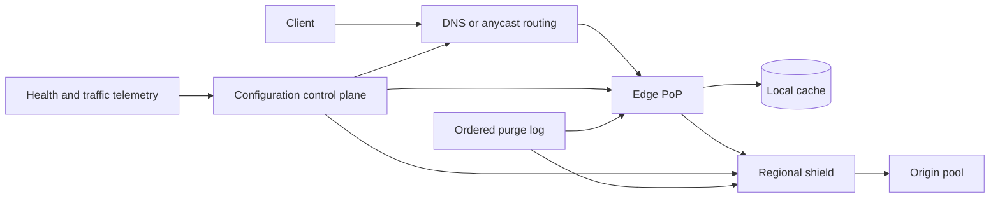

# CDN Architecture

A content delivery network is a globally distributed consistency and overload-control system. It must route a client to a healthy edge, decide whether a stored representation is reusable for that exact request, coordinate fills and invalidations across thousands of failure domains, and prevent a cold or malicious workload from collapsing the origin.

CDN design spans edge data/control planes, client-to-edge routing, cache identity, surrogate invalidation, tiering, origin protection, and edge recovery. [Cache Strategies](../04-caching/01-cache-strategies.md) covers application policy; [Cache Invalidation](../04-caching/02-cache-invalidation.md) covers general coherence trade-offs.

Evidence labels distinguish **Documented** claims backed by dated primary or official sources, **Inference** derived without asserting a private implementation, and unmarked **Reference design** guidance that is reusable rather than provider-attributed.

## Workload and delivery contract

**Reference design.** Inventory content by behavior, not file extension:

| Class | Identity and freshness | Failure behavior |
|---|---|---|
| fingerprinted immutable asset | URL names exact bytes; long-lived | serve cached indefinitely within retention |
| mutable public object | URL stable; validators/TTL or purge define version | bounded stale policy |
| personalized response | identity includes authorization/user dimensions | normally private or bypass shared cache |
| generated expensive response | public but origin-costly | collapse fills; bounded stale fallback |
| large/range object | representation plus byte range/encoding | validate partial-object compatibility |
| live stream | manifest/segment sequence and short lifetime | skip expired work; do not build backlog |

The contract must state:

1. which request dimensions identify one reusable representation;
2. maximum fresh and stale age per content class;
3. whether stale may be served during revalidation, origin error, or disconnection;
4. invalidation scope and propagation objective;
5. authenticated/personalized cache policy;
6. regional or legal variants;
7. origin load allowed during cold start, purge, and edge loss;
8. integrity and confidentiality requirements;
9. observability disclosed to clients versus operators.

“The CDN caches GETs for five minutes” is not a contract. It omits representation identity, validators, purge ordering, stale exceptions, and who may observe the object.

## Standards baseline

**Documented, RFC 9111, Internet Standard, June 2022.** An HTTP cache key contains at least request method and target URI. When a stored response carries `Vary`, nominated request headers participate in selection. The RFC defines freshness, validation, shared/private cache rules, authenticated-request constraints, and security considerations including poisoning and sensitive data. [RFC 9111](https://www.rfc-editor.org/rfc/rfc9111.html)

**Documented, RFC 5861, Informational, May 2010.** `stale-while-revalidate` permits bounded stale serving while validation occurs asynchronously; `stale-if-error` permits bounded stale serving on specified failures. These directives extend, rather than erase, the underlying freshness contract. [RFC 5861](https://www.rfc-editor.org/rfc/rfc5861.html)

**Documented, RFC 9211, Standards Track, June 2022.** `Cache-Status` standardizes how caches report hits, forwarding reasons, TTL, storage, and collapsed requests across a chain. It is useful for debugging, but its security section matters because exposing keys or topology can leak sensitive information. [RFC 9211](https://www.rfc-editor.org/rfc/rfc9211.html)

Provider-specific behavior can be stricter, broader, or configurable. Verify the implementation and product contract instead of assuming every edge implements every optional RFC behavior identically.

## State and invariants

**Reference design.** Separate four authorities:

- the **origin** authorizes representation content and cache policy;
- the **edge cache** owns local stored objects and freshness calculations;
- the **configuration control plane** owns routing, cache-key policy, origin pools, and security rules;
- the **purge log** owns ordered invalidation intent and delivery evidence.

### Representation identity

Let canonical request identity be:

$$
K = H(tenant, scheme, host, method, canonical\_path, query\_policy, vary\_dimensions, representation\_policy)
$$

Two requests may reuse one object only if every dimension that can change bytes or authorization is equal under declared normalization. A missing dimension can leak one user's content; an unnecessary dimension fragments the cache and raises origin load.

### Tenant isolation

Identical host/path strings in different customer zones cannot share state unless the product explicitly defines a safe deduplication domain. Configuration, purge sequence, cache tags, keys, logs, and origin credentials are tenant-scoped.

### Freshness and age

For stored response time `t_s`, corrected resident age `A_0`, and current time `t`:

$$
current\_age = A_0 + (t - t_s)
$$

The object is fresh only while current age is within the selected freshness lifetime. A revalidated `304` updates metadata according to HTTP rules; it does not create arbitrary new bytes.

### Purge monotonicity

For tenant purge sequence `p`, an edge never applies `p-1` after `p`. A late cache fill begun before purge cannot resurrect invalidated content. The fill commits only if its observed resource/tag generation still matches the current purge generation.

### Origin protection

For origin pool safe concurrency `C_o`, all edge tiers combined maintain:

$$
inflight_{origin} \le C_o
$$

Queued, retrying, revalidating, prefetched, and shield requests all count. A cache miss is not permission to bypass the origin budget.

## Data plane and control plane

**Reference design.** The serving data plane continues through a control-plane outage using a last known-good, signed configuration:

The **data plane** terminates transport, authenticates/filters, computes the key, reads/writes cache, collapses fills, and fetches through shields. The **control plane** publishes customer configuration, certificates, edge routing, origin health policy, cache rules, purge records, software releases, and emergency disables.

Configuration has an epoch and activation time. An edge validates syntax, referenced secrets, origin pools, and feature compatibility before atomic activation. Partial application must not combine a new cache key with an old purge namespace or a new origin credential with an old origin address.

**Documented, Akamai paper, 2010.** Nygren, Sitaraman, and Sun described a large CDN as an overlay with a distributed mapping system, edge servers, transport/route optimization, and origin-facing mechanisms. It is a historical primary-source architecture, useful for plane separation and mapping concepts but not a description of every current CDN. [The Akamai Network](https://www.akamai.com/site/en/documents/research-paper/the-akamai-network-a-platform-for-high-performance-internet-applications-technical-publication.pdf)

## Client-to-edge routing

**Reference design.** Two common mechanisms are:

- **DNS steering:** authoritative DNS selects an edge address using resolver/client hints, topology, health, and capacity. TTL controls how quickly clients re-resolve, while recursive resolver caching limits precision.
- **Anycast:** many PoPs announce the same address and Internet routing selects a path. Fast data-plane reachability comes with less application-level control over path changes.

Many networks combine them: DNS selects service/region or address pool; anycast reaches a PoP. “Nearest” means best predicted service path under health/capacity/policy, not geographic distance.

Routing inputs include transport reachability, regional capacity, origin/shield health, legal constraints, protocol support, attack state, and measured client performance. Apply hysteresis so small metric noise does not flap clients between PoPs. Keep emergency withdrawal separate from normal optimization.

**Inference.** DNS caches and established transport sessions outlive a routing decision, so a control-plane withdrawal cannot guarantee immediate evacuation. PoP failure plans must tolerate a decaying tail of old routes and a correlated reconnect wave toward survivors.

### Connection migration and drain

DNS/route changes do not move existing TCP/QUIC sessions instantly. A draining PoP stops taking new connections, advertises a graceful close where protocol permits, retains state long enough for in-flight responses, and leaves capacity for reconnect bursts. See [DNS and connection management](13-dns-and-connection-management.md) and [transport internals](14-network-transport-internals.md).

## Cache-key engineering

The key is a security boundary and a capacity lever.

### Host, path, and query

**Reference design.** Normalize only semantics proven equivalent: case rules, percent encoding, dot segments, default ports, and query ordering differ by application. Maintain an allowlist of query fields that change representation or an allowlist of fields safe to drop. Blindly sorting/removing query parameters can collide signed URLs or distinct searches.

### `Vary` and negotiation

**Documented, RFC 9111.** A cache may use a stored response under `Vary` only when the nominated request headers match the original selecting request. `Vary: *` prevents reuse without origin validation. [RFC 9111 §4.1](https://www.rfc-editor.org/rfc/rfc9111.html#section-4.1)

Unbounded `Vary: User-Agent` or arbitrary cookies create enormous cardinality. Prefer a small normalized device/format capability dimension generated by trusted edge policy. `Accept-Encoding` variants must not share bytes or metadata incorrectly.

### Authorization, cookies, and privacy

Shared caching of authenticated responses is opt-in under HTTP semantics. A CDN must not infer public cacheability from a `200`. Prefer bypass/private policy unless the origin explicitly marks a safe shared representation and the key excludes no authorization-dependent bytes.

Do not key on raw bearer tokens: this stores secrets in cache metadata and destroys reuse. If a response is safely shareable within an authorization cohort, derive a bounded opaque policy class after authentication and include that class—not the credential—in the key.

### Key-version migrations

Changing normalization or key policy changes object identity. Publish key version `k+1`, read only from `k+1`, optionally fill from a verified `k` object when equivalence is proven, and let `k` expire. In-place reinterpretation can serve old bytes under new semantics.

## Request flow and tiering

**Reference design.** An edge request proceeds as follows:

1. Select and atomically load tenant configuration epoch.
2. Normalize and authenticate before computing a shared-cache key.
3. Apply request/WAF/rate policy and reject invalid or disallowed methods.
4. Look up the local cache and verify key, freshness, integrity, and purge generation.
5. On a fresh hit, serve with correct `Age` and bounded diagnostic metadata.
6. On stale content, choose synchronous validation, stale-while-revalidate, stale-if-error, or miss according to policy.
7. Collapse equivalent fills into one upstream request with bounded waiters.
8. Acquire origin/shield concurrency and retry-budget permits.
9. Fetch through a shield, validate response cacheability and size, stream to client where safe, then atomically commit cache metadata and bytes.
10. If the client disconnects, continue fill only when expected reuse justifies it and budgets allow.

A **shield** or mid-tier aggregates misses from many edges, raising reuse and reducing direct origin fanout. It is also a correlated bottleneck. Partition shields, cap queues, and permit controlled bypass only when the origin has a separate budget for it.

General eviction algorithms and cache-aside mechanics are in [distributed caching](../04-caching/03-distributed-caching.md). CDN-specific selection must additionally consider bytes, transfer cost, fill latency, regional popularity, object expiry, and purge frequency.

## Freshness, revalidation, and stale policy

**Reference design.** Choose policy per business consequence:

| Content | Revalidation | Stale on error? |
|---|---|---|
| fingerprinted asset | unnecessary until retention expiry | yes, bytes are identity-bound |
| public article | validator or purge | bounded, usually acceptable |
| price/availability | short freshness + validator | only with explicit product approval |
| authorization/policy | bypass or strict validation | generally no |
| safety/revocation data | strict validation/push invalidation | no |

Serving stale is an availability decision that can become a correctness or security failure. Stale windows are requirements, not CDN defaults. Mark stale responses in telemetry and preserve `Age`; do not reset apparent age at each tier.

Conditional requests (`If-None-Match`/ETag or `If-Modified-Since`) reduce bytes but still consume origin request capacity. Collapse revalidation and protect it with permits. If an origin deploy changes bytes without changing a strong validator, no CDN can infer the mistake.

## Invalidation and versioning

### Content-addressed publication

**Reference design.** The safest invalidation is a new URL whose name includes a content digest or release version. HTML/manifests use a shorter policy and point to immutable objects. Old assets remain correct for old pages and expire naturally; a rollback switches the manifest rather than repopulating old bytes.

### Exact purge

An exact purge identifies the fully normalized cache key dimensions. Purging only the visible URL can miss language, encoding, query, image-format, or device variants. The purge API either accepts all dimensions or maps a resource identifier to every variant through a maintained index.

### Surrogate/tag purge

A response can declare bounded surrogate tags such as `article:42` or `release:900`. Edges maintain tag-to-object indexes and an ordered generation/tombstone per tag. Purging a tag advances its generation; any object or in-flight fill created under the older generation is unusable.

Tags must be tenant-scoped, length/count bounded, authorized, and normalized. One attacker-controlled tag attached to millions of objects can make purge and storage pathological.

### Purge log

**Reference design.** A purge command receives a tenant-scoped idempotency ID and monotonic sequence, is authorized and durably appended, then fans out to PoPs/shields. Each receiver checkpoints applied sequence. Gaps trigger replay; too-old consumers install a compacted snapshot of active tombstones/generations before serving.

“Purge accepted” means durable intent, not global completion. The API reports propagation evidence or an SLO, and clients distinguish queued, partially applied, and complete. Browser/private caches may retain content outside CDN control; versioned URLs are the only deterministic way to bypass them.

**Documented, Cloudflare 2024 snapshot.** Cloudflare described exact, prefix, hostname, tag, and purge-everything scopes and a redesigned purge plane that actively deletes local objects. Its article reported under-150 ms invalidation performance for measured production traffic in August 2024. This is a dated provider result, not a universal purge guarantee. [Cloudflare, Instant Purge](https://blog.cloudflare.com/instant-purge/)

## Origin protection and overload

Cache effectiveness and origin stability are one system. A 99% hit ratio at 10 million requests/s still sends 100,000 requests/s upstream, before fills, revalidation, retries, and failover.

**Reference design.** Use coordinated layers:

- tenant/route cost-based admission at edge;
- local and shield request collapse keyed identically;
- per-origin concurrency and request-rate budgets;
- separate budgets for demand, revalidation, prefetch, and repair;
- circuit breakers that distinguish timeout, overload, and semantic errors;
- bounded queues with age deadlines;
- retry budgets and full jitter under one end-to-end deadline;
- bounded stale serving for approved classes;
- negative caching for safe, authoritative misses;
- prewarming only for measured high-value objects.

The details live in [rate limiting](05-rate-limiting.md), [circuit breakers](06-circuit-breakers.md), [backpressure](07-backpressure.md), and [retries/timeouts](10-retries-timeouts-hedging.md). CDN policy must use their shared budgets rather than adding an independent retry loop.

### Cache stampede

Collapse only requests with identical authorization and representation keys. Give waiters individual deadlines; if the leader stalls, electing many replacements recreates the stampede. One controlled replacement may proceed after the old leader is fenced/canceled. See [cache stampede](../04-caching/04-cache-stampede.md).

### Purge and cold-start control

Rate-limit purge breadth, then pace refills. “Purge everything” followed by unrestricted misses converts the CDN into a load amplifier. Keep a shield copy only if purge semantics allow it; otherwise gate origin refills and serve a controlled error/stale response by content class.

## Capacity and cost model

### Origin offload—illustrative assumptions

**Reference design.** Let client rate be `R`, local hit ratio `h_e`, and shield hit ratio on edge misses `h_s`:

$$
R_{origin} = R(1-h_e)(1-h_s)
$$

At 8 million requests/s, `h_e=0.94`, and `h_s=0.70`:

$$
R_{origin}=8M \times 0.06 \times 0.30=144{,}000\ requests/s
$$

If a purge temporarily lowers local and shield hits to 20% and 10%, raw miss demand becomes 5.76 million requests/s—40× normal origin traffic. Admission and collapsed refill are correctness for origin availability, not an optimization.

### Bandwidth—illustrative assumptions

At 900,000 responses/s with mean body 180 KiB in one region:

$$
egress \approx 900{,}000 \times 180\ KiB \times 8 \approx 1.33\ Tbit/s
$$

Plan NIC, transit, packet rate, TLS CPU, and regional evacuation. Mean body size hides video and software-download tails; size-class traffic and reserve large-object concurrency separately.

### Cache storage and churn

For object `i` with size `b_i`, request rate `\lambda_i`, miss transfer cost `c_i`, and residence time `r_i`, admission should estimate saved cost per byte rather than count hits alone. A small hot object and a multi-gigabyte one-hit object should not receive equal treatment.

If a 400 TiB PoP cache turns over 12%/hour, write rate is about 13.7 GiB/s before replication and metadata. Flash endurance, compaction, tag-index writes, and purge deletion become first-class capacity constraints. Values are illustrative.

### Purge state

One million tenants issuing 20 tag purges/day yields 231 purge records/s on average, but deployment bursts dominate. Tombstone retention must cover maximum edge outage plus log replay lag; otherwise an offline edge can return with pre-purge objects after the central tombstone vanished.

## Specialized failure traces

### Missing cache-key dimension leaks private content

**Reference-design trace.** `/account` varies by session cookie, but a new rule removes cookies from the key and marks the response shared:

1. User A's authenticated response fills the edge under host+path only.
2. User B requests the same path and receives A's body as a cache hit.
3. Purging stops future hits but cannot retract the disclosed response.
4. The safe rollout would shadow key decisions, block shared storage for authenticated requests without explicit origin policy, and canary with synthetic cross-user probes.

This is not a low hit-rate bug; it is a confidentiality incident. Cache-policy changes require security review and typed policy, not free-form regex alone.

### Global purge melts the origin

**Reference-design trace.** A release pipeline purges a popular 2 MiB bundle at every edge:

1. Hundreds of PoPs miss simultaneously.
2. Local collapse produces one request per PoP, still hundreds of shield requests.
3. Shield collapse reduces this to one fill per shield, but three shields independently retry a slow origin.
4. The shared origin concurrency budget admits one attempt and queues/rejects the rest within deadlines.
5. Edges serve the previous bundle only if its stale policy allows; otherwise they return a bounded error.
6. A content-addressed release would have prewarmed the new URL and switched a small manifest without invalidating old bytes.

The control-plane action created data-plane load. Capacity testing must include purge-induced cold starts.

### PoP isolation and stale policy

An edge loses both shields and configuration streaming. It has a signed configuration epoch and cached objects. It may serve fresh objects normally, approved stale objects within their bounded windows, and must fail closed for expired authorization/safety content. It stops accepting new purge/config mutations locally, exposes stale configuration age, and drains when its policy horizon ends. “Edge disconnected” is not one universal serve-stale decision.

### Late fill resurrects purged bytes

A fill for tag `product:7` starts at generation 81. Purge 82 applies while origin is streaming. Before committing, the fill compares its captured generation with the current generation, detects 82, serves the current client only if policy permits but does not store, and releases waiters to refetch. Without the commit check, invalidated content immediately reappears.

## Security and abuse boundaries

Threats include cache poisoning, cache deception, request smuggling across inconsistent parsers, cross-tenant key collision, personalized-data leakage, purge abuse, origin bypass, signed-URL normalization bugs, and diagnostic-header leakage.

**Reference design.** Use one canonical parser/normalizer across WAF, key computation, purge, and origin signing. Reject ambiguous encodings and conflicting length/transfer semantics before caching. Authenticate control-plane and purge APIs with least privilege, strong tenant binding, idempotency, approval for broad purges, and immutable audit logs.

Origin servers accept traffic only from authenticated CDN egress or verify signed origin requests, while retaining a break-glass path. TLS private keys and customer secrets are distributed through a versioned secret plane, held in hardware/isolated processes where required, and rotated without mixed configuration.

Do not expose raw cache keys containing cookies, authorization classes, or signed URLs in `Cache-Status`. RFC 9211 permits deployment-specific disclosure choices; production diagnostics should be sampled, access-controlled, and redacted.

## Observability and operations

Measure by tenant, content class, PoP, shield, and origin pool with cardinality controls:

- fresh hit, stale hit, revalidated, miss, bypass, and uncacheable rates;
- byte hit ratio and saved origin bandwidth, not request hit ratio alone;
- cache-key cardinality, `Vary` explosion, and object-size distribution;
- fill latency, collapsed waiters, leader timeout, and duplicate fills;
- origin permits, queue age, retries, circuit state, and goodput;
- purge accepted/applied sequence, propagation quantiles, gaps, and late-fill rejection;
- configuration epoch and activation failure;
- DNS/anycast route changes, connection drain, and regional saturation;
- eviction/churn, storage write rate, tag-index size, and tombstone age;
- stale served by reason/age and policy violations;
- cross-user synthetic confidentiality probes.

Use standardized `Cache-Status` where appropriate, but do not treat it as the only source of truth. Edge logs sample decisions with an opaque key digest, config epoch, purge generation, and upstream attempt ID. Correlate one client request through edge and shield without logging secrets.

## Testing and verification

Property and conformance tests cover RFC freshness/validation, `Vary`, range requests, authorization rules, `Age`, conditional responses, and malformed headers. Differential tests feed the same corpus to edge, purge normalizer, and origin to find parser/key disagreement.

Fault tests inject:

- control-plane loss with continuing data traffic;
- reordered/duplicated/missing purge records;
- fill racing purge and configuration activation;
- origin timeout after response bytes begin;
- shield loss and controlled bypass;
- stale-policy boundary expiry;
- PoP drain and reconnect burst;
- poisoned object/checksum mismatch;
- purge-everything plus cold origin;
- authenticated variants attempting cross-user reuse.

Canary new cache-key/config logic by request shadowing: compute old and new keys and decisions without storing under the new policy, then compare cardinality, cacheability, authorization class, and expected origin load. Synthetic objects with known variants verify global purge and edge integrity continuously.

## Onboarding and migration

**Reference design.** Put an origin behind a CDN progressively:

1. inventory response classes, validators, cookies, authorization, range use, and legal variants;
2. establish origin authentication and a bypass/rollback path;
3. route a canary hostname or traffic cohort through edge in pass-through mode;
4. enable caching only for fingerprinted immutable assets;
5. shadow cache decisions and validate keys for mutable public content;
6. introduce shield and origin budgets before increasing cacheable scope;
7. test exact/tag purge, late-fill fencing, and browser-cache behavior;
8. canary stale policies per content class;
9. move DNS/anycast traffic gradually with route and origin observability;
10. restrict direct origin access only after edge rollback and emergency procedures are proven.

Changing CDN provider repeats this discipline. Dual-CDN routing can improve failure isolation, but purge, key semantics, TLS configuration, log definitions, and stale rules must be reconciled; otherwise the two providers serve different security policies.

## Design review questions

1. What exact inputs can change response bytes or authorization, and are all in the key?
2. Which content may be shared, revalidated, served stale, or never stored?
3. Can an in-flight fill commit after a purge or key-policy change?
4. What does purge acknowledgement guarantee, and how are offline edges caught up?
5. How much origin demand appears at normal miss ratio, regional loss, and purge cold start?
6. Where are collapse and retry budgets enforced across edge and shield?
7. What happens when configuration, purge, shield, or origin is independently unavailable?
8. Can diagnostic headers/logs leak credentials, tenant identity, or topology?
9. How is a cache-key migration canaried without cross-user risk?
10. Can immutable publication replace broad invalidation?

## Primary sources

- [RFC 9111, “HTTP Caching,” Internet Standard, June 2022](https://www.rfc-editor.org/rfc/rfc9111.html)
- [RFC 5861, “HTTP Cache-Control Extensions for Stale Content,” May 2010](https://www.rfc-editor.org/rfc/rfc5861.html)
- [RFC 9211, “The Cache-Status HTTP Response Header Field,” June 2022](https://www.rfc-editor.org/rfc/rfc9211.html)
- [Nygren, Sitaraman, and Sun, “The Akamai Network: A Platform for High-Performance Internet Applications,” 2010](https://www.akamai.com/site/en/documents/research-paper/the-akamai-network-a-platform-for-high-performance-internet-applications-technical-publication.pdf)
- [Cloudflare Engineering, “Instant Purge: invalidating cached content in under 150ms,” 2024](https://blog.cloudflare.com/instant-purge/)
