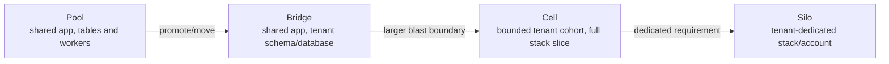
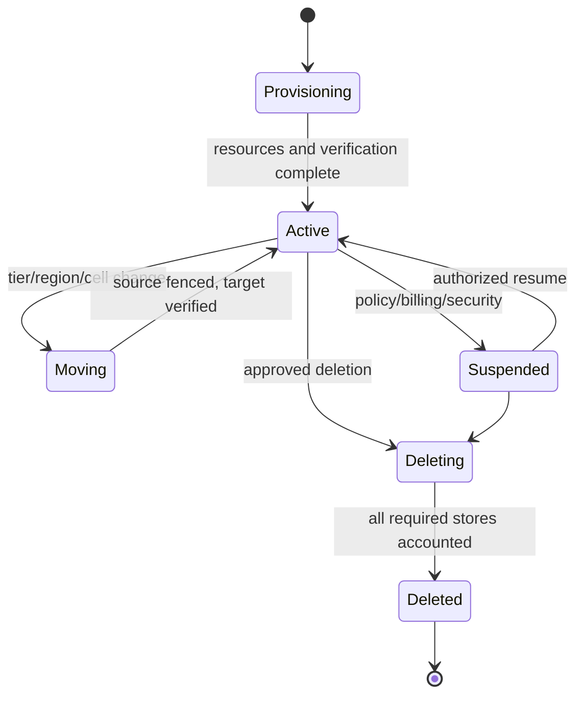
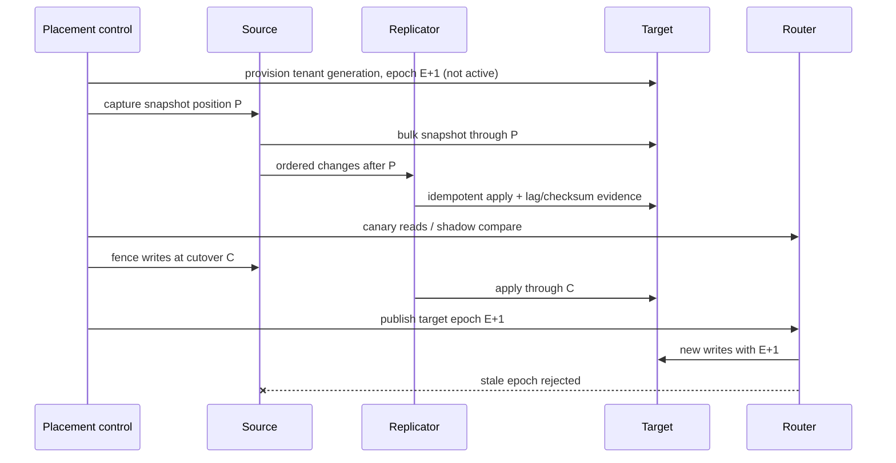

# Multi-Tenant Isolation and Tenant Lifecycle Architecture

## TL;DR

Multi-tenancy is not “add `tenant_id` to every table.” It is a system-wide isolation contract spanning identity, authorization, data, caches, queues, compute, network, configuration, cryptographic keys, observability, billing, backup, and operations.

A tenant context is selected from an authenticated principal's authorized memberships and bound to the request or job. It is never accepted merely because a token, path, header, model output, or message payload contains a tenant string. Every downstream resource uses the same canonical tenant identity and placement epoch.

Pool, bridge, silo, and cell models trade cost and operational scale against failure/security blast radius. Most SaaS platforms use several tiers: pooled infrastructure for the long tail, dedicated partitions/databases/cells or accounts for large, regulated, or adversarial workloads. That requires a tenant placement control plane and a rehearsed live migration protocol.

Isolation has two independent objectives:

- **confidentiality/integrity:** one tenant cannot read or mutate another tenant's state;
- **performance/availability:** one tenant cannot monopolize shared queues, connections, workers, storage, control-plane operations, or recovery capacity.

The architecture is incomplete until onboarding, configuration, export, residency change, pool-to-silo promotion, suspension, deletion, backup restore, and offboarding are durable, auditable state transitions.

---

## 1. Tenant Contract and Threat Model

A tenant may represent an organization, workspace, account, project, school, reseller subtree, or regulatory boundary. Define whether users can belong to multiple tenants and whether resources can be shared across them.

```text
TenantContext {
  canonical_tenant_id
  tenant_generation
  authenticated_principal
  delegated_workload
  authorized_membership_revision
  placement_epoch and cell/shard
  service_tier and policy revision
  residency/data-classification constraints
  request/job/operation identity
}
```

### 1.1 Threat model

Assume an attacker or defect may:

- substitute a tenant ID in path, query, body, token claim, queue message, or cache key;
- reuse an object ID from another tenant;
- exploit a route, batch job, support tool, or direct storage path that omitted scoping;
- poison a shared cache/search index or cause one tenant's result to be served to another;
- monopolize connections, workers, GPU/CPU, compaction, KMS, or control-plane queues;
- trigger a pathological query/import that degrades shard-mates;
- compromise a tenant administrator or integration without gaining platform authority;
- exploit stale placement during tenant migration;
- restore deleted/revoked tenant state from backup;
- read sensitive identifiers through logs, metrics, traces, billing, or error timing;
- use a global configuration or rollout error to affect every tenant.

### 1.2 Core invariants

1. **Canonical tenant binding:** every protected operation is bound to exactly one authorized tenant context or an explicitly modeled cross-tenant/platform operation.
2. **Complete mediation:** all paths—including async workers, exports, analytics, support, migration, search, cache, object storage, and restore—enforce that context.
3. **Defense in depth:** application authorization and the data/resource layer independently prevent cross-tenant access where practical.
4. **Global uniqueness of identity:** reused local object IDs cannot attach old or foreign permissions/data; tenant and generation are part of identity.
5. **Placement fencing:** a stale router/writer cannot mutate a tenant's old location after migration epoch changes.
6. **Bounded noisy-neighbor impact:** per-tenant and per-tier admission/fairness keep resource use within declared shares and global safety.
7. **Control-plane separation:** tenant-local authority cannot modify placement, tier, identity roots, retention, or another tenant.
8. **Auditable lifecycle:** provisioning, policy, movement, suspension, export, restore, and deletion have durable operation IDs and evidence.
9. **Deletion completeness:** every tenant-bearing system has a deletion/retention rule and backup-restore behavior.
10. **Recoverable isolation:** disaster recovery restores tenant boundaries, current revocations, placement, and keys before exposure.

---

## 2. Establish and Propagate Tenant Context

### 2.1 Authentication is necessary, selection is separate

An authenticated user may belong to many organizations. A signed claim can identify the user and perhaps memberships at token issuance; it does not automatically prove that a caller-selected tenant is current or that the user may perform this action there.

A safe entry path is:

```text
authenticate principal and workload
-> parse requested resource or tenant selector as untrusted input
-> resolve canonical tenant/resource
-> authorize membership/action at required policy revision
-> create immutable request TenantContext
-> route and enforce with that context
```

For a resource URL, resolve the canonical resource under a tenant-scoped lookup or composite identity. Do not perform global `SELECT ... WHERE id = :id` then trust the row's tenant after returning data.

Long-lived tokens should avoid embedding rapidly changing membership/role graphs. Bind stable identity and audience in the token; consult or cache current authorization with a revocation objective. See [Authentication Systems](../10-security/01-authentication-fundamentals.md) and [Authorization at Scale](../10-security/07-authorization-patterns.md).

### 2.2 Cross-service propagation

Downstream services receive an authenticated workload identity plus a signed/verified user delegation or internal request context. A header from the public client does not become trusted because a gateway forwarded it.

At each hop:

- discard external tenant headers and construct internal context;
- bind it to request/trace/operation identity;
- restrict downstream credentials to service/tenant/purpose where feasible;
- validate audience and prevent token passthrough to unintended services;
- propagate placement epoch so stale writers are rejected;
- record canonical IDs, not tenant names, in audit.

### 2.3 Asynchronous work

A queue job is a new authorization/execution event. Its envelope includes:

```text
tenant ID and generation
canonical resource/action
originating principal and actor workload (when relevant)
authorized workflow/purpose
placement epoch
operation ID
policy/freshness reference
expiry and signature/integrity evidence
```

The consumer authenticates the producer, validates the envelope, resolves current tenant state/placement, and obtains its own scoped capability. Do not serialize a broad user bearer token into a long-retained queue. Jobs for suspended/deleted/migrating tenants follow an explicit state policy rather than running from stale context.

---

## 3. Isolation Models



### 3.1 Pool

Shared tables, services, queues, and infrastructure minimize marginal cost and simplify fleet-wide rollout. Costs:

- every index/query/cache/object/message needs tenant scope;
- a missing predicate can leak data;
- large tenants cause hot partitions and maintenance skew;
- per-tenant restore/export/deletion are data-selection operations;
- one control/data-plane defect has broad blast radius.

### 3.2 Bridge

The app/control fleet is shared while data uses a database/schema/bucket/keyspace per tenant or cohort. It improves data isolation and lifecycle operations but multiplies:

- schema migrations and version skew;
- connection pools and credentials;
- backup/catalog objects;
- monitoring targets;
- idle capacity or per-database limits.

Thousands of database-per-tenant connections can exhaust server/pooler memory before storage is large. Route and pool by active tenant; do not hold one connection per dormant tenant.

### 3.3 Cell

A cell contains a bounded cohort and most data-plane dependencies. It limits failure and overload to cell tenants and permits incremental rollout. Shared global identity, placement, DNS, billing, or deployment can still defeat the boundary. [Cell-Based Architecture](./11-cell-based-architecture.md) owns cell construction; this chapter owns tenant placement and movement among cells.

### 3.4 Silo

Dedicated account/project, network, compute, database, keys, and possibly control plane offer the strongest contractual boundary. They add provisioning/patching/drift/observability/recovery cost and can still share provider, software, deployment, or organization-level identity roots.

### 3.5 Choose per dimension, not one label

A tenant can have a dedicated database but shared workers and KMS; or a shared database with dedicated encryption keys and queue. Record an isolation matrix:

| Dimension | Pool | Dedicated option | Why selected |
|---|---|---|---|
| transactional data | shared RLS tables | DB/account per tenant | confidentiality/lifecycle |
| worker execution | fair shared pool | tenant cell/pool | compute isolation |
| encryption | platform KEK | tenant key hierarchy | key control/deletion |
| networking | shared ingress | private endpoint/VPC | exposure/compliance |
| observability | shared pipeline, scoped views | dedicated sink | access/retention |
| backup/restore | shared snapshots + logical extract | per-tenant backup | restore objective |

“Dedicated” must name the resources and remaining shared fate.

---

## 4. Data-Layer Isolation

### 4.1 Composite identity and constraints

In pooled relational tables:

```sql
CREATE TABLE invoices (
  tenant_id uuid NOT NULL,
  invoice_id uuid NOT NULL,
  customer_id uuid NOT NULL,
  amount_cents bigint NOT NULL,
  PRIMARY KEY (tenant_id, invoice_id),
  FOREIGN KEY (tenant_id, customer_id)
    REFERENCES customers (tenant_id, customer_id)
);
```

Foreign keys, unique indexes, joins, and upserts include tenant scope. A global `UNIQUE(email)` may accidentally reveal or couple tenants; use `(tenant_id,email)` unless global uniqueness is a real platform invariant.

Opaque globally unique IDs reduce guessing but do not authorize access. Composite scope protects against ID collision/reuse and supports partition pruning.

### 4.2 Row-level security

Database row policies can contain application-query defects:

```sql
ALTER TABLE invoices ENABLE ROW LEVEL SECURITY;
ALTER TABLE invoices FORCE ROW LEVEL SECURITY;

CREATE POLICY tenant_isolation ON invoices
USING (tenant_id = current_setting('app.tenant_id', true)::uuid)
WITH CHECK (tenant_id = current_setting('app.tenant_id', true)::uuid);
```

Operational cautions:

- set tenant context transaction-locally after checkout from a connection pool;
- reset/rollback reliably before returning the connection;
- restrict table owners/bypass-RLS roles from application paths;
- cover writes with `WITH CHECK`, not reads only;
- test functions, views, security-definer code, COPY, maintenance and migrations;
- fail closed when context is absent/malformed;
- ensure query plans/indexes begin with tenant where needed.

RLS is defense in depth, not the whole authorization model. Domain action/resource policy still belongs at the service.

### 4.3 Cache, search, object and analytics keys

Every derived identity includes tenant and version:

```text
cache: (tenant_generation, authorization_scope, resource, representation, release)
search: tenant filter / security principal at candidate generation
object: canonical tenant namespace + immutable object/version
warehouse: tenant column and scoped views/policies
vector/KV cache: tenant + model/context/policy revision
```

Never cache a response by `user_id` or `resource_id` alone if IDs can overlap or permissions differ. Authorization filtering after global search/retrieval can leak snippets, counts, timing, logs, or candidates to downstream models; enforce before candidate exposure.

### 4.4 Global/shared data

Reference data such as product catalogs may be global, tenant-overridden, or shared across an explicit collaboration relation. Model that authority separately. A nullable `tenant_id` meaning “global” often creates surprising predicates and override precedence. Use a typed scope and deterministic resolution:

```text
tenant override at revision X
else platform default at revision Y
```

Cross-tenant sharing must create a relationship/policy object, not remove the tenant predicate ad hoc.

---

## 5. Tenant Placement Control Plane

A placement directory maps tenant generation to data-plane location:

```text
TenantPlacement {
  tenant_id and generation
  state: provisioning | active | moving | suspended | deleting | deleted
  service tier and isolation profile
  home region, cell, shard/database/bucket
  placement_epoch
  source/target during movement
  policy/config/key revisions
}
```

Routers cache this state by immutable epoch with bounded staleness. Writes carry the epoch; target storage/services reject stale epochs. A friendly tenant alias or domain resolves to canonical tenant generation and placement, but is not the storage key authority.

### 5.1 Control/data plane separation

The control plane provisions and moves tenants, changes tier/config/policy, and publishes placement. The data plane serves requests from an already resolved placement and should continue safely on last-known-good state during a bounded control-plane outage. Deletion, suspension, key revocation, or completed movement may require a freshness floor.

Control-plane mutations are high impact. Separate tenant-admin actions from platform placement authority, require idempotent operation IDs and preconditions, stage bulk changes, and audit source/target/epoch.

### 5.2 Directory scale

Do not call a central placement database on every request. Distribute versioned snapshots/deltas, cache locally, and provide at-least-epoch routing when a client observes a movement. Handle cold start and invalidation bursts; a global cache flush can turn the directory into a synchronous fleet bottleneck.

---

## 6. Performance Isolation and Fair Scheduling

Capacity without admission does not isolate tenants. Apply hierarchical limits:

```text
global safety budget
  -> region/cell budget
      -> service tier reservation + burst pool
          -> tenant rate/concurrency/queue/storage budget
              -> principal/workflow/action budget
```

### 6.1 Rate and concurrency

Rate limits control average/burst arrival; concurrency controls in-flight occupancy. A tenant with slow requests can consume the worker/connection pool while staying below requests/second. Charge weighted work units when requests differ materially:

```text
work_units = base + rows_scanned*w_r + bytes*w_b + gpu_ms*w_g + fanout*w_f
```

Estimate before admission and reconcile with actual usage for future enforcement/billing. Cap maximum query/import/document size independently.

### 6.2 Fair queues

One global FIFO lets a whale's import place every other tenant behind millions of jobs. Use per-tenant/subqueue state with weighted fair/deficit scheduling and per-tenant concurrency. Preserve priority without starvation: high tiers may have reservations and larger weights, but background work needs an aging/minimum-share policy.

[Priority, Fairness, and Backpressure](../18-workflow-job-systems/07-priority-fairness-backpressure.md) owns scheduler algorithms; this chapter owns tenant hierarchy and isolation objectives.

### 6.3 Shared downstreams

Enforce at the scarce dependency:

- database connection/query/statement budgets;
- cache memory and miss concurrency;
- KMS operations;
- object-store request/bytes;
- search/vector candidate work;
- external-provider calls;
- log/trace volume;
- compaction/reindex/migration/recovery bandwidth.

Edge rate limits alone do not prevent a single admitted request from creating huge internal fan-out.

### 6.4 Shuffle sharding and cells

Assign each tenant to a small deterministic subset of worker shards. If one tenant poisons its subset, only shard-mates are affected rather than the full fleet. Replicas/subsets must retain enough capacity and failure independence; a tenant's retry router cannot escape into every shard under failure and destroy containment.

---

## 7. Capacity and Cost Model

Tenant load is heavy-tailed. Model joined distributions, not “average tenant.”

Suppose an illustrative pooled cell has:

```text
tenants                         = 2,000
median peak concurrent requests = 3
p99 tenant peak concurrency     = 80
largest tenant peak             = 900
safe worker concurrency/cell    = 4,000
```

Multiplying median by tenants gives 6,000 and overstates if peaks are uncorrelated; summing every tenant peak can vastly overstate; using only average hides the whale. Replay time-aligned tenant traces and named events. The largest tenant alone consumes:

$$
\frac{900}{4{,}000}=22.5\%
$$

of safe cell concurrency, too large for a desired 5% blast share. Promote it to a dedicated shard/cell or cap/degrade it. Placement admission should reject a move that would violate cell headroom under one failure domain.

### 7.1 Database-per-tenant connection math

If 8,000 tenant databases each retain a minimum of two idle connections, the platform holds 16,000 connections before traffic. If server/pooler state averages an illustrative 6 MiB per backend, that is roughly 94 GiB. Use transaction/connection proxying, active-tenant pooling, cohort databases, or silo only tiers that fund the overhead. Measure exact engine/pooler state.

### 7.2 Cost attribution

Allocate:

- direct dedicated resources;
- metered requests/bytes/accelerator time;
- shared compute/storage/network by weighted usage;
- control-plane, backup, observability, support and recovery overhead;
- idle reserved isolation capacity;
- migration and compliance operations.

Unit cost per tenant/tier is an observability product, not a bill inferred from one tag. High-cardinality raw metrics may be expensive; stream tenant usage to a ledger and expose top-N plus aggregate series in monitoring.

---

## 8. Tenant Lifecycle as Durable Workflow



### 8.1 Provisioning

Reserve canonical tenant ID/generation, establish membership/admin, choose isolation/placement, create scoped resources/keys/config, seed data, verify read/write/isolation, then publish `Active`. Retries use the same operation ID. A partially provisioned tenant is not routable.

### 8.2 Configuration

Tenant-specific feature flags, policy, schema/extensions, integrations, and limits form versioned configuration. Validate against tier/platform constraints, roll out progressively, and record effective revisions. One tenant's malformed config must not crash a shared parser or expand another tenant's behavior.

Avoid one conditional branch per enterprise customer in application code. Model supported configuration and extension points with ownership and retirement.

### 8.3 Suspension

Define reads, writes, background jobs, integrations, exports, retention, and billing during suspension. Security suspension may require immediate credential/session revocation and outbound egress stop; billing suspension may permit read/export. Preserve audit and prevent queued work from resuming under stale state.

### 8.4 Export

An export manifest inventories every authoritative/derived included source, snapshot position, schema, checksum, encryption, and omission. Run against a consistent snapshot or explicitly describe time skew. Authorize delivery destination; a presigned URL is a bearer capability. Large exports consume fair-scheduled resources and expire/delete after policy.

### 8.5 Deletion

Build a data-location inventory:

```text
primary databases and historical versions
objects/uploads and CDN/cache
queues, workflow state and dead letters
search/vector indexes and feature stores
warehouse/lake and trained artifacts where applicable
logs, traces, metrics and audit
backups/archives and encryption keys
external processors/integrations
```

Publish a tenant-generation tombstone early so stale jobs/restores cannot reactivate it. Delete or render unavailable according to retention/legal hold; verify each system; store non-sensitive deletion receipts. Crypto-shredding helps only when every relevant copy is under the destroyed key and other tenants do not share it.

### 8.6 Per-tenant restore

Silo/bridge restore may replace a database; pooled restore is selective merge. Prevent ID/version collision, duplicate external effects, overwritten newer rows, and resurrection of deleted principals. Restore into isolation, compare/reconcile, write through normal operation identities, and reindex derived state. [Disaster Recovery and Data Reconstruction](../15-deployment/05-disaster-recovery.md) owns the broader protocol.

---

## 9. Pool-to-Silo or Cell Migration

A tenant promotion is a live state migration:



### 9.1 One authority

Avoid indefinite application dual-write as two authorities. Prefer one source plus ordered log/outbox/CDC replication. If synchronous dual-write is unavoidable, define partial success, idempotency, reconciliation, and the commit authority.

### 9.2 Data/identity coverage

Move database rows, objects, queue/workflow state, search/index, cache invalidation, keys/secrets, integrations, audit references, config, quotas, and placement. Derived state can rebuild, but its lag must meet cutover gates.

### 9.3 Validation

Compare row/object counts, content hashes or domain aggregates, sampled/full records, referential/business invariants, read results, authorization, and change positions. Tenant size and write rate determine backfill duration; throttle so source tenants and destination cell keep headroom.

### 9.4 Rollback

After target writes begin, rollback requires reverse replication or a forward repair; switching to a stale source loses writes. Keep source read-only for a bounded window, continuously prove target, and define the point of no return.

---

## 10. Security, Privacy, and Operational Isolation

### 10.1 Key hierarchy

Per-tenant logical keys improve audit, revocation and selective destruction, but increase KMS/cache cardinality. Bind tenant, object/resource, purpose and key version; a key alone does not replace tenant authorization. Dedicated tenants may use customer-managed keys, with explicit outage/rotation/recovery contracts.

### 10.2 Residency

Placement policy binds data class and allowed regions. Derived stores, backups, logs, support access, external processors, and model/training data must follow it. Routing a request to a region is insufficient if the feature store or observability pipeline exports data elsewhere.

### 10.3 Support and break glass

Support access is a common cross-tenant boundary. Require case/reason, exact tenant/resource/action, stronger approval for content access, time-bound capabilities, visible customer policy where appropriate, and independent audit. Do not grant global production database access because support serves many tenants.

### 10.4 Logs and metrics

Tenant tags are sensitive and high cardinality. Use canonical opaque IDs, access-controlled tenant views, redaction of payloads/tokens, retention policy, and a mapping service for display names. One tenant must not query another's traces or infer activity through shared dashboards.

### 10.5 Software and control-plane blast radius

Isolation is not only runtime resources. Stage configuration/schema/deployment by cell/tenant cohort; protect tenant import/plugins/webhooks as untrusted supply/egress; cap global control-plane fan-out; and preserve a rollback artifact. Silo data can still all fail from one globally deployed bug.

---

## 11. Concrete Failure Traces

### 11.1 Connection-pool tenant bleed

1. Request A sets session variable `tenant=A` on a pooled connection.
2. It returns the connection without transaction-local reset after an error.
3. Request B checks out the same connection and assumes `tenant=B` was set.
4. A query runs under A's RLS context.

Set context transaction-locally after checkout, fail closed when absent, guarantee rollback/reset, and run adversarial pool-reuse tests.

### 11.2 Cache key omits authorization scope

1. Tenant A requests resource ID 42; response caches under `resource:42`.
2. Tenant B also has local ID 42.
3. Cache returns A's serialized response before database/RLS runs.

Cache identity includes tenant generation, resource, representation, authorization/policy revision where relevant, and release. Treat cache as an enforcement-adjacent data store.

### 11.3 Global FIFO starves small tenants

1. One tenant submits two million import jobs.
2. Shared workers drain FIFO.
3. Every other tenant's interactive/background jobs sit behind the batch.

Use tenant subqueues, weighted fair scheduling, concurrency reservations, cost-aware admission, and import pacing.

### 11.4 Migration split brain

1. Router cache still points to source epoch 17.
2. Control plane activates target epoch 18.
3. Both databases accept writes because they do not check epoch.
4. Tenant state diverges after cutover.

Publish monotonic placement epochs and enforce them at write ownership. Drain/reconcile source through an ordered frontier.

### 11.5 Deleted tenant returns after restore

1. Tenant generation 3 is deleted and its current data removed.
2. Disaster recovery restores a backup from before deletion.
3. Routing/identity data is exposed before current tombstones and key revocations apply.
4. Old credentials or jobs reactivate data.

Keep current deletion tombstones/revocation authority independent, apply them before traffic, rotate credentials, and verify tenant-generation lifecycle during restore.

### 11.6 Bridge migration fan-out outage

1. Schema rollout opens one connection to each of 30,000 tenant databases.
2. Pooler/database exhausts connections and metadata locks.
3. Product traffic times out and retries.

Schedule bounded waves by size/tier, use per-database state/checkpoints, cap global and target concurrency, prioritize foreground work, and expose migration backlog/SLO.

### 11.7 Shared search filters too late

1. Search retrieves global top-K across all tenants.
2. App filters unauthorized hits after snippets/reranking/logging.
3. Tenant A content reaches shared reranker traces and changes timing/counts for tenant B.

Apply tenant/authorization constraints during candidate generation, partition indexes where required, and scope caches/logs.

### 11.8 Tenant-specific config crashes shared fleet

1. One tenant uploads a deeply recursive rule/template.
2. Shared instances parse/evaluate it on request.
3. CPU/memory exhausts and all tenants fail.

Validate/compile in isolation, bound complexity, publish immutable qualified config, charge evaluation work, and isolate extensions by tier/cell.

---

## 12. Observability and Verification

### 12.1 Signals

Track distributions and top contributors:

- cross-tenant policy/RLS denials and missing context;
- stale placement epoch rejections and directory lag;
- tenant rate, concurrency, queue age, work units and throttling;
- shared-resource saturation attributed by tenant/tier;
- per-tenant/cell SLO and noisy-neighbor impact;
- database/index/object/cache bytes and skew;
- provisioning/migration/export/deletion/restore state and age;
- config/policy/key revision and drift;
- cost ledger coverage/unattributed usage;
- support/break-glass access;
- isolation canary and synthetic-tenant results.

Do not put every tenant ID on every metrics series. Maintain a usage/event ledger, top-N heavy hitters, cohort/cell/tier aggregates, and on-demand tenant diagnostics.

### 12.2 Isolation test matrix

For every resource/action/path, generate tenants A/B with colliding local IDs and attempt:

- direct ID substitution and enumeration;
- read/write/upsert/delete/batch/export across tenants;
- cache hit after another tenant;
- queue/job replay with altered tenant envelope;
- connection-pool reuse and transaction error;
- search/list/pagination and object presigned URLs;
- support/admin and migration endpoints;
- stale placement epoch and restored backup;
- logs/traces/metrics and error-message existence leakage.

Negative tests are release gates. Property tests can assert that replacing tenant context with another tenant never returns/mutates the original resource unless an explicit sharing relation authorizes it.

### 12.3 Performance and fault tests

Replay heavy-tailed tenant traces. Saturate one tenant's CPU, database, connection, queue, cache, object, KMS, search and observability budgets while measuring unrelated tenants. Lose a cell, migrate a whale during peak, flush placement caches, pause the control plane, and restore a pooled tenant. Verify global safety limits and minimum shares under retry storms.

Synthetic tenants in production can continuously exercise each isolation tier, but must not hold real privilege/data or create an alternate bypass path.

---

## 13. Design Review Framework

Ask:

1. What exactly is a tenant, can principals belong to several, and how is active context authorized and revisioned?
2. Which request, async, support, export, migration, search, cache, object, analytics, and restore paths enforce it?
3. What isolation boundary exists per data, compute, network, key, control, observability, backup and operation dimension?
4. Which resources remain shared even for a “dedicated” tenant?
5. How do RLS/keys/indexes/constraints and connection-pool lifecycle fail closed?
6. What placement epoch fences stale routers/writers during movement?
7. What tenant/tier minimum share, concurrency and maximum work protects noisy-neighbor objectives?
8. How do top tenant skew and one failure domain affect cell capacity?
9. Can onboarding, config, suspension, export, deletion, restore and offboarding resume safely after every crash point?
10. How are current deletion/revocation state and cryptographic keys applied during disaster recovery?
11. Can a tenant move from pool to bridge/cell/silo without two write authorities?
12. Which adversarial isolation and performance-fault tests run continuously?

Choose pooling when logical controls, fair sharing and lifecycle tooling meet the risk/cost contract. Choose bridge/cell/silo where stronger data, failure, performance, residency, key or operational boundaries justify their recurring control-plane cost. Design movement before the first tenant outgrows its tier.

---

## References

- [AWS Well-Architected SaaS Lens](https://docs.aws.amazon.com/wellarchitected/latest/saas-lens/saas-lens.html) — tenant isolation, onboarding, identity, tiering and operations
- [Azure Architecture Center: Multitenant solutions](https://learn.microsoft.com/azure/architecture/guide/multitenant/overview) — isolation models and service-specific trade-offs
- [Kubernetes multi-tenancy](https://kubernetes.io/docs/concepts/security/multi-tenancy/) — namespace, control/data-plane and stronger-isolation considerations
- [PostgreSQL Row Security Policies](https://www.postgresql.org/docs/current/ddl-rowsecurity.html) — database-enforced row policy semantics and bypass conditions
- [Amazon DynamoDB fine-grained access control](https://docs.aws.amazon.com/amazondynamodb/latest/developerguide/specifying-conditions.html) — leading-key and attribute policy conditions
- [Shue et al., *Performance Isolation and Fairness for Multi-Tenant Cloud Storage*](https://www.usenix.org/conference/osdi12/technical-sessions/presentation/shue) — fairness and isolation under shared storage load
- [Vuppalapati et al., *Building An Elastic Query Engine on Disaggregated Storage*](https://www.usenix.org/conference/nsdi20/presentation/vuppalapati) — multi-tenant scheduling and resource separation in analytical infrastructure
- [Stripe: Online migrations at scale](https://stripe.com/blog/online-migrations) — live backfill, dual-read/write and cutover lessons
- [NIST SP 800-207: Zero Trust Architecture](https://csrc.nist.gov/pubs/sp/800/207/final) — identity/resource-based access independent of network location
