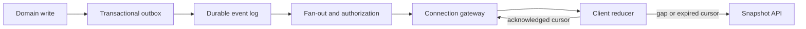
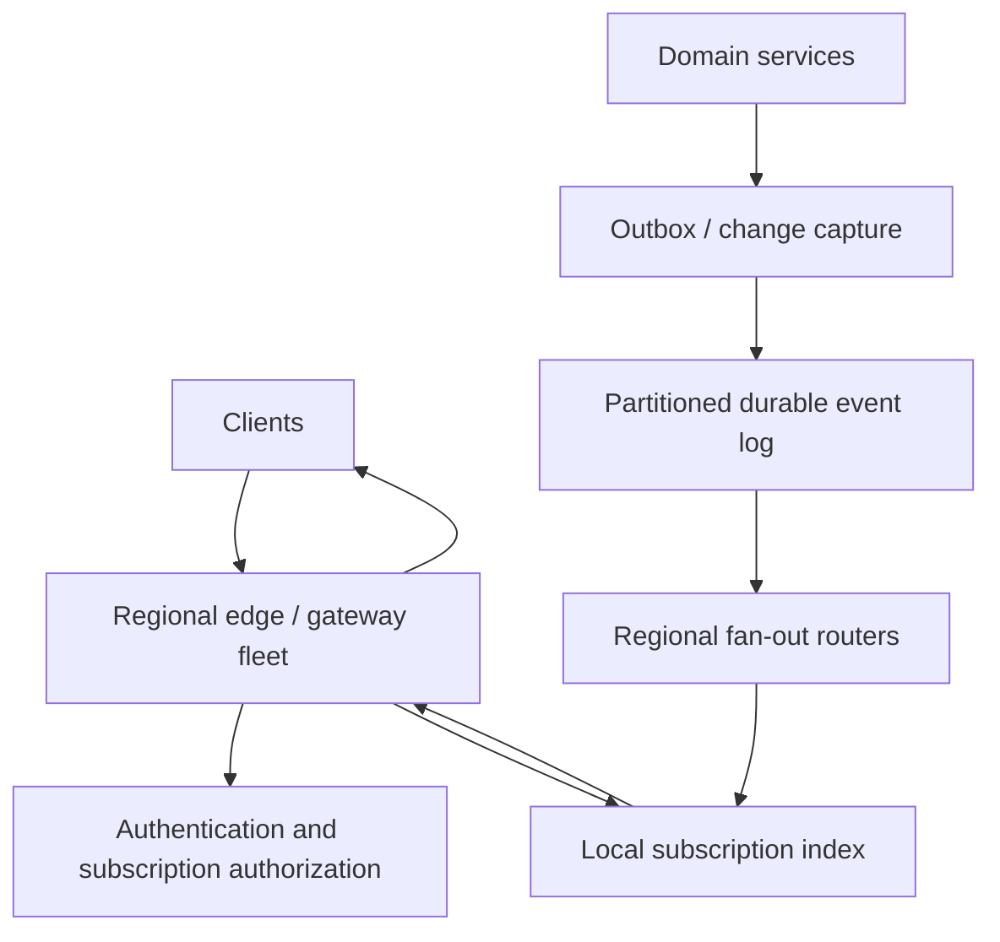

# Client Delivery Transports

## TL;DR

Polling, long polling, Server-Sent Events (SSE), and WebSockets wake clients when server-side state changes; they do not define the end-to-end reliability model. First define a durable, authorization-aware event stream with stable IDs, replay retention, ordering scope, deduplication, snapshot recovery, and a slow-consumer policy. Then choose the least powerful transport that meets latency and directionality requirements. Polling suits infrequent or cacheable reads; long polling lowers latency while retaining request/response semantics; SSE provides a browser-native server-to-client stream; WebSocket adds full duplex and binary messages. None provides exactly-once delivery, durable replay, cross-region continuity, or backpressure by itself.

---

## Start With the Delivery Contract

The transport is the last hop of a larger pipeline:



If the domain write and event publication are a dual write, an update can disappear before any transport sees it. If the gateway consumes only ephemeral pub/sub, a reconnect cannot recover a missed update. If authorization is checked only when a socket opens, a user can continue receiving a channel after access is revoked. These are correctness failures even when every TCP connection is healthy.

Define the contract before choosing a protocol:

- **Stream identity:** the entity, tenant, topic, or subscription whose order is meaningful.
- **Event identity:** a stable ID reused when delivery is retried; never an ID generated by the gateway on each attempt.
- **Ordering scope:** usually monotonic per stream or partition, not one global order across the product.
- **Retention:** how far a disconnected client can replay and what happens after the cursor expires.
- **Delivery semantics:** normally at-least-once across reconnects, with a client reducer that ignores duplicates.
- **Snapshot boundary:** how a client obtains a consistent base state and then continues with deltas without a gap.
- **Slow-consumer policy:** buffer, coalesce, drop-and-resync, or disconnect; an unbounded queue is not a policy.
- **Authorization point:** every snapshot, replay, subscription, and live event must be authorized against current policy.

### A transport-neutral event envelope

Use the same logical envelope over every transport:

```json
{
  "stream": "tenant/t-17/order/o-42",
  "event_id": "01J...",
  "sequence": 1842,
  "schema_version": 3,
  "kind": "order.status_changed",
  "occurred_at": "2026-07-18T12:34:56.123Z",
  "payload": { "from": "paid", "to": "shipped" }
}
```

`sequence` is the replay position and ordering key; `event_id` is the idempotency key. A timestamp is useful for observation but is a poor cursor: clocks collide and skew, database commits can become visible out of timestamp order, and `WHERE updated_at > last_seen` loses rows when several updates share a timestamp. If a database keyset is the source, use a stable tuple such as `(commit_position, primary_key)`. If a log is the source, use its partition and offset. Treat cursors as opaque, signed values so the server can evolve their encoding and reject tenant or stream tampering.

### Snapshot plus replay without a race

A naive client performs `GET /snapshot`, then opens a stream. An event committed between those operations is lost. Use one of two explicit protocols:

1. **Snapshot-at-position:** the snapshot response includes position `p`; subscribe with `after=p`; the log retains every event after `p`.
2. **Subscribe-then-snapshot:** open a subscription and buffer events, obtain a snapshot at `p`, discard buffered events at or before `p`, then apply the remainder.

When a cursor is outside retention, return a typed `cursor_expired` response rather than silently starting at "now." The client must discard derived state, fetch a fresh snapshot, and resume from its returned position. This recovery path should be exercised continuously; it is not an exceptional migration script.

---

## The Four Transport Mechanics

### Short polling

The client issues a bounded request, receives updates or an unchanged response, waits, and repeats. It is the easiest path through browsers, CDNs, enterprise proxies, serverless runtimes, and ordinary request tracing.

For a representation, HTTP validators avoid retransmitting unchanged bodies: the server returns an `ETag`, and the client later sends `If-None-Match`; `304 Not Modified` means the cached representation is still valid. For a change feed, prefer `GET /events?after=<cursor>&limit=N` and return `next_cursor`, even when the page is empty. Do not advance to the server's wall-clock time; advance only to a position whose preceding events were included in the response.

Polling latency is approximately half the interval for uniformly distributed updates, while request rate is:

```text
poll_requests_per_second = active_clients / polling_interval_seconds
```

One million active clients polling every 15 seconds generate about 66,700 requests/s before retries. Adaptive polling can increase the interval while idle, shorten it during active work, pause in hidden tabs, and honor `Retry-After`. Add full jitter so a deploy, network recovery, or minute boundary does not synchronize the fleet. Conditional requests reduce bytes, not request count or authentication work.

Use short polling when updates are infrequent, several seconds of latency are acceptable, responses can be cached or shared, or the environment does not reliably permit long-lived connections. It is also the safest fallback when streaming paths fail.

### Long polling

A long-poll request first replays anything after the cursor. If nothing is available, the server waits until an event arrives or an application timeout elapses, returns a bounded batch, and the client immediately issues the next request with the returned cursor.

```mermaid
sequenceDiagram
    participant C as Client
    participant G as Gateway
    participant L as Durable log
    C->>G: GET /events?after=1842&wait=25s
    G->>L: read after 1842
    L-->>G: empty; register wake-up
    Note over G: wait, but keep request cancellable
    L-->>G: position 1843 available
    G-->>C: 200 [event 1843], next=1843
    C->>G: GET /events?after=1843&wait=25s
```

Set the application wait below the smallest intermediary request or idle timeout, and the client deadline above the server wait plus network margin. A timeout response is normal progress, not an error. A `408`, `429`, `502`, `503`, transport reset, or ambiguous client timeout enters jittered backoff and retries the same cursor. Only one outstanding poll per logical subscription is safest; overlapping polls can return out of order and complicate cursor advancement.

The wake-up mechanism may be ephemeral because it is only a latency optimization. Correctness comes from reading the durable log before and after registering the waiter; otherwise an event published in the registration race can sleep until timeout. Sticky routing is unnecessary when any gateway can read the same log and cursor.

Long polling is useful when push latency is needed but streaming responses or WebSocket upgrades are unreliable. It still pays request parsing, authentication, and header overhead after each batch and can create a reconnect wave at every timeout boundary.

### Server-Sent Events (SSE)

SSE is an HTTP response with media type `text/event-stream`. The server emits UTF-8 fields separated by a blank line:

```text
id: tenant-17:1843
event: order.status_changed
data: {"order_id":"o-42","to":"shipped"}

: heartbeat comment

retry: 5000
```

The browser `EventSource` API reconnects automatically and sends the last processed `id` in `Last-Event-ID`. That is a transport convenience, not a replay store: the ID must map to retained durable history, and the server must reject an expired position explicitly. `event` selects a named client handler, `data` may span several lines, `retry` changes the browser's reconnection delay, and comment lines can keep an otherwise idle path active.

SSE is one-way. Client writes use normal authenticated HTTP requests, which is often desirable: commands retain request IDs, status codes, CSRF defenses, rate limits, and independent retries. Native `EventSource` has a constrained request API; if authorization cannot use a secure same-site cookie, use a fetch-based streaming client or issue a short-lived, single-purpose stream ticket. Never put a reusable bearer token in a URL that can enter history, referrer, or access logs.

Intermediaries must forward chunks rather than buffer until a response-size threshold. Heartbeat cadence must be shorter than the smallest idle timeout on the real path, but heartbeats do not replace application sequence numbers. Under HTTP/1.1, per-origin browser connection limits can matter when each tab opens several streams; HTTP/2 or HTTP/3 multiplexes streams, subject to negotiated limits and intermediary support.

Choose SSE for browser-facing, predominantly server-to-client delivery such as notifications, job progress, dashboards, feeds, and invalidations. Its text-only framing is a poor fit for high-volume binary data, and the browser API exposes little writable-buffer feedback, so the server still needs a bounded per-connection queue and a resync policy.

### WebSocket

WebSocket begins with an HTTP handshake and then carries full-duplex text or binary messages. RFC 6455 defines message fragmentation plus control frames for `ping`, `pong`, and `close`; TCP preserves byte order, but the application still needs event IDs because reconnecting creates a new connection with no protocol-level replay. WebSocket over HTTP/1.1 uses `Upgrade`; HTTP/2 and HTTP/3 use Extended CONNECT when every hop supports it.

Define an application protocol rather than sending anonymous JSON blobs:

```json
{
  "v": 2,
  "type": "subscribe",
  "request_id": "c-991",
  "stream": "tenant/t-17/orders",
  "after": "opaque-cursor",
  "auth_context_version": 28
}
```

Responses correlate with `request_id`; delivered events use the transport-neutral envelope; errors are typed as retryable, terminal, auth-expired, cursor-expired, or overloaded. Version the protocol and negotiate capabilities during connection setup. A WebSocket library's successful `send()` usually means "queued locally," not "delivered to the peer." Browser clients must watch `bufferedAmount`; servers must bound queued bytes and messages.

Use protocol ping/pong for connection liveness where the runtime exposes it. Application heartbeats are still useful when an intermediary or browser API hides control frames, but distinguish transport liveness from domain presence. Authenticate the handshake, authorize each subscription and command, cap frame and decompressed-message size, validate UTF-8/JSON/schema before allocation-heavy work, and rate-limit both messages and bytes. Compression such as `permessage-deflate` saves bandwidth but costs CPU and memory and can amplify tiny compressed inputs; negotiate it deliberately and benchmark with production payloads.

Choose WebSocket when the server and client both send frequent, low-latency messages, when binary framing matters, or when many logical channels benefit from one duplex connection. Do not choose it merely because the product is described as "real time."

### Comparison by operational consequence

| Property | Short polling | Long polling | SSE | WebSocket |
|---|---|---|---|---|
| Direction | Client request, server response | Client request, delayed response | Server to client; commands use HTTP | Full duplex |
| Idle connection | No | One request per subscription | Long-lived HTTP stream | Long-lived upgraded/CONNECT stream |
| Reconnect API | Application | Application | Browser-managed in native `EventSource` | Application |
| Replay | Application cursor | Application cursor | `Last-Event-ID` carries a cursor; history is application-owned | Application cursor |
| Binary | Normal HTTP body | Normal HTTP body | No; UTF-8 event stream | Yes |
| HTTP cache benefit | Strong for representations | Usually disabled | No | No |
| Backpressure visibility | Request/page boundary | Response/page boundary | Limited in browser API | Writable-buffer signals, still application-owned |
| Best default | Infrequent/cacheable state | Constrained streaming environments | Browser server-push | Frequent bidirectional traffic |

Latency labels such as "WebSocket = 1 ms" are misleading. Once a connection is established, SSE and WebSocket often traverse the same network and event loop. End-to-end latency is dominated by publication, fan-out, queueing, regional distance, and client processing; protocol framing is rarely the largest term.

---

## Ordering, Deduplication, and Replay

TCP orders bytes on one connection. It does not order events produced concurrently on different partitions, duplicated by fan-out workers, or delivered before and after a reconnect. Make ordering an application invariant:

1. Assign a sequence at the authoritative append point, not independently at each gateway.
2. Preserve order per declared stream or partition.
3. Include both sequence and stable event ID in every delivery.
4. Have the client persist its last *applied* cursor, not merely the last received cursor.
5. Ignore an already-applied event ID or sequence; detect a forward gap and replay before applying later dependent events.
6. Treat a snapshot as state at a named log position, never as "whatever the database returned around now."

Acknowledgments have two uses: advancing a durable per-device resume cursor and releasing gateway buffer. They do not create exactly-once delivery. If the server sends event 1843, the client applies it, and the acknowledgment is lost, event 1843 will be sent again. The reducer must be idempotent. Client-to-server commands need their own stable idempotency keys because a response can be lost after the command commits.

Avoid one global sequence unless the product truly needs global serialization; it becomes a write bottleneck and a cross-region availability dependency. A composite cursor may contain one offset per subscribed partition. If that token grows too large, store subscription progress server-side and give the client an opaque resume token bound to user, device, stream set, and expiry.

---

## Reconnect Without Creating an Outage

A reconnect loop is a distributed load generator. Use capped exponential backoff with full jitter:

```text
cap_n = min(max_delay, base_delay * 2^attempt)
sleep = random(0, cap_n)
```

Reset the attempt counter only after the connection has remained healthy long enough to prove recovery, not immediately after an open event. Otherwise a flapping endpoint reconnects at the minimum delay forever. Honor a server-supplied `Retry-After` or application `retry_after_ms` as a floor, pause when the device is offline or the tab is frozen, and give manual user actions a limited fast path.

On reconnect, the client sends its last applied cursor and current subscription set. The server returns one of:

- `resumed`: replay begins strictly after the cursor;
- `cursor_expired`: fetch a fresh snapshot;
- `reauthenticate`: rotate credentials before retrying;
- `moved`: reconnect to a new region or shard with a signed handoff token;
- `overloaded`: wait for the supplied backoff floor.

Randomize planned reconnects as well. If certificates, tokens, deployments, or gateway maximum connection ages all expire on a common boundary, they can disconnect an entire fleet together. Spread expirations and drain deadlines across a window.

---

## Flow Control and Slow Consumers

The producer's durable log is not the same thing as a per-connection output queue. A client can stop reading while its socket remains open, a mobile radio can collapse to a few kilobits/s, or a browser main thread can pause. Without a bound, one connection can retain arbitrary memory and eventually crash its gateway.

Track queued bytes, oldest queued event age, and writable latency per connection. Pick a policy by event semantics:

- **Lossless ordered events:** stop reading from the subscription, retain the cursor in the durable log, and disconnect when the resume window is at risk.
- **Latest-value state:** coalesce superseded updates by key; an unread `cpu=42` need not precede `cpu=43`.
- **Ephemeral telemetry or cursor motion:** sample or drop intermediate values and send the latest state plus a dropped-count signal.
- **Mixed traffic:** use separate logical queues and budgets so a large snapshot or file transfer cannot head-of-line-block control messages.

Return an explicit `resync_required` before disconnecting when possible. A reconnect that resumes from a durable cursor is normal flow control, not necessarily an error. Bound inbound work too: cap message size, commands in flight, subscription count, and per-tenant fan-out. This is the real-time form of [backpressure](../06-scaling/07-backpressure.md).

---

## Proxies, Timeouts, and Connection Draining

Test the complete path—browser, carrier NAT, corporate proxy, CDN, WAF, load balancer, service mesh, gateway—not only localhost. Record these budgets separately:

- handshake/connect timeout;
- maximum request duration for long polling;
- idle timeout when no bytes cross the path;
- maximum connection age;
- drain grace period during deploy;
- application heartbeat and liveness threshold.

Choose a heartbeat interval below the smallest observed idle timeout with margin. Do not set every intermediary to an arbitrary 24-hour timeout: dead connections then occupy state longer, config drifts, and planned draining becomes harder. Streaming responses must disable unwanted transformation and buffering; WebSocket handshakes must preserve the appropriate Upgrade or Extended CONNECT semantics. HTTP/2 and HTTP/3 multiplexing can reduce connection pressure, but stream limits and feature support still vary across hops.

During a deploy, remove a gateway from new-connection routing first. Existing clients continue until a bounded deadline. Then the gateway sends a protocol-level drain notice containing a randomized reconnect window and, where needed, a signed target-region token. It stops accepting new subscriptions, flushes cursors, waits for acknowledgments within the deadline, and closes. A process signal alone cannot communicate this choreography to clients. See [DNS and connection management](../06-scaling/13-dns-and-connection-management.md) for the surrounding load-balancer lifecycle.

Sticky sessions are an optimization, not a recovery strategy. A gateway should hold only disposable connection-local state; durable subscription positions and event history must survive its loss.

---

## Authentication, Authorization, and Credential Rotation

Long-lived delivery turns a one-time authentication decision into a continuing authorization problem.

- Use TLS (`https`/`wss`) and reject insecure downgrade paths.
- Authenticate at connection establishment, but authorize every requested stream and every client command.
- Bind resume tokens to subject, tenant, device/session, subscription scope, cursor, and expiry; sign or encrypt them.
- Re-evaluate authorization when policy or membership versions change. Do not replay events that the current principal can no longer read.
- Support in-band credential refresh or a graceful reconnect before token expiry. Never let an expired connection live indefinitely merely because the TCP session remains open.
- For cookie-authenticated handshakes, validate `Origin`, use appropriate `SameSite` and CSRF controls for command endpoints, and treat cross-site WebSocket hijacking as a real threat.
- Avoid reusable credentials in query strings. Short-lived, audience-restricted, single-use stream tickets reduce log and referrer exposure when headers are unavailable.
- Apply revocation to subscription indexes and queued messages, not only to new connections. Purge buffered data when a principal loses access.

Authentication success is not permission to subscribe to an arbitrary tenant-derived channel name. Resolve logical resource IDs through an authorization service and produce server-side routing keys; never trust the client to supply an internal pub/sub topic directly.

---

## Horizontal and Regional Architecture

A scalable service separates four planes:



Gateways own sockets and bounded output queues. Fan-out routers consume durable partitions and deliver only to gateways with local subscribers. The subscription index is soft state rebuilt from connected clients; the log and cursor are durable state. Ephemeral pub/sub can wake gateways but must not be the only copy of a message that promises replay.

Route a client to a nearby region, but decide where the authoritative stream position lives. Common models are:

- **Home-region stream:** all mutations and sequence assignment for a stream occur in one region; remote gateways subscribe across regions. Ordering is simple, cross-region latency and dependency are explicit.
- **Partition-local streams:** each region appends to its own partition; the client receives a vector cursor and no global order is promised. Availability improves, client merging becomes part of the contract.
- **Replicated log with elected leader per partition:** a current leader assigns order; failover preserves the partition's log semantics at the cost of coordination.

Never manufacture independent regional counters and compare them as one sequence. A regional failover can reconnect to another gateway only if that region can validate the cursor and access the corresponding retained history. Otherwise return `resync_required` honestly.

Limit blast radius with tenant or stream cells, per-cell connection caps, and shuffle-sharded fan-out. A celebrity channel should not cause every router to deserialize every event. Maintain regional subscriber counts, send one event per interested gateway, and fan out locally.

---

## Capacity Math

Model connections, requests, bytes, fan-out, and churn separately.

### Connection state

```text
connections = concurrent_active_clients * connections_per_client
gateway_memory ≈ connections * (socket + TLS + protocol + app_state + bounded_queue)
```

At 2 million connections and a measured 38 KiB per connection, baseline memory is about 72.5 GiB before allocator headroom, queues, and process overhead. If the queue cap is 256 KiB, it is a limit, not memory to reserve for every connection; nevertheless, a correlated slow-client event can drive usage toward it, so load tests must exercise the cap.

### Heartbeats and churn

```text
heartbeat_messages_per_second = connections / heartbeat_interval
new_connections_per_second = connections / mean_connection_lifetime
```

Two million connections heartbeating every 25 seconds create 80,000 inbound and 80,000 outbound messages/s. With a six-hour mean lifetime they average only 93 new connections/s, but a regional outage can force hundreds of thousands of TLS handshakes per second. Size normal churn and reconnect storms as different scenarios.

### Delivery and fan-out

```text
delivered_messages_per_second = published_events_per_second * mean_interested_subscribers
egress_bytes_per_second = sum(deliveries * encoded_size) + protocol/TLS overhead
```

One thousand 600-byte events/s with 4,000 interested clients each is 4 million deliveries/s and roughly 2.4 GB/s of payload before framing. Optimize subscription routing, filtering, coalescing, and payload shape before arguing about a few bytes of WebSocket framing.

### Polling and long polling

For short polling, request rate follows the interval formula above. For long polling with maximum wait `T` and message arrival rate `m` per client, each request ends after approximately `min(T, 1/m)`; timeout-aligned reconnects can create periodic spikes even when average QPS looks safe. Count open requests, completions/s, authentication CPU, canceled waiter cleanup, and downstream log reads.

Capacity tests must include TLS handshakes, compression, serialization, authorization cache misses, worst-case subscription counts, slow readers, gateway loss, and a reconnect wave. A benchmark that writes to already-open loopback sockets measures almost none of the production system.

---

## Failure Modes

| Failure | Observable symptom | Correct containment |
|---|---|---|
| Domain commit succeeds but publication fails | Clients never see an update | Transactional outbox/change capture; replay from durable history |
| Cursor is a timestamp | Missing or reordered events at equal/skewed times | Log position or stable compound key |
| Gateway crashes | Connections reset; local queues disappear | Reconnect with last applied cursor; gateways remain disposable |
| Pub/sub drops a message | Live clients develop a sequence gap | Detect gap and replay from durable log |
| Cursor falls outside retention | Infinite reconnect or silent jump to now | Typed expiry, snapshot at a new position, then resume |
| One client stops reading | Gateway memory and latency grow | Bounded queue; coalesce, disconnect, or resync by message class |
| Proxy buffers SSE | Events arrive in bursts | Disable buffering/transformation and verify first-byte/chunk latency end to end |
| Idle timeout is shorter than heartbeat | Periodic unexplained disconnects | Measure every hop; heartbeat with margin and jitter |
| Clients retry immediately | Reconnect storm extends outage | Capped exponential backoff, full jitter, server retry floor |
| Deployment closes every stream at once | Handshake and auth spike | Readiness-first draining and randomized reconnect window |
| Token expires mid-connection | Unauthorized stale session or mass disconnect | In-band rotation or staggered graceful reconnect; continuous authorization |
| Independent regions assign "global" sequence | Failover duplicates or reverses order | One sequencer per ordering scope or explicit vector cursor |
| Compression bomb or giant frame | CPU/memory exhaustion | Compressed and decompressed size limits, quotas, early schema validation |

---

## Testing the Contract

Test observable invariants, not library callbacks:

1. Generate concurrent writes and prove every authorized event after snapshot position `p` is eventually applied exactly once by the client reducer despite duplicate delivery.
2. Kill a gateway after write, after send, after client apply, and before acknowledgment; each case must converge after reconnect.
3. Delay and reorder fan-out partitions; verify per-stream ordering, gap detection, and bounded buffering.
4. Expire replay retention intentionally and exercise snapshot recovery while new writes continue.
5. Put the real CDN, WAF, load balancer, and mesh in the test path; verify timeouts, buffering, HTTP versions, and close codes.
6. Freeze clients and throttle receive bandwidth; verify queue caps and that one slow tenant cannot consume the fleet.
7. Revoke a subscription while events are queued and confirm no later delivery or replay leaks it.
8. Drain and kill a region while traffic is active; measure reconnect spread, cursor portability, loss, duplication, and time to recovery.
9. Rotate signing keys and access tokens with a mixed-version client population.
10. Load test a correlated reconnect storm, not just steady open connections.

Useful service-level indicators include resume success rate, replay lag, cursor-expired rate, reconnect attempts per active client, connection setup latency, queued bytes and oldest event age, dropped/coalesced messages, authorization denials, fan-out amplification, abnormal close codes, and end-to-end publish-to-apply latency.

---

## Decision Framework

Ask in this order:

1. **Can the product tolerate the polling interval?** Use conditional, adaptive short polling. It has the smallest operational surface.
2. **Is delivery only server to browser?** Prefer SSE when the full path streams reliably; keep commands on ordinary HTTP.
3. **Must the same channel carry frequent client messages or binary frames?** Use WebSocket with a versioned application protocol.
4. **Do intermediaries reject or buffer streaming?** Use long polling with a durable cursor; correctness stays the same.
5. **Is the workload media, unreliable low-latency datagrams, or peer connectivity?** These four transports are not a media plane; use [WebRTC](./05-webrtc.md).

Then verify the non-negotiable contract: retained replay, snapshot boundary, idempotent reducer, explicit ordering scope, bounded queues, auth rotation, drain protocol, regional cursor semantics, and tested failure recovery. If those are absent, changing transport only changes how quickly the system fails.

---

## Key Takeaways

1. Polling, long polling, SSE, and WebSocket are wake-up and framing choices; reliability belongs to the application stream.
2. A stable event ID plus an ordered cursor is the foundation of replay, deduplication, and gap detection; timestamps are not safe cursors.
3. Snapshot and subscription must meet at a named log position or an update can disappear in the handoff race.
4. Reconnects deliver at least once. Persist the last applied cursor and make both client reducers and commands idempotent.
5. Every connection needs bounded inbound and outbound work; slow-consumer policy depends on whether events are lossless, coalescible, or ephemeral.
6. Full-jitter backoff, server retry floors, randomized expiry, and readiness-first draining keep reconnects from becoming an outage multiplier.
7. Authentication at open time is insufficient: replay, subscription, queued delivery, and credential rotation all need current authorization.
8. Regional failover is correct only when the new region understands the cursor and can access its history; sticky sessions are merely an optimization.
9. Size deliveries and reconnect storms, not only open sockets. Fan-out amplification and TLS/auth work usually dominate framing overhead.
10. Choose the least powerful transport that satisfies directionality, latency, binary, and intermediary constraints.

---

## References

- [RFC 9110: HTTP Semantics](https://datatracker.ietf.org/doc/html/rfc9110) — validators, conditional requests, `Retry-After`, and HTTP semantics
- [RFC 9111: HTTP Caching](https://datatracker.ietf.org/doc/html/rfc9111) — cache validation and freshness
- [RFC 6202: Known Issues and Best Practices for Long Polling and Streaming](https://datatracker.ietf.org/doc/html/rfc6202) — timeout, intermediary, resource, and security considerations
- [WHATWG HTML: Server-Sent Events](https://html.spec.whatwg.org/multipage/server-sent-events.html) — `EventSource`, event-stream parsing, reconnection, and `Last-Event-ID`
- [RFC 6455: The WebSocket Protocol](https://datatracker.ietf.org/doc/html/rfc6455) — handshake, framing, control frames, origin, and closure
- [RFC 7692: Compression Extensions for WebSocket](https://datatracker.ietf.org/doc/html/rfc7692) — negotiated per-message compression
- [RFC 8441: Bootstrapping WebSockets with HTTP/2](https://datatracker.ietf.org/doc/html/rfc8441) — Extended CONNECT over HTTP/2
- [RFC 9220: Bootstrapping WebSockets with HTTP/3](https://datatracker.ietf.org/doc/html/rfc9220) — Extended CONNECT adaptation for HTTP/3
