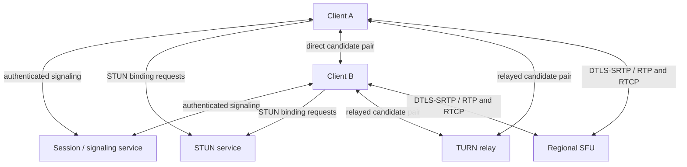
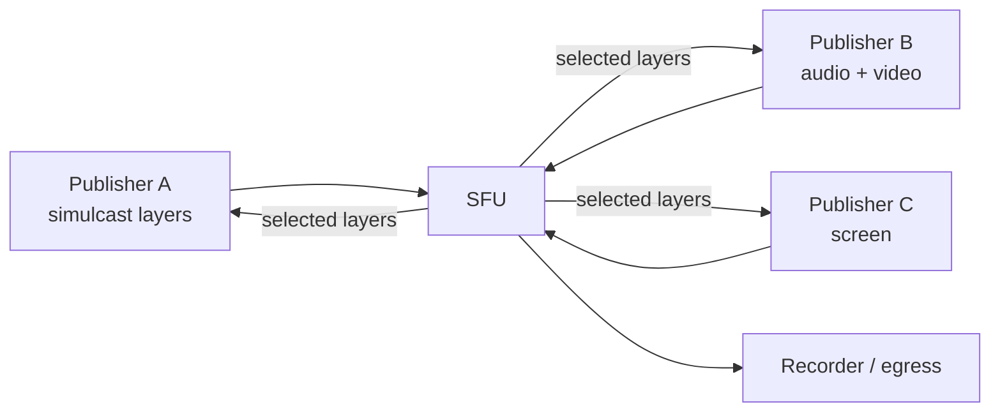
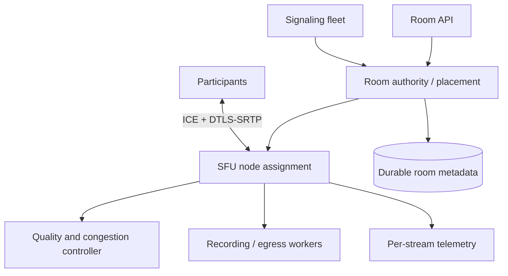

# WebRTC Media Systems

## TL;DR

WebRTC is a secure, congestion-controlled media stack, not a browser-to-browser socket. Signaling exchanges session descriptions and authorization; ICE searches for a viable path; STUN discovers translated addresses; TURN relays traffic when direct connectivity fails; DTLS-SRTP protects media; and SCTP data channels carry application data. Two-party calls can be peer to peer, while multiparty products normally use a Selective Forwarding Unit (SFU). Design is dominated by NAT diversity, relay coverage, SFU egress and packet rate, codec and layer selection, network-change recovery, and measurable quality of experience. TURN is required reliability capacity, not an optional fallback.

---

## The Stack and Its Trust Boundaries

WebRTC deliberately does not standardize signaling. An application may use ordinary HTTP, SSE, WebSocket, or another channel to exchange offers, answers, ICE candidates, room membership, and control messages. That channel creates intent; the browser's WebRTC stack negotiates and transports media.



Separate these responsibilities:

| Plane | Owns | Must survive |
|---|---|---|
| Identity and room control | join authorization, roles, room epoch, participant and track metadata | signaling reconnects and duplicate commands |
| Signaling | SDP offer/answer and trickled ICE candidates | reordering, retry, glare, temporary disconnect |
| Connectivity | candidate gathering, ICE checks, consent, ICE restart | NAT rebinding and network handoff |
| Media | RTP/RTCP, codecs, congestion control, retransmission, jitter buffering | packet loss, bandwidth change, SFU failover policy |
| Relay | TURN allocations, permissions, channel bindings | restrictive NAT/firewall paths and regional loss |
| Data | SCTP data channels | explicit ordering/reliability and application backpressure |

A signaling outage does not necessarily stop already-established media; an ICE or SFU failure can stop media while signaling remains green. Monitor and fail them independently.

---

## Session Establishment Is a State Machine

A robust session is identified by `room_id`, `participant_id`, `session_epoch`, and stable logical `track_id`. Socket identity, ICE username fragment, SSRC, and transceiver identifiers are connection details that can change during renegotiation or recovery.

```mermaid
sequenceDiagram
    participant C as Client
    participant R as Room authority
    participant S as Signaling
    participant I as ICE/STUN/TURN
    participant M as Peer or SFU
    C->>R: authorize join(room, role, device)
    R-->>C: short-lived join token + room epoch + region
    C->>S: join(token, session epoch, capabilities)
    C->>C: create offer / set local description
    C-->>S: offer + trickled candidates
    S-->>M: authorized offer + candidates
    M-->>S: answer + candidates
    S-->>C: answer + candidates
    C->>I: candidate gathering and connectivity checks
    C->>M: nominate candidate pair; complete DTLS
    M-->>C: bidirectional SRTP / SCTP established
    C-->>S: track published / subscribed
```

Important details hide behind this simple flow:

- **Offer/answer is transactional state.** Apply descriptions in legal signaling states and correlate them to a session epoch. A late answer from a previous attempt must not mutate a replacement connection.
- **Glare is normal.** Both endpoints can negotiate at once when tracks or devices change. Use the "perfect negotiation" pattern: one side is polite and rolls back on collision; the other ignores the colliding offer. Do not rely on timing to avoid simultaneous offers.
- **Trickle ICE lowers setup latency.** Send candidates as they are discovered rather than waiting for gathering to complete. Candidates can arrive before the remote description, so queue them by negotiation generation.
- **End-of-candidates matters.** It distinguishes slow gathering from completion and helps diagnostics.
- **Renegotiation needs serialization.** Track adds/removes, screen sharing, codec changes, and ICE restarts can all request negotiation. Collapse or queue them; uncontrolled negotiation creates state races.
- **Idempotency still applies.** `join`, `publish_track`, `subscribe`, and `leave` commands need stable request IDs. Signaling delivery and client reconnect are at-least-once.

SDP is a negotiated description, not a database schema to edit with ad hoc string replacement. Keep product intent, such as "subscribe to Alice's camera at medium quality," in the control protocol, and let a tested WebRTC implementation construct and apply SDP.

---

## ICE, STUN, and TURN

### Candidate discovery and selection

ICE gathers possible addresses and tests candidate pairs in priority order:

- **Host candidate:** a local interface address; useful on the same network and often represented with mDNS in browsers for privacy.
- **Server-reflexive candidate:** the public address mapping observed by a STUN server.
- **Peer-reflexive candidate:** discovered during connectivity checks.
- **Relayed candidate:** an address allocated on a TURN server; traffic passes through the relay.

STUN does not relay media and does not "open every NAT." It helps an endpoint learn a mapping and participates in connectivity checks. ICE decides whether a candidate pair actually works. TURN creates a relay allocation with permissions and channel bindings when direct paths are unavailable.

Deploy TURN from the first production release. Enterprise firewalls, carrier NAT, symmetric mappings, UDP blocking, and topology changes make relay usage workload- and geography-dependent. Offer UDP first, then TURN over TCP and TLS on reachable ports such as 443 where policy permits. TURN/TLS on 443 is still not HTTPS and some authenticated HTTP proxies will reject it, so test the actual enterprise path. TCP/TLS improves reachability but can cause head-of-line blocking under loss; it is a compatibility path, not a quality upgrade.

### Credential and relay security

Issue short-lived TURN credentials after authenticating the room participant. Scope their lifetime to the expected setup/session window, rotate the shared signing secret, and reject allocations that exceed per-user, tenant, IP, region, or bandwidth quotas. TURN is an internet-reachable bandwidth relay; static credentials will be stolen and sold as an open proxy.

Enforce TURN permissions, restrict disallowed peer address ranges to prevent access to internal networks, limit allocation count and lifetime, and meter bytes in both directions. Do not trust a client-supplied TURN region; issue endpoints selected by the service and include multiple failure domains.

### Liveness and network change

ICE consent freshness verifies that a peer still consents to receive traffic. Application UI presence is not a substitute. When Wi-Fi changes to cellular, a NAT mapping changes, or the nominated pair fails, attempt an ICE restart with a new generation and credentials while preserving the logical session and tracks. A "disconnected" ICE state can recover; "failed" requires intervention. Use bounded timers informed by measured platform behavior rather than immediately destroying a call on the first transient state.

Log candidate-pair type, local and remote protocol, relay region, nomination time, ICE failure reason, and restart outcome. A single global "call failed" counter cannot distinguish missing UDP reachability, broken TURN TLS, signaling races, or codec negotiation.

---

## Topology: Mesh, SFU, or MCU

### Mesh

In a full mesh of `N` participants, every sender uploads to `N-1` peers and the room has `N(N-1)/2` peer connections. With per-stream bitrate `b`:

```text
per_client_upload ≈ (N - 1) * b
room_network_payload ≈ N * (N - 1) * b
```

Mesh minimizes server media cost and can provide strong end-to-end privacy, but client uplink, encoding, battery, and connection state grow quadratically. It is normally appropriate only for very small calls after testing the weakest supported device and uplink.

### Selective Forwarding Unit

Each participant sends one or more encoded layers to an SFU. The SFU forwards selected packets to subscribers without composing a new video frame. Client upload is roughly independent of room size; server egress grows with subscriptions.



An SFU is the common choice for interactive multiparty calls. It preserves individual tracks, lets each receiver choose different layers, and avoids server-side decode/compose/encode for every room. It still terminates a secure transport with each participant and is a trusted media service unless an additional application end-to-end encryption layer is used.

### Multipoint Control Unit

An MCU decodes participants, mixes or composites them, and encodes one or a few outputs. It reduces receiver work and produces a canonical layout useful for legacy endpoints or broadcast, but adds substantial CPU/GPU cost, latency, codec coupling, and a cleartext media boundary. Many systems use an SFU for the call and a separate compositor only for recordings or broadcast renditions.

### A practical decision

Use mesh for measured two- or very-small-party sessions, SFU for multiparty interactive media, and MCU/composition where server-created output is the product requirement. Do not switch topology only at a participant-count threshold without considering number of published tracks, screen share, simulcast layers, device class, and subscription layout.

---

## Designing an SFU System

Split control and packet paths:



The room authority assigns one current room epoch and SFU placement. SFU nodes keep hot packet-routing state; durable product state such as room policy, recording intent, and audit records lives outside the media process. A stale signaling node must not publish tracks into a newer room epoch.

### Track identity and subscriptions

Give each logical source a stable track ID independent of SSRC or transport. A camera may restart with a new SSRC; a screen share may replace a sender; an SFU migration may create a new peer connection. Downstream UI, recording metadata, and authorization should follow the logical track.

Model subscription intent separately from the selected encoding:

```text
subscription = (subscriber, logical_track, max_quality, priority, visibility)
selection = (encoding/layer, target_bitrate, paused_reason, decision_version)
```

The SFU continually maps intent to a viable layer based on viewport, active speaker, available downlink, loss, CPU, and room policy. The client should not assume a fixed SSRC or resolution.

### Simulcast and scalable coding

With simulcast, a sender encodes several independent spatial streams; the SFU selects one per subscriber. This spends extra sender CPU and uplink so receivers can adapt quickly. With scalable video coding (SVC), enhancement layers depend on a base layer; it can be more bandwidth-efficient but support and switching behavior vary by codec and implementation.

Budget the sum of all published layers, not only the highest advertised resolution. Avoid forwarding a high layer until the receiver has the needed keyframe and bandwidth. Excessive Picture Loss Indication (PLI) requests can cause a keyframe storm; aggregate or rate-limit requests per source and make layer switches deliberate.

### Room placement and global calls

Anchor an interactive room to a media region chosen from participant latency, TURN reachability, available capacity, and data-residency policy. Putting every participant in their nearest SFU and hauling each track among all SFUs can multiply inter-region traffic and complicate congestion control. For geographically distributed large rooms, use a measured cascade: regional edge SFUs exchange only tracks and layers demanded remotely.

Keep existing rooms on healthy nodes during routine deploys and stop assigning new rooms before draining. Moving a live room generally requires new peer connections or ICE restarts and causes visible disruption; perform it only for failure, severe imbalance, or an explicit migration protocol. Preserve room and track identity across the move, increment the room/session epoch, and reject late signaling from the old node.

---

## Capacity and Cost Math

### TURN

For each unidirectional relayed stream, the relay receives the payload once and sends it once:

```text
TURN_NIC_throughput ≈ 2 * relayed_payload_bitrate + protocol_overhead
TURN_egress_cost depends on provider accounting and traffic direction
```

Sum audio, video, data, RTCP, retransmissions, and overhead in both directions. A 2 Mb/s bidirectional session relayed for both peers is not a 2 Mb/s relay workload. Track allocations, permissions, file descriptors, UDP packets/s, TLS/TCP connections, and bandwidth independently. Provision across failure domains so losing one relay site does not force more traffic onto the remaining site than its measured safe goodput.

### SFU

For room `r` with publishers `p` and subscriptions `s`:

```text
SFU_ingress_r = sum(published_encoding_bitrates_p)
SFU_egress_r  = sum(selected_bitrate_s)
SFU_packet_work ≈ ingress_packets + forwarded_packets + RTCP/retransmission work
```

Egress normally dominates. Suppose 100 rooms contain 12 participants each. Every participant sends 1.5 Mb/s of media, and every receiver is sent an average 4 Mb/s selected layout. The fleet sees about 1.8 Gb/s ingress and 4.8 Gb/s egress before RTP/UDP/IP overhead, retransmissions, recording, and inter-region cascades. Those arithmetic values are inputs, not instance counts: benchmark safe throughput for the exact SFU, codec mix, packet sizes, encryption, observability, kernel/network configuration, and loss profile.

Packets per second can exhaust CPU before link bandwidth when audio and low-bitrate layers produce many small packets. Conversely, a few high-resolution screens can exhaust NIC egress. Track both. Recording doubles selected egress or adds decode/encode work depending on architecture. Simulcast increases ingress. TURN and SFU paths can stack when a participant relays to the SFU, adding TURN load without reducing SFU load.

Capacity plans should include peak concurrent participants, tracks per participant, layer mix, fan-out per track, TURN ratio by region/network, reconnect and keyframe bursts, one-node or one-zone loss, deploy surge, and growth margin. Admission control should reject or degrade before a room lands on a node that cannot preserve audio and control traffic.

---

## Congestion Control and Quality Adaptation

Real-time media should reduce quality rather than build seconds of queue. Protect audio first, then screen readability or active-speaker video according to product policy. Adapt by pausing low-priority video, selecting a lower simulcast/SVC layer, reducing sender target bitrate or frame rate, and limiting the number of visible subscriptions.

RTCP feedback and transport statistics expose loss, round-trip time, jitter, bitrate, retransmissions, frames dropped, freeze duration, keyframes, candidate pair, and available bitrate. Interpret counters as deltas over an interval; a cumulative byte count is not a rate. Correlate browser `getStats()` with SFU and TURN telemetry using room, participant, session epoch, and track identifiers, while respecting the privacy sensitivity of IP and device information.

Useful experience indicators include:

- join-to-first-audio and join-to-first-video;
- call setup and ICE success by candidate type, network, platform, and region;
- relay ratio and TURN failure rate;
- audio concealment, jitter, round-trip time, and packet loss;
- video freeze time, frames decoded/dropped, resolution switches, and time at requested quality;
- SFU queueing, packet drops, PLI/NACK rate, retransmission bytes, and egress saturation;
- unexpected reconnect, ICE restart, and participant drop rate.

An average call-quality score hides exactly the networks and devices that need engineering attention. Use distributions and cohort breakdowns, and retain enough raw interval data to explain a failed session.

---

## Data Channels

`RTCDataChannel` runs SCTP over the WebRTC secure transport. The application selects ordered or unordered delivery and may bound retransmissions or packet lifetime. These options express different semantics:

- ordered and reliable: chat/control where sequence matters, but loss can head-of-line-block that channel;
- unordered and partially reliable: cursor motion, game state, or telemetry where newer state supersedes old;
- separate channels: isolate control from bulk transfer so a large reliable message does not delay latency-sensitive state.

Fragment and cap application messages, monitor `bufferedAmount`, and stop producing above a high-water mark. A data-channel `send()` is not durable delivery; reconnect loses in-flight state. Important commands need stable IDs, acknowledgments, replay or an ordinary durable API. For large files, object storage with resumable transfer is usually better than retaining the entire payload in peer and SCTP buffers.

---

## Security, Privacy, and Recording

Browser media capture is restricted to secure contexts, and production signaling must use authenticated TLS. WebRTC encrypts transport media with DTLS-SRTP. Carry the negotiated fingerprint through that authenticated signaling path; if signaling can be altered, an attacker can redirect the session or change authorization even though packets are encrypted on each hop.

An SFU has a secure transport relationship with every participant and can normally access media payload. If the product promises media that the SFU cannot decrypt, add an application end-to-end layer such as SFrame and design key distribution, participant changes, moderation, recording, transcription, and lawful-access policy around that fact. Transport encryption alone is not end-to-end encryption through an SFU.

Other controls are equally important:

- obtain explicit camera, microphone, and screen-capture consent; show active capture clearly;
- issue room-scoped, short-lived join tokens and enforce publisher/subscriber roles at signaling and SFU layers;
- use short-lived TURN credentials, relay quotas, destination restrictions, and abuse monitoring;
- limit offers, candidates, tracks, codecs, data-channel sizes, and renegotiation frequency;
- treat ICE candidate and stats data as sensitive network/device information and minimize retention;
- protect recording intent with durable authorization and audit events; never infer consent from mere room membership;
- encrypt recordings at rest, segment uploads idempotently, define retention/deletion, and make missing segments visible rather than silently producing a corrupt artifact.

Client-side recording captures only what that client receives and is vulnerable to tab suspension or device loss. Server-side per-track recording preserves sources but adds SFU egress and storage. Composition produces a convenient single layout but introduces decode/encode capacity and locks editorial decisions into the artifact. Choose intentionally.

---

## Failure Modes and Recovery

| Failure | What it means | Recovery |
|---|---|---|
| Signaling disconnect, media healthy | Control path failed; current candidate pair still works | Reconnect signaling with room/session epoch; do not tear media down immediately |
| No viable direct pair | NAT/firewall path unavailable | Allocate and nominate TURN relay; surface relay-region and transport diagnostics |
| ICE `disconnected` after network change | Candidate pair may be transiently unreachable | Allow bounded recovery; trigger ICE restart when policy threshold is crossed |
| ICE `failed` | Checklist has no usable path | ICE restart/new credentials; verify TURN coverage before abandoning call |
| TURN allocation expires | Refresh failed or relay disappeared | New allocation and ICE restart; redundant regional relays |
| SFU process dies | Media transport state is lost | Rejoin a replacement SFU with higher room/session epoch; recreate publications/subscriptions |
| SFU egress saturates | Loss, queueing, freezes across many rooms | Admission control, shed video layers, preserve audio, move only new rooms during drain |
| PLI/NACK storm | Loss or layer switching amplifies retransmission/keyframes | Aggregate/rate-limit feedback, fix path loss, reduce layers/bitrate |
| Late signaling from old attempt | Stale answer/candidate mutates new connection | Correlate every message with negotiation generation and session epoch |
| Token expires mid-call | Control authorization becomes stale | Rotate through authenticated signaling; enforce revocation at room authority and SFU |
| Recorder falls behind | Recording queue or encoder cannot keep up | Bounded segment pipeline, explicit gaps, degrade/composition policy, alerts |
| Region fails | Signaling, TURN, and/or SFU may fail independently | Region-aware reconnect, new placement, track identity preservation, measured recovery objective |

Recovery is not seamless by default. A replacement SFU cannot reconstruct cryptographic, congestion-control, jitter-buffer, and packet-routing state from a database row. The client must establish a new transport. Design the UI and SLO around join recovery time, and preserve logical room/track state so the disruption is bounded and understandable.

---

## Testing Strategy

Test a matrix, not one office Wi-Fi call:

1. NAT types and paths: public, home NAT, carrier NAT, symmetric mappings, UDP blocked, TCP-only, TURN/TLS, IPv4, IPv6, and mixed families.
2. Impairment: latency, jitter, burst loss, reordering, duplication, bandwidth collapse, bufferbloat, and asymmetric uplink/downlink.
3. Mobility: Wi-Fi-to-cellular handoff, NAT rebinding, device sleep/wake, browser backgrounding, and laptop network changes.
4. Signaling races: simultaneous offers, candidates before descriptions, duplicate joins, stale answers, reconnect during renegotiation, and token rotation.
5. Media scale: maximum tracks/layers, active-speaker churn, screen share, PLI storms, recording, data channels, and one SFU/zone loss.
6. Security: unauthorized join/publish/subscribe, replayed join tokens, TURN credential theft, internal-address relay attempts, oversized SDP/candidates/messages, and revocation during a call.
7. Compatibility: every supported browser/OS/device/codec combination, including hardware encoder scarcity and permission UX.

Automate synthetic calls through the public signaling, TURN, and SFU endpoints in every region. Assert media flow and quality counters, not merely that `RTCPeerConnection.connectionState` became `connected`.

---

## Decision Framework

Ask:

1. Is the workload interactive audio/video or peer-oriented, partially reliable data? If not, a [client delivery transport](./01-polling.md) is simpler.
2. Can two-party sessions meet reliability and device budgets with direct peer paths plus production TURN? If yes, P2P may be appropriate.
3. Does room size, recording, moderation, adaptation, or topology control require an SFU? For most multiparty products, yes.
4. Does the output require server composition or legacy interop? Add a separate MCU/compositor path instead of making every interactive packet pay that cost.
5. Can the product afford TURN and SFU capacity in each supported region under a failure scenario? If not, it does not yet have a reliable WebRTC service.
6. Is the encryption promise hop-by-hop through trusted media servers or application end to end? Decide before adding recording, transcription, and moderation.

The final design should name the room authority, ordering/session epochs, signaling recovery, TURN coverage, topology, quality adaptation, measured safe capacity, media-region failure behavior, encryption boundary, and recording policy.

---

## Key Takeaways

1. WebRTC is a stack of signaling, ICE/STUN/TURN, secure media, congestion control, and optional data channels; each has a distinct failure boundary.
2. TURN is mandatory reachability capacity. Measure relay ratio by network and region and size ingress, egress, allocations, packets, and failover headroom.
3. ICE candidates are possibilities, not connectivity; checks nominate a working pair, consent maintains permission, and network changes often require ICE restart.
4. Mesh grows quadratically and is limited to small measured rooms; an SFU is the normal multiparty topology, while MCU composition is a specialized output path.
5. SFU egress and forwarded packets usually dominate. Simulcast, recording, retransmission, and regional cascades materially change the capacity model.
6. Stable room, session-epoch, participant, and track identities must survive socket, SSRC, candidate, and SFU replacement.
7. Preserve audio and control traffic under congestion; adapt subscriptions and layers rather than allowing a latency queue to grow.
8. Transport encryption through an SFU is not application end-to-end encryption. If the SFU must not decrypt, add an explicit media E2EE and key-management design.
9. `getStats()` plus SFU/TURN telemetry should explain each failed cohort; connection state alone is not a quality metric.
10. Test NATs, mobility, loss, race conditions, browser/device combinations, abuse, and media-node failure through the real public path.

---

## References

- [W3C WebRTC 1.0](https://www.w3.org/TR/webrtc/): browser peer-connection, media, data-channel, and statistics APIs
- [W3C WebRTC Statistics](https://www.w3.org/TR/webrtc-stats/): interoperable quality and transport metric definitions
- [RFC 8825: Overview of WebRTC](https://datatracker.ietf.org/doc/html/rfc8825): architecture and protocol suite
- [RFC 8829: JavaScript Session Establishment Protocol](https://datatracker.ietf.org/doc/html/rfc8829): offer/answer and signaling state
- [RFC 8445: Interactive Connectivity Establishment](https://datatracker.ietf.org/doc/html/rfc8445): candidate gathering, checks, nomination, and restart
- [RFC 8838: Trickle ICE](https://datatracker.ietf.org/doc/html/rfc8838): incremental candidate exchange
- [RFC 8489: Session Traversal Utilities for NAT](https://datatracker.ietf.org/doc/html/rfc8489): STUN
- [RFC 8656: Traversal Using Relays around NAT](https://datatracker.ietf.org/doc/html/rfc8656): TURN allocations, permissions, channels, and refresh
- [RFC 7675: STUN Usage for Consent Freshness](https://datatracker.ietf.org/doc/html/rfc7675): continuing peer consent
- [RFC 8826: Security Considerations for WebRTC](https://datatracker.ietf.org/doc/html/rfc8826) and [RFC 8827: WebRTC Security Architecture](https://datatracker.ietf.org/doc/html/rfc8827): threat model and security properties
- [RFC 8831: WebRTC Data Channels](https://datatracker.ietf.org/doc/html/rfc8831): SCTP data-channel transport and reliability modes
- [RFC 9605: Secure Frame (SFrame)](https://datatracker.ietf.org/doc/html/rfc9605): application end-to-end media encryption through forwarding servers
