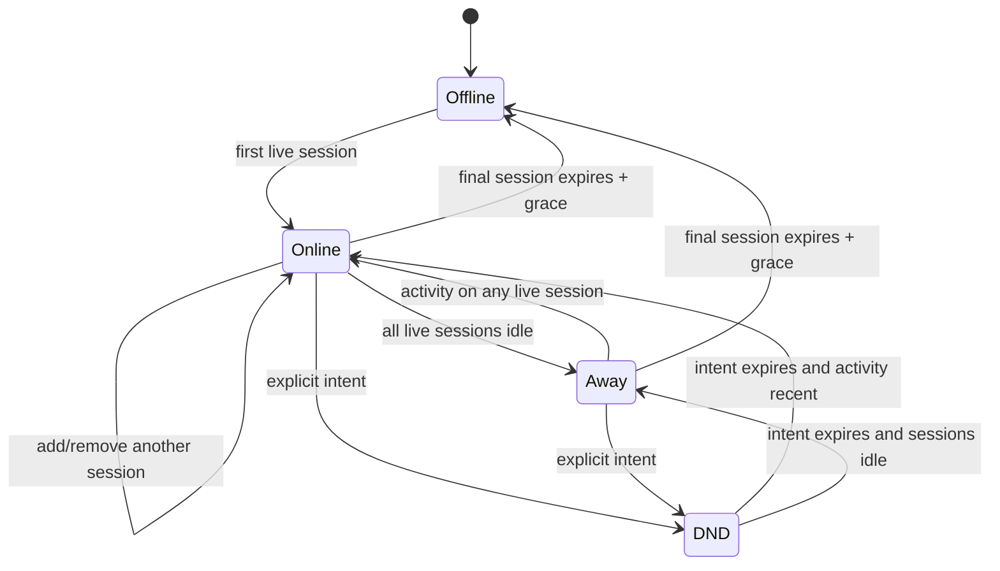
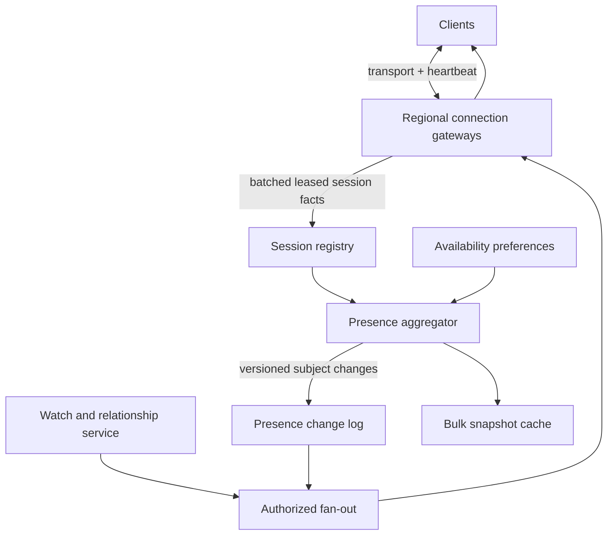

# Presence as Derived Multi-Session State

## TL;DR

Presence is not a boolean stored on a user row. It is a viewer-specific projection derived from leased device sessions, recent activity, explicit availability, room membership, privacy policy, and regional evidence. A user may have a phone, browser, and call session alive at once; one disconnect must remove only its own session. Heartbeats renew session evidence, expiration bounds stale-online time, and a versioned aggregator emits changes only when the derived view changes. Production systems need reconnect-safe session epochs, snapshot-plus-delta subscriptions, high-degree fan-out control, privacy enforcement before delivery, and explicit behavior when regions or clocks disagree. "Offline" means the service has no sufficiently recent live evidence, not that it proved the person is absent.

---

## Separate the Dimensions

Products often compress several independent facts into one colored dot:

| Dimension | Examples | Source of truth |
|---|---|---|
| Connectivity | connected, disconnected, unknown | leased transport/device sessions |
| Activity | active now, idle, backgrounded | recent client interaction or domain activity |
| Declared availability | available, away, do not disturb, invisible | durable user preference, often with expiry |
| Context membership | viewing document, in room, in call | leased context session |
| Capability | can receive push, can accept call, device type | live session metadata and policy |
| Viewer visibility | full, coarse, hidden, blocked | relationship, tenant, role, and privacy rules |

Do not let inferred activity overwrite an explicit do-not-disturb setting, and do not treat a hidden browser tab as a network disconnect. "In a call" is context activity, not proof that every device is busy. "Invisible" is a visibility decision: the underlying sessions may remain connected so messages and sync still work.

The raw facts and the rendered view should be different schemas. That separation makes policy changes, privacy audits, and multi-device behavior testable.

---

## The Session-Fact Model

Store one ephemeral record per connection or device session, not one mutable record per user:

```text
SessionFact {
  tenant_id
  user_id
  session_id              // random, unique per logical client session
  connection_epoch        // increases when this session is replaced
  gateway_id
  gateway_epoch           // fences a restarted/replaced gateway
  region
  device_class
  connected_at
  last_transport_heartbeat
  last_user_activity
  context_memberships[]   // or separate leased facts
  capabilities
  lease_expires_at
}

AvailabilityIntent {
  tenant_id
  user_id
  mode                    // available, away, dnd, invisible
  effective_until         // optional
  preference_version
}
```

At service time `t`, using the lease authority's clock:

```text
live_sessions(u, t) = sessions for u whose lease_expires_at > t
connected(u, t)     = live_sessions is not empty
last_active(u, t)   = max(last_user_activity across live sessions)

base_state(u, t) =
  offline,                         if no live session
  dnd,                             if unexpired explicit DND
  online,                          if activity is within active threshold
  away,                            otherwise

view(u, watcher, t) = visibility_policy(base_state, relationship, tenant, blocks)
```

This is illustrative policy, not a universal state machine. Some products keep explicit `away` above inferred activity; others display `mobile` when the only live session is a phone. The important property is that the precedence is written down and evaluated from facts.

### Why a user-level TTL is wrong

Suppose a user has browser session `B` and phone session `P`. Closing `B` must not mark the user offline while `P` is alive. If `B` reconnects as epoch 12 and a delayed disconnect from epoch 11 arrives later, that stale disconnect must not remove epoch 12. Key facts by `(tenant_id, user_id, session_id)` and apply connect/heartbeat/disconnect only when the expected connection and gateway epochs match.

Explicit disconnect is a latency optimization, not the sole correctness mechanism. Browsers crash, radios disappear, and gateways are killed without a close frame. Lease expiration eventually removes the session. Conversely, expiry does not prove the device stopped; it says current evidence is too old to advertise it as live.

---

## Heartbeats, Leases, and State Transitions

Choose these intervals separately:

- `heartbeat_interval`: how often a healthy client or gateway sends evidence;
- `lease_duration`: how long evidence remains valid without renewal;
- `activity_threshold`: when a connected session becomes idle/away;
- `offline_grace`: optional debounce before exposing offline;
- `last_seen_policy`: when and at what precision a viewer may see historical activity.

The lease should tolerate normal timer throttling, GC pauses, mobile radio transitions, and a small number of missed heartbeats. The false-online bound is roughly the lease duration plus detection and fan-out delay. Shortening it improves apparent freshness but raises write load and false-offline flapping. Measure platform distributions before selecting it.

Use the lease authority's clock for expiry. Client timestamps can describe activity but cannot grant liveness. Clamp implausible activity times and keep server receipt time for audit and ordering. A gateway can aggregate many client heartbeats into batched session renewals or renew one gateway lease covering a set of locally tracked sessions; if the gateway lease expires, the aggregator expires its sessions together. This removes a global datastore write from every ping.

Do not publish a presence event for every heartbeat. Recompute the derived summary and emit only when a viewer-relevant state, capability, or context changes. Assign a monotonic `presence_version` per subject (or another explicit ordering scope). Repeated computation of the same state should produce no new delta.



`Invisible` is deliberately absent from this global diagram because it is a projection rule. To the owner it may display connected; to another viewer it may display offline or unknown.

---

## Architecture and Data Flow



The **session registry** owns ephemeral liveness evidence and fenced updates. The **aggregator** derives per-user and per-context summaries. The **change log** provides ordered replay across gateway loss. The **watch service** decides who currently needs which subjects. The **fan-out tier** applies relationship and privacy policy before routing deltas to gateways. The **snapshot cache** serves initial friend lists, room rosters, and reconnect repair.

An ephemeral pub/sub fabric can reduce live-delivery latency, but it must not be the only source for a subscription that promises gap recovery. Gateways are disposable: after reconnect, a client supplies its last applied delivery cursor and subscriptions, then receives replay or a fresh snapshot.

### Presence event contract

Separate the subject's internal derived version from a recipient delivery cursor:

```json
{
  "delivery_cursor": "opaque-recipient-stream-position",
  "subject_user_id": "u-42",
  "presence_version": 912,
  "visibility_version": 37,
  "view": {
    "state": "away",
    "device_class": "mobile",
    "last_seen": null
  }
}
```

`presence_version` lets the client ignore an old subject update; `delivery_cursor` resumes the recipient's multiplexed feed. `visibility_version` helps invalidate data when policy changes even if connectivity did not. Never put an unauthorized rich internal summary in a common queue and hope each client hides fields in its UI.

---

## Snapshot and Delta Correctness

When a client subscribes to 500 contacts, it needs a bounded initial snapshot and subsequent changes. A snapshot followed by a live subscription has a race unless both meet at a position.

Use one of these protocols:

1. Return a visibility-filtered snapshot at recipient delivery position `p`, then replay deltas strictly after `p`.
2. Establish the delta subscription first, buffer it, fetch a snapshot at `p`, discard buffered deltas at or before `p`, and apply the rest.

The client stores the last *applied* delivery cursor. Presence delivery is at-least-once, so its reducer compares subject versions and safely ignores duplicates. A forward delivery gap triggers replay. If history expired or visibility rules changed in a way that cannot be replayed safely, the server returns `resync_required`; the client replaces its snapshot rather than guessing.

Room rosters need the same boundary. "Send everyone currently in the room, then joins/leaves" loses a join between the two operations unless the roster snapshot names the context-event position. Cursor motion and selections are high-rate ephemeral state: send the latest sample, sequence it per session, and tolerate loss. Durable document edits belong in the document's convergence/history system, not in presence; see [CRDTs and collaborative editing](./07-crdts-collaborative-editing.md).

---

## Multi-Session Aggregation Rules

Write and test a deterministic merge policy. A common policy is:

1. Discard expired or fenced session facts.
2. Derive connectivity as OR across remaining sessions.
3. Derive recent activity as the maximum accepted activity time.
4. Combine capabilities as a set, but expose only those relevant to the viewer/action.
5. Apply explicit availability according to its version and expiry.
6. Apply tenant, relationship, block, invisible, and last-seen policies for the requesting viewer.
7. Emit a new version only when the projected state changes.

Do not use last-write-wins across device summaries. A phone heartbeat with state `away` arriving after a laptop `active` event should not make the user away; both facts are current and aggregation must consider both. Likewise, a device cannot clear a DND preference written by another device unless it performs a version-checked preference mutation.

For context presence, key membership by `(context_id, user_id, session_id)`. Decide whether the UI counts people, devices, or sessions. Usually it lists distinct users while retaining session facts internally. A user opening the same document in two tabs should appear once, and closing one tab should not emit `left` while the other remains.

---

## Fan-Out and High-Degree Subjects

Presence is a dynamic bipartite graph: subjects change state and active watchers subscribe to subsets of them. Broadcasting every change to every gateway is simple and catastrophically wasteful.

Build subscriptions from current UI need rather than the entire social graph where possible:

- visible conversation list and open rooms receive live deltas;
- off-screen contacts refresh from a snapshot on demand;
- group rosters subscribe by context rather than one relationship edge per pair;
- mobile background sessions may receive only coarse push invalidations.

Maintain a regional subscription index from subject to gateways, not subject to individual sockets in the global tier. Send one authorized/cohort-safe update per interested gateway and fan out locally. For high-degree subjects, shard subscriber sets and cap work per change. Cache derived public/cohort views only when many watchers truly share the same authorization result.

Presence is usually latest-value state. If a slow client has unread versions 910, 911, and 912 for one subject, keep only 912. Preserve the recipient delivery cursor by sending a compacted state update or requiring a snapshot; do not let per-connection memory grow with every heartbeat transition. Give room-critical changes a separate budget from decorative friend-list dots.

Avoid durable per-recipient fan-out for enormous audiences unless the product promises offline presence history—which most do not. Persist subject changes for a short replay window, derive current snapshots, and route only to active watchers.

---

## Capacity Math

Let:

```text
U = concurrently connected users
S = mean live sessions per connected user
H = client heartbeat interval in seconds
C = derived subject changes per second
W = mean active authorized watchers per changed subject
```

Raw client heartbeat rate is:

```text
heartbeats_per_second = U * S / H
```

Ten million connected users with 1.4 sessions each and a 30-second heartbeat create about 466,700 heartbeats/s. This is why gateways validate locally and batch or aggregate renewal; it is also why heartbeats must not each become a global event.

State memory is approximately:

```text
session_state = U * S * measured_bytes_per_session
```

Measure object, index, allocator, replication, and expiry-wheel overhead. A 300-byte logical record can consume several times that in a general-purpose key-value store.

Fan-out rate is:

```text
deliveries_per_second = C * W
```

Fifty thousand derived changes/s with 80 active watchers each creates 4 million deliveries/s. The important variables are *derived changes*, not heartbeats, and *active watchers*, not total followers. Group presence can be worse: a 10,000-member room that broadcasts every join/leave individually creates bursty quadratic client work during reconnect. Use paged snapshots, aggregated counts, capped detailed rosters, and coalesced deltas.

Also size:

- concurrent transport connections and per-connection queues;
- session lease writes and expiration throughput;
- snapshot QPS, subjects per snapshot, and authorization checks;
- reconnect storms after gateway/region failure;
- subscription-index memory and churn;
- cross-region session replication and fan-out egress;
- privacy-cache invalidation on large relationship or policy changes.

Steady heartbeat throughput does not predict recovery capacity. Losing a gateway with 200,000 sessions can cause simultaneous reconnect, authentication, snapshot, and subscription-index rebuild. Jitter client reconnects, restore compact session/subscription state when safe, and reserve headroom for one failure domain.

---

## Multi-Region Presence

Presence favors availability and bounded staleness, but it still needs explicit merge semantics. Three useful models are:

### Home-region aggregation

All session facts for a user are forwarded to a home region that assigns `presence_version`. It gives one clear order and simple privacy evaluation. A home-region outage delays changes or requires a fenced failover; remote gateways depend on cross-region connectivity.

### Regional facts, merged summary

Each region owns the sessions connected there and publishes a versioned regional summary. A global or receiving-region projection computes online as OR across non-expired regional facts. Do not collapse these with a scalar last-write-wins timestamp: an `offline` summary from one region must not erase a live session in another. Track regional epochs/versions and expire a failed region's evidence after a declared grace period.

### Region-local presence

For context-bound products, presence may be scoped to the room or document's authoritative region. This is simpler and often correct: a watcher sees who is in that context, not a globally merged social status.

Whichever model is chosen, document partition behavior. During replication loss, a remote watcher may see stale online, stale offline, or unknown. `unknown` is often more honest for operational/admin surfaces; consumer UIs may intentionally retain the last view briefly to avoid flapping. When a region recovers, its old gateway epochs must be fenced so delayed renewals cannot resurrect dead sessions.

Route reconnecting clients with a signed handoff/session token, but create a new connection epoch in the target region. Never reuse a stale regional lease as proof of a new connection. Cross-region clocks do not establish event order; use region-scoped versions plus the declared merge.

---

## Privacy and Abuse Controls

Presence reveals behavior patterns: work hours, sleep, relationships, travel, device use, and whether a target is likely to respond. RFC 2778 summarized the threat space as stalking, spoofing, and spam; a modern service must treat presence as sensitive personal data.

- Authorize the **watcher-subject pair**, not just both authenticated users.
- Enforce tenant boundaries, blocks, relationship direction, room membership, parental/safety controls, and invisible mode before snapshot, replay, cache, and live delivery.
- Make last-seen precision configurable or coarse; many viewers need `recently` rather than an exact timestamp.
- Rate-limit arbitrary user lookup and subscription churn so presence cannot become an enumeration oracle.
- Return indistinguishable results where necessary so a blocked user cannot infer the block from error shape.
- Version visibility policy and invalidate queued/cached projections immediately when access changes.
- Audit privileged or bulk presence access, minimize raw activity retention, and define deletion behavior.
- Never trust client-declared `online`, `last_seen`, role, or context membership without a server-side session/authorization check.

Privacy can make two watchers receive different states for the same subject at the same moment. Therefore the globally cached object is the internal summary, not necessarily the response. Cache by a safe authorization cohort or evaluate the projection per watcher.

---

## Failure Modes

| Failure | Incorrect naive behavior | Correct containment |
|---|---|---|
| One of several devices disconnects | User becomes offline | Remove only that session; aggregate remaining live sessions |
| Delayed disconnect follows reconnect | New session is deleted | Match session ID plus connection/gateway epoch |
| Client disappears without close | User stays online forever | Lease expiry and sweeper/expiry index |
| Heartbeat delayed by mobile/background throttling | Presence flaps offline/online | Measured lease margin, grace, and transition debounce |
| Gateway dies | Thousands of explicit disconnect writes or stale sessions | Gateway lease/epoch; batch expiry; jittered reconnect |
| Expiration notification is lost | Offline transition never emits | Treat TTL as state, not an event bus; periodic indexed reconciliation |
| Phone `away` arrives after laptop activity | Last-write-wins makes user away | Deterministic merge across session facts |
| Pub/sub drops a delta | Client state remains stale | Version gap detection, short durable replay, snapshot repair |
| Snapshot races subscription | Join/leave or status change disappears | Snapshot at delivery position plus replay |
| Popular subject changes state | Fan-out overloads every node | Active subscription index, gateway aggregation, sharding, coalescing |
| Region partitions | One regional offline overwrites global online | Regional facts with explicit OR/expiry merge or home authority |
| Privacy changes while update is queued | Revoked viewer receives data | Visibility version, queue purge, authorization at delivery/replay |
| Clock skew/client timestamp abuse | Activity appears in future or expires early | Server receipt/lease clock, bounds, versions rather than timestamps for order |
| Reconnect storm | Auth, snapshots, and subscription rebuild collapse | Full jitter, admission control, cached snapshots, failure headroom |

Key expiry mechanisms deserve special care. Some stores deliver expiration notifications on a best-effort pub/sub channel; that notification is not the durable source of truth. Maintain an expiry index/timing wheel or reconcile overdue sessions so derived offline transitions eventually occur even when a notification is missed.

---

## Testing the Model

Property and state-machine tests should assert invariants across arbitrary event order:

1. A user is internally connected iff at least one non-expired, non-fenced session exists.
2. Disconnecting or expiring one session never removes another session.
3. An event from an older connection or gateway epoch cannot mutate the current fact.
4. Replaying duplicate connect, heartbeat, activity, preference, and disconnect events converges to the same summary.
5. Subject versions never go backward; client reducers ignore old/duplicate versions and repair forward gaps.
6. Snapshot at position `p` plus deltas after `p` equals a fresh snapshot after the same event set.
7. Every viewer receives only the projection allowed by the latest privacy version.
8. Region-summary merge is associative, commutative where designed, and cannot let one offline region erase another live region.

Chaos and load tests should kill gateways, pause heartbeats, delay expiration processing, reorder reconnect/disconnect, partition a region, drop pub/sub events, revoke relationships, freeze slow clients, and reconnect a large fleet. Test multi-tab and multi-device behavior explicitly.

Operational signals include live sessions and distinct users, sessions per user, heartbeat and renewal delay, expiry backlog, derived changes per heartbeat, false-flap rate, snapshot and replay latency, cursor-expired rate, fan-out amplification, coalesced/dropped deltas, subscription-index rebuild time, privacy denials, region-summary age, and reconnect recovery time. Sample end-to-end probes should compare an authoritative session change with what authorized watchers actually receive.

---

## Decision Framework

Before implementation, answer:

1. What does the UI claim: connectivity, activity, declared availability, context membership, or a blend?
2. Is the unit a user, device, browser tab, or room membership? Store session facts even if the UI renders distinct users.
3. How stale may online and offline be, and what false-flap rate is acceptable on mobile/background clients?
4. Which updates need live delivery, which can be coalesced, and how does a client repair a gap?
5. Who may watch whom, at what precision, and how quickly must revocation take effect?
6. Is aggregation home-regional, merged from regional facts, or context-local? What does a partition display?
7. What are peak sessions, heartbeat writes, derived changes, active watcher fan-out, and gateway-loss reconnect load?

Use [Client Delivery Transports](./01-polling.md) for the final-hop replay and connection lifecycle. Presence supplies a versioned ephemeral projection to that transport; it should not embed transport connection objects into its durable model.

---

## Key Takeaways

1. Presence is a derived, viewer-specific projection; connectivity, activity, explicit availability, context, and visibility are separate dimensions.
2. Store leased session facts and aggregate them. A user-level TTL or last-write-wins status breaks multi-device correctness.
3. Session and gateway epochs fence delayed disconnects and renewals after reconnect or failover.
4. Heartbeats renew evidence; they should be validated and batched at gateways and should emit no global event unless derived state changes.
5. Offline is bounded absence of evidence, not proof of absence. Lease duration and grace explicitly trade stale-online time against false flapping.
6. Initial rosters and friend lists need a snapshot position plus ordered deltas; delivery is at-least-once and client reducers compare versions.
7. Fan-out scales with derived changes times active watchers. Route by active subscriptions, aggregate per gateway, and coalesce latest-value updates.
8. Multi-region systems must merge regional session facts or use one fenced home authority; scalar last-write-wins cannot represent simultaneous sessions.
9. Privacy is part of the data plane. Enforce it on snapshot, cache, replay, queue, and live delivery, with fast revocation.
10. Test event reordering, multi-session races, expiry loss, gateway/region failure, privacy changes, and reconnect storms as model invariants.

---

## References

- [RFC 2778: A Model for Presence and Instant Messaging](https://datatracker.ietf.org/doc/html/rfc2778) — presentities, watchers, subscriptions, visibility, and the foundational threat model
- [RFC 2779: Instant Messaging / Presence Protocol Requirements](https://datatracker.ietf.org/doc/html/rfc2779) — delivery, access, privacy, and scale requirements
- [RFC 6121: XMPP Instant Messaging and Presence](https://datatracker.ietf.org/doc/html/rfc6121) — operational multi-resource presence and publish-subscribe semantics
- [RFC 3856: A Presence Event Package for SIP](https://datatracker.ietf.org/doc/html/rfc3856) — subscriptions, notifications, expiry, and authorization semantics
- [RFC 6455: The WebSocket Protocol](https://datatracker.ietf.org/doc/html/rfc6455) — one common transport for live presence delivery
- [Redis keyspace notifications](https://redis.io/docs/latest/develop/pubsub/keyspace-notifications/) — fire-and-forget delivery and delayed expiration-event behavior when Redis is used as ephemeral session infrastructure
