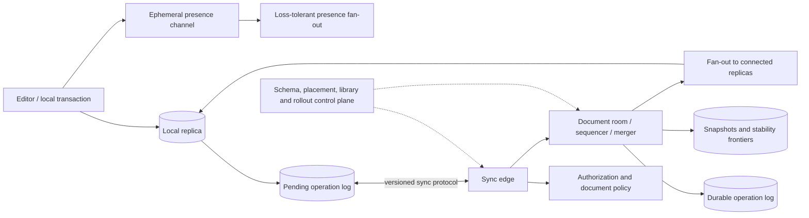
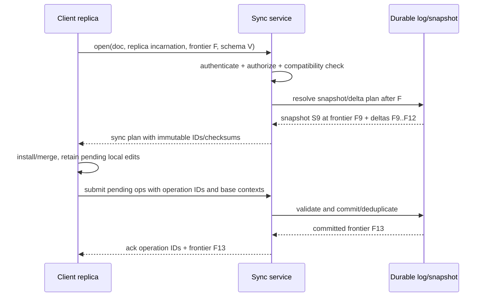

# Collaborative Document Replication and CRDT Sync Engines

## TL;DR

A collaborative editor is a replicated database whose write latency must feel local. Each client applies edits optimistically, persists unsent intent, and exchanges operations or state deltas later. The system must converge after reordering, duplication, disconnection, retry, and failover while preserving a useful notion of user intent.

Operational Transformation (OT), sequence CRDTs, server-ordered property updates, and application-specific hybrids solve different contracts. The algorithm is only one component. A production sync engine also needs stable document/element/operation identity, authorization on reconnect, durable snapshots and logs, causal or server frontiers, acknowledgement and duplicate suppression, schema migration, undo semantics, compaction, hot-document fan-out, offline-device policy, and proof that garbage collection cannot resurrect deleted content.

[Conflict Resolution](../02-distributed-databases/04-conflict-resolution.md) covers general causal metadata and CRDT merge algebra. This chapter focuses on collaborative document state and end-to-end sync, including optimistic local editing, sequence/tree operations, snapshot-plus-delta publication, long-offline replicas, compaction, presence separation, and user-visible recovery.

---

## 1. Workload and Correctness Contract

Define document shape and user behavior first:

- plain text, rich text, block tree, canvas/object graph, spreadsheet, or structured JSON;
- edits per active user per second and burst behavior during paste/drag;
- concurrent users per document and hot-document tail;
- online, intermittently connected, or local-first/offline duration;
- median and maximum document/history size;
- required undo, comments, selections, and version-history behavior;
- authorization and revocation latency;
- acceptable local-to-remote convergence and restore time.

The local input path cannot wait for a round trip:

```text
user intent
  -> validate against local schema
  -> assign durable operation identity
  -> apply optimistically to local replica
  -> persist in local pending log
  -> render
  -> synchronize asynchronously
```

### 1.1 Core invariants

1. **Local responsiveness:** an accepted local edit renders without waiting for the network.
2. **Convergence:** replicas that incorporate the same valid edit set compute equivalent document state.
3. **No duplicate intent:** retry or reconnect does not apply one logical edit twice.
4. **No resurrection:** an old replica cannot restore content whose deletion knowledge was safely committed and compacted.
5. **Stable interpretation:** operation and schema versions determine semantics; readers never guess.
6. **Authorization at acceptance:** local optimism does not grant server commit authority; revoked or unauthorized edits remain rejected/auditable.
7. **Snapshot continuity:** a client sees one snapshot plus an exact, gap-free continuation of deltas.
8. **Monotonic acknowledgement:** a server/client frontier never claims to cover an operation it cannot restore.
9. **Intent-scoped undo:** undo reverses the user's applicable operation, not an arbitrary global last writer.
10. **Bounded retained state:** logs, tombstones, identifiers, pending edits, and presence state have explicit lifecycle rules.

Convergence alone is insufficient. Two replicas can converge on a tree with an orphaned child, invalid table shape, or two owners for a unique resource. Document operations and schemas must preserve structural invariants; global business invariants such as inventory still require coordination.

---

## 2. State, Identity, and Planes

### 2.1 Durable document state

```text
DocumentReplica {
  document_id
  document_schema_version
  replica_id and incarnation
  committed_snapshot_id
  committed_frontier
  materialized document state
  pending local operations
  acknowledged operation IDs
  compaction/stability metadata
}

EditOperation {
  operation_id = (replica_id, incarnation, counter)
  document_id
  base context/frontier
  schema and operation version
  semantic edit + stable target identifiers
  author principal and client timestamp (diagnostic)
}
```

Client wall time is not edit identity or conflict order. Restoring a device backup must not reuse `(replica, counter)` for a new operation. Persist the counter safely or allocate a new incarnation.

### 2.2 Architecture



The **document data plane** accepts, persists, merges/orders, acknowledges, and broadcasts durable edits. The **presence plane** carries cursors, selections, typing, and liveness; loss or coalescing is acceptable. The **control plane** owns document placement, schema/library compatibility, limits, and rollout state. Keeping presence outside durable history prevents high-rate cursor motion from inflating the document log.

The server may be optional to the merge algebra but is usually essential to product operation: durable backup, membership, authorization, abuse prevention, schema gates, search/index publication, and bounded offline policy.

---

## 3. Choose the Concurrency Protocol

### 3.1 Central serialization with position operations

A server can assign one total order to index-based inserts/deletes. Clients transform an incoming operation against concurrent operations not represented in its base revision. Jupiter-style OT uses a client/server protocol so each participant follows a controlled transformation path.

OT correctness depends on transformation properties across every operation pair and context. Plain text is already subtle; rich attributes, ranges, tables, and tree moves multiply cases. A central sequencer simplifies the history and supports compact operations, but long offline branches need rebasing and the sequencer is a correctness dependency.

Use an established algorithm/library and qualify the exact operation set. “Shift the index if another insert came first” is not a complete OT design.

### 3.2 Server-ordered property or object updates

For a canvas where concurrent edits to the same property are rare, the server can assign a revision and apply deterministic last-writer or compare-and-set semantics per property/object. Clients remain optimistic but reconcile to server order.

This can be simpler and more debuggable than a fully decentralized CRDT. It sacrifices offline peer merge and may discard simultaneous same-property intent. Figma publicly described a server-authoritative approach in which property values use server ordering rather than a general text CRDT; that is evidence for matching conflict machinery to the product's conflict shape, not a universal Figma clone design.

### 3.3 Sequence CRDTs

Sequence CRDTs replace fragile array positions with stable logical identities and a deterministic rule for ordering concurrent insertions. Families differ:

- RGA-like designs reference a stable predecessor and order concurrent children deterministically;
- Logoot/LSEQ-like designs allocate orderable identifiers between neighbors;
- YATA/block-based designs group runs and refine ordering/interleaving behavior;
- rich JSON/document CRDTs compose sequences, maps, registers, counters, and trees.

An insertion conceptually carries:

```text
insert(element_id, stable_origin_or_position_id, payload, causal_context)
```

A deletion normally marks an element identity or records removal context. Removing the visible byte from one replica is insufficient because a disconnected replica may later send a reference or old insertion.

### 3.4 State, operation, and delta delivery

State-based CRDTs merge joinable state and tolerate duplicate/reordered transfer under their semilattice contract, but full state can grow. Operation-based CRDTs send compact operations and require the delivery/order/duplicate assumptions of that type. Delta-state CRDTs send smaller joinable fragments while retaining a state-join model.

The sync transport must implement the algorithm's assumption. Calling an operation “commutative” does not make it safe if it was generated against missing structural context or if an add/remove pair needs causal delivery.

### 3.5 Decision table

| Workload | Strong candidate | Why / warning |
|---|---|---|
| always-online plain/rich text with authoritative service | proven centralized OT or sequence CRDT | compare transform complexity, offline branch behavior, ecosystem |
| offline/local-first text or structured document | mature sequence/JSON CRDT | metadata, compaction and long-offline membership dominate |
| online canvas/object graph with rare same-property conflict | server-ordered property updates | simple; knowingly loses simultaneous same-property intent |
| workflow/business record with invariant transitions | server transaction/state machine | convergence structure alone cannot preserve business rules |
| short-lived presence/cursors | sequenced lossy latest-state channel | do not put into durable CRDT history |

---

## 4. Document and Tree Semantics

### 4.1 Concurrent insert ordering and interleaving

Two users may each insert a multi-character run at the same location. An element-by-element total order can converge while interleaving runs:

```text
Alice inserts "cat"
Bob inserts   "dog"

undesired converged result: cdaotg
```

Modern designs preserve run/block intentions more carefully, but the exact behavior depends on identifier allocation and traversal. Test human edit patterns such as paste, autocorrect, composition/IME, drag, and block split; do not rely only on single-character random operations.

### 4.2 Rich text marks

Bold, comments, links, and ranges refer to positions that concurrent edits move. Store marks against stable element/range identities with defined boundary affinity: does inserted text at the start/end inherit the mark? What happens when every marked character is deleted? These are product semantics embedded in the replicated type.

### 4.3 Trees and moves

Block editors and canvases form trees/graphs. Concurrent moves can create cycles or multiple parents if represented as independent parent assignments. A tree CRDT or server validator must define:

- parent assignment winner/merge;
- cycle prevention or deterministic repair;
- delete versus edit/move behavior;
- orphan handling;
- sibling ordering;
- subtree undo.

If the merge can produce an invalid tree, convergence has only made every replica equally invalid.

### 4.4 Undo and redo

Global “remove the last operation in the log” can undo another user's work. Local-intent undo records which logical effects the author contributed and generates a new inverse/visibility operation under current state.

An inverse may be partial: text was already deleted, a moved block has new children, or schema changes make the old property invalid. Define whether undo restores content at its original logical neighborhood, creates a new copy, or becomes unavailable. Undo operations replicate like any other edit and must themselves converge.

---

## 5. Sync Handshake and Gap-Free Catch-Up

A reconnecting replica presents identity, document/schema version, last committed snapshot/frontier, and pending operation IDs.



### 5.1 Snapshot plus tail protocol

Avoid the classic gap:

1. client reads snapshot;
2. an edit commits;
3. client subscribes after that edit;
4. edit appears in neither snapshot nor stream.

The snapshot names a log/frontier position, and the subscription begins strictly after it. The server retains or can reconstruct the tail until the client installs it. If retention has passed, require a newer snapshot.

### 5.2 Acknowledgements and ambiguity

If a client uploads an edit and loses the acknowledgement, it resends the same operation ID. The service returns the committed result/frontier rather than applying it again. Acknowledging before durable commit can lose an edit that the client then discards locally.

Keep local pending operations until a durable server acknowledgement covers their IDs. A client snapshot/compaction must not erase unacknowledged intent.

### 5.3 Backpressure and flow control

A large paste, import, or returning offline client can generate thousands of operations. Bound:

- operation and payload size;
- pending bytes per replica/document/tenant;
- in-flight unacknowledged operations;
- fan-out buffer and slow-subscriber age;
- catch-up CPU and bandwidth;
- snapshot generation concurrency.

Coalesce safe property/presence updates, but do not coalesce semantic operations whose intermediate identity matters to undo, references, or causality. Disconnect a slow client with a resumable frontier rather than retaining an unbounded socket buffer.

---

## 6. Snapshots, Causal Stability, and Garbage Collection

Replay from genesis makes open time and storage grow with document age. Periodically publish a snapshot that binds:

```text
document and schema version
materialized-state digest
covered operation/frontier
algorithm/library format version
compaction/stability evidence
created-by and verification result
```

### 6.1 Why tombstone collection is hard

A deleted element can be physically forgotten only when no valid future message can require its removal knowledge or use it as an unresolved reference. In a centralized server log, retention and mandatory snapshot rebase can establish this operationally. In decentralized causal systems, **causal stability** requires evidence that every relevant replica has advanced beyond the operation.

Long-offline devices make “every replica” unbounded. Define membership:

- active replicas retain incremental-merge rights;
- a replica lease expires after policy duration;
- an expired replica must discard its old sync state and rebase from a current snapshot;
- its unsynced user edits require a separate import/reconciliation flow rather than silently joining an obsolete causal history.

Age alone is not proof. Restoring a device backup after tombstone GC can resurrect content or reference missing element IDs unless the incarnation is fenced and full rebase is mandatory.

### 6.2 Compaction concurrency

Snapshot generation races with new edits. Pin a frontier, materialize exactly through it, validate the digest, publish the immutable snapshot, then retire older log ranges only after readers and recovery policy no longer depend on them. A partially uploaded snapshot never becomes the current pointer.

Keep older snapshots/log tails for rollback and forensic history according to privacy/retention policy. Deleting visible text does not automatically remove it from snapshots, audit logs, other clients, exports, or backups.

---

## 7. Authorization, Privacy, and Abuse Boundaries

Offline optimism is not authorization. On reconnect, validate the current principal, tenant, document generation, relation/policy revision, operation type, referenced objects, and schema. Never trust the tenant or author embedded in a client operation.

### 7.1 Revocation and rejected local work

A user may edit while offline and lose access before synchronization. The server must reject the operations without revealing current document deltas. The client needs a product path: export a private patch, request access, copy into a new document, or discard. Silently committing because the edit was created while access once existed extends revocation indefinitely.

Authorization cache keys and room membership include tenant, canonical document generation, principal/session, permission revision, and expiry. A room relay is an enforcement point but the durable commit service also verifies authorization so a bypass or stale connection cannot write.

### 7.2 End-to-end encrypted collaboration

If servers cannot read content, clients must perform merge, schema validation, search, moderation, and key distribution. Membership change requires document-key rotation policy; removed users may retain old plaintext and keys, and offline updates encrypted under old membership need a defined fate. Metadata (document membership, size, edit timing, and device identity) may remain visible.

Do not claim end-to-end encryption if the server can silently add a recovery recipient or deliver unverified client code that exfiltrates keys. The cryptographic boundary is described in [Cryptographic Key and Data-Protection Architecture](../10-security/06-encryption.md).

### 7.3 Untrusted content

Validate sizes, nesting, references, Unicode/encoding, decompression, and schema before materialization. One malicious operation should not create quadratic traversal, huge identifier paths, or a room-wide crash. Apply per-tenant/document quotas and work budgets to merge and snapshot operations.

---

## 8. Placement, Fan-Out, and Capacity

Collaborative load is skewed by document rooms. Partition by stable document ID, but allow hot rooms to use a specialized fan-out topology. One owner/sequencer per document epoch simplifies ordered protocols; CRDT merge workers may be more distributed, yet presence and socket fan-out still need placement.

Consider an illustrative hot document:

```text
connected users                  = 5,000
durable edits/user/second        = 0.4 average
encoded durable operation       = 240 bytes
server protocol/record overhead = 160 bytes
```

Ingress operations are:

$$
5{,}000 \times 0.4 = 2{,}000\ ops/s
$$

Durable ingress/log bandwidth is roughly:

$$
2{,}000 \times (240 + 160) = 800{,}000\ bytes/s
$$

Naively broadcasting every operation separately to every other user produces nearly:

$$
2{,}000 \times 4{,}999 \times 240
\approx 2.4\ GB/s
$$

before transport overhead. Batch several operations per frame, use regional fan-out relays, compress where beneficial, coalesce presence, and measure egress at the hot-document tail. Batching adds remote-visibility latency, so bound its wait.

### 8.1 Snapshot and catch-up cost

For document state $D$, retained tail $L$, and pending client operations $P$:

```text
open_cost ≈ fetch(D) + decode(D) + apply(L) + transform_or_merge(P)
```

Track all terms by percentile. A tiny snapshot with a million-operation tail is not a fast open. A frequent full snapshot can saturate CPU/storage for active documents. Choose cadence from replay budget, update rate, snapshot cost, and recovery RTO; use incremental/block snapshots only with verifiable manifests.

### 8.2 Multi-region

Home-region placement per document reduces ordering and fan-out complexity. Route users to regional edges while one room owner commits durable edits. Failover obtains a new document epoch/fencing token; the old owner cannot commit late operations. CRDT multi-writer regions can improve partition availability but require convergent document semantics and duplicate/fan-out control, while authorization and membership changes may still need a freshness boundary.

Keep a durable regional log or replicated snapshot frontier that meets recovery objectives. Presence can be dropped and rebuilt after failover; committed document operations cannot.

---

## 9. Concrete Failure Traces

### 9.1 Lost acknowledgement duplicates an insertion

1. Client submits operation `R7:104`.
2. Server commits and broadcasts it.
3. Acknowledgement is lost.
4. Client reconnects and generates a new operation ID for the same pending edit.
5. Text appears twice.

Persist the logical operation ID with local intent and deduplicate at durable commit. Infrastructure attempts do not receive new edit identities.

### 9.2 Snapshot/stream gap loses an edit

1. Client fetches snapshot S at frontier 90.
2. Operation 91 commits.
3. Client subscribes starting from “now,” frontier 92.
4. Its document never receives 91 but appears healthy.

Bind snapshot to frontier and request the gap-free tail strictly after it; reject a subscription whose retention cannot supply the range.

### 9.3 Tombstone collection resurrects content

1. Device C goes offline with element X visible.
2. A/B delete X and later discard deletion state based only on 30-day age.
3. A device backup restores C after 60 days under the same replica identity.
4. C synchronizes the old insertion/reference and X returns.

Expire replica merge rights, fence incarnations, and require full rebase after the stability/retention boundary.

### 9.4 Revoked offline writer commits

1. A contractor opens a confidential document and disconnects.
2. Access is revoked.
3. The client creates local edits and reconnects through a still-open room token.
4. The relay accepts them without current authorization.

Reauthorize at durable commit and room renewal, bind credentials to document/tenant/audience, and expose rejected local work through a non-leaking recovery UX.

### 9.5 Rich-tree move creates a cycle

1. Alice moves block A under B.
2. Concurrently Bob moves B under A.
3. Independent parent registers merge.
4. Every replica converges on a cycle and recursive render crashes.

Use a tree-specific algorithm or server validator with deterministic cycle repair. Test concurrent structural pairs, not only scalar properties.

### 9.6 Failover accepts stale room owner

1. Region A owns document epoch 40 and pauses.
2. Region B recovers log frontier and takes epoch 41.
3. A resumes and writes to storage without a fence.
4. Some clients see operations absent from B's authoritative log.

Fence storage/log commits by document epoch and force clients to re-handshake against the current owner after an epoch change.

### 9.7 Compaction changes semantics across versions

1. New library version compacts identifier runs using a new format.
2. Old clients can parse the snapshot but order equal-position inserts differently.
3. Bytes remain valid while replicas diverge.

Treat algorithm/schema/runtime compatibility as a release matrix. Dual-read/compare snapshots and pin document format until all writers are qualified.

---

## 10. Observability and Verification

### 10.1 Signals

Measure:

- local edit-to-render and edit-to-durable-ack latency;
- remote visibility latency by document/region;
- pending/unacknowledged operations and bytes per replica;
- reconnect/catch-up duration and reset-to-snapshot rate;
- operation deduplication and rejection reasons;
- room fan-out egress, slow subscribers, and dropped presence;
- snapshot age/size/build time, tail length, and replay time;
- tombstone/identifier/causal metadata bytes;
- active/expired replica counts and oldest stability blocker;
- convergence/invariant mismatch from sampled replica digests;
- authorization revision and rejected offline edits;
- hot-document CPU, memory, log and network headroom.

A single document hash may differ because local pending operations are valid. Compare replicas at the same committed frontier and format revision.

### 10.2 Algorithm verification

Build a deterministic simulator that creates replicas and generates histories of insert, delete, mark, move, undo, reconnect, snapshot, compaction, and schema changes. Randomly reorder, duplicate, delay, batch, and drop transport attempts while respecting or deliberately violating the algorithm's delivery assumptions.

Assert:

- convergence after the same committed operation set;
- document/tree/schema invariants at every materialized state;
- idempotence under duplicate submission;
- no resurrection after qualified compaction and expired-replica reset;
- local-intent undo properties;
- snapshot-plus-tail equivalence with replay from genesis;
- authorization rejection without state disclosure;
- compatibility across every supported client/server/library matrix.

Use property-based shrinking to retain the smallest divergent history. Add human-edit traces for paste, IME composition, selection replace, block move, and simultaneous formatting because uniform random characters miss intent/interleaving defects.

### 10.3 Fault and load tests

Kill clients and room owners before/after local persistence, durable commit, broadcast, acknowledgement, and snapshot publication. Restore an old client backup, expire its membership, lose a log segment, fail over regions, corrupt a snapshot block, and throttle a hot room. Run these under realistic concurrent-user/document skew; algorithm correctness at ten operations does not establish operational behavior at a million-history document.

---

## 11. Migration Strategy

Changing collaboration algorithm or document format is a state migration.

1. Freeze and document old semantics, including known anomalies.
2. Build a canonical export containing stable user/document intent and old operation/frontier provenance.
3. Convert into the new snapshot format in isolation and validate materialized equivalence plus invariants.
4. Shadow-apply live operations to old/new engines and compare at aligned frontiers.
5. Cut over by document cohort with a fenced write owner; avoid two active authorities.
6. Require incompatible old clients to update or enter read/export mode.
7. Retain reversible old snapshots/logs through the rollback window.
8. Compact into the new format only after rollback no longer requires old metadata.

Dual-writing two algorithms without one authoritative commit order creates ambiguous divergence. Translate from one ordered operation stream or perform a quiesced handoff per document.

---

## 12. Design Review Framework

Ask:

1. What user-level concurrent operation pairs occur, and what result preserves intent?
2. Which server, delivery, causal, clock, and membership assumptions does the selected algorithm require?
3. How are document, element, operation, replica, incarnation, snapshot, and schema identities persisted?
4. What exact frontier binds snapshots and live deltas without a gap?
5. What happens after an acknowledgement is lost or a local database is restored?
6. Which condition makes deletion/tombstone/history compaction safe, and how are long-offline devices handled?
7. How do tree/rich-text invariants and local undo survive concurrency?
8. How quickly do revocation and tenant boundaries affect connected and offline writers?
9. What are the hot-document ingress, durable-log, fan-out, snapshot, and catch-up budgets?
10. How is a new room owner fenced during regional failover?
11. Which simulator properties and adversarial human-edit traces demonstrate convergence and intent behavior?
12. How will format/library/algorithm migration avoid two active authorities?

Choose the least complex protocol that meets the offline and conflict contract. A mature centralized design is better than an unverified CRDT; a mature CRDT is better than pretending server arrival order supports offline merge.

---

## References

- [Shapiro et al., *A Comprehensive Study of Convergent and Commutative Replicated Data Types*](https://inria.hal.science/inria-00555588/document): state- and operation-based CRDT foundations
- [Kleppmann and Beresford, *A Conflict-Free Replicated JSON Datatype*](https://arxiv.org/abs/1608.03960): JSON/document CRDT design and formalization
- [Kleppmann et al., *Interleaving anomalies in collaborative text editors*](https://martin.kleppmann.com/papers/interleaving-papoc19.pdf): sequence intent/interleaving analysis
- [Roh et al., *Replicated Abstract Data Types: Building Blocks for Collaborative Applications*](https://doi.org/10.1016/j.jpdc.2010.12.006): RGA and collaborative sequence replication
- [Nichols et al., *High-Latency, Low-Bandwidth Windowing in the Jupiter Collaboration System*](https://doi.org/10.1145/215585.215706): client/server OT architecture
- [Yjs documentation](https://docs.yjs.dev/) and [Automerge documentation](https://automerge.org/docs/): production sequence/document CRDT libraries and sync formats
- [How Figma's multiplayer technology works](https://www.figma.com/blog/how-figmas-multiplayer-technology-works/): documented server-authoritative property synchronization trade-off
- [Local-first software: You own your data, in spite of the cloud](https://www.inkandswitch.com/local-first/): local-first product and architecture principles
