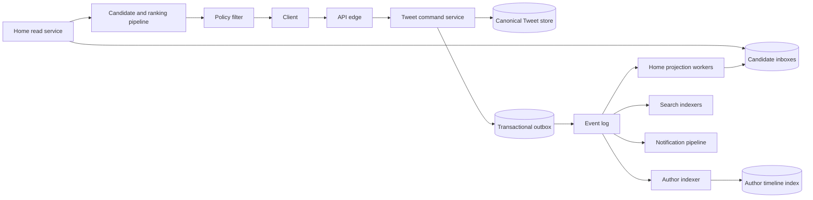

# Twitter/X Timelines: Evidence, Inference, and Reference Design

Twitter is a useful system-design case because a small durable write can trigger graph expansion, indexing, ranking, notification, and analytics work. It is also easy to turn that lesson into folklore. This chapter keeps three kinds of statements separate:

- **Documented** means a dated Twitter/X engineering source or paper states the behavior.
- **Inference** means the conclusion follows from documented constraints, but the private implementation is not published.
- **Reference design** means a defensible design for a Twitter-like service, not a claim about Twitter/X production.

Product names and architectures change. “Current” below always means current in the cited source, not necessarily current today.

## Evidence Boundary

| Evidence | What it establishes | What it does not establish |
|---|---|---|
| Twitter's April 2014 Manhattan post | An eventually consistent, multi-tenant key-value core with pluggable storage, cross-datacenter replication, repair, and optional strong-consistency services | The complete 2026 storage topology |
| Twitter's 2017 infrastructure retrospective | A historical path from MySQL through Gizzard, FlockDB, Snowflake, and Manhattan; a Redis-derived timeline cache written by Timeline and Fanout services | A universal rule for every timeline surface |
| The public 2023 Home Mixer repository | Candidate pipelines, feature hydration, scoring, filtering, mixing, fallback, and serving stages for the published Home Timeline code | Undisclosed models, feature values, fleet layout, or later private changes |
| The 2012 Earlybird paper | A segment-oriented real-time search engine designed for rapidly arriving Tweets | The present search stack |
| Twitter's October 2021 event-processing post | A dated snapshot of approximately 400 billion real-time events and petabyte-scale daily data, with real-time and batch processing in three datacenters | Tweet request rate or user count |

The scale figures in this chapter retain those source dates. They are historical observations, not sizing constants.

## Workload and Requirements

The core workload is asymmetric:

- A Tweet is written once, but may become a candidate for many readers.
- Follow and safety relationships change less often than timelines are read, yet they affect every read.
- Search needs low indexing delay, while ranking needs fresh behavioral features.
- Media bytes dominate object size and egress; Tweet metadata dominates online lookup count.
- A small number of authors can have far more followers than the median author.

**Documented (2023):** the public Home Mixer source describes separate “For You,” reverse-chronological “Following,” and List pipelines. “For You” draws candidates from several sources, hydrates features, scores, filters, mixes non-Tweet content, and prepares client instructions. It also exposes a reverse-chronological conversation-service fallback.

**Reference design requirements:**

| Capability | Correctness target | Degradation target |
|---|---|---|
| Create a Tweet | An acknowledged Tweet has one stable ID and durable canonical body | Delay secondary work rather than lose the Tweet |
| Follow/unfollow | Authorization and graph state converge without exposing blocked content | A stale follow may affect ranking briefly, but a block must take the safety path |
| Home timeline | No duplicates within a cursor traversal; visibility checked against current policy | Serve a smaller, older, or chronological feed |
| User timeline | Monotonic pagination over an author's published Tweets | Read canonical author history if caches are cold |
| Search | Results honor deletion and visibility policy | Admit indexing lag and show an incomplete result set |
| Delete | Canonical state changes once; derived copies are eventually removed or suppressed | Tombstone at read time until physical cleanup completes |

Latency goals belong to a product SLO, not to this case study. Establish separate SLOs for publish acknowledgement, home-feed freshness, search freshness, and read latency; a single “API latency” percentile hides the asynchronous path.

## State, Authority, and Invariants

The main design decision is not the database brand. It is which representation is authoritative.

| State | Authority in the reference design | Consistency | Rebuildable? |
|---|---|---|---|
| Tweet body and lifecycle | Tweet store, keyed by Tweet ID | Read-after-write for the author; durable state transitions | No |
| Follow, mute, and block edges | Relationship service | Strong per edge; safety edges take precedence | No |
| Author timeline | Ordered index of Tweet IDs by author | Monotonic append plus tombstones | Yes, from canonical Tweets |
| Home candidate inbox | Materialized Tweet-ID references by reader | Eventually consistent | Yes |
| Search index | Token-to-Tweet postings plus policy metadata | Eventually consistent | Yes |
| Ranking features | Stream/batch feature stores | Versioned and bounded-stale | Yes |
| Media | Immutable object store addressed by an asset/version ID | Durable after publish commit | No; derivatives are rebuildable |

The invariants are explicit:

1. A Tweet ID identifies at most one canonical Tweet.
2. Publishing never depends on completing follower fan-out.
3. A derived copy cannot override canonical deletion, account suspension, block, or audience policy.
4. Timeline cursors identify a stable ordering boundary, not an offset into a changing list.
5. Retryable commands carry an idempotency identity; event consumers deduplicate by event identity and projection version.
6. Search and timeline projections expose their freshness so operators can distinguish “fast but stale” from “slow.”

**Documented (2010):** Twitter introduced Snowflake because database-local auto-increment IDs did not provide a suitable distributed identifier. The public announcement establishes the service and its purpose. It does not prove that the original bit allocation remains unchanged.

**Reference design:** use a time-sortable, globally unique 64- or 128-bit ID whose generator lease and clock behavior are observable. Time ordering is helpful for storage locality and cursors, but canonical `created_at` remains separate because clocks can move and IDs can be generated before commit.

## Data Plane and Control Plane

The **data plane** accepts commands, stores canonical state, publishes events, builds projections, retrieves candidates, evaluates policy, and serves responses.

The **control plane** owns shard placement, consumer assignments, quota policy, ranking/model versions, feature definitions, search schema, cache TTL policy, rollout state, and regional traffic steering. A control-plane outage must freeze a known-good configuration rather than erase data-plane routing.

**Documented (2014):** Manhattan separated interfaces, storage services, engines, and a core responsible for routing, topology, replication, and conflict resolution. ZooKeeper held topology information but was not in the read/write critical path. That is evidence for a control/data-plane split, not a requirement to copy Manhattan.

## Tweet Write Flow

This flow is an **explicit reference design**:

1. The edge authenticates the actor, applies request and account quotas, and attaches an idempotency key.
2. The command service validates text, audience, reply/quote references, media readiness, and abuse-policy preconditions.
3. The service allocates a Tweet ID and atomically stores the Tweet plus an outbox record. The acknowledgement boundary is this durable commit.
4. A relay publishes `TweetPublished(tweet_id, author_id, audience_version, event_id)` to a partitioned event log.
5. Independent consumers update the author index, home candidate projections, search, notifications, counters, and offline datasets.
6. Each projection records its source offset and projection version. Retrying the same event is harmless.

The transactional outbox avoids a fatal split between “Tweet committed but event missing” and “event emitted but Tweet rolled back.” See [Outbox Pattern](../05-messaging/07-outbox-pattern.md) and [Delivery Guarantees](../05-messaging/04-delivery-guarantees.md).

Media upload should be a separate reservation flow. Upload immutable bytes, scan and transcode them, then publish a Tweet referencing a ready asset version. Otherwise a database commit can expose a Tweet whose media was never made durable.

## Timeline Write and Read Paths

### What is documented

**Documented (2017):** Twitter described Haplo as a primary cache for Tweet timelines backed by a customized Redis `HybridList`, read by Timeline Service and written by Timeline Service and Fanout Service. This establishes materialized timeline caching in that historical architecture.

**Documented (2023):** Home Mixer shows that serving is not “read one cached list.” The published pipeline retrieves heterogeneous candidates, hydrates features, scores, filters, mixes, decorates, and emits client instructions. Its “For You” path includes a reverse-chronological fallback.

Those sources do not publish a complete rule for which authors are pushed to which readers. Treat claims such as “Twitter always fan-outs ordinary users and always pulls celebrities” as unsupported unless tied to a dated source.

### Hybrid reference design

Use two candidate paths:

- **Materialize-on-write:** append a compact Tweet reference to bounded follower inboxes when predicted fan-out cost fits the publish-freshness budget.
- **Merge-on-read:** retrieve recent author items for high-fan-out, rapidly posting, or otherwise expensive sources and merge them at read time.

Do not choose a fixed follower-count threshold. Let the controller estimate:

`fanout_cost = eligible_followers × reference_bytes × replication_factor`

and

`completion_time = eligible_followers / available_projection_writes_per_second`.

Push only while the expected work fits both the per-author quota and the global freshness budget. The policy can change without changing canonical data.

The home read path is then:

1. Resolve a cursor containing an ordering boundary, ranking configuration, and snapshot epoch.
2. Fetch materialized references plus merge-on-read candidates.
3. Deduplicate by Tweet ID and hydrate canonical Tweet, author, conversation, and feature data in batches.
4. Apply hard visibility filters before ranking output is returned. Apply safety rules again if cached policy state is older than its allowed staleness.
5. Rank or reverse-sort, mix product modules, and return a signed opaque continuation cursor.
6. Record candidate-source coverage and freshness, not just response latency.

Inbox projections are bounded. Retaining every historical reference for every reader turns a cache into an unbounded database. Older pages can fall back to author/search indexes or a compact archival projection.

## Search, Trends, and Recommendations

**Documented (2012):** the Earlybird paper describes a real-time search engine using in-memory segments for incoming Tweets and optimized immutable segments. It was designed around the tension between rapid ingestion and efficient retrieval. The paper is historical evidence, not a current component inventory.

**Reference design search path:**

1. Consume the canonical Tweet lifecycle stream.
2. Normalize text and entities under a versioned analyzer.
3. Write an immutable posting segment and a mutable deletion/visibility overlay.
4. Query multiple time/term partitions in parallel with a deadline.
5. Retrieve candidates, enforce the requesting user's ACL and safety state, then rank.
6. Compact segments and physically remove expired tombstones later.

Deletion must reach a cheap query-time suppression path before slow index compaction. Otherwise a search cluster can faithfully serve content the canonical system already removed.

**Documented (2023):** public Home Mixer code names candidate generation, feature hydration, scoring, ranking, filters, heuristics, and fallback stages. **Inference:** separating those stages permits independent deadlines, feature/model versioning, and graceful degradation. The source does not disclose every production feature or model.

Trending topics are not a simple global counter. An **explicit reference design** maintains decayed count-min or exact heavy-hitter structures per locale and time bucket, compares observed volume with a learned or historical baseline, applies spam/coordinated-behavior controls, and merges only aggregates across regions. This keeps trend detection separate from durable Tweet storage.

## Partitioning and Illustrative Capacity Model

The following numbers are intentionally illustrative; they are not Twitter measurements.

Assume a design target of:

- 8,000 Tweet creates/s average and 32,000/s peak;
- 1.2 KiB of canonical Tweet metadata after indexing overhead, excluding media;
- 280 eligible followers per ordinary publish on average after excluding merge-on-read sources;
- 24 bytes per materialized inbox reference before storage-engine overhead;
- replication factor 3 for online state.

Canonical Tweet growth is approximately:

`8,000 × 86,400 × 1.2 KiB ≈ 791 GiB/day` before replication, or about `2.3 TiB/day` at three copies.

Average inbox projection work is:

`8,000 × 280 = 2.24 million reference writes/s`.

Raw reference growth is approximately:

`2.24 million × 24 B ≈ 51 MiB/s`, or `4.3 TiB/day` before replication and retention.

The arithmetic exposes the design pressure: tiny canonical writes can create much larger derived-write volume. It does not justify a particular threshold. Measure the follower-degree distribution, active-reader fraction, inbox retention, write amplification, and hot-author bursts before selecting a policy.

Partition separately by access pattern:

| Dataset | Candidate key | Hotspot concern | Mitigation |
|---|---|---|---|
| Tweets | Hash of Tweet ID | Recent-time locality if IDs are range-partitioned | Hash or salted time ranges |
| Author timeline | Author ID | A prolific author | Subpartition by time bucket |
| Home inbox | Reader ID | Highly active readers and rebuilds | Bounded buckets plus generation |
| Follow graph | Source or destination ID, depending query | High-degree accounts | Maintain query-specific projections |
| Search | Term/time segment | Viral terms and fresh segment | Scatter limits, replicas, admission control |
| Event log | Author or Tweet ID | A hot author pins one partition | More virtual partitions or keyed substreams while preserving required order |

See [Partitioning Strategies](../02-distributed-databases/05-partitioning-strategies.md), [Database Sharding](../06-scaling/03-database-sharding.md), and [Capacity Planning](../01-foundations/10-capacity-planning.md) for the general mechanisms.

## Concrete Failure Trace: Viral Publish Overloads Fan-Out

This is a **reference-design failure trace**, not a report of a Twitter incident.

1. An author with a very large active audience publishes during an external event.
2. The projection planner underestimates eligible recipients and admits the job to materialize-on-write.
3. One event becomes millions of reference writes. Inbox shards saturate and consumer lag grows.
4. Timeline reads miss their freshness objective. Clients refresh, raising read QPS.
5. Projection workers time out and retry without a shared retry budget, adding duplicate work.
6. Search and notification consumers sharing the same event-log or storage quota fall behind.

The system survives only if protection exists before the burst:

- Reserve separate quotas for canonical writes and each derived projection.
- Convert an admitted fan-out job to merge-on-read when its measured completion cost exceeds budget.
- Deduplicate projection writes and use checkpointed resumable ranges.
- Bound queues by bytes and age; shed low-value notification or precomputation work before canonical data.
- Expose feed freshness and consumer lag to the response path so it can select chronological fallback.
- Apply one retry owner and a global attempt budget; see [Backpressure](../06-scaling/07-backpressure.md) and [Retries, Timeouts, and Hedging](../06-scaling/10-retries-timeouts-hedging.md).

## Multi-Region Design

**Documented (2014):** Manhattan's core handled intra- and inter-datacenter replication and conflict resolution; its eventual model included reconciliation, read repair, and hinted handoff, while strong consistency was opt-in. **Documented (2021):** a Twitter event-processing pipeline ran real-time components and query services in three datacenters, with batch work in one and data replicated to two others. Neither source proves one global topology for all Twitter products.

An **explicit reference design** assigns each account or Tweet partition a write authority epoch:

- Route commands to the authority region or reject them when authority is uncertain.
- Replicate canonical Tweet and graph logs asynchronously to serving regions.
- Build disposable timeline/search projections regionally from those logs.
- Fence a previous writer before promoting another region.
- Preserve source offsets so a recovered region can prove its replay point.
- Size failover headroom before declaring a region evacuable.

Feeds may tolerate bounded staleness; blocks, account suspension, and deletion suppression require a faster global safety channel. Multi-region is therefore a per-data-class decision, not a single active-active checkbox. See [Multi-Region Architecture](../06-scaling/09-multi-region-architecture.md).

## Operations, Security, and Observability

Operational signals must follow the work graph:

- Publish commit latency, failure rate, and idempotency replay rate.
- Outbox age and event-log produce/consume offsets.
- Fan-out jobs admitted, converted to pull, completed, retried, and abandoned.
- Timeline candidate coverage, deduplication rate, source freshness, policy-filter count, and fallback rate.
- Search ingest lag, tombstone lag, segment age, scatter width, and partial-result rate.
- Storage hot keys, per-tenant quota consumption, reconciliation backlog, and replica divergence.
- Ranking feature age, model/config version, timeout contribution, and result-quality guardrails.

Trace a publish using `tweet_id`, `event_id`, projection generation, region, and source offset. Sampling only successful home reads will miss the expensive publish tail.

Security boundaries are part of correctness:

- Authenticate users and services independently; authorize every object access against audience and relationship state.
- Treat blocks, mutes, legal holds, geo restrictions, and account status as versioned policy inputs.
- Encrypt private content and credentials in transit and at rest; isolate encryption keys from content stores.
- Rate-limit by actor, application, destination, and cost, not only by IP.
- Prevent model and analytics pipelines from becoming an unreviewed copy of deleted or restricted data.
- Audit privileged reads and policy changes with immutable event identities.

Search and caches should store enough policy metadata to reject safely, but a cached “allow” must expire quickly or be invalidated. The authorization model is covered in [Authorization Patterns](../10-security/07-authorization-patterns.md).

## Evolution and Migration

**Documented historical evolution:** Twitter's 2017 retrospective describes an early MySQL deployment, Gizzard for distributed storage, FlockDB for graph storage, Snowflake for IDs, and later Manhattan adoption. The 2021 RocksDB post says Manhattan had become the default persistent real-time store for core nouns including Tweets, Users, and Direct Messages at that date.

The reusable lesson is migration discipline, not the component names. A safe reference migration from one Tweet or timeline store to another is:

1. Define the new authority and compatibility contract.
2. Backfill immutable history with source checksums and source positions.
3. Dual-write through an outbox, but keep one declared authority.
4. Shadow-read and compare presence, version, order, and policy outcome.
5. Cut over a small tenant or partition cohort behind a reversible routing flag.
6. Hold the old projection until the rollback window and reconciliation prove the new path.
7. Retire dual writes before adding new semantics; permanent dual authority creates ambiguity.

For timeline algorithm changes, log candidate sets and ranking decisions under both versions, then run guarded online experiments. Do not infer correctness from engagement alone: include safety, diversity, latency, freshness, and resource-cost guardrails. See [Migration Strategies](../15-deployment/06-migration-strategies.md) and [Online Experiments](../16-ml-systems/08-online-experiments.md).

## Verification

A design review should require evidence for these properties:

- Replaying any published event twice produces the same projection.
- Killing a fan-out worker leaves resumable work rather than an acknowledged gap.
- A deletion or block suppresses content even while timeline and search indexes are stale.
- Cursor pagination does not duplicate or skip items when new Tweets arrive.
- A hot author cannot consume canonical-write, search, or unrelated-tenant quotas.
- A regional promotion is fenced and preserves the declared RPO.
- A stale ranking feature or failed candidate source selects a known fallback.
- A full projection can be rebuilt from canonical history within a measured recovery objective.

Test these with skewed follower graphs and viral bursts, not uniform random traffic. Uniform load conceals the exact heavy-tail failure this architecture must absorb.

## Design Lessons

1. Separate canonical social state from disposable delivery and ranking projections.
2. Model write amplification from the degree distribution, not the average follower count alone.
3. Make fan-out policy adaptive and reversible; never put full fan-out on the publish acknowledgement path.
4. Enforce safety and visibility after candidate retrieval, even when earlier projections attempted filtering.
5. Treat feed freshness, search freshness, and publish durability as different SLOs.
6. Keep control-plane failure from invalidating known-good data-plane routing.
7. Cite dated public architecture as evidence and label the remainder as inference or reference design.

## Primary Sources

- Twitter Engineering, [“Announcing Snowflake”](https://blog.x.com/engineering/en_us/a/2010/announcing-snowflake.html), June 2010.
- Busch et al., Twitter, [“Earlybird: Real-Time Search at Twitter”](https://cs.uwaterloo.ca/~jimmylin/publications/Busch_etal_ICDE2012.pdf), ICDE 2012.
- Twitter Engineering, [“Manhattan, our real-time, multi-tenant distributed database for Twitter scale”](https://blog.x.com/engineering/en_us/a/2014/manhattan-our-real-time-multi-tenant-distributed-database-for-twitter-scale), April 2014.
- Twitter Engineering, [“The Infrastructure Behind Twitter: Scale”](https://blog.x.com/engineering/en_us/topics/infrastructure/2017/the-infrastructure-behind-twitter-scale), January 2017.
- Twitter Engineering, [“Processing billions of events in real time at Twitter”](https://blog.x.com/engineering/en_us/topics/infrastructure/2021/processing-billions-of-events-in-real-time-at-twitter-), October 2021.
- Twitter Engineering, [“Adopting RocksDB within Manhattan”](https://blog.x.com/engineering/en_us/topics/infrastructure/2021/adopting-rocksdb-within-manhattan), April 2021.
- Twitter, [Home Mixer README in the public recommendation repository](https://github.com/twitter/the-algorithm/blob/main/home-mixer/README.md), public repository released in 2023.
