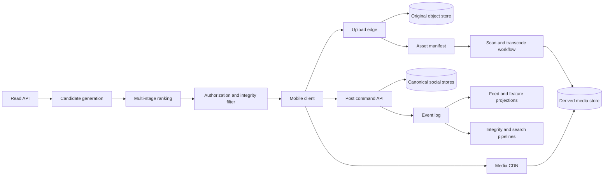

# Instagram: Evidence, Inference, and a Media-System Reference Design

Instagram combines durable social state, a large media pipeline, personalized retrieval, and privacy-sensitive delivery. Public sources describe dated slices, not one timeless architecture. Claims use three labels:

- **Documented**: stated in a dated Instagram or Meta primary source.
- **Inference**: a consequence of documented behavior whose implementation is not public.
- **Reference design**: a proposed Instagram-like architecture, never a statement about Meta's private system.

## Evidence Boundary and Dated Scale

| Source snapshot | Supported claim | Boundary |
|---|---|---|
| Instagram Engineering, December 2012 | PostgreSQL logical sharding and time/shard/sequence IDs were used in that historical design; the post reported more than 25 photos and 90 likes per second | Not evidence of today's database or rate |
| Instagram Engineering multi-datacenter migration, 2015 | The migration distinguished global from region-local data and discussed PostgreSQL/Cassandra replication | Not a complete modern regional topology |
| Meta Engineering, December 2020 | Suggested Posts used candidate generation and selection, embedding/co-occurrence sources, filtering, ranking, and diversification | Not every Feed or Reels pipeline |
| Meta Engineering, August 2023 | Explore used retrieval, first-stage ranking, second-stage ranking, and final reranking over a pool described as billions of media; the post says hundreds of millions visited Explore daily | A dated product-specific scale statement, not request throughput |
| Meta Engineering, May 2025 | Instagram operated more than 1,000 ML models across many ranked surfaces and introduced a registry, launch workflow, stability metrics, and SLOs | Model count is dated and does not reveal fleet size |

Do not combine scale values from different years into a fictional “current peak.” Capacity work below uses explicit illustrative assumptions instead.

## Workload and Product Contract

The system has four distinct pressure points:

1. **Media ingestion:** bursty, byte-heavy uploads followed by CPU/GPU-heavy derivation.
2. **Social writes:** posts, follows, likes, comments, saves, blocks, and audience changes.
3. **Personalized reads:** Feed, Stories, Reels, Explore, profiles, and notifications have different candidate sets and freshness objectives.
4. **Policy enforcement:** privacy, integrity, copyright, age, geography, deletion, and account status can override a previously materialized candidate.

An **explicit reference-design contract** is:

| Operation | Success means | Permitted degradation |
|---|---|---|
| Upload media | Original bytes are checksum-verified and durably associated with an upload reservation | Defer expensive renditions |
| Publish post | Canonical post and audience version commit exactly once | Feed/search propagation may lag |
| Read Feed | Results are authorized, cursor-stable, deduplicated, and version-attributed | Fall back to cheaper candidates or chronological ordering |
| Read Explore/Reels | Results pass integrity policy and identify candidate/model versions | Return fewer results instead of bypassing policy |
| Story expiry | Expired content is no longer served after the contract's grace bound | Physical deletion may complete later |
| Delete content | Canonical tombstone immediately dominates every derived copy | Cache/index cleanup is asynchronous |

Define separate SLOs for upload availability, publish acknowledgement, rendition readiness, Feed freshness, ranking availability, and media startup. A fast metadata API cannot compensate for a stalled media origin.

## State, Authority, and Invariants

| State | Reference-design authority | Derived representations |
|---|---|---|
| Original media asset | Immutable object store plus asset manifest | Encoded images/videos, thumbnails, CDN copies |
| Post metadata and lifecycle | Post store keyed by post ID | Profile indexes, feed candidates, search documents |
| Follow/block/audience edges | Relationship and policy service | Candidate eligibility caches |
| Interaction event | Append-only interaction log | Counts, ranking features, notifications, analytics |
| Story lifecycle | Story store with explicit publish and expiry times | Story trays and CDN entries |
| Recommendation model | Model registry entry plus immutable artifact | Replicated serving instances |
| Experiment assignment | Experiment authority | Request-local treatment cache |

The invariants are more valuable than a technology list:

1. A published post references only media variants whose manifest is valid.
2. Original media is immutable; edits create a new version and atomically change the post's pointer.
3. A block, audience restriction, or deletion can suppress content without waiting for every feed, search, and CDN copy to disappear.
4. Interaction retries do not multiply durable side effects.
5. Ranking output records model, feature, candidate-source, and policy versions.
6. A story's logical expiry is enforced on reads even if physical cleanup is delayed.
7. Derived counts and recommendations never become authority for billing, access, or deletion.

**Documented (2012):** Instagram's sharded-ID post encoded time, logical shard, and a per-shard sequence into a 64-bit identifier generated inside PostgreSQL. Treat this as historical evidence of locality-aware IDs, not a recommendation to reproduce its exact layout.

## Data Plane and Control Plane

The **data plane** handles uploads, post commands, event propagation, candidate retrieval, ranking, policy filtering, and media delivery.

The **control plane** governs media recipes, model and feature versions, experiment allocation, shard maps, data residency, integrity policy, cache keys, CDN invalidation, quota policy, and regional routing. If it is unavailable, serving uses signed last-known-good versions with bounded lifetime; it must not silently choose an unregistered model or disable policy.

**Documented (2025):** Meta described an Instagram model registry carrying business purpose, criticality, baseline and holdout model identifiers, with automated monitoring and launch tooling. This is direct evidence that ML metadata and change control are first-class operational state.

## Media Upload and Publish Flow

The following is an **explicit reference design**:

1. The client requests an upload reservation containing actor, media kind, declared size, and checksum.
2. The edge returns a short-lived, least-privilege upload capability bound to an object key and maximum bytes.
3. The client uploads in resumable chunks. The object service verifies length and checksum before marking the original complete.
4. Malware, content-safety, metadata-stripping, and format validation run before publication eligibility.
5. A workflow produces versioned derivatives: thumbnails, display images, codec/resolution ladders, captions, and preview frames as applicable.
6. The manifest records each derivative's checksum, dimensions, codec, policy result, and recipe version.
7. `PublishPost` atomically stores post metadata and an outbox event referencing a ready manifest generation.
8. Feed, search, feature, moderation, and notification consumers update independently.

The post acknowledgement need not wait for every optional rendition, but it must not point to missing required bytes. A basic rendition can unblock publish while expensive high-quality variants continue under a workflow deadline.

Use immutable URLs or versioned cache keys for media. Purge is a safety mechanism, not the only consistency mechanism: authorization and lifecycle checks belong in signed delivery tokens or an edge authorization step for private content.

## Feed, Stories, and Explore Read Paths

### Connected Feed

**Documented (2020):** Meta described Instagram Home Feed as ranking posts from followed sources using factors such as engagement, relevance, interests, quality, and freshness. The source does not reveal the storage layout or full ranking function.

An **inference** is that candidate eligibility and ranking should be distinct: follow state determines one candidate universe, while ranking orders eligible items. A privacy edge is not merely a negative feature.

An **explicit reference-design read**:

1. Resolve followed-source, recent-interaction, and product-policy candidate sources under independent deadlines.
2. Union and deduplicate compact post IDs, retaining source provenance.
3. Batch-hydrate post, author, audience, and feature state.
4. Remove deleted, blocked, ineligible, or already-seen items.
5. Run coarse then expensive ranking, diversity, and integrity stages.
6. Recheck audience policy at response assembly and issue an opaque cursor tied to an ordering boundary and pipeline version.

### Stories

Public sources do not specify a complete current Stories backend. Therefore the architecture here is a **reference design**. Maintain a per-viewer tray as a disposable projection of active story IDs, but enforce `published_at <= now < expires_at` against canonical state. Store view receipts as idempotent events partitioned by story or viewer according to the dominant query, and produce counts asynchronously. Do not make the displayed count authoritative for authorization or payout.

### Explore and Reels-style discovery

**Documented (2023):** Explore used a staged funnel: retrieval, first-stage ranking, second-stage ranking, and final reranking. It combined real-time and pre-generated sources; used Two-Tower representations for cacheable retrieval/early ranking; applied heavier multi-task ranking later; and used final reranking for integrity and diversity.

**Inference:** each narrowing stage should publish coverage, latency, and selection statistics. Otherwise a healthy final model can conceal a failed retrieval source.

**Reference design degradation ladder:**

- Skip one unhealthy source while preserving minimum source diversity.
- Reuse a bounded-age precomputed candidate set.
- Use a lighter registered ranker when the heavy ranker misses its deadline.
- Return fewer policy-cleared items.
- Never bypass authorization or integrity to fill a page.

Recommendation mechanisms are developed fully in [Recommendation Systems](../16-ml-systems/07-recommendation-systems.md), [Model Serving](../16-ml-systems/03-model-serving.md), and [Model Monitoring](../16-ml-systems/04-model-monitoring.md).

## Storage and Partitioning

**Documented historical design (2012):** Instagram described PostgreSQL logical shards mapped onto physical databases and globally sortable IDs containing the logical shard. The value of logical shards is movable placement: resharding can move small units without changing object identity.

**Documented historical migration (2015):** Instagram's multi-datacenter post distinguished global data from local data and discussed PostgreSQL and Cassandra replication. It is evidence of data classification during migration, not proof that every dataset used one consistency model.

A modern **reference design** partitions by access path:

| Dataset | Partition key | Secondary path | Hotspot control |
|---|---|---|---|
| Post metadata | Hash of post ID | Author/time projection | Salt hot-author buckets by time |
| Follow graph | Source user for “following”; destination projection for followers | Asynchronous inverse projection | Split high-degree vertices |
| Interactions | Post or user plus time bucket | Stream-built aggregates | Separate viral counters from raw log |
| Stories | Author plus expiry bucket | Viewer tray projection | Bounded active window |
| Media objects | Content/object key | Manifest by asset ID | CDN and request collapsing |
| Feature events | Entity plus event time | Offline lake partitions | Backpressure by bytes and age |
| ANN retrieval | Embedding shard/version | Metadata filter index | Replicas for hot interests |

Cross-shard joins are assembled at services or precomputed only for named queries. Do not denormalize privacy state into an unbounded number of places without a suppression path. See [Data Modeling](../02-distributed-databases/10-data-modeling.md) and [Secondary Indexes](../02-distributed-databases/06-secondary-indexes.md).

## Illustrative Capacity and Cost Model

These are **illustrative assumptions**, not Instagram metrics:

- 2,000 media posts/s average, 8,000/s peak.
- 70% images averaging 4 MiB originals; 30% videos averaging 40 MiB originals.
- Derived variants total 1.8 times original bytes before replication.
- Post metadata plus primary indexes average 2 KiB.
- 1,000,000 concurrent video viewers average 2 Mbit/s delivered bitrate.

Weighted original size is:

`0.70 × 4 MiB + 0.30 × 40 MiB = 14.8 MiB/post`.

Average original ingress is approximately `28.9 GiB/s`, or `2.38 PiB/day`. Derived output adds about `4.29 PiB/day` at the assumed 1.8 multiplier, before replication and lifecycle deletion. Metadata grows by only about `330 GiB/day` before replication. The byte path and metadata path therefore need different capacity plans.

The illustrative video egress is `1,000,000 × 2 Mbit/s = 2 Tbit/s`. Cache-hit ratio must be measured by bytes and rendition, not merely request count. A thumbnail hit can hide an origin miss on a large video segment.

For transcode capacity, if the weighted work is 180 compute-seconds per uploaded media-second and arrivals contain 600 media-seconds/s, steady-state demand is `108,000 compute cores` at one real-time equivalent per core before utilization and failure headroom. Replace those assumptions with codec benchmarks, device ladder, re-encode rate, and deadline classes.

Storage cost must include originals, derivatives, replication/erasure overhead, CDN fill, re-encoding, moderation artifacts, and legal retention. See [FinOps and Cost Engineering](../11-observability/06-finops-cost-engineering.md).

## Concrete Failure Trace: Viral Media and a Cold Rendition

This is a **reference-design failure**, not a reported Instagram incident.

1. A newly published video receives a sudden global burst before regional CDN caches hold its selected rendition.
2. Thousands of clients miss on the same first segments and converge on an origin tier.
3. Request retries and adaptive-bitrate switches multiply origin reads across several renditions.
4. Object-store latency rises; unrelated uploads and thumbnails share the same quota and slow down.
5. Playback ranking continues recommending the video, increasing demand faster than caches fill.
6. Operators see acceptable API latency but worsening startup delay and rebuffering.

Control the cascade at each amplification point:

- Collapse concurrent fills by `(asset, rendition, segment)` and use shield caches.
- Pre-position predicted hot content, while retaining origin fallback.
- Separate upload, thumbnail, manifest, and playback quotas.
- Feed playback health back into recommendation eligibility with a bounded, audited control loop.
- Bound client retries and honor end-to-end deadlines.
- Degrade to a lower ready rendition rather than synchronously transcode on demand.
- Monitor origin bytes, cache-fill amplification, startup time, and rebuffer rate together.

The canonical treatments of this mechanism are [CDN Architecture](../06-scaling/04-cdn-architecture.md), [Cache Stampede](../04-caching/04-cache-stampede.md), and [Backpressure](../06-scaling/07-backpressure.md).

## Multi-Region, Failure Recovery, and Operations

An **explicit reference design** separates data classes:

- Immutable public media can replicate broadly and serve from CDN edges.
- Canonical post and relationship writes have a declared home/authority epoch.
- Feed and recommendation projections rebuild regionally from logs.
- Safety tombstones and account restrictions use a fast global propagation channel.
- Private media delivery requires authorization local to the serving region or a fail-closed token.
- Region-local workflow queues can be recreated from canonical manifests and offsets.

Failover is not DNS alone. Promotion must fence the previous writer, verify replication position, restore policy/config/model dependencies, and ensure the destination has compute, storage, and egress headroom. See [Multi-Region Architecture](../06-scaling/09-multi-region-architecture.md) and [Disaster Recovery](../15-deployment/05-disaster-recovery.md).

Observe the system by product outcome and pipeline stage:

- Upload reservation success, resumed bytes, checksum failure, scan age, transcode queue age, and rendition-ready latency.
- Publish commit latency, outbox age, projection lag, and duplicate-event rate.
- Candidate count and age by source; filter reasons; stage latency; fallback and empty-page rates.
- Model calibration/stability, feature age, artifact/config mismatch, and resource use per model.
- Media startup, bitrate switches, rebuffering, CDN hit bytes, origin amplification, and regional egress.
- Deletion-to-suppression and deletion-to-physical-removal latency.

**Documented (2025):** Meta's Instagram model-platform post says model health previously lacked a consistent definition and describes calibration and normalized entropy inputs to a stability metric plus SLO automation. The general lesson is to monitor prediction behavior, not only server uptime.

## Security, Privacy, and Abuse

The media system expands the attack surface:

- Upload capabilities are short-lived, size-limited, content-type constrained, and scoped to one object key.
- Active content, malformed codecs, metadata leaks, and decompression bombs are isolated in sandboxed processing.
- Authorization is evaluated against current audience and relationship state before returning private metadata or a delivery token.
- Signed media tokens bind asset, rendition, audience context, expiry, and optionally region; URLs alone are not authorization.
- Likes, follows, comments, and views have actor- and target-aware rate limits plus coordinated-abuse detection.
- Training and feature pipelines carry purpose, retention, deletion, and lineage metadata.
- Operator access and legal-policy actions are audited separately from ordinary user reads.

Deletion has at least four clocks: read suppression, CDN invalidation, projection cleanup, and durable byte deletion. Publish all four; saying “deleted” without naming the clock is ambiguous.

## Evolution and Migration

The dated sources show evolution rather than one ideal endpoint: sharded PostgreSQL and custom IDs in 2012, a multi-datacenter migration in 2015, increasingly explicit recommendation funnels in 2020–2023, and model-fleet governance in 2025.

A **reference migration pattern** for a new post store, feed projection, or media recipe is:

1. Version the schema, manifest, event, and read contract first.
2. Backfill from immutable source data with per-partition checksums.
3. Mirror events to the new projection and compare semantic outcomes in shadow reads.
4. Serve a small cohort using stable experiment assignment and safety/cost guardrails.
5. Keep one canonical authority; a dual-write path is transport, not dual truth.
6. Roll forward by partition and retain a proven rollback point.
7. Stop old writes, wait through the retention/replay window, then remove old reads and data.

Ranking changes require offline replay and explicit documentation of counterfactual limitations, followed by staged online experiments with integrity, diversity, latency, and compute guardrails, not click rate alone.

## Verification and Design Lessons

Verify that:

- A publish cannot reference an incomplete required rendition.
- Retried upload completion and post commands remain idempotent.
- Blocks, privacy changes, story expiry, and deletion suppress stale feed/search/CDN copies.
- Candidate-source loss is visible and selects a registered fallback.
- Model, feature, and experiment versions can reproduce a ranking decision.
- Hot media cannot exhaust upload or metadata capacity.
- A projection can rebuild from the canonical log within its recovery objective.
- Regional failover preserves authority and data-residency policy.

The main lessons are:

1. Design media bytes, social metadata, and ML computation as different capacity systems.
2. Make immutable originals and explicit manifests the base for safe reprocessing.
3. Separate eligibility and integrity from ranking preference.
4. Treat recommendation stages as an observable narrowing funnel.
5. Give deletion a fast suppression path and measurable cleanup paths.
6. Preserve dated evidence boundaries; a 2012 storage post and a 2025 ML post do not describe one simultaneous architecture.

## Primary Sources

- Instagram Engineering, [“Sharding & IDs at Instagram”](https://medium.com/instagram-engineering/sharding-ids-at-instagram-1cf5a71e5a5c), December 2012.
- Instagram Engineering, [“Instagration Pt. 2: Scaling our infrastructure to multiple data centers”](https://medium.com/instagram-engineering/instagration-pt-2-scaling-our-infrastructure-to-multiple-data-centers-5745cbad7834), 2015.
- Instagram Engineering, [“Open-sourcing a 10x reduction in Apache Cassandra tail latency”](https://medium.com/instagram-engineering/open-sourcing-a-10x-reduction-in-apache-cassandra-tail-latency-d64f86b43589), March 2018.
- Meta Engineering, [“How Instagram suggests new content”](https://engineering.fb.com/2020/12/10/web/how-instagram-suggests-new-content/), December 2020.
- Meta Engineering, [“Scaling the Instagram Explore recommendations system”](https://engineering.fb.com/2023/08/09/ml-applications/scaling-instagram-explore-recommendations-system/), August 2023.
- Meta Engineering, [“Journey to 1000 models: Scaling Instagram's recommendation system”](https://engineering.fb.com/2025/05/21/production-engineering/journey-to-1000-models-scaling-instagrams-recommendation-system/), May 2025.
