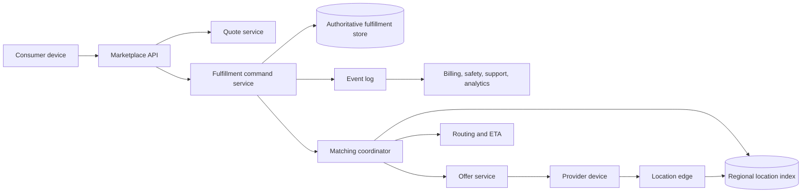

# Uber: Evidence, Inference, and a Real-Time Marketplace Reference Design

Ride fulfillment applies distributed-systems correctness to a physical world that keeps moving while packets are delayed. Driver location is an estimate, an offer is not an assignment, and payment must follow an authoritative trip lifecycle. Public sources describe several generations, not every current service.

Claims are labeled:

- **Documented**: stated in a dated Uber engineering post, paper, repository, or company report.
- **Inference**: follows from documented constraints but is not a published implementation detail.
- **Reference design**: a proposed Uber-like system, not a claim about Uber production.

## Evidence Boundary and Dated Scale

| Dated source | Documented fact | Boundary |
|---|---|---|
| Project Mezzanine, July 2015 | Uber moved core trip data from a single PostgreSQL instance to an append-only, sharded MySQL-backed store after mirrored writes, backfill, query replay, and validation | Historical migration, not today's complete storage stack |
| Ringpop post, February 2016 | Uber's Geospatial service held active vehicle locations in sharded in-memory workers using membership, consistent hashing, and forwarding | Does not prove the present location architecture |
| H3 post, June 2018 | Uber open-sourced a hierarchical hexagonal index used for marketplace analysis and optimization | H3 is an index, not a dispatch algorithm |
| Fulfillment rearchitecture, July 2021 | The platform reported more than one million concurrent users, billions of trips per year, more than ten thousand cities, and billions of database transactions per day; it used statecharts and a transaction coordinator | Scale and architecture are a 2021 snapshot |
| Fulfillment on Spanner, September 2021 | Uber described Cloud Spanner as storage for the rebuilt Fulfillment Platform to obtain transactional consistency and horizontal scale | Not every Uber workload uses Spanner |
| Reinforcement-learning matching post, July 2025 | Uber reported deployment of a value-function signal in matching in more than 400 cities | Does not expose the full matching objective or allocation system |

Do not combine these snapshots into an “Uber today” diagram; the reference architecture declares its own assumptions.

## Workload and Requirements

The marketplace has several clocks:

- Provider devices send noisy, delayed, and sometimes duplicated location updates.
- Consumers request quotes and trips against a rapidly changing supply set.
- Matching computes offers while providers move, go offline, or accept other work.
- Fulfillment state drives navigation, safety, pricing, receipts, support, and downstream finance.
- Maps, ETA, pricing, fraud, and notifications are dependencies, not the trip authority.

An **explicit reference-design contract**:

| Operation | Correctness requirement | Availability/degradation policy |
|---|---|---|
| Update provider location | Keep the newest accepted sample for a provider epoch; reject implausible or older samples | Missing updates age out rather than remain “available” forever |
| Request quote | Bind price/eligibility inputs and expiry to a quote ID | Return fewer products or a wider estimate if optional models fail |
| Request trip | Create one durable fulfillment intent per idempotency key | Do not dispatch until intent is committed |
| Offer work | An offer has a lease, version, target provider, and expiry | Expired offers cannot win |
| Accept offer | At most one provider becomes assigned for a fulfillment leg | Contention may reject a late acceptance |
| Advance trip | Only legal state transitions under the current entity version commit | Retry the command; never skip validation |
| Complete/cancel | Produce one authoritative terminal outcome and auditable adjustments | Downstream billing can catch up from events |

Location and ETA favor freshness; assignment and trip state favor consistency. Treating both with one consistency model creates either stale matching or double assignment.

## State, Authority, and Invariants

| State | Reference-design authority | Lifetime/consistency |
|---|---|---|
| Provider session | Fulfillment store, keyed by provider session ID | Strong per session |
| Latest provider location | Regional ephemeral location index plus sequence checkpoint | Bounded-stale and expiring |
| Consumer intent/quote | Quote and fulfillment stores | Immutable quote inputs; versioned intent |
| Offer | Offer store or fulfillment entity | Leased, versioned, idempotent |
| Assignment | Fulfillment state machine | Strong per fulfillment leg |
| Trip lifecycle | Fulfillment state machine and event log | Strong ordered transitions per trip |
| ETA/route | Versioned derived estimate | Recomputable and explicitly timestamped |
| Price/fare | Versioned quote plus adjustment ledger | Auditable; never inferred from displayed UI alone |
| Marketplace features | Stream/batch feature stores | Derived, versioned, bounded-stale |

Core invariants:

1. One fulfillment leg has at most one active assignment epoch.
2. A provider session can accept only work compatible with its current availability version.
3. A location update with an older device sequence or session epoch cannot replace a newer one.
4. Trip-state transitions are legal edges in a versioned statechart, not arbitrary field updates.
5. Every charge, payout, cancellation fee, and adjustment references immutable trip and policy versions.
6. A retry carries the same command identity; duplicates return the prior result or re-evaluate safely.
7. Derived ETA, map, and marketplace outputs cannot mutate trip authority directly.

**Documented (2021):** Uber's Fulfillment rearchitecture says it used hierarchical statecharts for fulfillment entities, a Business Transaction Coordinator for multi-entity writes, and an ORM over ACID storage. This is direct evidence that explicit lifecycle modeling replaced scattered implicit state in that generation.

## Data Plane and Control Plane

The **data plane** ingests locations, creates quotes and intents, retrieves candidates, computes offers, commits assignment and trip transitions, and emits events.

The **control plane** manages city/product policy, geofence and H3 resolution versions, model rollout, shard/region placement, capacity quotas, statechart schema, experiment assignment, routing graph versions, and failover authority. A control-plane outage should pin signed known-good configuration and stop risky policy changes; it should not erase active trips.

Configuration is safety-critical. A city-level rule change can affect eligibility, price, or legal behavior. Version it, stage it, audit it, and bind each quote/trip transition to the evaluated version.

## Location Ingestion and Spatial Indexing

**Documented historical design (2016):** Uber said its Geospatial service kept active vehicle locations in memory because the state was fleeting. Ringpop supplied SWIM-style membership, consistent hashing, and request forwarding so workers could own partitions and rebalance as membership changed.

**Documented (2018):** H3 maps latitude/longitude at a resolution into hierarchical hexagonal cells and supports neighborhood operations. Uber described using it for analysis and marketplace optimization. It does not establish that every live dispatch query simply scans an H3 ring.

An **explicit reference-design update flow**:

1. Authenticate the device and bind it to a provider-session epoch.
2. Validate timestamp, monotonic device sequence, accuracy radius, speed, and plausible displacement.
3. Map the sample to a versioned spatial cell and route by `(city, cell_partition)`.
4. Compare-and-set the latest record only if `(session_epoch, device_sequence)` is newer.
5. Update cell membership, removing the previous cell entry idempotently.
6. Append a sampled or compacted location event for ETA, safety, and analytics according to retention policy.
7. Expire the provider from matching if no acceptable update arrives within the product's measured freshness bound.

Keep accuracy and age with the coordinate. “Nearest” without uncertainty can prefer a GPS outlier. Candidate retrieval should expand cells until it meets a quality/work budget, then score road travel time and marketplace value; straight-line distance is only a coarse filter.

During ownership changes, either transfer a checkpoint plus buffered delta or allow short dual reads while fencing writes by partition epoch. Consistent hashing limits moved keys, but it does not transfer state or prevent stale owners by itself.

## Quote, Match, and Assignment Flows

### Quote

The quote path is an **explicit reference design**:

1. Normalize pickup/drop-off and bind map/geofence versions.
2. Retrieve eligible product and provider-supply aggregates.
3. Compute route/ETA candidates under an end-to-end deadline.
4. Evaluate a versioned pricing policy and return a signed quote ID with expiry and assumptions.
5. Persist only the compact quote contract needed for later verification; high-volume diagnostic features can go to a separate event stream.

**Documented historical evidence (2015):** Uber described an evolution from external/open routing engines plus a learned ETA adjustment to its Gurafu routing engine and Flux traffic data. It reported that the production path targeted fast route calculations and compared ETA with actual arrival using Kafka logs. This establishes iterative, measured ETA engineering, not the current algorithm.

### Candidate generation and offer

An **explicit reference design** uses a two-stage marketplace decision:

- Retrieve providers from expanding spatial/time cells, filtering session freshness, product eligibility, capacity, and safety constraints.
- Score a bounded set using pickup ETA, acceptance likelihood, provider fairness, consumer wait, downstream marketplace balance, and uncertainty.

The objective is multi-party and time-dependent. A greedy nearest-provider rule can increase future imbalance; a global optimizer can miss its latency budget. Use a bounded optimization window, publish its objective/version, and keep a simple eligible-nearest fallback.

**Documented (2025):** Uber described a DQN-inspired value-function signal incorporated into matching and reported deployment in more than 400 cities. **Inference:** a learned future-value signal complements rather than replaces eligibility and assignment invariants.

### Assignment

The assignment commit is the consistency boundary:

1. Create offer `(offer_id, trip_id, provider_session, assignment_epoch, expires_at)`.
2. Deliver it through a retryable channel; delivery is not acceptance.
3. On acceptance, atomically verify offer lease, trip version, and provider availability version.
4. Commit the trip-provider assignment and advance both entities, or use a transaction coordinator with a recoverable intent.
5. Emit the authoritative assignment event after commit.
6. Revoke losing offers; late acceptances observe the committed winner and fail safely.

Do not use a distributed lock without a fenced state version. A paused client can resume after a lease expires and otherwise overwrite the new owner.

## Fulfillment Lifecycle and Eventing

A **reference statechart** might contain:

`requested → matching → assigned → provider_arriving → pickup_ready → in_progress → completed`

with explicit cancellation and failure substates. This is illustrative, not Uber's private state enumeration.

Each transition command includes expected entity version, actor, location/time evidence, policy version, and idempotency key. The commit produces an ordered event such as `TripTransitioned(trip_id, from, to, entity_version, event_id)`.

Downstream billing, receipt, safety, support, notification, and analytics consumers own their projections and retry independently. A transactional outbox prevents a committed transition from losing its event. Consumers that require order partition by trip ID; global order is unnecessary and expensive. See [Message Ordering](../05-messaging/03-message-ordering.md) and [Event Sourcing](../05-messaging/05-event-sourcing.md).

**Documented historical storage (2016):** Schemaless used immutable cells keyed by row, column, and reference key; buffered writes and sharded indexes supported trip storage. **Documented evolution (2021):** Uber described Docstore as a multi-model database with partition-level strict serializability, transactions, materialized views, and CDC. These are different generations, not simultaneous universal truths.

## Partitioning and Illustrative Capacity

These numbers are **illustrative assumptions**, not Uber measurements:

- 3,000,000 online providers at peak.
- One accepted location sample every 4 seconds.
- 160 bytes per normalized in-memory record including identifiers, coordinate, accuracy, sequence, and index overhead.
- 120,000 quote/match requests/s at peak.
- 24 spatial partitions consulted per match after routing and expansion.
- 10,000 authoritative trip-transition writes/s at peak.

Location ingress is `3,000,000 / 4 = 750,000 updates/s`. Keeping only the latest normalized record requires about `458 MiB` raw (`3,000,000 × 160 B`) before hash/index allocator overhead and replicas. Replicating every raw location indefinitely would be far more expensive: at only 100 bytes/event, ingress is about `6.0 TiB/day` before replication and compression. Retention and compaction are architectural decisions.

Naively scattering each match to 24 partitions creates `2.88 million partition queries/s`. Coarse supply summaries, request routing, and adaptive cell expansion reduce scatter. Capacity must model cell skew around airports, stations, concerts, and storms; a global mean is useless.

If each trip transition averages 3 KiB across canonical row, indexes, and log before replication, 10,000/s produces about `2.4 TiB/day`. The critical constraint may be transactional write IOPS and hot city partitions rather than bytes.

| State | Primary partition | Why | Skew response |
|---|---|---|---|
| Latest location | City plus virtual spatial shard | Local retrieval | Split dense cells and time-slice rebalance |
| Provider session | Provider/session ID | Serialize availability | Cache route to authority |
| Trip/fulfillment | Trip ID | Ordered state transitions | Many virtual shards; no city-wide leader |
| Offers | Trip ID or provider ID by commit query | Resolve winner efficiently | Maintain query-specific index |
| Events | Trip ID | Preserve per-trip order | Partition count independent of storage shards |
| ETA graph | Region and graph version | Locality and atomic rollout | Immutable version plus delta overlays |

See [Capacity Planning](../01-foundations/10-capacity-planning.md), [Partitioning Strategies](../02-distributed-databases/05-partitioning-strategies.md), and [Secondary Indexes](../02-distributed-databases/06-secondary-indexes.md).

## Concrete Failure Trace: Stale Location Produces Competing Offers

This is a **reference-design failure trace**, not a documented Uber incident.

1. A provider crosses from spatial partition A to B while A's owner is isolated from the membership control plane.
2. B accepts sequence 901, but the stale A owner continues advertising sequence 897.
3. Two consumer requests retrieve the same provider from different partitions.
4. Both matching workers send offers because candidate retrieval treated presence as assignment authority.
5. The provider accepts one; the other request repeatedly retries acceptance after a timeout.
6. Without an assignment epoch and conditional commit, both trips could appear assigned.

The safe design has layered defenses:

- Location membership carries provider-session and partition epochs; readers discard stale owners.
- Candidate retrieval may be approximate, but acceptance performs a strong conditional write against provider availability and trip version.
- Offers expire and carry stable IDs; retry returns the committed outcome.
- Membership uncertainty shrinks eligibility or falls back to a slower authoritative lookup.
- Reconciliation scans detect one provider referenced by multiple active assignments and page before pickup.
- Metrics separate “offer delivered,” “accept attempted,” and “assignment committed.”

This illustrates a general rule: an approximate index can propose candidates, but it cannot own scarce-resource allocation.

## Multi-Region and Regional Authority

Physical marketplaces are naturally regional, but global identity, travel, support, and finance cross boundaries.

An **explicit reference design** assigns live fulfillment to a home region chosen by pickup market and an authority epoch:

- Location ingestion, matching, and active-trip commands stay near that market.
- Identity, payment tokens, risk signals, and product configuration replicate under their own consistency and residency contracts.
- Active trip state replicates to a paired recovery region with a declared RPO.
- A failover coordinator fences the previous region before issuing a higher authority epoch.
- Devices include observed authority/version on commands and reconnect to the promoted region.
- Completed-trip events flow to global finance and analytics through idempotent consumers.

A city cannot fail over safely merely because compute is available elsewhere. The destination also needs map/config versions, live provider reconnection, database write authority, notification routes, payment dependencies, and headroom. See [Multi-Region Architecture](../06-scaling/09-multi-region-architecture.md).

## Operations, Security, and Observability

Observe the physical outcome, not just RPC health:

- Location accepted/rejected by reason, age distribution, sequence regressions, cell skew, and ownership epoch mismatch.
- Quote coverage, route/model/config version, ETA error versus actual arrival, and fallback rate.
- Candidate count by stage, scatter width, optimization latency, offer delivery, acceptance, expiry, and committed-assignment rate.
- Illegal transition attempts, optimistic-concurrency conflicts, outbox age, and consumer lag by trip lifecycle.
- Pickup wait, cancellation, rematch, duplicate-offer, and “assigned provider unavailable” rates.
- Regional authority, replication position, recovery headroom, and device reconnect rate.

Trace IDs must join device sample, quote, request, trip, offer, assignment epoch, and transition event without putting raw precise location into broadly accessible logs.

Security and privacy requirements include:

- Mutual service identity and device-bound provider sessions.
- Encryption of precise location and payment data, with separate access purposes and retention.
- Coarse location for broad analytics; precise location only where fulfillment or safety requires it.
- Signed, expiring offers and commands resistant to replay.
- Audited override paths for safety/support; no direct database edits to trip state.
- Rate limits by actor, device, market, action cost, and target, plus synthetic-location and collusion detection.
- Data-residency classification carried into logs, backups, features, and disaster-recovery copies.

## Evolution and Migration

Uber's sources document an instructive sequence: a PostgreSQL bottleneck; the 2014 Mezzanine/Schemaless migration described in 2015–2016; Ringpop-based application partitioning; H3 as a reusable spatial index; and a 2021 Fulfillment rewrite with statecharts, ACID storage, and a controlled product migration.

**Documented (2015):** Mezzanine changed trip IDs to UUIDs, backfilled, mirrored writes, replayed queries in the background, validated results, and switched reads after incremental refactoring. **Documented (2021):** the Fulfillment rewrite says every product and city migrated with support from more than 100 engineers across more than 30 teams.

A reusable migration plan is:

1. Introduce a compatibility API and explicit statechart around the old authority.
2. Allocate stable IDs and versions before data movement.
3. Backfill immutable history with checksums and source positions.
4. Mirror commands/events while one store remains authoritative.
5. Shadow-read transition eligibility and resulting state, not just row equality.
6. Move one market/product cohort with automatic rollback gates.
7. Reconcile active trips before each cohort and drain old in-flight work.
8. Stop old writes, hold rollback history, then remove compatibility code.

This is covered generally in [Database Migrations](../15-deployment/03-database-migrations.md) and [Migration Strategies](../15-deployment/06-migration-strategies.md).

## Verification and Design Lessons

Verify with deterministic state-machine tests, property-based command reordering, and market-shaped load:

- Older and duplicate location samples never replace newer state.
- Two simultaneous acceptances yield one assignment winner.
- Every legal transition is reachable and every illegal transition is rejected.
- Event replay reconstructs the same fulfillment state and downstream ledger.
- A stale spatial owner cannot commit an assignment.
- Dense-cell failure sheds approximate queries without losing active trips.
- Regional promotion fences the previous writer and clients converge on the new epoch.
- ETA/model fallback is observable and cannot bypass eligibility or safety.

The reusable lessons are:

1. Keep ephemeral location indexes separate from authoritative allocation state.
2. Make offers leased proposals and assignment a conditional durable commit.
3. Encode business lifecycle as a versioned statechart with idempotent commands.
4. Model spatial skew and scatter, not only global request rate.
5. Bind quotes, routes, and transitions to configuration/model versions for auditability.
6. Migrate physical-world systems market by market with in-flight draining and reconciliation.

## Primary Sources

- Uber Engineering, [“Project Mezzanine: The Great Migration”](https://www.uber.com/us/en/blog/mezzanine-codebase-data-migration/), July 2015.
- Uber Engineering, [“ETA Phone Home: How Uber Engineers an Efficient Route”](https://www.uber.com/us/en/blog/engineering-routing-engine/), November 2015.
- Uber Engineering, [“Designing Schemaless, Uber Engineering's Scalable Datastore Using MySQL”](https://www.uber.com/us/en/blog/schemaless-part-one-mysql-datastore/), January 2016.
- Uber Engineering, [“How Ringpop from Uber Engineering Helps Distribute Your Application”](https://www.uber.com/us/en/blog/ringpop-open-source-nodejs-library/), February 2016.
- Uber Engineering, [“H3: Uber's Hexagonal Hierarchical Spatial Index”](https://www.uber.com/us/en/blog/h3/), June 2018.
- Uber Engineering, [“Uber's Fulfillment Platform: Ground-up Re-architecture”](https://www.uber.com/us/en/blog/fulfillment-platform-rearchitecture/), July 2021.
- Uber Engineering, [“Building Uber's Fulfillment Platform for Planet-Scale using Google Cloud Spanner”](https://www.uber.com/us/en/blog/building-ubers-fulfillment-platform/), September 2021.
- Uber Engineering, [“Reinforcement Learning for Modeling Marketplace Balance”](https://www.uber.com/us/en/blog/reinforcement-learning-for-modeling-marketplace-balance/), July 2025.
