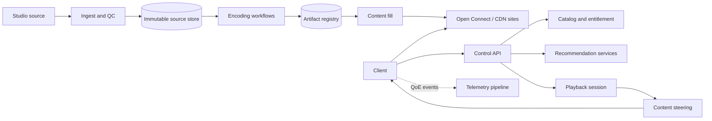

# Netflix: Evidence, Inference, and a Streaming Reference Design

Netflix is not one “video service”: it separates a control plane for identity, catalog, personalization, playback authorization, and steering from a content plane that prepares and delivers immutable media. Public sources document dated components, not one complete current architecture.

Claims use three labels:

- **Documented**: stated in a dated Netflix primary source, paper, or repository.
- **Inference**: follows from documented constraints but is not a published private implementation detail.
- **Reference design**: a proposed Netflix-like service, not an assertion about Netflix production.

## Evidence Boundary and Dated Scale

| Source snapshot | Documented fact | Boundary |
|---|---|---|
| Cloud migration announcement, February 2016 | Netflix completed a seven-year streaming-service cloud migration, used multiple AWS regions, evolved from a monolith to hundreds of microservices, and delivered video through Open Connect | Historical architecture, not a 2026 service inventory |
| Per-title encoding, December 2015 | Netflix analyzed title complexity to select bitrate-resolution ladders; clients selected encodes adaptively | The recipe has evolved since 2015 |
| Open Connect site, accessed July 2026 | Netflix said it partnered with more than 1,000 ISPs and used embedded appliances plus settlement-free interconnection; embedded appliances had the same capabilities as those in 60+ global datacenters | Dynamic program statement, not per-appliance capacity |
| Open Connect overview, accessed July 2026 | Thousands of appliances at IXPs and ISP networks stored encoded files and served them over HTTP/HTTPS under a supporting control system | Does not reveal steering algorithms or fleet-by-region |
| Recommendation foundation-model post, March 2025 | The post reported more than 300 million users at the end of 2024 and hundreds of billions of interaction events for recommendation work | Not streaming concurrency or request QPS |

Scale values retain their date and methodology; subscriber counts are not used to estimate traffic.

## Workload and Requirements

Streaming creates several independent workloads:

- **Studio ingest:** very large source packages arrive irregularly and require validation, localization, quality control, and rights metadata.
- **Encoding:** many codecs, resolutions, dynamic ranges, audio tracks, subtitles, and device constraints multiply work and stored objects.
- **Control requests:** browse, search, recommendations, account, entitlement, playback-session creation, manifest, and steering are latency-sensitive but byte-light.
- **Content delivery:** segment reads are byte-heavy, highly cacheable, and dominated by evening regional peaks.
- **Telemetry:** clients emit playback quality and product events at high volume; these must not block playback.

An **explicit reference-design contract**:

| Capability | Correctness requirement | Graceful degradation |
|---|---|---|
| Ingest title | Source package, rights, and checksums form an immutable version | Quarantine invalid tracks; do not publish partial assets |
| Encode | Every playable artifact is tied to source, recipe, codec, and quality-validation versions | Publish a baseline ladder while optional/high-cost encodes finish |
| Browse | Return entitled, age/region-appropriate catalog items | Use cached rows or generic ordering if personalization fails |
| Start playback | Authorize account/profile/device/title and issue a bounded session | Fail closed on entitlement; degrade optional personalization |
| Stream | Client can switch among compatible representations without corrupting playback | Lower quality or alternate content site before rebuffering |
| Revoke rights | New sessions cannot start after the effective boundary | Existing-session policy is explicit and auditable |

Availability must be measured as “can the member discover and play,” not merely “API returned 200.” Track playback-start success, time to first frame, rebuffering, delivered quality, and control-plane fallbacks separately.

## State, Authority, and Invariants

| State | Reference-design authority | Derived state |
|---|---|---|
| Source media package | Immutable studio object store and package manifest | Mezzanine/proxy files |
| Encoded representation | Artifact registry keyed by source and recipe version | CDN/OCA copies |
| Title/catalog metadata | Catalog service with effective-dated rights | Search and browse indexes |
| Account/profile/entitlement | Membership and policy services | Session authorization cache |
| Playback session | Session authority with signed grants | Edge verification state |
| Content steering | Versioned mapping from client/network/content to eligible sites | DNS/manifest hints and client cache |
| Recommendation model | Model registry plus immutable artifact | Online replicas and precomputed rows |
| Viewing interaction | Append-only event log | Features, metrics, experiments, recommendations |

Invariants:

1. A playable manifest references only validated, immutable artifacts from one compatible source generation.
2. Entitlement and rights are evaluated for title, profile, device, region, and effective time before issuing a playback grant.
3. Content caches may serve bytes but cannot grant rights.
4. Steering chooses only sites that advertise the required artifact and current health/capacity eligibility.
5. Retried session or telemetry commands are idempotent; telemetry loss cannot terminate playback.
6. Catalog, recommendation, and playback decisions retain configuration/model/artifact versions for audit and replay.
7. Content-plane failure is isolated from account and catalog authority; control-plane failure does not corrupt immutable media.

## Separate Control and Content Planes

**Documented (2016):** Netflix said cloud systems handled business logic, distributed databases, analytics, recommendations, and transcoding, while Open Connect delivered video. **Documented (Open Connect, accessed 2026):** appliances serve encoded video/image files, report health, obtain configuration from supporting services, and contribute health/load information to routing decisions.

**Inference:** separating control APIs from media delivery reduces correlated scaling and failure: browsing traffic scales with interactions, while content traffic scales with bitrate and viewing duration.

The **reference-design control plane** also owns encoding recipes, artifact placement, model/config rollout, rights ingestion, device capability rules, regional traffic, signing keys, and disaster-recovery authority. Serving systems cache signed known-good versions so a control-plane pause does not instantly stop healthy streams.

## Content Ingest and Encoding

The following is an **explicit reference design**:

1. Receive a studio package into an isolated landing zone with a package ID and declared checksums.
2. Verify bytes, track timing, audio layout, subtitles, captions, artwork, rights metadata, and malware/content safety.
3. Commit an immutable source manifest. Corrections create a new generation rather than overwriting inputs.
4. Expand a versioned encode DAG by codec, device class, resolution, dynamic range, audio, locale, and accessibility track.
5. Chunk work into idempotent tasks. Each output key contains source generation, recipe version, and chunk boundary.
6. Measure objective/perceptual quality, decode compatibility, A/V synchronization, and boundary continuity.
7. Construct compatible bitrate ladders and manifests only from accepted outputs.
8. Publish the title generation after rights, catalog, and a minimum viable ladder are ready; optional variants can join through a new manifest version.
9. Replicate artifacts to origin/content sites according to forecast demand and recovery policy.

**Documented (2015):** Netflix's per-title work encoded trial points at multiple resolutions, estimated bitrate-quality curves, and chose points near a convex hull under device and perceptual-spacing constraints. It also states that clients run adaptive streaming algorithms to select among encodes based on bandwidth and device capability.

The design lesson is not a fixed ladder. Encoding is an optimization under quality, device, storage, compute, delivery-cost, and launch-deadline constraints. Recipes and quality metrics must be versioned because re-encoding the catalog is a migration.

## Browse and Recommendation Flow

Browse is a personalized read model, not catalog authority.

An **explicit reference-design flow**:

1. Authenticate the account/profile and resolve locale, maturity, device, and experiment assignment.
2. Fetch eligible catalog IDs from rights and profile policy.
3. Retrieve several candidate rows: continue watching, known preferences, new/relevant content, and editorial/business collections.
4. Hydrate bounded-age features and rank under a deadline.
5. Apply entitlement, maturity, availability, diversity, and presentation constraints after ranking.
6. Return row/item explanations and model/config versions to observability, not necessarily to the client.
7. Fall back through cached personalized rows, precomputed cohort rows, and finally eligible generic rows.

**Documented (2025):** Netflix described multiple specialized recommendation models, a foundation-model effort using tokenized interaction histories, and hundreds of billions of interactions associated with more than 300 million users at the end of 2024. It discusses batch-computed embeddings, online uses, incremental training, cold start, and downstream applications. It does not publish the entire browse request graph.

Recommendation cannot override catalog eligibility. A stale recommender may omit a title; it must not expose a title outside its rights or profile policy. See [Recommendation Systems](../16-ml-systems/07-recommendation-systems.md) and [ML Risk and Governance](../16-ml-systems/09-ml-risk-governance.md).

## Playback Start and Segment Delivery

The **reference-design playback-start flow**:

1. The client requests playback using profile, title, device capabilities, application version, and a stable idempotency key.
2. Session service checks membership, concurrent-stream policy, maturity, geography, title rights, DRM capability, and experiment policy.
3. It returns a signed, short-lived playback grant, compatible manifest generation, telemetry session ID, and steering bootstrap.
4. Steering selects an ordered set of eligible content sites using network prefix, artifact presence, health, load, and failure-domain diversity.
5. The client fetches a manifest and segments over HTTPS, measures throughput/buffer state, and selects compatible representations.
6. On a failed site, the client retries within an end-to-end deadline against the next eligible site; it does not retry indefinitely across every representation.
7. Quality-of-experience events flow asynchronously with bounded local buffering.

**Documented (Open Connect, accessed 2026):** embedded appliances can be deployed inside ISP networks; settlement-free interconnection provides another path; sample designs show failover between embedded sites and then to Netflix IX appliances. The deployment guide says appliances are directed caches: ISP prefixes advertised via BGP determine which clients an embedded appliance may serve, while Netflix also participates in directing requests.

**Inference:** the client is part of resilience. It observes buffer and throughput more directly than a remote load balancer, but its decisions must be bounded to prevent retry and representation-switch amplification.

## Partitioning and Illustrative Capacity

These figures are **illustrative assumptions**, not Netflix measurements:

- 5,000,000 concurrent streams at a regional/global design peak.
- Weighted delivered bitrate of 4 Mbit/s.
- 97% of bytes served from local/peered content sites, leaving 3% to an upstream tier.
- 1,000 source hours/day newly processed.
- 20 effective encode variants per source hour at an average 4× real-time compute cost.
- 6-second segments and a two-hour average title for object-count illustration.

Delivered traffic is `5,000,000 × 4 Mbit/s = 20 Tbit/s`. At the assumed 97% localization, upstream traffic is still `600 Gbit/s`. A one-percentage-point drop in localized bytes adds `200 Gbit/s` upstream, so byte-hit ratio and link headroom are first-class signals.

Encoding demand is `1,000 × 20 × 4 = 80,000 compute-hours/day`, or roughly `3,333 continuously busy core-equivalents` before retries, quality analysis, codec heterogeneity, launch bursts, and headroom. Compute must be scheduled by publication deadline and artifact criticality, not FIFO alone.

At six-second segments, a two-hour representation contains 1,200 media segments. Twenty variants create about 24,000 segment objects per title generation before audio, subtitles, images, manifests, and replicas. Object-count and metadata/index capacity can dominate even when byte capacity appears comfortable.

Partition by access pattern:

| Dataset/work | Partition key | Skew concern | Control |
|---|---|---|---|
| Source/artifacts | Content hash plus generation | Launch-day title | Immutable objects and content-site replication |
| Encode tasks | Title, track, chunk, recipe | One large/high-priority launch | Deadline classes and chunk work stealing |
| Catalog/rights | Title and market/effective time | Global premiere | Replicas plus versioned caches |
| Account/profile | Account/profile ID | Household/device bursts | Per-account serialization and rate policy |
| Playback session | Session/account ID | Reconnect storm | Idempotency and admission control |
| Telemetry | Session or device hash plus time | Top-of-hour/device rollout | Bounded buffers and independent quotas |
| Recommendation features | Member/title and version | Popular titles | Batch/online split and hot-key replication |

See [Capacity Planning](../01-foundations/10-capacity-planning.md), [CDN Architecture](../06-scaling/04-cdn-architecture.md), and [Durable Workflow Engines](../18-workflow-job-systems/04-durable-execution-workflow-engines.md).

## Concrete Failure Trace: Healthy APIs, Failing Playback

This is a **reference-design failure trace**, not a Netflix incident report.

1. A routing-policy rollout marks an overloaded content site healthy because its aggregate CPU is low, while one network path is congested.
2. Playback-session APIs remain healthy and continue steering clients toward that site.
3. Clients experience slow first segments, switch down representations, and retry alternate hosts.
4. Retry traffic and cache misses raise connection and disk pressure at neighboring sites.
5. Browse metrics remain green; playback starts and delivered quality collapse in one ISP/region/device slice.
6. Automated scaling cannot fix an ISP path or missing artifact placement, and a broad rollback is delayed because aggregate global QoE looks acceptable.

Defenses:

- Compute health by client network, artifact, and delivered throughput, not host CPU alone.
- Canary steering policy by ISP/region/device and compare playback-start success before expansion.
- Require artifact-presence proof and failure-domain diversity in the site list.
- Bound client attempts, use jitter, and cancel superseded segment requests.
- Keep emergency steering independent of the normal configuration rollout path.
- Alert on localized QoE burn rates and origin/upstream byte amplification.
- Degrade image previews, autoplay, or browse richness before playback authorization and segments.

This is why control-plane observability must join client QoE with content-site and network telemetry.

## Multi-Region Resilience and Chaos

**Documented (2016):** Netflix said multiple AWS regions allowed it to shift and expand global infrastructure, and that regular production drills using the Simian Army supported resilience. The announcement reported service availability nearing a four-nines goal at that time. That is a historical goal/status, not a promise today.

**Documented repository behavior:** Chaos Monkey randomly terminates production virtual-machine instances and containers to expose engineers to failures. The repository does not imply that arbitrary uncontrolled experiments are safe.

An **explicit reference design** separates failure domains:

- Account and playback-session authority has a tested regional failover and fencing plan.
- Catalog, rights, model, and configuration snapshots replicate before traffic shifts.
- Content sites are multi-homed across embedded, IXP, and upstream paths where economics permit.
- Immutable media remains available even if personalization or telemetry is degraded.
- Region evacuation is rehearsed at expected peak load with static headroom.
- Chaos experiments have a hypothesis, steady-state metric, small blast radius, abort condition, and named owner.

Chaos is verification, not a substitute for invariants, capacity, or disaster recovery. See [Cell-Based Architecture](../06-scaling/11-cell-based-architecture.md), [Multi-Region Architecture](../06-scaling/09-multi-region-architecture.md), and [Incident Management](../11-observability/07-incident-management.md).

## Operations, Security, and Observability

Observe four joined layers:

- **Content preparation:** ingest age, validation failures, encode task age, retry cost, quality distribution, artifact completeness, and launch readiness.
- **Control plane:** browse/session latency, entitlement denials, fallback rate, catalog/config/model version, regional dependency health, and error-budget burn.
- **Delivery:** bytes and hit ratio by site/ISP/rendition, origin amplification, disk/network saturation, artifact misses, steering changes, and failover path.
- **Client QoE:** start success, time to first frame, rebuffer ratio, bitrate/resolution, representation switches, playback failures, and telemetry loss.

Use a stable playback-session ID to join these layers while keeping account identity access-controlled. High-cardinality debugging data needs retention and sampling policy; dropping rare failures defeats the purpose.

Security is end to end:

- Studio source and unreleased assets use isolated identities, encryption keys, watermarking/audit policy, and least-privilege workflows.
- Playback grants are signed, short-lived, audience/device/title scoped, and replay bounded.
- DRM/license authority is separate from content caches; possession of a segment URL is insufficient entitlement.
- Account credentials, profiles, and viewing history have purpose-specific access and retention.
- OCA management and serving interfaces are separated. **Documented (Open Connect, accessed 2026):** Netflix describes single-purpose appliances, restricted management interfaces, minimal privileges, health monitoring, and runtime intrusion detection.
- BGP and routing policy require authenticated operations, prefix controls, rollback, and route-leak monitoring.

## Evolution and Migration

The public record illustrates several independent evolutions:

- **Documented (2008–2016):** after a 2008 database corruption, Netflix rebuilt toward distributed cloud systems and completed its streaming-service cloud migration in January 2016 rather than performing a simple lift-and-shift.
- **Documented (2015):** per-title encoding replaced a one-size-fits-all ladder with content-aware optimization.
- **Documented (Open Connect):** content delivery uses purpose-built appliances at exchange and ISP locations plus peering, separating media delivery from general cloud compute.
- **Documented (2025):** recommendation work explored a foundation model while preserving downstream embeddings, fine-tuning, cold-start behavior, and incremental training.

A reusable **reference migration** for a codec, manifest, or steering change:

1. Version the source, recipe, output, compatibility, and rollback contract.
2. Produce new artifacts alongside old ones; never overwrite playable bytes.
3. Validate decode compatibility and objective plus human quality on a representative device matrix.
4. Canary manifest exposure by device/network/title cohort.
5. Measure QoE, bytes, cache efficiency, and compute/storage cost together.
6. Keep old artifacts through the playback-session and rollback window.
7. Retire old variants only after active manifests and offline downloads can no longer reference them.

For a regional/API migration, shadow requests and failover drills must verify user-visible playback, not only response equivalence.

## Verification and Design Lessons

Verify that:

- Replayed encode tasks produce byte-identical or explicitly version-distinct artifacts.
- No manifest exposes a missing, failed, or incompatible representation.
- Rights revocation blocks new grants even if CDN bytes remain cached.
- Steering loses one site, network path, or region without retry amplification.
- Browse/recommendation failure preserves eligible generic discovery and playback.
- Client telemetry loss cannot interrupt an otherwise healthy stream.
- A codec/manifest rollback works on every supported device cohort.
- Region evacuation has enough control-plane capacity and reachable content delivery.

The reusable lessons are:

1. Separate byte delivery from personalized control requests and capacity-plan them independently.
2. Make media immutable and publish manifests as versioned compatibility contracts.
3. Put the adaptive client inside the resilience model, with strict attempt budgets.
4. Optimize encoding jointly for quality, compute, storage, device support, and delivery cost.
5. Measure playback outcome by ISP/region/device/content slice; global API health is insufficient.
6. Treat chaos experiments as bounded tests of a declared steady state.

## Primary Sources

- Netflix Technology Blog, [“Per-Title Encode Optimization”](https://netflixtechblog.com/per-title-encode-optimization-7e99442b62a2), December 2015.
- Netflix, [“Completing the Netflix Cloud Migration”](https://about.netflix.com/en/news/completing-the-netflix-cloud-migration), February 2016.
- Netflix Open Connect, [program overview and sample architectures](https://openconnect.netflix.com/en/), accessed July 2026.
- Netflix Open Connect, [“Open Connect Overview”](https://openconnect.netflix.com/Open-Connect-Overview.pdf), accessed July 2026.
- Netflix Open Connect, [appliance overview](https://openconnect.netflix.com/en/appliances/), accessed July 2026.
- Netflix, [Chaos Monkey repository](https://github.com/Netflix/chaosmonkey), source and documentation accessed July 2026.
- Netflix Technology Blog, [“Foundation Model for Personalized Recommendation”](https://netflixtechblog.com/foundation-model-for-personalized-recommendation-1a0bd8e02d39), March 2025.
