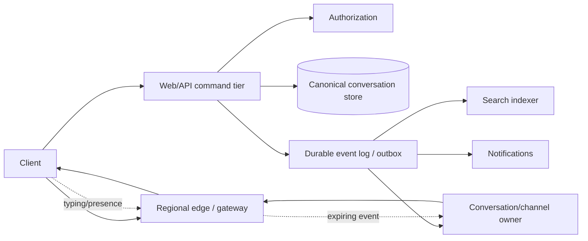

# Slack: Evidence, Inference, and a Durable Real-Time Messaging Reference Design

Slack's central systems problem is preserving durable, permissioned conversation state while millions of long-lived connections receive transient updates, reconnect, and cross organizational boundaries—not opening a WebSocket. Slack Engineering documents useful slices of this evolution, but each source is dated and partial.

Claims are labeled:

- **Documented** — stated by a dated Slack primary source or incident review.
- **Inference** — follows from published constraints, without asserting a private implementation.
- **Reference design** — a proposed Slack-like system, not a statement about Slack production.

## Evidence Boundary and Dated Scale

| Source snapshot | Documented fact | Boundary |
|---|---|---|
| Shared Channels, September 2019 / updated June 2020 | Webapp handled HTTP and persistence; real-time message servers fanned events to WebSocket clients; workspace was a database, messaging, search, authorization, and tenancy boundary | Historical architecture before later changes |
| Vitess migration, December 2020 | Messages were persisted before real-time delivery; Vitess served 99% of query load and the post reported 2.3M peak QPS, 2 ms median, and 11 ms p99 | Dated datastore snapshot, not present capacity |
| Envoy WebSocket migration, March 2021 | Slack migrated millions of concurrent WebSockets from HAProxy to Envoy using weighted regional rollout and rollback | Edge-tier migration, not the whole messaging stack |
| Real-time Messaging, April 2023 | Channel, Gateway, Admin, and Presence servers; consistent-hash channel ownership; geographically distributed gateways; tens of millions of clients/channels and stated 500 ms worldwide delivery | Product/fleet snapshot at publication |
| Cellular architecture, August 2023 | Slack was migrating critical user-facing services into availability-zone cells after an AZ failure propagated through cross-zone dependencies | Cell scope and migration continued beyond the post |
| Unified Grid, July 2024 | Slack moved away from workspace-centric assumptions for its largest customers and changed APIs, storage access, RTM fan-out, and clients | Not every object became organization-global |

The numbers above are source-dated observations. The capacity model below uses separate hypothetical inputs.

## Workload and Requirements

Slack-like workloads mix:

- Long-lived connections with bursty small events.
- Durable message, edit, reaction, membership, and policy writes.
- Transient typing and presence signals whose value expires quickly.
- Client boot and catch-up reads after reconnects or releases.
- Full-text search over a corpus where every user's visibility set differs.
- Files whose bytes follow a separate object/CDN path.
- Cross-workspace channels whose authorization cannot be reduced to one tenant ID.

An **explicit reference-design contract**:

| Operation | Correctness target | Degradation target |
|---|---|---|
| Send message | One durable canonical message per idempotency key; channel authorization checked at commit | Delay real-time delivery; preserve committed history |
| Edit/delete | Versioned mutation/tombstone dominates stale caches and search | Show temporary stale state only within a declared bound |
| Receive live event | Preserve per-conversation sequence and detect gaps | Reconnect and catch up from durable history |
| Boot/catch up | Produce an authorization-consistent snapshot plus an event boundary | Load less history or lazy metadata |
| Presence/typing | Best effort, expiring, and never authority for membership | Drop under pressure |
| Search | Return only objects visible to the requesting principal at query time | Partial, explicitly stale results rather than ACL bypass |
| Slack Connect-like channel | Each organization retains its policy/admin boundary over a shared conversation | Pause federation changes if approval state is uncertain |

Do not promise “exactly once WebSocket delivery.” Promise durable message identity, ordered conversation history, gap detection, and idempotent client application.

## State, Authority, and Invariants

| State | Reference-design authority | Delivery/cache representation |
|---|---|---|
| Message body and lifecycle | Conversation store keyed by conversation and message ID | Gateway buffers, client cache, search document |
| Conversation membership | Authorization service and versioned membership set | Gateway/channel-server subscription |
| Organization/workspace policy | Administrative policy service | Signed policy snapshots |
| Shared-channel relationship | Federation authority with approvals from each organization | Per-organization projection |
| Presence/typing | Expiring regional real-time state | Client event only |
| File metadata | File service; bytes in immutable object storage | Preview, CDN copy, search metadata |
| Search index | Derived index plus ACL/filter metadata | Rebuildable |
| Event cursor | Per-conversation durable sequence or log position | Client checkpoint |

Invariants:

1. A message becomes visible only after its canonical commit succeeds.
2. A committed message is discoverable through history even if every live delivery attempt fails.
3. Per-conversation versions are monotonic; clients detect a gap before applying later dependent events.
4. Membership and policy authorize reads, writes, search hits, files, and live subscriptions independently.
5. Typing and presence cannot consume durable-message quotas or block a send.
6. Deletion and retention tombstones suppress stale cache and search copies.
7. Cross-organization state changes identify which organization approved which version.

**Documented (2020):** Slack said every message is persisted before it is sent through the real-time WebSocket stack. **Documented (2023):** Slack distinguished persisted events from transient events such as typing. These establish the durable/transient boundary, not a public transactional-outbox implementation.

## Data Plane and Control Plane

The **data plane** commits commands, retrieves history, propagates durable and transient events, serves files/search, and reconnects clients.

The **control plane** owns shard and cell placement, conversation-owner rings, service discovery, tenant quotas, retention and legal policy, search schemas, rollout state, signing keys, and regional traffic. A stale ring can misroute a message, so ownership carries an epoch and gateways refresh it; a membership protocol alone is not message authority.

**Documented (2023):** Slack described consistent-hash ring managers, service discovery through Consul, Channel Servers owning channel subsets, Gateway Servers holding user/subscription state, and Admin Servers connecting Webapp to Channel Servers. That is evidence for the 2023 path, not a requirement to copy the component names.

## Durable Send Flow

This is an **explicit reference design**:

1. The API authenticates the user/app, rate-limits by tenant/actor/conversation/cost, and resolves a stable command ID.
2. Authorization checks conversation membership, role, posting restrictions, retention/legal state, and app scopes at a named policy version.
3. The conversation authority conditionally allocates the next conversation sequence and commits message plus outbox event.
4. A relay publishes `MessageCommitted(conversation_id, sequence, message_id, policy_version, event_id)`.
5. The real-time owner fans the compact event to subscribed regional gateways.
6. Gateways enqueue it to eligible sockets under per-connection byte limits; slow clients are disconnected with their last acknowledged cursor.
7. Search, notifications, unfurling, audit/export, and analytics consume independently.
8. The sender receives the committed identity. A retry with the same command ID returns the prior result.

The acknowledgement boundary is configurable but explicit. A durable API acknowledgement should mean canonical commit, not “every recipient saw it.” Read receipts, if offered, are separate events with their own semantics.

A transactional outbox or equivalent commit-log coupling closes the gap between database commit and event publication. Search and notifications may lag without losing the message. See [Outbox Pattern](../05-messaging/07-outbox-pattern.md) and [Delivery Guarantees](../05-messaging/04-delivery-guarantees.md).

## Real-Time Delivery, Reconnect, and Presence

**Documented (2023):** Slack clients used persistent WebSockets. A client obtained setup information, connected through a nearby edge to a Gateway Server, and the gateway subscribed to relevant Channel Servers. For a sent message, Webapp sent to an Admin Server, which routed by channel ID to a Channel Server; that server sent to subscribed gateways, which sent to clients.

**Inference:** the live path is a latency optimization over durable history. Because gateways and channel servers are in-memory and replaceable, correctness requires a durable catch-up source or snapshot boundary even if the public post does not specify every replay mechanism.

An **explicit reference-design connection protocol**:

- Client presents an authenticated device session and last durable cursor per active conversation or a compact global checkpoint.
- Gateway returns a snapshot boundary, then live events strictly after that boundary.
- Event carries conversation sequence and stable ID; the client applies idempotently.
- On a gap, the client pauses dependent events for that conversation and fetches missing history.
- Gateway buffers are bounded by bytes and age. A slow client reconnects rather than forcing unbounded server memory.
- Reconnect uses exponential backoff with full jitter and server pushback.

Presence and typing use separate expiring channels. **Documented (2023):** Slack said Presence Servers kept users' online state in memory and clients received presence only for a subset visible on screen; typing followed a transient-event path and was not persisted. That is an important load-shedding boundary.

## Client Boot and Catch-Up

Boot combines a snapshot with a live stream. The race is subtle: events can occur while the snapshot is loading.

An **explicit reference design** uses:

1. Request an authorization-consistent boot snapshot at boundary `B`.
2. Establish or reserve the event stream from `B + 1` before returning the snapshot.
3. Send essential conversation list, unread markers, policy, and recent history first.
4. Lazy-load large member directories, older history, custom assets, and inactive channels.
5. Apply buffered events after snapshot objects are present; fetch gaps by durable cursor.
6. Cache objects with version and tenant/organization scope, never just by user-visible name.

**Documented (2016):** Slack's incremental-boot post says the earlier `rtm.start` response could contain a complete client model and a WebSocket URL, and that this became expensive for large teams. Slack moved work into staged/lazy loading. This is historical evidence of the “load the world” failure mode.

## Storage, Sharding, and Federation

**Documented (2020):** Slack began with MySQL data sharded by workspace, used metadata to map a workspace to a shard, and migrated toward Vitess. The post says Vitess allowed keyspaces and sharding axes beyond workspace, reducing team hotspots and supporting international data residency.

**Documented (2019):** Shared Channels challenged the assumption that workspace was the atomic tenancy, data, authorization, messaging, and search boundary. Shared resources required identities and policy across workspace boundaries.

An **explicit reference design** separates:

| Dataset | Partition | Reason |
|---|---|---|
| Message history | Conversation ID plus time/range bucket | Ordered pagination and bounded hot partitions |
| Conversation membership | Conversation ID, with user-oriented inverse projection | Authorize sends/history and list a user's conversations |
| User/org/workspace | Stable entity ID | Avoid one workspace as universal route key |
| Unread markers | User plus conversation | Per-user mutation isolation |
| Search | Tenant/region and index shard, with document ACL metadata | Query fan-out bounded by residency and visibility |
| Federation relationship | Shared-conversation ID plus organization | Independent approvals and policy views |
| Files | Immutable object key; metadata by conversation/file ID | Separate byte and transactional paths |

Message order belongs to a conversation, not an entire workspace or organization. A hot all-company channel can be bucketed by message range while one small sequencer/conditional counter assigns order. Sequence allocation must not put message bytes through a single global host.

Slack Connect-like federation needs two levels of identity: a globally stable shared conversation and each organization's local view, membership, retention/export, and privacy policy. A shared channel may be public in one organization and restricted in another. Authorization computes the intersection relevant to the action rather than copying one side's policy.

## Search and Permission Freshness

**Documented (2016):** Slack described Solr-based search with a first retrieval stage and application-layer reranking using user/channel affinity and message features. The published experiment reported a 9% increase in searches resulting in clicks and a 27% increase in position-one clicks for that dated change. Those are experiment results, not timeless quality guarantees.

An **explicit reference-design search flow**:

1. Index message/file content, lifecycle version, conversation ID, organization/residency scope, and coarse ACL metadata from the durable event stream.
2. Retrieve lexical/vector candidates only from eligible regional/tenant index partitions.
3. Resolve current conversation membership and policy for the requesting principal.
4. Suppress deleted, expired, quarantined, or newly inaccessible objects before ranking output.
5. Rank and return snippets; record index and ACL freshness.

Do not expand every membership change into rewrites of every historical document. Store a stable conversation principal on documents and evaluate current membership at query time, with caches and batch authorization. Deletion tombstones need a fast query-time overlay before physical segment cleanup.

**Documented (2025):** Slack's enterprise-search post states that external source data was queried federatively, that source permissions remained authoritative, and that Slack did not store external source data in its databases. This applies to that product at that date, not all Slack search.

See [Full-Text Search](../14-search-systems/02-full-text-search.md) and [Authorization Patterns](../10-security/07-authorization-patterns.md).

## Illustrative Capacity Model

The following are **illustrative assumptions**, not Slack measurements:

- 20,000,000 concurrent client connections.
- 75 KiB gateway memory per connection including socket, identity, buffers, and subscription metadata.
- 100,000 durable messages/s at peak.
- 30 online recipient connections per message on average after subscription filtering.
- 2 KiB per canonical message plus primary-index/log overhead before replication.
- 700 bytes per compact live-delivery event on the internal network.

Gateway connection memory is `20,000,000 × 75 KiB ≈ 1.40 TiB`. At 60% target utilization and N+1 region/cell headroom, provisioned memory is materially larger. Measure actual allocator, TLS, kernel, subscription, and slow-client buffers; a socket count alone is not capacity.

Live delivery is `100,000 × 30 = 3,000,000 recipient events/s`, or about `1.96 GiB/s` of internal payload before transport overhead and cross-region replication. The average hides heavy-tail channels, so enforce a per-conversation fan-out budget and isolate very large broadcasts.

Canonical message growth is about `100,000 × 2 KiB × 86,400 ≈ 16.1 TiB/day` before replicas, search, backups, files, and retention. Search can add comparable or greater index bytes depending analyzers and replicas.

A reconnect storm is a different workload. If 5 million clients reconnect over five minutes, admission is about `16,667 connections/s`. If each eager boot read were 2 MiB, that would demand over `32 GiB/s` from boot/cache/storage paths. Jitter, admission tokens, lazy boot, and cached snapshot fragments are essential.

See [Capacity Planning](../01-foundations/10-capacity-planning.md), [Backpressure](../06-scaling/07-backpressure.md), and [Connection Management](../06-scaling/13-dns-and-connection-management.md).

## Concrete Documented Failure Trace: Boot Load and Database Overload

Slack's [February 22, 2022 incident review](https://slack.engineering/slacks-incident-on-2-22-22/) provides a primary-source failure trace:

1. **Documented:** clients needed boot data such as channels, preferences, and recent conversations before Slack became usable.
2. **Documented:** unusual load developed on a Vitess keyspace containing channel membership sharded by user.
3. **Documented:** a query listing group direct-message conversations by user contributed materially to datastore load.
4. **Documented:** the failure impaired the boot process, so clients could not become usable even though the architecture had many independent services.

The source should be read for the full chronology and remediation. The architectural inference is that reconnect/boot amplification can turn a partial or recovering failure into a datastore overload loop:

`disconnections → more boots → expensive membership reads → slower boots/timeouts → more retries`.

A **reference-design defense** combines:

- A server-issued reconnect schedule with jitter and global admission tokens.
- Small essential boot snapshots and lazy nonessential state.
- Query cost budgets, per-keyspace concurrency limits, and kill switches for pathological query shapes.
- Cached/versioned membership summaries that cannot grant access beyond current policy.
- One retry owner with deadlines and pushback.
- Goodput, boot-completion, and queue-age metrics instead of CPU alone.

## Cellular and Multi-Region Architecture

**Documented (2023):** Slack's cellular-architecture post says a June 2021 AZ problem caused user-visible errors because frontends and backends crossed AZs and strong datastore semantics required an available primary. Slack adopted “siloing,” where services receive and send traffic within their AZ, so redirecting user requests away from one AZ naturally quiesces that cell.

**Documented (2023):** the real-time messaging post says Gateway Servers were geographically distributed and could drain a bad region to another region. This describes the gateway tier, not necessarily write authority for every dataset.

An **explicit reference design**:

- Assign a tenant/conversation to a home data cell for authoritative writes.
- Keep gateway edges near users; they forward commands to authority and fan events back.
- Silo synchronous dependencies within an availability-zone cell where possible.
- Replicate durable conversation logs to a recovery region/cell with a declared RPO.
- Fence the previous database/conversation writer before promotion.
- Rebuild disposable subscriptions and presence from reconnects; never replicate every socket as durable state.
- Pre-provision enough gateway, boot, and database headroom for a cell/region evacuation.

Cross-organization channels complicate placement and residency. Store one canonical shared message only where the agreed policy permits, then create organization-local indexes/projections. Do not silently duplicate content into a forbidden region to reduce latency.

## Operations, Security, and Observability

Observe the complete message path:

- Commit success/latency, optimistic conflicts, idempotency replay, outbox age, and per-conversation sequence gaps.
- Channel-owner ring epoch, routing forwards, ownership churn, subscription count, and hot-channel fan-out.
- Gateway connections, reconnect rate/reason, send-buffer bytes, slow-client disconnects, and catch-up completion.
- Boot bytes/latency, cache hit, datastore query shape/cost, fallback, and completion goodput.
- Search ingest/tombstone/ACL freshness, scatter, partial results, and authorization rejection.
- Presence/typing drop rate separately from durable-message loss.
- Cell dependency escapes, failover headroom, replication position, and traffic-drain time.

Trace with message ID, conversation sequence, event ID, owner epoch, cell/region, policy version, and client checkpoint. Keep message content and private membership out of general-purpose logs.

Security is a data-path invariant:

- Authenticate human, device, app, and service identities separately.
- Authorize send, history, search, file, export, and subscription operations against current scoped policy.
- Bind OAuth/app scopes to workspace/organization/conversation resources; tokens are short-lived or revocable.
- Encrypt messages/files in transit and at rest, with customer-key/data-residency behavior applied to backups, search, and derived AI artifacts.
- Rate-limit by tenant, actor, app, conversation, and estimated fan-out cost.
- Audit administrator, legal hold, export, retention, and federation-policy operations.
- Revoke a user's live subscriptions promptly, but still recheck policy on history/search because disconnect delivery can fail.

## Evolution and Migration

The sources show repeated removal of an old partitioning assumption:

- Whole-client-model boot evolved toward lazy/incremental loading.
- Workspace-sharded MySQL evolved through a Vitess migration beginning in 2017.
- Shared Channels/Slack Connect crossed workspace boundaries.
- The WebSocket edge moved from HAProxy to Envoy in a six-month, weighted regional rollout reported in 2021.
- Availability-zone-spanning dependencies evolved toward cells.
- Unified Grid moved major product paths from workspace-centric to organization-wide semantics in 2024.

**Documented (2021):** Slack built an equivalent Envoy stack, shifted DNS weights through staged percentages, reverted and fixed differences, and completed the migration with zero customer impact. The reusable lesson is parallel capacity plus reversible cohorts, not those exact percentages.

A **reference migration contract** for messages or membership:

1. Introduce globally stable IDs and explicit entity/policy versions.
2. Backfill by partition with source positions and checksums.
3. Mirror events while one authority remains declared.
4. Shadow-read authorization outcomes and ordered history, not just row equality.
5. Move tenant/conversation cohorts with automatic rollback on correctness and latency.
6. Drain live connections so clients reconnect through the new path with a known cursor.
7. Reconcile deletions, retention, and federation state before retiring the old path.

See [Database Migrations](../15-deployment/03-database-migrations.md) and [Migration Strategies](../15-deployment/06-migration-strategies.md).

## Verification and Design Lessons

Verify that:

- A database commit survives total real-time tier loss and appears after catch-up.
- Duplicate send/edit/delete commands have one canonical effect.
- Client snapshot plus stream has no silent gap under concurrent writes.
- A membership removal blocks history, search, files, and live delivery despite stale projections.
- Slow clients cannot grow gateway memory without bound.
- A hot channel cannot consume unrelated tenants' durable or gateway quotas.
- Cell evacuation does not trigger an uncontrolled boot/reconnect storm.
- Shared-channel policy remains correct when one organization's control plane is unavailable.

The reusable lessons are:

1. Durable history is authority; WebSockets are an expiring delivery optimization.
2. Design boot and reconnect as peak workloads, not exceptional control traffic.
3. Partition conversation order narrowly and detect gaps at clients.
4. Keep transient presence/typing outside durable-message resource pools.
5. Do not make tenant, shard, authorization, and product identity the same concept forever.
6. Evaluate ACLs after search retrieval and at live subscription boundaries.
7. Migrate connection infrastructure with parallel capacity, weighted cohorts, and fast rollback.

## Primary Sources

- Slack Engineering, [“Getting to Slack faster with incremental boot”](https://slack.engineering/getting-to-slack-faster-with-incremental-boot/), January 2016.
- Slack Engineering, [“Search at Slack”](https://slack.engineering/search-at-slack/), July 2016.
- Slack Engineering, [“How Slack Built Shared Channels”](https://slack.engineering/how-slack-built-shared-channels/), September 2019, updated June 2020.
- Slack Engineering, [“Scaling Datastores at Slack with Vitess”](https://slack.engineering/scaling-datastores-at-slack-with-vitess/), December 2020.
- Slack Engineering, [“Migrating Millions of Concurrent Websockets to Envoy”](https://slack.engineering/migrating-millions-of-concurrent-websockets-to-envoy/), March 2021.
- Slack Engineering, [“Slack's Incident on 2-22-22”](https://slack.engineering/slacks-incident-on-2-22-22/), February 2022.
- Slack Engineering, [“Real-time Messaging”](https://slack.engineering/real-time-messaging/), April 2023.
- Slack Engineering, [“Slack's Migration to a Cellular Architecture”](https://slack.engineering/slacks-migration-to-a-cellular-architecture/), August 2023.
- Slack Engineering, [“Unified Grid: How We Re-Architected Slack for Our Largest Customers”](https://slack.engineering/unified-grid-how-we-re-architected-slack-for-our-largest-customers/), July 2024.
- Slack Engineering, [“How we built enterprise search to be secure and private”](https://slack.engineering/how-we-built-enterprise-search-to-be-secure-and-private/), March 2025, updated July 2025.
