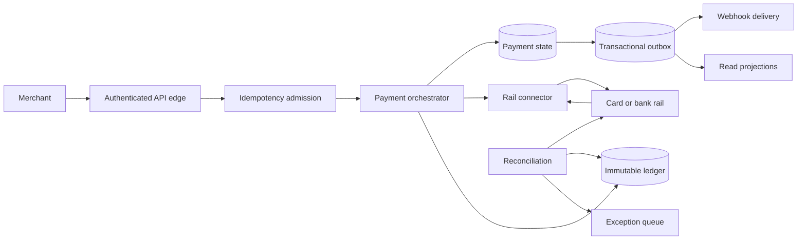

# Stripe: Designing a Correct Payment State Machine

A payment is a long-lived protocol, not one atomic database call. It spans a merchant, Stripe, card or bank rails, asynchronous webhooks, refunds, disputes, and settlement. The core problem is preserving an explainable financial result when any participant can time out after a side effect.

Evidence labels separate public facts from design reconstruction:

- **Documented** means a linked Stripe source states the claim. A date accompanies scale figures and implementation snapshots.
- **Inference** means the conclusion follows from documented behavior or payment-system constraints, but is not presented as Stripe's undisclosed implementation.
- **Reference design** means a concrete architecture suitable for a Stripe-like platform. It is a design exercise, not a claim about Stripe production.

Stripe publishes API semantics, Ledger, DocDB, and migration techniques, but not a complete topology for every payment path.

## Workload and correctness contract

**Documented, API behavior.** Stripe's PaymentIntent lifecycle exposes asynchronous states such as `requires_payment_method`, `requires_action`, `processing`, `requires_capture`, `succeeded`, and `canceled`. This is direct evidence that “charge a card” must be modeled as a durable state machine rather than a request-scoped transaction. [Stripe, PaymentIntent lifecycle](https://docs.stripe.com/payments/paymentintents/lifecycle)

**Documented, 2023 snapshot.** Stripe reported processing USD 1 trillion in total payment volume in 2023. Its DocDB article reported more than five million queries per second over petabytes of financial data, with more than 5,000 collections on more than 2,000 shards. Those figures describe the database platform in that article, not the rate of card authorizations. [Stripe, 2024 DocDB article](https://stripe.dev/blog/how-stripes-document-databases-supported-99.999-uptime-with-zero-downtime-data-migrations)

**Reference-design requirements.** A payment platform should support payment creation and confirmation, additional customer authentication, asynchronous rail updates, capture, cancellation, refunds, disputes, merchant balances, payouts, reconciliation, and signed event delivery. It should prioritize:

1. no duplicate economic effect for one accepted operation;
2. no unbalanced or untraceable money movement;
3. monotonic, legal lifecycle transitions;
4. durable evidence for every externally visible result;
5. recovery from ambiguous provider outcomes;
6. tenant isolation and controlled overload;
7. confidentiality of credentials and payment data.

“Exactly once” is too imprecise for the first requirement. Networks may deliver requests repeatedly, workers may execute repeatedly, and webhooks may be observed repeatedly. The useful guarantee is **one committed business effect per operation identity**, plus replayable responses and deduplicated downstream effects. See [delivery guarantees](../05-messaging/04-delivery-guarantees.md) and [retries and deadlines](../06-scaling/10-retries-timeouts-hedging.md).

## State, authority, and invariants

**Reference design.** Separate four identities that are often accidentally conflated:

| Identity | Purpose | Uniqueness scope |
|---|---|---|
| API operation ID | deduplicates a merchant's intent | merchant account + endpoint + idempotency key |
| payment ID | owns the user-visible lifecycle | platform-wide |
| rail attempt ID | identifies one submission to an external connector | payment + connector attempt |
| ledger transaction ID | identifies one immutable accounting movement | ledger-wide |

The payment state store is authoritative for orchestration state; the external processor is authoritative for its rail result; the ledger is authoritative for the platform's recorded money movement; reconciliation decides whether those views agree. A cache, webhook delivery table, search index, or dashboard projection is never a financial authority.

The minimum invariants are:

### Legal transition invariant

For a payment state `s` and command `c`, there must be at most one legal transition function:

$$
T(s,c) \rightarrow (s', e_1, \ldots, e_n)
$$

The state version changes atomically with the durable facts that describe the transition. A stale worker must fail its compare-and-set rather than move a newer state backward.

### Conservation invariant

For every balanced ledger transaction `t`, grouped by currency and accounting boundary:

$$
\sum_{e \in t} e.amount = 0
$$

Pending, available, reserved, fee, refund, dispute, and external-clearing accounts make lifecycle states explicit; silently overwriting a single “balance” destroys the explanation of how money moved.

**Documented, 2024.** Stripe describes Ledger as an immutable event log that represents producer systems as fund-flow state machines, computes balances, traces transactions across systems, and applies completeness and data-quality checks. The article says transactions already published to Ledger cannot be modified or deleted. [Stripe, Ledger](https://stripe.dev/blog/ledger-stripe-system-for-tracking-and-validating-money-movement)

### Idempotency invariant

For a valid key `k`, request fingerprint `h`, and stored result `r`:

$$
(account, k) \mapsto (h, r)
$$

Reusing `k` with the same fingerprint replays `r`; reusing it with different parameters is rejected. The key does not mean “return any result for this string.”

**Documented, current API reference.** Stripe saves the status code and body of the first request whose endpoint execution begins, including `500` responses; it compares parameters on reuse; and keys may be removed after they are at least 24 hours old. Validation failures and concurrency conflicts before endpoint execution are not cached. [Stripe, idempotent requests](https://docs.stripe.com/api/idempotent_requests)

## Data plane and control plane

**Reference design.** The data plane handles merchant commands and rail callbacks:

The control plane configures merchant entitlements, routing rules, connector health, credentials, limits, schemas, ledger mappings, and rollout policy. It must not be on the synchronous authorization path unless the data plane reads a locally available, versioned snapshot. Otherwise a control-plane outage becomes a global payments outage.

**Documented, 2024.** Stripe's DocDB data path places in-house Go database proxies between product applications and sharded storage. The proxies parse and route queries, combine results, and enforce reliability, admission, and access-control concerns. Chunk metadata maps data chunks to shards. Replica sets provide primary/secondary replication and automated failover. [Stripe, DocDB](https://stripe.dev/blog/how-stripes-document-databases-supported-99.999-uptime-with-zero-downtime-data-migrations)

This does not prove that every PaymentIntent or Ledger record uses DocDB. It establishes a published storage substrate and its scale, not a universal product schema.

## End-to-end payment flow

**Reference design.** A robust synchronous-looking payment command is a sequence of durable phases:

1. Authenticate the merchant and authorize the operation.
2. Reserve `(account, idempotency_key)` and bind it to a canonical request hash.
3. Create or load the payment state machine under optimistic concurrency.
4. Persist the intent to attempt a rail operation before making the external call.
5. Submit an operation identity the provider can deduplicate, where the rail supports it.
6. Record the provider response or mark the attempt `outcome_unknown` on timeout.
7. Commit the legal payment transition and corresponding ledger transaction.
8. Write domain events to an outbox in the same local transaction as the state change.
9. Persist the API result under the idempotency record and return it.
10. Deliver webhooks asynchronously and reconcile the rail independently.

The external call cannot participate in the local database transaction. The durable pre-call attempt record is therefore a recovery point. After a crash, a worker queries the provider by external operation ID or waits for its callback before deciding whether a retry is safe.

### Unknown does not mean failed

**Inference.** If a connector times out after the issuer approved a charge, the platform cannot safely infer failure from the absence of a response. Treating timeout as decline can produce a duplicate charge on an uncoordinated retry; treating it as success can acknowledge money never taken. `outcome_unknown` is a real state requiring query, callback, or reconciliation evidence.

### Webhook delivery is a separate state machine

**Reference design.** A committed payment event has an immutable event ID. Each subscribed endpoint has its own delivery rows, attempt counter, next-attempt time, terminal state, and response evidence. Delivery is at-least-once, so consumers deduplicate by event ID. Retries use exponential backoff with jitter and a finite retention policy; slow endpoints cannot hold payment locks.

Stripe's published webhook guidance requires endpoint signature verification and warns that event ordering is not guaranteed. [Stripe, webhook signatures](https://docs.stripe.com/webhooks/signature), [Stripe, webhook best practices](https://docs.stripe.com/webhooks)

## Partitioning and capacity model

**Reference design.** Partition high-volume operational state by a stable merchant/account identifier when most transactions are account-local. Keep globally unique IDs for lookup through a routing index. A very large tenant may need a dedicated shard or a second-level partition, but splitting one merchant introduces cross-partition balance and rate-limit coordination. See [database sharding](../06-scaling/03-database-sharding.md) and [multi-tenancy](../06-scaling/12-multi-tenancy.md).

Do not shard a double-entry transaction across independent authorities unless the ledger protocol explicitly supports atomic cross-shard posting. A safer design assigns all entries in one ledger transaction to one accounting partition and derives cross-partition settlement through paired, reconcilable transfer records.

### Illustrative sizing—not Stripe production

Assume a reference platform receives 20,000 original payment commands/s at peak. Each original command produces:

- 1.08 API executions after deduplication;
- 4 synchronous state-store operations;
- 2 ledger entries on authorization and 2 more on capture for 70% of payments;
- 1.5 emitted domain events on average.

Then:

$$
state\ ops/s = 20{,}000 \times 1.08 \times 4 = 86{,}400
$$

$$
ledger\ entries/s = 20{,}000 \times (2 + 0.7 \times 2) = 68{,}000
$$

$$
events/s = 20{,}000 \times 1.5 = 30{,}000
$$

If one state shard sustains 3,000 operations/s at the required tail latency and only 60% of benchmark capacity is budgeted for normal operation, the throughput floor is:

$$
N = \left\lceil \frac{86{,}400}{3{,}000 \times 0.60} \right\rceil = 48\ shards
$$

That is only a first bound. Add skew, storage, indexes, replication, failover headroom, migration bandwidth, and regional evacuation. A 48-shard fleet that needs 48 shards to survive ordinary peak has no failure margin.

For webhook capacity, calculate attempts rather than events. If 2% of deliveries need three extra attempts, an event rate `E` and mean endpoints per event `f` yields:

$$
attempts/s = E f (1 + 0.02 \times 3)
$$

This links retry policy directly to queue and egress cost.

## Concrete failure trace: timeout, crash, and duplicate callback

**Reference-design trace.** Consider one payment operation `op-7`:

1. The merchant sends `confirm` with key `k-42`.
2. The platform records rail attempt `a-1`, then sends it to the processor.
3. The processor authorizes the charge, but the response is lost.
4. The connector deadline expires and records `outcome_unknown`.
5. Before responding, the orchestrator crashes. The merchant observes a connection reset.
6. The merchant retries with `k-42`; the idempotency layer attaches it to the existing operation instead of creating `a-2`.
7. A processor callback reports `a-1=authorized`; a recovery query reports the same result.
8. Both workers race to transition the payment. One compare-and-set from version 3 to 4 succeeds; the other observes version 4 and becomes a no-op.
9. The winning transaction posts the balanced ledger movement and outbox event atomically.
10. The webhook worker delivers the event twice because its first acknowledgement is lost. The merchant deduplicates by event ID.

The design tolerates duplicate messages at every boundary while committing one payment transition and one economic effect.

## Multi-region authority and failure policy

**Reference design.** Route a payment to a home region determined by merchant/account or payment ID. Only that region may advance the payment and ledger epoch at a time. Replicate immutable history and read projections outward. A failover controller must issue a higher fencing epoch before another region accepts writes; DNS or health-check routing alone cannot prevent split brain.

For each dependency, specify whether failure causes:

- **fail closed:** authentication, authorization, ledger validation, or ambiguous duplicate protection;
- **queue for later:** webhook delivery, analytics, reconciliation imports;
- **degrade:** non-authoritative dashboards or enrichment;
- **route elsewhere:** a connector only when a routing policy proves that changing rails cannot duplicate an accepted attempt.

Capacity must satisfy static stability: after losing a region, surviving regions handle evacuated load without relying on emergency provisioning. See [multi-region architecture](../06-scaling/09-multi-region-architecture.md), [cell-based architecture](../06-scaling/11-cell-based-architecture.md), and [disaster recovery](../15-deployment/05-disaster-recovery.md).

## Security and abuse boundaries

**Documented, API surface.** Stripe supports restricted API keys, webhook signatures, and idempotency keys, but idempotency is not authorization. Every replay must re-establish tenant scope and endpoint binding. [Stripe, API keys](https://docs.stripe.com/keys)

**Reference design.** Minimize the card-data environment by tokenizing sensitive credentials at a narrowly scoped boundary. Encrypt data in transit and at rest, separate key management from application storage, rotate connector credentials, require dual control for high-risk control-plane changes, and log every privileged read. Never place card numbers, secrets, or raw webhook payloads in unconstrained telemetry.

Rate limits should include merchant, credential, endpoint, and expensive-operation dimensions. A global limiter alone permits a hot tenant to consume shared databases. Per-tenant limiting alone permits a distributed attack across many accounts. The canonical mechanisms are in [rate limiting](../06-scaling/05-rate-limiting.md) and [API security](../10-security/04-api-security.md).

## Observability, reconciliation, and operations

**Reference design.** Track state-machine and financial signals, not just HTTP health:

- payment transitions by previous state, new state, rail, and reason;
- operations stuck in `processing` or `outcome_unknown`, by age;
- idempotency replays, parameter mismatches, and lock contention;
- ledger imbalance, completeness lag, and producer-to-ledger divergence;
- reconciliation unmatched count and value, aged by settlement date;
- webhook queue age, attempt distribution, and endpoint isolation;
- connector success, decline, timeout, and unknown-outcome rates separately;
- database saturation, shard skew, replication lag, and migration debt.

Do not label issuer declines as platform availability failures. Conversely, a superficially successful API response is not success if the ledger or reconciliation path is falling behind. SLOs need separate views for API acceptance, lifecycle completion, and financial correctness. See [SLOs and error budgets](../11-observability/05-slos-error-budgets.md) and [incident management](../11-observability/07-incident-management.md).

Operational exercises should inject a response loss after provider acceptance, duplicate and reordered callbacks, a stale regional writer, a stuck ledger consumer, and a webhook endpoint that never acknowledges. Verification asserts invariants over resulting state, not merely that processes stayed up.

## Evolution without a flag day

**Documented, 2017.** Stripe described a four-phase online migration: dual-write old and new stores, compare read paths, switch reads, switch writes, then remove old data. The published example migrated hundreds of millions of Subscription objects while services remained online, using offline snapshots for discovery and production comparisons to find divergence. [Stripe, online migrations at scale](https://stripe.com/blog/online-migrations)

**Documented, 2024.** Stripe's Data Movement Platform supports client-transparent shard splitting and merging, major database-engine upgrades, and tenancy changes. It uses copy, change capture, validation, and cutover concepts while database proxies hide placement from clients. [Stripe, DocDB](https://stripe.dev/blog/how-stripes-document-databases-supported-99.999-uptime-with-zero-downtime-data-migrations)

**Reference design.** A payment-schema migration should additionally preserve semantic equivalence: replay a historical corpus, shadow-evaluate old and new transition logic, compare ledger postings, block cutover on unexplained divergence, retain rollback reads, and fence old writers before removing compatibility fields. A row-count match is insufficient when two schemas can encode different money meaning.

## What transfers to other systems

The most reusable lessons are not “use Stripe's database” or “make everything strongly consistent.” They are:

1. Make ambiguity a modeled state.
2. Give every externally initiated business operation a stable identity.
3. Commit authoritative state and the event announcing it together.
4. Represent financial movement with immutable, balanced facts.
5. Reconcile independent authorities instead of pretending they share one transaction.
6. Keep control-plane dependencies out of the request path through versioned local snapshots.
7. Measure lifecycle completion and invariants, not only request success.
8. Migrate by coexistence, comparison, and fenced cutover.

These principles apply to inventory reservation, order fulfillment, cloud provisioning, and any workflow where a remote side effect may succeed while its response is lost.

## Primary sources

- [Stripe API: idempotent requests](https://docs.stripe.com/api/idempotent_requests)
- [Stripe: PaymentIntent lifecycle](https://docs.stripe.com/payments/paymentintents/lifecycle)
- [Stripe Engineering: designing APIs with idempotency, 2017](https://stripe.com/blog/idempotency)
- [Stripe Engineering: online migrations at scale, 2017](https://stripe.com/blog/online-migrations)
- [Stripe Engineering: Ledger, 2024](https://stripe.dev/blog/ledger-stripe-system-for-tracking-and-validating-money-movement)
- [Stripe Engineering: DocDB and the Data Movement Platform, 2024](https://stripe.dev/blog/how-stripes-document-databases-supported-99.999-uptime-with-zero-downtime-data-migrations)
- [Stripe documentation: webhook signatures](https://docs.stripe.com/webhooks/signature)
