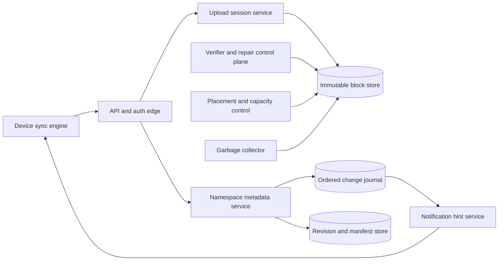

# Dropbox: Convergent File Sync over Immutable Content

A file-sync system must reconcile two very different kinds of state. File bytes are large, mostly immutable, and cheap to identify by content; namespace metadata is small, highly mutable, shared, and ordered by user actions. Treating both as generic “files in object storage” hides the central design problem: how devices converge after offline edits, renames, deletes, partial transfers, and conflicting writes without losing user data.

This chapter uses three evidence labels:

- **Documented**: stated in a linked Dropbox engineering source; scale and topology snapshots are dated.
- **Inference**: derived from public behavior or distributed-sync constraints, not asserted as private Dropbox implementation.
- **Reference design**: an explicit design for a Dropbox-like service where public sources do not specify the production mechanism.

## Workload and service contract

**Documented, 2016 architecture.** Dropbox publicly separates file content from metadata. Magic Pocket stores encrypted, immutable file blocks up to 4 MiB, while changes and revision history live above it in metadata systems such as FileJournal. The 2016 article described multi-zone storage, asynchronous cross-zone replication, cells, a block index, and repair machinery. [Dropbox, Inside the Magic Pocket](https://dropbox.tech/infrastructure/inside-the-magic-pocket)

**Documented, 2026 snapshot.** Dropbox describes Magic Pocket as an exabyte-scale immutable blob store and says nearly all data uses erasure coding. This is a dated storage-platform statement, not a current user count or upload rate. [Dropbox, storage efficiency in Magic Pocket](https://dropbox.tech/infrastructure/improving-storage-efficiency-in-magic-pocket-our-immutable-blob-store)

**Reference-design functional scope.** Support resumable upload and download, automatic multi-device sync, shared folders, revision history, delete/restore, moves and renames, selective local materialization, permissions, and notifications.

The design contract is:

1. an acknowledged content commit remains retrievable under the durability policy;
2. a namespace revision refers only to content that has reached the required durability state;
3. each namespace has one defined ordering/conflict policy;
4. replaying a client operation does not create multiple logical revisions;
5. offline clients can resume from a durable cursor or obtain a consistent snapshot;
6. authorization is checked on metadata and content access independently;
7. background repair cannot make damaged data appear healthy.

Unlike collaborative document editing, general file sync cannot merge arbitrary byte sequences semantically. Preserve both versions on an unresolved concurrent edit rather than inventing a “last writer wins” merge that silently discards data. The CRDT design space is covered in [collaborative editing](../07-real-time/07-crdts-collaborative-editing.md); a filesystem sync engine has different user expectations.

## State, authority, and identifiers

**Reference design.** Separate these records:

| Record | Authority | Key fields |
|---|---|---|
| namespace entry | metadata service | stable entry ID, parent ID, name, current revision, tombstone, version |
| file revision | metadata service | revision ID, ordered block manifest, size, content digest, author, base revision |
| block | content store | block ID or digest, encoded bytes, durability state |
| device cursor | sync service | namespace, device, last applied journal sequence |
| operation receipt | metadata service | device operation ID, request hash, committed result |
| sharing edge | authorization service | principal, resource, role, policy version |

Paths are not stable identities: renaming a parent changes descendant paths without changing each object. A stable entry ID makes rename, move, and ACL evaluation explicit. A tombstone is a versioned namespace fact, not an immediate instruction to erase every physical block.

### Namespace ordering invariant

For one authority domain, committed journal sequence numbers are unique and monotonic:

$$
j_{n+1} > j_n
$$

A client applies changes in sequence order and advances its cursor only after local application is durable. If the journal no longer retains the cursor, the server returns a new snapshot plus a new starting sequence rather than silently skipping history.

### Manifest reachability invariant

For any visible file revision `r` with manifest `M_r`:

$$
\forall b \in M_r:\ durable(b) \lor recoverable(b)
$$

Publishing metadata before blocks satisfy this predicate creates a valid-looking file that cannot be downloaded.

### Conflict invariant

**Reference design.** A mutation includes `base_revision`. If it equals the current revision, commit normally. If it is stale and the operation cannot commute, preserve the current branch and create a conflict revision linked to the common ancestor. Directory creation with distinct names may commute; simultaneous byte replacement generally does not.

## Documented storage components

### Magic Pocket: immutable content

**Documented, 2016.** Magic Pocket's published data model maps a block ID through a block index to a cell and bucket; a replication table maps buckets and volumes to object-storage devices. Frontends are on the live Put/Get path. A per-cell master coordinates placement, repair, and garbage collection but is not on the read data path; authoritative volume state is kept outside the master's soft state. [Dropbox, Inside the Magic Pocket](https://dropbox.tech/infrastructure/inside-the-magic-pocket)

**Documented, 2016 snapshot.** The same article described independently storing each block in at least two US zones and replicating a new local write to a remote zone asynchronously, normally within one second. This is a historical topology, not a claim that the exact regions, timing, or coding policy remains unchanged.

**Documented, 2016.** Dropbox described continuous verification systems—including disk scrubbing and cross-zone checks—because replicas alone cannot detect every latent corruption, incorrect delete, or metadata inconsistency. [Dropbox, Pocket Watch](https://dropbox.tech/infrastructure/pocket-watch)

### Edgestore: general metadata

**Documented, 2016 snapshot.** Dropbox described Edgestore as a metadata service built over MySQL/InnoDB with caching, geo-replication, and multi-tenancy. At publication it stored several trillion entries, served millions of queries per second, and ran across thousands of machines. Those numbers describe Edgestore then; the file namespace may also use specialized metadata systems. [Dropbox, Reintroducing Edgestore](https://dropbox.tech/infrastructure/reintroducing-edgestore)

### Nucleus: deterministic client sync

**Documented, 2020.** Dropbox rewrote its sync engine as Nucleus in Rust. Its control thread is designed to be deterministic when inputs and scheduling decisions are fixed; network, hashing, and filesystem work are delegated while most orchestration remains single-threaded. Dropbox documented millions of generated test scenarios per day and a simulator that can reorder, delay, and fail filesystem and server operations. [Dropbox, rewriting the sync engine](https://dropbox.tech/infrastructure/rewriting-the-heart-of-our-sync-engine), [Dropbox, testing sync](https://dropbox.tech/infrastructure/-testing-our-new-sync-engine)

This supports a broad lesson: reducing nondeterministic interleavings in the orchestrator can be more valuable than maximizing local parallelism.

## Reference architecture

**Reference design.** Public articles describe components at different times, not one complete current diagram. A defensible reconstruction keeps the content and metadata planes separate:

The data plane transfers blocks, commits metadata transactions, lists deltas, and downloads manifests. The control plane assigns storage, repairs failures, rebalances shards, advances garbage-collection watermarks, manages schemas, and rolls out client compatibility policy. Notifications are hints: a dropped hint delays sync, but the durable cursor/journal repairs the gap.

## Upload and commit flow

**Reference design.** A resumable upload proceeds as follows:

1. The client scans the local file from a stable filesystem snapshot or verifies it did not change during hashing.
2. It divides the byte stream into blocks and computes digests. Fixed-size chunks simplify indexing; content-defined chunks may reduce re-upload after insertions but cost more CPU and metadata.
3. The client opens an upload session with a stable operation ID and proposed manifest.
4. The server returns which blocks are already durable and which are missing.
5. Missing blocks upload independently with checksum, length, and session authorization.
6. The content service verifies bytes before marking each block durable enough for publication.
7. The client commits the namespace mutation with entry ID, base revision, manifest, and operation ID.
8. One metadata transaction validates authorization and base revision, creates the file revision, updates the entry, appends the journal record, and stores the operation receipt.
9. Notification workers emit a hint after commit.

Block existence is not proof that the caller may reference or read that block. Cross-user content deduplication can become an existence oracle: an attacker can test whether another user possesses known content by observing upload behavior. A secure design hides dedup hits, scopes authorization to manifests, rate-limits probes, and may deduplicate only within a tenant or encryption domain.

### Download and catch-up

**Reference design.** On notification or periodic poll, a client requests changes after cursor `j`. It applies ordered namespace mutations to a local database, schedules required block fetches, verifies every block digest, atomically materializes a new local file, then advances the durable cursor. A temporary file plus atomic rename prevents applications from seeing a half-written revision.

A notification channel must not carry the only copy of a change. This is the distinction between [pub/sub](../05-messaging/02-pub-sub.md) and a durable [message queue](../05-messaging/01-message-queues.md).

## Partitioning and hotspot control

**Reference design.** Partition metadata by namespace or stable owner, not by full path. This makes most rename and directory mutations local. Shared folders that outgrow one partition require an explicit strategy:

- isolate the shared namespace on a dedicated partition;
- subdivide by stable subtree with a parent routing map;
- keep one ordered commit authority while distributing read projections;
- rate-limit pathological fanout and very wide directory listings.

Content is naturally distributed by block/bucket ID. Placement must spread encoded fragments across independent failure domains and prevent one cell or rack from holding too many fragments needed for reconstruction. Metadata and content have different skew: a celebrity shared folder is a metadata hot key even if its blocks are perfectly balanced.

## Capacity and cost model

### Content traffic—illustrative assumptions

**Reference design.** Suppose a service receives 12 million file revisions per day, the mean changed payload is 6 MiB, and block reuse avoids 35% of uploaded bytes. Average ingress is:

$$
\frac{12 \times 10^6 \times 6\ MiB \times (1-0.35)}{86{,}400} \approx 542\ MiB/s
$$

At a 6× peak factor, provision at least 3.2 GiB/s before protocol, replication, repair, and migration traffic. If the durable encoding overhead is 1.35× and metadata/fragmentation adds another 8%, daily raw growth is:

$$
12 \times 10^6 \times 6\ MiB \times 0.65 \times 1.35 \times 1.08 \approx 66.4\ TiB/day
$$

These values are illustrative, not Dropbox measurements.

### Metadata amplification

If one revision transaction writes an entry, revision, manifest pointer, journal record, operation receipt, and three secondary-index records, one user mutation produces eight logical writes before database replication. Capacity planning based only on “files uploaded per second” misses this amplification.

### Garbage-collection safety

**Reference design.** Physical deletion is safe only after all referencing revisions have expired, legal/retention holds are satisfied, no active upload can still publish the block, and replica lag is behind a deletion watermark. With retention horizon `H`, maximum metadata lag `L`, and maximum upload-session lifetime `U`, a basic lower bound is:

$$
delete\_after \ge \max(H, L, U) + safety\ margin
$$

Reference counting alone is dangerous under lost or reordered metadata updates. Periodic reachability scans and a quarantine interval provide independent evidence.

## Concrete failure trace: offline edit meets rename and retry

**Reference-design trace.** Two devices start from file revision `r10` at `/team/plan.md`.

1. Device A goes offline and edits the bytes.
2. Device B renames the entry to `/team/launch-plan.md` and commits journal record 501.
3. Device B edits the renamed file, creating revision `r11` and record 502.
4. Device A reconnects, uploads its missing blocks, and sends an update for the stable entry ID with base `r10` and operation ID `op-A9`.
5. The server resolves the entry ID despite the path change, but detects that current revision `r11` is not the submitted base.
6. It preserves `r11`, creates a conflict revision for A's bytes, appends one journal event, and records the result under `op-A9`.
7. The response is lost. A retries `op-A9`; the stored receipt replays the same conflict result rather than creating another copy.
8. Both devices consume records 501 onward, apply the rename, and surface the preserved conflict.

Path identity would have misclassified A's update as a new file at the old name. Last-write-wins would have discarded either A's or B's content. Stable identity, base revisions, and idempotent receipts avoid both failures.

## Region failure and disaster recovery

**Documented, 2022.** Dropbox described Magic Pocket as active-active across data centers, while metadata resilience evolved through a separate multi-phase program. In a disaster-readiness exercise, Dropbox deliberately “blackholed” a data center and documented the operational dependencies found during failover. [Dropbox, disaster readiness test](https://dropbox.tech/infrastructure/disaster-readiness-test-failover-blackhole-sjc)

**Inference.** Content availability and namespace write availability therefore require separate RTO/RPO claims. A block may exist in another region while the metadata authority that names it is unavailable; conversely metadata failover is unsafe if it can publish blocks whose remote durability is unproven.

**Reference design.** Give each metadata shard one write authority with fencing epochs. A failover promotes a sufficiently caught-up replica, issues a higher epoch, redirects clients, and rejects stale writers. Content reads may remain multi-homed. Maintain enough regional egress and metadata capacity for evacuation without waiting for autoscaling; see [multi-region architecture](../06-scaling/09-multi-region-architecture.md) and [disaster recovery](../15-deployment/05-disaster-recovery.md).

## Security and privacy

**Reference design.** Use short-lived, capability-scoped block upload/download tokens tied to account, block, operation, and expiry. Check share authorization against a versioned policy at metadata commit and content fetch. Encrypt bytes in transit and at rest, envelope-encrypt storage keys, and isolate key-management authority from block storage.

Client filenames, sharing graphs, device cursors, and access telemetry are sensitive even when content is encrypted. Audit privileged access, minimize log payloads, and separate abuse detection from broad employee access. Malware scanning and previews require an explicit trust boundary; client-side encrypted products cannot transparently reuse a server-side plaintext scanning pipeline.

## Observability and verification

**Reference design.** Operate the convergence contract with:

- cursor lag and clients requiring snapshot reset;
- journal append-to-notification and append-to-apply latency;
- conflicts by operation type and client version;
- manifests referencing missing or under-durable blocks;
- checksum failures, repair backlog, and fragment loss by failure domain;
- upload resume rate and abandoned-session bytes;
- metadata shard skew, wide-directory cost, and hot shared namespaces;
- garbage-collection candidates, quarantined bytes, and false-reachability findings;
- regional replication lag and evacuation capacity;
- client crash loops and sync-stall age distributions.

**Documented, 2020.** Dropbox's Trinity test environment replaces metadata, content, notification, filesystem, and network dependencies with controllable implementations, then reorders, delays, or fails operations. This is stronger than testing a few happy-path fixtures because it explores concurrency schedules and failure boundaries. [Dropbox, testing sync](https://dropbox.tech/infrastructure/-testing-our-new-sync-engine)

Useful invariant tests include: no committed manifest has a missing block; applying the same journal prefix twice is idempotent; two clients that receive the same complete history converge; interrupted materialization never exposes partial bytes; and garbage collection never deletes a reachable block.

## Evolution and migration

**Documented, 2014–2015 snapshot.** Dropbox described dark-launching Magic Pocket by mirroring data across regional locations in August 2014, retaining additional backups, and beginning exclusive in-house file serving in February 2015. [Dropbox, scaling to exabytes](https://dropbox.tech/infrastructure/magic-pocket-infrastructure)

**Documented, 2020.** The Nucleus rewrite had a fundamentally different client data model, so Dropbox invested in deterministic execution, randomized simulation, compatibility testing, and staged rollout rather than replacing the sync engine with one flag-day release. [Dropbox, rewriting the sync engine](https://dropbox.tech/infrastructure/rewriting-the-heart-of-our-sync-engine)

**Reference design.** A storage migration should mirror writes, backfill immutable blocks, verify content independently, shadow reads, compare manifests, canary by account, and retain a rollback source until deletion lag closes. A client-protocol migration must support old cursors and operations across the full client-upgrade tail; mobile clients cannot all be upgraded on demand.

## Transferable lessons

1. Split large immutable content from small mutable metadata.
2. Use stable object identity; treat paths as names that can change.
3. Make the journal durable and notifications disposable.
4. Publish metadata only after referenced bytes meet the durability contract.
5. Preserve conflicts when generic data cannot be merged safely.
6. Verify durability independently of the component that performed replication.
7. Include repair, compaction, migration, and garbage collection in capacity—not just foreground reads and writes.
8. Design client determinism and failure simulation as architecture, not test polish.

## Primary sources

- [Dropbox: Inside the Magic Pocket, 2016](https://dropbox.tech/infrastructure/inside-the-magic-pocket)
- [Dropbox: Pocket Watch—verifying exabytes of data, 2016](https://dropbox.tech/infrastructure/pocket-watch)
- [Dropbox: Reintroducing Edgestore, 2016](https://dropbox.tech/infrastructure/reintroducing-edgestore)
- [Dropbox: Scaling to exabytes and beyond, 2016](https://dropbox.tech/infrastructure/magic-pocket-infrastructure)
- [Dropbox: Rewriting the heart of our sync engine, 2020](https://dropbox.tech/infrastructure/rewriting-the-heart-of-our-sync-engine)
- [Dropbox: Testing sync, 2020](https://dropbox.tech/infrastructure/-testing-our-new-sync-engine)
- [Dropbox: Disaster readiness test, 2022](https://dropbox.tech/infrastructure/disaster-readiness-test-failover-blackhole-sjc)
- [Dropbox: Improving storage efficiency in Magic Pocket, 2026](https://dropbox.tech/infrastructure/improving-storage-efficiency-in-magic-pocket-our-immutable-blob-store)
