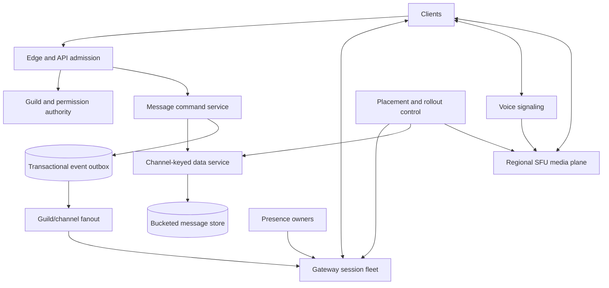

# Discord: Hot-Key Isolation for Text, Presence, and Voice

Discord combines workloads with incompatible physics. Text history is durable and read-heavy around recent channel partitions. Gateway sessions are long-lived, stateful connections with bursty fanout. Presence is ephemeral and high-churn. Voice and video are latency-sensitive UDP media flows. A useful design does not force all four through one scaling primitive.

Evidence labels:

- **Documented**: a linked Discord engineering post or public protocol states the claim; figures and topologies are dated.
- **Inference**: a conclusion drawn from those facts or product constraints, not a statement about undisclosed production internals.
- **Reference design**: a concrete architecture for a Discord-like service where public evidence is incomplete.

## Workload and service contract

**Documented, 2023 storage snapshot.** Discord reported a message dataset in the trillions. At the beginning of 2022, its Cassandra message cluster had 177 nodes; Discord completed its message-store switch to ScyllaDB in May 2022 and later reported 72 ScyllaDB nodes for that workload. These are dated migration figures, not current fleet size or message rate. [Discord, How Discord Stores Trillions of Messages](https://discord.com/blog/how-discord-stores-trillions-of-messages)

**Documented, 2018 voice snapshot.** Discord reported 2.5 million concurrent voice users and described an SFU-based server architecture. Treat that as a 2018 publication snapshot. [Discord, concurrent voice with WebRTC](https://discord.com/blog/how-discord-handles-two-and-half-million-concurrent-voice-users-using-webrtc)

**Reference-design product scope.** Support channel and direct messages, message history, edits and deletes, guild and channel membership, roles and permissions, online presence, typing indicators, durable notifications, voice rooms, video/screen sharing, and reconnect/resume.

The core guarantees differ by plane:

| Plane | Required guarantee | Deliberate non-guarantee |
|---|---|---|
| message command | one committed message per operation ID; stable channel order | global order across channels |
| history | durable, paginable channel history | instantaneous secondary-index freshness |
| gateway | resumable ordered event stream within a session scope | delivery across an unbounded offline period |
| presence/typing | bounded-staleness best effort | durable history |
| voice/video | low-latency forwarding with bounded queues | retransmission of every late media packet |

The danger is applying the strongest guarantee everywhere. Persisting every presence transition like a message is expensive and not useful; treating messages like presence loses user history.

## State, authority, and invariants

**Reference design.** Define ownership before choosing databases:

- a **channel authority** serializes message commits and allocates monotonic message IDs within a channel;
- a **guild authority** owns roles, membership, channel structure, and the permission-policy version;
- a **gateway session authority** owns connection sequence, subscriptions, and resume lease;
- a **presence owner** holds soft state with expiry;
- a **voice-room authority** owns participant and stream-control state, while the SFU forwards media;
- the durable message store owns committed message bodies and tombstones.

### Message ordering invariant

For committed messages `m_i` and `m_j` in one channel:

$$
commit(m_i) < commit(m_j) \Rightarrow id(m_i) < id(m_j)
$$

Chronologically sortable IDs are useful, but a timestamp embedded in an ID is not by itself a serialization protocol. Concurrent writers need one channel owner, a sequencer, or a storage compare-and-set that establishes the order.

### Permission invariant

A message or administrative mutation is authorized against a specific guild policy version. Fanout workers may cache compiled permissions, but stale cache entries cannot become the authority. Revocation-sensitive actions revalidate when their cached version is older than the current policy epoch. See [authorization patterns](../10-security/07-authorization-patterns.md).

### Gateway resume invariant

A session event has sequence `s`. A client acknowledges the largest contiguous applied prefix, not simply the largest number seen. Resume is valid only while the server retains all events after that prefix and the session lease is live. Otherwise the client performs a fresh state sync.

### Queue bound invariant

Every connection, channel actor, database partition, and SFU subscriber has a byte- or work-bounded queue. When a consumer falls behind, the system coalesces replaceable state, sheds low-value events, or disconnects it. An unbounded mailbox converts a slow client into a process-wide outage. The canonical mechanisms are in [backpressure](../06-scaling/07-backpressure.md).

## Publicly documented architecture fragments

### Gateway and guild sharding

**Documented, current developer protocol.** Discord's Gateway uses secure WebSocket connections, sequence numbers, heartbeats, resume, and guild-based bot sharding. The public bot formula assigns `guild_id` to a shard, and the API limits concurrent session identification to prevent reconnect floods. This documents the external protocol, not necessarily the exact internal user-gateway partitioner. [Discord Gateway documentation](https://docs.discord.com/developers/events/gateway)

**Documented, 2024.** Discord described its client gateway as the stream for real-time updates and reported reducing WebSocket traffic by 40% through protocol and session changes, including passive sessions that receive less guild traffic until activated. [Discord, reducing WebSocket traffic](https://discord.com/blog/how-discord-reduced-websocket-traffic-by-40-percent)

### Message storage and the data-service shield

**Documented, 2023.** Discord's Cassandra schema partitioned messages by `(channel_id, time_bucket)` and sorted them by chronologically sortable Snowflake IDs. Hot channels created hot partitions; quorum reads meant one overloaded replica could raise latency for other traffic. Cassandra compaction and garbage-collection pauses added operational toil. [Discord, trillions of messages](https://discord.com/blog/how-discord-stores-trillions-of-messages)

**Documented, 2023.** Discord inserted Rust data services between its API and the databases. These services exposed narrow gRPC query operations, bounded concurrency, coalesced identical concurrent reads, and used consistent-hash routing by channel ID so requests for the same row reached the same coalescing owner. It then migrated messages to ScyllaDB with a dual-write path, shadow validation, and staged cutover. [Discord, trillions of messages](https://discord.com/blog/how-discord-stores-trillions-of-messages)

**Documented, 2023 measured comparison.** In that article, historical-message fetch p99 moved from a reported 40–125 ms on Cassandra to 15 ms on ScyllaDB; insert p99 moved from 5–70 ms to about 5 ms. These values describe Discord's measured migration result in 2022, not universal database benchmarks.

### Voice signaling and media

**Documented, 2018.** Discord described three major voice components: Gateway, Guilds, and Voice. A guild was assigned to a voice server using health/load information in service discovery. The voice server combined signaling with a C++ selective forwarding unit (SFU); clients sent media to the server instead of peer-to-peer, and the SFU forwarded selected streams. [Discord, concurrent voice with WebRTC](https://discord.com/blog/how-discord-handles-two-and-half-million-concurrent-voice-users-using-webrtc)

**Documented, 2026 evolution.** Discord reported moving more than 80% of voice/video traffic to Cloudflare's edge at publication, described a newer Rust SFU, and explicitly separated stateful call control from the packet-forwarding media plane. It also described an incident where peak-period latency required packet-level probes and traffic rollback. This is a June 2026 snapshot. [Discord, moving voice to the edge](https://discord.com/blog/how-we-moved-discord-voice-to-the-edge)

## Reference architecture

**Reference design.** The published fragments support this logical separation, but the diagram is not claimed as Discord's complete production topology:

The message command path is the durable data plane. Gateway fanout is a derived delivery plane. Voice signaling is stateful control for a call; UDP forwarding is its high-rate media data plane. Fleet placement, shard maps, rollout policy, and session-start budgets belong to a separate control plane whose last known-good snapshot remains locally usable.

## Text-message flow

**Reference design.** A message send should follow this sequence:

1. Authenticate the session and admit by user, guild, channel, and cost.
2. Resolve the guild policy version and authorize `send_message`.
3. Route by channel ID to one command owner or storage partition.
4. Deduplicate the client operation ID within the channel/account scope.
5. Allocate the next channel-ordering token and commit message, attachment references, and event-outbox row atomically.
6. Return the committed message ID; do not wait for every recipient gateway.
7. Fanout workers resolve active subscriptions and enqueue the event to gateway sessions.
8. Slow sessions coalesce replaceable events or are disconnected with a resumable sequence.
9. Search, moderation, analytics, and notifications consume the durable event asynchronously.

Fanout-on-write to every user inbox is poor for large guild channels: one message creates work proportional to membership even though many members are offline or not viewing the channel. Channel-log storage plus fanout to currently subscribed sessions bounds foreground work by active interest; push notification policy can run separately.

## Hot-key containment

One celebrity channel can dominate history reads immediately after an announcement. Adding database replicas does not remove a single-partition concurrency spike.

**Documented, 2023.** Discord's data-service layer coalesced identical reads and consistently routed a channel to the same service instance, reducing duplicate database work. The article also notes that upstream protection did not eliminate every hotspot. [Discord, trillions of messages](https://discord.com/blog/how-discord-stores-trillions-of-messages)

**Reference design.** Combine:

- time buckets to bound partition size;
- byte- and request-bounded concurrency per channel;
- single-flight coalescing for identical history pages;
- short-lived caches for immutable history pages;
- fair queues so one channel cannot consume all database permits;
- overload responses before queues exceed the latency budget;
- isolated shards or cells for persistently dominant guilds.

Time buckets trade write simplicity for boundary reads. A history request that crosses buckets issues a bounded parallel query and merges by message ID. Bucket width should follow bytes and access skew, not an arbitrary number of days.

## Voice and video flow

**Reference design.** A client joins a room through authenticated signaling. The room authority selects an SFU region/host, establishes a call epoch, and returns short-lived media credentials. Publishers send one encoded stream per selected simulcast/SVC layer set. The SFU forwards appropriate layers to subscribers based on bandwidth feedback and active-speaker policy; it does not decode and re-encode every stream.

For `p` publishers and `n` participants, a mesh may require each publisher to send `O(n)` copies. An SFU keeps publisher uplink near `O(1)` streams but server egress remains related to receivers:

$$
egress \approx \sum_{receiver\ r}\sum_{selected\ streams\ s} bitrate(r,s)
$$

Media queues must be latency-bounded. When congestion rises, drop expired video frames, choose a lower layer, or suppress video; do not build seconds of media backlog. Audio typically receives priority because delayed audio is more harmful and consumes less bandwidth.

## Capacity model

### Gateway memory—illustrative assumptions

**Reference design.** Assume 8 million concurrent sessions, 28 KiB of measured application state per session, and 12 KiB of transport/runtime overhead. Base memory is:

$$
8 \times 10^6 \times 40\ KiB \approx 305\ GiB
$$

At 45,000 sessions per gateway process and a 60% normal-load target:

$$
processes = \left\lceil \frac{8{,}000{,}000}{45{,}000 \times 0.60} \right\rceil = 297
$$

This excludes kernel socket memory, compression dictionaries, guild caches, queues, replicas, deployment surge, and region evacuation. Benchmark with realistic subscription skew; average connections per host is not enough.

### Text amplification—illustrative assumptions

At 250,000 committed messages/s, 1.4 storage mutations per message, replication factor 3, and a mean 18 actively subscribed gateway deliveries per message:

$$
storage\ replica\ writes/s = 250{,}000 \times 1.4 \times 3 = 1.05\ million
$$

$$
gateway\ deliveries/s = 250{,}000 \times 18 = 4.5\ million
$$

If an announcement raises active fanout to 50, the gateway plane—not the database command rate—becomes the likely bottleneck. All numbers are illustrative, not Discord scale claims.

### SFU egress—illustrative assumptions

A room with 20 participants, 4 simultaneous video publishers, and an average selected bitrate of 1.2 Mbit/s per publisher-receiver pair needs roughly:

$$
20 \times 4 \times 1.2 = 96\ Mbit/s
$$

before protocol overhead and retransmission. Capacity allocation must use measured regional egress, packet rate, CPU, NIC interrupts, and loss—not participant count alone.

## Concrete failure trace: announcement hotspot

**Reference-design trace.** A large guild posts an announcement mentioning all members:

1. The message commits once to the channel partition and an outbox event is durable.
2. Hundreds of thousands of clients open the channel and request the same newest history page.
3. Consistent routing sends those reads to one data-service owner. Single-flight collapses them to a small number of database reads.
4. The owner reaches its per-channel concurrency budget. Later unique page reads queue only within a byte/age bound; excess work is rejected for retry.
5. Gateway fanout surges. Active sessions receive the message; passive or slow sessions receive a lightweight invalidation or are told to resync rather than accumulating full guild state.
6. A gateway host fails during the burst. Clients reconnect with jitter and resume sequence. A global session-start budget prevents the reconnect wave from overwhelming authentication and guild state.
7. Search indexing falls behind, but message commit and history remain available because indexing is an asynchronous projection.

Without coalescing, the database sees a cache stampede. Without per-key concurrency, one channel raises cluster-wide latency. Without reconnect admission, a host failure becomes a fleet-wide failure.

## Multi-region and failure authority

**Inference.** Gateway sessions and media should terminate near users, but low latency does not grant every edge location authority to mutate durable guild/message state. Edge placement and write authority are separate decisions.

**Reference design.** Assign each guild/channel a home write cell with a fencing epoch. Gateways route commands to that cell while serving session traffic regionally. Replicate immutable message history for reads where justified. On cell loss, promote only a sufficiently caught-up replica, publish a higher epoch, and reject stale owners. Voice rooms can be reassigned to a new SFU after failure; clients rejoin using a new call epoch so packets from an abandoned SFU cannot affect the new room.

Provision static regional headroom for reconnect and call replacement. Autoscaling that completes after all sessions reconnect is not a recovery plan. See [multi-region architecture](../06-scaling/09-multi-region-architecture.md), [cell-based architecture](../06-scaling/11-cell-based-architecture.md), and [DNS and connection management](../06-scaling/13-dns-and-connection-management.md).

## Security, privacy, and abuse

**Reference design.** Authenticate HTTP, Gateway, and voice-media credentials separately; bind each short-lived token to user, session, guild/room, permissions, and epoch. Check attachment references so knowing an object URL is not sufficient authorization. Rate-limit high-amplification operations—mentions, member enumeration, presence subscription, history scans—by cost rather than request count alone.

Moderation and abuse systems need access to authorized content, but access should be purpose-limited, audited, and separated from ordinary operations. Presence and social graphs are sensitive metadata. Logs should store identifiers and bounded diagnostic fields, not indiscriminate message or media payloads.

**Documented, 2026.** Discord reported completing end-to-end encryption for voice and video calls outside stage channels in March 2026. That security property is newer than the 2018 media article and should not be back-projected onto the old design. [Discord, voice and video E2EE](https://discord.com/blog/every-voice-and-video-call-on-discord-is-now-end-to-end-encrypted)

## Observability and verification

**Reference design.** Measure each plane on its own success criteria:

- message commit latency, dedup replays, illegal transition attempts, and channel skew;
- history p50/p99 by bucket age, partition, and coalescing ratio;
- gateway event lag, queue bytes/age, resume success, reconnect reason, and session-start budget;
- presence expiry lag and fanout suppression;
- SFU join time, round-trip time, loss, jitter, concealment, bitrate, layer switches, and regional egress;
- permission-cache version age and denied-after-revocation latency;
- migration divergence and dual-write lag;
- goodput under overload, not only accepted requests.

Verification should replay duplicate and reordered message commands, disconnect gateways mid-event, expire resume buffers, inject a hot channel, remove a database replica during quorum reads, and impair one voice region. Assert bounded queues, per-channel ordering, no unauthorized delivery, convergence after resume, and no cross-cell stale writes.

## Evolution and migration

**Documented, 2023.** Discord did not treat its Cassandra-to-ScyllaDB migration as an engine swap. It first introduced data services, validated ScyllaDB behavior including reverse queries, performed dual writes, used a data migrator and validator, shadowed traffic, then cut reads over. This reduced migration risk and left a stable query boundary for future storage changes. [Discord, trillions of messages](https://discord.com/blog/how-discord-stores-trillions-of-messages)

**Documented, 2024 and 2026.** Gateway compression/session changes and voice-edge migration were rolled out incrementally and observed by region/client. The 2026 voice article describes shifting traffic away when European latency regressed, then diagnosing host/network interaction before resuming. [Discord, WebSocket traffic](https://discord.com/blog/how-discord-reduced-websocket-traffic-by-40-percent), [Discord, voice edge](https://discord.com/blog/how-we-moved-discord-voice-to-the-edge)

The reusable migration pattern is: create a narrow stable boundary, shadow real traffic, compare semantic results, canary by isolation domain, preserve rapid routing rollback, and remove the old path only after long-tail clients and background work have drained.

## Transferable lessons

1. Partition guarantees by workload: durable log, session stream, soft state, and media packets are not the same data type.
2. Route identical hot-key work to one coalescing owner before the database.
3. Bound concurrency per key, not only per process.
4. Treat fanout and reconnect amplification as first-class capacity dimensions.
5. Separate stateful call control from high-rate media forwarding.
6. Make resume a retained-prefix contract with an explicit fallback to full sync.
7. Put stable service boundaries around storage so migrations can be shadowed and reversed.

## Primary sources

- [Discord Gateway documentation](https://docs.discord.com/developers/events/gateway)
- [Discord: How Discord Stores Trillions of Messages, 2023](https://discord.com/blog/how-discord-stores-trillions-of-messages)
- [Discord: concurrent voice using WebRTC, 2018](https://discord.com/blog/how-discord-handles-two-and-half-million-concurrent-voice-users-using-webrtc)
- [Discord: reducing WebSocket traffic, 2024](https://discord.com/blog/how-discord-reduced-websocket-traffic-by-40-percent)
- [Discord: moving voice to the edge, 2026](https://discord.com/blog/how-we-moved-discord-voice-to-the-edge)
- [Discord: voice and video E2EE, 2026](https://discord.com/blog/every-voice-and-video-call-on-discord-is-now-end-to-end-encrypted)
