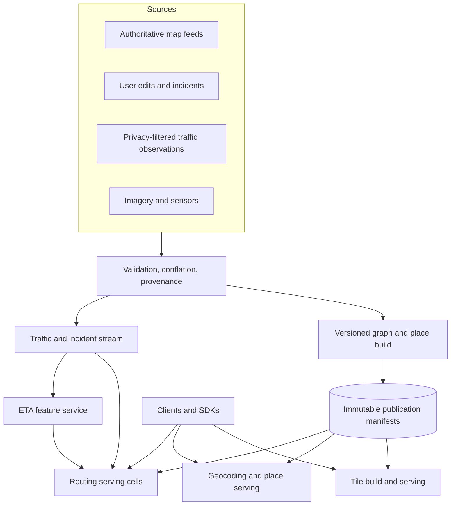

# Google Maps: Versioned Geospatial Data, Tiles, Routing, and ETA

A global map is not one database with a spatial index. It is a family of products built from a changing world model: viewport rendering, place lookup, geocoding, road snapping, route search, traffic-aware ETA, incident updates, and turn-by-turn navigation. Each path has different freshness, latency, correctness, and privacy constraints.

Public sources describe Google Maps interfaces and selected algorithms, but not a complete current production topology. Evidence labels:

- **Documented**: stated in a linked Google/Google DeepMind source or primary paper; figures and capabilities are dated.
- **Inference**: follows from documented behavior or geospatial constraints but is not a Google production claim.
- **Reference design**: an implementable design for a Maps-like platform, not a reconstruction presented as fact.

## Product surfaces and contracts

**Documented, current API behavior.** Google Maps Platform exposes map tiles, geocoding, places, routes, route matrices, and navigation SDKs. The Routes API can return traffic-aware duration separately from static duration and can explicitly report fallback information when the requested computation is unavailable. [Google Maps Platform documentation](https://developers.google.com/maps/documentation), [Routes API route-matrix response](https://developers.google.com/maps/documentation/routes/reference/rest/v2/TopLevel/computeRouteMatrix)

**Documented, 2020 snapshot.** Google reported that more than one billion kilometers were driven with Google Maps each day across more than 220 countries and territories. That dated product figure is useful for understanding geographic diversity, not for deriving current server QPS. [Google Maps, traffic and routing](https://blog.google/products-and-platforms/products/maps/google-maps-101-how-ai-helps-predict-traffic-and-determine-routes/)

**Reference-design requirements.** A design should provide:

- a map viewport at a chosen zoom, language, region, and style;
- forward/reverse geocoding and place search;
- routes for different modes and constraints;
- traffic-aware ETAs and safe rerouting;
- ingestion of authoritative road/place changes and time-sensitive incidents;
- reproducible versions for debugging, rollback, and legal/audit needs;
- graceful fallback when live traffic, imagery, or advanced routing is unavailable.

The core invariants are:

1. every response is derived from a coherent version set, even if different datasets refresh at different rates;
2. route edges form a connected, legally traversable path for the requested mode and policy;
3. an ETA names the route and traffic/model versions it evaluates;
4. stale live data never silently masquerades as current data;
5. untrusted reports cannot directly mutate the authoritative road graph;
6. location telemetry is minimized, aggregated, retained, and accessed under explicit policy;
7. a bad regional publication can be rolled back without rebuilding the whole world.

## State, authority, and version composition

**Reference design.** Model the world as separate versioned datasets:

| Dataset | Authority | Update character |
|---|---|---|
| base geometry | curated map pipeline | slower, structural |
| road graph and restrictions | graph publication pipeline | structural plus scheduled rules |
| places and addresses | place authority with provenance | frequent independent edits |
| cartographic style | style control plane | versioned configuration |
| traffic observations | privacy-filtered stream | seconds/minutes, expires |
| incidents and closures | fused authoritative/user signals | urgent, confidence evolves |
| ETA model and features | ML release system | versioned model + schema |

A response carries a version vector rather than pretending one global transaction updated everything:

$$
V = (v_{graph}, v_{places}, v_{style}, v_{traffic}, v_{incident}, v_{model})
$$

Compatibility rules define which combinations are legal. For example, a traffic edge identifier must resolve in the selected graph version; a model must accept the selected feature schema; a tile style must understand the tile schema. A publication manifest atomically changes the set of compatible versions visible to one serving cell.

### Road graph invariant

For route `P = (e_1, \ldots, e_n)`:

$$
head(e_i) = tail(e_{i+1})
$$

and every edge must satisfy mode, direction, turn, time-window, vehicle, and policy constraints at the planned traversal time. A geometrically connected polyline is not necessarily a legal route.

### Freshness invariant

Each dynamic datum includes event time, processing time, expiry, confidence, and source class. If current time exceeds its expiry, routing falls back to historical/static cost and marks the live component unavailable. “Last updated” without expiry semantics is insufficient.

## Documented spatial and routing foundations

### Tile coordinates and level of detail

**Documented, Maps JavaScript API as of July 2026.** Google Maps uses WGS84 latitude/longitude, Mercator world coordinates, pixel coordinates, and tile coordinates. At zoom zero the base world is one 256×256-pixel tile; pixel dimensions double in each axis per zoom, so the number of logical tiles grows as `4^z`. The client computes only the tiles intersecting its viewport. [Google, map and tile coordinates](https://developers.google.com/maps/documentation/javascript/coordinates)

The existence of `4^z` possible coordinates does not mean all tiles are materialized. Sparse coverage, on-demand generation, versioned bundles, and caches avoid a physical “trillion-row table” interpretation at high zoom.

### S2 as a reference building block

**Documented, open-source library.** Google's S2 Geometry represents data on a sphere, supplies a hierarchy of cells, can cover arbitrary regions with cell sets, and provides robust spatial predicates and indexes. [S2 Geometry overview](https://s2geometry.io/about/overview.html), [S2 cell hierarchy](https://s2geometry.io/devguide/s2cell_hierarchy)

**Evidence boundary.** S2 is a credible component for a Maps-like spatial index, but these library documents do not prove that every Google Maps production subsystem uses S2. This chapter uses S2 cells only in the reference design.

### Traffic and ETA

**Documented, 2020.** Google described combining aggregate live location data, historical traffic patterns, authoritative government data, and user incident reports for traffic and routing. Route selection also considers road characteristics and predicted conditions ahead, not only present speed. [Google Maps, traffic and routing](https://blog.google/products-and-platforms/products/maps/google-maps-101-how-ai-helps-predict-traffic-and-determine-routes/)

**Documented, 2020 system snapshot.** Google DeepMind described a production ETA pipeline that builds road “supersegments” from traffic information and uses a graph neural network to predict their travel times. The article reported up to 50% reductions in ETA inaccuracy in selected cities and said Google Maps' predictive ETAs were accurate for more than 97% of trips at that time. These are publication-specific evaluation claims, not timeless global SLOs. [Google DeepMind, traffic prediction with GNNs](https://deepmind.google/blog/traffic-prediction-with-advanced-graph-neural-networks/)

**Documented, primary paper, 2021.** The associated paper states that the graph-network ETA estimator was deployed in production at Google Maps. [Derrow-Pinion et al., ETA Prediction with Graph Neural Networks](https://arxiv.org/abs/2108.11482)

### Public-transit routing

**Documented, primary paper, 2010.** Google researchers described transfer patterns: precompute common station-transfer sequences, then answer multi-criteria public-transit queries over large networks quickly. The paper reports use in Google Maps and experiments on networks up to half a billion arcs. This supports transit routing specifically; it is not evidence that road routing uses the same algorithm. [Bast et al., Transfer Patterns](https://research.google/pubs/fast-routing-in-very-large-public-transportation-networks-using-transfer-patterns/)

## Reference architecture

**Reference design.** Separate offline/streaming publication from online query serving:

The data plane serves tile, place, geocode, route, and navigation requests. The publication control plane validates source changes, builds indexes, trains/evaluates models, produces signed manifests, rolls versions through cells, and can stop or roll back a release. Live traffic is a streaming data plane with its own expiry and quality controls—not an administrative configuration plane.

## Map-tile path

**Reference design.** For a viewport request:

1. The client converts bounds to tile coordinates at zoom `z` and requests only intersecting tiles.
2. The request key includes tile coordinate, map-data version, style version, language/region policy, layer set, and format.
3. An edge cache serves immutable versioned tiles. A miss goes to a regional tile service.
4. The service retrieves a prebuilt vector bundle or queries a spatial feature index, clips geometry with a buffer, simplifies it for the zoom, applies visibility policy, and encodes the tile.
5. The client verifies response integrity, renders vectors, and prefetches a bounded ring in the direction of motion.

Versioned URLs allow long cache lifetimes. Publishing a new manifest changes which version new sessions request; old cached objects remain valid for in-flight sessions. This avoids global cache invalidation. The canonical design is in [CDN architecture](../06-scaling/04-cdn-architecture.md) and [cache invalidation](../04-caching/02-cache-invalidation.md).

### Tile-boundary correctness

Features crossing tile edges must be clipped consistently and rendered with buffer overlap, or roads and labels flicker at seams. Label placement may need a higher-level metatile or deterministic ownership rule so adjacent tiles do not duplicate a label.

## Geocoding and place search

**Reference design.** Normalize a query using locale-aware tokenization, but retain the raw form for audit and learning. Generate candidates from address components, place names, aliases, categories, and spatial proximity; rank them using text match, geographic context, prominence, freshness, and user-safe personalization. Return stable place IDs and structured ambiguity rather than forcing a low-confidence single answer.

**Documented, current Routes API.** Google recommends Place IDs for routing because raw coordinates may snap to a nearby road that is not a valid access point, while address strings require geocoding first. [Google, route waypoint locations](https://developers.google.com/maps/documentation/routes/specify_location-rm)

**Inference.** Place identity and map geometry therefore need separate lifecycles. A business can move or have multiple entrances without becoming an entirely unrelated text document; an entrance can be routable for pedestrians but not cars.

The canonical search mechanics are covered in [inverted indexes](../14-search-systems/01-inverted-indexes.md), [ranking](../14-search-systems/04-ranking-algorithms.md), and [typeahead](../14-search-systems/06-typeahead-autocomplete.md).

## Route and ETA flow

**Reference design.** A traffic-aware route request proceeds as follows:

1. Resolve origin, destination, and waypoints to candidate access nodes rather than merely nearest geometry.
2. Select a graph publication and restrictions valid for departure time and travel mode.
3. Generate a bounded set of candidate corridors using a precomputed routing hierarchy or small-subgraph extractor.
4. Overlay live incidents and traffic features that have not expired.
5. Compute path costs over candidates, including turn restrictions, toll/ferry policy, and time-dependent traversal.
6. Predict ETA for complete candidates with a model version compatible with the graph/features.
7. Rank candidates by the declared objective; preserve meaningful alternatives rather than tiny variations.
8. Return route geometry, instructions, static duration, traffic-aware duration, provenance/freshness metadata, and fallback status.
9. During navigation, map-match location observations and reroute only when expected benefit exceeds churn and safety costs.

Shortest path and best route are different. A route objective may combine expected travel time, uncertainty, road suitability, closures, toll preferences, walking distance, transfer count, fuel/energy, and safety constraints. The weights are product policy and must be versioned.

## Partitioning and locality

**Reference design.** Use multiple partition spaces:

- tile coordinate and version for rendering objects;
- hierarchical spherical cells for nearby places and spatial joins;
- graph regions with boundary overlays for routing;
- place ID for entity authority;
- road/supersegment ID and time bucket for traffic features.

No one partitioning scheme is optimal for all queries. Graph partitioning minimizes cross-region edges; spatial cells support containment/proximity; tiles match viewport delivery. Maintain translation tables and version compatibility rather than forcing all identities into tile keys.

Routing across partitions can use a hierarchy: local access graph, regional boundary graph, long-distance backbone, then destination-region expansion. A partition must include a halo of neighboring geometry so queries near boundaries do not fail or produce discontinuities.

## Capacity and cost model

### Viewport amplification—illustrative assumptions

**Reference design.** Assume 1.5 million active map sessions at peak. Each session requests 10 visible/prefetch tiles on initial view and then 1.2 tiles/s while moving. If 20% initialize in any given second:

$$
tile\ requests/s = 1.5M \times (0.2 \times 10 + 1.2) = 4.8M
$$

At a 96% edge-cache hit rate, origin load is:

$$
4.8M \times 0.04 = 192{,}000\ requests/s
$$

Improving hit rate from 96% to 97% reduces origin requests by 48,000/s. Cache keys must not fragment unnecessarily by parameters that do not affect bytes, but omitting language, policy, or style inputs can return incorrect tiles.

### Routing compute—illustrative assumptions

Suppose 80,000 route requests/s, 2.4 candidates/request, and 3.5 ms CPU/candidate after precomputation:

$$
CPU\ cores_{raw} = 80{,}000 \times 2.4 \times 0.0035 = 672
$$

At 55% target utilization, the CPU floor is about 1,222 cores before geocoding, feature fetch, model inference, serialization, redundancy, or failure headroom.

Route matrices amplify as `origins × destinations`. A 25-by-25 request means 625 route elements. Public Google documentation, checked in July 2026, limits non-transit route-matrix items to 625 and traffic-aware-optimal requests to 100, illustrating why cost-based admission is necessary. [Google, route matrix limits](https://developers.google.com/maps/documentation/javascript/routes/get-a-route-matrix)

### Traffic state—illustrative assumptions

At 60 million accepted segment observations/minute, 48 bytes after aggregation, and replication factor 3:

$$
ingress \approx \frac{60M \times 48 \times 3}{60} = 144\ MB/s
$$

The raw-event rate may be much higher; privacy aggregation and retention dominate both design and cost. These figures are illustrative, not Google measurements.

## Failure trace: poisoned closure and mixed versions

**Reference-design trace.** A source incorrectly marks a major bridge closed:

1. The ingestion pipeline receives the change with source identity and event time.
2. Validation detects that it conflicts with authoritative road data but not with a burst of user reports; confidence remains below automatic-publication threshold.
3. The incident is shadow-applied to a canary cell. Route diffs show a sudden regional detour and ETA increase beyond expected bounds.
4. The release controller blocks global publication and sends the case to review.
5. Meanwhile an unrelated graph version `g+1` rolls out. Traffic features keyed to `g` are translated only through an approved compatibility map; unmatched edges fall back to historical cost.
6. One cell accidentally loads `g+1` with an incompatible ETA feature schema. Startup validation rejects the manifest, and routing stays on the last known-good bundle.
7. Operators remove the false incident; append-only provenance preserves who supplied it, what validation occurred, and which canary queries changed.

Without confidence gates, one false report can redirect a city. Without version manifests, the service can combine new graph IDs with old traffic/model features and produce plausible but wrong ETAs.

## Failure trace: traffic stream outage

**Reference design.** When live traffic processing stops, route serving should not block behind an ever-growing consumer backlog. Mark the watermark stale, stop presenting values as live, use historical/static duration, expose fallback metadata, and shed expensive optimal-traffic computations. On recovery, process only data that remains useful; expired observations are not worth replaying ahead of current traffic. This is a [backpressure](../06-scaling/07-backpressure.md) and freshness-policy problem, not merely a Kafka lag alert.

## Multi-region design

**Reference design.** Replicate immutable map bundles and models to independent regional cells, then direct queries to a nearby cell. A cell activates a bundle only after hashes, schema compatibility, graph connectivity samples, and model-feature contracts pass. Region-specific legal/cartographic policy is an explicit manifest dimension.

Live traffic has a short useful life. Replicate aggregated regional features to the cells that serve that area; losing one ingest region may cause a visible freshness downgrade without preventing static routing. The publication authority should be strongly fenced, while immutable read serving can be active-active. Keep enough compute and cached data for regional evacuation; see [multi-region architecture](../06-scaling/09-multi-region-architecture.md).

## Privacy, security, and abuse

**Documented, 2020 high-level description.** Google stated that aggregate location data from navigation can be used to understand traffic. The public article describes the aggregate use but not a full retention or anonymization protocol. [Google Maps, traffic and routing](https://blog.google/products-and-platforms/products/maps/google-maps-101-how-ai-helps-predict-traffic-and-determine-routes/)

**Reference design.** Separate account identity from traffic aggregation as early as possible; use coarse time/space aggregation, minimum cohort thresholds, bounded retention, access auditing, and privacy review for new features. Do not log exact origin/destination pairs in general-purpose traces. Protect API keys with application restrictions, enforce per-project quotas, sign privileged map publications, and treat user edits and incident reports as adversarial input.

Threats include location stalking, scraping place inventories, fake closures, malicious map edits, API-key theft, and route manipulation. Abuse defenses must avoid making low-volume rural areas permanently invisible; privacy thresholds and coverage quality need joint evaluation.

## Observability and validation

**Reference design.** Operate semantic quality alongside service health:

- tile cache hit rate by version/style/region, origin render time, missing layers, and seam errors;
- geocoder ambiguity, no-result rate, correction rate, and locale bias;
- route search expansion, candidate count, fallback rate, illegal-edge findings, and route churn;
- ETA residual by horizon, region, mode, road class, and traffic regime;
- traffic event-time watermark, expired-feature fraction, and sensor/source disagreement;
- publication age, canary diff size, validation failures, and rollback time;
- graph connectivity, turn-restriction consistency, and orphan place entrances;
- privacy-budget/threshold outcomes and privileged data access.

An ETA average can hide systematic harm. Track quantiles and calibration: among routes predicted to take 20 minutes, how often do they actually fall in the declared uncertainty interval? Monitor map freshness separately from latency; a 20 ms response built from a month-old closure is not healthy.

Verification should include golden geographic fixtures, property tests around the antimeridian/poles, graph reachability checks, adversarial source edits, version-skew startup tests, replay of historic traffic days, and regional publication rollback. Online experiments need safety guardrails: route quality cannot be judged only by click-through or reroute acceptance.

## Evolution and migration

**Reference design.** Evolve immutable bundles rather than mutating a world database in place:

1. build graph/tile/place version `n+1` beside `n`;
2. validate topology, schemas, source provenance, and size deltas offline;
3. shadow representative queries and compare routes, ETAs, and tiles;
4. canary by serving cell and geography;
5. publish a signed manifest atomically;
6. retain `n` for rollback and in-flight navigation sessions;
7. garbage-collect old bundles only after client/session and audit retention windows close.

For model changes, pin feature schema, preprocessing code, graph version range, and model artifact together. Shadow evaluation should include route ranking changes, not only lower ETA error on the already selected route; changing the predictor changes user behavior and therefore future training data. See [model deployment](../16-ml-systems/06-model-deployment-rollouts.md), [monitoring](../16-ml-systems/04-model-monitoring.md), and [dataset versioning](../16-ml-systems/11-dataset-management-versioning.md).

## Transferable lessons

1. One “map version” is really a compatibility contract across several independently refreshed datasets.
2. Tile coordinates, spatial cells, place IDs, and graph partitions solve different locality problems.
3. Separate candidate route generation from traffic/ETA evaluation and final policy ranking.
4. Make freshness and fallback visible; stale dynamic data should degrade, not lie.
5. Precomputation buys online latency at the cost of publication complexity and version storage.
6. Validate semantic diffs in canaries before worldwide map publication.
7. Treat location data and crowdsourced updates as sensitive, adversarial inputs.

## Primary sources

- [Google Maps Platform documentation](https://developers.google.com/maps/documentation)
- [Google Maps JavaScript API: map and tile coordinates](https://developers.google.com/maps/documentation/javascript/coordinates)
- [Google Maps Routes API: route-matrix response and fallback](https://developers.google.com/maps/documentation/routes/reference/rest/v2/TopLevel/computeRouteMatrix)
- [Google Maps: how traffic prediction and routing work, 2020](https://blog.google/products-and-platforms/products/maps/google-maps-101-how-ai-helps-predict-traffic-and-determine-routes/)
- [Google DeepMind: traffic prediction with graph neural networks, 2020](https://deepmind.google/blog/traffic-prediction-with-advanced-graph-neural-networks/)
- [Derrow-Pinion et al.: ETA Prediction with Graph Neural Networks in Google Maps, 2021](https://arxiv.org/abs/2108.11482)
- [Bast et al.: Fast Routing in Public Transportation Networks Using Transfer Patterns, 2010](https://research.google/pubs/fast-routing-in-very-large-public-transportation-networks-using-transfer-patterns/)
- [S2 Geometry overview and cell hierarchy](https://s2geometry.io/)
