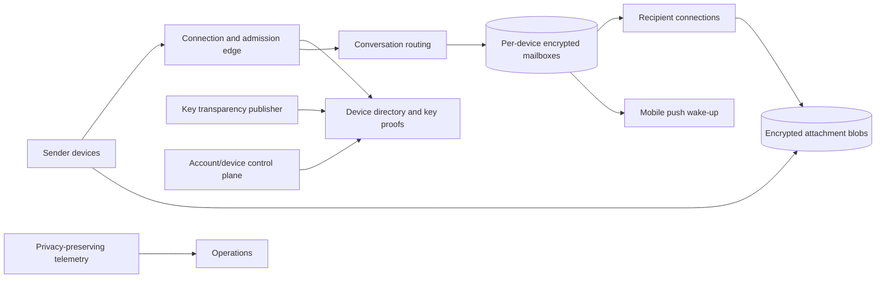

# WhatsApp: End-to-End Encrypted Multi-Device Messaging

An encrypted messenger has two simultaneous correctness problems. The delivery system must route, buffer, retry, and deduplicate messages for intermittently connected devices. The cryptographic system must ensure that only intended devices can read content—even though servers coordinate device discovery and delivery. Multi-device support couples the two: one user is no longer one socket or one encryption identity.

This chapter distinguishes:

- **Documented**: stated in a linked WhatsApp/Meta engineering source; scale and architecture snapshots are dated.
- **Inference**: a conclusion from documented behavior or messaging constraints, not a claim about private production internals.
- **Reference design**: a concrete WhatsApp-like architecture where the production delivery topology is not publicly specified.

Older folklore about exact servers, languages, connection counts, or databases is excluded unless a primary source supports it.

## Workload and security contract

**Documented, 2021 snapshot.** Meta reported that WhatsApp supported more than 100 billion messages and one billion calls per day while describing its de-identified telemetry system. Those are publication-time global figures, not a current QPS breakdown. [Meta Engineering, de-identified telemetry](https://engineering.fb.com/2021/04/16/security/dit/)

**Documented, 2026 snapshot.** WhatsApp reported default end-to-end encryption for more than three billion people in January 2026. [Meta Engineering, Rust at scale for WhatsApp security](https://engineering.fb.com/2026/01/27/security/rust-at-scale-security-whatsapp/)

**Reference-design scope.** Support one-to-one and group text, attachments, calls, per-device delivery, offline receipt, delivery/read acknowledgements, linked devices, key changes, encrypted state sync, and optional encrypted backup.

The contract is:

1. only authenticated participant devices obtain message plaintext or content keys;
2. the server cannot silently add a recipient device without authorization and detection mechanisms;
3. each logical send has a stable ID and each target device applies it at most once;
4. acknowledgements name a stage—server accepted, device received, or user read;
5. an offline target remains recoverable until the declared expiry policy;
6. device-list and key changes are ordered and auditable;
7. metadata collection is minimized because encryption does not hide routing metadata;
8. overload is contained per account, conversation, sender, and region.

End-to-end encryption does not create exactly-once transport, global ordering, or availability. Those are separate protocol properties.

## Documented device and cryptographic model

### One account, multiple identities

**Documented, 2021.** In WhatsApp's multi-device design, every device has its own identity key. The server maintains the account-to-device-identity mapping. For one-to-one chats, the sending client establishes pairwise encrypted sessions and performs client fanout: it encrypts and transmits a message separately to devices in the sender's and recipient's device lists. Delivered messages are not retained on the server after delivery. [Meta Engineering, WhatsApp multi-device](https://engineering.fb.com/2021/07/14/security/whatsapp-multi-device/)

**Documented, 2021.** For groups, WhatsApp said it continued to use the Signal Protocol Sender Key scheme instead of encrypting each ordinary group message independently for every member. The same source describes end-to-end encrypted history transfer and application-state sync across a user's devices.

This creates two distinct costs:

- **cryptographic device fanout** for pairwise sessions;
- **delivery fanout** from a group ciphertext to participant devices.

### Key transparency

**Documented, 2023.** WhatsApp deployed an append-only Auditable Key Directory (AKD) that records account-to-public-key changes, supports inclusion/history proofs, and publishes audit proofs so clients or auditors can verify append-only history. WhatsApp described tens of thousands of key changes per minute, queued and batched into atomic epochs. [Meta Engineering, key transparency](https://engineering.fb.com/2023/04/13/security/whatsapp-key-transparency/)

The directory does not reveal message plaintext. Its purpose is to make inconsistent or silently rewritten key mappings detectable under its threat model.

### Interoperability boundary

**Documented, 2024.** Meta's EU interoperability article says WhatsApp uses the Signal Protocol as the foundation for end-to-end encryption and describes encrypted protobuf messages packaged into XML message stanzas for third-party delivery. This documents that boundary, not WhatsApp's complete internal transport. [Meta Engineering, messaging interoperability](https://engineering.fb.com/2024/03/06/security/whatsapp-messenger-messaging-interoperability-eu/)

## State, authority, and invariants

**Reference design.** Separate server-visible delivery state from client-held cryptographic state:

| State | Authority | Server visibility |
|---|---|---|
| account and authorized device set | device authority plus client authorization evidence | device IDs and public keys |
| private identity/session keys | each client device | never plaintext private keys |
| key-directory epoch | transparency log | mappings and proofs under privacy design |
| conversation membership | group authority, reflected to clients | routing metadata |
| message plaintext | participant devices | ciphertext only |
| device mailbox | delivery service | target, ciphertext, expiry, attempts |
| encrypted attachment | blob store | ciphertext and lifecycle metadata |

### Device-list binding

A send binds to a specific device-list version `d`. Each envelope identifies the target device and session. If the list changes during fanout, policy finishes against `d`, restarts against `d+1`, or sends an explicit sync update; it never silently mixes an unrecorded target set.

### Envelope uniqueness

For logical message `m` and target device `q`, the mailbox owns one envelope identity:

$$
(m,q) \rightarrow ciphertext\_envelope
$$

At-least-once transport may redeliver it, but the target persists `(sender_device,m)` before applying user-visible effects. This is business-effect deduplication, not exactly-once networking.

### Acknowledgement lattice

**Reference design.** Receipt stages advance monotonically:

$$
accepted \preceq device\_received \preceq user\_read
$$

For multi-device accounts, define aggregation explicitly. “Delivered” may mean any recipient device acknowledged, while diagnostics retain per-device state. A delayed receipt cannot move the aggregate backward.

### Key epoch invariant

Each device mapping belongs to one transparency epoch with a verifiable predecessor. Clients reject a proof inconsistent with previously observed history, outside permitted staleness, or not bound to the queried device set.

## Reference delivery architecture

**Reference design.** WhatsApp publishes security components but not a complete current serving topology:

The data plane accepts encrypted envelopes, durably queues them, delivers to online devices, wakes offline devices, and processes receipts. The account/key control plane authorizes device changes and publishes directory epochs. Fleet placement, abuse policy, schemas, and rollout configuration are a separate control plane whose last known-good snapshot can remain locally usable where security policy permits.

## One-to-one send flow

**Documented foundation plus reference delivery mechanics.** Device fanout and pairwise encryption are documented; the mailbox transaction is a reference design:

1. Fetch the recipient's authorized device set and current key-transparency proof.
2. Verify the proof and handle security-sensitive key changes.
3. Advance each pairwise session and create an envelope with logical ID `m` for every target device.
4. Send a batch naming device-list version `d`, target devices, ciphertexts, expiry, and sender operation ID.
5. Authenticate the sender, apply abuse/admission policy, and atomically store one envelope per `(m,target)` plus a send receipt.
6. Deliver to online targets; retain offline targets durably and optionally send a plaintext-free push wake-up.
7. A device durably records `m`, decrypts and commits locally, then acknowledges `device_received`.
8. Remove or tombstone the delivered envelope under the replay/retention policy.
9. Represent read acknowledgements as separate end-to-end encrypted control messages when enabled.

Server acceptance proves custody under the mailbox policy, not recipient decryption. A device receipt proves one target processed the envelope, not that every linked device or the human read it.

**Inference.** A client must commit ratchet advancement with local dedup/message state or retain bounded skipped keys. Otherwise a crash can either reuse key material or make a valid ciphertext undecryptable. Cryptographic lifecycle is covered in [encryption](../10-security/06-encryption.md); transport semantics are in [delivery guarantees](../05-messaging/04-delivery-guarantees.md).

## Group messaging

**Documented foundation.** WhatsApp identifies Sender Keys as its scalable group scheme. A sender distributes key material through pairwise encrypted sessions, then encrypts ordinary group messages under the sender's group state. [Meta Engineering, WhatsApp multi-device](https://engineering.fb.com/2021/07/14/security/whatsapp-multi-device/)

**Reference design.** The service still delivers ciphertext to member devices. Membership changes advance a group epoch. Removing a member excludes it from future sender-key material; adding a member does not grant old history automatically. Clients reject messages whose membership/key epoch is incompatible with accepted group state.

For `n` target devices, server delivery remains `O(n)` even when encryption work per ordinary message is closer to `O(1)` after setup. Large groups need chunked fanout tasks, fair queues, and per-group budgets so one group cannot monopolize mailbox writers.

## Attachments

**Reference design.** Encrypt media on the sender device with a random content key. Upload ciphertext as a resumable immutable blob; put its object ID, digest, length, media type, and content key inside the end-to-end encrypted message. Recipients fetch via an object/CDN plane, verify the digest, then decrypt locally.

This removes large bytes from connection servers. The object reference remains a bearer capability unless access is authenticated; keep it unguessable, scoped, and subject to deletion policy. A server that lacks plaintext cannot claim to perform ordinary plaintext content validation.

## Encrypted state synchronization

**Documented, 2021.** When linking a companion, WhatsApp described the primary device encrypting a recent-history bundle, sending its key through an end-to-end encrypted message, and deleting the transfer key after import. Ongoing application state is stored server-side in end-to-end encrypted form with keys known only to the user's devices. [Meta Engineering, WhatsApp multi-device](https://engineering.fb.com/2021/07/14/security/whatsapp-multi-device/)

**Reference design.** Encode mutable state as versioned encrypted operations—archive, mute, star, contact name, delete—rather than one last-written opaque blob. Each includes device ID, operation ID, logical version, and encrypted payload. Define deterministic merge per state type. Devices request deltas after a cursor and fall back to an encrypted snapshot after compaction.

## Connections, mailboxes, and partitioning

**Reference design.** Terminate persistent connections regionally, but route each device to one mailbox authority keyed by `(account_shard,device_id)` and guarded by an epoch. A connection registry maps an authenticated device lease to its current edge session. The mapping is soft state; the mailbox is durable.

Partition by stable account/device ID. Keep accepted server order per device while clients use conversation/message metadata for presentation. Connection nodes bound every socket queue and pull only a mailbox window. A slow phone leaves backlog in durable storage rather than connection memory. See [backpressure](../06-scaling/07-backpressure.md) and [network transport](../06-scaling/14-network-transport-internals.md).

## Capacity model

### Device fanout—illustrative assumptions

**Reference design.** Assume 1.4 million logical sends/s. Suppose 72% are one-to-one with 3.2 target-device envelopes on average, while 28% are group sends with 34 target-device deliveries:

$$
envelopes/s = 1.4M(0.72 \times 3.2 + 0.28 \times 34) \approx 16.55M
$$

At 1.1 KiB stored ciphertext/metadata and replication factor 3, transient replicated mailbox ingress is about 52.1 GiB/s. These are illustrative numbers, not WhatsApp measurements. They show why logical send rate alone is inadequate.

### Offline backlog—illustrative assumptions

If 7% of envelopes target offline devices and mean time to delivery/expiry is nine hours, Little's Law gives:

$$
backlog \approx 16.55M/s \times 0.07 \times 9 \times 3600 \approx 37.5B\ envelopes
$$

At 1.1 KiB each, raw backlog is about 38.4 TiB before replication, indexes, and tombstones. Measure the age tail: rarely online devices can dominate storage.

### Persistent connections—illustrative assumptions

For 900 million device connections at a measured 18 KiB application/transport footprint, memory is roughly 14.7 TiB. At 250,000 safe connections per host and 55% occupancy, the lower bound is about 6,546 hosts before regional redundancy. These assumptions are deliberately illustrative—not WhatsApp concurrency or server-density claims.

## Failure trace: lost acknowledgement during device change

**Reference-design trace.** Alice sends `m77` to Bob, whose directory version `d12` contains phone `B1` and desktop `B2`:

1. Alice verifies `d12` and encrypts envelopes for `B1` and `B2`.
2. The service durably accepts both; `B1` is online and `B2` offline.
3. `B1` stores `m77`, but its acknowledgement is lost with the connection.
4. Alice retries. Uniqueness keys `(m77,B1)` and `(m77,B2)` return the existing receipt.
5. The service redelivers to `B1`; Bob's durable dedup suppresses duplicate display.
6. Bob removes `B2`, creating device version `d13` and a new transparency epoch. The old `B2` envelope is revoked or expires under declared policy; future sends bind to `d13`.
7. Alice verifies the changed device set before her next send.

The trace separates retry deduplication, per-device receipt, revocation, and key-directory freshness. One `delivered=true` field cannot encode it.

## Failure trace: reconnect storm

**Reference design.** A regional interruption disconnects millions of devices. Clients reconnect with exponential backoff and full jitter, presenting resume tokens. The edge authenticates in bounded batches and reads only a mailbox window. Per-account and per-sender admission protects hot targets; push wake-ups are suppressed for live sessions. Saturated shards advertise credits/retry-after rather than copying full backlogs into memory.

This overload stack requires [rate limiting](../06-scaling/05-rate-limiting.md), [backpressure](../06-scaling/07-backpressure.md), and [retries](../06-scaling/10-retries-timeouts-hedging.md) to share budgets. Independent retries at client, edge, mailbox, and push layers multiply load.

## Multi-region authority

**Inference.** Regional connection edges reduce latency, while mailbox order and dedup require a fenced authority. Active-active sockets do not imply active-active mutation of one mailbox.

**Reference design.** Assign each mailbox shard a home write cell and epoch. Edges proxy to it; replicated ciphertext permits failover. Promotion requires a committed watermark, a higher fencing epoch, and rejection of the old owner. During an uncertain partition, do not create conflicting device-directory or key epochs. Delivery of already committed ciphertext may continue where proofs and leases remain valid.

Keep warm capacity to absorb a region's connections and writes without cold provisioning. Exercise loss of a region, directory publisher, push provider, and key-management dependency separately. See [multi-region architecture](../06-scaling/09-multi-region-architecture.md) and [cell architecture](../06-scaling/11-cell-based-architecture.md).

## Security, privacy, and abuse

### Device injection and transparency

**Documented.** WhatsApp's multi-device article recognizes the risk of a compromised server adding a device. Device authorization, visible linked-device management, and key transparency address parts of that threat. Transparency detects directory inconsistency; it cannot stop malware on an authorized endpoint. [Meta Engineering, multi-device](https://engineering.fb.com/2021/07/14/security/whatsapp-multi-device/), [Meta Engineering, key transparency](https://engineering.fb.com/2023/04/13/security/whatsapp-key-transparency/)

### Calls and IP privacy

**Documented, 2023.** WhatsApp described an optional call relay setting that prevents call participants from learning each other's IP addresses, and privacy tokens for server-enforced silencing without keeping a global calling graph. [Meta Engineering, call security](https://engineering.fb.com/2023/11/08/security/whatsapp-calls-enhancing-security/)

### Encrypted backups

**Documented, 2021.** WhatsApp described optional end-to-end encrypted backups with an HSM-based Backup Key Vault so neither WhatsApp nor the backup provider can access the backup key under the design. Backup recovery is a separate protocol and threat surface from live delivery. [Meta Engineering, E2EE backups](https://engineering.fb.com/2021/09/10/security/whatsapp-e2ee-backups/)

### Abuse controls

**Reference design.** When the server cannot inspect content, combine sender reputation, consent/contact relationships, fanout limits, client-side user-selected reporting, device-integrity signals, and privacy-preserving aggregates. Account discovery, key queries, group invitations, and receipts are enumeration surfaces; protect them with cost limits, response indistinguishability where possible, and audited exceptions.

## Privacy-preserving observability

**Documented, 2021.** WhatsApp's De-identified Telemetry design aimed to gather reliability, performance, and usage data while reducing association with a phone number, using de-identified token mechanisms and aggregation. [Meta Engineering, DIT](https://engineering.fb.com/2021/04/16/security/dit/)

**Reference design.** Measure connection success/reconnect reason by coarse region, mailbox acceptance and delivery age, redelivery, proof failures and epoch lag, fanout in coarse buckets, push effectiveness, cryptographic-session failure by client version, blob integrity, replication lag, fencing rejection, and abuse false positives. Avoid plaintext and named social graphs in general dashboards. Use rotating opaque trace IDs and bounded retention.

## Verification and evolution

**Reference design.** Test duplicate/reordered envelopes, crash between ratchet and local commit, device change racing with send, stale or inconsistent directory proofs, group changes during key distribution, queue expiry, failover with stale leases, reconnect storms, corrupted media, and old clients through protocol migration. Degraded operation must never fall back to plaintext or unverifiable keys.

**Documented, 2021.** Moving from phone-tethered companions to independently connected multi-device clients changed the trust model: companions gained identity keys, senders performed device fanout, and history/state sync became end-to-end encrypted. Rollout began as a limited beta. [Meta Engineering, WhatsApp multi-device](https://engineering.fb.com/2021/07/14/security/whatsapp-multi-device/)

**Documented, 2023.** Key transparency layered an auditable directory onto existing safety-code verification, batching high-volume changes into epochs while clients adopted proof verification. [Meta Engineering, key transparency](https://engineering.fb.com/2023/04/13/security/whatsapp-key-transparency/)

**Reference design.** Mobile migrations require capability negotiation across a long client tail. Generate only formats every target can verify; block features rather than downgrade security; dual-read old/new envelopes; canary by client cohort; and never roll back by reusing consumed keys or sequence numbers.

## Transferable lessons

1. Model a user as independently authenticated devices, not one socket.
2. Separate logical message identity from per-device ciphertext and delivery state.
3. Encryption fanout and delivery fanout are different costs.
4. Make key-directory history auditable; ciphertext is insufficient if recipients can be substituted.
5. Treat acknowledgements as monotonic named stages.
6. Keep offline backlog in durable mailboxes, not connection memory.
7. Design privacy-preserving observability as part of the protocol.
8. Never let availability degradation silently weaken encryption or key verification.

## Primary sources

- [Meta Engineering: WhatsApp multi-device architecture, 2021](https://engineering.fb.com/2021/07/14/security/whatsapp-multi-device/)
- [Meta Engineering: de-identified telemetry, 2021](https://engineering.fb.com/2021/04/16/security/dit/)
- [Meta Engineering: end-to-end encrypted backups, 2021](https://engineering.fb.com/2021/09/10/security/whatsapp-e2ee-backups/)
- [Meta Engineering: deploying key transparency, 2023](https://engineering.fb.com/2023/04/13/security/whatsapp-key-transparency/)
- [Meta Engineering: enhancing WhatsApp call security, 2023](https://engineering.fb.com/2023/11/08/security/whatsapp-calls-enhancing-security/)
- [Meta Engineering: messaging interoperability, 2024](https://engineering.fb.com/2024/03/06/security/whatsapp-messenger-messaging-interoperability-eu/)
- [Meta Engineering: Rust at scale for WhatsApp security, 2026](https://engineering.fb.com/2026/01/27/security/rust-at-scale-security-whatsapp/)
