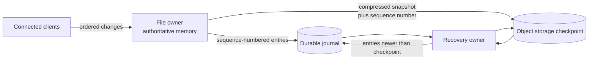
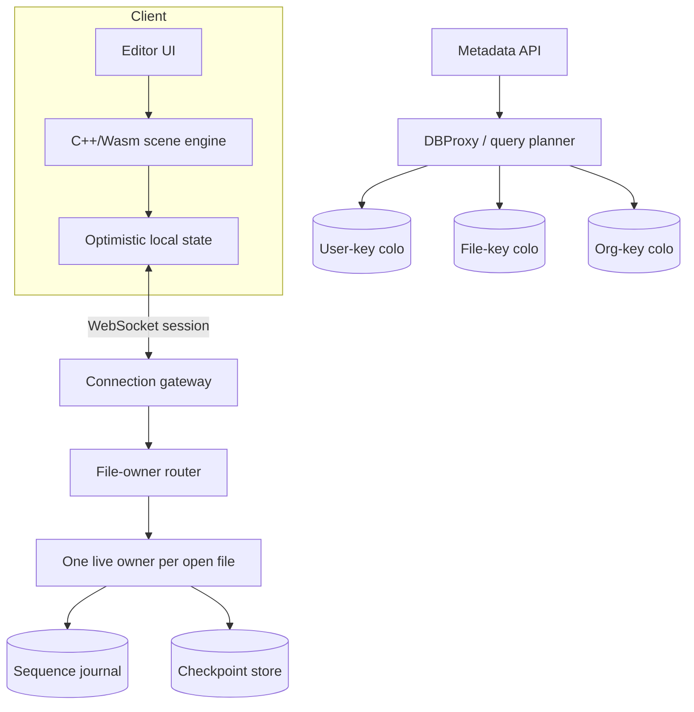

# Figma System Design

## Scope and Evidence Contract

Claims use three evidence labels:

- **Documented fact** means a claim made in a dated Figma engineering article. The date matters because the architecture changed.
- **Inference** means a consequence that follows from those facts but is not itself claimed by Figma.
- **Reference design** means a reviewable architecture assembled from the public mechanisms. It is useful for design work, but it is **not** a claim that every Figma request traverses that exact topology today.

The public record spans the 2017 browser engine, 2018 Rust multiplayer process model, 2019 synchronization model, 2022 durability redesign, and 2023–2024 database program. Combining them into one timeless diagram would erase how the system evolved as its bottleneck moved.

## Workload and Invariants

A browser-based design editor combines workloads that are often separate:

1. A low-latency local graphics engine must pan, zoom, hit-test, and mutate a large scene.
2. Concurrent editors must converge on one document state while still seeing their own input immediately.
3. A hot document needs live session state; a cold document needs durable recovery, not a permanently allocated server.
4. Metadata (users, teams, projects, comments, permissions, and file records) needs relational queries and transactional islands.

The useful invariants are more precise than “real time” or “never lose data”:

- **Interactive invariant:** local input is applied optimistically; a network round trip is not on the pointer-to-pixel path.
- **Ordering invariant:** while connected, one server authority establishes the order for changes to a file.
- **Convergence invariant:** clients receiving the same ordered changes compute the same document state.
- **Recovery invariant:** an acknowledged change must survive loss of the active multiplayer process once the durability path accepts it.
- **Relational invariant:** rows that require atomic joins or transactions should remain colocated by an explicit shard key.

The latency and durability targets are product choices. Public articles document mechanisms and selected measurements, not a universal “100 ms” editing SLO or zero-loss guarantee for every historical version.

## Documented Architecture by Era

### 2017: a native-style engine delivered through the browser

**Documented fact (2017).** Figma described a C++ application compiled to WebAssembly and a custom 2D WebGL renderer. In its published comparison, moving from asm.js to WebAssembly improved measured load time by more than 3×. At publication, the rollout was browser-dependent; the article explicitly discussed Chrome bugs and initially enabling the path in Firefox.

This matters architecturally because the DOM is not the scene graph. The application owns object identity, geometry, rendering order, and hit testing, and can send semantic document mutations rather than DOM diffs.

**Inference.** A shared compact object model reduces impedance between rendering and collaboration. It does not prove that every client and server executes identical code or that every file has bounded memory use.

**Later evolution (2025).** Figma later documented a WebGPU renderer, with C++ compiled both to WebAssembly for clients and to a native server binary. That is a later implementation, not evidence that the 2017 deployment used WebGPU.

### 2018–2019: one authority per open document

**Documented fact (2018).** Figma moved document work into Rust child processes. Its account says each document was exclusive to a worker and later ran in a separate process, while Node.js retained network-facing responsibilities. Serialization became more than 10× faster in the reported benchmark, and process isolation made per-document ownership practical.

**Documented fact (2019).** A connected client and server communicated over [WebSockets](../07-real-time/01-polling.md#websocket). On opening a file, the client downloaded a copy. The live multiplayer system synchronized document changes; comments, users, teams, and projects remained separate Postgres-backed data.

Figma explicitly said this protocol was **not a true CRDT**. The server was a central authority, so the document could be represented conceptually as:

$$
\text{Document}: \text{ObjectID} \rightarrow (\text{Property} \rightarrow \text{Value})
$$

The server ordered changes. For each object-property pair, the latest value in that server order won. No client timestamp was required to decide the winner.

```text
Client A: set (shape-7, fill)  = blue
Client B: set (shape-7, width) = 240
Result: both properties survive

Client A: set (shape-7, fill)  = blue
Client B: set (shape-7, fill)  = red
Result: one whole fill value wins in server order
```

This is a domain-specific merge rule, not a general collaborative-text algorithm. In the 2019 description, simultaneous edits to the same text property did not merge character by character; one property value won. Stable object identifiers and fractional indexing addressed identity and ordered-child insertion without turning the whole document into a decentralized CRDT.

On an offline reconnect, the documented client downloaded a fresh server copy and reapplied offline edits. That design favors a known authoritative base over attempting peer-to-peer reconciliation.

### 2022: checkpoint plus journal durability

The early stateful-session design periodically checkpointed a compressed binary document to S3. **Documented fact (2022):** checkpoints were written every 30–60 seconds, so process loss could expose a recovery-point window approaching a minute.

Figma then added an asynchronous journal backed by DynamoDB:



The checkpoint carried the last included per-file sequence number. Recovery loaded that checkpoint and replayed newer journal entries. Ownership used a lock containing a random lock UUID and file key; conditional journal writes rejected a stale owner, and a new owner used a strongly consistent read before accepting responsibility.

The durability write was asynchronous with respect to the interactive application path, but “asynchronous” does not mean “best effort.” The conditional ownership protocol prevented two processes from appending valid histories for the same file generation.

Published rollout evidence gives the mechanism useful scale context:

| Measurement in the 2022 article | Reported value | What it establishes |
|---|---:|---|
| Document changes handled per day | More than 2.2 billion | Journal scale at that publication date |
| Changes persisted within about 600 ms | 95% | Distribution point, not a hard upper bound |
| Consecutive replay validations before rollout | About 400,000 | Recovery-path validation effort |
| Multiplayer drain p99 during deploys | Under 1 second | One deployment measurement, not global edit latency |

### 2020–2024: stretch, split, then shard the relational plane

**Documented fact (2023 retrospective).** In 2020, Figma's metadata plane still centered on one large Amazon RDS database. Traffic was growing roughly 3× per year, peak CPU reached about 65%, and the team first used familiar levers: an `r5.12xlarge` to `r5.24xlarge` upgrade, read replicas, additional databases, PgBouncer, and query work.

The later sharding program preserved two explicit goals: incremental, reversible migration and strong consistency where the application required it. It did **not** promise atomic transactions across shards.

The public design introduced:

- A small set of colocating keys such as `UserID`, `FileID`, and `OrgID`.
- “Colos” that keep rows sharing a key together, preserving local joins and transactions.
- Hash-based routing for distribution.
- Logical sharding before physical movement, so query compatibility could be tested first.
- A Go database proxy, DBProxy, that parsed, planned, routed, and sometimes scatter-gathered supported SQL.
- Shadow planning and an intentionally limited query subset; the team reported that roughly 90% of common queries fit the selected subset.

The proxy is not magic cross-shard SQL. A request that lacks a usable routing key may fan out, and a write requiring atomicity across shard homes is outside the simple model. See [Database Sharding](../06-scaling/03-database-sharding.md) and [Database Migrations](../15-deployment/03-database-migrations.md) for the reusable mechanics.

## Reference Design: an Evidence-Bounded Synthesis

The following is a **reference design**, not a documented current Figma topology:



The diagram deliberately separates the live document plane from the relational metadata plane. Public sources establish both families of mechanism, but not that they share the exact gateway, routing service, or storage layout shown here.

### Illustrative capacity reasoning

For an illustrative hot document, assume the following values; these are not Figma measurements:

- 220 MiB for authoritative document and derived indexes,
- 30 MiB for process/runtime overhead,
- 0.4 MiB of buffered outbound data per connected editor,
- 12 active editors at the p95.

Then an illustrative owner footprint is:

$$
M_{file} = 220 + 30 + 0.4 \times 12 = 254.8\ \text{MiB}
$$

On a 64 GiB host, reserving 30% for the OS, fragmentation, and failure headroom gives:

$$
N_{files} \leq \left\lfloor\frac{64 \times 1024 \times 0.70}{254.8}\right\rfloor = 180
$$

That number is **illustrative only**. The review value is the dependency: capacity is governed by the distribution of hot-document memory and fan-out, not total stored-file count. A scheduler also needs an escape path for a single document larger than the ordinary bin.

For durability, if a file emits $r$ changes/s, each encoded journal entry averages $b$ bytes, and the retained replay interval is $T$, the tail size is:

$$
J = r \times b \times T
$$

At 80 changes/s, 300 bytes/change, and a 10-minute interval, $J=14.4$ MB before replication and storage overhead. Measure replay **time**, not only bytes: a compact tail can still be slow if each operation triggers expensive validation or derived-state rebuilding.

## Failure Analysis

| Failure | Preserved invariant | Required response | Residual risk |
|---|---|---|---|
| Client disconnect | Server order remains authoritative | Reconnect to a fresh base and reapply offline intent | Conflicting same-property edits can overwrite |
| Owner process crash | Durable prefix remains recoverable | Acquire new generation, load checkpoint, replay journal | Entries not yet durably accepted define the RPO |
| Stale owner resumes | One valid append lineage | Conditional writes reject the old lock UUID | A bug in fencing logic can fork history |
| Checkpoint corrupt or incomplete | Journal sequence identifies coverage | Validate checksum/version; fall back to older checkpoint plus longer replay | Recovery time grows with tail length |
| Hot-document overload | Other documents should remain healthy | Per-file admission, fan-out backpressure, oversized-owner pool | One-authority model imposes a per-file ceiling |
| Metadata shard unavailable | Unrelated colos can remain available | Route and shed by colo; retry only idempotent work | Transactions cannot silently move across shards |
| Scatter-gather query surge | Shards retain local safety | Cost limits, bounded fan-out, precomputed alternatives | Tail latency rises with slowest shard |

The single-writer choice removes distributed write-write reconciliation for an open file, but it does not remove distributed-systems work. It moves that work into ownership, fencing, replay, routing, and overload control.

## Design Alternatives and Decision Boundary

| Decision | Chosen public mechanism | Prefer an alternative when |
|---|---|---|
| Concurrent editing | Server-ordered property values | Peer-to-peer/offline-first operation is a primary requirement; use an operation-based or state-based CRDT |
| Hot file state | One authoritative process | A single document must exceed one process or region; introduce hierarchical ownership or partition the document with explicit semantics |
| Durability | Checkpoint plus sequence journal | Every mutation must be synchronously replicated before acknowledgment; accept more latency for a stricter RPO |
| Metadata scale | Relational colos behind a proxy | Cross-entity transactions dominate and cannot be colocated; revisit boundaries rather than hiding them behind fan-out |
| Browser engine | C++ compiled to Wasm | DOM accessibility/layout is the primary workload, or native code complexity outweighs renderer control |

## Design-Review Questions

1. What is the exact conflict unit: character, property, object, subtree, or whole document?
2. Which response tells a client that its change is ordered, and which event tells it that the change is durable?
3. Can an old owner append after a network partition? Show the fencing token at the durable write.
4. How long does recovery take at checkpoint-age p99 and mutation-rate p99, including derived-state rebuilds?
5. What happens when one file is larger than a normal owner's memory budget or produces more fan-out than one process can send?
6. Which metadata operations require atomicity, and do their rows share a colocating key?
7. Which SQL forms can DBProxy route without fan-out, and what rejects an unsafe query before production?
8. Are offline edits replayed as original intent or merely as final property assignments? What user-visible conflicts follow?
9. Are benchmark dates and browser/runtime versions attached to performance claims?

## Lessons That Generalize

1. A central authority can justify a simpler merge algebra than a fully decentralized CRDT, but only if ownership is fenced and recovery is explicit.
2. Conflict granularity is product semantics. Property-level convergence is excellent for independent shape attributes and intentionally weak for simultaneous edits to one text value.
3. Checkpoint plus ordered journal is powerful because the snapshot declares its exact log boundary.
4. A natural single-writer key simplifies correctness while creating a capacity ceiling that must be modeled as a distribution.
5. Sharding succeeds when transaction boundaries become routing boundaries; a proxy cannot manufacture cross-shard atomicity.
6. Dated architecture is more useful than a timeless diagram: the sequence of bottlenecks explains why each mechanism existed.

## Primary References

- [WebAssembly cut Figma's load time by 3x (2017)](https://www.figma.com/blog/webassembly-cut-figmas-load-time-by-3x/)
- [Rust in production at Figma (2018)](https://www.figma.com/blog/rust-in-production-at-figma/)
- [How Figma's multiplayer technology works (2019)](https://www.figma.com/blog/how-figmas-multiplayer-technology-works/)
- [Realtime editing of ordered sequences (fractional indexing)](https://www.figma.com/blog/realtime-editing-of-ordered-sequences/)
- [Making multiplayer more reliable (2022)](https://www.figma.com/blog/making-multiplayer-more-reliable/)
- [How Figma scaled to multiple databases (2023)](https://www.figma.com/blog/how-figma-scaled-to-multiple-databases/)
- [How Figma's databases team lived to tell the scale (2024)](https://www.figma.com/blog/how-figmas-databases-team-lived-to-tell-the-scale/)
- [Figma rendering powered by WebGPU (2025, later evolution)](https://www.figma.com/blog/figma-rendering-powered-by-webgpu/)

## Related Chapters

- [Conflict Resolution](../02-distributed-databases/04-conflict-resolution.md)
- [CRDTs and Collaborative Editing](../07-real-time/07-crdts-collaborative-editing.md)
- [Database Sharding](../06-scaling/03-database-sharding.md)
- [Cell-Based Architecture](../06-scaling/11-cell-based-architecture.md)
- [Write-Ahead Logging](../03-storage-engines/04-write-ahead-logging.md)
