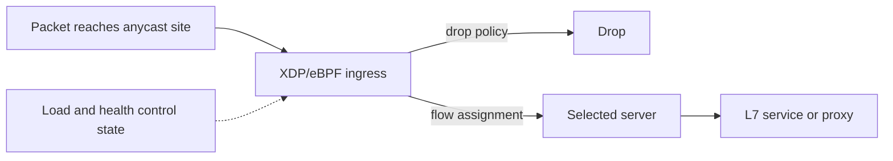
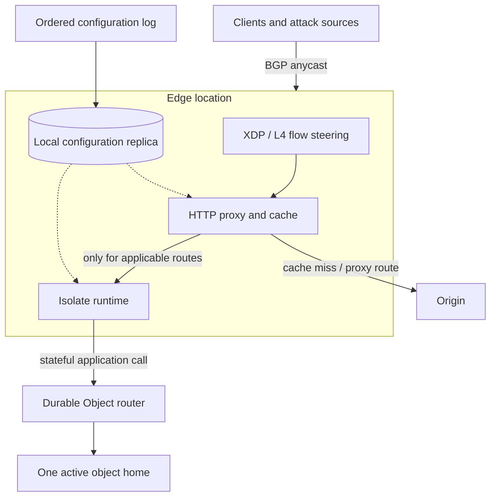

# Cloudflare System Design

## Scope and Evidence Contract

Cloudflare publishes unusually detailed engineering accounts, but each article describes a component, date, and measurement boundary. This chapter uses three labels:

- **Documented fact:** a statement in a dated Cloudflare source.
- **Inference:** a design consequence derived from those facts.
- **Reference design:** a composite assembled for review. It must not be read as Cloudflare's documented end-to-end request path.

That distinction is essential here. Anycast ingress, Unimog, Pingora, Workers, Quicksilver, and Durable Objects are all documented systems. Public sources do **not** establish that every request traverses all of them, in that order, on one machine.

## The Workload Is Several Systems, Not One Pipeline

An edge platform must solve at least four different placement problems:

1. **Packets:** attract traffic to a reachable nearby location and absorb attacks.
2. **Connections:** assign flows to healthy machines and reuse expensive origin connections.
3. **Code and configuration:** execute tenant logic and read request-path configuration locally.
4. **Mutable state:** choose where serialization occurs when an application needs coordination.

The mechanisms differ because their invariants differ:

| Plane | Primary invariant | Dominant resource | Failure preference |
|---|---|---|---|
| Ingress | A healthy site can accept the advertised address | Network capacity and packets/s | Reroute or disperse |
| L4/L7 proxy | A flow reaches a viable handler; protocol state remains valid | CPU, memory, sockets | Retry only when semantics permit |
| Configuration | Reads remain local and updates retain an ordered lineage | Memory/storage and propagation delay | Serve the last applied version |
| Tenant compute | Isolation and bounded resource use | CPU time and memory | Terminate or shed one tenant |
| Coordinated state | One serialized history per object identity | Storage I/O and geographic latency | Route to the object's home |

## Documented Systems, Pinned to Their Sources

### Anycast and “every service everywhere”

Cloudflare announces service addresses from many locations using BGP anycast. Routing policy sends a client toward a reachable announcement according to Internet topology and policy—not necessarily the geographically closest building.

**Documented fact (2021).** Cloudflare described its network as designed to run every service in every server and every location. This homogeneous-fleet goal lets capacity be shared across products and lets newly deployed services inherit the existing footprint.

**Inference.** Anycast disperses a geographically distributed attack because each source tends to enter through its own routed location. That helps absorption, but it is not a proof that load is uniform. Route leaks, hot peering links, localized attacks, and uneven site capacity still require traffic engineering and admission control.

See [Multi-Region Architecture](../06-scaling/09-multi-region-architecture.md) for the distinction between routing reachability and application consistency.

### Unimog: load balancing inside an edge location

**Documented fact (2020).** At publication, Cloudflare said its network covered more than 200 cities. Within a data center, any server could handle any service or IP. Unimog made each server participate in L4 load balancing rather than placing a dedicated appliance tier in front.

Unimog built on an earlier XDP/eBPF packet-processing layer called `l4drop`. XDP runs before the ordinary kernel networking stack, making early drops and redirects cheap. A control system supplied dynamic load information; the data plane selected a viable destination for a flow while preserving flow affinity.

The article reported less than 1% CPU overhead in its measurement. That result is evidence for the tested deployment, not a universal XDP budget and not an end-to-end proxy cost.

The separation is important: BGP chooses a site; Unimog chooses a machine within that site; an L7 service then interprets HTTP or another application protocol.

### Pingora: the origin-facing HTTP proxy substrate

**Documented fact (2022).** Cloudflare said Pingora handled almost all HTTP traffic that interacted with origins. The Rust system replaced an older NGINX-based service, allowing tighter control over connection pooling and request behavior.

The published before/after measurements included:

| Reported comparison | Result in the 2022 article |
|---|---:|
| Median time to first byte | 5 ms lower |
| p95 time to first byte | 80 ms lower |
| New origin connections | About one third as many |
| One large customer's reuse ratio | 87.1% to 99.92% |
| New connections for that customer | 160× fewer |
| CPU at equivalent traffic | About 70% lower |
| Memory at equivalent traffic | About 67% lower |

These figures do not isolate one causal change: a new implementation, different pooling, and deployment evolution all participated. They also do not mean every Cloudflare request hits an origin; cache hits need not.

Cloudflare open-sourced Pingora under Apache 2.0 in 2024. That is later evolution and does not change the boundary of the 2022 production comparison.

### Workers: high-density tenant compute

Workers uses V8 isolates rather than assigning a conventional process or virtual machine to every tenant script. Isolates share a process while retaining separate JavaScript heaps and capability-limited host interfaces.

**Documented fact (2020).** Cloudflare reported isolate startup below 5 ms. For HTTPS, it described prewarming a Worker after observing SNI in the TLS ClientHello, overlapping startup with the remaining handshake.

The accurate conclusion is “startup can be hidden on that path,” not “cold starts are zero.” HTTP without that signal, code distribution, eviction, overload, and other runtime work can still contribute latency.

The architecture exchanges general-purpose host access for density and control:

- Tenant code uses platform capabilities rather than raw process privileges.
- CPU time, memory, subrequests, and other resources can be metered at request boundaries.
- Shared-process isolation requires defense in depth; a language sandbox is not equivalent to a hardware VM boundary.
- A location can keep many tenant programs ready without one OS image per tenant.

This is the runtime-level version of [Multi-Tenancy](../06-scaling/12-multi-tenancy.md): isolation, scheduling, and accounting are one design problem.

### Quicksilver: configuration distribution optimized for reads

Request handling repeatedly consults customer configuration. A remote database lookup on that path would multiply latency and create a dependency whose outage could stop the edge.

**Documented fact (2020).** Quicksilver distributed ordered configuration changes while each edge machine served reads from local LMDB. The article reported:

- 14 million peak HTTP requests/s, more than 200 cities in 90 countries, and 26 million Internet properties as deployment context at publication.
- About 2.5 trillion configuration reads/day with average read latency in microseconds.
- New configuration reaching the network within seconds.
- A monotonically increasing transaction-log sequence used for fan-out and catch-up.

The system optimized global distribution, not globally concurrent writes. A disconnected data center could keep serving its last locally applied state and catch up later.

The predecessor benchmark explains the redesign. With 20 fixed two-byte key/value reads, the reported Kyoto Tycoon p99/p99.9 latency was 9/15 ms without writes. One sequential 40 KiB writer raised it to 154/250 ms; two writers raised it to 701/1,215 ms. Those are benchmark-specific tail measurements, but they expose read/write interference on a configuration path.

A useful invariant is:

$$
v_{local}(t) \leq v_{committed}(t), \qquad v_{local}(t+1) \geq v_{local}(t)
$$

for each replica's applied sequence $v$. Reads may be stale during disconnection, but a correctly recovering replica does not move backward through committed configuration versions.

### Durable Objects: one home for coordination

**Documented fact (2020 beta).** A Durable Object has a globally unique identity, is active in one location at a time, and owns private strongly consistent transactional storage. Requests for an identity are routed to its active instance. Its single-threaded execution model supplies a serialization point for application logic.

That is not “active-active state everywhere.” It chooses one home per object and pays network latency when callers are far from that home. It also creates a per-object throughput ceiling; scale comes from using many object identities.

**Later evolution (2024).** Cloudflare documented SQLite-backed Durable Object storage with code colocated with SQLite. Its storage replication system batches write-ahead-log updates for at most 10 seconds or 16 MB, snapshots when logs exceed database size, and can reconstruct with downloads bounded to at most about twice database size in the described design.

Those storage internals should not be projected backward onto the 2020 beta, and Durable Objects should not be placed on every generic proxy request path.

## Reference Design: Composite Edge Platform

The following is a **reference design synthesis**. Arrows express plausible interfaces, not one documented Cloudflare deployment graph.

The optional edges matter. A cached static request need not execute a Worker or contact an origin. A Worker need not use a Durable Object. A Durable Object may live in another location. Quicksilver-style configuration distribution and Durable Object application storage solve different consistency problems.

## Illustrative Capacity and Tail-Latency Reasoning

### Configuration fan-out

Assume—not as Cloudflare data—$N=250{,}000$ edge replicas, an update stream of $u=2{,}000$ changes/s, and $s=600$ encoded bytes/change. Naive origin fan-out would emit:

$$
B = N \times u \times s = 300\ \text{GB/s}
$$

before protocol and replication overhead. A tree or regional relay hierarchy with fan-out $f$ reduces connections at the source, but not total delivered bytes. Capacity reviews therefore need both root egress and aggregate relay/disk budgets, plus catch-up bandwidth after a disconnected site returns.

### Origin connection reuse

If a site proxies $R=200{,}000$ origin requests/s and the probability of needing a new connection falls from 12.9% to 0.08%, the illustrative handshake rate changes from:

$$
25{,}800\ \text{connections/s} \quad \text{to} \quad 160\ \text{connections/s}
$$

The percentages echo the shape of one published customer example, but this workload and arithmetic are illustrative. The benefit is nonlinear when handshakes also consume origin CPU, ephemeral ports, and congestion windows.

### Tail composition

For an origin-bound dynamic request, a useful decomposition is:

$$
T_{request}=T_{route}+T_{queue}+T_{edge}+T_{origin\ connection}+T_{origin}
$$

Do not add independent p99 values and call the result a p99. Preserve per-request traces or replay joint distributions: queueing, new-connection probability, and origin slowness are correlated during overload.

## Failure Analysis

| Failure | Desired behavior | Mechanism | Remaining trade-off |
|---|---|---|---|
| One edge location unreachable | Traffic reaches another advertisement | BGP withdrawal/route convergence | Sessions may reconnect; path may be farther |
| One server overloaded | Existing and new flows avoid it | Dynamic L4 load state and health | Stale control data can misroute briefly |
| Packet flood | Expensive work is bypassed | XDP/eBPF early filtering | Link capacity can saturate before software |
| Origin is slow | Edge remains bounded | Timeouts, connection pools, admission control, caching | Retrying non-idempotent requests is unsafe |
| Config source unavailable | Edge serves last applied state | Local replica and ordered catch-up | Updates are stale until recovery |
| Replica misses log history | Recover monotonic state | Snapshot/full sync plus sequence boundary | Catch-up can compete with live traffic |
| Tenant script loops or allocates heavily | Other tenants retain service | Runtime quotas and termination | Shared-process bugs expand blast radius |
| Durable Object host fails | One history resumes elsewhere | Storage recovery and single active placement | Object is temporarily unavailable; callers are remote |
| One object becomes globally hot | Fleet remains healthy | Per-object backpressure and key partitioning | Atomic operations across split identities need redesign |

## Design Boundaries

| Need | Strong fit | Poor fit |
|---|---|---|
| Small, read-dominant configuration needed everywhere | Ordered fan-out plus full local replicas | Large mutable datasets with multi-writer transactions |
| Stateless request transformation | Isolate-based edge compute | Arbitrary privileged binaries or long unbounded jobs |
| Per-key coordination | Single-home actor/object | One global counter requiring unlimited write throughput |
| Origin proxying | Shared connection pools and protocol-aware proxy | Assuming every request can be retried safely |
| Volumetric dispersion | Anycast plus distributed capacity | Treating route choice as a latency or balance guarantee |

Cells and a homogeneous fleet are not opposites at every layer. Cloudflare can expose a uniform global service while still using process, machine, object, or storage failure domains internally. See [Cell-Based Architecture](../06-scaling/11-cell-based-architecture.md).

## Design-Review Questions

1. Which routing layer chooses the site, machine, process, and state owner, and how stale can each decision be?
2. What percentage of traffic can be rejected before allocating connection or application state?
3. When configuration distribution is disconnected, is stale service safer than fail-closed behavior for this setting?
4. What proves ordered catch-up has no gap, duplicate, or rollback?
5. Is a cold start measured from code absent, isolate absent, or first byte of customer execution?
6. Which requests are safe to retry after a proxy loses the origin response?
7. What is the maximum object-level arrival rate, and can the key be partitioned without breaking its invariant?
8. Does the reference diagram accidentally imply that optional products are on a universal request path?
9. Are performance numbers pinned to workload, date, percentile, and comparison baseline?

## Lessons That Generalize

1. Route selection is hierarchical: global anycast, local flow steering, application routing, and state placement solve different problems.
2. Put read-mostly control data beside the hot path, but preserve an ordered version boundary for recovery and observability.
3. High tenant density comes from constraining the execution model; isolation and economics must be reviewed together.
4. Connection reuse is a capacity feature, not merely a latency optimization.
5. Edge state still obeys physics. Strong coordination requires a serialization point, and callers pay distance to it.
6. A component catalog is not an architecture diagram. Mark optional edges and evidence boundaries explicitly.

## Primary References

- [Unimog: Cloudflare's edge load balancer (2020)](https://blog.cloudflare.com/unimog-cloudflares-edge-load-balancer/)
- [Every service everywhere (2021)](https://blog.cloudflare.com/magic-makes-your-network-faster/)
- [Introducing Quicksilver: configuration distribution at Internet scale (2020)](https://blog.cloudflare.com/introducing-quicksilver-configuration-distribution-at-internet-scale/)
- [Pingora: the proxy that connects Cloudflare to the Internet (2022)](https://blog.cloudflare.com/how-we-built-pingora-the-proxy-that-connects-cloudflare-to-the-internet/)
- [Pingora open source (2024, later evolution)](https://blog.cloudflare.com/pingora-open-source/)
- [Eliminating cold starts with Cloudflare Workers (2020)](https://blog.cloudflare.com/eliminating-cold-starts-with-cloudflare-workers/)
- [Introducing Workers Durable Objects (2020 beta)](https://blog.cloudflare.com/introducing-workers-durable-objects/)
- [SQLite in Durable Objects (2024, later evolution)](https://blog.cloudflare.com/sqlite-in-durable-objects/)

## Related Chapters

- [Content Delivery Networks](../06-scaling/04-cdn-architecture.md)
- [Multi-Region Architecture](../06-scaling/09-multi-region-architecture.md)
- [Multi-Tenancy](../06-scaling/12-multi-tenancy.md)
- [Retries, Timeouts, and Hedging](../06-scaling/10-retries-timeouts-hedging.md)
- [SLOs and Error Budgets](../11-observability/05-slos-error-budgets.md)
