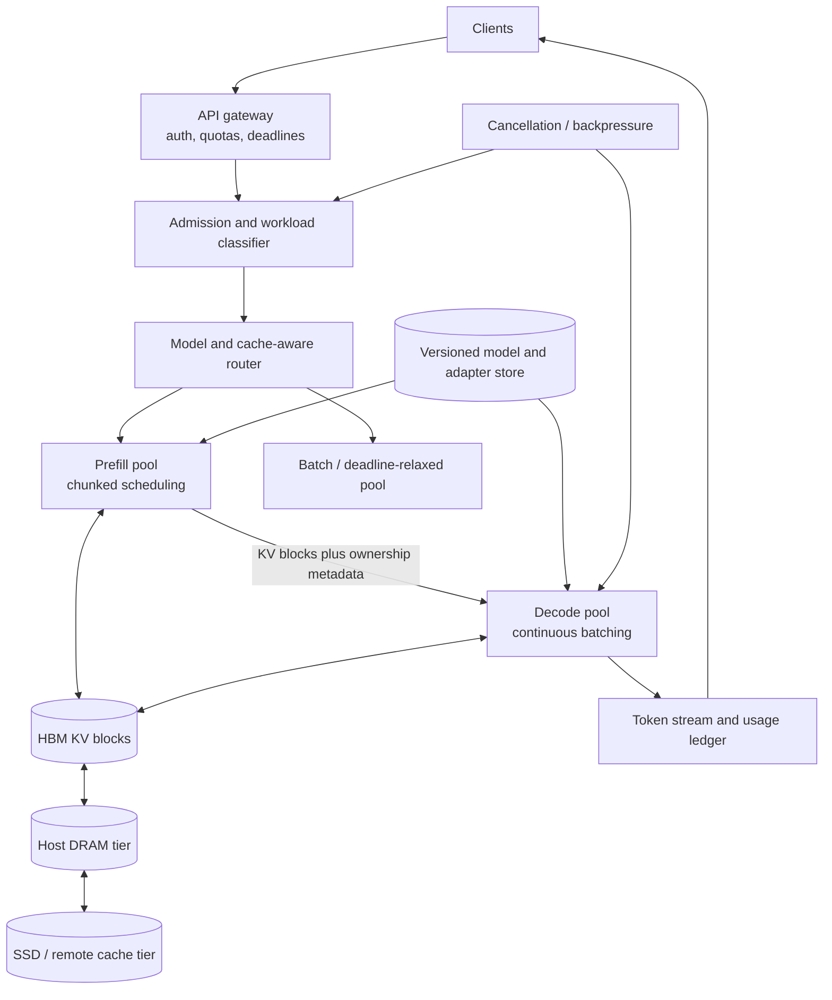

# LLM Inference Platforms: Serving Tokens at Planetary Scale

## Scope and Evidence Contract

No single public “frontier provider architecture” exists. This analysis triangulates peer-reviewed systems: Orca (OSDI 2022), vLLM (SOSP 2023), DistServe (OSDI 2024), SGLang (NeurIPS 2024), and Mooncake (FAST 2025). The following labels distinguish paper evidence from inference and composite design:

- **Documented fact:** a mechanism or result in one named paper and evaluation.
- **Inference:** a consequence derived from the workload or documented mechanism.
- **Reference design:** a composite platform assembled from multiple systems. It is not a claim that any provider implements every component.

Results across papers are not directly rankable. They use different models, accelerators, traces, batch policies, latency objectives, and baselines. “2× throughput” is meaningless without that experimental envelope.

## Start with the Serving Contract

An inference platform accepts more than a prompt. A request contract commonly includes:

- model and immutable model version,
- input token sequence and maximum output length,
- sampling parameters and random seed where supported,
- stop sequences and structured-output constraints,
- streaming or non-streaming delivery,
- tenant identity, quota class, deadline, and cancellation signal,
- cache eligibility and privacy boundary,
- adapter or fine-tune identity.

The platform should make four invariants explicit:

1. **Admission invariant:** admitted work has a bounded resource reservation or can be safely preempted.
2. **Isolation invariant:** one tenant's long prompt or output cannot consume unbounded shared queue, KV-cache, or decode slots.
3. **Version invariant:** every token in a response comes from the selected weight, tokenizer, adapter, and decoding-policy versions.
4. **Streaming invariant:** cancellation and backpressure eventually stop compute; a disconnected client does not generate indefinitely.

Correctness is probabilistic at the model layer, but the serving system still has deterministic obligations: authorization, versioning, accounting, ordering, and resource isolation.

## Workload Physics

For an autoregressive Transformer, serving divides into two phases.

| Property | Prefill | Decode |
|---|---|---|
| Work | Process all input tokens and create KV state | Generate one or a few new tokens per iteration |
| Parallelism | Large matrix operations over prompt tokens | Small per-sequence step, batched across sequences |
| Frequent bottleneck | Compute, especially for long uncached prompts | Weight/KV memory bandwidth and KV capacity |
| User metric | Time to first token (TTFT) | Time per output token (TPOT) or inter-token latency |
| Interference risk | Long prompt delays active decodes | Large decode batch delays newly arriving prefills |

This classification is a roofline tendency, not a law. Model architecture, sequence length, quantization, tensor parallelism, kernel implementation, and batch shape can move either phase between compute and memory limits.

For percentile objectives, decompose latency rather than reporting one average:

$$
\mathrm{TTFT}=T_{gateway}+T_{queue,p}+T_{prefill}+T_{KV\ transfer}+T_{first\ decode}
$$

$$
\mathrm{E2E}=\mathrm{TTFT}+\sum_{i=2}^{m} T_{decode,i}+T_{stream}
$$

where $m$ is the number of generated tokens. A useful platform objective is **goodput**:

$$
G = \frac{\#\{\text{requests meeting all stated SLOs}\}}{\text{accelerator-second}}
$$

Raw tokens/s can rise while goodput falls if large batches violate TTFT or TPOT targets.

## What the Primary Systems Actually Establish

### Orca: OSDI 2022

Orca introduced **iteration-level scheduling**: after each model iteration, finished sequences leave and newly ready sequences may join. That removes the “wait for every sequence in a static batch” barrier. Its selective batching mechanism let operations with different batching constraints coexist.

In the paper's GPT-3 175B evaluation, Orca reported up to 36.9× higher throughput than FasterTransformer at the same latency target. That is a paper-specific comparison, not a general improvement over all modern engines.

**Established principle:** batch membership should follow token-generation progress, not whole-request lifetime.

### vLLM and PagedAttention: SOSP 2023

Autoregressive attention stores key and value tensors for previous tokens. Conventional contiguous allocation wastes memory through reserved-but-unused output space and fragmentation. vLLM's **PagedAttention** divides KV state into blocks, maps logical blocks to non-contiguous physical blocks, and enables copy-on-write sharing for common prefixes or parallel samples.

Across its evaluated workloads, vLLM reported 2–4× the throughput of FasterTransformer and Orca at comparable latency. The paper's result demonstrates the value of its memory manager and scheduler under those experiments; it is not a 2–4× promise for arbitrary current hardware or models.

**Established principle:** KV memory is an operating-system-style allocation problem, and block tables decouple logical sequence growth from physical placement.

### DistServe: OSDI 2024

DistServe separates prefill and decode onto different GPU pools. It then co-optimizes resource allocation, parallelism, and placement: prefill/decode transfer consumes interconnect bandwidth, so separating pools without topology-aware placement can lose the benefit.

The paper reported up to 7.4× more requests under its SLOs, or up to 12.6× tighter SLOs at the same request rate, with more than 90% of requests meeting the evaluated constraints. Those alternatives summarize different experimental comparisons; they should not be multiplied together.

**Established principle:** phase disaggregation can isolate TTFT from TPOT interference, but KV transfer becomes a first-class stage.

### SGLang: NeurIPS 2024

SGLang targets structured generation programs with repeated prefixes, branching, tool interactions, and constrained decoding. **RadixAttention** stores reusable KV prefixes in a radix tree, while a compressed finite-state-machine representation reduces structured-output overhead.

The paper reported up to 6.4× higher throughput on evaluated structured language-model programs. This does not establish the same gain for ordinary one-shot completions.

**Established principle:** scheduling can exploit program structure and prefix lineage, not only independent request lengths.

### Mooncake: FAST 2025

The paper is *Mooncake: Trading More Storage for Less Computation*, subtitled *A KVCache-centric Architecture for Serving LLM Chatbot*. It documents the Kimi production platform, including disaggregated prefill and decode and a distributed KV cache spanning accelerator memory, CPU DRAM, SSD, and network resources.

The production context was thousands of nodes and more than 100 billion tokens/day. The authors reported 115% and 107% more requests than previous vLLM-based systems on A800 and H800 deployments, respectively. These are vendor-authored production comparisons, not independently normalized benchmarks.

The reproducible experiments used a dummy Llama-3-70B workload and replay traces. One comparison allocated 16 nodes with eight A800 GPUs each per system. Example trace characteristics included:

| Trace | Requests | Mean input tokens | Mean output tokens | Reported cache ratio |
|---|---:|---:|---:|---:|
| Real conversation | 12,031 | 12,035 | 343 | 40% |
| Tool and agent | 23,608 | 8,596 | 182 | 59% |
| Synthetic | 3,993 | 15,325 | 149 | 66% |

The paper reported 59–498% capacity gains under selected time-between-token objectives. Its global cache-aware scheduler reduced average TTFT by another 14% relative to local cache-aware scheduling in the stated evaluation. Mooncake described an 8×400 Gbit/s network and petabyte-scale cache resources; the design relies on overlap, chunking, and high-bandwidth transfer rather than assuming KV movement is free.

**Established principle:** recomputable KV state can be treated as a distributed storage hierarchy when reuse value exceeds movement and retention cost.

## Reference Design: Evidence-Bounded Composite

This diagram combines documented ideas. No cited paper documents this exact complete topology.

The design has separable choices:

- A colocated engine may beat disaggregation when requests are short or the interconnect is weak.
- HBM block paging does not require a cluster-wide SSD cache.
- Prefix-aware routing is valuable only when reuse probability exceeds load-imbalance and transfer costs.
- Batch work may use the same fleet under priority scheduling or a physically separate pool.
- Speculative decoding, quantization, and mixture-of-experts routing are independent optimizations, each with quality and topology constraints.

## The KV-Cache Ledger

For standard multi-head or grouped-query attention, an illustrative per-sequence KV byte count is:

$$
B_{KV}=2 \times L \times H_{KV} \times d_{head} \times b \times n
$$

where:

- $2$ represents keys and values,
- $L$ is layer count,
- $H_{KV}$ is the number of KV heads,
- $d_{head}$ is head dimension,
- $b$ is bytes per stored element,
- $n$ is cached tokens.

**Illustrative, not a provider fact:** with $L=80$, $H_{KV}=8$, $d_{head}=128$, BF16 ($b=2$), and $n=32{,}768$:

$$
B_{KV}=10{,}737{,}418{,}240\ \text{bytes}=10\ \text{GiB per active sequence}
$$

One hundred such fully populated sequences approach 1 TiB before allocator metadata, fragmentation, replicas, or model weights. This is why maximum context is not the same as economically supportable concurrency.

Transfer is also visible to the user. At an effective 200 Gbit/s payload rate (25 GB/s), moving a 10 GiB cache takes at least:

$$
T_{wire}\approx \frac{10.74\ \text{GB}}{25\ \text{GB/s}}=0.43\ \text{s}
$$

before queueing, protocol overhead, and destination writes. A disaggregated system therefore needs one or more of prefix hits, partial/chunked transfer, overlap with computation, smaller KV representations, or a looser TTFT objective.

### Cache admission is an economic decision

For a candidate prefix $i$, define:

$$
V_i = p_i \times C_{recompute,i} - C_{store,i} - C_{move,i} - C_{imbalance,i}
$$

where $p_i$ is expected reuse probability. Cache the prefix when expected value $V_i$ is positive subject to privacy and tenancy constraints. LRU alone ignores recompute cost, prefix fan-out, and the load skew caused by cache affinity.

Use a content hash only over data permitted to share a cache domain. A tenant-scoped system prompt must not become a cross-tenant timing or data side channel simply because its token IDs match.

## Scheduling and Admission Control

### Continuous batching

At each decode iteration, the scheduler can:

1. remove completed or cancelled sequences,
2. admit sequences whose KV allocation is guaranteed,
3. choose token and block budgets,
4. run one model step,
5. stream outputs and update accounting.

The scheduler must reserve for growth. Admitting based only on current KV use creates late out-of-memory failures as sequences approach their maximum output length.

### Chunked prefill

Splitting a long prefill into chunks prevents it from monopolizing a device between decode steps. Small chunks improve responsiveness but add scheduling and kernel overhead; large chunks improve utilization but worsen TPOT interference. Tune against the joint request-length distribution, not a fixed folklore value.

### Priority and fairness

Priority without admission control is not isolation. A robust hierarchy can apply:

- global model capacity limit,
- tenant token-rate and concurrent-sequence limits,
- workload-class queues,
- per-request deadline and maximum output reservation,
- weighted fair allocation inside a class,
- early rejection when estimated completion cannot meet the advertised objective.

Interactive work can preempt queued batch work, but already-running accelerator kernels and allocated KV are not free to preempt. The preemption unit and cost must be measured.

### Model and adapter placement

Weights can be hundreds of gigabytes and may need tensor, pipeline, or expert parallelism. Placement must satisfy topology constraints: a nominally free GPU across a slow link may be unusable. LoRA adapters reduce per-variant weight size but add cache/version pressure and can fragment batches when requests require different adapters.

## Failure Semantics

| Failure | System response | User-visible effect | Accounting rule |
|---|---|---|---|
| Gateway retry after timeout | Deduplicate by request/idempotency key if contract supports it | May reconnect before first token | Never bill duplicate accepted work silently |
| Prefill worker dies before handoff | Retry on another worker if deadline permits | Higher TTFT | Record discarded compute |
| Decode worker dies | Re-prefill or recover replicated KV if available | Stream interruption or latency gap | Define whether partial output is billable |
| KV transfer times out | Fall back to recompute, reroute, or reject | TTFT spike | Attribute transfer and recompute separately |
| Cache tier corrupts an entry | Verify model/version/prefix identity and checksum; recompute | Usually latency only | Corrupt cache must not alter tokens |
| Model rollout is mixed | Pin all stages to one immutable version tuple | No cross-version response | Usage record carries exact tuple |
| Client disconnects | Propagate cancellation to scheduler | Stream stops | Meter only per published policy |
| Tenant exceeds quota | Reject before expensive allocation | Explicit 429/admission error | Do not queue without bound |
| Interconnect partition | Keep colocated paths; shed disaggregated work | Reduced capacity | Avoid repeated KV-transfer storms |

Exactly-once generation is generally the wrong abstraction once bytes have streamed. A client may receive tokens that the gateway cannot know were consumed. APIs need an explicit resume/retry contract and stable usage records rather than pretending the response is atomic.

## Overload and Congestive Collapse

GPU queues hide overload until deadlines are already impossible. Long prompts then consume prefill and KV resources, decode slows, sequences remain resident longer, and KV pressure grows further, creating a positive feedback loop.

Break the loop before allocation:

1. Estimate prefill tokens, maximum decode reservation, cache hit probability, and topology cost.
2. Reject or defer work that cannot satisfy its class objective.
3. Cap queued **tokens and KV bytes**, not merely request count.
4. Cancel abandoned streams promptly.
5. Preserve a recovery margin so worker loss does not push every survivor past its limit.

Retries require budgets and jitter; see [Retries, Timeouts, and Hedging](../06-scaling/10-retries-timeouts-hedging.md). Hedging full decode is usually wasteful because both copies allocate KV and generate billable tokens. A narrow prefill hedge may be defensible only when cancellation is fast and duplicate cost is bounded.

## Observability and Evaluation

Every request trace should carry at least:

- model/tokenizer/adapter/engine versions,
- input, cached-input, and generated token counts,
- queue, prefill, transfer, first-token, and per-token latency,
- batch size and token budget at each iteration,
- KV blocks allocated, hit tier, evictions, and recomputations,
- parallelism topology and worker identity,
- admission, cancellation, retry, and finish reason,
- tenant and workload class through privacy-safe identifiers,
- estimated and charged cost.

Report TTFT and TPOT by prompt/output buckets and cache-hit state. A global p95 can improve merely because traffic shifted toward shorter prompts. Pair latency with goodput, rejection rate, utilization, and completed useful tokens per accelerator-hour.

An engine benchmark is incomplete unless it pins:

1. model architecture, precision, weights, and tokenizer;
2. accelerator type/count, memory, interconnect, driver, and kernels;
3. prompt/output length distribution and arrival process;
4. cache warmness and prefix-sharing distribution;
5. scheduling policy and maximum concurrency;
6. percentile objectives and whether rejected requests count;
7. baseline versions and tuning effort;
8. quality checks for quantization or speculative decoding.

See [LLM Evaluation](../17-llm-systems/10-llm-evaluation.md) for model-quality gates and [GPU Inference Internals](../17-llm-systems/11-gpu-inference-internals.md) for kernel and bandwidth analysis.

## Design Alternatives

| Decision | Prefer colocated prefill/decode | Prefer disaggregated pools |
|---|---|---|
| Request mix | Short, homogeneous prompts and outputs | Bimodal/long prompts causing decode interference |
| Fabric | Limited or oversubscribed | High-bandwidth, topology-aware placement |
| Operations | Simpler failure and autoscaling model | Separate TTFT/TPOT capacity planning is worth complexity |
| Cache reuse | Mostly local and transient | Large repeated prefixes justify shared hierarchy |
| Load | Small enough for per-replica scheduling | Fleet scale supports specialized pools |

| Cache placement | Advantage | Cost |
|---|---|---|
| HBM | Lowest access latency | Most expensive; competes with active KV and weights |
| Host DRAM | Large and relatively fast | PCIe/network transfer and host NUMA effects |
| Local SSD | Dense and cheap | Read amplification, wear, and millisecond tails |
| Remote tier | Fleet-wide sharing and durability options | Network congestion, privacy boundary, coordination |

## Design-Review Questions

1. What exact arrival, input-length, output-length, and prefix-reuse distributions drive capacity?
2. Which objective is published: TTFT, TPOT, end-to-end latency, or goodput? If it is latency-based, which percentile does it constrain?
3. What is the maximum KV reservation at admission, including beam/parallel samples and speculative state?
4. When does cache affinity lose to queue imbalance? Show the cost function and measurements.
5. Can a tenant infer another tenant's cached prefix through latency or billing?
6. What happens to an already-streaming response when a decode worker or gateway fails?
7. Are prefill/decode pools independently autoscaled without creating a transfer bottleneck?
8. Which topology links carry tensor-parallel collectives, expert all-to-all, and KV transfer simultaneously?
9. Does cancellation reach the GPU scheduler, or only close the HTTP socket?
10. Can one immutable version tuple be proven across gateway, tokenizer, prefill, decode, adapter, and safety policy?
11. Does a claimed throughput gain still hold at the same quality, request distribution, and SLO-attainment rate?
12. What recovery headroom remains after losing one host, one rack, or one cache tier?

## Lessons That Generalize

1. Separate phases only when the benefit of independent scheduling exceeds state-transfer and operational cost.
2. Memory management can dominate model arithmetic; PagedAttention is a systems result about allocation and sharing.
3. Recomputable state is still valuable state. Its cache policy should price recomputation, movement, tenancy, and load imbalance.
4. Goodput under explicit objectives is more honest than peak tokens/s.
5. Admission must budget future sequence growth, not just present memory.
6. Streaming turns retries, billing, and failure into protocol semantics that the API must expose.
7. A composite industry pattern must retain provenance: continuous batching, paged KV, phase disaggregation, structured-prefix reuse, and multi-tier cache were demonstrated by different systems.

## Primary References

- [Orca: A Distributed Serving System for Transformer-Based Generative Models (OSDI 2022)](https://www.usenix.org/conference/osdi22/presentation/yu)
- [Efficient Memory Management for Large Language Model Serving with PagedAttention (SOSP 2023)](https://doi.org/10.1145/3600006.3613165)
- [DistServe: Disaggregating Prefill and Decoding for Goodput-optimized Large Language Model Serving (OSDI 2024)](https://www.usenix.org/conference/osdi24/presentation/zhong-yinmin)
- [SGLang: Efficient Execution of Structured Language Model Programs (NeurIPS 2024)](https://papers.nips.cc/paper_files/paper/2024/file/724be4472168f31ba1c9ac630f15dec8-Paper-Conference.pdf)
- [Mooncake: Trading More Storage for Less Computation (A KVCache-centric Architecture for Serving LLM Chatbot; FAST 2025)](https://www.usenix.org/system/files/fast25-qin.pdf)

## Related Chapters

- [The Transformer](../09-whitepapers/15-attention-transformers.md)
- [LLM Infrastructure](../17-llm-systems/05-llm-infrastructure.md)
- [Harness Engineering](../17-llm-systems/09-harness-engineering.md)
- [GPU Inference Internals](../17-llm-systems/11-gpu-inference-internals.md)
- [Multi-Tenancy](../06-scaling/12-multi-tenancy.md)
- [FinOps and Cost Engineering](../11-observability/06-finops-cost-engineering.md)
