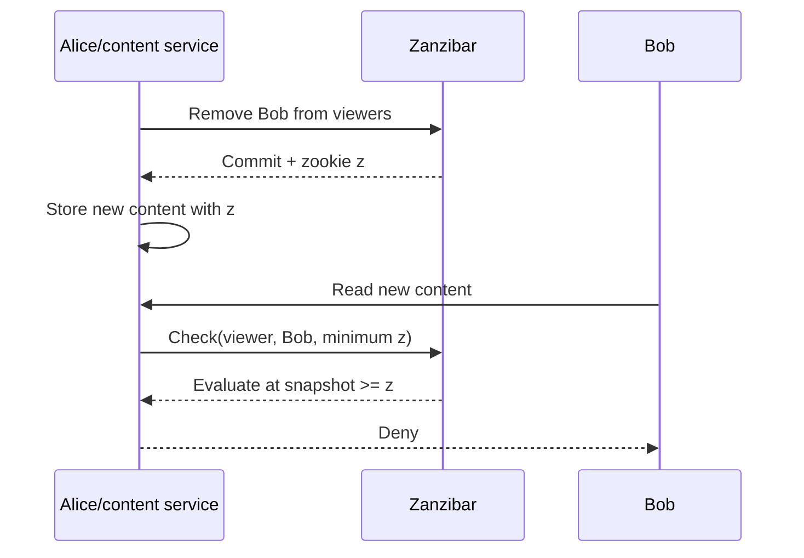
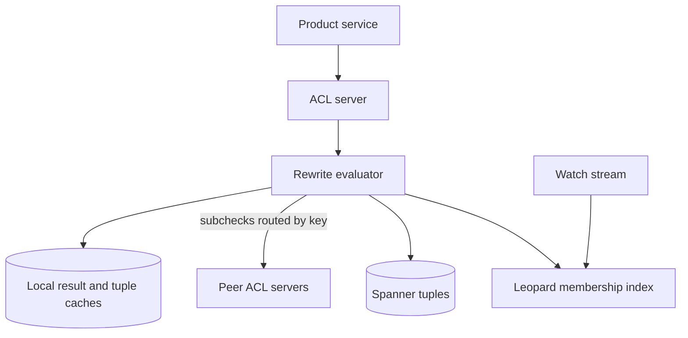

# Zanzibar: Google's Consistent, Global Authorization System

## Publication Boundary

- **Paper:** *Zanzibar: Google's Consistent, Global Authorization System*
- **Venue and version:** USENIX Annual Technical Conference 2019, proceedings paper, pages 33–46
- **Authors:** Ruoming Pang, Ramón Cáceres, Mike Burrows, Zhifeng Chen, Pratik Dave, Nathan Germer, Alexander Golynski, Kevin Graney, Nina Kang, Lea Kissner, Jeffrey L. Korn, Abhishek Parmar, Christopher D. Richards, and Mengzhi Wang
- **Evaluated system:** Google's internal production deployment, with measurements primarily from December 2018 and longer availability observations where stated

Scope: Zanzibar as published; open-source relationship-based authorization systems and subsequent Google changes are **later evolution**, not evaluation evidence.

## Problem and Workload

Google products needed one authorization substrate for sharing-shaped policies: direct users, groups nested in groups, folders containing resources, and roles implying other roles. Authorization is on a serving critical path, but stale permissions can disclose data.

The paper reported, at its measurement boundary:

- more than 1,500 authorization namespaces,
- more than 2 trillion stored relation tuples occupying about 100 TB,
- full replication across more than 30 locations,
- more than 10 million total queries/s at peak,
- more than 10,000 servers across several dozen clusters.

For one seven-day sample in December 2018, daily peaks were approximately 4.2 million `Check` calls/s, 8.2 million `Read` calls/s, 760,000 `Expand` calls/s, and 25,000 `Write` calls/s. These are different API operations and must not be collapsed into “10 million authorization decisions/s.”

## Contract and Invariants

Zanzibar needs more than low-latency graph traversal. Its correctness contract includes:

1. **External consistency of ACL writes:** completed writes appear in an order compatible with real time.
2. **Snapshot evaluation:** one authorization computation observes relation tuples at a coherent snapshot.
3. **Causal freshness floor:** a content object can require its authorization check to use an ACL snapshot no older than a supplied token.
4. **Namespace isolation:** each application's relation vocabulary and rewrite rules are configured explicitly.
5. **Bounded recursion and work:** the service must stop pathological policy graphs from consuming unbounded resources.

The paper does not claim instantaneous global revocation independent of client behavior. The content service must persist and later pass the appropriate consistency token. If it omits that protocol, Zanzibar cannot infer the causal boundary.

## State Model: Relation Tuples

A relation tuple has the conceptual form:

```text
<object>#<relation>@<user-or-userset>
```

Examples:

```text
document:roadmap#owner@user:alice
document:roadmap#parent@folder:planning
folder:planning#viewer@group:eng#member
```

The final subject can be a concrete user or another userset such as `group:eng#member`. This indirection represents group membership and resource inheritance without materializing every effective user on every resource.

Each namespace declares relations and **userset rewrite rules**. A relation can be computed from:

- `this`: tuples stored directly for the relation,
- a computed userset: another relation on the same object,
- a tuple-to-userset: follow a tupleset edge, then evaluate a relation on each target,
- union, intersection, and exclusion of subexpressions.

Conceptually, a viewer rule might be:

$$
Viewer(d)=DirectViewer(d) \cup Editor(d) \cup
\bigcup_{p\in Parent(d)} Viewer(p)
$$

This is a restricted authorization algebra, not arbitrary application code. Restriction makes evaluation, dependency tracking, caching, and review tractable.

## API Surface and Semantics

| API | Purpose | Important semantic boundary |
|---|---|---|
| `Write` | Add/delete relation tuples, with preconditions | Commits through Spanner and returns a consistency token |
| `Read` | Enumerate tuples matching a pattern | Snapshot may be selected using consistency options |
| `Watch` | Stream tuple changes after a point | Supports downstream indexes and incremental consumers |
| `Check` | Test whether one subject belongs to an object relation | Recursively evaluates rewrites at one snapshot |
| `Expand` | Return a userset tree for a relation | A tree/expression, not necessarily a fully enumerated user list |

`Check` can distribute subproblems. A tuple-to-userset rule may read parent tuples, then check the requested relation on each parent. Union may return as soon as one positive branch is sufficient; intersection and exclusion require evidence from multiple branches. Query planning therefore depends on operator semantics, fan-out, cached subresults, and deadlines.

## The New-Enemy Problem

Consider this real-time order:

1. Alice removes Bob from a folder's viewers.
2. Alice adds new secret content governed by that folder.
3. Bob requests the new content.

An authorization replica with an old ACL snapshot can still see Bob as a viewer. Ordinary eventual consistency can therefore disclose content that did not exist until after revocation.



Zanzibar returns an opaque consistency token called a **zookie**. The client stores the relevant token with content and supplies it to later authorization checks. The server then evaluates at a snapshot at least as new as that token.

If ACL state has timestamp $t_a$ and the content carries minimum token $t_c$, the safety condition is:

$$
t_a \geq t_c
$$

The zookie does not contain the policy result and is not a capability. It constrains snapshot selection. Revocation correctness still depends on the content service sequencing its ACL/content operations and propagating the token.

## Storage and Snapshot Selection

Relation tuples and changelogs are stored in Spanner. Zanzibar uses Spanner's external consistency and globally meaningful timestamps rather than implementing a separate global ordering protocol. See [Spanner](./04-spanner.md).

Freshness has a latency cost. A sufficiently old “safe” snapshot can usually be served locally because replication is known to have caught up. A “recent” snapshot may require a more distant read or waiting for replication. In the paper's deployment, Spanner heartbeat intervals informed a safe timestamp more than roughly 10 seconds old; recent requests inside that window could pay much larger tails.

The crucial distinction is:

- **Default/bounded staleness** can select a statistically optimized snapshot when no causal minimum is supplied.
- **At-least-as-fresh** evaluation honors a zookie floor, even if that requires slower work.
- **Fully fresh** is not implied by every check; the point is the minimum snapshot required by the caller's causal context.

## Check Execution and Caching



The serving design exploits repeated subproblems. Requests are routed so the same object-relation subchecks tend to reach the same cache. Identical in-flight reads are coalesced, preventing a popular group from producing a thundering herd. Slow Spanner reads can be hedged; the paper says median Spanner reads were about 0.5 ms, p95 about 2 ms, and roughly 1% were hedged in the described setup.

At peak, the paper reported about 22 million delegated RPCs/s and about 200 million in-memory lookups/s. Caching and request coalescing avoided an estimated 500,000 additional internal RPCs/s. These figures reveal internal amplification: one external `Check` can trigger many cached or delegated suboperations.

Cache keys must include everything affecting meaning, including namespace configuration version and snapshot constraints. A cached allow from an older snapshot cannot satisfy a request carrying a newer zookie.

## Leopard: Materializing Large Group Membership

Recursive traversal is unsuitable for groups with massive or deeply nested membership. Zanzibar's Leopard subsystem materializes membership indexes offline and incrementally updates them from `Watch` changes.

Leopard represents sets and uses structures such as skip lists so membership and set intersection avoid enumerating an entire transitive graph at request time. This is a deliberate consistency/latency trade: use an asynchronously maintained index, but integrate snapshot/version rules so results do not silently violate the caller's freshness floor.

For a seven-day sample, the paper reported:

- median 1.56 million and p99 2.22 million Leopard queries/s,
- median latency below 150 microseconds and p99 below 1 ms,
- median about 500 and p99 about 1,500 updates/s.

Those numbers describe Leopard operations in the paper's production deployment, not end-to-end authorization latency.

## Quantitative Evaluation

### Server-side RPC latency

The December 2018 table reports server-side latency, not Internet client latency:

| Operation/mode | p50 | p95 | p99 |
|---|---:|---:|---:|
| `Check`, safe snapshot | 3.00 ms | 9.46 ms | 15.0 ms |
| `Check`, recent snapshot | 2.86 ms | 60.0 ms | 76.3 ms |
| `Write` | 127 ms | 233 ms | 401 ms |

The much larger recent-check tail is the cost of a stronger freshness constraint in a globally distributed system. A separate daily-peak figure showed approximately 3 ms p50, 11 ms p95, 20 ms p99, and 93 ms p99.9 for `Check`; do not mix those values with the table above without stating the different aggregation.

### Availability methodology

The paper's availability was measured with sampled/replayed requests and probers—three in each cluster—over rolling 90-day windows. A qualified RPC counted successful if it completed within 5 seconds for safe requests or 15 seconds for recent requests. Under that definition, Zanzibar reported more than 99.999% availability for three years.

This is a meaningful but specific metric. It includes generous deadline thresholds compared with ordinary check latency and reflects Google's internal client mix and deployment. It is not a theorem that a clone inherits five nines.

## Failure Semantics

| Failure | Expected behavior | Safety concern |
|---|---|---|
| Local ACL server loss | Route to another replica; rebuild caches | Latency and backend load spike |
| Spanner replica behind zookie | Wait or read from a sufficiently fresh location | Never satisfy the floor with stale cache data |
| One recursive branch times out | Respect operator semantics; return error/unknown when proof is incomplete | Fail-open can disclose data; blind fail-closed can cause outage |
| Watch consumer lags | Leopard/index declares its applied watermark | Index result must meet requested snapshot |
| Namespace config changes | Version caches and evaluators coherently | Old rewrite plus new tuples changes meaning |
| Hot group or object | Route/cache/coalesce and bound fan-out | A single policy node can amplify globally |
| Product omits zookie | Service can only honor requested/default consistency | Causal content/ACL ordering is lost outside Zanzibar |

For authorization, timeout semantics are part of policy. A caller must distinguish `DENY`, `ALLOW`, and “could not establish result.” Collapsing infrastructure failure into allow is unsafe; collapsing everything into deny can make the authorization service a global outage multiplier.

## Algorithmic Cost and Policy Design

Let the rewrite evaluation visit $V$ unique usersets and follow $E$ relation edges after cache hits. A naive upper bound is $O(V+E)$ remote/logical work, but latency follows the critical dependency path while resource cost follows total fan-out. Intersection and exclusion can force evaluation of branches that union might short-circuit.

Policy reviews should therefore budget:

- maximum rewrite depth,
- maximum parents or groups followed at one step,
- repeated subproblem cacheability,
- hot-key request rate,
- index-lag tolerance,
- the cost of negative checks, which may require proving absence.

Denormalizing every effective permission makes reads cheap but writes explode with group churn. Traversing everything live makes writes cheap but tails unbounded. Zanzibar uses both: live tuple/rewrite evaluation for the general case and Leopard materialization for the pathological membership case.

## Assumptions and Limits

1. The published system depends on Spanner and TrueTime-like globally ordered snapshots; that dependency is central, not incidental.
2. Google's centralized operational environment, private network, and full replication across many locations shape the evaluation.
3. Namespace rewrites are intentionally restricted and do not express arbitrary contextual policy code.
4. Clients must store and pass zookies correctly to obtain causal freshness.
5. Full replication of roughly 100 TB was acceptable for this workload; it is not a default for arbitrary authorization datasets.
6. The paper does not benchmark open-source systems, public-cloud multitenancy, or policy languages added later.
7. `Expand` returns a structural userset representation; enumerating every member of enormous groups remains undesirable.

## Design-Review Questions

1. What exact interleaving creates a “new enemy” in this product, and where is its freshness token persisted?
2. Does every content read carry the minimum authorization snapshot, including caches and asynchronous jobs?
3. Are `DENY`, `ALLOW`, timeout, and incomplete evaluation distinct in the API?
4. Which rewrite operators can short-circuit, and what is worst-case fan-out for negative checks?
5. What watermark proves an asynchronously maintained membership index is fresh enough?
6. Can a namespace change invalidate cached results atomically with tuple interpretation?
7. What happens to backend QPS when a popular cache key expires or one cluster restarts?
8. Does a stated latency percentile refer to safe, recent, or at-least-token consistency?
9. Is the availability SLI deadline aligned with the product's actual authorization deadline?
10. Which assumptions come from Spanner and cannot be copied by duplicating only the tuple API?

## Later Evolution and Influence

SpiceDB, OpenFGA, and other systems later adopted related tuple/rewrite APIs and consistency-token ideas. They have different policy languages, storage engines, consistency contracts, and deployment models. They should be studied as descendants, not described as implementations proven equivalent by the 2019 paper.

The durable lessons are narrower and stronger:

- authorization needs an explicit snapshot contract;
- revocation-sensitive data should carry its minimum policy version;
- restricted policy algebra enables distributed evaluation and caching;
- materialize only the graph regions whose live traversal is pathological;
- availability methodology must include consistency mode and deadline.

## Primary Reference

- [Zanzibar: Google's Consistent, Global Authorization System — USENIX ATC 2019 (paper PDF)](https://www.usenix.org/system/files/atc19-pang.pdf)

## Related Chapters

- [Spanner](./04-spanner.md)
- [Authorization at Scale](../10-security/07-authorization-patterns.md)
- [Consistency Models](../01-foundations/04-consistency-models.md)
- [Conflict Resolution](../02-distributed-databases/04-conflict-resolution.md)
- [Change Data Capture](../13-data-pipelines/04-change-data-capture.md)
- [Retries, Timeouts, and Hedging](../06-scaling/10-retries-timeouts-hedging.md)
