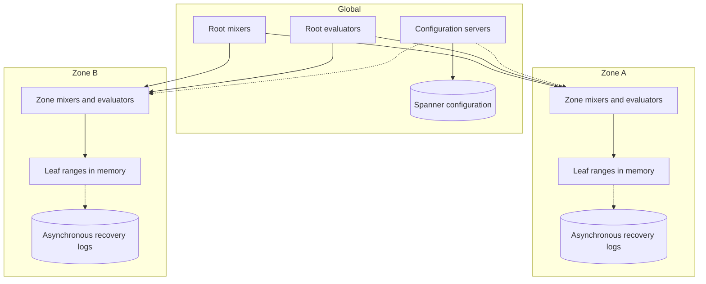
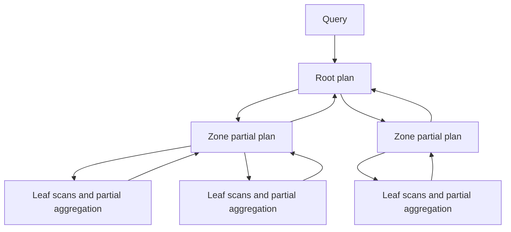

# Monarch: Google's Planet-Scale In-Memory Time Series Database

## Publication Boundary

- **Paper:** *Monarch: Google's Planet-Scale In-Memory Time Series Database*
- **Venue and version:** Proceedings of the VLDB Endowment, volume 13, issue 12, pages 3181–3194, 2020
- **Evaluated system:** Google's internal Monarch deployment, primarily a July 2019 snapshot plus production query experiments
- **Evaluation boundary:** internal monitoring workloads only; the paper says externally hosted customer data was excluded

Monarch is a monitoring database, not a general durable OLTP store. Its unusual decisions follow from that workload: recent data matters most, partial results are often useful, and monitoring must remain available while infrastructure it observes is impaired.

## Workload and Published Scale

At the paper's snapshot, Monarch served about 30,000 employees and teams, ran roughly 400,000 tasks, and spanned 38 zones on five continents. It reported:

- approximately 950 billion active time series,
- about 750 TB of in-memory state,
- about 2.2 TB/s of ingestion,
- more than 6 million queries/s,
- roughly 95% of queries as continuously evaluated **standing queries**.

The 38 zones were heterogeneous: 5 had fewer than 100 leaf processes, 16 fewer than 1,000, 11 fewer than 10,000, and 6 at least 10,000. “Planet scale” here means one highly skewed federation of autonomous zones, not 38 identical replicas of all series.

## Requirements and Chosen Guarantees

Monitoring changes the consistency hierarchy:

1. **Local visibility during failure is more valuable than synchronous durable ingest.** If storage or a remote region is down, a zone should continue accepting and evaluating measurements.
2. **Partial answers are more valuable than global unavailability.** A query should identify missing zones or leaves rather than wait without bound.
3. **Recent memory-resident data dominates.** The paper focuses on the in-memory system; its long-term repository is explicitly outside scope.
4. **Standing queries must not depend on a global coordinator.** Alerts are needed during the same partitions that break global dependencies.
5. **Cardinality and fan-out must be reduced before crossing hierarchy levels.** Shipping all raw series to a root would make global queries infeasible.

The system is therefore available and partition tolerant by product choice, with possible metric loss, lag, and incomplete global results. Calling it simply “AP” is too coarse: configuration uses Spanner, individual ranges can have replicas, and query semantics explicitly account for missing data.

## Data Model

A Monarch time series combines:

- a **target schema** identifying the monitored entity, such as cluster, job, and task,
- a **metric schema** identifying the measurement and its fields,
- timestamped values, potentially with multiple typed columns.

The schema makes target and metric dimensions first-class. It enables type checking, field-aware filtering, aggregation planning, and indexes over which field values may exist in a storage range.

Monarch supports distribution-valued points. Instead of exporting a precomputed p99 per task, a task can export a latency distribution; the query combines distributions and computes a percentile after aggregation. In general:

$$
Q_{0.99}\left(\bigcup_i H_i\right)
\neq \frac{1}{k}\sum_i Q_{0.99}(H_i)
$$

where $H_i$ is one task's latency distribution. Averaging percentiles is not a valid fleet percentile. Distribution values and exemplars preserve enough structure to aggregate correctly and connect a bucket to representative events.

## Regionalized Architecture

Leaves hold recent time-series state in RAM. Zone mixers route and combine work within a zone. Root mixers coordinate global ad hoc queries. Evaluators run standing queries; placing them at the lowest sufficient level keeps alert execution within a zone when possible.

Configuration is a thinner global dependency and is backed by Spanner. Zones use cached configuration so transient disconnection does not immediately stop data collection or standing-query evaluation.

## Partitioning and Replication

Leaves own lexicographic ranges of target keys. A range has one to three replicas, placed in distinct failure domains. Range boundaries let the system move and split contiguous target-key space while preserving locality for common filters such as cluster/job/task.

The paper's move protocol prioritizes continued collection:

1. The destination begins collecting new data for the range.
2. It waits about one second so new traffic has arrived.
3. It replays recovery logs, newest data first.
4. When the destination is ready, the source stops owning the range.

Newest-first replay makes the most operationally valuable interval available first. It is not a transactionally atomic range migration, and duplicate/overlapping collection must be reconciled according to metric timestamp semantics.

Range replication helps machine and rack failures, but Monarch does not synchronously replicate every ingest through durable consensus. Replica count is a placement/cost setting, not a global durability guarantee.

## Recovery Logs: Deliberately Off the Commit Path

Leaves write best-effort recovery logs to multiple Colossus clusters, with asynchronous replication to three clusters. The leaf does **not** wait for that write before accepting a measurement. If all Colossus clusters are unavailable, the zone continues collecting.

This yields an explicit contract:

$$
\text{ingest availability} > \text{zero-loss durability}
$$

Recovery logs reduce loss after a leaf restart, but they are not a write-ahead log whose fsync defines acknowledgment. Logs may lag by up to roughly 70 seconds in the described design: a 10-second TrueTime delta period plus aggregation buckets that can be as large as 60 seconds.

This choice is valid because the data is telemetry. It would be invalid for payments, authorization mutations, or any application whose acknowledged write is a business record. Compare with [Write-Ahead Logging](../03-storage-engines/04-write-ahead-logging.md).

## Collection-Time Aggregation

Monarch can aggregate before storage. The paper reported an average reduction of 36 input time series to one output series, with an extreme case exceeding one million inputs to one output. One CPU core could aggregate about one million typical input series, using roughly 25% CPU in the reported example.

Aggregation changes the data contract. A rollup must preserve operations the product will need later:

- counters require sums plus reset semantics,
- gauges may require min/max/last rather than a mean,
- distributions require mergeable buckets or sketches,
- distinct counts need an explicit approximation structure,
- labels removed by aggregation cannot be recovered.

If input rate is $R$ bytes/s and collection aggregation ratio is $a$ input bytes per output byte, an illustrative downstream rate is:

$$
R_{downstream}=\frac{R}{a}
$$

At the paper's 2.2 TB/s scale and its reported average 36:1 series-count reduction, it would be wrong to assert exactly $2.2/36$ TB/s of bytes: series count, point encoding, distribution size, and compression differ. Capacity must measure byte reduction separately from series reduction.

## Query Language and Execution Tree

Monarch's query language is relational in shape: select time series, align samples, filter, group and aggregate, join, and transform values. Execution mirrors the storage hierarchy:

Filters and partial aggregation are pushed toward leaves. Zone-level grouping combines leaf partials before the root. A join should execute at the lowest level where both inputs are colocated; moving it upward increases network volume and coordinator memory.

The paper measured leaf output at 23.3% of leaf input, about a 4× reduction, across the production workload. This is an aggregate observation; individual queries can reduce by orders of magnitude or expand.

## Field Hints Index

The root needs to know which leaf ranges might contain fields or values referenced by a query. Blind fan-out to tens of thousands of leaves is expensive even when most respond “empty.” Monarch's **field hints index (FHI)** stores compact fingerprints that suppress impossible destinations.

The published root index held about 170 million fingerprints. The paper reported:

- average potential fan-out reduced from 34 ranges to about 9,
- about 4 ranges actually contacted on average after other planning effects,
- at least 99.2% of irrelevant zone destinations suppressed,
- about 1.3 bytes per fingerprint on average.

Fingerprints can produce false positives but must not produce false negatives if used to prune. Staleness must therefore err toward contacting extra leaves, not skipping a range that may contain data.

## Standing Queries

About 95% of queries were standing queries: continuously reevaluated rules used for aggregation and monitoring. They can be compiled, placed, and reused rather than reparsed and globally planned every interval.

Placement is a correctness and availability decision:

- A query over one zone can run in that zone and survive root isolation.
- A global query requires root coordination and can return partial data during partition.
- Preaggregation should occur before sending results upward.
- Configuration rollout must identify which version each evaluator runs.

The design makes the repetitive workload structurally cheap and local, rather than treating alert rules as repeated ad hoc queries.

## Quantitative Query Evaluation

### Production latency distribution

The paper reported root-query median latency of 79 ms and p99.9 latency of about 6 seconds. The p99.9 query read about 12,500 input series. In large and huge zones, p99.9 latency approached 50 seconds for queries touching roughly 9–23 million series.

The distribution demonstrates why “median 79 ms” does not describe global investigation queries. Fan-out, data volume, operators, and stragglers dominate the tail.

### Optimization ablation on one query

For one query reading about 0.3 million input series, the complete optimizer suggested about 68,000 leaves, identified roughly 40,000 relevant leaves, and completed in 6.73 seconds. Disabling or moving optimizations produced:

| Variant | Latency | Leaves/placement note |
|---|---:|---|
| Full optimization | 6.73 s | About 40,000 relevant of 68,000 suggested |
| Group-by moved to zone | 9.75 s | More intermediate data |
| Group-by moved to root | 34.44 s | Root/network bottleneck |
| Joins at zone | 242.5 s | Large shuffle/intermediate state |
| Joins at root | 1,728.3 s | Centralized explosion |
| No field hints index | 67.54 s | About 141,000 leaves contacted |

This is one selected query, not a general speedup factor. Its value is causal: operator placement and destination pruning alter orders of magnitude of work.

## Failure Semantics

| Failure | Preserved function | Degraded result |
|---|---|---|
| Leaf process loss | Replicas/recovery logs restore recent range data | Unlogged recent samples may be lost |
| All recovery-log stores unavailable | Live collection continues | Restart RPO grows |
| Root/global partition | Zonal collection and local standing queries continue | Global queries are partial/unavailable |
| One zone unreachable | Other zones answer | Result must identify missing zone |
| Stale configuration | Cached rules continue | Query/alert definition may lag |
| FHI stale positive | Query contacts an unnecessary leaf | Extra cost only |
| FHI false negative bug | Relevant data is silently omitted | Correctness failure; index design must prevent it |
| Slow huge query | Bound resources and deadlines | Partial/error instead of starving standing queries |

Partial query metadata is part of correctness. A graph that silently omits an unavailable zone can look healthy precisely during an outage.

## Assumptions and Limits

1. Monitoring tolerates bounded data loss and staleness; business transactions often do not.
2. The paper focuses on memory-resident recent data and omits the long-term repository design.
3. The evaluation is Google's internal workload and hardware, not a portable benchmark.
4. Most queries are known standing queries, which favors compilation and placement.
5. Schema and collection aggregation intentionally trade arbitrary future analysis for bounded cardinality and cost.
6. Zones are operationally autonomous but still consume globally managed configuration when reachable.
7. The paper's scale figures do not imply one query can scan all 950 billion series within interactive latency.

## Design-Review Questions

1. Which alerting functions survive loss of the global plane and of the durable storage service?
2. What acknowledged telemetry can be lost, and how is the RPO measured under log lag and leaf failure?
3. Does every partial query disclose missing ranges/zones to its caller?
4. Which labels are removed at collection time, and which investigations become impossible afterward?
5. Can distribution/sketch values be merged without statistical error introduced by incompatible buckets?
6. At what hierarchy level can each group-by and join execute, and what bytes cross the next level?
7. Can the pruning index ever produce a false negative during updates or range moves?
8. Are standing-query configuration versions visible in alert output?
9. How are huge ad hoc queries isolated from alert evaluation?
10. Are series-count, sample-rate, memory, and byte-ingest reductions measured separately?

## Lessons That Generalize

1. Availability policy should follow data value: monitoring can rationally accept loss to avoid sharing fate with its storage dependencies.
2. Regional autonomy is strongest when ingestion, recent state, and alert evaluation all remain inside the region.
3. Query trees scale when filtering, aggregation, and joins execute at the lowest valid level.
4. A compact routing index can eliminate most empty fan-out, but its false-negative contract must be explicit.
5. Preaggregation is a schema decision, not just an optimization; discarded dimensions are irrecoverable.
6. Tail evaluation needs workload size and operator placement, not a single platform latency number.

## Primary Reference

- [Monarch: Google's Planet-Scale In-Memory Time Series Database (PVLDB 13(12), 2020)](https://www.vldb.org/pvldb/vol13/p3181-adams.pdf)

## Related Chapters

- [Metrics Systems and Monitoring](../11-observability/02-metrics-monitoring.md)
- [Alert Evaluation and Notification](../11-observability/04-alerting.md)
- [Distributed Tracing](../11-observability/01-distributed-tracing.md)
- [Cell-Based Architecture](../06-scaling/11-cell-based-architecture.md)
- [Partitioning Strategies](../02-distributed-databases/05-partitioning-strategies.md)
- [SLOs and Error Budgets](../11-observability/05-slos-error-budgets.md)
