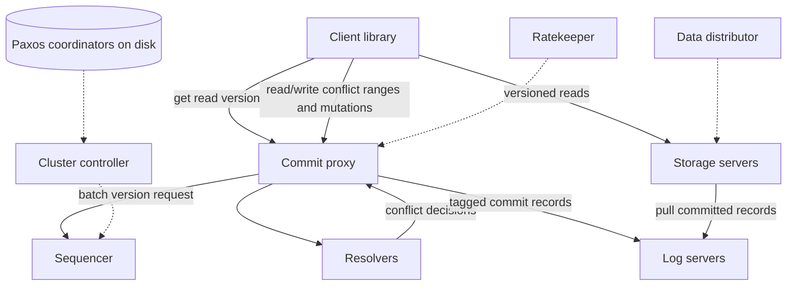

# FoundationDB: A Distributed, Unbundled, Transactional Key-Value Store

## Publication Boundary

- **Paper:** *FoundationDB: A Distributed Unbundled Transactional Key Value Store*
- **Venue and version:** ACM SIGMOD 2021, DOI 10.1145/3448016.3457559, 14-page proceedings paper
- **Evaluated system:** production deployments and controlled experiments described in the paper, including a 58-machine production cluster and a separate 27-machine test cluster

This analysis covers the 2021 paper's architecture and measurements. Current documentation is not evidence for the evaluated storage engines, role placement, or product limits.

## Contract and Workload Envelope

FoundationDB exposes an ordered key-value space with ACID transactions and **strict serializability**. Higher-level data models are built as layers over that substrate.

The paper's important limits are part of the design:

- keys are at most 10 KB,
- values are at most 100 KB,
- one transaction is at most 10 MB,
- transactions are expected to complete within a roughly 5-second MVCC window.

The system is optimized for short, conflict-light transactions. It is not a transparent distributed replacement for an unbounded analytics transaction or a workflow that holds locks for minutes.

Core invariants are:

1. A transaction reads from one committed version.
2. A committed transaction is ordered at one commit version.
3. No committed write changed a declared read-conflict range between the transaction's read and commit versions.
4. A commit is acknowledged only after the required log replicas have made it durable.
5. Storage replicas apply a committed prefix of the log, even though they can lag the commit path.
6. A recovery epoch has one valid transaction system; old roles cannot keep committing into the new epoch.

## Unbundled Roles and State



### Transaction system

- The **sequencer** assigns versions. The paper describes capacity around one million versions/s by batching many transactions into each version.
- **Commit proxies** batch client work, obtain versions, coordinate conflict checks, and write commit records.
- **Resolvers** keep recent conflict metadata partitioned by key range. They do not store user values.
- **Log servers** are the durable ordered mutation stream for designated tags.

### Storage system

Storage servers own key ranges, serve MVCC reads, and asynchronously pull their tagged mutations from log servers. The paper's evaluated version used a modified SQLite engine. Storage is therefore outside the synchronous commit critical path after the log is durable.

### Control system

Disk Paxos coordinators help elect a cluster controller. The controller recruits singleton and distributed roles. The **data distributor** balances ranges and restores replication; the **ratekeeper** throttles work before lag, queueing, or storage pressure destroys the cluster.

Unbundling means these roles scale and recover independently. It also creates queues and version-lag contracts between them that must be monitored.

## Transaction Protocol

### Read phase

1. The client asks a proxy for a read version.
2. The proxy batches the request and obtains a version from the sequencer.
3. The client reads key ranges directly from storage servers at that version.
4. The client records read-conflict ranges and buffers mutations locally.

Reads need not pass through proxies after version selection. This removes values from the transaction coordinator and lets storage scale by range.

### Commit phase

1. The client sends mutations plus read/write conflict ranges to a proxy.
2. The proxy obtains a commit version.
3. Relevant resolvers decide whether any committed write intersected the transaction's read-conflict ranges since its read version.
4. If admitted, the proxy sends the commit record to the required log servers.
5. After those logs persist the record, the proxy acknowledges commit.
6. Storage servers later pull and apply the mutations.

For transaction $T$ with read version $v_r$, commit version $v_c$, read-conflict set $R_T$, and intervening committed write sets $W_i$, OCC admits it only if:

$$
R_T \cap \left(\bigcup_{v_r < v_i < v_c} W_i\right)=\varnothing
$$

Applications can omit conflict ranges for intentionally snapshot-style reads, so API use participates in correctness.

### Resolver partitioning and false conflicts

Conflict ranges are partitioned among resolvers. To avoid a distributed transaction among resolvers, a transaction touching multiple resolver partitions can be conservatively rejected if one resolver has already advanced and another reports a conflict. This creates false-positive aborts, not false commits. The bounded five-second history keeps resolver memory finite.

The paper said conflicts were generally below 1% in production and reported 0.73% for one cluster. That workload evidence does not mean hot-counter designs will remain conflict-light.

## MVCC, Version Lag, and Flow Control

Storage servers retain versions long enough for ordinary transactions. If a client holds a read version beyond the window, the required historical value may be gone and the transaction must restart.

The pipeline has multiple lag variables:

$$
L_{log}=v_{commit}-v_{durable\ log}, \qquad
L_{storage}=v_{durable\ log}-v_{applied\ storage}
$$

Ratekeeper admission prevents these queues from growing without bound. Backpressure is part of consistency: if storage cannot retain the MVCC window while ingest continues, readers lose their snapshot and recovery work compounds.

## Failure and Recovery Protocol

FoundationDB reacts to many role failures by terminating the current transaction system and recruiting a new one. Existing storage servers can continue serving sufficiently old committed reads while writes pause and clients retry.

Recovery must determine one recovery version using durable log state. The protocol uses known committed/durable version information so transactions are neither forgotten nor committed twice across epochs. A short tail of old logs is copied into the new log system. The new transaction system can begin accepting work before all storage servers finish replaying, because they continue pulling tagged history.

```text
detect failure
  -> fence old transaction epoch
  -> inspect durable log versions
  -> select recovery version
  -> recruit sequencer/proxies/resolvers/logs
  -> copy required log tail
  -> resume transactions
  -> storage catches up asynchronously
```

The paper reported one production recovery in August 2020 taking 8.61 seconds. Across 289 production reconfigurations on clusters containing hundreds of terabytes, median duration was 3.08 seconds and p90 5.28 seconds. Reads were unaffected in the reported reconfiguration metric; read-write transactions were blocked and retried. These measurements are not a universal failover SLO.

## Deterministic Simulation Testing

The production Flow code can run in a deterministic simulator inside one process. Network, disk, time, process scheduling, and random choices are replaced by simulated interfaces. A seed fixes the event sequence, so a failure can be replayed.

The simulator injects:

- process, machine, rack, and data-center failures,
- partitions, delay, reordering, and asymmetric reachability,
- disk errors and corruption,
- clock/time progression and resource stress,
- unlikely code paths through `BUGGIFY`,
- randomized “swarm” combinations of configuration and faults.

Correctness workloads maintain models and invariants while the simulator advances discrete events. Quiet time advances without sleeping, so long failure sequences can be explored quickly.

### What simulation does not prove

1. The fault model can omit real failure modes.
2. Components outside Flow or using third-party libraries are harder to simulate faithfully.
3. Deterministic functional simulation does not predict real performance or hardware timing.
4. Bugs in the simulator or test oracle can mask implementation bugs.
5. All nondeterminism must pass through controlled interfaces; bypasses reduce replay fidelity.

Simulation complements checksums, production validation, benchmarks, and disaster testing. It is not a formal proof.

## Quantitative Evaluation

### Production cluster

The paper's 58-machine example used 25 machines in a primary site, 25 in a remote site, and two satellite groups of four. Reported network latency was about 6.5 ms and 65.2 ms from the primary to the satellite groups and 60.6 ms over the WAN. It ran 862 database processes plus 55 spares, stored 292 TB, and used 464 SSDs.

Over one month it averaged:

| Metric | Reported value |
|---|---:|
| Read transactions | 390,400/s |
| Keys read | 1,467,000/s |
| Write transactions | 138,500/s |
| Read latency, mean / p99.9 | about 1 ms / 19 ms |
| Commit latency, mean / p99.9 | about 22 ms / 281 ms |

The configuration used asynchronous remote replication, so the remote site's WAN was not necessarily on every commit's acknowledgment path.

### Controlled test cluster

The separate test used 27 machines, each with 16 2.5 GHz cores, 256 GB RAM, eight SSDs, and 10 GbE. Keys were 16 bytes; values were uniformly 8–100 bytes with 54-byte mean; data was not fully cached.

Below 100,000 operations/s on a 24-machine configuration, the paper reported about 0.35 ms mean key-read latency, 1 ms get-read-version latency, and 2 ms commit latency. At roughly 2 million operations/s, proxy/resolver saturation drove commit latency to about 368 ms. This demonstrates the queueing knee: low-load latency says little about admission capacity.

### Integrity evidence

The authors reported more than 0.5 million CloudKit disk-years without detected corruption and no inconsistent replica found by their consistency checks. This is a scoped operational observation by the system authors, not proof that storage media never corrupt or every deployment has the same checks.

## Assumptions and Limits

1. One sequencer orders each transaction-system epoch; the design is not leaderless.
2. Strict serializability depends on bounded, correctly declared conflict ranges and transaction duration.
3. High-conflict workloads repeatedly abort under optimistic concurrency control.
4. The paper's geo configuration does not imply arbitrary globally synchronous write topologies.
5. Key-value operations and layers are not a SQL optimizer or cross-system transaction protocol.
6. Simulator confidence depends on model fidelity and controlled nondeterminism.
7. Storage-server engine details in current releases may differ from the paper.

## Design-Review Questions

1. Which exact log acknowledgments make commit durable under each replication policy?
2. Can a client accidentally omit a read-conflict range and violate its intended invariant?
3. What are conflict and retry distributions by key range, not just fleet average?
4. At what lag does ratekeeper throttle, and can the control loop oscillate?
5. How long can storage retain the read version during overload and recovery?
6. How is the old transaction epoch fenced after a partition?
7. Can recovery resume before all storage catches up without serving a value newer/older than the requested version?
8. Which production dependencies bypass deterministic simulation?
9. Does every simulator failure retain seed, binaries, configuration, and workload for exact replay?
10. Are latency figures tied to replication topology, data cache state, and offered load?

## Lessons That Generalize

1. Separating ordering, conflict detection, durable logging, and value storage can scale each role independently, but makes lag control a first-class protocol.
2. OCC gives excellent conflict-light throughput and makes hot logical records an application-visible bottleneck.
3. A durable ordered log lets storage recovery leave the synchronous commit path.
4. Fast recovery comes from fencing epochs and copying only the required log tail, not rebuilding every replica before service resumes.
5. Deterministic simulation transforms rare failures into replayable tests, provided the environment and oracles are faithful.
6. Product limits such as transaction size and lifetime are load-bearing correctness and memory bounds.

## Primary Reference

- [FoundationDB: A Distributed Unbundled Transactional Key Value Store (SIGMOD 2021)](https://www.foundationdb.org/files/fdb-paper.pdf)

## Related Chapters

- [Distributed Transactions](../02-distributed-databases/07-distributed-transactions.md)
- [B-Trees](../03-storage-engines/01-b-trees.md)
- [Write-Ahead Logging](../03-storage-engines/04-write-ahead-logging.md)
- [Aurora](./09-aurora.md)
- [Spanner](./04-spanner.md)
- [Disaster Recovery](../15-deployment/05-disaster-recovery.md)
