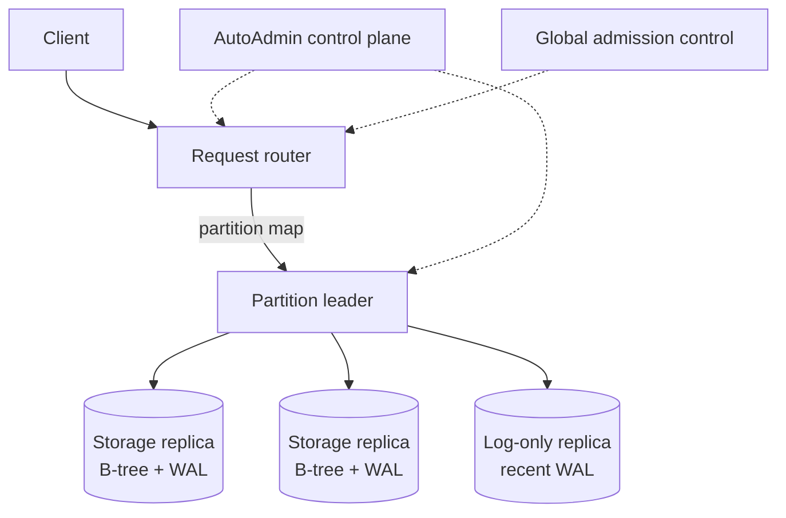

# Amazon DynamoDB (2022): Predictability as the Product

## Publication Boundary

- **Paper:** *Amazon DynamoDB: A Scalable, Predictably Performant, and Fully Managed NoSQL Database Service*
- **Venue and version:** USENIX Annual Technical Conference 2022 proceedings paper
- **Evaluated system:** DynamoDB as described through 2021, with selected production observations and one YCSB microbenchmark

This is not the 2007 Dynamo architecture. It is also not current product documentation. Capacity-unit definitions, on-demand behavior, backup retention, and features can evolve; the values below are pinned to the paper.

## Workload and Published Context

The service provides managed key-value/document tables with single-digit-millisecond performance as a design goal across widely varying table sizes and traffic. During the 66 hours of Amazon's 2021 Prime Day event, Amazon systems made trillions of DynamoDB calls and the paper reported a peak of 89.2 million requests/s.

That number describes an Amazon event window, not every customer, one table, one region, or a sustained global benchmark. The paper's central subject is predictable multitenant operation: skew, partitions, failures, changing capacity, and control-plane independence.

## Data and Consistency Contract

Table items are addressed by a partition key and optionally a sort key. Contiguous key ranges are assigned to partitions. Each partition is replicated across Availability Zones.

The paper-era capacity units were:

- one read capacity unit: one strongly consistent read/s for an item up to 4 KiB,
- one write capacity unit: one write/s for an item up to 1 KiB.

Larger items consume multiple units, and eventually consistent reads have different accounting. Capacity admission and storage placement are distinct: a logical table budget should not be rigidly divided by the number of physical partitions.

Within a replication group, Multi-Paxos and leases establish a leader. The leader serves writes and strongly consistent reads; an eventually consistent read can use another replica. A write is acknowledged after a quorum has durably persisted its write-ahead-log record.

Key invariants are:

1. One valid leader/lease controls a partition's write order.
2. A committed write survives the loss of a minority of replicas.
3. Strong reads observe leader-ordered state; eventual reads may lag.
4. Table-level admission stays within the purchased/derived budget while local limits protect shared nodes.
5. Partition maps and cached dependencies allow the data plane to continue through many control-plane failures.

## Partition Replication and Storage

The paper describes three full storage replicas with B-trees and WALs, distributed across failure domains. It also describes a **log-only replica** that can store recent WAL without first copying the full B-tree. After a failure, this role can restore a durability quorum in seconds; a full storage replica can take minutes to build.

The distinction is valuable:

- **durability repair** needs another durable copy of new log records immediately,
- **capacity/read repair** needs a complete storage image eventually.

Combining both into one full-copy operation would leave the group under-replicated longer.

## Admission Control: From Partitions to Tables

### Why static partition budgets fail

Suppose a table buys $C$ write units and has $P$ partitions. A static allocation gives each partition $C/P$. If one partition receives most writes, it throttles even while the table has unused capacity elsewhere. Splitting that partition can make the apparent budget per child smaller—**throughput dilution**.

The paper describes an evolution:

1. **Static allocation:** simple but punishes skew.
2. **Burst capacity:** token buckets let a partition temporarily consume unused capacity.
3. **Adaptive capacity:** observations reallocate more table budget toward hot partitions. It is reactive and best effort; the paper says it eliminated more than 99.99% of throttling caused by skew in the measured deployment.
4. **Global admission control (GAC):** ephemeral services track table-level tokens; routers receive time-limited local token grants refreshed every few seconds. Per-partition and per-node defenses still protect physical resources.

The architecture is logically centralized and physically distributed:

$$
\sum_{r\in Routers} grant_r(t) \leq Budget_{table}(t)+Burst(t)
$$

subject to grant expiry and reconciliation. Expiring leases/tokens bound overspend when a router disconnects. Local enforcement keeps admission available without consulting a central service per request.

GAC does not make a single hot item infinitely scalable. One item remains on one replication group and one leader path.

## Split for Consumption

Size-only splitting does not necessarily help a small but hot partition. DynamoDB observes access distribution and can split a partition for **consumption**, choosing a boundary that separates hot key ranges.

The operation takes minutes in the paper's account, so it is not an instantaneous response to a burst. Splitting is avoided when it would not distribute load—for example, one hot item or a sequential access pattern concentrated at one moving edge.

Partition design remains an application responsibility. A random write suffix can spread a hot logical counter but makes reads fan out; a time bucket can bound fan-out but creates rollover hotspots. See [Partitioning Strategies](../02-distributed-databases/05-partitioning-strategies.md).

## On-Demand Capacity

In the paper-era description, on-demand mode could immediately accommodate up to twice a table's previous peak and then scale with observed traffic. This is not “unlimited instant capacity.” New tables, sudden jumps beyond the learned peak, one hot key, and physical partition creation remain constrained.

The managed service converts capacity planning into an internal feedback loop, but conservation still applies:

$$
\text{admitted work} \leq \min(\text{table budget},\ \text{partition capacity},\ \text{node capacity})
$$

Routers should reject excess load before queues destroy latency predictability.

## Durability as Continuous Verification

DynamoDB keeps three WAL copies across Availability Zones and archives logs to S3. The paper emphasizes verifying data at multiple layers:

- checksums on log entries, messages, and files,
- archive validation and detection of missing log segments,
- scrubbing that compares all three replicas,
- offline reconstruction of a replica and comparison with live state,
- failure injection against implementation behavior,
- TLA+ specifications and model checking for core protocols.

Checksums detect corruption; they do not repair it. Independent replicas, archives, and reconstruction paths provide candidate correct copies. A restore test is valuable only if it reaches a queryable, compared result rather than merely proving bytes can be downloaded.

The paper-era backup service produced a consistent backup to the nearest second and point-in-time recovery for the preceding 35 days. These are historical paper claims, not current product limits.

## Failure Detection, Leases, and Gray Failures

With three Availability-Zone replicas, a 2-of-3 quorum can continue after one replica/AZ path is lost. On leader failure, a new leader normally waits for the prior lease to expire—described as a couple of seconds—unless the old leader gracefully relinquishes it.

Gray failures are harder: one node may believe the leader is unreachable while peers can still reach it. Before triggering failover, a follower asks peers about their view. This corroboration reduces unnecessary elections and lease waits caused by one asymmetric network path.

During failover, safety outranks immediate availability. Serving two leaders before the old lease expires risks divergent write order.

## Static Stability

The data plane caches partition maps and security dependencies. IAM and KMS-derived information is cached and refreshed asynchronously so request traffic does not scale backend dependency traffic. Control services manage splits, movement, and health, but existing partitions can keep serving during many control-plane outages.

Static stability does not mean “no dependencies.” It means the steady-state data path does not require a new control-plane round trip for each request and cached state has safe expiry/failure rules.

## Quantitative Evaluation

The controlled benchmark used YCSB workloads A and B, uniformly distributed keys, 900-byte items, and a production deployment in Northern Virginia. Offered load rose from 100,000 to 1 million operations/s. The paper's graphs showed little variation in p50 and p99 read/write latency across that range.

The text does not provide precise numerical latency values for every curve. Reading pixels from a graph and reporting them as exact measurements would create false precision. The benchmark establishes predictability for uniform 900-byte access under the selected topology; it does not evaluate hot keys, large items, transactions, or every region.

The Prime Day 89.2 million requests/s figure and this YCSB experiment have different workloads and scopes. They must not be combined into one throughput/latency claim.

## Failure Analysis

| Failure | Data-plane behavior | Residual risk |
|---|---|---|
| One storage replica/AZ lost | Quorum continues; add log-only replica quickly | Reduced failure margin until repair |
| Leader unreachable | Corroborate gray failure; elect after safe lease boundary | Seconds of unavailability |
| Control plane unavailable | Existing maps/leases continue | No timely split or rebalance |
| GAC server/router partition | Time-limited local tokens expire; local defenses remain | Temporary under- or over-admission within bounds |
| One hot item | Per-item leader saturates | Splitting range does not help |
| Rapid traffic > learned peak | Throttle while capacity catches up | “On demand” is not unbounded |
| Replica corruption | Checksums/scrub/rebuild from independent copy | Correlated software bugs can affect copies |
| IAM/KMS dependency outage | Serve from valid cache where policy permits | Expiry must fail according to security contract |

## Assumptions and Limits

1. The paper focuses mainly on the single-region data plane; global tables and transaction internals are not its subject.
2. It is vendor-authored and reports selected operational evidence, not a reproducible full-system artifact.
3. Uniform YCSB keys omit the skew that motivates much of the architecture.
4. Multi-Paxos leadership differs fundamentally from Dynamo 2007's leaderless conflict reconciliation.
5. Adaptive capacity is reactive and best effort; GAC cannot exceed a physical hot partition.
6. Capacity-unit and backup details are dated to the publication.
7. Cached control/security data needs explicit safe expiration; static stability is not permission to serve indefinitely stale authorization.

## Design-Review Questions

1. Is the customer's capacity unit also a physical partition budget? If so, how does skew waste purchased capacity?
2. How are global token grants bounded when routers or GAC servers partition?
3. Which local resource limit overrides table-level admission?
4. Can the observed key distribution be split, or is one item/sequential edge hot?
5. How long does consumption-based splitting take at p99, and what absorbs traffic meanwhile?
6. Which replicas acknowledge a write, and how is the old leader fenced before election?
7. Can durability be restored before a full data copy by separating log and storage roles?
8. Which corruption checks compare independently reconstructed state rather than replicas produced by the same bug?
9. Does the latency benchmark include realistic skew, item sizes, consistency modes, and background repair?
10. Which operations continue if every control-plane dependency is unavailable for an hour?

## Lessons That Generalize

1. In multitenant systems, admission belongs at the customer's logical budget while enforcement also remains local to physical bottlenecks.
2. Partition count is a placement detail; tying quota directly to it creates dilution under splits.
3. Restore durability quorum quickly with a log-only role, then restore full read capacity in the background.
4. Predictable tails require early admission and static stability, not merely fast storage engines.
5. Durability is a continuous verification process: checksum, compare, reconstruct, and exercise restore.
6. A managed service can hide capacity controls from customers but cannot abolish hot keys, feedback delay, or finite hardware.

## Primary Reference

- [Amazon DynamoDB: A Scalable, Predictably Performant, and Fully Managed NoSQL Database Service — USENIX ATC 2022](https://www.usenix.org/system/files/atc22-elhemali.pdf)

## Related Chapters

- [Dynamo (2007)](./02-dynamo.md)
- [Partitioning Strategies](../02-distributed-databases/05-partitioning-strategies.md)
- [Leader Election](../02-distributed-databases/09-leader-election.md)
- [Rate Limiting](../06-scaling/05-rate-limiting.md)
- [Multi-Tenancy](../06-scaling/12-multi-tenancy.md)
- [Disaster Recovery](../15-deployment/05-disaster-recovery.md)
