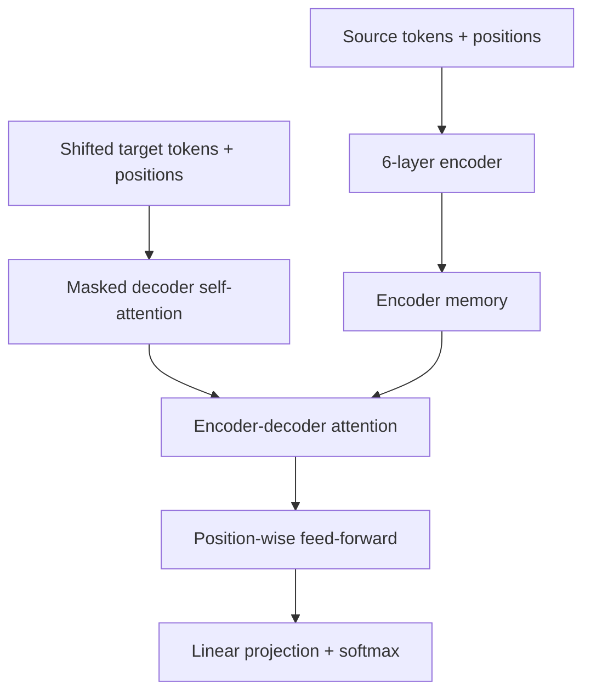

# Attention Is All You Need: The Transformer

## Publication Boundary

- **Paper:** *Attention Is All You Need*
- **Authors:** Ashish Vaswani, Noam Shazeer, Niki Parmar, Jakob Uszkoreit, Llion Jones, Aidan N. Gomez, Łukasz Kaiser, and Illia Polosukhin
- **Venue and version:** NIPS 2017 proceedings paper
- **Evaluated workload:** supervised encoder-decoder machine translation on WMT 2014 English–German and English–French

The proceedings value used here is **41.0 BLEU** for the large English–French model; the later arXiv abstract reports 41.8. Decoder-only language models, KV-cache serving, FlashAttention, scaling laws, long-context methods, instruction tuning, and modern mixture-of-experts deployments are later work.

## What the Paper Claimed

The paper replaced recurrent and convolutional sequence-to-sequence layers with attention and position-wise feed-forward layers. Its central empirical claim was about translation quality, training cost, and sequence parallelism—not that recurrence disappeared from every future sequence task or that attention alone solved language understanding.

The original Transformer is an encoder-decoder:

- the encoder reads the source sentence bidirectionally,
- the decoder uses masked self-attention over prior target positions,
- decoder cross-attention reads encoder outputs,
- generation remains autoregressive at inference time.

Thus “no recurrence in the network” does not mean “all output tokens can be generated simultaneously.” Teacher-forced training exposes all target positions in parallel; inference still predicts the next token from the generated prefix.

## Model State and Architecture

Both encoder and decoder contain six layers in the paper's base and big configurations.

### Encoder layer

Each encoder layer contains:

1. multi-head self-attention,
2. residual addition followed by layer normalization,
3. a position-wise feed-forward network,
4. another residual addition followed by layer normalization.

The original paper used **post-norm**:

$$
\operatorname{LayerNorm}(x+\operatorname{Sublayer}(x))
$$

Many later large models use pre-norm or other normalization arrangements; projecting those backward changes the algorithm.

### Decoder layer

Each decoder layer adds a third sublayer: attention over encoder outputs. Its self-attention is causally masked so position $i$ cannot depend on target positions $j>i$.

The decoder state during translation comprises the generated target prefix; the encoder memory is reused for each next-token step. The 2017 paper did not describe the modern serving term “KV cache,” although caching projected keys/values is a direct later implementation consequence.

## Scaled Dot-Product Attention

For query, key, and value matrices:

$$
\operatorname{Attention}(Q,K,V)=
\operatorname{softmax}\left(\frac{QK^\top}{\sqrt{d_k}}+M\right)V
$$

$M$ is zero for permitted pairs and effectively $-\infty$ for masked pairs. The scale factor $1/\sqrt{d_k}$ prevents dot products from growing with dimension and driving softmax into regions with very small gradients.

Multi-head attention learns separate projections:

$$
head_i=\operatorname{Attention}(QW_i^Q,KW_i^K,VW_i^V)
$$

$$
\operatorname{MultiHead}(Q,K,V)=
\operatorname{Concat}(head_1,\ldots,head_h)W^O
$$

The base model used $h=8$ heads with $d_k=d_v=64$, so concatenated head width equals $d_{model}=512$. Heads are learned subspaces; the paper visualized some apparent linguistic behavior but did not guarantee one semantic role per head.

## Feed-Forward, Embeddings, and Position

Each position independently applies:

$$
\operatorname{FFN}(x)=\max(0,xW_1+b_1)W_2+b_2
$$

with $d_{model}=512$ and $d_{ff}=2048$ in the base model. This is equivalent to two $1\times1$ convolutions shared across positions. Attention mixes tokens; the FFN transforms channels at each token.

The paper shared the source embedding, target embedding, and pre-softmax weight matrix where vocabulary construction allowed, and multiplied embeddings by $\sqrt{d_{model}}$.

Because attention without position information is permutation-equivariant, the model adds sinusoidal encodings:

$$
PE_{(pos,2i)}=\sin\left(pos/10000^{2i/d_{model}}\right)
$$

$$
PE_{(pos,2i+1)}=\cos\left(pos/10000^{2i/d_{model}}\right)
$$

The paper also tested learned positional embeddings and found nearly identical translation quality in its ablation. It chose sinusoids partly for the possibility of extrapolating beyond trained lengths; the evaluation did not establish robust modern long-context extrapolation.

## Optimization Protocol

Training used Adam with $\beta_1=0.9$, $\beta_2=0.98$, and $\epsilon=10^{-9}$. The learning-rate schedule was:

$$
lr=d_{model}^{-1/2}\min(step^{-1/2},\ step\cdot warmup^{-3/2})
$$

with 4,000 warmup steps. Regularization included residual dropout and label smoothing with $\epsilon_{ls}=0.1$.

These details are not incidental. Comparing architectures while changing tokenizer, optimizer, checkpoint averaging, and decoding can attribute gains incorrectly.

## Complexity and Dependency Paths

For sequence length $n$ and representation width $d$, the paper compared per-layer asymptotics:

| Layer type | Complexity per layer | Sequential operations | Maximum path length |
|---|---:|---:|---:|
| Self-attention | $O(n^2d)$ | $O(1)$ | $O(1)$ |
| Recurrent | $O(nd^2)$ | $O(n)$ | $O(n)$ |
| Convolution, kernel $k$ | $O(knd^2)$ | $O(1)$ | $O(\log_k n)$ with dilation |

Self-attention is computationally cheaper than recurrence under this simplified comparison when $n<d$. It also creates a constant-length dependency path between positions and exposes parallel matrix operations.

The table is not a complete hardware cost model. Projection and FFN terms, memory traffic, kernel launch overhead, padding, and actual accelerator utilization matter. At long $n$, the $n^2$ attention matrix becomes dominant.

### Illustrative memory calculation

If an implementation materialized one attention-score tensor for batch size 1, $h=16$ heads, $n=8{,}192$, and two-byte elements:

$$
B_{scores}=h\times n^2\times 2
=16\times 8192^2\times2
=2\ \text{GiB}
$$

That is per layer before gradients and other intermediates. This is **illustrative**, not a measurement from the paper. Modern tiled kernels can compute exact attention without writing the full score matrix to high-bandwidth memory, changing memory traffic but not the dense all-pairs arithmetic of standard attention.

## Training and Data Methodology

### Datasets

- WMT 2014 English–German: about 4.5 million sentence pairs, byte-pair encoding, shared source-target vocabulary of about 37,000 tokens.
- WMT 2014 English–French: about 36 million sentence pairs, word-piece vocabulary of about 32,000 tokens.

Batches contained roughly 25,000 source tokens and 25,000 target tokens. Length batching reduced padding.

### Hardware and schedule

Training ran on one machine with eight NVIDIA P100 GPUs:

| Configuration | Parameters | Steps | Seconds/step | Reported training time |
|---|---:|---:|---:|---:|
| Base | 65 million | 100,000 | about 0.4 | about 12 hours |
| Big | 213 million | 300,000 | about 1.0 | about 3.5 days |

The paper estimated training FLOPs as training time multiplied by number of GPUs and their sustained single-precision capacity (9.5 TFLOP/s per P100). This is an estimate, not profiler-counted effective model FLOPs. The table reports about $3.3\times10^{18}$ FLOPs for the base model and $2.3\times10^{19}$ for Transformer-big on English–German.

### Decoding

The reported translation results used beam search with beam size 4, length penalty $\alpha=0.6$, and maximum output length of input length plus 50. Checkpoints were averaged: the last 5 for base models and the last 20 for big models. Hyperparameters were selected using development data.

BLEU is sensitive to tokenization and evaluation setup. Preserve the paper's task and pipeline when comparing values.

## Quantitative Results

| Model | WMT14 EN–DE BLEU | WMT14 EN–FR BLEU | Parameters |
|---|---:|---:|---:|
| Transformer base | 27.3 | 38.1 | 65M |
| Transformer big | 28.4 | 41.0 | 213M |

The paper compared with prior recurrent and convolutional translation systems and reported better quality with substantially lower estimated training cost. It did not compare against later Transformers, decoder-only LMs, or current accelerators.

### Ablations

Ablations used English–German newstest2013 and did not use checkpoint averaging. Among the reported observations:

- reducing attention to one head cost about 0.9 BLEU relative to the cited multi-head setting,
- very small per-head dimensions hurt quality,
- increasing model dimensions generally improved quality but increased cost,
- learned and sinusoidal positional encodings performed nearly identically in that experiment.

Ablations are local to the tested base recipe; they do not prove eight heads or sinusoidal positions are globally optimal.

## Failure Modes as a Train/Serve System

The paper is a model paper rather than a production-serving design, but its computation creates concrete system failure modes:

| Failure | Manifestation | Mitigation boundary |
|---|---|---|
| Padding/shape skew | Wasted compute and memory | Token-based batching and length buckets |
| Attention activation exhaustion | OOM at long sequence/batch | Bound sequence, rematerialize, tile attention |
| Mask bug | Decoder sees future target tokens | Unit tests against causal dependency and leakage |
| Tokenizer/version mismatch | Different IDs and outputs | Pin tokenizer with weights |
| Numerical overflow/underflow | NaNs or unstable softmax | Stable softmax, scaling, precision tests |
| Autoregressive worker loss | Partial translation/output | Retry semantics belong to later serving layer |
| Beam-search configuration drift | BLEU/output changes without weight change | Version decoding policy |

The model's reproducible identity is more than weights:

$$
Version=(weights,\ tokenizer,\ architecture,\ positional\ scheme,\ decoding\ policy)
$$

## What the Paper Did Not Establish

1. It evaluated machine translation, not general language modeling, chat, retrieval, vision, or agents.
2. It was an encoder-decoder, not the decoder-only architecture dominant in later LLMs.
3. It did not evaluate KV-cache allocation, continuous batching, speculative decoding, or prefill/decode disaggregation.
4. It did not present scaling laws or compute-optimal training claims.
5. It did not solve quadratic long-context cost; restricted attention was proposed as future work.
6. It did not demonstrate that every head learns a stable interpretable role.
7. It used sequence lengths and hardware far smaller than modern long-context deployments.
8. BLEU improvements do not establish safety, factuality, instruction following, or reasoning quality.

## Later Evolution, Kept Separate

Decoder-only autoregressive models later reused masked self-attention for language modeling. Serving systems cache keys and values, page that memory, batch token iterations, and sometimes separate prefill from decode. FlashAttention later made exact attention IO-aware through tiling. Multi-query/grouped-query attention reduced KV heads; sparse and linear attention variants changed the cost structure.

These systems consequences are covered in [LLM Inference Platforms](../08-case-studies/13-llm-inference-platforms.md), [LLM Infrastructure](../17-llm-systems/05-llm-infrastructure.md), and [GPU Inference Internals](../17-llm-systems/11-gpu-inference-internals.md). They are descendants, not results of the 2017 evaluation.

## Design-Review Questions

1. Is the architecture encoder-only, encoder-decoder, or decoder-only, and which attention masks apply?
2. Does a complexity claim include projections, FFN, memory traffic, padding, and backward activations?
3. Is an $O(n^2)$ tensor materialized, recomputed, or tiled?
4. Are tokenizer, vocabulary sharing, positions, and decoding policy versioned with weights?
5. Are quality numbers tied to dataset version, preprocessing, checkpoint averaging, and beam settings?
6. Is training cost measured by profiler, theoretical operations, or device-time capacity estimate?
7. Does a later serving conclusion actually follow from the 2017 paper, or from later systems work?
8. What sequence lengths make $n<d$ true for the claimed self-attention advantage?
9. Can a causal-mask test prove future tokens cannot influence earlier decoder states?
10. Are learned/sinusoidal position conclusions being extrapolated far beyond trained length?

## Lessons That Generalize

1. Removing sequential dependencies can matter more to hardware utilization than minimizing asymptotic arithmetic alone.
2. State representation and mask semantics are part of the algorithm, not implementation detail.
3. Report model quality with the full data, optimization, checkpoint, and decoding protocol.
4. Constant dependency-path length and parallel training coexist with autoregressive inference.
5. A successful primitive creates new systems bottlenecks; quadratic attention and later KV state became an infrastructure workload.
6. Separate the original evidence from later influence to avoid rewriting history through today's architecture.

## Primary Reference

- [Attention Is All You Need — NIPS 2017 proceedings PDF](https://papers.neurips.cc/paper/2017/file/3f5ee243547dee91fbd053c1c4a845aa-Paper.pdf)

## Related Chapters

- [LLM Inference Platforms](../08-case-studies/13-llm-inference-platforms.md)
- [LLM Infrastructure](../17-llm-systems/05-llm-infrastructure.md)
- [Context Management](../17-llm-systems/08-context-management.md)
- [GPU Inference Internals](../17-llm-systems/11-gpu-inference-internals.md)
- [FinOps and Cost Engineering](../11-observability/06-finops-cost-engineering.md)
