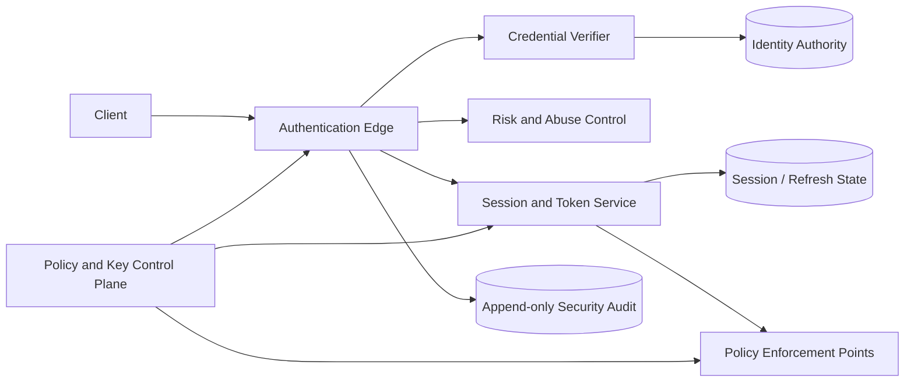

# Authentication Systems

## TL;DR

Authentication is a distributed state machine, not a password check. A production design must bind an identity to one or more authenticators, issue a revocable session, propagate authentication results without spreading long-lived credentials, survive regional and dependency failures, and make recovery at least as strong as normal sign-in. The central trade-off is between **online authority** (immediate revocation, one more dependency on every request) and **locally verifiable assertions** (lower latency and wider availability, bounded staleness until expiry). Make that staleness bound explicit; do not describe signed tokens as “stateless” and then quietly add deny-lists, refresh-token rows, key registries, and account-status lookups.

---

## The Security Contract

Authentication establishes that a claimant currently controls an authenticator bound to an account. It does **not** decide what that account may do; that belongs to [authorization](./07-authorization-patterns.md). It also does not prove a real-world identity unless an identity-proofing process established that binding.

Begin with invariants, not protocols:

1. **Credential isolation.** Raw passwords, private keys, recovery codes, and refresh tokens reach only the component that must verify them. Downstream services receive a bounded assertion, never the original credential.
2. **Unambiguous binding.** A successful ceremony binds one account, one authenticator, one client context, and one challenge. Challenges are unpredictable, single-use, short-lived, and scoped to the intended operation.
3. **Replay resistance.** Reusing a captured proof must either fail or have a deliberately bounded value. A password is replayable; a WebAuthn assertion is challenge- and origin-bound; a bearer access token remains replayable until it expires or is revoked.
4. **Revocation has a deadline.** “The user is disabled now” must translate into a measurable maximum time before every enforcement point rejects the account.
5. **Recovery cannot bypass assurance.** An account protected by a passkey but recoverable through an unchecked email or support call has the assurance of that recovery path.
6. **Security transitions are atomic.** Password changes, authenticator removal, global logout, and recovery completion advance a security version so concurrently issued sessions cannot survive on stale state.
7. **Failures do not silently weaken policy.** A risk engine outage, stale replica, or unavailable audit sink has a named fail-open, fail-closed, or degraded behavior for each operation class.

Passwords, passkeys, sessions, OAuth, and federation are mechanisms for satisfying them.

---

## State and Ownership

The identity authority should own a small, explicit state model. A representative account record contains:

```text
Account
  account_id             immutable internal identifier
  status                 pending | active | recovery_pending | locked | disabled
  security_version       monotonic epoch for global invalidation
  authenticators[]       id, type, public metadata, state, enrolled_at
  recovery_methods[]     method, verified_at, risk class
  failed_attempt_state   counters or a pointer to abuse-control state
  policy                 required assurance, allowed recovery paths
  changed_at             authoritative state-change time
```

Passwords are represented by a verifier record containing the algorithm, parameters, salt, and derived value. Passkeys store a credential identifier and public key; the private key stays in the authenticator. Refresh tokens should be represented by a one-way digest plus a token-family identifier, generation, expiry, client binding, and status. Never store a bearer refresh token in recoverable plaintext.

The `security_version` is a fencing token for authentication state. Sessions and assertions carry the version observed at issuance. A global logout, credential compromise, account disable, or sensitive recovery increments it. An enforcement point that performs an online check rejects older versions immediately; an offline verifier rejects them only after its assertion expires unless it receives a revocation update.

### The planes



- The **credential plane** enrolls and verifies authenticators. It handles the most sensitive inputs and should have the narrowest interface.
- The **session plane** exchanges a successful ceremony for an opaque session or bounded assertion, rotates refresh credentials, and enforces revocation.
- The **policy plane** distributes accepted issuers, key sets, assurance rules, client metadata, and security epochs.
- The **recovery plane** changes authenticator bindings under stricter workflow and audit rules.
- The **audit plane** records security decisions without becoming a store for credentials or full bearer tokens.

Separating the planes prevents a generic application service from becoming a password verifier, token issuer, recovery authority, and policy database at once.

---

## Authentication as a Transaction

A login is a transaction with externally visible effects:

1. Resolve the account without revealing whether the submitted identifier exists.
2. Load the authoritative account status and credential metadata.
3. Verify the proof using a bounded worker pool; password hashing is intentionally expensive and therefore an admission-controlled resource.
4. Evaluate abuse signals and the assurance required for this operation. A valid password may still require a passkey or another factor.
5. Atomically record the successful ceremony, reset or advance relevant attempt state, and create a session or refresh-token family.
6. Return the client credential only after its authoritative record exists.
7. Append a redacted audit event and publish derived security signals asynchronously.

If step 5 commits but the response is lost, the client may retry. The retry must not create an unbounded number of live refresh-token families. Use a short-lived ceremony identifier as an idempotency key, or allow multiple sessions deliberately and expose them for user review.

Failure counters require equally careful semantics. A read-then-increment sequence against an eventually consistent replica is bypassable under concurrency. Updates must be atomic at the chosen enforcement scope. At the same time, a fixed account lockout lets an attacker deny service to a victim. Production abuse control therefore combines per-account, per-network, per-device, and fleet-wide signals with progressive delay or step-up authentication rather than relying on a single threshold.

---

## Authenticator Lifecycle

Authentication security is mostly lifecycle management: enrollment, use, replacement, compromise, recovery, and deletion.

### Password verifiers

Use a maintained library to apply a purpose-built password-hashing function, normally Argon2id, scrypt, or bcrypt. Store the algorithm and parameters with every verifier. Calibrate cost against the slowest supported production tier and the capacity reserved for authentication; a universal work factor or millisecond target ages badly as hardware and traffic change.

Password verification consumes a scarce resource. If peak login traffic is $Q$ attempts/s and one verification consumes $t$ CPU-seconds, the unconstrained CPU demand is approximately:

$$
\text{cores} \approx Q \times t
$$

That is before retries, bot traffic, or failover. Put verification behind concurrency admission, reserve capacity for legitimate recovery and administrator access, and shed abusive traffic before paying the hash cost. Rehash on a successful login when the stored algorithm or parameters fall behind current policy.

A server-side pepper can reduce the usefulness of a database-only compromise, but it creates a key-management dependency. Version it, keep it in a managed secret or key system, design rotation, and document whether losing it makes every password unverifiable.

### Passkeys and WebAuthn

WebAuthn replaces a replayable shared secret with a public-key credential scoped to a relying-party identifier. The server creates a fresh challenge; the authenticator signs the challenge and ceremony data; the server verifies the signature, challenge, origin, relying-party binding, and required user-verification flags.

The system still has design choices:

- **Synced or device-bound credentials.** Synced passkeys improve recovery and multi-device use; device-bound authenticators offer different provenance and administrative control.
- **Discoverable credentials.** They enable username-less sign-in but require clear account-selection and privacy behavior.
- **Attestation.** It is useful only when policy truly depends on authenticator provenance; collecting it without a requirement adds complexity and privacy cost.
- **Enrollment authorization.** Adding a new authenticator is a privileged security transition. Require a recent high-assurance ceremony and notify existing channels.

Do not make passkey login strong and then leave authenticator removal or account recovery protected by a weaker single factor.

### Additional factors and step-up

TOTP is a shared-secret proof and remains phishable. SMS is also exposed to account takeover in the delivery channel. They can be useful compatibility factors, but phishing-resistant authenticators should protect high-impact operations where practical.

Store TOTP seeds encrypted, rate-limit verification, tolerate only the clock window required by measured drift, and reject replay of an already accepted time step. Store backup codes as one-way verifiers and consume them atomically. “MFA enabled” is not a sufficient model: record which factors were used, when the ceremony occurred, and the resulting assurance so an operation can demand a recent step-up.

---

## Session Architecture

After authentication, the system needs a credential suitable for repeated requests. Three common designs occupy different points on the revocation/availability trade-off.

| Design | Request path | Revocation | Main failure boundary |
|---|---|---|---|
| Opaque server session | Random identifier; online session lookup | Immediate when the authority is reachable | Session store latency and availability |
| Short-lived signed access token | Local signature and claim validation | Bounded by token lifetime unless an online epoch/deny check is added | Key/config staleness and bearer replay |
| Opaque or signed token with introspection | Online authority check, often cached | Near-immediate within cache TTL | Introspection service and cache coherence |

### Opaque sessions

Generate at least 128 bits of unpredictable entropy, store only the identifier digest when practical, and send the identifier in a `Secure`, `HttpOnly` cookie with an explicit `SameSite`, domain, path, idle timeout, and absolute lifetime. Regenerate it when authentication state changes. Avoid broad parent-domain cookies unless every subdomain is inside the same trust boundary.

The authoritative session record should include account ID, security version, creation and expiry times, last meaningful use, client metadata needed for security decisions, and revocation state. Sliding expiry is a write-amplification decision: updating every request may overwhelm the store. Common alternatives are coarse-grained touch intervals or a short cache backed by a durable absolute-expiry record.

### Access and refresh credentials

A signed access token is not truly stateless. Correct operation still depends on issuer metadata, verification keys, audience policy, clock bounds, account state, and often refresh-token state. Keep access tokens narrowly scoped and short enough that their worst-case revocation delay is acceptable.

Refresh-token rotation is a compare-and-swap state transition:

```text
family F, generation 7, ACTIVE
  client presents generation 7
  transaction: mark 7 USED; create generation 8 ACTIVE
  retry with generation 7 after commit => REUSE DETECTED
  response: revoke family F and require authentication
```

The service must distinguish a network retry from theft without creating two active descendants. An idempotency record tied to the refresh request can return the already-created generation through a protected response channel; otherwise conservative family revocation is safer.

Sender-constrained credentials reduce bearer replay but introduce client-key lifecycle and recovery. Audience restriction and least privilege remain necessary even when a token is sender-constrained.

### Logout semantics

“Logout” is ambiguous. Define separate operations:

- **Local logout:** remove the credential from this client and revoke this session.
- **Account-wide logout:** increment the account security version and revoke every refresh-token family.
- **Federated logout:** also coordinate with the identity provider and relying parties; partial completion is expected and must be visible.
- **Compromise response:** revoke sessions, rotate affected credentials or signing keys, preserve evidence, and force recovery at an appropriate assurance level.

---

## Capacity and Multi-Region Design

Session capacity is driven by active sessions, record size, replication, and headroom, not registered users. For an illustrative workload with two million active sessions, 1.2 KiB per stored record, replication factor two, and a 70% target occupancy:

$$
\text{memory} \approx \frac{2{,}000{,}000 \times 1.2\ \text{KiB} \times 2}{0.70}
\approx 6.7\ \text{GiB}
$$

Allocator overhead, indexes, expiration metadata, replicas during failover, and refresh-token records require additional measured headroom. Request load matters independently: 150,000 authenticated requests/s with online validation on 70% of requests creates 105,000 session reads/s before retries or regional failover.

For multi-region systems, choose authority explicitly:

- **Home-region sessions** keep one writer per account or session family. Remote requests pay a lookup or use a bounded cache, but rotation and revocation have one serialization point.
- **Region-local sessions** reduce latency but make global logout and compromise response a replicated invalidation problem. Define maximum propagation delay and behavior during partition.
- **Locally verified access tokens** keep the request path available during authority outages, but disabled accounts remain accepted until expiry unless enforcement points receive a trustworthy revocation stream.

Signing-key distribution is a control plane. Verifiers cache a versioned key set; issuers overlap old and new keys during rotation; removal waits for the maximum token lifetime plus clock and distribution margins. An emergency rotation needs a separately tested fast path. A verifier that cannot refresh keys should continue only within an explicit stale-key window, not forever.

---

## Recovery Is a Privileged Workflow

Recovery changes the binding between a person and an account, so model it as a durable, observable workflow rather than a special login endpoint.

1. Create a recovery case with an opaque identifier and risk classification.
2. Gather proofs appropriate to the account’s assurance and value.
3. Apply delay and out-of-band notification when immediate recovery would create unacceptable takeover risk.
4. Require independent approval for administrator-assisted recovery of sensitive accounts.
5. Atomically bind the new authenticator, invalidate recovery artifacts, increment `security_version`, and revoke existing sessions according to policy.
6. Retain a privacy-conscious audit trail and make the change visible to the account owner.

Email links and SMS codes are bearer credentials. Store digests, make them single-use, bind them to the intended action, and expire them quickly. Do not let support staff bypass technical controls through an unlogged database edit.

---

## Failure Modes

| Failure | Unsafe response | Designed response |
|---|---|---|
| Session store unavailable | Accept an unknown opaque session | Fail closed for privileged operations; optionally use a deliberately bounded read cache for lower-risk traffic |
| Identity replica lags after disable | Issue a new session from stale account state | Issue only from the authoritative write region or require a fresh security epoch |
| Risk service times out | Silently skip required step-up | Use operation-specific policy: fail closed for high-impact actions, conservative degraded rules for ordinary login |
| Password-hash pool saturates | Queue without bound and exhaust the service | Admission control, per-source shaping, bounded queues, and reserved recovery capacity |
| Signing-key distribution stalls | Trust unknown keys or cache forever | Reject unknown key IDs; apply a finite stale-key policy for already trusted keys and alert |
| Refresh response is lost | Create a new descendant on every retry | Idempotent rotation or family-reuse detection with a forced ceremony |
| Regional partition | Both regions mutate one token family | Single-writer ownership or fenced generations; make reduced functionality explicit |
| Audit sink is unavailable | Block every login indefinitely or drop all evidence | Durable local buffering with backpressure thresholds and a defined fail policy for sensitive operations |
| Recovery notification fails | Complete silently | Keep the security change valid if policy allows, but raise a high-priority delivery incident and provide another owner-visible channel |

Test these with fault injection at transaction boundaries: after credential verification but before session commit, after commit but before response, during refresh rotation, during security-version propagation, and while keys rotate. A happy-path login test proves almost none of the distributed properties.

---

## Observability Without Credential Leakage

Record ceremony ID, account pseudonym, authenticator class, achieved assurance, decision, reason category, policy version, security version, region, dependency latency, and session-family event. Never log passwords, TOTP seeds, full assertions, cookies, authorization codes, or bearer tokens. Hashing a low-entropy token is not sufficient redaction if the token can be guessed.

Operational signals should separate:

- user-visible success and latency by ceremony type;
- invalid proofs from dependency and policy failures;
- password-hash queue saturation;
- refresh reuse and global-revocation propagation delay;
- recovery creation, abandonment, approval, and reversal;
- key-set age and verifier refresh failures;
- notification delivery for high-risk security changes.

Aggregate attack telemetry without turning it into an account-enumeration or cross-tenant privacy leak. Access to authentication traces is itself privileged.

---

## Decision Framework

Choose an opaque online session when immediate revocation, simple browser semantics, and centralized policy outweigh the extra lookup. Choose short-lived signed access tokens when many independent services or intermittent authority connectivity make local verification valuable and the bounded revocation delay is acceptable. Add introspection or security-epoch checks when the risk requires fresher status; recognize that this moves the design back toward online authority.

Prefer passkeys for new interactive authentication when the client ecosystem supports them. Retain password and compatible factors only with an explicit migration and recovery design. Use federation when another identity authority should own the ceremony, but validate issuer, audience, redirect, nonce, and client binding; federation moves the trust boundary rather than removing it.

The final architecture should be explainable in four sentences: who owns authenticator state, who can issue a session, how every verifier decides, and how quickly compromise or disable reaches every verifier. If any answer is “eventually” without a bound, the authentication contract is incomplete.

---

## Key Takeaways

- Authentication is an identity, authenticator, session, and recovery lifecycle with explicit authority and epochs.
- Local token verification trades online dependency for bounded stale authorization; it does not eliminate state.
- Refresh rotation, global logout, and authenticator changes are concurrency-sensitive transactions.
- Password verification and abuse defense need capacity planning and admission control.
- Recovery and support operations must preserve, or deliberately re-establish, the account’s assurance.
- Key distribution, revocation propagation, and audit buffering are control-plane problems that require failure tests.

---

## References

- [NIST SP 800-63-4: Digital Identity Guidelines](https://pages.nist.gov/800-63-4/)
- [NIST SP 800-63B-4: Authentication and Authenticator Management](https://pages.nist.gov/800-63-4/sp800-63b.html)
- [OWASP Authentication Cheat Sheet](https://cheatsheetseries.owasp.org/cheatsheets/Authentication_Cheat_Sheet.html)
- [W3C Web Authentication Level 3](https://www.w3.org/TR/webauthn-3/)
- [RFC 9106: Argon2 Memory-Hard Function](https://www.rfc-editor.org/rfc/rfc9106)
- [RFC 9700: Best Current Practice for OAuth 2.0 Security](https://www.rfc-editor.org/rfc/rfc9700)
- [RFC 7009: OAuth 2.0 Token Revocation](https://www.rfc-editor.org/rfc/rfc7009)
- [RFC 7662: OAuth 2.0 Token Introspection](https://www.rfc-editor.org/rfc/rfc7662)
