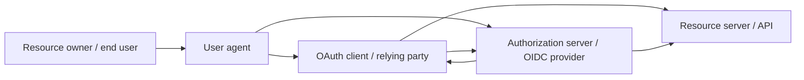
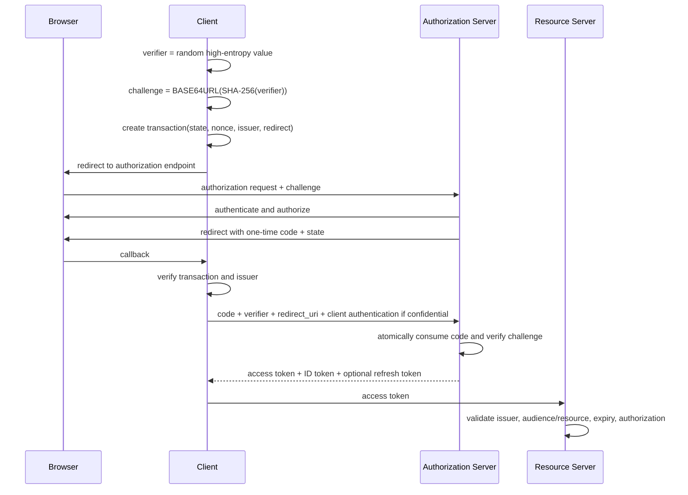
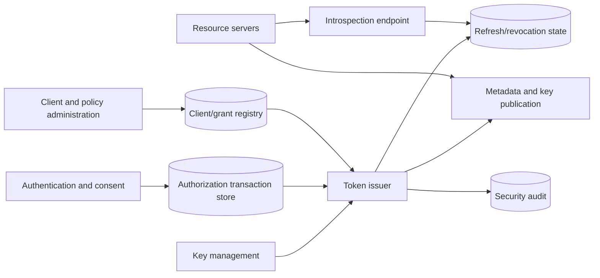

# OAuth 2.0 and OpenID Connect

## TL;DR

OAuth is a framework for delegated API access. OpenID Connect (OIDC) adds an identity layer for login. They share endpoints and tokens, but their security contracts differ:

- an **access token** is presented to a resource server and authorizes a bounded API action;
- an **ID token** is consumed by the client that requested authentication and describes that authentication event;
- a **refresh token** is a long-lived delegation handle used only at the authorization server.

For browser and native-app user flows, use authorization code with PKCE, exact redirect-URI matching, issuer validation, `state` or equivalent request correlation, and OIDC `nonce` where required. Bind tokens to the intended resource/audience, keep access tokens short-lived, rotate refresh tokens for public clients, and never send an ID token to an API as an access token.

Design authorization transaction state, client registration, redirect and consent policy, token/key lifecycle, multi-region replay protection, revocation, sender constraint, and explicit behavior when the authorization service is unavailable.

---

## 1. Protocol Roles and Trust Boundaries



- **Authorization server (AS):** authenticates as needed, obtains authorization, and issues tokens.
- **Client:** requests delegated access. “Client” does not mean end user.
- **Resource server (RS):** validates an access token and enforces its authorization.
- **Resource owner:** grants or controls access to a resource.
- **OpenID Provider:** an AS that also implements OIDC.
- **Relying Party:** an OIDC client consuming an ID token.

The client and resource server may be operated by different parties. Never infer trust merely because both use the same issuer.

### 1.1 Core invariants

1. **Redirect binding:** an authorization response returns only to an exactly registered redirect URI.
2. **Transaction correlation:** a response is accepted only for the browser/session transaction that initiated it.
3. **Code binding:** an intercepted authorization code cannot be redeemed without the PKCE verifier and correct client/redirect context.
4. **Issuer binding:** a client never accepts a response or token from an unintended issuer.
5. **Audience/resource binding:** a resource server accepts only tokens intended for it.
6. **Client binding:** confidential-client credentials and refresh tokens are usable only by the intended client.
7. **No token substitution:** ID tokens, access tokens, authorization codes, and refresh tokens are not interchangeable.
8. **Bounded delegation:** scopes and resource indicators do not exceed the authorized grant.
9. **Replay containment:** one-time codes and rotated refresh tokens have durable replay state.
10. **Auditable consent/administration:** the authorization basis and revision are reconstructable.

---

## 2. Authorization Code with PKCE



### 2.1 Authorization transaction state

Store a short-lived, single-use transaction:

```text
transaction_id
client_id
issuer
redirect_uri
state_digest
pkce_challenge
pkce_method
oidc_nonce_digest
requested_scopes
requested_resources
browser_session_binding
created_at
expires_at
consumed_at
```

The callback performs an atomic consume. Duplicate callbacks return the recorded disposition or fail; they do not create another token exchange.

### 2.2 PKCE

The client creates a random verifier and sends only its SHA-256 challenge in the authorization request. The verifier is sent to the token endpoint. An attacker who observes the code but lacks the verifier cannot redeem it.

Use the `S256` method. Treat the verifier as transaction secret state: do not place it in logs, analytics, referrers, or a broadly readable browser store.

PKCE protects code interception. It does not replace:

- redirect-URI validation;
- client authentication for confidential clients;
- `state`/transaction correlation;
- issuer validation;
- OIDC `nonce`;
- access-token audience validation.

### 2.3 `state`, `nonce`, and issuer

`state` correlates the authorization response with client state and can carry or reference CSRF protection. Generate an unpredictable value bound to the initiating session; do not accept arbitrary application return URLs inside an unsigned state value.

OIDC `nonce` binds an ID token to the authentication request and mitigates token replay/substitution. Store a digest in the transaction and verify the claim according to the flow/profile.

In deployments where a client talks to multiple authorization servers, verify the authorization-response issuer and bind the transaction to it. Otherwise an attacker can mix responses between issuers.

---

## 3. Redirect URI and Front-Channel Security

The redirect URI is an authorization boundary. Require exact string matching against registered values except where a specification profile explicitly defines safe native-app loopback behavior.

Reject:

- wildcards in scheme, host, path, or port for web clients;
- open redirectors;
- userinfo tricks such as `trusted.example@attacker.example`;
- unregistered query changes;
- fragment-based secrets;
- ambiguous Unicode/punycode host handling;
- untrusted custom URI schemes that another native app can claim.

Use claimed HTTPS redirects or application/universal links for native apps when possible. Loopback redirects bind a random local port and still require PKCE.

Authorization codes and tokens can leak through:

- browser history;
- referrer headers;
- analytics scripts;
- reverse-proxy access logs;
- crash reports;
- copied URLs.

Keep tokens out of authorization response URLs where possible, strip sensitive query data after callback, set appropriate referrer policy, and keep third-party scripts off callback pages.

---

## 4. Client Types and Deployment Patterns

### 4.1 Confidential web client

A backend can keep client credentials and refresh tokens outside the browser. The browser holds only a secure application session cookie.

```text
browser
  -> application backend / BFF
     -> authorization server
     -> resource APIs
```

The backend-for-frontend (BFF) reduces browser token exposure but becomes a high-value session and CSRF boundary. Protect cookies, rotate sessions after login, enforce same-origin/CSRF controls, and avoid turning the BFF into an unconstrained token proxy.

### 4.2 Browser-only public client

A browser application cannot keep a static client secret. Use code + PKCE and minimize token lifetime/exposure. Evaluate whether a BFF is warranted for high-value data.

Do not treat bundling a secret in JavaScript as client authentication. Anyone can extract it.

### 4.3 Native public client

Use the system browser, code + PKCE, and a redirect mechanism controlled by the app. Embedded webviews weaken isolation and may expose user credentials to the app.

Store refresh tokens in platform-protected storage, but assume device compromise remains possible. Refresh rotation and sender constraint reduce replay risk.

### 4.4 Machine client

The client-credentials grant represents the client/workload, not a user. Issue resource-specific, short-lived tokens based on workload identity. Do not invent an end-user subject claim.

Where possible, authenticate the client with asymmetric proof such as private-key JWT or mTLS rather than a fleet-wide shared secret.

### 4.5 Input-constrained devices

The device authorization grant lets a device display a user code while authorization occurs on a separate device. The client polls the token endpoint at the instructed interval and handles `authorization_pending`, `slow_down`, expiry, and denial.

Protect against code phishing and session confusion: show device context, use adequate code entropy, expire quickly, rate-limit verification, and make the user confirm what device/app is being authorized.

---

## 5. OIDC Authentication Contract

An ID token is a signed statement from the issuer to the client. Validate:

- signature with an allowed algorithm and current issuer key;
- exact issuer;
- audience containing the client ID;
- authorized party where multiple audiences require it;
- expiry and not-before/time policy;
- `nonce` when sent;
- authentication time/assurance when the application requested it;
- hash claims required by the chosen flow/profile.

The subject identifier is scoped by issuer and may be pairwise per client sector. Key users by `(issuer, subject)`, not email. Email can change, be reassigned, or be unverified.

### 5.1 UserInfo

The UserInfo endpoint returns claims authorized by an access token. Its subject must match the ID token subject for the same login transaction. Do not merge a mismatched response into the session.

### 5.2 Session creation

After token validation:

1. map issuer/subject to a local identity;
2. evaluate tenant membership and account state;
3. create or rotate the application session;
4. store authentication time, assurance, issuer, and upstream session references;
5. discard front-channel artifacts;
6. apply step-up policy for high-risk actions.

OIDC login proves an authentication event. It does not automatically grant every local role.

### 5.3 Logout

“Logout” can mean:

- destroy local application session;
- revoke refresh token/grant;
- end the identity-provider session;
- notify other relying parties;
- invalidate access tokens.

These are distinct protocols with different latency. Define the product promise. A short-lived access token may remain valid after local logout unless the resource server performs current-state introspection or revocation checks.

---

## 6. Access Token Design

An access token should express only what the resource server needs:

```text
issuer
subject or client identity
audience/resource
scope or authorization reference
issued_at / expiry
token identity
confirmation key when sender-constrained
tenant context if contractually stable
```

Opaque tokens centralize state at introspection. Structured tokens such as JWTs allow local validation but make revocation and claim freshness bounded by token lifetime. The JOSE mechanics and key-confusion hazards belong to [JSON Web Tokens](./03-jwt-tokens.md).

### 6.1 Resource indicators and audience

If a client calls multiple APIs, request tokens for explicit resources rather than one bearer token accepted everywhere. Each resource server validates that it is the intended audience/resource.

Avoid a universal `api` audience across unrelated services. Token theft then grants broad lateral reach.

### 6.2 Scopes are delegated verbs, not the whole authorization model

Scopes describe bounded authority granted to a client, such as `invoices.read`. The resource server must still enforce:

- which tenant;
- which specific invoice;
- ownership/relationship;
- current account state;
- transaction constraints.

Do not encode millions of object IDs or a mutable relationship graph into scopes.

### 6.3 Token exchange and delegation chains

When service A calls service B for a user:

- **propagate original token** only if B is an intended audience and least privilege is preserved;
- **exchange token** for a B-specific token to reduce audience/scope;
- **use workload token** when the call is purely service authority;
- carry auditable actor/delegation context where B must know both service and user.

Never let a service mint an unsigned “user ID” header and call it delegation.

---

## 7. Refresh Token Lifecycle

Refresh tokens are high-value durable credentials. Store only a hash or protected representation at the authorization server:

```text
refresh_family:
  family_id
  subject
  client_id
  tenant
  authorized_resources/scopes
  current_generation
  state
  created_at
  absolute_expires_at
  last_used_at
  revoked_at

refresh_token:
  token_digest
  family_id
  generation
  issued_at
  consumed_at
  replacement_digest
```

### 7.1 Rotation transaction

```text
BEGIN
  lookup token digest FOR UPDATE
  verify family active, client binding, expiry, and generation
  mark token consumed
  create next generation
  persist access-token authorization event
COMMIT
```

If an already consumed token reappears, it may indicate theft. Revoke the family or apply a risk policy. Network retries create a race: the legitimate client may retry because it missed the response. Retain the replacement relationship and define a narrow replay grace or return the same result only when the request can be safely identified; an overly broad grace weakens theft detection.

### 7.2 Absolute and inactivity expiry

Use:

- access-token expiry for routine authorization freshness;
- refresh inactivity expiry for abandoned sessions;
- absolute grant lifetime where reauthentication is required;
- immediate family revocation for detected compromise or user/admin action.

The correct values come from risk and user journey, not a universal duration table.

---

## 8. Sender-Constrained Tokens

Bearer tokens are usable by whoever steals them. Sender constraint binds a token to a key.

### 8.1 mTLS-bound tokens

The authorization server confirms the client certificate and encodes/binds its thumbprint. The resource server verifies that the TLS client proves the corresponding key.

Operational considerations:

- TLS termination must preserve verified certificate identity;
- certificate and token lifetimes/rotation overlap;
- key scope must match client instance/fleet policy;
- proxies cannot substitute arbitrary certificate headers.

### 8.2 DPoP

DPoP uses an application-layer proof JWT signed by a client-held key, binding HTTP method and URI plus freshness/jti, and associates the access token with that key. The resource server validates both.

DPoP reduces replay of a stolen token but adds nonce/replay state, URI normalization, clock, and proxy considerations. It does not make a compromised client safe; an attacker who controls the key can create proofs.

Use sender constraint where bearer replay risk justifies the operational state, especially for public clients or high-value APIs.

---

## 9. Authorization Server State and Planes



The control plane owns:

- client registration and redirect URIs;
- allowed grants/response types;
- scopes/resources and consent policy;
- signing/encryption keys;
- federation/issuer metadata;
- risk and step-up policy;
- token lifetime and sender-constraint requirements.

The transaction plane handles authorization sessions, codes, device codes, and refresh rotation.

The publication plane serves issuer metadata and verification keys. Cacheable publication should remain available during issuer failover; key removal must respect maximum token lifetime and verifier convergence.

### 9.1 Client registration

Treat client registration as security configuration:

- stable client identity and owner;
- exact redirect/logout URIs;
- client type and authentication method;
- allowed grants, resources, scopes;
- token format and sender constraint;
- software metadata/version;
- environment and tenant policy.

Dynamic registration, when enabled, needs initial access control, software statements or equivalent governance, rate limits, and lifecycle cleanup. An attacker must not register a lookalike redirect/client without policy.

---

## 10. Multi-Tenancy and Federation

Decide whether one issuer serves many tenants or each tenant has a distinct issuer/domain.

Shared issuer:

- simpler key and metadata distribution;
- tenant must be explicit in grant, token, session, and resource lookup;
- admin/config isolation becomes critical.

Per-tenant issuer:

- stronger namespace and configuration separation;
- more metadata/key caches and onboarding complexity;
- resource servers must safely resolve issuer before accepting tokens.

Never derive which issuer to trust solely from an unverified token claim. Select from configured routing context, then validate exact issuer.

Enterprise federation adds upstream identity providers. The local authorization server should normalize upstream authentication into a local subject/session while preserving issuer, assurance, and authentication time. Do not directly trust arbitrary upstream groups as local privileged roles without mapping and lifecycle control.

Account linking is high risk: linking two upstream identities can merge authority. Require authenticated proof of both sides or controlled administrative verification; never link solely by matching email.

---

## 11. Capacity and Availability

Assume:

- 35,000 interactive logins per second at peak;
- 120,000 refreshes per second;
- authorization-code records average 1.2 KiB with indexes/replication factor 3;
- codes retained operationally for 15 minutes including audit/cleanup lag;
- 0.8 percent of 2 million API requests per second use introspection.

Live code-state storage:

```text
35,000/s * 900 s * 1.2 KiB * 3
= about 106 GiB
```

Introspection load:

```text
2,000,000/s * 0.008 = 16,000 requests/s
```

Refresh rotation dominates transactional write rate in this example. Partition by a stable digest/family key, maintain uniqueness across regions according to the replay guarantee, and prevent a hot tenant/client from exhausting global capacity.

Local JWT validation moves API request load away from the AS, but key/issuer metadata still must be available and token freshness is bounded. Introspection centralizes current state but makes the AS a serving dependency. Select per resource risk and capacity.

### 11.1 Outage behavior

- existing locally verifiable access tokens may continue until expiry;
- new login/refresh normally fails if transaction authority is unavailable;
- resource servers using introspection need a fail-safe cache policy;
- public metadata/JWKS should be replicated and cacheable;
- no region should issue conflicting refresh generations without a uniqueness protocol.

Do not “fail open” an invalid or unverifiable token to protect availability.

---

## 12. Key Rotation

For signing keys:

1. publish the new verification key;
2. observe verifier fetch/convergence;
3. begin signing new tokens with the new key ID;
4. retain old public key for all unexpired tokens plus clock/cache margin;
5. stop old signing and protect/destroy old private key according to policy;
6. remove old public key only when no valid token can reference it.

Resource servers:

- restrict algorithms independently of token header;
- select keys only from configured issuer metadata;
- cache keys with refresh-on-unknown-key bounded against request storms;
- retain last-known-good keys through transient metadata outage;
- reject unknown issuer/key rather than fetching an arbitrary URL from token data.

Emergency key compromise may require revoking tokens before normal expiry. Publish deny/revocation state, rotate, and consider resource-server current-state checks for high-risk actions.

---

## 13. Failure Traces

### 13.1 Authorization-code injection

1. Attacker starts a login for their own account.
2. Attacker causes victim's browser/client session to receive the attacker's code.
3. Client accepts callback without transaction correlation.
4. Victim acts inside attacker's account.

**Prevention:** bind code response to initiating session using `state`/transaction state, PKCE, issuer, and OIDC nonce semantics.

### 13.2 Open redirect steals code

1. Client registers a wildcard or open redirect.
2. Authorization server sends code to the client URI.
3. Client redirect forwards to attacker.
4. Attacker redeems if other bindings are weak.

**Prevention:** exact redirect matching and no open redirect on registered endpoints.

### 13.3 ID token accepted by API

1. Client sends ID token to resource server.
2. API checks signature/expiry but not audience/type.
3. Token intended for the client is accepted as API authorization.

**Prevention:** APIs accept access tokens under a resource-specific contract; clients consume ID tokens.

### 13.4 Mix-up between issuers

1. Client supports trusted issuer A and attacker-influenced issuer B.
2. Authorization response from B is sent into A's transaction path.
3. Client sends code or credentials to wrong endpoint or accepts wrong identity.

**Prevention:** bind transaction to issuer, use issuer identification/metadata, and validate exact issuer at every stage.

### 13.5 Refresh replay revokes the legitimate session

1. Client rotates token but loses response.
2. It retries old token.
3. Server treats any reuse as theft and revokes family.
4. Benign network loss logs user out.

**Mitigation:** atomic rotation, stored replacement relation, narrowly designed retry handling, and telemetry that distinguishes races without granting a broad replay window.

### 13.6 Shared audience enables lateral use

1. Token for analytics is accepted by billing because both use audience `api`.
2. Compromised analytics client calls billing.

**Prevention:** resource-specific audiences/resource indicators and least scopes.

### 13.7 Key rotation outage

1. Issuer signs with new key before publishing/convergence.
2. Resource servers see unknown key ID.
3. Every request refreshes JWKS simultaneously.
4. Metadata service overloads and valid traffic fails.

**Prevention:** publish-before-sign, convergence telemetry, jittered/cache-coalesced refresh, and last-known-good keys.

---

## 14. Security Telemetry and Operations

Authorization-server signals:

- authorization/token request rate by client/grant/result;
- redirect, PKCE, state, nonce, issuer, and client-auth failures;
- code reuse and refresh-family replay;
- consent/authorization denial;
- token issuance by resource/scope/client;
- suspicious device-code verification;
- signing-key use and verifier convergence;
- admin/client-registration mutations.

Resource-server signals:

- issuer/audience/scope/binding failures;
- token age and key ID distribution;
- introspection latency/cache age;
- authorization denial by coarse action/resource class;
- replay/nonces where sender-constrained;
- use of deprecated clients/scopes.

Do not log raw codes, access tokens, refresh tokens, client secrets, PKCE verifiers, or full ID-token claims. Record token digests/IDs only when needed and access-controlled.

Incident actions should include:

- revoke grant/refresh family;
- disable client or redirect;
- stop key issuance/rotate key;
- block subject/workload;
- narrow scope/resource policy;
- force reauthentication;
- search token/audit identity across resource logs.

---

## 15. Verification

1. **Protocol conformance:** standards/profile test suites for supported flows.
2. **Redirect tests:** exact match, encoding, Unicode, userinfo, fragments, open redirect.
3. **Transaction tests:** state/nonce/issuer swap, duplicate callback, expired code, concurrent redemption.
4. **PKCE tests:** missing/wrong verifier, disallowed method, verifier leakage.
5. **Token substitution:** ID token as access token, wrong issuer/audience/resource/client.
6. **Refresh races:** duplicate use, lost response, concurrent rotation, revoked/expired family.
7. **Key tests:** publish-before-sign, unknown key storm, algorithm confusion, compromised-key emergency.
8. **Sender-binding tests:** wrong certificate/key, replayed proof, URI normalization, proxy termination.
9. **Multi-tenant/federation tests:** issuer confusion, account-linking takeover, cross-tenant grants.
10. **Failure injection:** transaction-store failover, stale region, metadata outage, introspection overload.
11. **Privacy tests:** logs, URLs, analytics, referrers, browser storage, support tooling.
12. **End-to-end authorization:** token authority is no broader than consent/client policy/resource ownership.

Generate protocol state-machine tests, not only endpoint happy paths. Most OAuth failures occur when individually valid artifacts are combined in the wrong transaction.

---

## 16. Decision Framework

Use OIDC when an application delegates authentication to an identity provider. Use OAuth when a client needs bounded access to a resource API. They often appear together, but one does not substitute for the other.

Before implementing:

1. Is the client confidential, browser-public, native, machine, or input constrained?
2. Which issuer and resource servers participate?
3. What is the exact redirect and transaction binding?
4. Which access-token audience/resource and scopes are required?
5. Does the resource need current introspection or is bounded local validation acceptable?
6. How are refresh tokens stored, rotated, replay-detected, and revoked?
7. Does token theft require sender constraint?
8. Which human/workload identity does a downstream call represent?
9. How do key and policy changes converge across regions?
10. What continues during authorization-server outage?
11. Which logs and URLs could expose artifacts?
12. How are clients, grants, scopes, and old sessions retired?

Prefer a maintained, standards-conformant authorization server and mature protocol libraries. Application teams should integrate and enforce resource policy, not invent token formats or authorization flows.

---

## Primary References

- [RFC 6749: The OAuth 2.0 Authorization Framework](https://www.rfc-editor.org/rfc/rfc6749)
- [RFC 9700: Best Current Practice for OAuth 2.0 Security](https://www.rfc-editor.org/rfc/rfc9700)
- [OpenID Connect Core 1.0](https://openid.net/specs/openid-connect-core-1_0.html)
- [RFC 7636: Proof Key for Code Exchange](https://www.rfc-editor.org/rfc/rfc7636)
- [RFC 8414: OAuth 2.0 Authorization Server Metadata](https://www.rfc-editor.org/rfc/rfc8414)
- [RFC 8707: Resource Indicators for OAuth 2.0](https://www.rfc-editor.org/rfc/rfc8707)
- [RFC 8705: OAuth 2.0 Mutual-TLS Client Authentication and Certificate-Bound Access Tokens](https://www.rfc-editor.org/rfc/rfc8705)
- [RFC 9126: Pushed Authorization Requests](https://www.rfc-editor.org/rfc/rfc9126)
- [RFC 9207: OAuth 2.0 Authorization Server Issuer Identification](https://www.rfc-editor.org/rfc/rfc9207)
- [RFC 9449: OAuth 2.0 Demonstrating Proof of Possession](https://www.rfc-editor.org/rfc/rfc9449)
- [RFC 8628: OAuth 2.0 Device Authorization Grant](https://www.rfc-editor.org/rfc/rfc8628)

---

## Related Chapters

- [Authentication Systems](./01-authentication-fundamentals.md)
- [JSON Web Tokens](./03-jwt-tokens.md)
- [Zero-Trust Service and Workload Architecture](./05-zero-trust-architecture.md)
- [Authorization at Scale](./07-authorization-patterns.md)
- [API Design and Evolution](../12-service-mesh/04-api-design-patterns.md)
