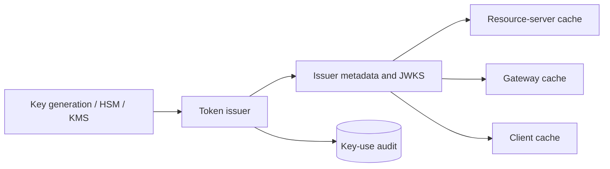

# JOSE and JSON Web Token Verification

## TL;DR

A JSON Web Token (JWT) is a claims container. JOSE defines how that container is signed (JWS) or encrypted (JWE). Neither format decides whether a token is appropriate for a request.

Secure use begins with a token-type-specific validation contract:

- expected issuer and audience/resource;
- allowed signature algorithms fixed by configuration;
- trusted key source bound to that issuer;
- required `typ` and claims;
- time, nonce, assurance, or sender-binding rules;
- authorization semantics and maximum lifetime;
- key-rotation and revocation behavior.

Parse only after applying size/format limits, verify cryptography before trusting claims, then validate the full semantic contract. Never choose algorithms, issuer metadata, or key URLs from untrusted token content. ID tokens, access tokens, session tokens, email links, and DPoP proofs are different token kinds even if all are JWTs.

---

## 1. Format and Trust Boundary

A compact JWS has:

```text
BASE64URL(protected_header)
.
BASE64URL(payload)
.
BASE64URL(signature)
```

The header and payload are encoded, not encrypted. Anyone holding the token can normally read them.

A compact JWE has five parts:

```text
protected_header
.
encrypted_key
.
initialization_vector
.
ciphertext
.
authentication_tag
```

JWS provides integrity/authenticity when verified with the intended key and algorithm. JWE provides confidentiality and integrity under a configured encryption contract. A JWT may be a JWS, a JWE, or nested.

### 1.1 Core invariants

1. **Token-type separation:** one validator accepts one semantic token profile.
2. **Algorithm allowlist:** allowed algorithms come from configuration, never the token alone.
3. **Issuer-key binding:** keys are selected only from metadata configured for the expected issuer.
4. **Audience binding:** the consumer accepts only tokens intended for it.
5. **Required claims:** absence is an error, not a permissive default.
6. **Bounded time:** expiry, not-before, issued-at, and maximum age follow the profile.
7. **Key ambiguity rejection:** zero or multiple matching keys fail safely.
8. **No claim-before-verify authority:** unverified claims do not select tenant, issuer, key URL, or authorization.
9. **Bounded input:** token size, nesting, compression, and JSON complexity are limited.
10. **Auditable result:** decisions record token type, issuer, key ID, validation reason, and policy revision without logging token content.

---

## 2. Build a Validator per Token Type

Do not expose one generic `verifyJwt(token)` to the whole application. Define profiles:

```text
OidcIdTokenValidator
OAuthAccessTokenValidator
ApplicationSessionTokenValidator
EmailActionTokenValidator
DPoPProofValidator
WorkloadAssertionValidator
```

Each profile fixes:

```text
expected_typ
expected_issuer
accepted_audiences/resources
allowed_algorithms
trusted_jwks_source
required_claims
maximum_lifetime
clock_skew_policy
replay/nonce policy
subject/client rules
sender-confirmation rules
```

This prevents cross-JWT confusion: a token valid under one protocol is accepted in another context because a generic verifier checked only signature and expiry.

### 2.1 Validation pipeline

```text
1. enforce transport/header/token size limits
2. split serialization; reject wrong part count
3. decode protected header under strict JSON rules
4. check token type and configured algorithm
5. select expected issuer configuration from request context
6. select exactly one trusted key by allowed key metadata
7. verify signature/authentication tag
8. decode claims under strict JSON rules
9. validate issuer, audience, times, required claims
10. validate profile-specific nonce/subject/client/binding
11. perform current authorization/resource checks
```

Some libraries decode payload before signature verification to locate claims. Treat that data as tainted; do not use an unverified `iss` to fetch arbitrary metadata or an unverified tenant to choose authorization context.

---

## 3. Algorithm and Key Confusion

### 3.1 `alg: none`

An unsecured JWT is valid only in an explicitly designed profile. Ordinary authentication/authorization validators reject it. Do not allow a library's default set to include `none`.

### 3.2 Symmetric/asymmetric confusion

If a validator accepts both HMAC and RSA/ECDSA algorithms and passes one “key” object generically, an attacker may choose HMAC and use a public verification key as the HMAC secret. Fix algorithm family and key type per issuer/token profile.

### 3.3 Header-controlled key locations

JOSE headers can contain `jku`, `x5u`, `jwk`, `kid`, and certificate chains. Do not fetch or trust arbitrary attacker-supplied key material.

Use `kid` only as an index inside the issuer's configured, trusted key set. Treat it as untrusted input:

- cap length;
- compare exact opaque values;
- do not concatenate into file paths or SQL;
- do not use it as a URL;
- reject duplicate keys with the same ID/algorithm/use.

### 3.4 Critical headers

The `crit` header declares extensions that must be understood. Reject a token containing unsupported critical parameters. Ignoring them can change signing semantics.

### 3.5 ECDSA and implementation quality

Use maintained cryptographic libraries. Signature encoding, curve validation, randomness, and low-level key checks are not application code. Enforce algorithm/key-size/curve policy through the library and issuer configuration.

---

## 4. Claims Validation

### 4.1 Issuer

`iss` is an exact identifier. Compare against configured issuer value. Do not normalize surprising trailing slashes, case, or aliases unless the profile defines them.

Key the subject by `(issuer, sub)`; `sub` alone can collide across issuers.

### 4.2 Audience and authorized party

`aud` can be a string or array. Require the intended consumer/resource. Do not accept any token from a trusted issuer regardless of audience.

Profiles such as OIDC may require `azp` checks when multiple audiences exist. OAuth access-token profiles may distinguish client ID, subject, and resource.

### 4.3 Time

- `exp`: reject at/after expiry according to profile.
- `nbf`: reject before token becomes valid.
- `iat`: validate presence/plausibility and maximum token age where required.
- `auth_time`: use for recent-authentication/step-up policy, not general expiry.

Clock skew allowance handles bounded operational drift, not arbitrarily old tokens. Monitor clocks and token age distribution.

### 4.4 Token identity and replay

`jti` is a token identifier, not automatic replay prevention. Replay protection requires durable or bounded state scoped by issuer/token type plus an operation/nonce policy.

For one-time action links or DPoP proofs, atomically consume `jti`/nonce. For ordinary bearer access tokens, a unique `jti` mainly aids audit/revocation unless the resource checks current state.

### 4.5 Private claims

Namespace private claims and version their schema. Avoid:

- mutable complete permission sets with long lifetime;
- secrets or personal data;
- large tenant/group lists;
- claims consumed by only one service but exposed to every holder.

Resource authorization uses current domain state when required. A signed stale role is still stale.

---

## 5. JWK Sets and Key Distribution



A JWK set can contain multiple active/retiring public keys. Consumers:

1. bind JWKS URL to configured issuer metadata;
2. cache by HTTP semantics plus local bounds;
3. select keys by `kid`, algorithm, key type, and intended use;
4. refresh on unknown key through a coalesced/rate-limited path;
5. retain last-known-good keys during transient publication outage;
6. reject if no unique compatible key exists.

### 5.1 Unknown-key storm

An attacker can send tokens with random `kid` values. If every miss triggers a JWKS fetch, the verifier becomes a reflector against the issuer. Use:

- singleflight refresh;
- minimum refresh interval;
- negative cache for unknown key IDs;
- rate limits;
- cached last-known-good set;
- maximum key-set size.

### 5.2 Rotation protocol

1. create new key in protected key service;
2. publish public key;
3. observe verifier convergence;
4. begin signing new tokens with new `kid`;
5. stop old signing;
6. retain old public key for maximum remaining token lifetime plus cache/clock margin;
7. remove old private/public material according to compromise/retention policy.

Publish-before-sign prevents unknown-key outage. Retain-after-stop preserves validation of already issued tokens.

### 5.3 Emergency compromise

Normal expiry may be too slow. Options:

- revoke tokens/key IDs in a current-state service;
- shorten accepted maximum age;
- rotate and block compromised key;
- require introspection for high-risk operations;
- revoke sessions/grants;
- force reauthentication.

Every option trades availability/state load for response speed. Rehearse it.

---

## 6. Access Tokens, ID Tokens, and Sessions

### 6.1 OAuth access token

Consumed by the resource server. Validate resource/audience, issuer, token type/profile, expiry, client/subject, scopes, and sender binding. Then perform resource authorization.

RFC 9068 defines one JWT access-token profile; not every JWT access token follows it. Agree on a profile between issuer and resources.

### 6.2 OIDC ID token

Consumed by the OIDC client. Validate client audience, issuer, nonce/profile, subject, authentication time/assurance as required. Do not present it to an API as access authorization.

### 6.3 Application session

A session token may be opaque or JWT. A JWT cookie does not remove server state if the application needs revocation, device/session inventory, rolling expiry, or account disable.

For browser sessions, secure cookie delivery, CSRF controls, fixation prevention, and logout behavior matter more than token format. See [Authentication Systems](./01-authentication-fundamentals.md).

### 6.4 One-time action tokens

Password reset, email verification, and destructive confirmation tokens need:

- exact action/resource binding;
- short expiry;
- one-time atomic consumption;
- subject/account version binding;
- no sensitive claims in readable payload;
- protection against URL/referrer/log leakage.

A signed JWT without consumption state is replayable until expiry.

---

## 7. JWE and Nested Tokens

Use JWE when token claims must remain confidential from the holder/intermediary and a token format is appropriate. Encryption does not solve:

- replay;
- overbroad authorization;
- long lifetime;
- unsafe storage;
- confused token type;
- recipient compromise.

Fix key-management and content-encryption algorithms by profile. Use authenticated encryption supported by mature JOSE libraries.

### 7.1 Sign then encrypt

A common nested pattern signs claims, then encrypts the JWS for a recipient. The recipient decrypts and then validates the inner signature/profile. Require explicit `cty`/type rules so nesting cannot be confused.

### 7.2 Compression

Compression before encryption can leak secrets when an attacker influences plaintext and observes ciphertext length. It also enables decompression bombs. Disable compression unless a reviewed profile needs it; cap compressed/uncompressed sizes and nesting depth.

### 7.3 Why not put sensitive data in a token?

Tokens travel through clients, proxies, logs, traces, browser storage, support tools, and crash reports. Prefer a reference/opaque handle when data is sensitive or mutable. Encryption centralizes decryption-key access but does not reduce all copies of ciphertext.

---

## 8. Revocation and Freshness

Self-contained validation is a choice:

```text
authorization freshness <= token lifetime + accepted clock/cache margin
```

Revocation mechanisms:

| Mechanism | Freshness | Serving dependency | State/cost |
|---|---|---|---|
| short access-token lifetime | bounded by expiry | none per request | refresh load |
| token/grant denylist | near current | local/distributed lookup | high-cardinality state |
| introspection | current at AS | network call/cache | central load |
| subject/session version | current per user cache | lookup/cache | compact but coarse |
| key revocation | broad/emergency | key/deny distribution | revokes many tokens |

Choose by action risk. A public profile read may tolerate bounded expiry; a privileged financial action may require current account/session status and recent authentication.

Logout and revocation semantics belong to the protocol using the JWT. Cryptographic validity alone does not mean current authorization.

---

## 9. Capacity and Availability

Assume:

- 1.6 million protected requests per second;
- 70 percent carry a locally verified JWT;
- verification consumes 35 microseconds CPU on measured production hardware;
- target CPU utilization is 60 percent;
- JWKS has 8 keys and serialized size 12 KiB;
- 25,000 verifier processes poll every 10 minutes with jitter.

Verification CPU:

```text
1,600,000 * 0.70 * 35 us
= 39.2 CPU-seconds per wall-second
```

At 60 percent target utilization:

```text
39.2 / 0.60 = 65.4 CPU cores
```

This illustrative lower bound excludes parsing, authorization, and tail behavior. Benchmark exact algorithms/libraries/key types.

JWKS average egress:

```text
25,000 * 12 KiB / 600 s
= about 500 KiB/s
```

Average is easy; synchronized cache expiry or unknown-`kid` attacks cause bursts. Jitter, HTTP caching, regional distribution, and singleflight are availability controls.

### 9.1 Failures

- cached valid keys can keep verification available through metadata outage;
- unknown new key should fail safely until trusted publication is obtained;
- introspection-dependent paths need explicit fail-closed/cache behavior;
- clock failures can reject valid tokens or accept expired ones;
- parser/crypto CPU exhaustion requires input bounds and admission controls.

Do not disable signature/audience checks during issuer outage.

---

## 10. Multi-Region and Multi-Tenant Design

Issuer identity and key authority should be globally unambiguous. Options:

- one issuer with globally replicated key metadata and token state;
- regional issuers with distinct exact issuer IDs;
- tenant-specific issuers under controlled registration.

Resource servers select expected issuer from trusted routing/configuration, then validate token `iss`. Do not fetch configuration for an arbitrary unverified issuer string.

For multi-tenant tokens, bind:

- tenant in subject/session/grant;
- resource server lookup;
- authorization decision;
- decision/token cache key.

A tenant claim signed by a trusted issuer is not sufficient if the subject is no longer a member. Define claim freshness.

Key rotation must converge across regions before signing switches. Refresh/revocation state needs authority consistent with its replay guarantee; two regions cannot independently accept the same one-time token unless deduplication is global.

---

## 11. Security Logging and Privacy

Record:

- token profile/type;
- configured issuer;
- audience/resource result;
- `kid` and algorithm after validation;
- token age bucket;
- validation failure reason;
- subject/client/tenant through access-controlled stable references;
- policy/key-set revision;
- sender-binding result.

Never log raw tokens, signatures as reusable artifacts, complete claims, or decryption plaintext. URL/query/header logs are common leak paths.

Metrics:

- validation success/failure by reason/profile/issuer;
- unknown-key and JWKS refresh;
- algorithm/type mismatch;
- expired/not-yet-valid;
- audience/issuer mismatch;
- token age distribution;
- signature verification latency/CPU;
- key-set staleness;
- revocation/introspection latency and cache age;
- oversized/malformed token rejection.

Avoid subject, tenant, `jti`, or `kid` of unbounded cardinality in metric labels.

---

## 12. Failure Traces

### 12.1 Signature-only validation

1. API trusts issuer key.
2. It verifies signature and expiry.
3. It ignores audience.
4. ID token for another client is accepted as API access.

**Prevention:** token-profile validator with audience/type contract.

### 12.2 Algorithm confusion

1. Validator allows RSA and HMAC.
2. Attacker chooses HMAC and signs with public RSA key bytes as secret.
3. generic library verifies.

**Prevention:** fixed algorithm/key-type allowlist per profile.

### 12.3 SSRF through key URL

1. Token header supplies `jku`.
2. verifier fetches it.
3. attacker targets metadata/internal service and supplies own key.

**Prevention:** issuer-configured JWKS only; no token-directed fetch.

### 12.4 Unknown-key denial of service

1. attacker sends random `kid` values.
2. each request fetches JWKS.
3. issuer/egress/verifier saturates.

**Prevention:** coalesced/rate-limited refresh and negative cache.

### 12.5 Key removed too early

1. issuer stops old signing and deletes old public JWK.
2. unexpired tokens still reference it.
3. fleet rejects valid users.

**Prevention:** retain through maximum token lifetime plus margins.

### 12.6 Stale role remains valid

1. admin role removed.
2. long-lived token embeds role.
3. resource trusts claim until expiry.
4. revoked admin acts.

**Prevention:** short lifetime/current-state authorization for high-risk actions.

### 12.7 One-time token replay

1. email action JWT is signed and unexpired.
2. action endpoint never stores consumption.
3. copied link executes repeatedly.

**Prevention:** atomic nonce/`jti` consumption and action/resource binding.

### 12.8 Cross-tenant token cache

1. authorization cache keys by subject/action only.
2. same subject has different rights across tenants.
3. allow leaks between tenants.

**Prevention:** tenant/resource/policy revision in semantic cache key.

---

## 13. Verification

1. **Known-answer vectors:** valid/invalid signatures for every allowed algorithm.
2. **Cross-profile substitution:** ID/access/session/action/DPoP tokens against every wrong validator.
3. **Header adversarial tests:** `none`, wrong alg, `jku`/`x5u`/`jwk`, duplicate `kid`, unsupported `crit`.
4. **Claim tests:** wrong/missing issuer/audience/type/time/subject/nonce.
5. **Parser tests:** duplicate JSON keys, invalid UTF-8, huge numbers, deep nesting, oversized token.
6. **Rotation tests:** publish-before-sign, old-key retention, cache outage, unknown-key storm.
7. **Revocation tests:** logout, role removal, account disable, emergency key compromise.
8. **JWE tests:** wrong recipient/algorithm/tag, nested type, decompression bound.
9. **Multi-region tests:** stale JWKS, regional issuer confusion, one-time replay.
10. **Security tests:** token leakage in logs/URLs/traces/support tools.
11. **Performance tests:** exact library/algorithm/key set under malformed-input load.
12. **Differential tests:** compare independent conformant libraries on a corpus to expose parser differences.

Use maintained JOSE libraries, but wrap them in profile-specific validators whose configuration and tests are application-owned.

---

## 14. Decision Framework

Use a signed JWT when multiple consumers need offline verification of bounded, stable claims and can tolerate freshness limited by token lifetime. Use an opaque reference plus introspection when current revocation, claim confidentiality, or centralized policy outweighs request-time dependency. Use a server-side session when browser lifecycle/revocation/device inventory matters. Use JWE only when a reviewed token transport needs claim confidentiality.

Before choosing JWT:

1. What exact token type/profile is this?
2. Who issues it, who consumes it, and what audience/resource is bound?
3. Which algorithms and key source are configured?
4. Which claims are required and how fresh must they be?
5. What is the maximum lifetime and revocation path?
6. Can the holder read every claim safely?
7. Is replay acceptable, sender-constrained, or statefully prevented?
8. How do key rotation and issuer outage behave?
9. Can another token type from the same issuer be substituted?
10. How are tenant and resource authorization checked?
11. What happens under malformed/unknown-key load?
12. Why is a self-contained token better than an opaque handle here?

JWT reduces a lookup; it does not eliminate identity, authorization, revocation, key management, or state.

---

## Primary References

- [RFC 7515: JSON Web Signature](https://www.rfc-editor.org/rfc/rfc7515)
- [RFC 7516: JSON Web Encryption](https://www.rfc-editor.org/rfc/rfc7516)
- [RFC 7517: JSON Web Key](https://www.rfc-editor.org/rfc/rfc7517)
- [RFC 7518: JSON Web Algorithms](https://www.rfc-editor.org/rfc/rfc7518)
- [RFC 7519: JSON Web Token](https://www.rfc-editor.org/rfc/rfc7519)
- [RFC 8725: JSON Web Token Best Current Practices](https://www.rfc-editor.org/rfc/rfc8725)
- [RFC 9068: JWT Profile for OAuth 2.0 Access Tokens](https://www.rfc-editor.org/rfc/rfc9068)
- [OpenID Connect Core 1.0](https://openid.net/specs/openid-connect-core-1_0.html)

---

## Related Chapters

- [OAuth 2.0 and OpenID Connect](./02-oauth2-openid-connect.md)
- [Authentication Systems](./01-authentication-fundamentals.md)
- [Authorization at Scale](./07-authorization-patterns.md)
- [Encryption Patterns](./06-encryption.md)
