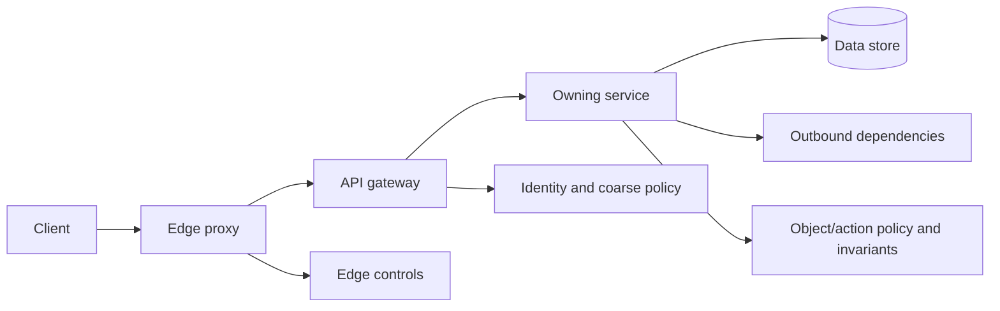

# API Threat Boundaries and Abuse Resistance

## TL;DR

API security is the preservation of request meaning and resource authority across clients, proxies, gateways, services, queues, and data stores. TLS protects a channel; authentication identifies a caller; neither prevents object-level authorization bugs, parser disagreement, mass assignment, SSRF, replay, resource exhaustion, or unsafe webhooks.

A production API needs:

- one canonical interpretation of method, authority, path, headers, and body at every hop;
- schema and size limits before expensive work;
- action and object authorization at the resource owner;
- explicit field-level write policy;
- safe outbound-fetch and webhook protocols;
- bounded query/fan-out/resource consumption;
- idempotency/replay identity for effects;
- tenant-complete cache, storage, and authorization keys;
- stable error semantics without sensitive leakage;
- abuse telemetry and deterministic adversarial tests.

This chapter covers the API threat boundary. Identity protocols, authorization models, encryption, and generic rate algorithms remain in their canonical chapters.

---

## 1. Request Contract and Invariants

Model an accepted request as:

```text
request = (
  authenticated transport/caller,
  canonical authority,
  canonical route and action,
  validated content type/schema,
  bounded body,
  tenant/resource context,
  replay/idempotency identity,
  deadline and resource budget
)
```

### 1.1 Core invariants

1. **Parser agreement:** every security-relevant hop interprets framing and routing identically.
2. **Authentication before trust:** caller-provided identity/tenant headers are not authoritative.
3. **Object authorization:** permission is checked against the actual loaded resource and tenant.
4. **Field allowlist:** clients can modify only explicitly writable fields.
5. **Canonical identity:** cache, idempotency, signature, and authorization use the same request/resource identity.
6. **Bounded work:** input controls bound CPU, memory, I/O, fan-out, and downstream cost.
7. **No internal reachability oracle:** user-controlled URLs cannot access unintended networks/metadata.
8. **Replay policy:** effectful requests define duplicate behavior and freshness.
9. **Safe failure:** malformed/unauthorized input does not leak secrets or widen access.
10. **Complete enforcement:** alternate routes, versions, admin tools, jobs, and direct service paths cannot bypass policy.

---

## 2. Normalize Once, Validate at Every Trust Boundary



The edge normalizes protocol framing and rejects ambiguity. The gateway authenticates and applies coarse policy. The owning service revalidates identity context and enforces domain/object authorization. The database constrains tenant and data invariants where possible.

Do not assume an internal hop is trusted merely because a gateway usually precedes it. Close direct paths or require the same authenticated, integrity-protected context.

### 2.1 Propagated identity

If a proxy injects principal/tenant headers:

1. strip client-supplied versions;
2. authenticate at the proxy;
3. create a signed or channel-protected context;
4. bind audience, issuer, expiry, tenant, action/route, and request identity;
5. verify at the service;
6. retain original workload identity as actor/delegation context.

An unsigned `X-User-ID` is input, not identity.

---

## 3. HTTP Framing and Routing Ambiguity

Request smuggling occurs when two hops disagree about where one request ends and the next begins. Defenses:

- use maintained HTTP stacks;
- reject ambiguous/multiple/conflicting framing headers;
- normalize or reject obsolete transfer encodings;
- do not forward malformed requests after “repair”;
- align proxy/backend HTTP versions and behavior;
- test connection reuse and upgrade paths;
- patch intermediaries as one protocol chain.

### 3.1 Authority and path

Canonicalize before routing/signing/authorization:

- scheme and host/authority;
- port/default port;
- percent encoding;
- dot segments;
- repeated slashes if the framework treats them specially;
- Unicode normalization;
- path versus query;
- case sensitivity;
- forwarded host/proto headers from trusted proxies only.

If the gateway authorizes `/admin` but the service normalizes `/%61dmin` differently, enforcement diverges.

Reject unsupported methods and method overrides. Route action should come from the matched server route, not a client claim.

### 3.2 Header policy

Set bounds on:

- total header bytes;
- header count;
- individual field size;
- duplicates and combination behavior;
- trusted forwarding chain length.

Never trust `X-Forwarded-For`, `Forwarded`, or original-host headers from untrusted network peers. The first trusted ingress replaces/sanitizes the chain.

---

## 4. Schema, Content Type, and Input Bounds

Validate the declared content type and actual parser. Reject ambiguous content negotiation and unsupported charset/encoding.

Schema validation should define:

- required and optional fields;
- types and numeric bounds;
- string length/normalization;
- enum evolution;
- unknown-field policy;
- collection length;
- nesting depth;
- duplicate JSON-key behavior;
- timestamp/decimal canonical form;
- cross-field invariants.

Unknown-field tolerance helps forward compatibility but enables hidden mass-assignment if domain binding accepts them later. Parse into an explicit request type, then map allowed fields.

### 4.1 Decompression and parser bombs

Bound compressed and expanded bytes, compression ratio, nesting, entity expansion, and parser time. Apply limits before buffering the whole body.

Streaming parsers reduce memory but do not remove semantic limits. Abort on deadline/budget and stop downstream work.

### 4.2 Batch and graph APIs

A small request can trigger huge work:

- batch of thousands of IDs;
- GraphQL depth/breadth/aliases;
- recursive filters;
- large page size;
- expensive regex;
- N+1 backend fan-out;
- unbounded export.

Use a cost model:

```text
estimated_cost =
  base_route_cost
  + object_count * per_object_cost
  + fanout_edges * edge_cost
  + requested_bytes * serialization_cost
```

Reject, split, defer, or require an asynchronous job when cost exceeds the request class budget. Measure actual versus estimate and refine.

---

## 5. Object-Level and Function-Level Authorization

Broken object-level authorization (BOLA/IDOR) occurs when a caller can choose an object ID and the service checks only that the caller is authenticated.

Unsafe:

```text
load invoice by id
return invoice
```

Required:

```text
load invoice within authorized tenant/scope
authorize(subject, action='invoice.read', invoice)
return filtered representation
```

Prefer tenant/resource predicates in the storage query where possible, then domain authorization. This reduces accidental cross-tenant load, but does not replace relationship/action policy.

### 5.1 Never authorize by hidden UI

Removing an admin button or route from a client does not protect the endpoint. Every server operation enforces action policy.

### 5.2 Function-level authorization

Map each route to a stable action name. Review differences across:

- HTTP methods;
- versioned routes;
- bulk endpoints;
- export/import;
- support/admin endpoints;
- asynchronous equivalents;
- mobile/legacy APIs.

A read permission does not imply export; update does not imply delete; tenant admin does not imply platform admin.

### 5.3 Relationship changes

Authorize using current resource state and protect against time-of-check/time-of-use races. If membership/ownership can change between check and mutation, enforce the predicate/version in the same transaction or use an expected resource version.

The authorization models and policy distribution belong to [Authorization at Scale](./07-authorization-patterns.md).

---

## 6. Mass Assignment and Response Exposure

Mass assignment binds request fields directly to a domain/database object:

```text
user.update(request.json)
```

An attacker supplies `role=admin`, `tenant_id=other`, `credit_limit`, or `status=approved`.

Use explicit command DTOs and mappings:

```text
UpdateProfileCommand:
  display_name
  locale

server-owned:
  tenant_id
  role
  account_state
  risk_score
```

Field-level authorization may depend on current state or caller role. Reject or explicitly ignore unknown fields consistently; silent acceptance can hide client bugs and future privilege escalation.

Responses also need allowlists. Serializing an internal object can leak:

- password/token hashes;
- internal notes;
- risk/abuse signals;
- encryption metadata;
- tenant IDs;
- deleted fields;
- third-party secrets.

Version response schemas and test sensitive-field absence.

---

## 7. Injection and Command Boundaries

Use parameterized database queries, structured subprocess APIs, and safe templates. The deeper rule: do not cross from data to code/command through string concatenation.

Boundaries include:

- SQL/NoSQL queries;
- shell/process invocation;
- LDAP/XPath;
- template engines;
- log formats;
- search query DSL;
- object-storage paths;
- email/header generation;
- spreadsheet/CSV export formulas.

Allowlists are preferable when input selects an identifier such as sort column, table, field, command, or algorithm. Parameter binding does not safely parameterize every identifier.

Escaping is context-specific. HTML escaping does not secure JavaScript/URL/SQL contexts. Prefer APIs that keep structure.

Log injection matters operationally: encode structured fields and prevent attacker input from forging log lines/severity/tenant.

---

## 8. SSRF and Outbound Request Security

Server-side request forgery turns a trusted server into an attacker-controlled network client.

Threats:

- cloud metadata and node agents;
- internal admin/control planes;
- loopback and link-local services;
- other tenants;
- DNS rebinding;
- redirect to forbidden target;
- alternate IP encodings/IPv6;
- credential leakage to attacker endpoint;
- large/slow response resource exhaustion.

### 8.1 Safer architecture

Prefer not to accept arbitrary URLs. Use:

- named integrations/destinations;
- pre-registered webhook endpoints;
- allowlisted schemes/ports/domains;
- dedicated egress proxy/resolver;
- network policy blocking metadata/internal ranges;
- destination-specific credentials;
- response size/time limits.

Validation sequence:

1. parse URL with one maintained parser;
2. require allowed scheme and explicit/default port;
3. reject userinfo/fragments where irrelevant;
4. resolve through controlled DNS;
5. evaluate every returned IP against destination policy;
6. connect to a validated address while preserving intended TLS hostname;
7. revalidate redirects and DNS changes;
8. limit bytes, time, redirects, and decompression.

String prefix/suffix checks are insufficient. DNS names can resolve to private addresses.

### 8.2 Egress identity

Outbound calls use per-integration workload identity/credentials. Do not attach a broad cloud credential to arbitrary destinations. Strip sensitive inbound headers before forwarding.

---

## 9. Webhooks and Asynchronous Callbacks

Incoming webhook verification needs:

```text
provider identity/key
timestamp/freshness
event identity
signature over exact transmitted bytes and bound metadata
destination/account binding
replay/idempotency state
schema/version
```

Verify the signature before JSON reserialization changes bytes. Use constant-time comparison for MACs. Restrict algorithms/keys and rotate with overlap.

The receiver:

1. bounds body;
2. verifies key/signature/timestamp;
3. atomically records event ID/digest;
4. acknowledges after durable acceptance;
5. processes asynchronously;
6. quarantines deterministic failures;
7. reconciles provider state for high-value events.

Do not trust an event merely because its source IP matches a published range; signatures provide stronger identity and ranges change.

Outgoing webhooks need:

- destination registration/verification;
- SSRF-safe egress;
- per-tenant secrets/keys;
- signed event ID/timestamp/body;
- retry with backoff and bounded horizon;
- delivery attempt log;
- disable/quarantine for failing destinations;
- secret rotation overlap;
- redaction and tenant isolation.

---

## 10. Browser APIs: Cookies, CSRF, and CORS

If a browser automatically sends credentials (cookies, client certificates), state-changing requests need CSRF protection:

- SameSite cookie policy;
- unpredictable token bound to session;
- origin/referer validation where appropriate;
- no state change via safe methods;
- content-type/custom-header strategy for APIs.

Bearer tokens in explicit authorization headers are not automatically attached cross-origin like cookies, but token storage/exfiltration and XSS remain.

CORS is a browser response-reading policy, not server authentication. Avoid reflecting arbitrary `Origin` with credentials. Configure exact trusted origins, methods, headers, and cache `Vary: Origin` correctly.

Servers must enforce authorization regardless of CORS; non-browser clients ignore it.

---

## 11. Replay, Idempotency, and Request Signatures

TLS does not prevent a valid request from being repeated by a holder or intermediary.

For effectful operations use [Idempotency and Operation Identity](../01-foundations/08-idempotency.md). Bind operation key to tenant, caller, action, resource, and semantic request digest.

HTTP message signatures or application request signatures can bind:

- method;
- authority;
- target URI;
- selected headers;
- content digest;
- creation/expiry;
- nonce/key identity.

Both signer and verifier must canonicalize identically and account for proxies that rewrite authority/path/headers. Signature validation does not replace authorization or replay state.

Use signed requests where channel termination/intermediaries or webhook/client proof require message-level integrity. Otherwise mTLS/OAuth sender constraint may be simpler.

---

## 12. Resource Exhaustion and Abuse

Rate limits are one layer; resource protection also needs:

- request/body/header limits;
- concurrency limits;
- bounded queues;
- per-tenant query/fan-out budgets;
- deadlines/cancellation propagation;
- pagination/export caps;
- memory/CPU quotas;
- downstream bulkheads;
- cost-aware admission;
- cache-miss/origin protection.

The generic algorithms belong to [Rate Limiting](../06-scaling/05-rate-limiting.md) and [Backpressure](../06-scaling/07-backpressure.md).

### 12.1 Capacity example

Suppose an endpoint:

- receives 6,000 requests/s;
- performs up to 40 downstream lookups per request;
- downstream safe capacity is 90,000 lookups/s;
- target utilization is 70 percent.

Unbounded worst-case demand:

```text
6,000 * 40 = 240,000 lookups/s
```

Admissible average downstream budget:

```text
90,000 * 0.70 = 63,000 lookups/s
```

Average budget per request at 6,000 rps:

```text
63,000 / 6,000 = 10.5 lookups/request
```

The API must reduce requested fan-out, batch/cache efficiently, defer work, or reject. Adding only a request-per-second limit ignores cost variance.

Charge retries and cache misses to the initiating tenant/operation budget. Otherwise attackers amplify work indirectly.

---

## 13. Error and Cache Semantics

Errors should be stable, machine-readable, and minimally revealing:

```text
type
title
status
code
request/trace reference
safe validation details
```

Do not expose stack traces, SQL, internal hostnames, key material, policy internals, or whether a sensitive resource exists. For object access, returning the same external result for absent and unauthorized may reduce enumeration, while internal audit keeps distinction.

Differentiate:

- malformed request;
- unauthenticated;
- unauthorized;
- conflict/precondition;
- rate/admission rejection;
- transient unavailable;
- accepted asynchronous work.

Cache controls are security controls. Prevent shared-cache leakage by including authorization/tenant in cache semantics or marking private/no-store. Do not cache personalized error/success responses under a public key. Normalize `Vary` behavior across CDN/proxy/app.

---

## 14. Multi-Tenant and Multi-Region Control Planes

Tenant context must be derived from authenticated grant/host/resource relationship and propagated with integrity. Every database/cache/search/object key includes tenant scope unless the resource is deliberately global.

API policy/config includes:

- routes and versions;
- schema/size/cost rules;
- identity issuers/audiences;
- authorization action mapping;
- egress destinations;
- webhook keys;
- rate/admission classes;
- CORS/cache policy.

Publish versioned, signed snapshots; validate and activate atomically. A partial policy rollout where a new route exists before its authorization mapping can create a bypass.

Regions need last-known-good policy with a staleness bound. Emergency denies and key revocations need convergence telemetry. Do not independently resolve concurrent security policy with last-write-wins if one update removes access and another adds it.

---

## 15. Failure Traces

### 15.1 BOLA across tenants

1. authenticated user changes `/tenants/A/invoices/9` to tenant B's ID.
2. service loads by invoice ID alone.
3. authentication succeeds; no object/tenant check occurs.
4. B's invoice leaks.

**Prevention:** tenant-scoped load plus resource/action authorization.

### 15.2 Proxy/backend parser disagreement

1. edge and backend disagree on request framing.
2. attacker embeds a second request.
3. edge security applies to first interpretation.
4. backend processes hidden request under another user's connection.

**Prevention:** reject ambiguous framing and test the full proxy chain.

### 15.3 Mass assignment

1. profile update deserializes directly into user record.
2. attacker includes `role=admin`.
3. ORM persists it.

**Prevention:** explicit command fields and server-owned attributes.

### 15.4 SSRF through redirect

1. initial URL resolves to allowed host.
2. host redirects to metadata IP.
3. client follows without revalidation.
4. credentials leak.

**Prevention:** validate each hop/address and isolate egress.

### 15.5 Webhook replay

1. valid signed payment event is captured.
2. signature verifies on repeat.
3. receiver lacks event-id consumption.
4. credit applied twice.

**Prevention:** freshness plus transactional event idempotency.

### 15.6 Query-cost attack

1. attacker submits deeply aliased graph query under normal request-rate quota.
2. one request causes thousands of backend calls.
3. shared dependency saturates.

**Prevention:** structural cost model, depth/breadth/fan-out limits, and concurrency admission.

### 15.7 CORS credential leak

1. server reflects arbitrary origin and allows credentials.
2. attacker site sends browser request with victim cookie.
3. browser exposes response to attacker.

**Prevention:** exact origin policy and CSRF/session controls.

### 15.8 Shared cache leaks authorization

1. authenticated response cached by URL only.
2. next tenant requests same URL.
3. cache returns first tenant's data.

**Prevention:** private/no-store or complete tenant/auth-aware cache key.

---

## 16. Observability and Incident Response

Track:

- rejected requests by stage/reason;
- parser/framing anomalies;
- route/action/policy revision;
- authentication and authorization denial;
- cross-tenant/resource mismatch;
- schema/unknown-field/mass-assignment attempts;
- body/header/decompression bounds;
- query estimated versus actual cost;
- downstream fan-out and cancellation;
- SSRF destination-policy rejection;
- webhook signature/replay/delivery state;
- idempotency conflict/replay;
- cache authorization anomalies;
- rate/concurrency/admission outcomes.

Avoid raw tokens, credentials, request bodies, personal data, and attacker-controlled high-cardinality fields in metrics/logs.

Incident controls:

- disable route/client/integration;
- publish emergency deny;
- rotate webhook/API credentials;
- block destination/egress;
- reduce query/body/fan-out limits;
- revoke grants/sessions;
- identify affected resources/tenants from audit evidence;
- replay quarantined work only after repair.

Security logging must survive the incident without becoming the resource-exhaustion vector. Buffer/bound and preserve critical audit separately.

---

## 17. Verification

1. **Protocol-chain tests:** edge/gateway/backend parse the same corpus.
2. **Route inventory:** every method/version/admin/async path maps to an action policy.
3. **Object authorization matrix:** subject × tenant × resource × action, including existence masking.
4. **Mass-assignment tests:** unexpected/server-owned fields never persist.
5. **Schema fuzzing:** duplicate keys, deep nesting, encodings, huge numbers/collections.
6. **SSRF tests:** private/link-local/loopback, IPv6, alternate encodings, DNS rebinding, redirects.
7. **Injection tests:** every interpreter/identifier boundary.
8. **Webhook tests:** exact bytes, wrong key/algorithm/timestamp, duplicate/out-of-order, rotation.
9. **Browser tests:** CSRF, origin confusion, CORS preflight/cache, cookie policy.
10. **Cost/load tests:** expensive legal requests, fan-out, decompression, cancellation, retries.
11. **Cache tests:** cross-user/tenant, `Vary`, error caching, authorization changes.
12. **Control-plane tests:** partial/stale policy, rollback, emergency deny.
13. **Security regression corpus:** every disclosed incident class becomes a test.
14. **End-to-end adversarial review:** prove no bypass path reaches protected state.

Test semantic invariants, not only status codes. A `403` on one route proves nothing about its bulk or legacy equivalent.

---

## 18. Decision Framework

Before exposing an endpoint:

1. What exact action and resource does it represent?
2. Which hop establishes identity, tenant, authority, path, and body meaning?
3. Can any alternate path bypass enforcement?
4. How is object/relationship authorization performed atomically enough?
5. Which fields are writable and readable?
6. What parser/normalization differences exist across hops?
7. What is the maximum bytes, nesting, fan-out, CPU, memory, I/O, and deadline?
8. Does input control an outbound destination or interpreter?
9. What is the replay/idempotency contract?
10. How do caches separate authorization/tenant contexts?
11. What sensitive data can appear in errors/logs/traces?
12. How do policy, keys, and integrations rotate across regions?
13. Which evidence proves the endpoint resists its highest-risk abuse cases?

Secure APIs make illegal states and ambiguous interpretations hard to express. A collection of middleware with no coherent request/resource contract does not.

---

## Primary References

- [OWASP API Security Top 10 (2023)](https://owasp.org/API-Security/editions/2023/en/0x11-t10/)
- [RFC 9110: HTTP Semantics](https://www.rfc-editor.org/rfc/rfc9110)
- [RFC 9112: HTTP/1.1](https://www.rfc-editor.org/rfc/rfc9112)
- [RFC 9457: Problem Details for HTTP APIs](https://www.rfc-editor.org/rfc/rfc9457)
- [RFC 9421: HTTP Message Signatures](https://www.rfc-editor.org/rfc/rfc9421)
- [OWASP SSRF Prevention Cheat Sheet](https://cheatsheetseries.owasp.org/cheatsheets/Server_Side_Request_Forgery_Prevention_Cheat_Sheet.html)
- [Fetch Standard: CORS Protocol](https://fetch.spec.whatwg.org/#http-cors-protocol)

---

## Related Chapters

- [OAuth 2.0 and OpenID Connect](./02-oauth2-openid-connect.md)
- [Authorization at Scale](./07-authorization-patterns.md)
- [Zero-Trust Service and Workload Architecture](./05-zero-trust-architecture.md)
- [Idempotency and Operation Identity](../01-foundations/08-idempotency.md)
- [Rate Limiting](../06-scaling/05-rate-limiting.md)
- [Backpressure](../06-scaling/07-backpressure.md)
- [Edge Gateway and API Mediation](../12-service-mesh/02-api-gateway.md)
