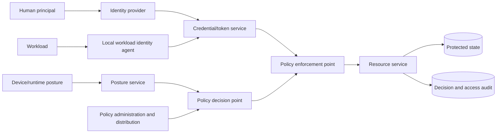

# Zero-Trust Service and Workload Architecture

## TL;DR

Zero trust is an authorization architecture, not a product and not “put mTLS everywhere.” Network location is treated as a weak signal. Every access decision binds an authenticated principal, workload, device or runtime posture, requested action, resource, tenant, and policy revision; enforcement occurs at a boundary that the caller cannot bypass.

A zero-trust design requires:

- cryptographic human and workload identity with short-lived credentials;
- explicit trust domains and federation;
- policy decision and enforcement points with versioned, fail-safe state;
- sender-constrained or channel-bound credentials where replay matters;
- resource-level authorization at the service that owns the resource;
- control-plane distribution that tolerates stale state without silently widening access;
- continuous observability, credential rotation, break-glass governance, and recovery.

Zero trust replaces ambient, transitive trust with a verifiable request contract and bounded failure modes.

---

## 1. Threat Model and Access Contract

Assume an attacker may:

- reach internal network addresses;
- compromise one user account, device, workload, proxy, or CI runner;
- steal a bearer token or static secret;
- exploit a trusted service as a confused deputy;
- replay an old request;
- alter control-plane configuration;
- move laterally through broad service credentials;
- abuse a support or break-glass path;
- target a stale region during policy or key rollout.

An access decision is:

```text
decision = authorize(
  subject_identity,
  workload_identity,
  device_or_runtime_posture,
  requested_action,
  resource_identity,
  tenant,
  credential_binding,
  request_context,
  policy_revision
)
```

Authentication establishes which principal or workload presented a credential. Authorization determines whether that identity may perform this action on this resource. The canonical user authentication lifecycle is in [Authentication Systems](./01-authentication-fundamentals.md); policy models are in [Authorization at Scale](./07-authorization-patterns.md).

### 1.1 Core invariants

1. **No ambient authority:** being on a subnet, cluster, VPN, or host does not by itself grant application access.
2. **Unforgeable identity:** accepted identity is cryptographically verified against an intended trust domain.
3. **Audience and resource binding:** a credential issued for service A is not silently accepted by service B.
4. **Least privilege:** permissions name allowed actions and resources, not a broad network zone.
5. **Tenant binding:** identity, policy, cache keys, and resource lookup agree on tenant scope.
6. **Complete enforcement:** every path to protected state crosses an enforcement point.
7. **Fail-safe degradation:** missing or invalid identity/policy does not widen access.
8. **Monotonic revocation posture:** a stale evaluator cannot reactivate an explicitly revoked principal beyond the declared staleness budget.
9. **Auditable decision:** an operator can identify subject, resource, action, policy revision, and reason without logging secrets.
10. **Bounded credential lifetime:** compromise has an expiration and rotation path.

---

## 2. Planes and Trust Boundaries



The **identity plane** attests principals and workloads and issues short-lived credentials.

The **policy control plane** stores policy, compiles it, validates changes, distributes revisions, and records provenance.

The **enforcement/data plane** authenticates the channel or request, obtains/evaluates policy, and gates the operation.

The **resource plane** owns fine-grained facts that generic gateways cannot know: record owner, current tenant, object classification, workflow state, or relationship.

Do not collapse these into a single “zero-trust proxy” box. A gateway can enforce coarse ingress policy, while the owning service enforces resource-specific authorization. If a service accepts a bypass path directly, the gateway is only advisory.

---

## 3. Identity Sources

### 3.1 Human identity

Human sessions normally originate at an identity provider and carry:

- stable subject identifier;
- issuer and audience;
- authentication time and assurance;
- session or token identity;
- organization/tenant membership;
- bounded claims needed by the relying party.

Do not encode a complete, long-lived permission graph into a token. Authorization can change before token expiry, and token size/claim exposure grow with every consumer. Use short-lived tokens for stable identity/assurance and query or cache current policy where required.

### 3.2 Workload identity

Static API keys and shared client secrets make rotation and attribution weak. Prefer runtime-issued identity derived from attested execution properties:

```text
node attestation
  -> trusted local agent
  -> workload selectors
  -> short-lived workload credential
  -> mTLS or signed request
```

Selectors might include cluster, namespace, service account, image digest, process identity, or cloud instance identity. The selector set is an authorization input to issuance; accepting only a caller-provided service name would let any process self-assert.

SPIFFE models a workload identity as a URI in a trust domain and delivers short-lived X.509 or JWT identity documents through a local Workload API. The local endpoint is security-sensitive: a neighboring process that can impersonate selectors or access another workload's credential can assume its identity.

### 3.3 Trust domains

A trust domain is a root of identity authority, not merely a DNS suffix. Separate domains when administrative control, environment, regulatory boundary, or security posture differs.

Federation publishes which roots and identities another domain accepts. It does not imply universal trust between all identities. Authorization still maps federated identities to explicit resources/actions.

Avoid one global root whose compromise authenticates every environment. Equally, avoid so many roots that rotation and policy become unmanageable. Model trust-domain failure as a blast-radius decision.

---

## 4. Credential Forms and Binding

### 4.1 Mutual TLS

mTLS authenticates both ends of a connection and protects transport. A workload certificate should include a stable workload identity, short validity, and a chain to the intended trust domain.

Connection authentication is not request authorization. A proxy may multiplex requests from many users over one authenticated workload connection. The downstream must distinguish “gateway workload called me” from “user X requested action Y,” and must verify any propagated user context rather than trust an arbitrary header.

### 4.2 Bearer tokens

A bearer token can be replayed by whoever possesses it. Limit:

- audience;
- scope/resource;
- lifetime;
- issuer;
- accepted algorithms and keys;
- where it may be logged or stored.

Bearer credentials are often necessary across proxies and heterogeneous systems, but their replay boundary must be explicit.

### 4.3 Sender-constrained credentials

Bind a token to a key the client proves it possesses. OAuth mTLS certificate-bound tokens, for example, carry confirmation material associated with the client certificate. A stolen token alone is then insufficient.

Binding adds lifecycle coupling: certificate rotation and token refresh must overlap correctly, TLS termination must preserve proof, and intermediaries cannot silently substitute identities. Model these operational costs before selecting it.

### 4.4 Signed request envelopes

For asynchronous queues or multi-hop workflows, a connection-bound identity may be gone when work executes. A signed envelope can bind:

```text
issuer workload
original principal
tenant
audience
action
resource reference
request digest
issued_at / expires_at
nonce or operation identity
policy context reference
signature
```

The consumer validates signature, audience, expiry, replay/idempotency semantics, and authorization against current resource state. Do not forward an end-user bearer token into a queue with retention longer than its intended exposure.

---

## 5. Policy Decision and Enforcement

### 5.1 PEP placement

| Enforcement point | Knows well | Cannot safely own alone |
|---|---|---|
| Edge gateway | external identity, route, coarse tenant, abuse signals | record ownership and domain state |
| Service proxy/sidecar | workload identities, method, connection | application object semantics |
| Application middleware | route/action, principal context | every resource fact unless passed |
| Domain service | resource state, relationships, invariants | fleet-wide ingress abuse |
| Database policy | row/tenant ownership | user intent and cross-service workflow |

Defense in depth is useful only when layers have clear ownership. Repeating the same coarse role check in three places creates drift; enforcing coarse ingress, workload admission, and resource authorization at their natural boundaries creates complementary controls.

### 5.2 Local versus remote policy decisions

Local evaluation:

- avoids an RPC on every request;
- survives policy-service outage;
- requires versioned policy distribution and bounded staleness.

Remote evaluation:

- centralizes complex/current facts;
- simplifies immediate revocation;
- adds latency, availability, and fan-out dependencies.

A hybrid is common: compiled stable policy locally, with remote lookup for high-risk or highly dynamic facts. The application owns fallback. A generic policy client must not silently convert “PDP unavailable” into allow.

### 5.3 Decision cache

If decisions are cached, the key must include all semantic inputs:

```text
subject
workload/caller
tenant
action
resource or policy-relevant resource version
assurance/posture class
policy revision
```

Caching only `user_id + permission` can leak across tenant or object boundaries. Bound TTL by revocation requirements and resource-state volatility. Negative and positive decisions may need different budgets.

---

## 6. Policy Control Plane

A policy change is production code. Use:

```text
DRAFT
  -> VALIDATED
  -> REVIEWED
  -> COMPILED
  -> PUBLISHED
  -> OBSERVED
  -> SUPERSEDED
```

An immutable policy revision contains:

```text
policy_revision
schema_version
source_digest
compiled_digest
target_services
required_evaluator_version
created_by
approved_by
created_at
change_reason
previous_revision
signature
```

### 6.1 Publication

1. parse and type-check policy;
2. validate referenced actions/resources/attributes;
3. reject cycles or excessive evaluation complexity;
4. run unit, regression, and semantic-diff tests;
5. publish content-addressed compiled artifacts;
6. advance an environment pointer with compare-and-swap;
7. evaluators fetch, verify, compile/load, and atomically activate;
8. report active revision and errors.

Push notifications reduce latency; polling repairs missed events. Evaluators reject rollback to an older revision unless an explicit signed rollback command authorizes it.

### 6.2 Staleness classes

Not every decision needs the same freshness:

| Class | Example | Stale behavior |
|---|---|---|
| Static service allowlist | service A may call method B | last known good within hours |
| Tenant membership | user belongs to organization | minutes or session-bound |
| Privileged role revocation | production admin removed | seconds, remote check if needed |
| Emergency deny | compromised workload blocked | near-immediate, fail closed beyond budget |

Declare staleness in policy metadata. “Eventually consistent authorization” without a bound is not a security requirement.

---

## 7. Credential Issuance and Rotation

### 7.1 Bootstrap

The first credential cannot authenticate itself. Bootstrap depends on an attested local or platform identity:

- cloud instance/workload identity;
- orchestrator service account plus node attestation;
- TPM or hardware identity;
- signed workload artifact and trusted launcher;
- pre-provisioned enrollment credential with narrow one-time use.

Map bootstrap evidence to a workload identity through controlled registration. Protect the registration API; it decides which runtime facts can become which identity.

### 7.2 Rotation overlap

For certificates/roots:

```text
publish new trust root
  -> issue credentials under old and/or new chain
  -> wait until verifiers trust new root
  -> switch issuance
  -> observe old-chain usage reach zero
  -> remove old root after maximum credential lifetime + margin
```

Removing an old root before all credentials rotate causes an outage. Trusting a compromised old root indefinitely preserves attacker access. Track both safety windows explicitly.

### 7.3 Revocation versus short lifetime

Short-lived credentials reduce reliance on large revocation lists, but issuance must stop quickly and verifiers must reject beyond expiry. For immediate compromise response, combine:

- disabling registration/issuance;
- emergency deny policy;
- connection draining;
- revocation/status where supported;
- key rotation;
- workload quarantine.

Connection pools can outlive credential rotation. Define whether an authenticated connection remains valid until close or is periodically reauthorized.

---

## 8. Capacity and Availability

Assume:

- 180,000 requests per second;
- 2 local policy evaluations per request;
- 0.4 percent require a remote high-risk decision;
- remote PDP p99 service time is 12 ms;
- target remote-PDP utilization is 60 percent;
- one PDP replica sustains 500 concurrent evaluations.

Local evaluation rate:

```text
180,000 * 2 = 360,000 evaluations/s
```

Remote request rate:

```text
180,000 * 0.004 = 720 requests/s
```

Expected in-flight remote work at p99 is roughly:

```text
720/s * 0.012 s = 8.64 requests
```

That suggests concurrency is easy, but averages hide bursts and dependency fan-out. Size from measured distributions and regional failure headroom, not the arithmetic alone. More important: the remote PDP is on a high-risk request path, so provision N-minus-one capacity, bound deadlines, and define fail-closed behavior.

Control-plane fan-out scales with evaluators. A 4 MiB policy snapshot sent every minute to 10,000 processes is:

```text
4 MiB * 10,000 / 60 s = 667 MiB/s
```

Use content digests, regional relays, compressed artifacts, jittered polling, and deltas with full-snapshot repair. Keep local evaluation artifacts immutable and atomically replaceable.

---

## 9. Multi-Region and Federation

Identity and policy have different authority requirements:

- one globally ordered policy revision per environment;
- regional distribution and local evaluation;
- trust-domain roots scoped by environment/administration;
- explicit federation bundles;
- workload home region or globally unique identity;
- region-local emergency deny capability with audited convergence.

If regions accept independent concurrent policy writes, conflict resolution must preserve deny semantics and rule ordering. Last-write-wins can remove a security restriction because of clock or replication order. Prefer a single logical policy authority or disjoint ownership.

Regional isolation needs last-known-good identity bundles and policy, but also a maximum isolation duration. After it, high-risk access fails closed or enters a documented break-glass procedure.

Federation maps identities, not permissions. A partner identity `spiffe://partner.example/service/a` should receive only explicitly mapped access in the local domain.

---

## 10. Network Segmentation Still Matters

Zero trust does not mean “the network is irrelevant.” Segmentation:

- removes unreachable attack paths;
- limits credential-testing and scanning;
- contains data exfiltration;
- protects control-plane endpoints;
- reduces accidental cross-environment access.

The difference is that reachability is not sufficient authority. Use network policy as one layer, cryptographic workload identity for authentication, and resource policy for authorization.

Egress is often the forgotten half. An exploited workload with broad outbound network access can exfiltrate data or call arbitrary effectors. Apply destination allowlists, DNS/service identity, proxy policy, and per-workload egress credentials.

---

## 11. Failure Traces

### 11.1 Proxy trusts an unsigned identity header

1. Gateway authenticates users and normally injects `X-User-ID`.
2. Internal service is also reachable directly.
3. Caller supplies its own header.
4. Service authorizes as another user.

**Prevention:** remove caller-provided identity headers at the boundary, cryptographically bind propagated identity, and close bypass paths.

### 11.2 mTLS grants transitive authority

1. Service A's certificate is valid.
2. Service A is compromised.
3. Every downstream accepts any action from A because “mTLS passed.”
4. Attacker reads or mutates unrelated tenants.

**Prevention:** mTLS authenticates workload A; downstream still authorizes action/resource/tenant and propagated principal.

### 11.3 Policy outage widens access

1. Remote PDP times out.
2. SDK catches the error and defaults to `allow` for availability.
3. An attacker creates PDP load and bypasses policy.

**Prevention:** decision-class-specific fail-safe default, local last-known-good policy, deadlines, and circuit isolation.

### 11.4 Stale allow survives revocation

1. Administrator access is revoked.
2. One region misses the policy update.
3. Cached allow remains valid for an hour.
4. Revoked account changes production.

**Prevention:** freshness class for privileged access, active revision telemetry, short cache bound, and remote/current check for sensitive actions.

### 11.5 Root rotation partitions the fleet

1. Issuer begins signing with a new root.
2. Some proxies have not received the bundle.
3. New credentials fail in those paths.
4. Retry traffic amplifies the outage.

**Prevention:** trust-new-before-issue, observed convergence, dual-chain overlap, and staged rotation.

### 11.6 Cross-tenant decision cache

1. Cache key contains user and action but not tenant/resource.
2. User is admin in tenant A.
3. Cached allow is reused in tenant B.

**Prevention:** complete semantic cache key and property tests for tenant separation.

### 11.7 Identity agent is a local confused deputy

1. Any container on a node can reach a workload identity endpoint.
2. Agent selects identity from caller-provided metadata.
3. Malicious workload requests a privileged identity.

**Prevention:** local endpoint isolation and attested selector matching based on trusted runtime facts.

---

## 12. Observability and Incident Response

Identity-plane signals:

- issuance/renewal rate, latency, and rejection reason;
- credential age and expiry headroom;
- selector/attestation mismatch;
- active chain/root distribution;
- unexpected identity on node/namespace;
- issuance after disable request.

Policy-plane signals:

- mutation, validation, approval, and publication outcomes;
- evaluator active revision distribution;
- stale/error/not-ready evaluator count;
- semantic decision diff during rollout;
- emergency deny propagation latency;
- rollback/downgrade attempts.

Enforcement signals:

- allow/deny/error by action and coarse resource class;
- authentication and audience/binding failures;
- policy evaluation latency and cache result;
- bypass-path probes;
- cross-region/federation use;
- break-glass activation and duration.

Avoid principal IDs, resource IDs, and arbitrary policy attributes as metric labels. Put high-cardinality evidence in access-controlled audit logs with sampling/retention rules.

Incident response needs a rehearsed sequence:

1. identify compromised principal/workload/trust domain;
2. block issuance and publish emergency deny;
3. drain or quarantine active workloads/connections;
4. rotate affected credentials/roots;
5. search audit evidence for resource access and lateral movement;
6. repair policy/registration cause;
7. restore through ordinary versioned publication;
8. remove emergency state only after verification.

---

## 13. Migration Path

Do not begin by enforcing every service-to-service edge.

1. Inventory callers, workloads, resources, and bypass paths.
2. Issue workload identities in observe-only mode.
3. Build an edge graph from authenticated telemetry.
4. Define action/resource vocabulary and policy ownership.
5. Enforce on a low-risk service with a tested fail-safe path.
6. Move from broad service allowlists to method and resource authorization.
7. Replace static credentials and shared secrets.
8. Add high-risk freshness and sender binding.
9. segment network/egress based on observed required paths;
10. remove legacy credentials and unauthenticated endpoints.

Observe-only data is evidence, not policy. Existing traffic may include compromise, obsolete integrations, or overbroad access. Require owners to justify edges before converting them to allows.

Use policy semantic diffs: replay privacy-scrubbed access requests under old and proposed revisions and review newly allowed and newly denied sets. Canary enforcement by service/tenant and retain an audited rollback revision.

---

## 14. Verification

1. **Identity tests:** wrong issuer, audience, trust domain, expiry, signature, and key binding.
2. **Policy tests:** allow/deny vectors, missing attributes, resource versions, and tenant separation.
3. **Path tests:** direct-to-service, alternate ports, admin endpoints, queues, jobs, and database access.
4. **Control-plane fault tests:** missed update, corrupt artifact, rollback, stale region, and invalid compiler version.
5. **Rotation tests:** new root trust before issuance, old root removal, long-lived connection behavior.
6. **Cache tests:** complete key, stale revocation, negative/positive TTL, cross-tenant properties.
7. **Load tests:** cold evaluator start, policy fan-out, remote PDP overload, and denial storms.
8. **Federation tests:** unknown domain, expired bundle, identity collision, and overbroad mapping.
9. **Break-glass game day:** activate, scope, observe, expire, and review emergency access.
10. **Adversarial tests:** header spoofing, token replay, confused deputy, SSRF/egress, and compromised workload lateral movement.

The strongest test is end-to-end: demonstrate that a principal can reach an intended resource and that changing network location, forging headers, replaying credentials, or calling through an unintended workload does not widen authority.

---

## 15. Decision Framework

Use this architecture when internal reachability is broad, workloads are dynamic, credentials need automated rotation, multiple trust domains interact, or compromise of one workload must not grant transitive access.

Before adding a component, answer:

1. Which attacker capability or ambient trust does it remove?
2. What identity is authenticated, and how was it bootstrapped?
3. What exact action/resource/tenant is authorized?
4. Which enforcement paths can bypass the check?
5. How stale may identity, policy, posture, and revocation become?
6. Does the credential need sender binding?
7. What happens when issuer, PDP, policy distribution, or trust bundle is unavailable?
8. How are credentials and roots rotated without partitioning the fleet?
9. Which data appears in decision/audit telemetry?
10. How is emergency access bounded and expired?

Do not call an architecture zero trust merely because it uses a mesh, proxy, VPN replacement, or short-lived certificate. The defining property is that each protected action is authorized from verified identity and current resource context at a non-bypassable boundary, with explicit failure semantics.

---

## Primary References

- [NIST SP 800-207: Zero Trust Architecture](https://csrc.nist.gov/pubs/sp/800/207/final)
- [SPIFFE Identity and Verifiable Identity Document Specification](https://spiffe.io/docs/latest/spiffe-specs/spiffe-id/)
- [SPIFFE Workload API Specification](https://spiffe.io/docs/latest/spiffe-specs/spiffe_workload_api/)
- [RFC 8705: OAuth 2.0 Mutual-TLS Client Authentication and Certificate-Bound Access Tokens](https://www.rfc-editor.org/rfc/rfc8705)
- [RFC 9700: Best Current Practice for OAuth 2.0 Security](https://www.rfc-editor.org/rfc/rfc9700)
- [BeyondCorp: A New Approach to Enterprise Security (Google Research)](https://research.google/pubs/beyondcorp-a-new-approach-to-enterprise-security/)

---

## Related Chapters

- [Authentication Systems](./01-authentication-fundamentals.md)
- [OAuth 2.0 and OpenID Connect](./02-oauth2-openid-connect.md)
- [Authorization at Scale](./07-authorization-patterns.md)
- [Encryption Patterns](./06-encryption.md)
- [Service Mesh Data and Control Planes](../12-service-mesh/03-sidecar-pattern.md)
- [Multi-Tenancy Patterns](../06-scaling/12-multi-tenancy.md)
