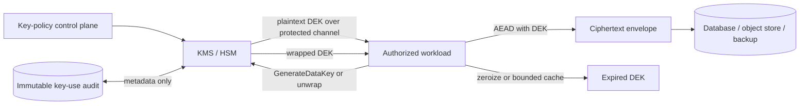
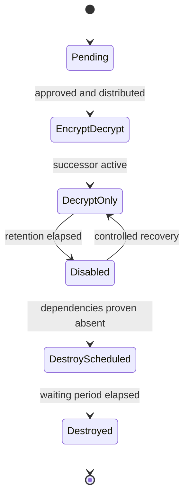

# Cryptographic Key and Data-Protection Architecture

## TL;DR

Encryption is not a box labeled “AES” between an application and a database. It is a distributed protocol whose correctness depends on data classification, authenticated metadata, nonce allocation, key hierarchy, authorization to use keys, recoverability, rotation, and the lifetime of every plaintext copy.

A production design normally separates:

- **bulk data encryption** with an authenticated-encryption algorithm such as AES-GCM or ChaCha20-Poly1305;
- **key wrapping** through a key-encryption key (KEK) held by a KMS or HSM;
- **short-lived data-encryption keys** (DEKs) scoped to a tenant, object, shard, epoch, or other explicit blast radius;
- **transport protection** with TLS 1.3, which is distinct from stored-data protection and application authorization;
- **key policy and lifecycle** in a control plane, away from the high-volume data path;
- **versioned ciphertext envelopes** that preserve the algorithm, key reference, nonce, authenticated context, and migration state needed to decrypt safely years later.

The central invariant is stronger than “an attacker cannot read the ciphertext”: an unauthorized party must be unable to read **or undetectably modify** protected data, while an authorized recovery process must still be able to interpret every retained version for its declared lifetime.

---

## 1. Start with the Protection Contract

Cryptography can only enforce a stated boundary. Before selecting a primitive, identify:

- the data class: public, internal, confidential, credential, regulated, or customer-managed;
- the attacker: stolen disk, database reader, backup operator, cloud administrator, compromised application process, neighboring tenant, network observer, or malicious client;
- when plaintext is permitted: client only, trusted service memory, analytics enclave, support workflow, or nowhere after ingestion;
- required integrity and provenance, not only confidentiality;
- retention, legal hold, export, deletion, and disaster-recovery obligations;
- acceptable outage behavior when a key service or trust root is unavailable.

An example record contract is:

```text
protect(
  plaintext,
  tenant_id,
  resource_id,
  schema_version,
  classification,
  key_scope,
  crypto_policy_revision
) -> versioned_ciphertext_envelope
```

The corresponding open operation must verify the same semantic context. A blob copied from tenant A into a row owned by tenant B must not decrypt merely because both rows happen to use the same key.

### 1.1 System invariants

1. **Authenticated encryption:** protected content is confidential and tampering is detected before plaintext is released.
2. **Nonce uniqueness:** a nonce is never reused with the same AEAD key. Random generation is acceptable only when collision probability stays within a reviewed bound.
3. **Context binding:** tenant, resource, schema, purpose, and key version are authenticated as associated data where substitution matters.
4. **Separated authority:** reading a database or object store does not automatically grant permission to use its wrapping keys.
5. **Least-privilege key use:** a workload can decrypt only the scopes and purposes it owns.
6. **Versioned interpretation:** algorithm and envelope changes are explicit; decryption never guesses.
7. **Recoverable retention:** every retained ciphertext has a tested path to required key material, including backups and regional failover.
8. **Bounded destruction:** deleting a key is irreversible only after dependent backups, replicas, legal holds, and derived data have been accounted for.
9. **No silent downgrade:** unsupported algorithms, versions, malformed nonces, or missing authentication tags fail closed.
10. **Observable use, secret-safe logs:** key operations and failures are attributable without logging plaintext, DEKs, tokens, or raw ciphertext unnecessarily.

---

## 2. Use Primitives for Their Actual Contract

### 2.1 Authenticated encryption

Use an established AEAD construction. AES-GCM is widely accelerated and standardized; ChaCha20-Poly1305 is often attractive when AES hardware acceleration is absent. Both produce ciphertext plus an authentication tag and accept **additional authenticated data** (AAD) that is authenticated but not encrypted.

```text
(ciphertext, tag) = AEAD.Seal(DEK, nonce, plaintext, AAD)
plaintext         = AEAD.Open(DEK, nonce, ciphertext, AAD, tag)
```

Do not use unauthenticated encryption modes for application records. Encryption without integrity can allow bit manipulation, padding oracles, or cross-record substitution.

AAD is useful for values required to interpret or locate a record but whose integrity must be coupled to it:

```text
aad = canonical_encode({
  tenant_id,
  resource_type,
  resource_id,
  schema_version,
  crypto_purpose,
  key_version
})
```

Canonical encoding matters. If the writer and reader serialize the same fields differently, legitimate data becomes undecryptable. Store or derive a stable AAD schema identifier.

### 2.2 Nonce allocation is state management

With AES-GCM, reusing a nonce under the same key can reveal relationships between plaintexts and undermine authentication. “Generate 12 random bytes” is not an architectural explanation; it is a probabilistic allocator.

For uniformly random 96-bit nonces, the approximate collision probability after $n$ encryptions is:

$$
P_{collision} \approx \frac{n(n-1)}{2 \cdot 2^{96}}
$$

At $n=2^{32}$ encryptions under one key, this approximation is roughly $2^{-33}$. A system with a much stricter risk budget should rotate earlier or use a construction and library with a reviewed deterministic counter/allocation scheme. A counter requires crash-safe uniqueness across writers: typically a writer identifier plus local counter, disjoint leased ranges, or a single-writer key scope. Restoring a virtual-machine snapshot must not rewind the counter while retaining the key.

Never invent a nonce scheme inside each service. Put the rule in the crypto library and make maximum messages/bytes per key part of policy.

### 2.3 Hashes, passwords, MACs, and signatures are different

| Need | Primitive | Important property |
|---|---|---|
| Detect accidental corruption | checksum/hash | not keyed; not proof against an attacker |
| Store a password verifier | Argon2id, scrypt, bcrypt, or PBKDF2 under an approved policy | salted and intentionally expensive |
| Authenticate data between shared-key parties | HMAC | all verifiers can also forge |
| Prove origin across trust boundaries | digital signature | private signer, public verification |
| Keep data secret and tamper-evident | AEAD | key and nonce discipline required |

Password hashing is intentionally one-way; data encryption is reversible. A plain fast hash of a password is not a password verifier. A signature does not hide its message. A checksum is not a MAC.

### 2.4 Public-key encryption and hybrid encryption

Public-key operations are normally used to establish or wrap symmetric key material, not encrypt a large payload directly. In a hybrid construction, a sender derives or generates a content-encryption key, encrypts bulk data symmetrically, and encapsulates that key for the recipient. HPKE standardizes a modern public-key hybrid construction.

This is related to but distinct from cloud-style **envelope encryption**, where a KMS-controlled KEK wraps a randomly generated DEK. Do not use the terms interchangeably: envelope encryption describes a key hierarchy and operational boundary; hybrid public-key encryption describes how recipients obtain a symmetric context.

---

## 3. Envelope Encryption Architecture

Calling a remote KMS for every 4 KiB record is usually slow, expensive, and an availability hazard. The KMS should protect a key hierarchy; local audited code should perform high-volume AEAD operations.



Typical write path:

1. Resolve the crypto policy and KEK reference for the tenant and purpose.
2. Obtain a fresh DEK or a permitted cached DEK scoped to a bounded encryption epoch.
3. Allocate a unique nonce.
4. Canonically encode AAD.
5. AEAD-encrypt the plaintext.
6. Persist the ciphertext, tag, nonce, wrapped DEK or DEK reference, key version, algorithm suite, and envelope version atomically.
7. Remove plaintext and expired key material from reachable memory as far as the runtime permits.

Typical read path:

1. Parse the envelope with strict length and version limits.
2. Authorize the caller for the record and the key purpose.
3. Resolve and unwrap the DEK through an allowed KEK version.
4. Reconstruct AAD from authoritative context.
5. Verify and decrypt in one AEAD operation.
6. Release plaintext only after tag verification.

### 3.1 A durable ciphertext envelope

```text
EnvelopeV2 {
  envelope_version
  algorithm_suite
  kek_uri
  kek_version
  encrypted_dek
  nonce
  aad_schema
  ciphertext
  authentication_tag
  created_at
}
```

The KEK URI should identify a stable logical key and an immutable version. Avoid storing secrets in the envelope. `tenant_id` may be stored outside the envelope and supplied as AAD; if stored inside, it remains public metadata and still must be authenticated.

The parser is part of the security boundary. Cap every variable-length field, reject duplicate or unknown critical fields, and authenticate format-critical metadata. “Try AES, then try the legacy cipher” creates downgrade and oracle behavior.

---

## 4. Key Hierarchy and Lifecycle

### 4.1 Scope is a blast-radius decision

A common hierarchy is:

```text
root / HSM trust material
  -> regional or environment KEK
      -> tenant-and-purpose KEK or logical KMS key
          -> object, shard, or epoch DEK
              -> ciphertext records
```

Finer scopes reduce exposure and make selective destruction possible, but increase metadata, KMS operations, cache cardinality, and recovery complexity. One DEK per record gives strong isolation but may make reads KMS-bound unless wrapped DEKs are cached carefully. One DEK for an entire database is operationally easy but makes nonce allocation and compromise blast radius unacceptable for many systems.

Choose scope from:

- maximum plaintext exposed by one DEK;
- maximum messages or bytes allowed by the AEAD policy;
- revocation and deletion granularity;
- number of simultaneous active keys the service can safely cache;
- KMS throughput during cold start and regional recovery.

### 4.2 State machine

Treat a key version as durable state:



`EncryptDecrypt` means new ciphertext may reference this version. `DecryptOnly` supports old data but cannot create more dependency. `Disabled` is reversible and useful as a safety stage. `Destroyed` must be treated as permanent.

Every transition should record actor, reason, policy, approval, inventory snapshot, and affected scopes. Emergency compromise rotation may skip normal timing but must not skip dependency accounting.

### 4.3 Rotation, rewrapping, and re-encryption

These operations solve different problems:

- **Rotate KEK:** create a new KEK version for future wrapping.
- **Rewrap:** unwrap a DEK with the old KEK and wrap the same DEK with the new KEK; bulk ciphertext stays unchanged.
- **Rotate DEK:** use a new DEK for new writes.
- **Re-encrypt:** decrypt bulk data and encrypt it with a new DEK or algorithm suite.

Rewrapping is cheaper and limits exposure to an old KEK, but does not help if a DEK was compromised. Re-encryption is required for a compromised DEK, nonce-policy failure, algorithm migration, or changed isolation scope.

Run migration as resumable, idempotent work. Store source and target versions, compare-and-swap the envelope, rate-limit against foreground traffic, and verify counts plus sampled decryptions before disabling old material. Readers generally need dual-read capability during the migration; writers should switch once, not oscillate between versions.

---

## 5. KMS and HSM as a Control Boundary

A KMS manages logical keys, policy, versions, audit, and cryptographic operations. An HSM provides tamper-resistant execution and protection for high-value key material. A managed KMS may itself be backed by HSMs; the terms describe different layers, not competing algorithms.

Key policy should bind:

- workload identity and environment;
- permitted operation: encrypt, decrypt, wrap, unwrap, sign, or administer;
- tenant/purpose conditions where supported;
- region and network path;
- separation between use and administration;
- break-glass approvals and time bounds.

The service that can update key policy should not automatically be able to read production ciphertext. The database administrator should not automatically be a KMS decrypt principal. CI should not receive production decrypt permission because it deploys the service.

### 5.1 Plaintext DEK cache

A bounded local DEK cache can remove KMS latency from the hot path, but it changes the threat model. Define:

- maximum residence time;
- maximum uses and bytes;
- maximum entries and memory;
- process and host isolation;
- eviction and best-effort zeroization;
- behavior after revocation;
- whether crash dumps, swap, tracing, or profiling can capture key material.

Cache entries must be keyed by immutable key version plus scope and purpose, not a friendly alias whose target can rotate. Do not persist plaintext DEKs to disk to “survive KMS outages.”

---

## 6. Transport Encryption Is a Different Layer

TLS 1.3 protects a connection against network observation and active tampering when certificate and hostname validation succeed. Its normal ephemeral (EC)DHE handshakes provide forward secrecy: later compromise of a certificate private key does not reveal previously recorded sessions. Session resumption, ticket-key rotation, termination points, and exported logs still affect the real boundary.

mTLS adds client-certificate authentication. It identifies the peer workload or client associated with the channel; it does **not** decide whether that identity may update a particular invoice. Resource authorization remains a separate check described in [Authorization at Scale](./07-authorization-patterns.md).

Map the plaintext path explicitly:

```text
client -> edge TLS termination -> proxy hop -> service -> database driver
```

“TLS enabled” can still leave plaintext between an ingress and a service, inside debug capture, or at an unexpected load balancer. Conversely, encrypting each application field does not authenticate the service endpoint or hide traffic metadata.

Certificate lifecycle is a control plane: issuance, trust-bundle distribution, renewal, revocation posture, overlap, and clock tolerance. Prefer short-lived automated workload credentials over static certificates copied into images. The workload-identity architecture is covered in [Zero-Trust Service and Workload Architecture](./05-zero-trust-architecture.md).

---

## 7. Choose the Plaintext Boundary Deliberately

| Pattern | Protects against | Does not protect against | Operational consequence |
|---|---|---|---|
| Disk/volume encryption | lost media, raw snapshot theft | authorized database or host process | transparent; coarse key scope |
| Database or object-store server-side encryption | storage-layer media access | privileged service/database reads | simple, useful baseline |
| Application field encryption | database dumps, some operators, cross-service access | compromised authorized application process | schema/query/migration complexity |
| Client-side/end-to-end encryption | server plaintext access | compromised endpoint, metadata leakage | server cannot freely search, rank, transform, or recover |

Layering can be appropriate because the boundaries differ. It is not meaningful to count “three layers of encryption” without stating which principal each layer excludes.

Application-level encryption changes the data model. Equality search may require a separate keyed token or deterministic construction with explicit leakage; range queries and full-text search generally reveal more or require specialized cryptography. Never substitute ordinary deterministic AEAD without analyzing frequency leakage and chosen-plaintext attacks. Prefer minimizing searchable sensitive fields, using a segregated tokenization service, or redesigning the query.

Client-side encryption transfers recovery, sharing, device synchronization, and key loss to the product. If the server can reset the key unilaterally, the design is not end-to-end against that server.

---

## 8. Multi-Tenant, Multi-Region, Backup, and Deletion Design

Per-tenant logical keys make access policy and audit clearer and can reduce blast radius. They do not by themselves prevent cross-tenant reads: tenant identity must also bind application authorization, storage lookup, AAD, cache keys, and KMS policy.

For multi-region operation, decide whether keys are:

- independently generated per region, requiring region-specific ciphertext and failover transforms;
- replicated as a managed multi-region logical key;
- wrapped under regional KEKs while retaining a tenant DEK;
- reachable through a home-region key service.

Each choice trades sovereignty and blast radius against recovery time and cross-region dependency. Test a failover with the primary KMS endpoint unavailable, not merely with an application region disabled.

Backups create long-lived cryptographic dependencies. Inventory both ciphertext and the exact key versions needed to restore it. Restoring last year's database while only today's key metadata is available is a failed backup. Conversely, retaining old KEKs forever can defeat a deletion promise.

**Crypto-shredding** deletes key material so ciphertext becomes computationally inaccessible. It is only as strong as the inventory: plaintext exports, caches, replicas, search indexes, logs, analytics tables, and backups outside that hierarchy remain. Use a disabled waiting state and dependency proof before destruction. Legal hold may explicitly prohibit destruction.

---

## 9. Capacity and Cost Model

Consider an illustrative workload—not a vendor price claim:

```text
write rate                   = 40,000 records/s
average protected payload   = 4 KiB
read rate                    = 120,000 records/s
active tenant-purpose scopes = 20,000
KMS unwrap latency           = 8 ms p95 (assumption)
DEK cache TTL                = 10 min
```

Direct KMS encryption would require 40,000 remote cryptographic operations per second and put KMS availability in every write. Envelope encryption performs bulk AEAD locally.

If one cached DEK exists per active scope and each scope is touched at least once per TTL, the steady unwrap load is approximately:

$$
\frac{20{,}000}{600\ seconds} \approx 33.3\ unwraps/s
$$

Cold start is different. If 200 new instances simultaneously encounter 5,000 hot scopes, a naive cache warm-up can request up to one million unwraps. Add randomized startup, single-flight per key version, bounded concurrency, and workload-aware prewarming. Model regional recovery as a burst, not a steady average.

Local crypto CPU is also measurable. At 40,000 × 4 KiB, writes process about 156 MiB/s before replication and read decryptions. Benchmark the exact library, CPU architecture, record sizes, buffer copying, and concurrency. Large objects should use a reviewed streaming/chunked construction with unique per-chunk nonces and authenticated ordering; do not concatenate independent chunks without binding object ID, chunk index, and final length.

Track:

- KMS operations and latency by key purpose and region;
- cache hit rate, entries, and maximum key age;
- bytes and messages per DEK;
- encryption/decryption CPU and allocation rate;
- migration backlog and old-version population;
- backup key-version coverage.

---

## 10. Concrete Failure Traces

### 10.1 Snapshot rollback reuses a nonce

1. A writer allocates nonces from an in-memory counter.
2. The virtual machine snapshot captures counter 8,000 and the active DEK.
3. The writer advances to 12,000 and emits ciphertext.
4. A rollback restores counter 8,000 with the same DEK.
5. The next 4,000 operations reuse nonce/key pairs.

Recovery is not “restart with a higher number” unless the maximum is durable and trustworthy. Retire the affected DEK, stop new writes, determine the exposure window, re-encrypt affected data, and treat authenticity as suspect. Prevention requires crash-safe allocation or a fresh key whenever allocator state may rewind.

### 10.2 KMS outage becomes a fleet outage

1. A regional KMS endpoint is unreachable.
2. Existing instances continue on cached DEKs.
3. Autoscaling starts empty instances during the same incident.
4. New instances cannot decrypt configuration or customer records and fail readiness.
5. Load concentrates on old instances until their caches expire.

Design an explicit degraded mode: bounded cache extension for pre-authorized low-risk reads, write rejection, region failover, or complete fail-closed. Do not improvise by persisting plaintext keys. Alert on time-to-cache-expiry and test the policy.

### 10.3 Cross-tenant ciphertext substitution

1. Two tenants use the same coarse DEK.
2. An internal bug reads a ciphertext blob through an unscoped object key.
3. The decrypt call supplies no tenant-bound AAD.
4. Authentication succeeds because the ciphertext is valid under the shared DEK.
5. Tenant B receives tenant A's plaintext.

Storage authorization and tenant-scoped keys help, but binding tenant and resource identifiers into AAD makes this substitution cryptographically fail.

### 10.4 Early key destruction breaks recovery

1. Online records are rewrapped to KEK version 9.
2. A query confirms no version-8 envelopes in the primary database.
3. Version 8 is destroyed.
4. Six months later, disaster recovery restores a backup containing version-8 wrapped DEKs.
5. The backup is intact but unrecoverable.

Destruction gates must query backup catalogs, regional replicas, archives, and legal-hold snapshots, then execute a restore drill before the waiting period ends.

---

## 11. Operations, Observability, and Verification

### 11.1 Safe telemetry

Record key reference/version, operation, workload identity, policy decision, region, latency, result class, and correlation ID. Avoid plaintext, raw DEKs, full ciphertext, passwords, and bearer credentials. Hashing a low-entropy secret before logging it may still permit guessing.

Useful alerts include:

- authentication-tag failures above a tiny baseline;
- decrypt attempts from an unexpected workload or region;
- disabled/deprecated key use;
- rapid growth in bytes or messages under one DEK;
- KMS denial, throttling, or latency correlated across the fleet;
- stalled rewrap/re-encryption backlog;
- backups whose required key versions are absent from recovery inventory;
- policy changes outside the deployment and approval path.

Tag failures are security and integrity signals, not records to skip silently.

### 11.2 Test the protocol, not just round trips

A useful verification suite includes:

- known-answer vectors from the primitive specification;
- mutation tests for ciphertext, tag, nonce, algorithm, key version, and every AAD field;
- cross-tenant and cross-resource substitution tests;
- nonce uniqueness under concurrency, crash, retry, snapshot restore, and failover;
- property tests over all supported envelope versions;
- dual-read migration and rollback tests;
- KMS unavailable, throttled, stale-policy, and permission-revoked fault injection;
- backup restore using historical key versions in an isolated environment;
- negative IAM tests proving unauthorized workloads cannot unwrap;
- memory, logs, traces, crash dumps, and support tooling checks for plaintext leakage.

Review the library and configuration against an approved cryptographic profile. Application teams should consume a narrow, versioned API such as `seal(scope, context, plaintext)` rather than choosing raw algorithms and nonces at call sites.

---

## 12. Decision Framework

Use server-side storage encryption as a baseline, then add application or client-side protection only for a stated attacker and product constraint.

Choose the key scope by answering:

1. What is the maximum acceptable disclosure if one DEK or workload is compromised?
2. How quickly must a tenant, purpose, or record become undecryptable?
3. Which queries and transformations require plaintext?
4. What KMS rate and recovery burst does the hierarchy produce?
5. Can every retained backup be restored throughout its retention window?
6. Can operations explain which principal used which key version for which purpose?
7. What happens to reads and writes during KMS, policy, clock, or regional failure?
8. How will algorithm and envelope versions migrate without a flag day?

Reject a design that says only “AES-256 at rest and TLS in transit.” It names primitives but leaves the attacker, integrity contract, key custody, plaintext boundary, nonce state, recovery path, and failure behavior undefined.

---

## References

- [RFC 5116: An Interface and Algorithms for Authenticated Encryption](https://www.rfc-editor.org/rfc/rfc5116) — AEAD interface and nonce requirements
- [NIST SP 800-38D: Galois/Counter Mode](https://csrc.nist.gov/pubs/sp/800/38/d/final) — GCM construction and invocation constraints
- [FIPS 197: Advanced Encryption Standard](https://csrc.nist.gov/pubs/fips/197/final) — AES specification
- [RFC 8439: ChaCha20 and Poly1305 for IETF Protocols](https://www.rfc-editor.org/rfc/rfc8439) — ChaCha20-Poly1305
- [RFC 8446: The Transport Layer Security Protocol Version 1.3](https://www.rfc-editor.org/rfc/rfc8446) — TLS 1.3 handshake and key schedule
- [RFC 9180: Hybrid Public Key Encryption](https://www.rfc-editor.org/rfc/rfc9180) — standardized hybrid public-key construction
- [NIST SP 800-57 Part 1: Recommendation for Key Management](https://csrc.nist.gov/pubs/sp/800/57/pt1/r5/final) — key lifecycle and protection guidance
- [OWASP Cryptographic Storage Cheat Sheet](https://cheatsheetseries.owasp.org/cheatsheets/Cryptographic_Storage_Cheat_Sheet.html) — application threat-model and implementation guidance
- [AWS KMS Cryptographic Details](https://docs.aws.amazon.com/kms/latest/cryptographic-details/intro.html) and [Google Cloud envelope encryption](https://cloud.google.com/kms/docs/envelope-encryption) — concrete managed-key hierarchy designs
