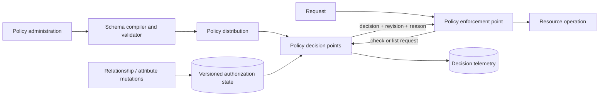

# Authorization at Scale

## TL;DR

Authorization is a stateful distributed system on the critical path of every protected operation. It must answer whether a specific subject may perform an action on a resource **at an acceptable policy revision**, then enforce that result at a boundary the caller cannot bypass.

RBAC, ABAC, and ReBAC are not maturity levels:

- **RBAC** packages stable job functions into roles.
- **ABAC** evaluates constraints over subject, resource, action, and environment attributes.
- **ReBAC** derives permission from relationships such as ownership, membership, sharing, and hierarchy.

Large systems often compose them: a relationship grants candidate access, attributes constrain it, and roles remain convenient organization-level relations. The harder design questions are consistency, list filtering, graph fan-out, policy rollout, revocation latency, tenant isolation, and synchronization with application state.

Separate the policy control plane from the decision data plane, make policy and tuple revisions explicit, bind cache entries to every decision input, and verify both `check` (“may Alice read document 7?”) and `list` (“which documents may Alice read?”) at realistic scale.

---

## 1. Define the Decision Contract

Authentication establishes a principal; authorization evaluates that principal in context. A decision request should be representable as:

```text
authorize(
  subject,
  actor_workload,
  action,
  resource,
  tenant,
  resource_attributes,
  subject_attributes,
  environment,
  minimum_policy_revision
) -> {
  allow | deny | indeterminate,
  evaluated_revision,
  reason_code,
  dependency_summary
}
```

`subject` may be an end user, service account, device, or delegated principal. `actor_workload` prevents a confused-deputy design in which any service presenting Alice's identity inherits all of Alice's authority. `minimum_policy_revision` gives a caller a way to reject a decision older than a security-sensitive mutation it has observed.

### 1.1 Threat model

Assume an attacker may:

- forge resource or tenant identifiers in a request;
- reuse a valid identity through an unintended service;
- exploit a route that forgot enforcement;
- race a permission revocation against cached or replicated state;
- create high-fan-out groups or deeply nested relationships;
- poison attributes supplied by the caller;
- alter policy, relation tuples, or rollout configuration;
- enumerate resources through timing, error, or list APIs;
- compromise one tenant administrator without gaining another tenant;
- target an unavailable policy dependency to trigger unsafe fallback.

### 1.2 Core invariants

1. **Complete mediation:** every protected operation crosses an enforcement point, including batch, export, background, admin, and direct-storage paths.
2. **Canonical identity:** subject, workload, tenant, action, and resource identifiers come from authenticated or authoritative context, not caller-chosen headers.
3. **Default deny:** absence, malformed policy, unsupported schema, timeout, and indeterminate evaluation never silently become allow.
4. **Resource binding:** the decision applies to one canonical resource and action; a result for one tenant or object cannot be replayed for another.
5. **Revision awareness:** security-sensitive callers can require at-least-as-fresh policy state.
6. **Consistent mutation:** application state and its authorization representation cannot diverge without a bounded, observable repair path.
7. **Bounded computation:** graph depth, fan-out, attribute fetches, and policy evaluation have explicit limits and stable failure semantics.
8. **Explainability:** an operator can determine which rule, relation path, attributes, and revision caused a decision.
9. **Tenant isolation:** storage, caches, indexes, policies, logs, and administration preserve the tenant boundary.
10. **Revocation objective:** maximum successful access after a committed revocation is measured as a security SLO.

---

## 2. Model Semantics: RBAC, ABAC, and ReBAC

### 2.1 RBAC: stable role assignment

RBAC maps users to roles and roles to permissions:

```text
user:alice -> role:billing-approver
role:billing-approver -> invoice.approve
```

It works well when permissions follow a small, stable set of job functions. It supports comprehensible reviews and separation-of-duty constraints. Hierarchical RBAC can inherit permissions across roles, but inheritance must remain acyclic and explainable.

RBAC fails when roles encode every contextual dimension:

```text
billing-approver-emea-under-10k-project-red
```

That is not “more RBAC”; it is an attribute policy encoded into an unmanageable role namespace. Treat role-count growth, overlapping roles, and unexplained indirect grants as model-health metrics.

### 2.2 ABAC: constraints over authoritative attributes

ABAC evaluates predicates over four namespaces:

```text
subject.department == resource.department
and subject.approval_limit >= resource.amount
and action == "invoice.approve"
and environment.assurance_level >= 2
```

Its power is contextual constraint. Its distributed-systems cost is attribute acquisition:

- Which service owns `approval_limit`?
- At what revision was `resource.department` read?
- Can the caller forge `environment.network_zone`?
- What happens if the attribute service times out?
- Can an audit reconstruct the values used six months later?

Classify attributes by authority, freshness, sensitivity, and failure behavior. Stable identity claims may arrive in a signed token; current employment status may require a fresh directory lookup; resource ownership should usually come from the resource owner or authorization store. Avoid embedding rapidly changing authorization state in long-lived tokens.

An arbitrary policy is not generally invertible. A PDP may answer whether one input is allowed but be unable to synthesize an efficient database query for every allowed resource. This becomes decisive for list APIs.

### 2.3 ReBAC: permission derived from relations

ReBAC represents facts as relation tuples:

```text
document:design#owner@user:alice
document:design#parent@folder:architecture
folder:architecture#viewer@group:platform#member
group:platform#member@user:bob
```

A versioned authorization schema defines permissions from those facts:

```text
document.viewer = owner
                or editor
                or parent->viewer

folder.viewer   = viewer
                or editor
                or viewer->member
```

The expression is a guided graph query, not unconstrained graph traversal. Type checking should reject relations to invalid subject types and recursive definitions that violate the engine's termination rules.

ReBAC fits collaborative products, organizations, nested groups, repositories, folders, and delegated administration. Its costs are a new stateful service, graph-query amplification, consistency protocol, and reverse lookup/indexing.

### 2.4 Compose models with an explicit order

A useful composition is:

```text
candidate_grant = rebac(resource, action, subject)
              or rbac(organization_role, action)

allow = candidate_grant
    and abac_constraints(subject, resource, environment)
    and not explicit_deny(resource, subject)
```

The order and deny semantics are part of the policy language. “Explicit deny overrides allow” is not universal unless defined. Avoid splitting mutually dependent policy fragments across gateway, service, and database so that nobody can state the combined result.

---

## 3. Authorization State and Revisions

### 3.1 Tuple and policy data model

A relationship record commonly contains:

```text
Tuple {
  tenant
  object_type
  object_id
  relation
  subject_type
  subject_id
  optional_subject_relation
  valid_from / valid_until
  condition_reference
  created_by
  source_operation_id
  commit_revision
}
```

The authorization schema is also versioned state. A tuple valid under schema 12 may be invalid or mean something different under schema 13. Store schema compatibility, compile policy before activation, and preserve enough provenance to explain decisions.

Canonicalize identifiers at ingestion. Unicode ambiguity, case folding, aliases, and reused numeric IDs can turn a storage quirk into an authorization bypass. Namespace every object and subject by tenant/trust domain and type.

### 3.2 Mutations and idempotency

Tuple writes need an operation identity. Retries after a timeout must not create duplicate grants, extend an expiry unexpectedly, or resurrect a deleted relation. A mutation API should support preconditions:

```text
write relationship R
if current_revision == 8142
with operation_id == "membership-change-9f..."
```

For replacement operations, define whether “remove old, add new” is atomic. A temporary union may overgrant; a temporary gap may deny legitimate work. Security-sensitive ownership transfer often needs one transaction in the authorization store or a staged state machine.

### 3.3 Synchronizing application and authorization state

If a project row is committed in one database and its owner tuple is written to another service, a crash can leave an ownerless or publicly stale object. Options are:

1. **Authorization store is authoritative:** create the resource authorization object first with an idempotent reservation, then create domain state, with reconciliation for abandoned reservations.
2. **Application transaction plus outbox:** commit resource state and an authorization event atomically, relay it, and measure propagation lag. See [Outbox, Inbox, and Change Data Capture](../05-messaging/07-outbox-pattern.md).
3. **Derived via CDC:** translate committed domain changes into tuples, provided delete semantics, ordering, and schema evolution are defined. See [Change Data Capture](../13-data-pipelines/04-change-data-capture.md).
4. **Single transactional store:** keep simple authorization rows with domain state when scale and model permit it.

An asynchronous path must define interim behavior. New resources can remain hidden until the owner grant is visible. Revocations may require a synchronous fence or freshness token before the domain mutation is acknowledged. A dead-letter queue is not a repair strategy; reconcile domain facts against authorization state and expose mismatches as actionable inventory.

---

## 4. Planes and Enforcement Placement



The **policy administration point** accepts reviewed policy changes. The compiler type-checks schemas, detects invalid references, and produces an immutable artifact. Distribution activates a revision progressively.

The **policy information plane** owns tuples and trusted attributes. The **policy decision point** (PDP) evaluates a request. The **policy enforcement point** (PEP) prevents the operation when the PDP does not return a valid allow.

### 4.1 PEP placement

| Boundary | Appropriate decisions | Missing context |
|---|---|---|
| Edge/API gateway | authenticated tenant, coarse route/scope, abuse policy | record ownership and current workflow state |
| Service proxy | workload-to-workload permission, method | end-user object semantics |
| Application middleware | route/action and canonical principal | resource facts unless loaded |
| Domain service | ownership, state transition, field-level rules | global ingress signals |
| Database row policy | tenant/row predicates | business intent and multi-service delegation |

Use complementary enforcement. A gateway can reject unauthenticated traffic, but the resource service must still authorize the canonical object after lookup. Database row-level security can contain query bugs, but it does not replace workflow authorization.

### 4.2 Local, sidecar, and remote decisions

An embedded policy engine avoids a network hop but needs trustworthy policy and data distribution. A sidecar isolates the engine and provides a local API, but its lifecycle and identity must be secured. A central service provides consistent state and global indexes but becomes a tier-zero latency and availability dependency.

Hybrid designs are common:

- stable compiled ABAC constraints evaluated locally;
- relationship checks served by a sharded central data plane;
- a local cache or replica with revision bounds;
- highly sensitive actions requiring a current central decision.

Define three outcomes. `deny` is a valid policy result; `indeterminate` means the engine could not safely decide. Treating PDP timeout as a policy deny may be operationally acceptable for a protected mutation but should preserve a distinct reason. Treating it as allow widens authority during failure and requires an exceptional, narrowly documented risk decision, not a generic availability fallback.

---

## 5. Relationship-Check Execution

For a request `check(document:design, viewer, user:bob)`, the engine expands only schema-defined alternatives:

```text
viewer(document:design)
  -> direct viewer tuples
  -> editor(document:design)
  -> viewer(parent(document:design))
      -> member(group:platform)
          -> user:bob
```

### 5.1 Execution algorithm

A distributed evaluator generally needs:

- parallel dispatch across union branches;
- short-circuit on a proven allow while cancelling unnecessary work;
- memoization of repeated subproblems within a request;
- deduplication of identical in-flight subqueries;
- cycle detection and maximum recursion depth;
- fan-out and total-work budgets;
- snapshot/revision propagation to every subquery;
- stable semantics when a branch times out or exceeds limits.

An `allow` is valid only if the branches needed to prove it were evaluated at compatible policy and tuple revisions. Mixing a fresh parent relation with a stale group membership can produce a state that never existed.

### 5.2 Hot groups and recursive membership

A group with millions of members or a deeply nested organizational graph can overload both checks and reverse lookups. Defenses include:

- schema limits on nesting and subject-set recursion;
- materialized membership indexes for designated large groups;
- request work budgets charged to the originating tenant;
- tuple cardinality quotas;
- hot-key replication and adaptive caching;
- asynchronous schema linting that estimates fan-out before rollout.

Do not expose “graph too complex” as an allow. Return a stable indeterminate/deny behavior, emit a diagnostic with the exhausted budget, and provide operators a way to identify the relation path responsible.

### 5.3 Explain without leaking the graph

Operators need a proof path such as:

```text
allow because
  document:design#parent = folder:architecture
  folder:architecture#viewer includes group:platform#member
  group:platform#member includes user:bob
evaluated at revision 913455, schema 27
```

End users may receive a coarser reason. Full paths can reveal hidden group names, resource existence, or another user's membership. Separate privileged explanation APIs from normal error messages.

---

## 6. Consistency and the New-Enemy Problem

Authorization consistency is not simply “strong versus eventual.” The critical question is which orderings must be preserved across content and permission state.

Consider:

1. Bob is removed from a folder.
2. A secret document is added to that folder.
3. A replica answers Bob's check using state from before step 1.

Bob becomes a **new enemy**: a principal who previously had access and now must not observe newly protected content through stale authorization state.

The Zanzibar design uses externally consistent storage plus opaque revision tokens (“zookies”). A client can carry a token from a content or ACL operation and request an authorization result no older than the associated revision. The general contract is:

```text
write revocation -> revision R
publish or expose sensitive content with authorization_floor = R
check(..., minimum_revision = R)
```

The exact protocol depends on where domain content and tuples commit. A token is useful only if callers propagate it and the PDP enforces it across all graph subqueries.

### 6.1 Staleness modes

Offer explicit consistency modes rather than a boolean “consistent” flag:

- **exact snapshot:** evaluate all dependencies at an immutable revision;
- **at least as fresh as R:** wait or route until a replica has reached R;
- **bounded staleness:** accept a result within a declared time/revision window;
- **best effort:** appropriate only where stale authorization cannot expose protected state.

Adding permission can also be security-sensitive. For example, a malicious admin can grant an attacker access, so do not assume positive changes are harmless while only revocation matters. Classify mutations and resource operations by risk.

### 6.2 Revocation SLO

Measure:

```text
revocation exposure = latest successful protected operation by subject
                    - committed revocation time
```

Break it down into outbox/CDC lag, replication lag, cache lifetime, client propagation, and in-flight operation duration. Report percentile and worst observed bounds for the high-risk classes, not merely average tuple replication latency.

---

## 7. Check, Batch Check, List, and Query Shaping

### 7.1 Point checks

`Check(subject, action, resource)` fits opening one known object. A page that renders 100 resources should use a batch API or query plan, not 100 unrelated network calls. Batch evaluation can share snapshot, policy parse, subject expansion, and cache entries.

### 7.2 Listing resources

“Show all documents Alice may view” is not solved by a fast point check. Fetch-then-check breaks pagination: a 50-row database page may contain only two authorized rows, and later authorized rows remain hidden.

Viable strategies are:

| Strategy | Mechanism | Main cost |
|---|---|---|
| Reverse relationship index | Traverse subject → permitted objects | index maintenance and recursive expansion |
| Candidate IDs from PDP | Return bounded object set, then join/filter | large sets and ordering integration |
| Query rewriting | Produce a safe database predicate or row policy | restricted policy expressiveness |
| Permission-aware search index | Index authorization principals/tokens with documents | revocation lag and index growth |
| Post-filter | Check a small bounded candidate set | unusable for broad pagination |

A list API must return a continuation token bound to subject, action, policy/schema revision, filters, and sort order. Otherwise a caller can combine a cursor from one authorization context with another.

### 7.3 Intersection with domain predicates

Real queries combine authorization and product filters:

```text
documents Alice can view
AND status = "open"
AND updated_at > yesterday
ORDER BY updated_at DESC
LIMIT 50
```

Pulling all authorized IDs into application memory is not a scalable query plan. Decide where intersection occurs: authorization index, database, or search engine. Estimate candidate cardinality and maintain stable pagination. This requirement should influence the authorization architecture before implementation, not after point-check benchmarks look good.

---

## 8. Caching Without Losing the Decision Meaning

A decision-cache key must represent every semantic input:

```text
hash(
  subject + actor_workload + tenant + action + canonical_resource +
  relevant_attribute_versions + policy_schema_revision +
  tuple_snapshot_or_floor + consistency_mode
)
```

Omitting tenant, workload, environmental assurance, or policy revision can replay an allow in a different context. Cache the proof dependencies or revision information needed for invalidation; a bare boolean cannot explain why it became stale.

Useful layers include:

- request-local memoization;
- compiled-policy cache keyed by artifact digest;
- tuple/object cache at a specific snapshot;
- decision cache with short risk-based lifetime;
- reverse-index cache for list queries.

Positive and negative decisions have different product and security effects. A stale positive can overgrant after revocation; a stale negative can prolong denial after a legitimate grant. Set TTLs from the revocation and availability objectives, not from generic cache defaults.

Invalidation by relation dependency is precise but expensive. Revision floors avoid accepting entries older than a known mutation. Short TTL bounds unknown changes but creates KMS-like cold-start bursts. Model cache flush, regional failover, and policy rollout as peak events.

---

## 9. Capacity, Partitioning, and Latency

Suppose an illustrative service handles:

```text
application requests             = 200,000/s peak
authorization checks per request = 4 average
batching reduction               = 35%
average graph subqueries/check   = 6 before cache
decision-cache hit rate          = 80%
```

The PDP receives approximately:

$$
200{,}000 \times 4 \times (1 - 0.35) = 520{,}000\ checks/s
$$

With an 80% decision-cache hit rate, misses create about:

$$
520{,}000 \times 0.20 \times 6 = 624{,}000\ subqueries/s
$$

This is a planning model, not a substitute for a trace-derived fan-out distribution. Averages hide recursive-group outliers. Capacity tests should preserve the joint distribution of object types, group sizes, cache temperature, tenant concentration, and consistency modes.

### 9.1 Latency budget

For a 150 ms application p99 objective, four sequential 10 ms p99 checks already consume 40 ms before business work. Batch or parallelize independent checks, but never execute the protected side effect before all required decisions complete.

Measure:

- end-to-end decision p50/p95/p99/p99.9;
- dispatch count, depth, and fan-out distribution;
- cache hit rate by layer and decision risk class;
- time waiting for minimum revision;
- tuple and policy replication lag;
- list candidate count and reverse-index amplification;
- per-tenant resource consumption and throttling.

### 9.2 Partitioning

Object-key partitioning serves forward checks but can scatter reverse lookups. Subject indexes serve lists but amplify writes to large groups. Production systems often maintain both, with versioned asynchronous indexes and a protocol for verifying candidates against authoritative state.

Avoid global hot objects such as `organization:all#member` without a scaling plan. Partition work fairly by tenant and apply budgets so one adversarial graph cannot consume the global decision fleet. Replicate hot immutable policy artifacts broadly; shard mutable relation data by stable keys and retain enough revision metadata to route freshness-sensitive requests.

---

## 10. Multi-Region and Failure Semantics

Authorization is usually tier zero: when it is unavailable, protected business operations cannot safely proceed. Multi-region design must state:

- where relation mutations commit;
- whether revisions are globally ordered or region-scoped;
- how a caller routes an at-least-R check;
- maximum stale-read window in each consistency mode;
- what happens to active sessions during regional partition;
- how policy artifacts and trust roots roll forward and back;
- whether list indexes lag authoritative check state.

### 10.1 Failure traces

**Stale allow after revocation**

1. An administrator removes a contractor at revision R.
2. The application acknowledges removal but drops R.
3. A regional cache retains an earlier positive decision.
4. The contractor exports data for the cache TTL.

Prevent by propagating a revision floor to sensitive operations, invalidating known dependencies, and measuring exposure, not by claiming “eventual consistency.”

**Policy rollout widens access**

1. Schema 28 changes a parent traversal.
2. Half the PDP fleet runs schema 27; half runs 28.
3. Clients cache decisions without schema revision.
4. A result produced under 28 is reused by an instance expecting 27.

Bind decisions and caches to an immutable schema digest. Shadow-evaluate, diff, canary by tenant/risk class, and retain a tested rollback artifact.

**Graph amplification outage**

1. A tenant nests thousands of groups under a public folder.
2. A list request recursively expands the graph.
3. Distributed dispatch saturates storage and the worker pool.
4. Unrelated tenants time out and retry, amplifying load.

Enforce per-request and per-tenant work budgets, reject pathological schema/data mutations before activation, isolate queues, and combine overload behavior with [Backpressure and Overload Control](../06-scaling/07-backpressure.md).

**Tuple/domain divergence**

1. A project deletion commits.
2. Its tuple-deletion event is quarantined.
3. The project ID is later reused by an import tool.
4. Old grants attach to the new object.

Never reuse authorization object identities. Tombstone/delete with immutable generation IDs, make the relay observable, and reconcile both directions.

---

## 11. Security and Multi-Tenant Controls

- Bind tenant at authentication, routing, authorization, storage lookup, and audit. Do not trust a body field to select it.
- Authorize delegation: a service acting for a user needs both workload permission and user permission, with audience and purpose preserved through asynchronous work.
- Separate policy administration from policy use. A PDP reader should not automatically change policy; a policy author should not automatically impersonate users.
- Require stronger approval and assurance for break-glass access, time-limit it, notify affected owners, and audit every resource touched.
- Prevent existence oracles: unauthorized and nonexistent resources often need indistinguishable external behavior, while internal telemetry retains the reason.
- Protect authorization logs and graph data; membership and sharing relationships are sensitive personal and organizational information.
- Rate-limit checks and lists by authenticated principal and tenant. Authorization is not a free graph-query API.
- Treat policy bundles, sidecars, SDKs, schema compilers, and relation importers as software-supply-chain boundaries.

Authentication, token verification, and workload identity are covered separately in [Authentication Systems](./01-authentication-fundamentals.md), [JOSE and JSON Web Token Verification](./03-jwt-tokens.md), and [Zero-Trust Service and Workload Architecture](./05-zero-trust-architecture.md).

---

## 12. Policy Delivery, Audit, and Migration

Policy is deployable code:

```text
author -> review -> static analysis -> test corpus -> signed artifact
       -> shadow evaluation -> decision diff -> canary -> activation
       -> monitor -> retain rollback artifact
```

A decision-diff system should classify changes:

- newly allowed;
- newly denied;
- changed reason/path only;
- indeterminate or work-budget regression;
- list-result cardinality and latency changes.

Sampled production shadow traffic is useful, but it cannot replace adversarial negative cases because rare protected paths may not appear. Policy test fixtures should name the security invariant they enforce.

### 12.1 Model migration

Moving from application RBAC tables to a central ReBAC service is a data migration:

1. Define canonical identities and an ownership map.
2. Backfill tuples at a recorded source snapshot.
3. Stream changes after that snapshot with idempotent operation IDs.
4. Shadow point and list decisions against the legacy implementation.
5. Investigate every unexplained allow delta; sample deny deltas for product regressions.
6. Cut over by tenant and operation risk.
7. Retain dual-read comparison, not dual authority, for a bounded window.
8. Remove legacy writes only after reconciliation reaches zero and rollback criteria expire.

Dual-writing both systems directly creates two authorities and undefined conflict resolution. Prefer one source plus an ordered propagation path.

### 12.2 Audit event

An audit record should include:

```text
request/correlation ID
canonical subject and actor workload
tenant, action, resource reference
allow / deny / indeterminate
policy artifact digest and tuple revision
attribute version references
reason or proof summary
latency, work consumed, region, cache status
```

Avoid copying full sensitive resource data or tokens. Define retention, access, tamper evidence, and redaction. Audit must survive long enough to investigate the protected system, but it is itself sensitive data.

---

## 13. Verification Strategy

### 13.1 Model tests

- Table-driven allow and deny cases for every action and object type.
- Negative tests for cross-tenant IDs, forged actors, unsupported actions, and hidden resources.
- Property tests such as “removing the only grant never preserves allow at revision ≥ R.”
- Schema type, recursion, fan-out, and unreachable-rule analysis.
- Differential tests between old and new policy artifacts.
- List/check equivalence: every listed resource must pass a check at the same revision, and a generated bounded universe can detect missing results.

### 13.2 Distributed-system tests

- Race content publication against membership removal.
- Delay tuple replication and require a minimum revision.
- Crash between domain commit and outbox relay, then reconcile.
- Flush caches and restart a region simultaneously.
- Inject PDP timeout, partial graph dispatch, stale schema, and index lag.
- Load pathological nested groups and hot tenants under fair-use budgets.
- Test pagination tokens across policy changes and subject changes.
- Restore authorization state from backup and verify revision/token behavior.

### 13.3 Enforcement coverage

Inventory routes and consumers automatically. Tests should attempt the same operation through REST, RPC, batch, queue consumer, export job, support tool, and direct internal endpoint. A perfect PDP cannot protect a bypass path.

Use static middleware conventions where possible, but verify at runtime that protected state changes emit an authorization decision ID. Alert on mutations without a corresponding decision where the architecture requires one.

---

## 14. Decision Framework

Keep authorization in the domain database when the model is small, transactional coupling dominates, and every query can enforce tenant/resource predicates consistently. Introduce an embedded policy language when rules change independently and authoritative attributes are locally available. Introduce a ReBAC service when sharing, hierarchy, group nesting, cross-product permissions, or centralized explainability justify another tier-zero stateful system.

Before selecting a platform, answer:

1. Are point checks, list filtering, or both first-class?
2. Which state is authoritative for ownership and membership?
3. What maximum post-revocation exposure is acceptable per operation?
4. How will callers propagate a freshness/revision requirement?
5. What graph depth, fan-out, and tenant cardinality must be supported?
6. Where do authorization predicates intersect database/search queries?
7. Can every allow be explained without exposing sensitive graph data?
8. What is the safe behavior during PDP, policy-distribution, and regional failure?
9. How are schema/policy changes diffed, canaried, and rolled back?
10. How will enforcement coverage and domain/tuple reconciliation be proven continuously?

The architecture is incomplete if it demonstrates only an SDK call returning `true`. The real system includes the state mutation path, revision protocol, list query plan, enforcement inventory, overload limits, and recovery behavior.

---

## References

- [Zanzibar: Google's Consistent, Global Authorization System](https://research.google/pubs/zanzibar-googles-consistent-global-authorization-system/): relation tuples, userset rewrites, consistency tokens, and global serving architecture
- [NIST Role-Based Access Control project](https://csrc.nist.gov/projects/role-based-access-control): formal RBAC models and constraints
- [NIST SP 800-162: Guide to Attribute Based Access Control](https://csrc.nist.gov/pubs/sp/800/162/upd2/final): ABAC concepts and enterprise considerations
- [Cedar policy language specification](https://docs.cedarpolicy.com/) and [Cedar design and formal analysis](https://www.cedarpolicy.com/en/science): analyzable authorization-policy semantics
- [Open Policy Agent documentation](https://www.openpolicyagent.org/docs/latest/): policy decision APIs, bundles, and partial evaluation
- [SpiceDB documentation](https://authzed.com/docs) and [OpenFGA documentation](https://openfga.dev/docs): production implementations of relationship-based authorization
- [PostgreSQL row security policies](https://www.postgresql.org/docs/current/ddl-rowsecurity.html): database-level row predicate enforcement
- [Google Cloud IAM consistency](https://cloud.google.com/iam/docs/access-change-propagation): concrete operational treatment of authorization propagation
