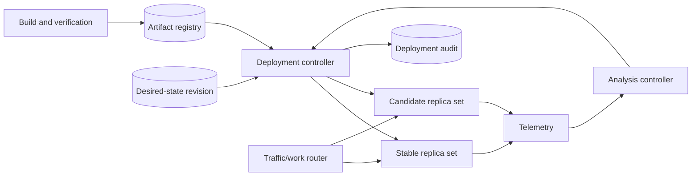

# Progressive Delivery and Deployment Strategies

## TL;DR

A deployment changes the executable artifact serving a workload. A release changes which users or operations exercise new behavior. Keep them separable: deployment safety is about artifact identity, mixed-version compatibility, capacity, routing, health, draining, and rollback; behavior exposure can additionally use [feature-flag control planes](./02-feature-flags.md).

Every safe strategy implements the same protocol:

1. publish one immutable, verified artifact;
2. establish enough old/new capacity for the chosen topology;
3. move a bounded traffic or workload cohort;
4. observe user-impact and resource signals over a meaningful window;
5. promote, pause, or restore the prior artifact through explicit state transitions;
6. retain data and protocol compatibility until rollback is no longer required.

Rolling, blue-green, canary, shadow, and regional waves differ in cost, blast radius, and evidence quality. None can make an incompatible schema change reversible.

---

## 1. Deployment Contract

Define:

- artifact digest and provenance;
- configuration and policy revision;
- target services, regions, cells, and resource class;
- strategy and cohort unit;
- desired capacity and failure headroom;
- health/readiness contract;
- connection/work draining behavior;
- compatibility window for APIs, data, queues, and clients;
- observation and promotion gates;
- rollback artifact and deadline;
- point after which rollback becomes a forward fix.

### 1.1 Core invariants

1. **Artifact identity:** every instance reports the immutable digest it executes.
2. **Build once:** promotion reuses the same artifact; it does not rebuild per environment.
3. **Atomic desired state:** one deployment revision names artifact, config, capacity, and strategy.
4. **Bounded exposure:** canary/preview traffic cannot exceed its declared cohort without a revision change.
5. **Capacity safety:** removing old capacity does not violate the failure-headroom target.
6. **Readiness truth:** a ready instance can serve its assigned workload correctly, not merely accept TCP.
7. **Drain before termination:** new work stops before in-flight work is forcibly ended.
8. **Mixed-version compatibility:** any versions live together during the rollout can communicate and share state safely.
9. **Monotonic rollout state:** stale controllers cannot re-promote an aborted revision.
10. **Evidence-backed transition:** promotion and rollback record the measurements and actor/policy that authorized them.

---

## 2. Control Plane and State Machine



Use a durable state machine:

```text
CREATED
  -> PROVISIONING
  -> VERIFYING
  -> EXPOSING
  -> PROMOTING
  -> SUCCEEDED

VERIFYING/EXPOSING/PROMOTING
  -> PAUSED
  -> ABORTING
  -> ROLLED_BACK
  -> FAILED
```

The desired-state revision includes an expected previous revision. Controllers reconcile idempotently and compare revision/epoch before changing routes or replica sets. A delayed controller event for deployment 41 must not override deployment 42.

### 2.1 Data plane versus control plane

The deployment controller may be unavailable without stopping serving. Existing routers and instances continue with last-known-good state. Promotion stops until telemetry and desired state are trustworthy.

Keep rollback possible without rebuilding or depending on the failing artifact. The prior digest and configuration remain available, and the serving control plane can restore them independently of source-control/CI availability.

---

## 3. Rolling Replacement

A rolling deployment incrementally removes old instances and adds new ones in one pool.

Key controls:

- **maximum unavailable:** how much serving capacity may disappear;
- **maximum surge:** temporary extra instances;
- readiness/startup probes;
- minimum ready/soak time;
- progress deadline;
- disruption and topology constraints;
- connection/work drain.

### 3.1 Capacity model

Suppose:

- steady load requires 80 instances at target utilization;
- one-zone failure headroom requires 25 percent spare;
- rollout permits 10 unavailable;
- no surge.

Required steady capacity with headroom:

```text
80 / (1 - 0.25) = 106.7 -> 107 instances
```

Taking 10 unavailable leaves 97, below the 107-instance failure target. The service may handle steady traffic but cannot preserve the declared failure posture during rollout.

With `maxSurge = 10` and `maxUnavailable = 0`, capacity remains at least 107 while candidates start, at the cost of temporary resources. Treat surge as a capacity purchase, not a free setting.

### 3.2 Where rolling works

Use when:

- old and new versions are compatible;
- instances are relatively cheap to duplicate;
- per-instance exposure gives enough signal;
- rapid full-environment swap is unnecessary.

Avoid as the only guard when one candidate can corrupt shared data or publish incompatible events. A small replica percentage does not bound shared-state damage.

---

## 4. Blue-Green Deployment

Blue-green maintains complete stable and candidate environments:

```text
blue: current production, serving
green: candidate, synchronized and verified
cutover: route/pointer changes from blue to green
```

Advantages:

- fast routing rollback;
- clean environment-level comparison;
- no mixed application versions after cutover;
- useful for runtime/platform changes.

Costs:

- near-double serving infrastructure during overlap;
- state synchronization and identity complexity;
- environmental drift if green is long-lived;
- connection/DNS/cache propagation means cutover is not truly instantaneous.

### 4.1 State still shares a boundary

If both environments use the same database, code versions must remain schema-compatible. If they use replicated stores, the design needs:

- replication direction and checkpoint;
- cutover authority;
- reverse sync during rollback window;
- reconciliation;
- point of no return.

These are a [service and platform migration](./06-migration-strategies.md), not a deployment-controller detail.

### 4.2 Warmth and hidden state

Green may be technically ready but cold:

- JIT/runtime caches;
- connection pools;
- CDN/application caches;
- model/index state;
- lazy schema initialization;
- autoscaling history.

Warm with controlled traffic that does not duplicate effects, and include cold-start latency/resource behavior in the gate.

---

## 5. Canary Deployment

A canary routes a stable cohort to the candidate while retaining the stable version.

Choose cohort by:

- deterministic user/account/tenant key;
- region/cell;
- endpoint or operation;
- workload class;
- random request only for stateless, non-sticky behavior.

Stateful behavior should keep one entity on one version. Random per-request routing can alternate a user between incompatible flows and contaminate comparison.

### 5.1 Stage plan

Each stage declares:

```text
candidate_weight_or_cohort
minimum_sample_or_workload_coverage
minimum_observation_time
upper-bound guardrails
lower-bound guardrails
telemetry completeness
promotion action
abort action
```

Upper-bound signals include error rate, latency, saturation, integrity discrepancy, and cost. Lower-bound signals include success rate, throughput, and telemetry completeness. Missing, stale, or non-finite data blocks promotion.

### 5.2 Comparative analysis

Compare candidate against stable under equivalent traffic:

```text
delta_error = candidate_error - stable_error
ratio_latency = candidate_p99 / stable_p99
```

Segment by endpoint, tenant class, region, and dependency. Aggregate metrics can hide total failure in a rare critical path.

The analysis window must cover the causal delay:

- request errors: seconds/minutes;
- cache warming: minutes;
- async jobs: queue delay plus execution;
- billing/reconciliation: hours or business cycle;
- data corruption: perhaps days and explicit reconciliation.

A five-minute canary cannot authorize a change whose main effect appears overnight.

### 5.3 Statistical caution

Small cohorts may produce no events for rare failures. Absence is not evidence of safety. Require coverage, exact critical-path tests, or a risk-specific synthetic probe.

Do not repeatedly peek at noisy business metrics and promote on the first favorable result. Online experiment statistics belong to [Online Experiments](../16-ml-systems/08-online-experiments.md); deployment guardrails prioritize fast harm detection and conservative action.

---

## 6. Shadow and Dark Deployment

Shadowing mirrors real inputs to a candidate but serves the stable result.

Useful for:

- compatibility and response diffing;
- performance/resource behavior;
- production-shaped edge cases;
- validating a replacement before user exposure.

Shadow does not prove user-visible behavior, routing, or state authority. It can also duplicate irreversible effects. Isolate or stub:

- payments;
- email/webhooks;
- messages;
- writes;
- rate-limit consumption;
- third-party quotas;
- audit events.

Record an input identity and compare normalized semantic outcomes. Never log sensitive full payloads merely for diffing.

Dark deployment starts candidates with no mirrored traffic, useful for startup/config/registration checks but weak behavioral evidence.

---

## 7. Regional, Cell, and Tenant Waves

For large systems, the outer rollout unit is a failure domain:

```text
internal
  -> test cell
  -> low-risk production cell
  -> one region
  -> several regions
  -> global
```

Keep each wave within available global failover capacity. If a region is already degraded, continuing a rollout elsewhere can consume recovery headroom.

Tenant cohorts give strong state isolation and business coordination, but one large tenant may dominate load. Region cohorts test regional dependencies but may differ in traffic mix. Cell cohorts align blast radius with architecture.

Use the smallest unit that is representative and independently reversible.

---

## 8. Health, Readiness, and Draining

### 8.1 Probe semantics

- **startup:** process has completed expensive initialization; prevents premature liveness restart.
- **liveness:** process is irrecoverably stuck and should restart.
- **readiness:** instance can accept its assigned workload now.

A readiness probe should cover local prerequisites but avoid fan-out to every dependency. If every instance reports unready because one shared dependency is down, the router may remove the entire fleet and amplify an outage. Use dependency-specific degradation and admission policy.

### 8.2 Drain protocol

1. mark candidate/old instance non-ready or lower routing weight;
2. wait for router/discovery convergence;
3. stop accepting new connections/jobs;
4. signal long-lived streams to reconnect;
5. let in-flight work finish within budget;
6. checkpoint/requeue durable work;
7. terminate after deadline;
8. track forced termination.

The grace period follows measured request/job duration and propagation, not a copied default.

For HTTP keep-alive, gRPC/WebSocket streams, queue consumers, and workflow workers, “stop new work” has different mechanics. Define each.

---

## 9. Mixed-Version and Data Compatibility

During any gradual rollout, old and new code coexist. Test:

- old client to new server and new client to old server;
- old producer to new consumer and the reverse;
- schema readers/writers across versions;
- queue payload versions;
- cache keys/serialization;
- feature flags and default behavior;
- rollback after new writes.

Database changes use expand/contract:

```text
expand schema
  -> deploy compatible readers/writers
  -> migrate/backfill
  -> switch authority
  -> observe
  -> contract old schema
```

The contract phase usually removes rollback to older code. Delay it beyond the application rollout and explicit soak. See [Database Schema Migrations](./03-database-migrations.md).

Events are durable APIs. A producer that emits a new required field/type can break old consumers long after the producer rollback. Use compatible evolution and consumer inventories.

---

## 10. Promotion and Rollback

### 10.1 Gate evaluation

A promotion controller consumes versioned metrics with:

- query/evaluation timestamp;
- cohort identity;
- sample/coverage;
- missing-data policy;
- threshold direction;
- comparator baseline;
- result and evidence digest.

Fail closed on missing/NaN. Require the telemetry pipeline itself to be healthy; a deployment that disables metrics must not appear perfect.

Use multi-window gates:

- short window catches catastrophic regression;
- longer window prevents promotion through transient noise;
- cumulative integrity/reconciliation checks detect state damage.

### 10.2 Rollback semantics

Rollback restores:

- prior artifact digest;
- compatible configuration;
- routing;
- capacity;
- feature behavior if coupled;
- data path only if the compatibility boundary permits.

It does not undo:

- corrupt writes;
- sent messages/email/payments;
- deleted data;
- external contract adoption;
- irreversible migrations.

Those need repair or compensation. Name the point of no return.

### 10.3 Abort convergence

An abort is a control-plane state transition. Every router, controller, and region must converge. Track:

- time to stop new candidate exposure;
- in-flight candidate work;
- candidate connections;
- old-capacity restoration;
- stale route/config revisions.

“Rollback button clicked” is not the same as “candidate no longer affects users.”

---

## 11. Security and Supply Chain

Require:

- artifact digest, signature, and provenance;
- dependency/SBOM policy appropriate to risk;
- admission that rejects mutable tags or untrusted signatures;
- environment-scoped deploy authority;
- separation between artifact publication and production promotion;
- audited emergency override;
- secret resolution at runtime;
- no production secrets baked into artifacts;
- candidate identity and network policy equal to intended production posture.

A canary with broader permissions than stable can pass functionality while introducing privilege escalation. Compare policy/identity/config semantic diffs as part of deployment evidence.

Protect deployment webhooks and GitOps sources from replay and unauthorized mutation. A compromised controller has fleet-wide effect; isolate credentials and require versioned desired state.

---

## 12. Failure Traces

### 12.1 Readiness before initialization

1. Process opens port immediately.
2. Router sends production traffic.
3. schema/cache/model initialization is incomplete.
4. Candidate produces failures and rollout churn.

**Prevention:** startup/readiness reflect actual local serving state.

### 12.2 Global canary is not sticky

1. Ten percent of requests route randomly to candidate.
2. One checkout session alternates old/new state machines.
3. Neither path sees a coherent session.
4. Errors appear only under mixed routing.

**Prevention:** cohort by stable entity for stateful behavior.

### 12.3 Auto-promotion on missing metrics

1. Candidate breaks telemetry export.
2. query returns empty/NaN.
3. gate treats comparison as zero regression.
4. candidate promotes globally.

**Prevention:** explicit completeness lower bound and fail-closed parsing.

### 12.4 Rolling update consumes failover capacity

1. rollout removes ten percent of fleet.
2. zone fails.
3. remaining capacity saturates.
4. retries amplify collapse.

**Prevention:** capacity calculation includes rollout plus failure headroom.

### 12.5 Rollback cannot read new data

1. candidate writes a new enum/shape.
2. latency regression triggers rollback.
3. old code cannot parse committed records.
4. rollback expands outage.

**Prevention:** maintain backward-compatible writes until rollback window closes.

### 12.6 Stale controller reopens candidate route

1. analysis aborts revision 52.
2. delayed promote event from an earlier state arrives.
3. router accepts it without expected revision.
4. bad candidate receives traffic again.

**Prevention:** compare-and-swap desired state and monotonic deployment epoch.

### 12.7 Shadow duplicates side effects

1. gateway mirrors a POST to candidate.
2. candidate sends a real webhook.
3. customer receives duplicate effect though response was discarded.

**Prevention:** effect isolation and stable idempotency identity for shadow paths.

---

## 13. Observability and Verification

Deployment control-plane signals:

- state/revision transitions;
- controller reconcile latency/errors;
- desired versus actual artifact/config/capacity;
- route weight/cohort convergence;
- active digest distribution;
- readiness/startup/drain timing;
- forced terminations and stalled rollout.

Candidate-versus-stable signals:

- request/job success, latency, saturation;
- dependency calls and resource use;
- queue/stream age;
- business/integrity guardrails;
- telemetry completeness;
- cost/unit work;
- semantic shadow mismatches;
- segmented coverage.

Verification layers:

1. artifact provenance and reproducibility;
2. config/policy semantic diff;
3. compatibility matrix tests;
4. startup/readiness/drain tests;
5. load and cold-state tests;
6. shadow diff with isolated effects;
7. canary gate parser and direction tests;
8. missing/stale telemetry tests;
9. controller crash/replay/stale-event tests;
10. rollback drill including data compatibility;
11. regional/cell failure during rollout;
12. post-deploy reconciliation.

Record one deployment evidence object linking artifact, config, cohort, metrics, approvals, transitions, and final disposition.

---

## 14. Decision Framework

| Constraint | Strategy tendency |
|---|---|
| cheap compatible replicas, ordinary service update | rolling |
| fast environment swap, enough duplicate capacity | blue-green |
| high behavioral risk, measurable cohort outcomes | canary |
| compare computation without user exposure | shadow |
| regional/cell blast-radius architecture | waves |
| stateful tenant migration | tenant cohort plus migration protocol |

Before choosing:

1. What is the independent blast-radius unit?
2. Can old and new binaries/protocols/data coexist?
3. How much surge/duplicate capacity exists while preserving failure headroom?
4. Which health signal proves readiness?
5. What traffic/work is representative, and how is it kept sticky?
6. Which effects appear only after delay?
7. Which upper and lower gates authorize promotion?
8. What happens on missing telemetry?
9. How long does drain take for requests, streams, and jobs?
10. What does rollback restore, and what effects require repair?
11. Which state transition ends simple rollback?
12. Can a stale controller or region undo an abort?

The strategy is secondary to the protocol. A well-instrumented rolling deployment with compatibility and revision fencing is safer than a nominal canary whose cohort, metrics, or rollback is undefined.

---

## Primary References

- [Google SRE Workbook: Canarying Releases](https://sre.google/workbook/canarying-releases/)
- [Kubernetes Documentation: Deployments](https://kubernetes.io/docs/concepts/workloads/controllers/deployment/)
- [Kubernetes Documentation: Pod Lifecycle and Probes](https://kubernetes.io/docs/concepts/workloads/pods/pod-lifecycle/)
- [Argo Rollouts Documentation: Concepts](https://argo-rollouts.readthedocs.io/en/stable/concepts/)
- [SLSA Specification](https://slsa.dev/spec/)
- [Sigstore Documentation](https://docs.sigstore.dev/)

---

## Related Chapters

- [Feature-Flag Control Planes](./02-feature-flags.md)
- [Database Schema Migrations](./03-database-migrations.md)
- [CI/CD and GitOps](./04-cicd-gitops.md)
- [Service and Platform Migration](./06-migration-strategies.md)
- [SLOs and Error-Budget Control](../11-observability/05-slos-error-budgets.md)
