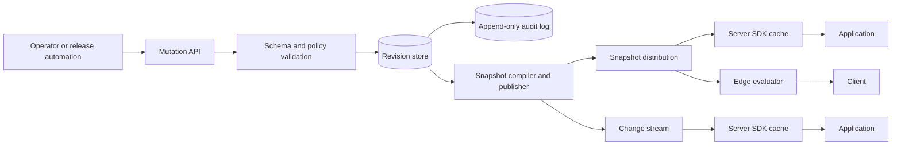

# Feature-Flag Control Planes

## TL;DR

A feature flag is a versioned decision program that is published by a control plane and evaluated on a request path. The difficult parts are not the `if` statement. They are distributing a coherent revision, assigning subjects deterministically, containing stale or corrupt configuration, protecting targeting data, proving what a caller evaluated, and retiring both branches safely.

Use flags to separate deployment from release, to limit blast radius, or to provide a rehearsed operational kill switch. Do not use them as an authorization system, a general configuration database, or a substitute for backward-compatible deployment. A production design needs explicit invariants, immutable revisions, local evaluation for critical paths, secure defaults, auditability, and a lifecycle that ends with code deletion.

---

## 1. Define the Decision Contract

An evaluation is a pure logical function:

```text
decision = evaluate(
  flag_key,
  expected_type,
  evaluation_context,
  configuration_revision,
  application_defaults
)
```

The result is more than a Boolean. A useful result envelope contains:

```text
value
variant
flag_revision
configuration_revision
reason                 # default, target match, fractional rollout, error
error_code             # absent on success
evaluation_timestamp
```

That envelope lets an application answer the operational question that matters after an incident: *which rule and revision produced this behavior?*

### 1.1 Flag categories have different failure policies

| Category | Typical lifetime | Failure default | Primary risk |
|---|---:|---|---|
| Release | days to weeks | old behavior | both branches drift |
| Experiment | bounded by analysis plan | control variant | assignment or exposure bias |
| Operational kill switch | long-lived, rehearsed | explicitly chosen safe mode | control plane unavailable during incident |
| Migration | until old reader/writer is removed | compatibility path | mixed-version data corruption |
| Entitlement hint | long-lived | deny or hide | confusing a flag with authorization |

An entitlement flag may improve presentation, but the authoritative permission check must still occur in the authorization system. A client-visible flag cannot protect a paid feature or sensitive operation.

### 1.2 Core invariants

Write these into the service contract and test them:

1. **Type stability:** a Boolean client never silently accepts a string or object value.
2. **Determinism:** the same subject, flag, allocation seed, and revision produce the same variant.
3. **Monotonic publication:** an evaluator never replaces revision 42 with revision 41.
4. **Atomic activation:** a client evaluates one complete configuration snapshot, never a mixture of rules from two revisions.
5. **Bounded staleness:** each flag declares how old its last-known-good configuration may become.
6. **Safe fallback:** missing, malformed, or expired state maps to an application-owned default.
7. **Tenant isolation:** one tenant's rules and attributes cannot influence another tenant's decision.
8. **Audited mutation:** every production change records actor, approval context, before/after revisions, and timestamp.
9. **Stable assignment:** increasing a rollout does not reshuffle subjects already assigned, unless an explicit re-randomization is published.
10. **Deletion closure:** retirement removes the control-plane record, obsolete branch, tests, metrics, and targeting data.

These invariants expose why a database lookup on every request is not a complete design.

---

## 2. Architecture: Control Plane and Evaluation Plane



The **control plane** accepts mutations, validates policy, creates immutable revisions, and distributes snapshots. It may tolerate seconds of propagation delay, but it must preserve history and prevent unsafe changes.

The **evaluation plane** is on the serving path. It must be fast, highly available, deterministic, and able to operate through control-plane failure. For most backend workloads this means evaluating locally from an atomically replaced in-memory snapshot.

Remote evaluation is appropriate when rules or attributes must stay centralized, but it turns every flag check into an RPC dependency. If a request evaluates ten flags and each evaluation is remote, the architecture has created fan-out, tail-latency, and partial-failure problems for what appears to be a local branch.

### 2.1 State model

A flag record should separate identity, lifecycle, and immutable rule revisions:

```text
flag:
  key
  project
  environment
  value_type
  owner
  category
  created_at
  expires_at
  lifecycle_state

flag_revision:
  flag_key
  revision
  allocation_seed
  prerequisites
  ordered_rules
  default_variant
  off_variant
  created_by
  created_at
  change_reason
  previous_revision

snapshot:
  environment
  configuration_revision
  schema_version
  generated_at
  flags[]
  content_digest
  signature
```

The mutation API writes a new revision with compare-and-swap on the expected previous revision. Concurrent editors then receive a conflict instead of silently overwriting each other.

### 2.2 Ordered rules are a program

Rule order changes semantics. A common evaluation order is:

1. validate flag existence and expected type;
2. apply emergency override;
3. check prerequisites;
4. evaluate explicit target lists;
5. evaluate attribute predicates;
6. assign a fractional rollout;
7. return the default variant.

The rule language needs a schema, a version, and bounded complexity. Unbounded regular expressions, arbitrary user code, recursive prerequisites, or huge target lists turn evaluation into an availability attack. Compile rules at publication time and reject cycles, unknown operators, excessive depth, and values that cannot be represented by every supported SDK version.

---

## 3. Deterministic Fractional Allocation

Percentage rollout is stable partitioning, not random sampling on each request. Derive a bucket from a canonical byte sequence:

```text
bucket_input =
  tenant_id || 0x00 ||
  flag_key || 0x00 ||
  allocation_seed || 0x00 ||
  targeting_key

bucket = first_64_bits(SHA-256(bucket_input)) / 2^64
```

A variant owns a half-open interval such as `[0.00, 0.05)`. Moving the upper boundary from 0.05 to 0.10 adds subjects without changing the first five percent.

The targeting key must represent the assignment unit. Use an account ID for account-wide behavior, a user ID for user experiments, or a device ID only when device-level inconsistency is acceptable. Anonymous-to-authenticated identity transitions need an explicit policy; changing keys mid-funnel can expose one subject to multiple variants.

### 3.1 Cross-SDK conformance

Determinism fails if SDKs disagree about:

- Unicode normalization;
- integer and timestamp encoding;
- missing versus null attributes;
- case sensitivity;
- hash input delimiters;
- numeric range boundaries;
- rule precedence.

Publish language-independent conformance vectors containing context, revision, expected value, variant, and reason. Every SDK release must pass the same corpus. A flag service with five SDK languages is a distributed interpreter implementation; treat it like a protocol.

### 3.2 Experiments need an exposure contract

Assignment is not exposure. Record an exposure only when the application actually executes or renders the variant, and deduplicate repeated exposures according to the experiment's analysis unit. The event should include experiment revision, subject key class, variant, and exposure time.

Feature delivery and experiment analysis share allocation machinery but have different owners. Statistical design, guardrail metrics, sample-ratio mismatch, novelty effects, and stopping rules belong to [Online Experiments](../16-ml-systems/08-online-experiments.md).

---

## 4. Publication and Convergence

### 4.1 Compile, persist, publish, activate

A safe mutation follows a state transition:

```text
DRAFT
  -> VALIDATED
  -> PERSISTED
  -> PUBLISHED
  -> OBSERVED
  -> SUPERSEDED
```

1. Validate schema, policy, ownership, dependencies, and rollout bounds.
2. Commit the immutable flag revision and audit event transactionally.
3. Compile a complete environment snapshot.
4. Sign and publish the snapshot under its content digest.
5. Advance a small environment pointer with compare-and-swap.
6. Evaluators fetch, verify, parse, and build the next in-memory representation.
7. Each evaluator swaps one pointer atomically and reports the active revision.

Publishing the blob before advancing the pointer avoids a pointer to missing content. Keeping snapshots content-addressed makes rollback a pointer change, while retaining a complete forensic history.

### 4.2 Push plus pull

Use a change stream for low propagation latency and periodic polling for repair. Push alone loses updates during disconnects; polling alone creates a trade-off between control-plane load and response time.

An update notification can carry only `environment`, `configuration_revision`, and `content_digest`. The SDK ignores revisions at or below its active revision, fetches the referenced snapshot, validates its signature and digest, then activates it atomically.

### 4.3 Staleness policy

The last-known-good snapshot is normally safer than dropping immediately to defaults, but not forever. Define per-category behavior:

| Condition | Release flag | Kill switch | Security-sensitive deny flag |
|---|---|---|---|
| Control plane unreachable | last known good | last known good plus local emergency override | fail closed |
| Snapshot signature invalid | reject new revision | reject new revision | fail closed and alert |
| Last update older than budget | default old path | application-specific safe mode | deny |
| Unknown flag | application default | explicit local default | deny |

The SDK must expose provider state such as `READY`, `STALE`, `ERROR`, and `NOT_READY`; the application decides whether a stale provider is acceptable for a given flag.

---

## 5. Capacity and Availability Model

Assume:

- 120 application instances;
- 8,000 requests per second across the fleet;
- 12 evaluations per request;
- a 2 MiB compiled snapshot;
- one configuration publication every 10 seconds during an active rollout;
- a 60-second repair poll.

The evaluation plane executes:

```text
8,000 requests/s * 12 evaluations/request = 96,000 evaluations/s
```

Local evaluation keeps those operations inside application processes. Remote evaluation would require a service sized for at least 96,000 requests per second before retries and would add a network dependency to every request.

Naively sending every snapshot to every instance during an active rollout costs:

```text
120 instances * 2 MiB / 10 s = 24 MiB/s
```

That rate may be acceptable, but fleet-wide fan-out grows with instances rather than user traffic. ETags, content digests, compressed snapshots, regional relays, jittered polling, and delta distribution reduce control-plane egress. Deltas are an optimization only: periodic full snapshots remain the recovery path when a client misses an event or cannot apply a delta.

Memory is usually less important than evaluation CPU and garbage collection. Avoid decoding a large JSON document on every check. Parse once into immutable typed structures, cap target-list sizes, and represent large membership sets with an external audience service or a compact published structure whose false-positive semantics are acceptable.

Availability math must include correlated failure. A globally shared flag service can become a shared-fate dependency for every product. Regional snapshot caches and local last-known-good state keep a control-plane outage out of the request path.

---

## 6. Multi-Region and Offline Operation

Use one authoritative mutation stream per environment or a conflict-free administrative model with explicit ownership boundaries. Allowing arbitrary concurrent writes in every region creates rule-order conflicts that cannot be resolved safely with last-write-wins.

A common topology is:

```text
authoritative writer
  -> durable revision log
  -> regional snapshot publishers
  -> regional distribution endpoints
  -> process-local evaluators
```

Regional publishers may lag, but revisions remain globally ordered. An operator can compare the desired revision with the minimum and percentile active revisions reported by evaluators.

Mobile, desktop, browser, and edge clients may be offline for long periods. Publish only rules safe to disclose, include an expiry and schema version, and assume users can inspect or modify client state. Server-side enforcement remains authoritative.

---

## 7. Security and Privacy Boundaries

Targeting context often contains identifiers, geography, account plan, or organizational attributes. Minimize it:

- send a stable opaque targeting key instead of email;
- compute sensitive audience membership server-side;
- prohibit secrets and unrestricted personal data in flag configuration;
- redact or hash context fields in evaluation logs;
- scope SDK credentials by project, environment, and read/write action;
- require stronger approval for production kill switches and security-sensitive defaults;
- sign snapshots and verify them before activation;
- record mutation provenance in an append-only audit trail;
- rate-limit mutation and bulk-targeting APIs.

Client-side evaluation discloses flag names, variants, and any shipped targeting rules. Obfuscation does not change that boundary. Keep confidential launches and security decisions on trusted infrastructure.

Flags can also create a confused-deputy path: a low-privilege release operator toggles behavior that causes a high-privilege service to perform an unsafe action. Treat mutation authority as production authority, separate environments, and model high-risk flags as reviewed changes with constrained value ranges.

---

## 8. Failure Traces

### 8.1 Partial publication

1. Revision 81 is committed.
2. A publisher sends individual flag updates.
3. An evaluator receives the new checkout flag but not its prerequisite.
4. The evaluator combines revision 81 and 80 and selects an impossible path.

**Prevention:** publish a complete revision or a transactional delta with a declared base revision; activate atomically only after validation.

### 8.2 Rollback reshuffles users

1. A rollout uses `hash(user_id + percentage)`.
2. The percentage changes from 10 to 20.
3. The hash input changes, so some original users leave while others enter.
4. Stateful data created under the feature no longer matches exposure.

**Prevention:** keep percentage out of the hash input; move interval boundaries over a stable hash.

### 8.3 Control-plane outage during an incident

1. A dependency begins returning corrupt results.
2. Operators attempt to disable it with a kill switch.
3. The flag API is unavailable in the same region.
4. Applications cannot receive the change.

**Mitigation:** regional mutation failover with a single-writer lease, pre-authorized local emergency override, last-known-good snapshots, and regular game-day drills. A kill switch that is never exercised is an untested recovery mechanism.

### 8.4 Stale SDK restores retired behavior

1. A migration reaches 100 percent and the old schema is removed.
2. An offline client wakes with a months-old flag snapshot.
3. It selects the obsolete branch and emits an invalid write.

**Prevention:** server-side compatibility gates, snapshot expiry, minimum supported application versions, and migration flags whose fallback changes by protocol phase. A flag cannot make an incompatible binary safe indefinitely.

### 8.5 Targeting data crosses tenants

1. An SDK cache key omits tenant ID.
2. A result cached for one tenant is reused for another.
3. A private beta or operational override leaks across the boundary.

**Prevention:** include tenant and revision in derived-cache keys, or cache only compiled rules and evaluate per request. Add cross-tenant property tests and audit samples.

---

## 9. Rollout as a Feedback-Control Process

A rollout changes load, behavior, and sometimes data shape. Treat it as a sequence of guarded state transitions:

```text
OFF -> INTERNAL -> CANARY -> RAMP -> ON -> CLEANUP
                \-> PAUSED
                \-> ROLLED_BACK
```

Each transition should record:

- the intended audience and allocation revision;
- the observation window;
- service-level and business guardrails;
- minimum telemetry completeness;
- rollback or pause action;
- responsible owner;
- data-compatibility preconditions.

Automated promotion must distinguish an upper bound from a lower bound. Error rate and latency must remain **below** limits; success rate and telemetry completeness must remain **above** limits. Missing or non-finite measurements should block promotion rather than be interpreted as healthy.

Do not ramp faster than the system can observe consequences. If a workflow completes in 30 minutes, a two-minute canary cannot evaluate completion failures. The window must cover the slowest material feedback loop, including queues, caches, batch jobs, and delayed writes.

Flags do not replace [Deployment Strategies](./01-deployment-strategies.md). Infrastructure canaries control which binary receives traffic; feature flags control behavior inside compatible binaries. Complex releases often need both.

---

## 10. Lifecycle and Change Management

Every flag needs an owner, category, creation reason, expected removal event, and expiry. Expiry is a workflow trigger, not an automatic production toggle.

A safe cleanup sequence is:

1. freeze the winning value;
2. verify all supported clients and regions observe it;
3. remove obsolete readers and writers;
4. deploy the simplified code;
5. verify no evaluation traffic remains;
6. archive the flag and targeting data;
7. delete obsolete metrics, dashboards, and tests.

Remove the losing branch before deleting the control-plane flag. Reversing the order can make old binaries fall back unexpectedly.

Track lifecycle metrics such as flags past expiry, flags with no recent evaluation, flags with no owner, branch age, and number of combinations on critical paths. Pairwise tests can help with interactions, but the stronger design is to limit the number of simultaneously active migration and release flags in one execution path.

---

## 11. Observability and Verification

### 11.1 Signals

Control-plane signals:

- mutation success, rejection, and authorization failures;
- publication latency from commit to regional availability;
- active revision distribution across evaluators;
- snapshot size, compilation time, and signature failures;
- stale-client count and age;
- audit-log write failures.

Evaluation-plane signals:

- evaluation count by flag, variant, reason, and revision;
- default/error/stale-provider rate;
- evaluation latency and allocation;
- type mismatch, missing targeting key, and invalid-context errors;
- business and service outcomes joined to the exposure revision.

Avoid putting raw user IDs, emails, or arbitrary context values in metric labels. They create cardinality and privacy failures.

### 11.2 Test layers

1. **Rule-unit tests:** precedence, missing attributes, type errors, and defaults.
2. **Cross-SDK conformance:** shared vectors for hashing and rule semantics.
3. **Property tests:** deterministic evaluation, monotonic interval expansion, tenant separation, and cycle rejection.
4. **Snapshot tests:** signature, digest, schema compatibility, atomic activation, and downgrade rejection.
5. **Fault injection:** lost stream events, duplicate notifications, partial downloads, stale clocks, corrupt snapshots, and control-plane outage.
6. **Integration tests:** both application branches plus mixed binary versions.
7. **Replay tests:** evaluate captured, privacy-scrubbed contexts under old and proposed revisions and inspect the decision diff.
8. **Game days:** operate a kill switch while the primary control-plane region is unavailable.

The release pipeline should produce an evidence record: proposed revision, semantic diff, approvals, test results, intended allocation, observed evaluator convergence, guardrail outcomes, and final disposition.

---

## 12. Decision Framework

Use a feature flag when:

- code must deploy before behavior is released;
- a change can be made backward compatible across both branches;
- blast radius should expand gradually by a stable subject key;
- a local, rehearsed operational fallback is valuable;
- the team owns the full removal lifecycle.

Prefer a deployment canary when the unit of risk is the binary, runtime, kernel, dependency set, or infrastructure. Prefer authorization when the question is whether a principal may perform an action. Prefer typed configuration when values are not temporary behavioral alternatives. Prefer an experiment platform when allocation must be coupled to statistically valid exposure and analysis.

Before introducing a flag, answer:

1. What exact decision does it own, and what does it explicitly not own?
2. Which value is safe when configuration is missing, stale, or invalid?
3. What is the assignment unit and stable targeting key?
4. How old may the last-known-good revision become?
5. Can both branches read and write compatible state?
6. What signals gate each rollout transition?
7. Who may mutate it, and how is that action audited?
8. What event triggers removal, and how will old clients behave afterward?

If those answers are unclear, the flag is adding uncertainty rather than controlling it.

---

## Primary References

- [OpenFeature Specification: Flag Evaluation](https://openfeature.dev/specification/sections/flag-evaluation/)
- [OpenFeature Specification: Evaluation Context](https://openfeature.dev/specification/sections/evaluation-context/)
- [OpenFeature Specification: Provider Lifecycle](https://openfeature.dev/specification/sections/flag-evaluation#requirement-17-provider-lifecycle-management)
- [Martin Fowler: Feature Toggles](https://martinfowler.com/articles/feature-toggles.html)
- [Google SRE Workbook: Canarying Releases](https://sre.google/workbook/canarying-releases/)
- [AWS Prescriptive Guidance: Feature Flags](https://docs.aws.amazon.com/prescriptive-guidance/latest/micro-frontends-aws/feature-flags.html)
- [CNCF OpenFeature: Multi-Provider Specification](https://openfeature.dev/specification/appendix-a/)

---

## Related Chapters

- [Deployment Strategies](./01-deployment-strategies.md)
- [Database Schema Migrations](./03-database-migrations.md)
- [CI/CD and GitOps](./04-cicd-gitops.md)
- [Online Experiments](../16-ml-systems/08-online-experiments.md)
- [Authorization at Scale](../10-security/07-authorization-patterns.md)
- [SLOs and Error-Budget Control](../11-observability/05-slos-error-budgets.md)
