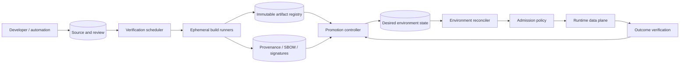
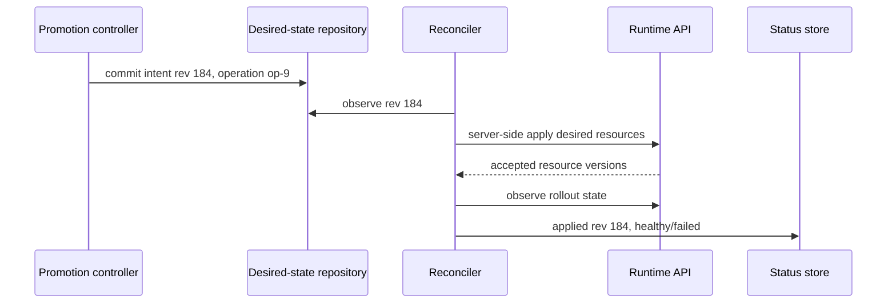

# Software Delivery Control Planes and GitOps Reconciliation

## TL;DR

A delivery platform converts reviewed source state into verified, immutable artifacts, then converges each environment on an approved artifact/configuration tuple. Correctness requires preserving provenance, promotion order, environment ownership, and policy decisions across retries, partial failure, rollback, and compromise while keeping runtime outcomes observable.

The production contract is:

```text
reviewed source + pinned build inputs
  -> reproducible artifact + attestations
  -> policy-approved promotion intent
  -> reconciled environment state
  -> verified runtime outcome
```

CI owns change verification and artifact production. CD owns promotion and outcome gates. GitOps is one reconciliation model for expressing and applying desired state; it does not replace progressive delivery, database migration, secrets management, backup, or incident response.

Build once and identify by digest. Promote the same artifact. Make every control-plane transition idempotent and revisioned. Give reconcilers least privilege per environment. Treat pull requests and build steps as hostile until trust is established. A rollback is safe only when runtime state and data schemas remain compatible.

---

## 1. Delivery as a State Machine

A useful model separates source, artifact, promotion, and runtime state:

```text
SourceRevision {
  repository, commit_digest, dependency_lock_digest,
  build_definition_digest, review_evidence
}

ArtifactRevision {
  content_digest, source_revision, builder_identity,
  sbom_digest, provenance_digest, signatures
}

PromotionIntent {
  environment, artifact_digest, config_digest,
  policy_revision, requested_by, operation_id
}

ObservedRelease {
  environment, desired_revision, applied_revision,
  rollout_state, verification_state, health_evidence
}
```

These records answer different questions:

- What source and dependencies produced these bytes?
- Which exact bytes were approved for this environment?
- Did the environment converge on that intent?
- Did the new version behave acceptably under real traffic?

### 1.1 Core invariants

1. **Content identity:** an artifact digest identifies immutable bytes; a mutable tag is never the authority for promotion.
2. **One build, many promotions:** later environments receive the tested artifact, not a rebuild from the same source.
3. **Complete provenance:** source, builder, build definition, dependencies, and attestations bind to the artifact digest.
4. **Monotonic intent:** stale delivery events cannot overwrite a newer approved environment revision.
5. **Idempotent reconciliation:** repeating a promotion or reconcile operation converges on the same state.
6. **Separated authority:** untrusted change code cannot approve itself, sign a trusted release, or obtain unrestricted production credentials.
7. **Policy before effect:** admission and promotion policy evaluate immutable inputs before the environment accepts them.
8. **Observable completion:** “deployed” means the desired revision is applied and its required verification gates completed, not merely that a command exited zero.
9. **Compatible rollback:** the declared rollback target remains able to read/write current durable state or has an explicit recovery plan.
10. **Auditable break glass:** emergency changes are bounded, attributable, reconciled back into source-of-truth state, and reviewed afterward.

---

## 2. Planes and Trust Boundaries



The **source/review plane** establishes human and automation authority. The **verification plane** schedules tests and builds in isolated workers. The **artifact plane** stores content-addressed release units and evidence. The **promotion plane** changes desired environment state. The **reconciliation plane** observes and applies that state. The **runtime plane** serves real work, while verification feeds observed behavior back into promotion decisions.

Do not collapse the entire graph into one CI service account. A compromised test runner should not write trusted attestations or mutate production. A production reconciler needs only the resources and namespaces it owns, not organization-wide administration.

### 2.1 Control-plane availability

The running data plane should not depend on the CI service for every request. During a delivery-control outage, existing workloads normally continue on the last-known-good state. Expiring secrets, certificates, policy bundles, and feature leases can still make the control plane time-sensitive; inventory those dependencies explicitly.

Recovery must not require rebuilding the old artifact. Retain approved artifact digests, manifests, signatures, config revisions, schema state, and bootstrap credentials for at least the rollback/recovery window.

---

## 3. Continuous Integration as a Verified Build Graph

### 3.1 Change graph and feedback budget

A CI scheduler evaluates a dependency graph, not an unordered list of scripts:

```text
source snapshot
  -> format/static analysis
  -> compile/typecheck
  -> unit/property tests
  -> component/integration tests
  -> artifact build
  -> security/license/provenance policy
  -> release candidate
```

Fast pre-merge feedback limits developer queueing and change batch size. Expensive suites may run after merge or asynchronously only if failures prevent promotion and have an owner. “Non-blocking” checks that nobody acts on are observability noise.

Affected-target execution can reduce work in a monorepo, but the dependency graph becomes a correctness boundary. Missing an edge can let a breaking library change bypass a consumer test. Periodically compare affected-only results against full-graph builds and treat mismatches as platform defects.

### 3.2 Hermeticity and reproducibility

A hermetic action declares and pins:

- source snapshot;
- toolchain/compiler image;
- dependency lockfile and fetched content digests;
- environment variables and locale/timezone;
- generated inputs;
- network access policy;
- architecture/platform;
- command and build definition.

Bit-for-bit reproducibility is ideal for some artifacts but not always practical because signing timestamps, archive ordering, or toolchains introduce variation. At minimum, make inputs complete and attest them. Independently rebuild high-value artifacts and compare meaningful outputs where the ecosystem supports it.

### 3.3 Cache correctness

A build cache key must include every semantic input:

```text
hash(action + input digests + toolchain + platform + relevant environment)
```

An under-keyed cache can produce a green build with an output generated from different source or flags. A poisoned shared cache can cross trust boundaries from an untrusted fork into a protected release.

Separate cache namespaces by trust level, verify returned content digests, make write permission narrower than read permission, and allow a clean uncached rebuild. Cache hit rate is not success if cache correctness is unproven.

### 3.4 Flaky and nondeterministic tests

Retrying a failing test until it passes converts evidence into selection bias. Record every attempt. Quarantine only with an owner, expiry, impact classification, and release policy. Track:

- first-attempt failure rate;
- rerun pass rate;
- time in quarantine;
- affected products and gates;
- environmental versus product root cause.

Randomized/property tests should record seeds and minimized counterexamples. Integration tests need isolated state and stable operation identities so concurrent pipelines do not contaminate one another.

---

## 4. Artifact Identity, Provenance, and Admission

### 4.1 Build once

Promote a digest such as:

```text
registry.example/payments@sha256:4f8c...
```

not `payments:release` or `payments:latest`. Environment-specific configuration remains outside the binary/image and is versioned separately. If packaging genuinely must differ by platform, each platform artifact is a distinct content identity derived from the same source revision and tested explicitly.

### 4.2 Evidence graph

The release record should bind:

```text
artifact digest
  <- build provenance
      <- source commit and build definition
      <- trusted builder identity
  <- SBOM digest
  <- test/scan attestations
  <- signature / transparency evidence
  <- promotion and admission decisions
```

An SBOM inventories components; it does not prove the artifact is safe. A signature proves control of a signing identity; it does not prove the signer or build was trustworthy. Provenance raises confidence only when the builder is isolated, inputs are complete, and admission verifies an expected issuer, repository, workflow, and policy, not merely “some valid signature.”

SLSA defines incremental supply-chain guarantees. in-toto models steps and attestations. Sigstore provides short-lived identity-based signing and transparency mechanisms. Select a profile, then test verifier behavior for expired identity, wrong repository, missing transparency evidence, and digest mismatch.

### 4.3 Admission policy

At promotion and/or cluster admission, evaluate immutable facts:

- artifact digest is in an approved registry;
- provenance issuer and build workflow match policy;
- source revision satisfied required review/protection;
- required attestations bind to this digest;
- severe exceptions have unexpired, scoped approval;
- config and image satisfy environment restrictions;
- no mutable reference can resolve differently after admission.

Policy failure and policy-service unavailability are distinct outcomes. Production should not silently admit an unverifiable artifact because a verifier timed out.

---

## 5. Promotion Is Not Rebuilding

A promotion advances an environment pointer:

```text
(artifact A17, config C42, policy P9)
  from staging-approved
  to production-candidate
```

The operation has an ID and precondition on current environment revision. If two automation paths race, compare-and-swap prevents an older promotion from overwriting the newer one.

### 5.1 Gates

Gates can establish:

- required authority/review;
- artifact and configuration policy;
- schema/precondition readiness;
- smoke/contract test behavior;
- canary or cohort outcome metrics;
- maintenance or business constraints.

A human approval proves a person with a role accepted the change; it does not prove runtime correctness. Automated evidence proves only what it measured. High-risk releases often require both, with the approval bound to an immutable candidate.

[Progressive Delivery and Deployment Strategies](./01-deployment-strategies.md) covers rolling, canary, blue-green, shadow, and rollback thresholds. [Feature-Flag Control Planes](./02-feature-flags.md) covers runtime behavior decoupling. The delivery control plane moves immutable candidates and evidence into both systems.

### 5.2 Stateful ordering

A safe multi-system promotion might be:

```text
expand schema -> verify compatibility
-> deploy backward-compatible code
-> enable behavior cohort
-> migrate/backfill state
-> prove old readers/writers absent
-> contract schema
```

The pipeline should query actual migration and fleet state rather than trust elapsed time. See [Database Schema Evolution](./03-database-migrations.md) and [Service and Platform Migration](./06-migration-strategies.md).

---

## 6. GitOps as a Reconciliation Protocol

GitOps applies the controller pattern to operations: desired state is declarative, versioned/immutable, pulled automatically, and continuously reconciled. Git provides reviewable intent and history; the running cluster remains a distributed system whose observed state can differ.



### 6.1 Reconcile loop

For each owned object:

1. read desired revision;
2. observe actual state at resource versions;
3. compute a deterministic plan;
4. apply idempotently with ownership/preconditions;
5. record applied revision and conditions;
6. retry transient failures with bounded backoff;
7. surface permanent conflict or policy rejection.

Convergence is not the same as success. A controller can continuously converge on a configuration that crashes the application. Runtime verification is a separate gate.

### 6.2 Ownership and drift

Multiple reconcilers or humans editing the same field create a control loop fight. Define field/resource ownership and detect conflicts. Choose drift policy per resource:

- **auto-correct:** safe for immutable application configuration;
- **alert and wait:** useful for sensitive infrastructure or investigation;
- **adopt:** only through an explicit workflow that writes observed state back to desired state;
- **ignore selected fields:** for values legitimately owned by autoscalers or runtime controllers.

Deletion semantics are dangerous. Removing a manifest might delete a production database. Require finalizers, retention policy, explicit prune approval, and resource-class safeguards. “Git revert” cannot resurrect deleted durable data.

### 6.3 Repository topology

App and environment intent may share or separate repositories. The decision depends on authority and scale, not dogma:

- a separate environment repository creates a clear promotion/security boundary but adds cross-repo coordination;
- a monorepo simplifies atomic review across code/config but needs path-level ownership and safe CI triggers;
- directories generally make environment diffs clearer than long-lived environment branches;
- generated manifests must retain the generator inputs and digest so reviewers do not approve opaque churn.

At fleet scale, avoid one giant repository/reconciler hot spot. Partition by environment, tenant, cell, or administrative domain; make promotion across partitions an explicit workflow with partial-state visibility.

---

## 7. Configuration and Secret Delivery

An environment revision is usually `(artifact digest, config digest, secret references, policy revision)`. Configuration needs schema validation, defaults, compatibility, and rollout ordering just like code.

Secrets should not appear in plaintext in source, CI logs, generated manifests, build layers, or test artifacts. Common patterns are:

- encrypted values in version control, decrypted only by an authorized in-environment controller;
- versioned references to a secret manager, resolved by workload identity;
- a configuration service that distributes encrypted, scoped revisions.

Encrypted-in-git still exposes metadata and depends on key recovery. Reference-in-git still needs version pinning and rollback semantics: “latest secret” may change without a desired-state commit. Define whether rotation is independent of application promotion and ensure old/new credentials overlap safely.

CI should use short-lived federated credentials rather than static production secrets. Bind cloud identity to repository, branch/ref, workflow, environment, and approval context. Untrusted pull-request code must not reach protected credentials through cache, artifacts, logs, or workflow-expression injection.

---

## 8. Scale and Cost Model

Consider an illustrative monorepo:

```text
changes merged/day          = 2,000
candidate CI actions/change = 120
affected-action ratio       = 15%
mean action time            = 90 seconds
parallel efficiency         = 70%
```

Daily action execution is:

$$
2{,}000 \times 120 \times 0.15 = 36{,}000\ actions/day
$$

Raw runner time is:

$$
36{,}000 \times 90 / 60 = 54{,}000\ runner\text{-}minutes/day
$$

Cache hits and shared graph execution can reduce this, while flaky retries and clean verification builds add work. Track cost per merged change and per produced artifact alongside feedback latency; optimizing only cache hit rate can conceal incorrect reuse.

For GitOps fleet reconciliation, suppose:

```text
clusters                 = 2,000
applications/cluster     = 150
steady reconcile period  = 180 seconds
average API reads/cycle  = 8
```

Naively polling every object produces roughly:

$$
\frac{2{,}000 \times 150 \times 8}{180}
\approx 13{,}333\ API\ reads/s
$$

across the fleet, before drift storms. Use watches/informers, incremental diffs, jitter, work queues, caching, and per-cluster rate limits. A repository commit that changes a shared base can enqueue hundreds of thousands of resources; stage fan-out and reserve API capacity.

### 8.1 Pipeline SLOs

Measure distributions by trust/risk class:

- queue time and execution time per CI action;
- commit-to-first-signal and commit-to-releasable-artifact;
- first-attempt reliability and flaky retry rate;
- artifact/provenance/admission failures by reason;
- promotion lead time and time waiting at each gate;
- desired-to-applied and applied-to-verified latency;
- reconciliation backlog, conflict, and drift age;
- rollback invocation-to-restored-SLO time;
- runner/registry/controller cost per change and environment.

Deployment frequency, lead time for changes, change failure, and restoration measures can describe delivery outcomes, but aggregate targets should not be copied as universal thresholds. Segment by service and change risk, and connect each metric to an actionable platform bottleneck.

---

## 9. Concrete Failure Traces

### 9.1 Under-keyed build cache promotes old code

1. A compiler flag changes artifact semantics.
2. The cache key includes source files but not the flag.
3. CI returns an old cached binary and green tests built against the same stale output.
4. Provenance accurately records the new source but the bytes came from an invalid cache entry.
5. Production runs behavior reviewers never evaluated.

Include all semantic inputs in cache identity, verify cached content, run clean builds on protected candidates, and make provenance cover the action/input graph rather than source commit alone.

### 9.2 Stale GitOps reconciler rolls back a newer release

1. Reconciler A observes desired revision 500 and pauses.
2. Reconciler B applies revision 501.
3. A resumes and applies its old plan without a revision precondition.
4. Runtime silently returns to revision 500 while desired state remains 501.

Bind plans to desired and observed resource versions, reject stale writes, and report applied revision from observed state. Idempotence alone does not prevent out-of-order control events.

### 9.3 Automatic drift correction fights incident response

1. An operator reduces worker concurrency to protect a database.
2. The GitOps controller restores the declared high value every minute.
3. Database saturation continues while teams debate which system owns the field.

Provide a bounded break-glass/suspend mechanism with identity, expiry, reason, and audit. Reconcile the emergency state back through the desired-state workflow before resuming automatic correction.

### 9.4 Rollback binary cannot read the new schema

1. Release 12 changes a column and begins writing a new representation.
2. Runtime verification fails for an unrelated latency regression.
3. CD repoints to release 11.
4. Release 11 crashes or corrupts the new data.

Promotion policy must query schema compatibility and migration phase. Prefer expand/contract with old-reader compatibility; otherwise rollback is a forward recovery plan, not a digest change.

### 9.5 Untrusted pull request steals production identity

1. A fork changes a build script.
2. The workflow exposes a long-lived registry/cloud credential to all PR jobs.
3. The script exfiltrates it and publishes a look-alike artifact.
4. A later pipeline promotes the malicious digest.

Run untrusted code without protected secrets, separate trusted post-review workflows, use short-lived contextual identity, restrict registry paths, and verify provenance/admission constraints.

### 9.6 Shared-base change creates a reconcile storm

1. A common manifest library changes.
2. Every cluster receives a desired-state update simultaneously.
3. Reconcilers saturate runtime APIs and admission webhooks.
4. Health checks and autoscalers lose API capacity.
5. partial convergence leaves fleet versions mixed.

Canary desired-state fan-out by cell, jitter queues, isolate control traffic, set global/per-cluster budgets, and expose a fleet convergence ledger.

---

## 10. Multi-Region, Recovery, and Bootstrap

Partition delivery components by blast radius. A single config repository or signing identity can be global, but compromise or outage then affects every region. Protect roots strongly, replicate read paths, and limit environment write authority.

A region should be reconstructable from:

- trusted identity/key bootstrap material;
- immutable infrastructure and application intent;
- approved artifact registry/replica;
- policy and admission artifacts;
- data recovery state;
- DNS/routing procedure;
- controller checkpoints only as optimization, not sole truth.

GitOps reconstructs declared resources; it does not restore database contents, external provider state, or deleted cryptographic keys. The recovery architecture is in [Disaster Recovery and Data Reconstruction](./05-disaster-recovery.md).

Test with the primary CI provider, repository, registry region, identity issuer, or production account unavailable. A runbook stored only in the failed platform is not a recovery input.

---

## 11. Verification and Migration

### 11.1 Test the delivery system

- Rebuild candidates from a clean environment and compare outputs/evidence.
- Mutate each provenance field and prove admission rejects it.
- Poison or under-key a test cache and verify protected builds remain safe.
- Replay and reorder promotion/reconcile events; assert monotonic environment state.
- Kill controllers before and after apply; assert idempotent convergence.
- Exercise desired deletion, ownership conflict, API throttling, and watch loss.
- Run old/new schema and binary compatibility matrices.
- Simulate metric-gate absence, delayed telemetry, and cohort contamination.
- Attempt credential access from untrusted fork workflows.
- Restore a region from retained artifacts and desired state without rebuilding.

### 11.2 Migrate incrementally

To replace script-driven deployment with a delivery control plane:

1. Inventory artifact creation, credentials, environments, mutable tags, and manual paths.
2. Introduce content-addressed artifacts and provenance without changing deployment.
3. Establish one authoritative promotion record and compare it with actual runtime.
4. Add a reconciler in observe-only mode; classify drift and ownership.
5. Take ownership of low-risk resources, then canary environments/cells.
6. Move production credentials from CI into scoped reconcilers.
7. Add admission and outcome gates with shadow decisions before enforcement.
8. Remove legacy mutation paths after an audited period with no unexplained writes.

Avoid a flag day. Two controllers actively owning the same fields are more dangerous than one old deploy script.

---

## 12. Design Review Framework

Ask:

1. Which immutable bytes and configuration did each environment approve and run?
2. Can the artifact be traced to complete inputs and a trusted builder?
3. Can untrusted change code write caches, attestations, registries, or environment intent used by trusted releases?
4. How do promotion and reconciliation reject stale or duplicated events?
5. Which fields/resources does each controller own, and how is break glass reconciled?
6. What is the maximum fleet fan-out of one source or config change?
7. Which data/schema states make rollback unsafe?
8. Does runtime verification distinguish a bad release from a regional/dependency incident?
9. Can production keep serving when CI, git hosting, registry, identity, or a controller is unavailable?
10. Can a clean region be reconstructed from retained, independently accessible inputs?

A credible delivery platform makes releases smaller and routine because identity, state transitions, and failure behavior are explicit, not because deployment complexity disappeared.

---

## References

- [OpenGitOps Principles](https://opengitops.dev/): declarative, versioned, pulled, continuously reconciled desired state
- [Kubernetes controller pattern](https://kubernetes.io/docs/concepts/architecture/controller/): observe/diff/reconcile control loops
- [SLSA specification](https://slsa.dev/spec/): supply-chain levels, provenance, and build requirements
- [in-toto specification](https://in-toto.io/): cryptographically verifiable software-supply-chain steps
- [Sigstore documentation](https://docs.sigstore.dev/): identity-based signing and transparency mechanisms
- [The Update Framework specification](https://theupdateframework.io/): resilient artifact/update metadata and key roles
- [NIST SP 800-218: Secure Software Development Framework](https://csrc.nist.gov/pubs/sp/800/218/final): secure development and release practices
- [Argo CD architecture](https://argo-cd.readthedocs.io/en/stable/operator-manual/architecture/) and [Flux architecture](https://fluxcd.io/flux/concepts/): production GitOps controller designs
- [SRE Workbook: Canarying Releases](https://sre.google/workbook/canarying-releases/): outcome-based release verification
- [DORA research program](https://dora.dev/research/): delivery performance and reliability research
