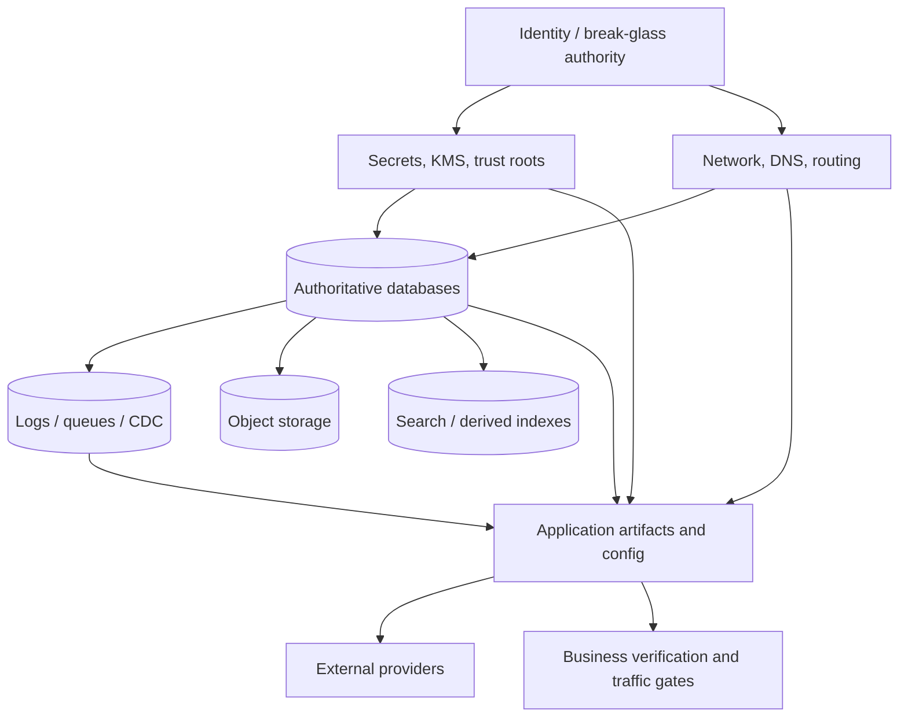
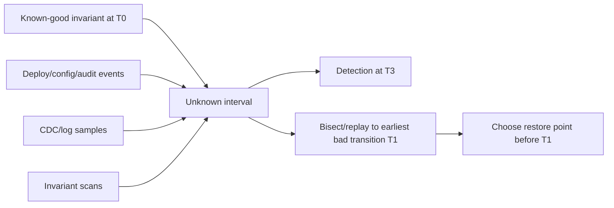
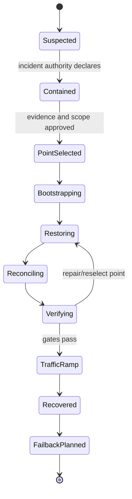

# Disaster Recovery and Data Reconstruction

## TL;DR

High availability keeps serving through expected component faults. Disaster recovery reconstructs a trustworthy service after correlated infrastructure loss, destructive control-plane action, credential compromise, ransomware, or data corruption that healthy replicas faithfully copied.

Recovery is a protocol, not a collection of backups:

```text
declare and contain
  -> identify a trustworthy recovery point
  -> bootstrap identity, keys, network, and control planes
  -> restore authoritative state in dependency order
  -> replay and reconcile later legitimate effects
  -> prove integrity and application invariants
  -> admit traffic gradually
  -> preserve evidence and plan failback
```

RPO states how much committed history the business may lose. RTO states how long the service may remain outside its recovery objective. Neither proves that the recovered state is mutually consistent, decryptable, or operationally safe. A production design also defines the recovery boundary, authoritative sources, restore throughput, cross-system consistency, key custody, validation gates, and who may declare/fail over/fail back.

Replication is not backup: it optimizes current agreement and commonly replicates deletion or corruption. A backup is useful only when an independently authorized process has restored it, replayed required logs, verified business invariants, and measured the end-to-end time.

---

## 1. Define the Recovery Contract

For each product capability, specify:

```text
RecoveryContract {
  protected_assets
  disaster_classes
  recovery_boundary
  authoritative_sources
  RPO by data class
  RTO by capability
  maximum inconsistent-state window
  required verification
  degraded-mode behavior
  declaration and authority policy
}
```

### 1.1 Threat model

Include more than region outage:

- database, object-store, or account deletion;
- silent application corruption discovered after days;
- compromised administrator or automation deleting primary and backup state;
- ransomware encrypting reachable data and credentials;
- lost KMS key, identity provider, DNS zone, or certificate authority;
- poisoned software/configuration used by the recovery environment;
- provider control-plane failure while data-plane replicas remain;
- legal or sovereignty restrictions that prevent restoring into a convenient region;
- a disaster declaration made on incomplete evidence, creating split brain;
- recovery load overwhelming the surviving source or target.

### 1.2 Core invariants

1. **Independent recovery authority:** at least one usable recovery copy cannot be altered or deleted by the ordinary production writer/administrator path.
2. **Complete dependency inventory:** retained state includes or references the schema, key versions, software artifacts, configuration, and logs required to interpret it.
3. **Recoverable encryption:** an authorized recovery process can obtain required keys throughout retention; key loss is tested as a dependency failure.
4. **Known recovery point:** the chosen state has a defined timestamp/log position/revision and corruption justification.
5. **Cross-system coherence:** related databases, logs, object stores, and external effects are restored or reconciled to a valid domain state.
6. **Single authority after failover:** the old site cannot continue accepting conflicting writes; fencing applies at each authoritative resource.
7. **Verified before traffic:** restored bytes pass integrity, schema, application, security, and business-invariant checks.
8. **Idempotent orchestration:** restart/retry of recovery steps does not duplicate effects or destroy evidence.
9. **Bounded data loss and outage:** observed RPO/RTO are measured from committed history and user capability, not backup job timestamps.
10. **Auditable decisions:** declaration, recovery-point selection, key access, repair, exception, traffic admission, and failback are attributable.

---

## 2. Recovery Boundary and Dependency Graph

A service rarely recovers from one database alone:



Inventory:

- authoritative transactional state;
- append-only/event history and outbox positions;
- object data and version metadata;
- schemas, migrations, dictionaries, model/config versions;
- identity, workload trust, secrets, and cryptographic keys;
- infrastructure desired state and signed application artifacts;
- DNS, certificates, routing, quotas, allow lists, and external-provider configuration;
- derived state: caches, search indexes, analytics, materialized views;
- provider receipts for payments, email, fulfillment, and other external effects;
- audit data needed to locate corruption and prove recovery.

For every asset label it **authoritative**, **derived/rebuildable**, **external authority**, or **evidence only**. Two “authoritative” copies with no conflict protocol create an undefined recovery choice.

### 2.1 RPO is not consistency

Suppose an order database is restored to 10:00:00, its payment-outbox log to 09:59:40, and the payment provider has charges through 10:00:05. Every individual asset may meet a one-minute RPO while the combined business state loses charge intents and risks incorrect refunds or duplicates.

Define consistency groups or a reconciliation protocol:

- coordinated snapshots/transactional log positions;
- a domain operation ID present across systems;
- an immutable source log from which projections are rebuilt;
- provider-side idempotency keys and receipts;
- compensating review queues for unmatched effects.

---

## 3. Recovery Objectives and Service Tiers

### 3.1 RPO and RTO

For disaster time $t_d$ and latest committed state included in the recovered system $t_r$:

$$
observed\ RPO = t_d - t_r
$$

For declaration/detection time $t_0$ and the time the required capability again satisfies its recovery gate $t_s$:

$$
observed\ RTO = t_s - t_0
$$

Be explicit whether the contractual clock begins at fault occurrence, detection, or declaration. Business impact begins at occurrence; operational measurement often starts at declaration, which can hide detection delay.

RTO should name capability and load. “Database accepted a query” is not “checkout restored at 70% peak throughput with reconciliation current.”

### 3.2 Example tiering

The following is illustrative, not a universal standard:

| Tier | Capability | Example objective | Likely design |
|---|---|---|---|
| 0 | ledger, identity, safety control | near-zero RPO; minutes RTO | isolated log/backup plus warm or active recovery site, strict fencing |
| 1 | core product writes | minutes RPO; under hours RTO | continuous log shipping, warm infrastructure, tested promotion |
| 2 | support/analytics | hours RPO/RTO | snapshots and rebuildable pipelines |
| 3 | cache/scratch | no retained RPO; bounded rebuild | recreate from authoritative state |

Derive objectives from maximum tolerable loss, regulatory duty, customer promise, and recovery cost. Separate read, write, export, and administrative capabilities; a degraded read-only product may meet an early recovery milestone before full writes are safe.

### 3.3 Recovery strategy spectrum

| Strategy | Standing resources | Typical trade-off |
|---|---|---|
| Backup and restore | retained data, minimal compute | lowest steady cost; restore/catch-up dominates RTO |
| Pilot light | core data/control components running | faster bootstrap; still substantial scale-up and verification |
| Warm standby | reduced-capacity full stack | faster cutover; must prove capacity expansion and freshness |
| Multi-site serving | multiple sites serve continuously | lowest infrastructure-start time; highest write-conflict/fencing complexity |

Active-active multi-region is not automatically a backup: bad mutations, compromised credentials, and application bugs can reach every active copy. Pair serving topology with time- and control-isolated recovery data. [Multi-Region Systems](../06-scaling/09-multi-region-architecture.md) covers steady-state placement and routing; disaster recovery covers loss, declaration, reconstruction, and return.

---

## 4. Data-Protection Pipeline

### 4.1 Base snapshots plus change logs

A common database recovery chain is:

```text
consistent base snapshot S at log position L0
  + archived log segments L0..Ln
  -> restore S
  -> replay through selected position Lt
  -> recovered database at Lt
```

The base snapshot reduces replay volume. Continuous WAL/binlog/archive capture determines achievable RPO. The catalog must bind snapshot, log range, database/schema version, checksums, encryption key versions, region, retention, and verification result.

A “successful upload” is not enough. Verify:

- every log segment is present, ordered, and checksum-valid;
- the snapshot is application-consistent or has a valid crash-recovery protocol;
- old engine versions and extensions needed for restore remain available;
- time/position mapping is precise enough for corruption-point selection;
- retention cannot delete a base while dependent log segments remain, or vice versa.

### 4.2 Snapshots and quiescence

Storage snapshots may be crash-consistent at a device boundary but not transaction-consistent across volumes or services. Application quiescence, database-native backup APIs, consistency groups, or log-coordinated snapshots may be needed.

Freezing a large system can violate availability. Prefer incremental/online mechanisms when they preserve semantics, and measure copy-on-write pressure and backup impact on tail latency.

### 4.3 Object and blob state

Object versioning keeps earlier bytes, while replication copies current operations elsewhere. Object lock/WORM retention can prevent deletion for a period. Still catalog:

- versions required by database metadata;
- multipart/incomplete objects;
- lifecycle policies and replication lag;
- delete markers and legal holds;
- encryption key references;
- consistency of object index and object contents.

A restored database pointing to object versions already expired by lifecycle policy is not recovered.

### 4.4 Logical exports

Logical dumps or portable columnar exports may survive engine-level defects and enable selective recovery. They are slower, can lose transactional cross-table consistency, and may omit users, extensions, sequences, grants, or large objects. Use them as a diverse recovery path, not a casually assumed equivalent of physical backup.

---

## 5. Isolation, Immutability, and Key Custody

Recovery data must break shared-fate paths:

```text
production writer identity
  cannot delete backup vault

production admin identity
  cannot shorten retention

backup service identity
  can append snapshots/logs
  cannot rewrite existing objects

recovery identity
  time-bounded, audited, independently approved
```

Use separate accounts/projects, access paths, credentials, and retention governance where the threat requires it. Object lock protects objects only if administrators cannot change governance or destroy the account/key. Preserve audit logs in another boundary.

### 5.1 Encryption dependency

Backups normally need encryption, but the key hierarchy becomes part of recovery. Inventory exact key versions and test access from the recovery identity/environment. A KMS replica in the same deleted account is not independent.

Escrow/highly protect root recovery material with split knowledge or multi-party approval appropriate to the risk. Do not weaken day-to-day key policy by granting broad permanent decrypt access “for emergencies.” Exercise the real break-glass path and rotate it after use. See [Cryptographic Key and Data-Protection Architecture](../10-security/06-encryption.md).

### 5.2 Crypto-shredding and retention

Tenant deletion through key destruction conflicts with backup retention and legal hold. Define whether deleted tenant data must remain unavailable in restored backups, how tombstones/denylists are replayed before serving, and whether per-tenant key scope supports it. Restoring an old backup must not resurrect accounts, permissions, credentials, or erased data into a reachable environment.

---

## 6. Corruption-Point Analysis

For region loss, “latest good copy” may be clear. For silent corruption, selecting the recovery point is often the longest step.



Maintain evidence to answer:

- Which code/config/schema revision first produced invalid state?
- Which tables/tenants/objects are affected?
- Did corruption originate upstream or in a derived projection?
- Which legitimate writes occurred after the chosen recovery point?
- Which external effects cannot simply be replayed?

Continuous invariant checks narrow the unknown interval. Examples include ledger balance, foreign-key/domain relationship, object checksum/reference, monotonically increasing sequence, and source/projection count with bounded lag.

### 6.1 Selective versus full recovery

If corruption is confined and provenance is trustworthy, repair affected rows/objects from historical versions while preserving later good writes. Full point-in-time restore is simpler semantically but can discard large amounts of legitimate history.

Run forensic replay in an isolated environment. Compare candidate points and produce a repair manifest. Keep original evidence immutable; do not investigate by mutating the only surviving copy.

---

## 7. Recovery Orchestration State Machine



### 7.1 Declare and contain

Before restoring, stop the cause:

- fence old write authorities and automation;
- preserve audit, logs, snapshots, and volatile evidence;
- revoke compromised credentials and signing/deployment paths;
- pause destructive lifecycle/retention and scheduled jobs;
- isolate known-bad artifacts/configuration;
- choose the incident command and decision authority.

Failing over while a corrupt writer remains active reproduces the disaster.

### 7.2 Bootstrap

Break circular dependencies:

1. independent recovery identity and communication;
2. trust roots, KMS/secrets bootstrap, and audited access;
3. network, routing, DNS control, quotas, and allow lists;
4. clean artifact/configuration source and recovery orchestrator;
5. data services in dependency order;
6. applications with outbound side effects disabled initially;
7. verification and gradual traffic admission.

Store the runbook and necessary tools outside the primary failure boundary. Recovery should not require the compromised CI runner to build a script.

### 7.3 Restore and replay

Make each step idempotent and checkpointed:

```text
step ID + input snapshot/log digest + target + status + evidence
```

Restore base data, apply schema/tooling compatible with the selected point, replay logs to the exact target, rebuild derived state, and retain source positions. Workers, schedulers, webhooks, and notification systems stay disabled until operation identities and reconciliation prevent duplicate external effects.

### 7.4 Reconcile external and later effects

Compare:

- recovered domain operations;
- archived outbox/event log;
- provider receipts and idempotency records;
- inbound customer/provider webhooks;
- derived projections.

Classify missing, duplicate, conflicting, and uncertain operations. Automated replay is safe only for idempotent effects with stable identities. Money movement, entitlement, shipment, or irreversible communication may require domain-specific review.

### 7.5 Verify and admit traffic

Verification layers:

1. media/object/log checksums and completeness;
2. database recovery/checkpoint and schema integrity;
3. referential and business invariants;
4. identity, tenant, key, policy, and deletion tombstones;
5. read-only application journeys;
6. controlled writes with reconciliation evidence;
7. capacity, latency, and dependency health under increasing traffic;
8. RPO/RTO and residual-risk statement.

Traffic ramp uses the same controlled exposure principles as [Progressive Delivery](./01-deployment-strategies.md). A health endpoint alone is not a recovery gate.

---

## 8. Restore Capacity and Cost Model

End-to-end RTO is approximately the critical path, not the sum of every parallel task:

$$
RTO \ge T_{declare} + T_{bootstrap} + T_{base\ restore}
    + T_{log\ replay} + T_{reconcile} + T_{verify} + T_{traffic\ ramp}
$$

### 8.1 Base restore

For an illustrative 24 TiB compressed backup and effective end-to-end restore throughput of 1.2 GiB/s:

$$
T_{base} = \frac{24 \times 1024\ GiB}{1.2\ GiB/s}
         = 20{,}480\ seconds
         \approx 5.7\ hours
$$

This already misses a four-hour RTO before replay or verification. “Storage supports 10 GiB/s” is not the effective number if decrypt, network, decompression, target writes, indexes, or API quotas bottleneck.

Measure throughput by object size, region, encryption path, target engine, concurrency, and checksum cost. Small-file/object restores often become request-rate bound rather than bandwidth bound.

### 8.2 Log replay

If the restored base is six hours behind, the workload generated 300 MiB/s of archived log, and replay applies at 900 MiB/s while no new writes are admitted:

$$
backlog = 6 \times 3600 \times 300\ MiB \approx 6.18\ TiB
$$

$$
T_{replay} \approx \frac{6.18\ TiB}{900\ MiB/s}
              \approx 2.0\ hours
$$

If the target accepts new writes during catch-up, subtract arrival rate from replay capacity. When replay capacity is not greater than new log generation, convergence never completes.

### 8.3 Restore fleet sizing

Parallelism is bounded by source read, network, KMS/decrypt operations, target write/compaction, catalog/API quotas, and dependency order. Overparallelization can throttle the vault or cause storage compaction collapse. Benchmark, cap, and dynamically adjust concurrency from the bottleneck.

Standing warm capacity costs more but buys bootstrap and restore bandwidth. Compare expected loss and contractual impact, not only idle compute. Keep pricing assumptions dated and external to the architecture; the capacity model remains valid as rates change.

---

## 9. Failover Authority and Traffic

### 9.1 Fence before redirect

Region or account isolation may prevent proving the old site stopped. New write authority needs an epoch/fencing mechanism enforced at the durable system or external provider. DNS change alone creates routing preference, not exclusive authority; old clients and queues can continue.

For multi-writer designs, conflict/merge semantics may permit continued writes, but disaster declaration can still change which region owns non-mergeable resources, background jobs, and external effects.

### 9.2 DNS and client convergence

DNS TTL is only one delay. Recursive resolvers can cache, clients pool connections, mobile apps remain offline, and allow lists/firewalls may reference old addresses. Track traffic at old and new sites. Provide explicit epoch rejection for stale clients when writes must not continue.

### 9.3 Degraded modes

A documented recovery mode may offer:

- read-only access at a known snapshot;
- queued intent that is not presented as committed;
- reduced product surface;
- lower tenant quotas or priority-only processing;
- delayed exports/analytics;
- manual review for high-risk side effects.

Each mode states correctness and durability. “Accept writes locally and figure it out later” is valid only with a bounded buffer and conflict/reconciliation protocol.

---

## 10. Failback Is Another Migration

After recovery, the original site may return with stale or contaminated state. Do not simply reverse DNS.

1. Decide whether the recovered site becomes the new primary permanently.
2. Rebuild the old site from trusted current state rather than assuming its data is valid.
3. Catch up and verify checksums/business invariants.
4. Restore backup, monitoring, key, and control-plane coverage for the new topology.
5. Test capacity and fencing.
6. Migrate traffic progressively with an explicit write-authority transition.
7. Preserve incident evidence until review and retention obligations complete.

Failback consumes risk while the team is tired. Delay it until the product is stable and a reviewable migration plan exists.

---

## 11. Concrete Failure Traces

### 11.1 Every replica contains the corruption

1. A deployment writes malformed balances for six days.
2. Synchronous and asynchronous replicas apply every transaction correctly.
3. Daily snapshots rotate on a seven-day schedule.
4. Detection occurs after the last known-good snapshot expires.
5. Infrastructure is healthy, but no clean state remains.

Set retention from maximum detection interval, not backup frequency alone. Run continuous business-invariant scans, maintain PITR/archive depth, and protect historical copies from the same lifecycle job.

### 11.2 Backup is intact but undecryptable

1. Backups are encrypted with a production-account KMS key.
2. Account compromise triggers account isolation/deletion.
3. The backup objects were copied to another account, but the key was not independently recoverable.
4. Restore reads bytes but cannot open any snapshot.

Key hierarchy, policy, aliases/versions, and break-glass access are recovery assets. Exercise a restore using the actual independent identity and region.

### 11.3 Latest restore duplicates external payments

1. Payment provider calls committed through 10:05.
2. The internal database is restored to 10:00.
3. Workers treat missing internal rows as unprocessed orders.
4. They resend calls with new operation IDs.
5. Customers are charged twice.

Recover provider idempotency identities and receipts, disable workers initially, and reconcile provider authority against recovered intent before replay.

### 11.4 Failover creates split-brain writers

1. Region A loses control-plane connectivity but continues serving some clients.
2. Incident command promotes region B and changes DNS.
3. Long-lived clients and queues still reach A.
4. Both regions accept non-mergeable writes.

Use quorum/fencing at the write authority, drain or reject stale epochs, and verify traffic at the old site. Routing is not fencing.

### 11.5 Restore storm misses the RTO

1. Thousands of backup objects restore concurrently.
2. The vault hits request/KMS quotas.
3. Workers retry without shared backoff.
4. Small critical metadata is stuck behind bulk objects.
5. Throughput collapses below the drill benchmark.

Prioritize metadata/critical partitions, enforce global concurrency, prearrange quotas, use single-flight/retry budgets, and test at full retained volume.

### 11.6 Old backup resurrects revoked access

1. A six-month-old snapshot is restored for forensic recovery.
2. It contains users, API keys, sharing relationships, and tenants deleted since then.
3. Network access is enabled before current revocation/deletion state is replayed.
4. A revoked credential succeeds.

Keep the restore isolated, apply current deny/tombstone/key-revocation state before exposure, rotate secrets, and validate authorization at current policy revisions.

---

## 12. Drills, Verification, and Evidence

### 12.1 Automated restore verification

A recurring pipeline should:

1. select a retained backup and required logs/keys;
2. restore into an isolated, disposable environment;
3. record effective throughput and every phase duration;
4. run checksum, schema, domain-invariant, and sample application tests;
5. verify chosen point/log position and derived-state rebuild;
6. prove isolation and deletion after the test;
7. publish an immutable result tied to backup catalog entries.

Do not connect a restored historical environment to production webhooks, email, schedulers, or customer-facing DNS.

### 12.2 Game-day matrix

Rotate scenarios:

- primary region unavailable;
- production cloud account locked;
- backup catalog/control service unavailable;
- KMS/key-region loss;
- silent corruption with uncertain start time;
- compromised deployment/configuration path;
- full-volume restore under target RTO;
- partial cross-service restore and external-effect reconciliation;
- failback after days in recovery region.

Tabletops validate decisions and contacts; technical drills validate mechanics and throughput. Both are necessary. Capture observed RPO, phase-level RTO, manual steps, unavailable dependencies, security exceptions, and unresolved gaps with owners.

### 12.3 Recovery SLOs and telemetry

Track continuously:

- age of latest restorable point by asset/tier;
- archive/log gaps and copy lag;
- retention-lock and independent-copy status;
- key-version coverage and last independent decrypt test;
- last successful full and selective restore;
- effective restore/replay throughput distributions;
- inventory coverage for databases, objects, config, secrets, and external effects;
- corruption/invariant scan freshness;
- drill RPO/RTO and open finding age.

Alert on loss of recoverability before an incident (for example, a missing log segment or expiring key), not merely failed backup jobs.

---

## 13. Security and Governance

Recovery bypasses normal controls by design, so it is a high-value attack path.

- Use separate, strong recovery identities with multi-party/time-bounded activation.
- Log backup reads, decrypts, restores, exports, retention changes, and break-glass use to an independent audit boundary.
- Mask or synthesize sensitive data for routine drills when full production data is unnecessary; when it is necessary, apply production-equivalent isolation and deletion proof.
- Validate artifact/configuration provenance so recovery does not redeploy the compromised cause.
- Preserve legal holds, regional restrictions, retention, and deletion obligations through restore.
- Rotate credentials and keys exposed during recovery.
- Preapprove emergency network and quota paths without creating a permanent bypass.

Backups expand the privacy and breach surface. Retain only what the recovery contract requires and maintain data/key lineage so deletion and access requests remain enforceable.

---

## 14. Design Review Framework

Ask:

1. Which disaster classes and shared control-plane failures are covered?
2. What exact capability, load, clock start, RPO, and RTO does each tier promise?
3. Which copy is independent of ordinary production identity, deletion, corruption, and region/account loss?
4. Can the recovery environment obtain every historical schema, artifact, secret, and key version needed?
5. How is a trustworthy corruption point found, and how long can corruption remain undetected?
6. How are databases, event logs, objects, and external provider effects made coherent?
7. What measured restore/replay throughput proves the RTO at full retained volume?
8. How is the old site fenced before new write authority begins?
9. Which verification gates must pass before reads, writes, workers, and external side effects resume?
10. How are current revocations, tenant deletions, and security policy applied to historical state?
11. What is the failback plan and the post-recovery backup posture?
12. When did the last independent end-to-end drill meet the contract, and what findings remain?

If a design can answer only “where are the backups?”, it has described storage inventory, not disaster recovery.

---

## References

- [NIST SP 800-34 Rev. 1: Contingency Planning Guide for Federal Information Systems](https://csrc.nist.gov/pubs/sp/800/34/r1/final): contingency planning, recovery strategy, testing, and maintenance
- [Google SRE Book: Data Integrity](https://sre.google/sre-book/data-integrity/): layered defense, backup, restore, and corruption considerations
- [PostgreSQL: Continuous Archiving and Point-in-Time Recovery](https://www.postgresql.org/docs/current/continuous-archiving.html): base backup and WAL replay mechanics
- [AWS Well-Architected: Disaster Recovery of Workloads](https://docs.aws.amazon.com/wellarchitected/latest/reliability-pillar/disaster-recovery-dr-objectives.html): RPO/RTO and recovery strategy trade-offs
- [Azure Architecture Center: Disaster recovery and storage account failover](https://learn.microsoft.com/azure/well-architected/reliability/disaster-recovery): recovery planning and regional failure considerations
- [GitLab database outage postmortem, 2017](https://about.gitlab.com/blog/2017/02/01/gitlab-dot-com-database-incident/): public evidence on backup/restore operational failure
- [CISA StopRansomware Guide](https://www.cisa.gov/stopransomware/ransomware-guide): isolated backups and recovery preparation against destructive compromise
- [RFC 8905: The 'payto' URI Scheme for Payments](https://www.rfc-editor.org/rfc/rfc8905): an example of why external financial identifiers and effects require explicit reconciliation, not blind replay
