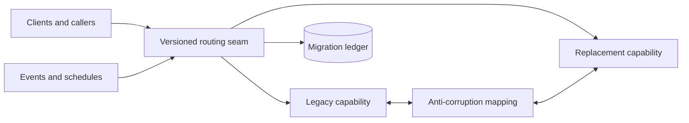

# Service and Platform Migration

## TL;DR

A migration changes the authority for live behavior or durable state while both old and new systems continue to serve. The hard problem is not copying code or bytes; it is preserving invariants across mixed versions, delayed replication, retries, backfills, and rollback.

Treat a migration as a durable protocol:

1. define the unit that moves and the authority for each operation;
2. establish a routing or abstraction seam;
3. make old and new representations mutually compatible;
4. copy historical state without overwriting newer writes;
5. verify equivalence on production-shaped inputs;
6. transfer read authority, then write authority, through explicit gates;
7. preserve a bounded rollback path;
8. delete the old path and its data only after dependency evidence reaches zero.

The strangler fig, branch by abstraction, shadow traffic, and expand/contract are mechanisms inside that protocol. None is safe without a state ledger, reconciliation, capacity controls, and a declared point after which rollback becomes another forward migration.

---

## 1. Start With the Migration Contract

“Move billing to the new service” is not an executable plan. Define:

- **migration unit:** tenant, account, object, route, region, shard, or capability;
- **source authority:** which system owns reads and writes initially;
- **target authority:** which system must own them at completion;
- **identity mapping:** how source identifiers map to target identifiers;
- **semantic mapping:** how each source state maps to a target state;
- **consistency target:** what temporary divergence is allowed and for how long;
- **compatibility envelope:** which old and new binary/schema versions may coexist;
- **cutover gates:** evidence required to advance each phase;
- **rollback boundary:** the last phase from which routing alone can restore service;
- **retention/deletion rule:** when old code, data, keys, and infrastructure may be removed.

### 1.1 Core invariants

A production migration normally needs these invariants:

1. **Single logical authority:** for a migration unit and operation type, one system is authoritative at a time.
2. **No lost accepted writes:** every acknowledged mutation is durable in the current authority and eventually represented in the target.
3. **No stale overwrite:** a backfill or delayed replication record cannot replace a newer target state.
4. **Stable routing:** retries for one logical operation resolve to the same authority or carry an idempotency identity valid across both.
5. **Monotonic phase:** a unit cannot silently move from `TARGET_WRITE` back to `SOURCE_WRITE`.
6. **Auditable transition:** every phase change records revision, actor, evidence, and time.
7. **Bounded divergence:** reconciliation can state how far replicas may differ and identify exceptions.
8. **Isolation:** one tenant's migration cannot expose or overwrite another tenant's state.
9. **Deletion safety:** old state is deleted only after callers, readers, writers, replay consumers, and rollback dependencies are proven absent.

The “single authority” invariant does not forbid two physical writes. It means one result defines truth; the other write is replication with explicit retry and repair semantics.

---

## 2. Model Migration State Explicitly

A per-unit state machine makes routing and recovery testable:

```text
SOURCE_ONLY
  -> SHADOW_COPY
  -> DUAL_READ_COMPARE
  -> TARGET_READ
  -> TARGET_WRITE_REVERSE_SYNC
  -> TARGET_ONLY
  -> RETIRED
```

Each state defines authorities rather than progress labels:

| State | Read served from | Write accepted by | Replication | Routing rollback |
|---|---|---|---|---|
| `SOURCE_ONLY` | source | source | none | not needed |
| `SHADOW_COPY` | source | source | source to target | yes |
| `DUAL_READ_COMPARE` | source | source | source to target | yes |
| `TARGET_READ` | target | source | source to target | yes |
| `TARGET_WRITE_REVERSE_SYNC` | target | target | target to source | yes, while mapping is lossless |
| `TARGET_ONLY` | target | target | optional audit only | no simple rollback |
| `RETIRED` | target | target | none | no |

Store the state in a strongly consistent migration ledger:

```text
migration_unit
phase
phase_revision
source_checkpoint
target_checkpoint
mapping_version
routing_revision
entered_at
verified_at
rollback_deadline
evidence_digest
```

Transitions use compare-and-swap on `phase_revision`. The router reads a versioned snapshot of this ledger and rejects a downgrade. Operators do not toggle independent “read new” and “write new” booleans; invalid combinations are impossible states in the state machine.

### 2.1 Global, cohort, or entity-level state

The migration unit controls complexity:

- **route or capability:** simple routing, but state shared across capabilities can couple cutovers;
- **tenant/account:** clean reconciliation and rollback boundary; creates skew when large tenants differ greatly;
- **object:** fine-grained progress and load smoothing; routing metadata can become enormous and transactions spanning objects become difficult;
- **shard/region:** operationally efficient, but each step has larger blast radius.

Choose the largest unit whose data, invariants, and dependencies can move independently. Percentage routing is often safe for stateless reads; stateful writes usually need entity-sticky routing.

---

## 3. Establish a Seam Before Replacing Behavior

### 3.1 Strangler seam

For networked systems, route all relevant entry points through a controlled seam:



The seam may live in an [edge gateway](../12-service-mesh/02-api-gateway.md), service router, facade, queue consumer, scheduler, or client library. HTTP routing alone is incomplete if cron jobs, event subscriptions, webhooks, admin tools, or direct database readers bypass it.

First deploy the seam as a pass-through and verify that it preserves identity, deadlines, idempotency keys, authorization context, tracing, and response semantics. A seam that changes behavior before migration begins adds two unknowns at once.

### 3.2 Branch by abstraction

Inside one codebase:

1. place an interface around the old implementation without changing behavior;
2. route every caller through it;
3. implement the new path behind the same semantic contract;
4. select per migration unit from the ledger;
5. compare, transfer authority, and remove the old path;
6. remove the temporary abstraction if it has no long-term architectural value.

The abstraction must represent domain semantics, not merely mirror a legacy API. Otherwise the new design inherits the coupling the migration was intended to remove.

### 3.3 Anti-corruption boundary

Make translation explicit and versioned:

```text
source representation
  -> normalize
  -> validate source invariants
  -> map(mapping_version)
  -> validate target invariants
  -> target representation
```

Record mapping failures as durable repair work; do not discard records or substitute a permissive default. When source states cannot be represented, choose explicitly among extending the target model, transforming with documented information loss, quarantining the unit, or preventing its cutover.

---

## 4. Moving Historical State Safely

### 4.1 Snapshot plus change stream

An online copy must bridge writes occurring during the scan:

1. obtain a consistent source snapshot at checkpoint `C0`;
2. begin or retain a change stream from `C0`;
3. scan and transform snapshot rows;
4. apply each target record conditionally;
5. consume changes after `C0` in source order;
6. declare catch-up only when the applied checkpoint reaches the required boundary.

Without a snapshot/checkpoint relationship, changes between “start CDC” and “finish scan” can be missed or applied in an unsafe order.

### 4.2 Version-fenced upsert

Each copied record needs a source ordering token:

```text
apply(target_key, value, source_version):
  atomically write only if source_version > stored_source_version
```

The token may be a log position, per-entity version, commit timestamp with a deterministic tie-breaker, or database transaction identifier. A plain “upsert whatever the backfill read” permits a slow historical scan to overwrite a newer replicated write.

If the target combines multiple source rows, the version must describe the derived snapshot or the job must recompute from a transactionally consistent input. Per-row versions are not sufficient for a cross-row invariant.

### 4.3 Idempotent work partitioning

Partition the scan by stable key ranges or immutable snapshot files. A work item records:

```text
range_start
range_end
snapshot_id
mapping_version
attempt
checkpoint
result_counts
checksum
```

Retries reprocess the same immutable input and use version-fenced target writes. Dynamic `OFFSET/LIMIT` pagination over a changing table can skip or duplicate rows; use keyset ranges or a snapshot manifest.

### 4.4 Capacity model

Suppose:

- 2.4 billion source records;
- average transformed record size 1.5 KiB;
- target write budget available to migration: 18,000 records per second;
- 15 percent retry and validation overhead;
- a 10-hour nightly window at full budget.

Effective throughput is:

```text
18,000 / 1.15 = 15,652 records/s
```

Ideal scan time is:

```text
2,400,000,000 / 15,652 = 153,335 s = 42.6 h
```

At ten hours per night, the lower bound is five windows, before skew, throttling, and catch-up. The transformed payload is about 3.35 TiB, but network, source read IOPS, target index amplification, and transaction-log retention may bind earlier than bytes.

Backfill admission belongs below user traffic. Use a token bucket or resource governor tied to source replica lag, target latency, error budget, log growth, and queue age. Pause automatically before the migration makes production unhealthy.

---

## 5. Replication and Write Authority

### 5.1 Prefer durable asynchronous replication

The safest write path normally commits once to the current authority and records replication durably in the same transaction through an outbox or database log:

```text
client mutation
  -> authoritative transaction
       business state
       migration event / outbox
  -> async apply to shadow
  -> reconciliation and repair
```

A synchronous application dual-write has an ambiguity:

1. source commit succeeds;
2. target call times out after committing;
3. the application cannot know whether to retry;
4. retries may duplicate effects or return a false failure after a durable source write.

If synchronous coordination is required, both sides need a shared operation identity and durable idempotency record. Two-phase commit is possible only when both resources participate and the blocking/failure trade-off is acceptable; it is not a general solution across arbitrary services.

### 5.2 Transfer authority in two steps

Transfer reads before writes:

1. source remains the writer;
2. target catches up and serves a controlled read cohort;
3. target read results are observed under real load;
4. write authority moves to target;
5. reverse replication keeps the source rollback-capable for a bounded period.

Reading from target while writing source tests the target without creating new target-only state. After the target becomes writer, rollback is safe only while every target mutation can be represented and applied back to source.

### 5.3 Define the point of no return

The rollback boundary is reached when one of these occurs:

- target accepts a state the source schema cannot represent;
- reverse replication is stopped;
- target-only side effects escape;
- source credentials or infrastructure are removed;
- new encryption or identity mapping makes old data unreadable;
- external callers adopt a contract the source cannot serve.

Before that boundary, rollback can be a ledger/routing transition. After it, “rollback” means executing a new data migration. Record the boundary as a reviewed transition, not an incidental consequence of cleanup.

---

## 6. Shadowing and Equivalence

### 6.1 Comparison modes

| Mode | Served result | New path behavior | Primary use |
|---|---|---|---|
| Offline replay | none | isolated input corpus | deterministic functional comparison |
| Shadow request | source | asynchronous target execution | production shape and performance |
| Dual read | source | target response compared inline or sampled | per-request semantic equivalence |
| Target read canary | target for cohort | source retained for comparison | user-visible validation |

Shadow execution must suppress or redirect irreversible effects: payments, email, webhooks, messages, inventory reservations, audit writes, and third-party calls. Merely discarding the HTTP response does not make a request read-only.

### 6.2 Semantic diffing

Byte equality is often wrong. Normalize only differences the contract declares irrelevant:

- map field ordering;
- generated identifiers through an explicit identity table;
- timestamps into an allowed interval;
- floating-point values with domain-specific tolerance;
- unordered collections by a stable key;
- redacted nondeterministic fields.

Every ignored field weakens the proof. Version the comparator, count excluded fields, retain privacy-safe samples, and review changes to normalization with the same rigor as mapping code.

### 6.3 Coverage matters more than one aggregate rate

A global 99.99 percent match can hide total failure for a rare but critical state. Break comparison down by:

- migration unit and cohort;
- operation type;
- source state or schema version;
- error class;
- data age;
- region;
- authorization class;
- mapping version.

Maintain a coverage ledger: which states and callers have been observed, which remain absent, and which are explicitly accepted exceptions.

---

## 7. Routing, Retries, and Mixed Versions

Routing uses the migration ledger revision as configuration. Cache it locally for availability, but define staleness behavior. A stale router must not send a write to an authority that has already been retired.

Useful mechanisms include:

- monotonic routing revisions;
- short-lived signed route tokens carried across retries;
- compare-and-swap phase changes;
- drain intervals before authority transfer;
- request idempotency keys valid on both paths;
- rejection by the non-authoritative writer with the current authority revision;
- caller inventories and deprecation telemetry.

A route token can contain:

```text
migration_unit
authority
phase_revision
issued_at
expires_at
operation_id
signature
```

The downstream validates that the phase has not advanced incompatibly. This prevents a retry queued before cutover from arriving later at the old writer and resurrecting stale state.

Mixed binaries are inevitable during rolling deployment. Protocol and schema compatibility should cover at least the oldest live caller, current caller, source service, target service, and replay consumers. Feature flags select compatible behavior; they do not make incompatible states safe.

---

## 8. Multi-Region Migrations

Avoid transferring global write authority independently in every region. Decide whether authority is:

- global per migration unit;
- regional with disjoint ownership;
- home-region based with routed writes;
- conflict-resolved by an existing multi-writer protocol.

The migration should not introduce a temporary multi-writer model more permissive than the production consistency contract.

A conservative sequence is:

1. copy and verify in one non-primary region or isolated cohort;
2. publish target read replicas;
3. migrate read traffic region by region;
4. transfer write authority per unit through the global ledger;
5. retain reverse replication across the rollback window;
6. remove source replicas only after regional caller inventories reach zero.

Account for inter-region log lag, data-residency rules, encryption-key locality, and failover. If the primary region fails mid-migration, recovery must know the last committed phase and replication checkpoint. The phase ledger and change log therefore belong in the disaster-recovery plan.

---

## 9. Security, Privacy, and Compliance

A migration temporarily expands access: two systems, two stores, new workers, mapping tables, and reconciliation exports. Control that expansion:

- grant migration workers time-bounded, least-privilege credentials;
- isolate repair queues and snapshots by tenant and environment;
- encrypt temporary exports and delete them through a tracked retention workflow;
- preserve audit lineage from source ID to target ID;
- avoid copying fields the target does not need;
- re-evaluate consent, residency, legal hold, and deletion requirements;
- rotate or retire credentials after each phase;
- prevent shadow traffic from reaching real third-party effectors;
- prove that subject deletion reaches source, target, outbox, snapshots, and repair data.

Dual storage can violate a “single approved location” control even when the copy is temporary. Compliance review belongs in the migration contract, not after the backfill exists.

---

## 10. Failure Traces

### 10.1 Backfill overwrites a live update

1. Snapshot records account version 7.
2. CDC applies a live update at version 8 to target.
3. A slow backfill worker later performs an unconditional upsert of version 7.
4. Target read cutover serves stale state.

**Prevention:** version-fenced writes and checkpoint-aware application.

### 10.2 Percentage routing splits one tenant

1. Each request is hashed independently without a tenant key.
2. A write goes to target; a later read goes to source.
3. The user sees missing state and retries.
4. The retry creates a second object.

**Prevention:** route stateful operations by a stable migration unit and share idempotency identity.

### 10.3 Dual-write returns failure after success

1. Source commits.
2. Target commits but its response is lost.
3. The application reports failure.
4. The caller retries and creates another target effect.

**Prevention:** one authoritative commit plus durable replication, or end-to-end idempotency with a stored result.

### 10.4 Comparator hides a semantic regression

1. A field differs frequently.
2. Engineers add it to the ignore list as “nondeterministic.”
3. The field actually controls tax calculation for one region.
4. Aggregate match rate becomes green while the critical branch is wrong.

**Prevention:** contract-based normalization, versioned comparator review, and segmented coverage.

### 10.5 Old scheduled job survives cutover

1. HTTP callers migrate and source traffic reaches zero.
2. A monthly source cron remains enabled.
3. It writes legacy state after reverse replication has stopped.
4. Finance discovers divergence weeks later.

**Prevention:** inventory every entry point, observe at least one full business cycle where required, and fence non-authoritative writers.

### 10.6 Rollback restores code but not data semantics

1. Target begins accepting a new enum value.
2. An incident triggers routing back to source.
3. Source cannot parse reverse-replicated records.
4. Rollback increases the outage.

**Prevention:** keep target writes inside the source compatibility envelope until the declared point of no return.

---

## 11. Observability, Reconciliation, and Repair

Track three different kinds of progress:

1. **copy progress:** units scanned, bytes read, target writes, remaining ranges;
2. **convergence:** source checkpoint versus applied target checkpoint, lag, repair backlog;
3. **authority progress:** units in each phase and traffic actually served by each system.

Required signals include:

- read and write volume by authority, phase, route revision, and unit class;
- mismatch rate and coverage by comparator version;
- backfill throughput, retry rate, throttling, and estimated completion;
- replication lag by partition;
- rejected stale-authority writes;
- reconciliation discrepancy count, age, and value magnitude;
- source/target latency and error differences;
- reverse-sync health during rollback window;
- callers and jobs still touching deprecated interfaces;
- target resource saturation and source impact.

Reconciliation should compare business invariants, not only row counts:

- conservation of ledger totals;
- referential completeness;
- uniqueness constraints;
- per-state counts;
- cryptographic or partition checksums over canonical records;
- sampled full semantic diffs;
- freshness at a declared checkpoint.

Repair is a first-class workflow with idempotent operations, provenance, approvals for destructive changes, and a dead-letter state. Manual SQL is not a scalable repair API.

---

## 12. Phase Gates and Verification

Each phase transition consumes evidence:

### Enter `SHADOW_COPY`

- mapping and inverse/compatibility behavior tested;
- target capacity reserved;
- change-stream checkpoint established;
- backfill pause control verified;
- temporary-data security review complete.

### Enter `DUAL_READ_COMPARE`

- snapshot copy complete for cohort;
- applied change checkpoint within lag budget;
- reconciliation invariants pass;
- shadow effects isolated;
- comparator coverage includes critical states.

### Enter `TARGET_READ`

- sustained semantic match under production-shaped traffic;
- target error, latency, and saturation within gates;
- fallback route rehearsed;
- stale route behavior tested.

### Enter `TARGET_WRITE_REVERSE_SYNC`

- every writer identified and routed;
- idempotency works across authority transfer;
- reverse mapping is lossless for the allowed target schema;
- non-authoritative source writes are fenced;
- rollback drill has restored both routing and data.

### Enter `TARGET_ONLY`

- rollback boundary explicitly approved;
- source caller and writer telemetry remains zero for the required window;
- no unresolved reconciliation discrepancies;
- target DR and operational ownership ready;
- retention and legal-hold requirements recorded.

### Enter `RETIRED`

- source code and infrastructure deleted;
- credentials revoked;
- data archived or deleted by policy;
- alerts, dashboards, runbooks, queues, and flags cleaned up;
- cost and dependency inventories confirm removal.

Test the state machine itself with model-based or property tests: transitions preserve authority invariants, duplicate events are harmless, stale revisions cannot reactivate old writers, and every failure can be resumed from durable state.

---

## 13. Choosing a Migration Strategy

| Situation | Primary seam | Migration unit | Verification emphasis |
|---|---|---|---|
| Replace one internal library | interface | call site or cohort | dual execution and contract tests |
| Extract a service | gateway/facade/event router | capability or tenant | shadow traffic and dependency inventory |
| Move a database/table | data-access abstraction + log | key range or tenant | checkpointed backfill and reconciliation |
| Replace an external API | adapter | caller cohort | contract replay and side-effect isolation |
| Replatform a region | global router | region or tenant home | state convergence and failover |
| Small, disposable system | deployment boundary | whole system | complete restore/rollback rehearsal |

Incremental replacement is usually safer because it shortens the interval between implementation and production evidence. A whole-system cutover can still be rational when the state is disposable, the system is genuinely small, compatibility is impossible, or a regulated downtime window is cheaper than prolonged dual operation. The same requirements remain: rehearsed copy, verification, bounded freeze, rollback artifact, and explicit authority transfer.

The best slice is not automatically the least important feature. Choose one that is independently routable, representative enough to exercise the migration machinery, low enough in blast radius to learn safely, and useful enough that completion matters.

---

## Primary References

- [Martin Fowler: Strangler Fig Application](https://martinfowler.com/bliki/StranglerFigApplication.html)
- [Martin Fowler: Branch by Abstraction](https://martinfowler.com/bliki/BranchByAbstraction.html)
- [Stripe Engineering: Online Migrations at Scale](https://stripe.com/blog/online-migrations)
- [GitHub Scientist](https://github.com/github/scientist)
- [AWS Prescriptive Guidance: Strangler Fig Pattern](https://docs.aws.amazon.com/prescriptive-guidance/latest/cloud-design-patterns/strangler-fig.html)
- [PostgreSQL: Logical Decoding Concepts](https://www.postgresql.org/docs/current/logicaldecoding-explanation.html)
- [Google SRE Book: Data Integrity](https://sre.google/sre-book/data-integrity/)

---

## Related Chapters

- [Database Schema Migrations](./03-database-migrations.md)
- [Feature-Flag Control Planes](./02-feature-flags.md)
- [Change Data Capture](../13-data-pipelines/04-change-data-capture.md)
- [Outbox Pattern](../05-messaging/07-outbox-pattern.md)
- [Idempotency](../01-foundations/08-idempotency.md)
- [Multi-Tenancy Patterns](../06-scaling/12-multi-tenancy.md)
- [Durable Execution and Workflow Engines](../18-workflow-job-systems/04-durable-execution-workflow-engines.md)
