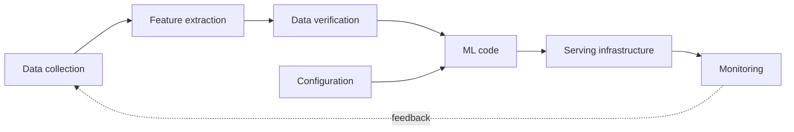
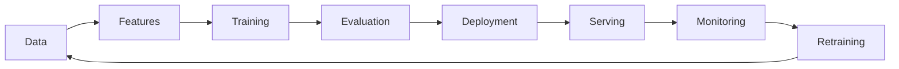
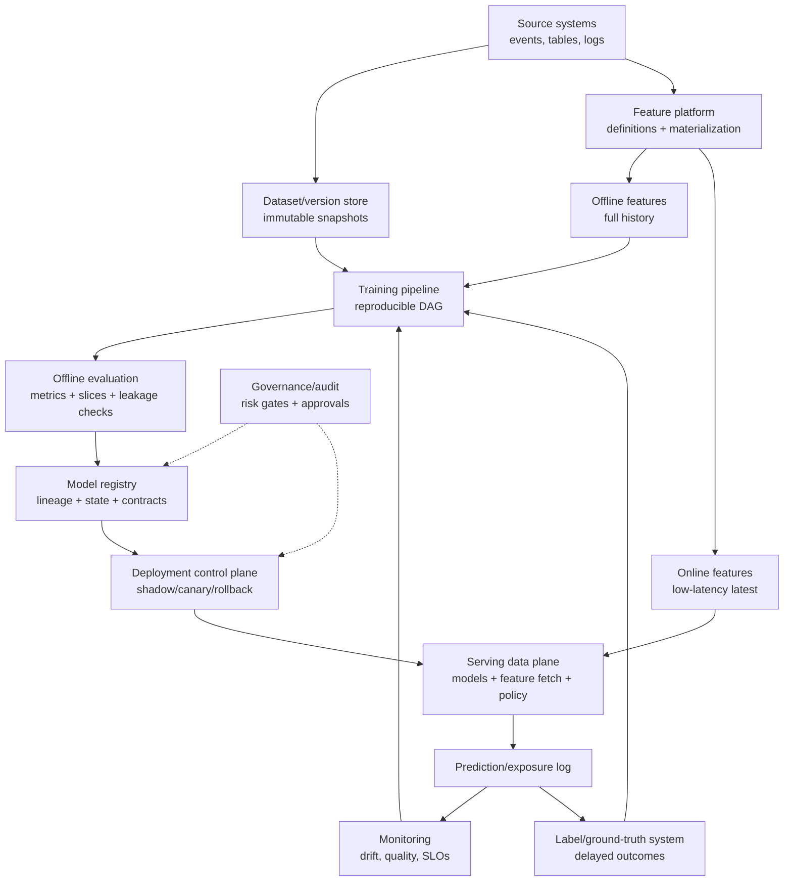

# ML System Fundamentals

## TL;DR

A machine learning system is unlike ordinary rule-driven software in one decisive way: a material part of its behavior is learned from *data*, not specified only by code and configuration. The model itself is a small box; most operational risk lives in the system around it — data collection, feature extraction, policy, serving infrastructure, monitoring, and the feedback loops that reshape future training data. This is the central thesis of Sculley et al.'s *Hidden Technical Debt in Machine Learning Systems* (2015), and it reframes the discipline: you are building a decision system whose empirical behavior is statistical, whose training objective is only a proxy for product intent, and whose dependencies change underneath it. Everything in this section — feature stores, dataset versioning, evaluation, serving, monitoring, training pipelines, label systems, registries, capacity planning, experimentation, and governance — exists to make that decision system controllable.

---

## An ML System Is Defined by Data, Not Just Code

In rule-driven software, behavior is determined by code, configuration, inputs, and state, but the decision rule itself is explicit. A function that returns `a + b` exposes its rule for inspection; engineers can test it against a written specification and reason locally about a change. The production system may still be nondeterministic or stateful, but its intended mapping is authored rather than inferred.

An ML system breaks every part of that contract. The behavior of a fraud classifier is not written in its code — the code is a generic training procedure that could just as easily produce a recommender or an image classifier. The behavior is *learned* from data, which means the dataset is the real specification, and that specification is implicit, enormous, and constantly shifting. Two teams can run identical code on different data and ship systems that behave nothing alike. The same team can run identical code on *the same source* a month later and ship a meaningfully different system, because the world the data describes has moved.

This is why Sculley's diagram is the foundational mental model for the entire field: the box labeled "ML code" is tiny, surrounded by far larger boxes for data collection, feature extraction, data verification, configuration, process management, analysis tooling, serving infrastructure, and monitoring. The engineering implication is blunt — if you budget your attention proportional to the code, you will spend ninety percent of your effort on the box that holds five percent of the risk.



The model is the smallest box in the picture. Treating it as the whole system is the original sin of production ML.

---

## Why ML Systems Are Harder to Operate

Four properties make ML systems structurally harder to operate than the services around them, and each one defeats a tool that traditional engineering relies on.

**Correctness is statistical, not deterministic.** A traditional service is either correct or it has a bug. An ML system is *correct on average* and wrong on some fraction of inputs by design — a 95%-accurate model is wrong one time in twenty, and that is the intended behavior, not a defect. This dissolves the binary notion of "working." You cannot ask "is the model right?"; you can only ask "is its error rate, on this slice, within tolerance right now?" — and the answer changes as the input distribution changes.

**There is no clean specification.** The spec for a sorting function is a sentence. The spec for "detect fraudulent transactions" is a moving, contested, partly-unknowable target encoded in millions of historical examples that were themselves labeled by imperfect processes. Because the spec lives in the data, you cannot review it, version it as prose, or reason about it the way you reason about an interface. When the data is wrong, the spec is wrong, and nothing in the code will tell you.

**Tests cannot fully capture behavior.** Unit tests pin down deterministic logic, but no finite test suite captures a model's behavior across an unbounded, drifting input space. You can test that the serving code loads an artifact and returns a number in range; you cannot unit-test that the model is *good*, because goodness is a statistical property of live data you have not seen yet. Validation in ML is therefore continuous and distributional — comparing live behavior to a baseline — rather than a gate you pass once at build time. (See [Model Monitoring](./04-model-monitoring.md).)

**Failure is silent.** When a traditional service breaks, it throws errors, latency spikes, dashboards turn red. When an ML system degrades, the service stays up, latency is fine, error rate is zero, and the predictions quietly get worse because the world changed. Silent degradation is the signature failure of ML systems, and it is invisible to every reliability tool built for deterministic software. The whole apparatus of model monitoring exists because uptime monitoring cannot see this class of failure at all.

The engineering takeaway is that the operational playbook from traditional services — tests, type checks, error budgets on uptime and latency — remains necessary but is no longer sufficient. It covers the box labeled "code" and is blind to the data that actually drives behavior.

---

## The Training/Serving Divide

Every ML system has two halves that must agree but rarely share an implementation. The *offline* half trains models over large historical datasets, optimizing for quality with hours of latency budget and no real-time constraints. The *online* half serves predictions under live traffic, optimizing for latency and reliability with milliseconds to spare. These halves are usually written by different people, in different languages, against different data stores, on different schedules.

The defining hazard of this divide is **training-serving skew**: the two paths compute the *same feature name* to mean *different things*. A feature like `avg_purchase_7d` is computed in offline batch from a warehouse table during training, and recomputed online from a streaming store during serving. If the windowing logic, the timezone handling, the null-filling, or the data freshness differs even slightly between the two implementations, the model is served inputs that do not match what it learned from. Offline evaluation looks excellent — it was computed with the training-side logic — and production quality silently drops, because the model is now answering a subtly different question than the one it was trained to answer.

The failure is easiest to believe when you see how innocent the two implementations look side by side:

```sql
-- Training side (warehouse SQL): event-time window, includes late-arriving events
SELECT user_id,
       AVG(amount) AS avg_purchase_7d
FROM purchases
WHERE event_time >= label_time - INTERVAL '7 days'
  AND event_time <  label_time
GROUP BY user_id;
```

```python
# Serving side (application code): arrival-time window via Redis sorted set + TTL
def avg_purchase_7d(user_id):
    now = time.time()
    redis.zremrangebyscore(f"purch:{user_id}", 0, now - 7*86400)
    amounts = redis.zrange(f"purch:{user_id}", 0, -1, withscores=False)
    return sum(map(float, amounts)) / max(len(amounts), 1)   # ← and this line
```

Both are reasonable code. They disagree in at least four ways: event time versus arrival time (a purchase synced from an offline device lands in one window but not the other), the SQL `AVG` over zero rows returns `NULL` while the Python returns `0.0`, the SQL window is anchored to the label's timestamp while Redis is anchored to *now*, and a Redis eviction silently shrinks the online window. Each discrepancy is a fraction of a percent of traffic; together they mean the model is systematically served a slightly different feature than the one it learned — and the gap concentrates in exactly the unusual users the model most needs to get right.

Skew is insidious because it produces no error and no alert. The feature has the right name, the right type, and a plausible value; it is simply the *wrong* value. The structural defenses are architectural rather than ad hoc: define each feature once and compute it from a single shared definition for both paths (the core promise of a [feature store](./02-feature-stores.md)), log the exact feature values served in production so they can be replayed and compared against an offline recomputation, and treat any divergence between served and recomputed values as a sev-worthy incident rather than a rounding curiosity. The training/serving boundary is the most important reliability boundary in an ML system, and most production quality mysteries trace back to it.

---

## The Data Dependency Problem

A model depends on upstream data it does not own and cannot control, and this is a category of dependency that traditional code-level dependency management never had to handle. A library dependency has a version number, a changelog, and a maintainer who follows semantic versioning; breaking changes announce themselves. A *data* dependency has none of this. An upstream team can change the meaning of a column, the unit of a field, the cardinality of an enum, or the population that a table covers — all without changing a single type signature, all without anyone telling you.

Sculley calls these *unstable data dependencies*, and they are more dangerous than unstable code dependencies precisely because they are invisible to the compiler. Consider a concrete, well-understood pattern: a finance team refactors a revenue table so that `total_spend` switches from gross to net. Every type check passes. Every null check passes. The job runs green. But every model trained after the change learns from systematically smaller numbers, and the model's behavior shifts in a direction no one chose. A silent *semantic* change upstream becomes a silent model *regression* downstream, and the gap between the two can be weeks, with no error connecting cause to effect.

A second, subtler hazard is the *underutilized* data dependency — a feature the model consumes but barely needs. It adds no real predictive value, yet it couples the model to an upstream source that can break, drift, or disappear. Every input is a liability as well as an asset, and a feature carrying its weight in risk but not in signal is pure downside.

The engineering implications follow directly. Data dependencies must be made explicit and versioned the way code dependencies are: a model should record exactly which feature versions it consumed, and a semantic change to a feature should be a *new feature name*, never an in-place edit (see [Training Pipelines](./05-training-pipelines.md) and [Feature Stores](./02-feature-stores.md)). Inputs must be validated against a baseline distribution before they reach training or serving, because distributional checks are the only mechanism that catches a type-compatible, semantically-broken change. And the relationship across the boundary must be a *contract* with an owner, so that a violation fails loudly at the seam instead of being silently absorbed into a worse model.

---

## Feedback Loops: The System Influences Its Own Future Data

Traditional software reads the world; ML systems frequently *change* the world they will later learn from, and this closes a loop that has no analog in deterministic software. A recommender changes what users see, which changes what they click, which becomes the training data for the next recommender. A fraud model blocks transactions it believes are fraudulent, which means the labels for "what those transactions would have done" never exist, biasing the next model's view of fraud. A search ranker concentrates traffic on items it already ranks highly, manufacturing the very engagement signal it then treats as evidence those items are good.

These feedback loops are the source of some of the most confusing pathologies in production ML. A *direct* loop is when a model's own outputs become its future inputs — the system slowly converges on a self-confirming worldview, mistaking the consequences of its past decisions for ground truth about the world. An *indirect* or *hidden* loop is worse: two models influence each other through the shared environment, so that improving one degrades the other through a channel that appears nowhere in either system's design. Sculley flags hidden feedback loops as one of the hardest forms of technical debt precisely because no component owns them and no test reveals them.

The engineering implication is that the data an ML system collects about itself is not a neutral observation of the world — it is contaminated by the system's own past behavior, and naively training on it amplifies whatever bias the previous model had. The defenses are structural: preserve a slice of *exploration* traffic that is not controlled by the current model, so the system keeps seeing outcomes it would not have chosen; log the candidates that were *not* shown, not only the ones that were, so counterfactual analysis is possible at all; and separate observational metrics, which the model can game through the loop, from causal experiments on held-out traffic that the current model does not control (see [Online Experiments](./08-online-experiments.md)). Without an exploration path, an ML system gradually becomes a machine for confirming its own past opinions.

---

## The ML Lifecycle Is a System of Handoffs

It is tempting to draw the ML lifecycle as a linear pipeline — data, features, training, evaluation, deployment, serving, monitoring, retraining — and treat it as a sequence of steps. The more useful framing is that each *arrow* between those stages is a reliability boundary with an ownership contract, and the system fails at the arrows far more often than at the boxes.



Each handoff is owned by a different team and guarantees a different contract. The data platform owes fresh, deduplicated, schema-versioned data to the feature layer. The feature owner owes point-in-time-correct values to training. Training owes a reproducible artifact and honest metrics to evaluation. Evaluation owes a promotion decision against guardrails to deployment. Serving owes runtime compatibility and the feature parity that prevents skew. Monitoring owes early detection of degradation back to the retraining trigger. When any one of these contracts is informal — a handshake instead of a validated interface — the lifecycle decays at exactly that seam, and because the seam spans an org boundary, it becomes nobody's responsibility until an incident forces an owner to claim it.

The lifecycle is also a *loop*, not a line: the last arrow feeds back into the first. Monitoring drives retraining, retraining produces new data dependencies, and the system circles continuously rather than terminating at "deployed." This is why an ML system is never "done" the way a feature ship is done — it has to be operated indefinitely, and the cost of that operation, not the cost of the initial model, dominates the system's total cost of ownership.

---

## Reference Architecture: The ML Platform as a Control System

A mature ML platform is best understood as a control system wrapped around a decision function. The model scores requests, but the platform controls *which* model scores them, *which* features it may read, *which* labels later judge it, *which* metrics can promote it, *which* rollout path exposes it, and *which* rollback path stops it.



The diagram is deliberately not model-centric. The model is one artifact in a larger loop. Distinguished engineering work lives in the edges: whether the dataset snapshot is immutable, whether the online feature is the same semantic feature as the offline one, whether the label joins to the exact prediction, whether the registry can name the rollback target, whether monitoring can distinguish a data incident from a concept-drift incident, and whether the deployment system can stop harm before labels mature.

---

## Control Plane vs Data Plane

ML systems fail when control-plane decisions leak into ad hoc scripts or data-plane code. The split should be explicit.

| Plane | Owns | Correctness requirement | Failure if weak |
|---|---|---|---|
| Data plane | feature reads, model inference, prediction logging, online policy execution | low latency, bounded queues, graceful degradation | user-facing latency/outage or silent wrong decisions |
| Training data plane | batch extraction, feature computation, training jobs, evaluation jobs | reproducible execution, idempotent outputs, efficient I/O | expensive failed jobs, unreproducible artifacts |
| Control plane | model registry, deployment pointers, traffic splits, promotion gates, approvals | strong metadata consistency, auditability, atomic state transitions | wrong model active, unapproved rollout, impossible rollback |
| Observability plane | drift jobs, label joins, slice metrics, alert routing | versioned baselines, delayed-label semantics, actionability | dashboards that are green while quality burns |
| Governance plane | risk tiers, policy-as-code, audit logs, access control | enforceability, separation of duties, retention | governance theater; controls exist but block nothing |

The control plane should decide *what is allowed*; the data plane should execute it quickly. If business logic says `if model_version == v42 then use threshold 0.91` inside an application service, the control plane has leaked into the data plane. That makes rollout, audit, and rollback harder because the decision is now hidden in code rather than represented as registry state.

The strongest platforms make critical state transitions atomic and auditable:

```text
register artifact → attach lineage → attach evaluation → approve → shadow → canary → production
                                      ↑ every arrow is a gate, not a convention
```

A model should not become production by uploading a file. It becomes production when the control plane validates lineage, serving contract, metrics, approvals, rollback target, and traffic policy, then atomically moves the active pointer.

---

## Load-Bearing Invariants

The easiest way to review an ML architecture is to ask which invariants it enforces mechanically. These are the invariants that matter most:

| Invariant | Why it matters | Enforced by |
|---|---|---|
| Every model has complete provenance | rollback, audit, debugging | training pipeline + registry |
| Every training row is point-in-time correct | prevents future leakage | feature store + dataset builder |
| Every label has a definition, maturity state, and source | prevents target drift and premature negatives | label system |
| Every feature semantic change creates a new version | prevents silent train/serve mismatch | feature registry |
| Every prediction logs model, feature, policy, and experiment versions | enables monitoring, labels, audit, experiments | serving gateway |
| Every promotion has an evaluation report and rollback target | prevents unreviewed irreversible releases | model registry + deployment gate |
| Every high-risk decision is reconstructable | governance and contestability | audit log + lineage graph |
| Every automated loop has a kill switch | prevents bad data from self-deploying | deployment control plane |

If an invariant is documented but not enforced, it is not an invariant; it is an aspiration. A distinguished-engineer review should identify which of these are guaranteed by infrastructure and which depend on humans remembering a process under deadline pressure.

The single most load-bearing row in that table is the prediction log, because four other systems (monitoring, labels, experiments, audit) are built on top of it. It deserves a concrete schema rather than a bullet point:

```sql
CREATE TABLE prediction_log (
    prediction_id     UUID NOT NULL,           -- stable logical join anchor for labels
    request_id        UUID NOT NULL,
    entity_id         TEXT NOT NULL,
    surface           TEXT NOT NULL,           -- which product decision consumed this
    predicted_at      TIMESTAMPTZ NOT NULL,
    model_name        TEXT NOT NULL,
    model_version     TEXT NOT NULL,           -- silent-wrong-model detection depends on this
    feature_versions  JSONB NOT NULL,          -- {"user_stats": "v4", "txn_velocity": "v7"}
    served_features_ref TEXT NOT NULL,         -- immutable values/blob under retention policy
    features_hash     TEXT NOT NULL,           -- integrity check; not reconstructive evidence
    score             DOUBLE PRECISION NOT NULL,
    threshold_policy  TEXT NOT NULL,           -- score→action mapping is versioned policy
    action_taken      TEXT NOT NULL,           -- what actually happened, post-guardrails
    experiment_bucket TEXT,
    selection_policy  TEXT NOT NULL,           -- versioned logging/action policy
    eligible_actions_ref TEXT NOT NULL,         -- immutable support/candidate-set evidence
    action_propensity DOUBLE PRECISION NOT NULL
        CHECK (action_propensity > 0 AND action_propensity <= 1),
    PRIMARY KEY (prediction_id, predicted_at)   -- partition key participates in uniqueness
) PARTITION BY RANGE (predicted_at);
```

The physical primary key includes `predicted_at` because PostgreSQL cannot enforce a unique constraint on a range-partitioned table unless it includes the partition key. The logical contract still requires `prediction_id` to be globally unique; enforce that at ID issuance or in a non-partitioned decision directory if labels resolve by ID alone. `served_features_ref` resolves to the actual vector consumed by the model (inline, or in an immutable encrypted object governed by classification and retention), while `features_hash` only verifies identity; a hash cannot reconstruct values. Counterfactual analysis needs both the eligible action support and the probability with which the logging policy selected the observed action. An `explored` boolean supplies neither, so it cannot support propensity weighting or prove that an alternative action had nonzero probability. [Online Experiments](./08-online-experiments.md) owns the estimands and assignment design; [Label and Ground-Truth Systems](./10-label-ground-truth-systems.md) owns the later outcome join.

---

## Maturity Model

ML maturity is not measured by model sophistication. It is measured by how safely the organization can change the model under uncertainty.

| Level | Operating mode | What exists | Characteristic risk |
|---|---|---|---|
| 0. Notebook | manual artifact handoff | notebook, exported file | cannot reproduce or rollback |
| 1. Scripted | repeatable training command | source control, basic job runner | data and environment still mutable |
| 2. Reproducible | versioned training pipeline | dataset snapshots, lineage, registry | weak monitoring and rollout safety |
| 3. Operated | production ML service | serving SLOs, drift monitoring, canary, rollback | delayed labels hide quality regressions |
| 4. Governed | risk-tiered decision system | audit logs, approvals, policy gates, human override | controls may lag new use cases |
| 5. Adaptive | safe continuous improvement loop | automated retraining, experiments, fast rollback, mature labels | automation can amplify bad signals if gates weaken |

Most teams should not rush to level 5. Continuous retraining before operated monitoring, promotion gates, and rollback is not maturity; it is an incident accelerator. The mature path is to earn automation by proving the safety mechanisms around it.

---

## The Release Unit Is a Decision System

A model artifact is too small a unit to deploy safely. The behavior users experience is the composition of several independently changing functions:

```text
features        x = F(raw events, entity state, decision time)
score           s = M_model(x)
action          a = P_policy(s, eligibility, limits, experiment assignment)
observed label  y~ = L(outcome, observation process, maturity window)
```

Changing `F`, `M`, or `P` changes the decision even if the other two remain byte-identical. Changing `L` changes the apparent quality without changing a single production decision. The deployable release unit must therefore identify the model artifact, preprocessing and feature contracts, score calibration, threshold or ranking policy, runtime, fallback, and observation schema together. This chapter establishes that behavioral boundary; [Model Registry and ML Metadata](./13-model-registry-metadata.md) owns its manifest and lifecycle state, while [Model Deployment and Rollouts](./06-model-deployment-rollouts.md) owns atomic activation, retained rollback bundles, and traffic exposure.

This boundary also prevents a common category error: optimizing a predictive metric when the system is accountable for an action. Suppose action `a` has consequence-dependent loss `C(a, y)`. The relevant objective is expected decision loss,

```text
R(P, M) = E[C(P(M(X)), Y)]
```

not AUC, log loss, or accuracy in isolation. A model with better ranking quality can create a worse system when its threshold overwhelms a review queue, when false positives carry asymmetric harm, or when a policy change applies its scores outside the population on which they were calibrated. [Offline Evaluation and Metric Design](./12-offline-evaluation-metrics.md) develops metric selection; [Online Experiments](./08-online-experiments.md) handles causal product impact. The foundational point is that ownership must extend through the score-to-action mapping.

The observation process is part of the boundary too. A recommender observes outcomes only for exposed items; a fraud system gets mature labels mainly for transactions it allowed or reviewed. Consequently `y~` is not automatically a representative sample of `Y`. The release manifest must identify the exposure policy and experiment assignment, and the prediction log must retain them. Otherwise retraining silently treats the previous policy's selective observations as neutral ground truth and closes a biased feedback loop.

---

## CACE: Changing Anything Changes Everything

The single most counterintuitive property of learned systems is entanglement, which Sculley captures in the deliberately provocative CACE principle: **Changing Anything Changes Everything.** It is not a claim that every change always moves every prediction. It is a warning that statistical dependencies defeat the isolation promised by a software interface: retraining after changing one feature can alter the learned use of other, correlated features, and the affected slices cannot be inferred from the changed line of code alone.

The practical consequence is that source-code locality does not imply behavioral locality after retraining. Adding an input can change how the learner allocates weight among correlated features; dropping a weak aggregate feature can still degrade a thin slice. The effect may in fact be negligible, but inspection cannot prove that. Every changed release therefore needs whole-model and slice comparison against its baseline, with uncertainty, because the potential blast radius crosses the model boundary.

CACE is also why training-serving skew, data dependencies, and feedback loops are dangerous in combination: a small perturbation can propagate through correlated inputs and policy thresholds. Software modularity still matters around the model — contracts constrain the source of a change and its blast radius — but it cannot prove the empirical effect of retraining. That effect has to be measured on the whole release and on its important slices. This is the engineering rationale for treating reproducibility, lineage, evaluation, and monitoring as first-class concerns rather than hygiene.

---

## Why Reproducibility, Lineage, and Monitoring Are First-Class

Because behavior lives in data, because failure is silent, and because everything is entangled, three properties that are optional conveniences in traditional software become load-bearing reliability features in ML systems.

**Reproducibility** is the ability to reconstruct a declared-equivalent model from recorded metadata — code commit, data snapshot, feature versions, parameters, and environment digest. It supports audit, comparison, and disaster recovery, but it is not the live rollback mechanism: rollback restores a retained, already-qualified release bundle and must not wait for training. Without reproducibility, a team cannot audit a decision or isolate why a retrain changed; without retention, it cannot roll back promptly. ([Training Pipelines](./05-training-pipelines.md) separates these guarantees.)

**Lineage** is the queryable record of what produced what — which dataset and code produced which model, and conversely, which models depend on a given dataset. It answers the question that arrives during every data incident: a source table double-counted events for a week, so *which production models trained on that window and must be retrained?* Without forward lineage the only honest answer is "we don't know, retrain everything," which is both expensive and an admission that the system is not auditable.

**Monitoring** in ML is not uptime and latency — those are necessary but blind to the failure that matters. ML monitoring watches the *data and the predictions*: input distribution drift, prediction distribution shift, feature freshness, and, where labels eventually arrive, realized quality against a baseline. It exists because silent degradation produces no error to alert on, so the only way to detect it is to measure the statistical behavior of the system continuously and compare it to what "healthy" looked like (see [Model Monitoring](./04-model-monitoring.md)). The realized-quality layer depends on trustworthy labels, which are themselves a production system with delay, bias, and correction semantics (see [Label and Ground-Truth Systems](./10-label-ground-truth-systems.md)).

These three are not separate hygiene tasks. They are the minimum machinery required to operate a system whose behavior is defined by changing data — reproducibility to reconstruct and compare, lineage to trace, monitoring to detect. Live rollback additionally requires retention of the previously qualified deployable bundle.

---

## How the Real Platforms Are Built

The reference architecture above is not speculative; it is the shape that several independently-built platforms converged on, and the convergence is the evidence.

**Uber's Michelangelo** (2017) is the most completely described end-to-end platform: a shared feature store (Palette) with dual offline/online paths, managed training over Spark/MLlib and deep-learning backends, a model registry holding lineage and evaluation reports, and one-click deployment to containers with traffic splitting. Michelangelo's stated origin story is the pre-platform pathology this chapter describes — every team hand-rolling its own pipelines, nothing reproducible, months from prototype to production — and its core bet was that the *lifecycle* (not the models) was the reusable asset.

**Google's TFX** (2017 paper; open-sourced components) decomposes the lifecycle into typed components — ExampleGen, StatisticsGen, SchemaGen, ExampleValidator, Transform, Trainer, Evaluator, Pusher — connected by a metadata store (MLMD) that records every artifact and execution. Two TFX design choices became industry defaults: *data validation as a pipeline stage with a schema* (the Breck et al. work in the references), and *Transform's guarantee* that the exact preprocessing graph used in training is exported inside the serving artifact — skew eliminated by construction for the preprocessing layer.

**Meta's FBLearner Flow** (2016) emphasized workflow reuse and experiment scale; **Netflix's Metaflow** emphasized a human-facing programming model with versioning and resume machinery behind ordinary Python. Other organizations published different decompositions. The useful convergence is not a mandatory product stack but a set of durable boundaries: immutable data and artifact identity, execution metadata, feature/preprocessing parity, promotion state, monitored serving, and a label path back to the decision. Some platforms combine them; others integrate independent systems. A design should be judged by whether those boundaries have one owner and an enforceable contract, not by whether it has boxes named "feature store" and "model registry."

---

## Failure Modes

The characteristic failures of ML systems recur across organizations, and naming them is half of preventing them. They share a family resemblance: each is invisible to the tools built for deterministic software.

**Training/serving skew** is the same feature contract producing different as-trained and as-served values. The foundational mechanism is described above; [Feature Stores](./02-feature-stores.md) owns temporal materialization semantics and [Model Monitoring](./04-model-monitoring.md) owns sampled parity measurement and incident attribution.

**Silent data-dependency regression** is a semantic change to an upstream source — a unit, a definition, a covered population — that passes every type and null check while quietly corrupting every model downstream of it. The defense is distributional validation against a baseline before data reaches training, and explicit versioned data contracts with an owner who is paged when the contract breaks.

**Silent model degradation** is the slow drift of the world away from the model's training distribution: the service stays up, errors stay at zero, and predictions get worse with no signal in any uptime dashboard. The defense is monitoring input and prediction distributions, tracking delayed labels when they arrive, and keeping a rollback path ready.

**Feedback-loop contamination** is the system learning from data its own past decisions shaped, slowly converging on a self-confirming worldview. The defense is preserving exploration traffic, logging unshown candidates, and validating on causal experiments rather than observational metrics the loop can game.

**Proxy objective mismatch** is optimizing a metric that is easy to label but not the outcome the system needs — click-through that rewards clickbait, fraud recall that blocks legitimate users, watch time that erodes long-term satisfaction. The defense is a metric hierarchy with explicit guardrails, review of the worst false positives and negatives rather than only aggregates, and keeping contested product policy *outside* the model where it can be reviewed.

**Entanglement surprise** is the CACE failure: a "small" change — one added feature, one dropped input — shifts behavior on an unrelated slice because the model had been silently using that input to compensate elsewhere. The defense is to never trust local reasoning about a model change and always measure the whole model against a baseline.

**Release-tuple mismatch** occurs when individually valid model, feature, calibration, policy, runtime, or fallback versions are combined into a decision system that was never evaluated as a unit. The registry and rollout protocols that prevent this are owned by [Model Registry and ML Metadata](./13-model-registry-metadata.md) and [Model Deployment and Rollouts](./06-model-deployment-rollouts.md).

**Observation-policy bias** occurs when the system treats labels generated under its previous action policy as an unbiased view of the world. Blocked, unshown, or unreviewed cases have missing counterfactual outcomes, so retraining confirms the old policy. The defense is exposure and propensity metadata, preserved exploration where safe, and an explicit label-population contract.

---

## Decision Framework

The most consequential ML system decision is whether to build one at all. ML introduces every cost in this document — data dependencies, skew, silent failure, feedback loops, entanglement, and a permanent operational burden — and many prediction-shaped problems are better solved by deterministic logic. Make the choice at the *decision* boundary, not at the model boundary.

First establish a non-ML baseline: a rule, lookup, popularity prior, or simple statistical score. If its expected decision loss and operating cost satisfy the product constraint, stop. Deterministic logic is inspectable and stable; ML must earn its lifecycle cost with a material improvement, not merely with a more sophisticated implementation.

Then test identifiability: does representative training data contain signal available at decision time, and will an observation process continue to produce sufficiently unbiased, mature labels? If the useful signal exists only after the action, or labels exist only for cases selected by the current policy, a larger model does not repair the design. Redesign data collection or preserve randomized exploration first.

Next bound error consequences. Estimate `E[C(a,Y)]` under plausible false-positive, false-negative, and abstention rates; include queue capacity when humans review uncertain cases. Irreversible or high-consequence actions need deterministic eligibility constraints, an abstain path, human review, or a transactional limit that caps exposure. "The model is 95% accurate" says nothing about whether the remaining 5% is survivable.

Finally compare adaptation time with harm time. Let `T_truth` be label delay, `T_detect` proxy-detection delay, and `T_mitigate` rollback or containment time. If plausible harm becomes unacceptable before `T_detect + T_mitigate`, the system needs a smaller actuation limit or a faster independent guardrail; monitoring alone cannot make it safe. Assign owners for the data, model, policy, labels, serving path, and retirement before launch. A team that can train but cannot staff these boundaries has not funded the system it proposes.

The strongest architectures are usually *hybrids*: deterministic rules define the hard safety boundaries and the non-negotiable policy, and ML ranks or scores *inside* those boundaries where its statistical strengths pay off and its failures are bounded. The anti-pattern to avoid is using ML to paper over an undefined product policy — when the action, the fallback, and the acceptable failure mode have not been decided, no model can decide them for you.

---

## Key Takeaways

1. An ML system's behavior is defined by data, not just code; the model is the smallest box, and almost all operational risk lives in the system around it.
2. ML correctness is statistical, has no clean specification, cannot be fully unit-tested, and fails silently — so traditional reliability tooling is necessary but not sufficient.
3. The training/serving divide is the most important reliability boundary; skew between the two paths is the defining hazard and the most common source of quality mysteries.
4. Data dependencies are unstable and invisible to the compiler; a silent semantic change upstream becomes a silent model regression downstream.
5. ML systems influence the data they later train on, so feedback loops can make a system converge on a self-confirming worldview unless exploration is preserved.
6. The lifecycle is a loop of handoffs, and each arrow is a reliability boundary with an ownership contract that fails loudly or decays quietly.
7. CACE — Changing Anything Changes Everything — means there are no local changes to a model; the blast radius of any change is the whole model, so changes must be measured, not reasoned about.
8. Reproducibility, lineage, and monitoring are first-class reliability features, not hygiene: recover, trace, detect.
9. Use ML only when rules cannot express the decision, enough fresh data exists, errors are tolerable or reviewable, and the org can own the lifecycle; otherwise prefer deterministic logic, and prefer hybrids that bound ML inside rules.
10. The release unit is the decision system — feature/preprocessing contract, model, calibration, policy, fallback, and observation schema — because expected decision loss, not a model metric alone, is the product outcome.

---

## References

1. [Hidden Technical Debt in Machine Learning Systems](https://proceedings.neurips.cc/paper_files/paper/2015/file/86df7dcfd896fcaf2674f757a2463eba-Paper.pdf) — Sculley et al., 2015
2. [Rules of Machine Learning: Best Practices for ML Engineering](https://developers.google.com/machine-learning/guides/rules-of-ml) — Zinkevich
3. [TFX: A TensorFlow-Based Production-Scale Machine Learning Platform](https://dl.acm.org/doi/10.1145/3097983.3098021) — Baylor et al., 2017
4. [Data Validation for Machine Learning](https://mlsys.org/Conferences/2019/doc/2019/167.pdf) — Breck et al., 2019
5. [Machine Learning: The High-Interest Credit Card of Technical Debt](https://research.google/pubs/pub43146/) — Sculley et al., 2014
