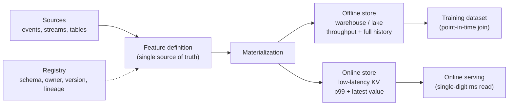
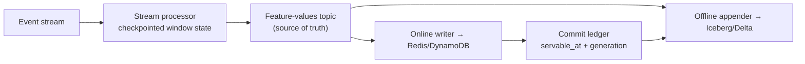

# Feature Stores

## TL;DR

A feature store is not merely a database for machine-learning columns; it is a *temporal consistency system* that maintains two physical projections of one logical feature contract. An offline store optimizes throughput and history so training can reconstruct past decisions; an online store optimizes bounded tail latency so serving can read current values. The feature store cannot magically guarantee byte-identical values across engines. Its job is to define what equivalence means — semantics, event-time cutoff, servable-time cutoff, defaults, correction policy, and tolerated numeric error — then make divergence measurable and recoverable. Point-in-time joins, materialization, freshness SLOs, versioning, and the registry all protect that contract.

---

## The Problem a Feature Store Solves: Training/Serving Skew

[ML System Fundamentals](./01-ml-system-fundamentals.md) defines training/serving skew and why it silently degrades a model. This chapter owns the feature-platform mechanism that constrains it: one logical feature contract is materialized into an offline historical projection and an online low-latency projection. Those projections need not be byte-identical, but they must agree on event-time semantics, servability, defaults, correction history, and numeric tolerance. The feature store makes that agreement explicit, versioned, and measurable; [Model Monitoring](./04-model-monitoring.md) owns the sampled parity audit after serving.

---

## Two Materialized Projections, One Logical Contract

The defining structural fact about a feature store is that it is a *dual-store* system, and the two stores cannot be the same engine because they are optimized for contradictory access patterns.

The **offline store** lives in a warehouse or lake — BigQuery, Snowflake, Redshift, or Parquet/Delta on object storage queried by Spark. It is optimized for *throughput and completeness*: it must hold the full history of every feature value so that a training job can reconstruct what any feature looked like at any past moment, and it must support large columnar scans and joins over billions of rows. Latency is irrelevant here; a training read that takes ten minutes is fine. Cost-per-byte and scan throughput dominate.

The **online store** is a low-latency key-value system — Redis, DynamoDB, Cassandra, or an embedded store like RocksDB — keyed by the entity being scored. It is optimized for *p99 latency*: a serving request that needs twenty features for a `user_id` must fetch them in single-digit milliseconds, because the feature lookup sits on the critical path of a prediction that itself has a tight latency budget. It typically stores only the *latest* value per entity, not history, because serving only ever asks "what is this feature right now?"

These stores do not present a CAP choice: the trade-off exists even without a network partition. They are independently updated projections with different layouts and completion times, so the fundamental problem is asynchronous materialized-view consistency. The online projection can be stale or missing while the offline projection is complete; a replay can repair one before the other; and numeric engines can differ at rounding boundaries even when they consume identical events.

The source of truth should therefore be explicit. For streaming features it is usually an immutable log of computed feature updates; for batch features it may be a versioned table snapshot plus the transformation version. The online store is a read-optimized materialized view, not an unquestioned authority. Every update needs an identity such as `(feature_version, entity_key, logical_window, materialization_generation)` so writers can be idempotent and reconciliation can ask whether both projections incorporated the same update. Availability and correctness remain separate: the store may answer quickly with an old generation, so a successful read is not proof that the feature contract was met.



---

## Online Store Internals: How Feature Values Actually Sit in the KV Store

The online store returns the latest valid features for an entity under a bounded latency budget. Its physical layout determines whether a 20-feature read is one round trip or twenty, and therefore whether feature retrieval fits that budget.

**Redis layout (Feast 0.40 style).** Feast stores one Redis hash per `(project, entity_key)` pair. The hash key is a serialized entity key; each hash field is a murmur3 hash of `(feature_view, feature_name)` and the value is a protobuf-serialized `ValueProto` plus a per-feature-view event timestamp field:

```text
Key:   <project>:<serialized entity key>            (one key per entity)
Field: mmh3("user_stats:failed_login_count_10m")  → ValueProto(int64: 3)
Field: mmh3("user_stats:avg_txn_amount_7d")       → ValueProto(double: 41.20)
Field: "_ts:user_stats"                            → Timestamp(2026-06-30T09:14:03Z)
```

The consequence of this layout: fetching *all* features for one entity is a single `HGETALL` or pipelined `HMGET` — one round trip. Fetching one feature for *many* entities (a batch-scoring path) fans out to N keys, which is why online stores are laid out entity-major, not feature-major: the serving access pattern is "all features for this request's entity," and the layout must match it. This is the same access-path reasoning as any [key-value schema design](../02-distributed-databases/05-partitioning-strategies.md): the physical layout is chosen by the dominant read, and the training-side pattern (feature-major, full history) gets a completely different store.

**DynamoDB layout.** One table per feature view; partition key is the serialized entity key, and the item holds all features of that view as attributes plus an `event_ts`. A 20-feature read across 4 feature views becomes a 4-item `BatchGetItem` — again bounded round trips, paid for with the constraint that a feature view's features live and die together.

**Capacity math must include replication and write amplification.** Suppose 50M active entities, 120 features across 6 feature views, average serialized feature value 12 bytes, feature names hashed to 4-byte fields:

```text
Per entity:   120 × (4 + 12) B values + 6 × ~20 B timestamps + key/index overhead ≈ 2.2 KB
Logical data: 50M × 2.2 KB ≈ 110 GB
Provisioned:  110 GB × replication_factor × allocator/index headroom
              at RF=2 and 35% headroom: 110 × 2 / 0.65 ≈ 338 GB

Read load:    2,000 predictions/s × 1 HGETALL = 2,000 read ops/s
Write load:   if each of 6 entity/view pairs updates ~10×/day:
              50M × 6 × 10 / 86,400 ≈ 34,700 write ops/s sustained
```

The example assumes ten updates *per entity-view pair*, not ten total entity updates; omitting the six-view factor would understate writes by six. Whether either rate is easy for a particular engine cannot be inferred from its product category. Measure it on a loaded representative shard because allocator fragmentation, object metadata, replicas, and rebalancing headroom dominate small values. Serving reads scale with prediction traffic and the number of entity/view keys per prediction, while materialization writes scale with changed entity-view pairs; a backfill can compress months of logical time into hours of wall time. Backfill traffic therefore needs a separate quota and lower priority than live updates. Capacity must also survive one shard unavailable and one shard moving during rebalance, not merely fit in the steady-state cluster.

**Validity is a correctness property; a storage TTL is only one mechanism.** An entity that stops generating events keeps its last materialized value until it expires. For a feature like `failed_login_count_10m`, a value computed for a window ending at 09:00 is not necessarily valid until "write time plus ten minutes": a delayed replay written at 09:30 would incorrectly live until 09:40. Each value should carry a semantic `valid_until` derived from its window and event-time policy, and the serving layer should reject it after that instant. A physical TTL may reclaim storage, but it should be derived from `valid_until`, not define it. Expiry behavior — explicit zero, declared default, feature-light fallback, or refusal to score — is part of the versioned feature contract and must match the offline join.

---

## Streaming Materialization Internals: Idempotency, Windows, and Late Events

Streaming materialization is where most feature-store incidents originate, because it imports every hard problem of [stream processing](../13-data-pipelines/02-stream-processing.md) into the feature path. The three that matter are duplicates, out-of-order events, and replays.

A naive implementation increments a counter per event:

```python
# WRONG: not idempotent. A consumer rebalance or replay double-counts.
def on_event(event):
    redis.hincrby(entity_key(event.user_id), "failed_login_count_10m", 1)
```

Kafka's default delivery guarantee is at-least-once: after a consumer crash, the last uncommitted batch is redelivered, and every `HINCRBY` in it fires twice. The counter drifts upward forever, and nothing detects it because the value is plausible. The structural fix is to make the write an *idempotent upsert of a computed aggregate* rather than an increment of stored state — the stream processor owns the aggregation in its own checkpointed state, and the online store only ever receives "the value of this window is 3":

```python
# Flink-style (1.18) keyed sliding-window aggregation, event-time semantics.
updates = (
    events
    .assign_timestamps_and_watermarks(
        WatermarkStrategy
        .for_bounded_out_of_orderness(Duration.of_seconds(30))
        .with_timestamp_assigner(lambda e, _: e.event_time_ms)
    )
    .key_by(lambda e: e.user_id)
    .window(SlidingEventTimeWindows.of(Time.minutes(10), Time.seconds(30)))
    .aggregate(CountFailedLogins())
)
updates.sink_to(feature_update_log)  # durable record projected to both stores
```

Each record carries `(feature_version, entity, logical_window, generation, value)`. The online projection performs a conditional upsert: replace the current value only when the incoming `(logical_window, generation)` is at least as new as the stored one. A blind last-write-wins update is insufficient because an old replay can arrive after a live update and move the feature backward in logical time. With an immutable update identity and a monotonic compare-and-set, duplicates become harmless and out-of-order writers converge. This recovers [idempotency](../01-foundations/08-idempotency.md) by keeping aggregation state in the checkpointed processor and making store updates projections of durable records.

**Watermarks decide the correctness/freshness trade.** The 30-second bounded-out-of-orderness above means every window closes 30 seconds later than it could — freshness paid for tolerance of late events. Set it to zero and mobile clients on bad networks silently drop out of your counts; set it to ten minutes and your "real-time" feature is ten minutes stale. The right number comes from measuring the actual event-time-vs-arrival-time skew distribution of the source, not from a default.

**The dual-write trap.** Materialization must land the same logical update in the online store *and* the offline history. Writing both from the processor is a classic dual-write: if one succeeds and the other fails, training and serving diverge. The robust pattern is log-first: the processor emits computed feature updates to a durable topic; one consumer conditionally upserts the online store, another appends to the offline table, and both are independently replayable. Reconciliation compares the highest committed generation in each projection with the log, so repair is deterministic rather than a best-effort backfill.



The offline appender's write time is **not** the feature's availability time. It proves only that the history row landed offline. If the online write completes later, using the offline timestamp gives training information production could not yet read. Exact reconstruction requires an acknowledgement or commit ledger from the online writer recording `(update_id, servable_at, generation)`, later joined into offline history. When that cost is unjustified, the system must state its approximation — for example a conservative availability watermark — and validate it against sampled feature vectors logged at serving time.

---

## Point-in-Time Correctness: The Defining Correctness Property

If consistency between the two stores is the central engineering challenge, *point-in-time correctness* is the central correctness property — the one whose violation silently destroys a model while every offline metric looks excellent. It is the same leakage concern that governs [training pipelines](./05-training-pipelines.md), surfaced here as a join problem.

The rule is simple to state and easy to violate: a training row labeled at time *T* must see only feature values that were *knowable at T*. A training set is built by joining a table of labeled events (each with an entity and a timestamp) against the history of feature values. The naive implementation joins each entity to its *current* or *latest* feature value — and that join *leaks the future*. Consider a fraud label generated for a transaction at 10:05. The feature "account risk score" was recomputed at 10:40 after the fraud was discovered and the account flagged. A latest-value join hands the model the 10:40 value as if it were available at 10:05. The model learns to read the answer off a feature that, in production, will not yet contain it. Offline AUC soars; production performance collapses.

A correct point-in-time join is an *as-of* join: for each example whose decision happened at time *T*, take the newest feature version that both satisfies the feature's semantic cutoff and was servable by *T*. Getting this right depends on distinguishing four timestamps that are easy to conflate:

- **Event time** — when the fact actually happened in the world (the login occurred at 10:00).
- **Ingestion time** — when the system received and recorded the event (the log landed at 10:03).
- **Computation time** — when a materialization run produced this version (the window closed at 10:08).
- **Servable time** — when that version became readable from the online path (the conditional write committed at 10:10).

Servable time enforces system knowledge: an event that happened at 10:00 but was not readable online until 10:10 cannot be used for a 10:05 decision. Event-time boundaries enforce feature semantics: a "trailing 10 minutes before the transaction" feature must also exclude events at or after the decision even if a backfill computed them earlier in wall-clock time. An honest join therefore needs bitemporal history — valid time describing the world and system time describing what each materialized generation was able to expose. Corrections append a new generation; they do not overwrite the as-served past. That permits two legitimate queries: *as served*, for reproducing a decision, and *as corrected*, for training a future model after a data repair.

Mechanically, point-in-time retrieval is a nearest-preceding-version query:

```sql
-- For each training example, find the latest feature value available at decision time.
SELECT e.example_id,
       e.entity_id,
       e.decision_time,
       f.value AS account_risk
FROM training_examples e
LEFT JOIN LATERAL (
  SELECT value
  FROM feature_history f
  WHERE f.entity_id = e.entity_id
    AND f.feature_name = 'account_risk'
    AND f.window_end <= e.decision_time
    AND f.servable_at <= e.decision_time
  ORDER BY f.window_end DESC, f.generation DESC
  LIMIT 1
) f ON true;
```

At scale this is not executed as one nested lookup per row; the implementation can be a sorted merge over entity and temporal version columns:

```text
training examples:  (entity_id, decision_time) sorted ascending
feature history:    (entity_id, servable_at, window_end, generation) sorted

for each entity:
  advance versions while servable_at <= decision_time
  among semantically valid versions, emit the newest committed generation
```

That merge is why feature-history layout matters. Partition by date alone and every entity lookup scans too much. Partition by entity hash alone and time-window backfills become expensive. A common compromise is date partitioning for batch pruning, clustered or sorted by entity and servable time within each partition. Engines differ, so the design must be validated on the actual join shape rather than inferred from a generic partitioning rule.

---

## Materialization: Getting Features From Definition to the Online Store

Materialization is the process that turns a feature definition into actual values sitting in the online store, ready to serve. It is where the freshness-versus-cost trade-off is made concrete, and the choice of materialization pattern is the most consequential design decision in a feature store.

**Batch (precompute) materialization** runs a scheduled job that computes feature values over a window and writes the latest result to the online store. It is cheap and simple, reuses the offline pipeline, and is correct for features that tolerate hours of staleness — a user's 30-day average order value does not change minute to minute. Its failure mode is bounded by its cadence: if the job runs hourly, the online value is up to an hour stale, and if the job is late or fails, the online store silently serves yesterday's value.

**Streaming materialization** consumes an event stream (often a [change-data-capture](../13-data-pipelines/04-change-data-capture.md) feed off the source tables, or a Kafka topic of domain events) and updates online values within seconds. It is the answer for features that must be fresh — failed-login counts, current session activity, real-time velocity features. The cost is operational complexity: streaming aggregation must be *idempotent*, because a replayed or duplicated event must not double-count a windowed counter, and out-of-order events must be handled or the window is wrong. Streaming materialization is where most feature-store production incidents originate.

**On-demand (request-time) computation** computes a feature at serving time from data in the request itself — the value of the current shopping cart, a distance between the request's location and a stored home address. These features cannot be precomputed because they depend on inputs that do not exist until the request arrives. The trade-off is latency and the new requirement that the *same* on-demand transformation be available in the offline pipeline for training, or skew returns through the back door.

The unifying trade-off is freshness versus cost. Fresher features require more frequent or continuous computation, which costs more compute and more operational surface area. The right pattern is chosen per feature, by asking how stale the value is allowed to be — which turns freshness from an implementation detail into a declared, monitored property.

| Pattern | Freshness | Cost / complexity | Correct when |
|---|---|---|---|
| Batch precompute | Hours | Low | Slowly changing aggregates (30-day spend) |
| Streaming | Seconds | High (idempotency, ordering) | Real-time signals (velocity, live counts) |
| On-demand | Request-time | Medium (parity risk) | Depends on request-only inputs (cart value) |

---

## Feature Freshness as an Online-Serving SLO

Once materialization is in place, *freshness* — how old the value in the online store is allowed to be — becomes a service-level objective, not a vague aspiration. It belongs in the same operational vocabulary as latency and error rate, monitored with [SLOs and error budgets](../11-observability/05-slos-error-budgets.md).

The reason freshness must be an explicit SLO is that staleness is invisible in read latency. The online store answers just as quickly with a value updated three seconds ago as with one updated three days ago. But "age of latest update" is ambiguous for sparse entities: a user who generated no events for a month can still have a correct zero-valued window. Monitor the materialization path with watermark lag (`now - max source event time incorporated`) and commit lag (`servable_at - source watermark`), and validate each returned value against its own `valid_until`. These distinguish a dead pipeline from legitimate entity inactivity. When the budget is exceeded, the contract chooses the response — reject the feature, route to a feature-light model, fail closed, or use a declared default — rather than letting the store's successful read choose implicitly.

The design rule that follows is that *freshness is a declared property of every feature*, recorded in the registry and enforced in production. A feature whose freshness is not stated has no definition of "broken," and a materialization pipeline that is not watched for staleness is a silent failure waiting to happen.

A feature contract should make this operational, not implicit:

```yaml
feature: failed_login_count_10m
version: v4
entity: user_id
owner: identity-risk-platform
source: login_events:v12
semantics: "count failed login attempts by event_time over trailing 10 minutes"
materialization:
  mode: streaming
  freshness_slo:
    source_watermark_lag_p99_seconds: 30
    online_commit_lag_p99_seconds: 30
online_store: redis_cluster_identity_features
offline_store: iceberg.identity_features.failed_login_count_10m
join_time:
  valid_time: window_end
  system_time: servable_at
backfill_policy: append_correction_not_overwrite
allowed_default: 0
consumers:
  - fraud_classifier:v42
  - account_takeover_model:v17
```

The `consumers` field is not bookkeeping; it powers impact analysis. If `login_events:v12` had a parsing bug from 10:00 to 11:00, the registry should answer which feature versions, models, and production decisions were affected.

---

## Feature Versioning: A Semantic Change Is a New Feature

Features are an API that models depend on, and the cardinal rule of that API is that *a semantic change is a new feature name, never an in-place edit.* This rule exists because a model's offline behavior is pinned to the exact meaning a feature had when it was trained, and changing that meaning underneath a deployed model is indistinguishable from a silent regression.

The subtlety is that *type compatibility does not imply semantic compatibility*. If "session length" silently changes from counting seconds to counting milliseconds, every type check passes, every null check passes, and every model consuming it is now wrong by three orders of magnitude. If "active user" is redefined from "logged in this week" to "logged in this month," the column type never changes, but the feature now means something else, and the model trained on the old meaning degrades. Editing a feature's logic in place corrupts both the offline history (backfilled values overwrite what production actually served) and the online behavior (deployed models suddenly read a different signal).

The discipline is therefore to treat features as immutable, versioned objects. A change in meaning produces `session_length_ms:v3` alongside the still-live `session_length_sec:v2`; old models keep reading v2 until they are retrained and re-validated against v3. Models pin the exact *feature view versions* they consumed — the same pinning that the [training pipeline's](./05-training-pipelines.md) reproducibility contract records — so that a model can always be rebuilt against the precise feature semantics it was trained on. Backfills, when they correct genuinely wrong history, must be versioned too, so that "the value production actually served" is never overwritten by "the value we later decided was correct."

---

## The Registry: Discovery, Reuse, and Governance

The third store in a feature store — after offline and online — is the *registry*, the metadata catalog that records every feature's definition, owner, schema, version, freshness SLO, source, and lineage. It is the component most often underbuilt and the one that determines whether a feature store delivers its central promise of *reuse*.

The economic argument for a feature store is that features are expensive to build correctly and should be built once and shared. That promise is only real if an engineer on a new model can *discover* that `user_failed_login_count_10m` already exists, see who owns it, confirm its freshness and semantics, and consume it without rebuilding it. Without a searchable registry, teams re-derive the same features in slightly different ways, and the skew the feature store was meant to eliminate creeps back in as duplication. The registry is what turns a pile of materialized tables into a shared, governed asset.

The governance angle matters because shared features create shared dependencies and therefore shared failure surfaces. A feature consumed by twelve models whose upstream team has quietly stopped maintaining its source semantics is a latent incident across all twelve. The registry is where ownership is assigned, usage is tracked (so unused features can be deprecated and heavily-used ones treated as production-critical), and changes are reviewed. For regulated decisions — credit, insurance, hiring — the registry's lineage is also the audit trail: it answers "what feature values, computed how, fed this decision?" A feature store without an owned, enforced registry is, in the end, just another database; the metadata layer is what makes it a platform.

---

## Security Boundaries in a Shared Feature Platform

Features often concentrate sensitive facts that were previously separated across source systems. Reuse therefore increases both economic value and breach radius. The registry should carry data classification, permitted purposes, retention, geographic constraints, and owning principal alongside schema and freshness. Authorization is checked when a model release binds a feature view and again when the serving identity reads it; discoverability of a feature name must not imply permission to inspect values.

Physical layout follows trust boundaries. Packing features from unrelated tenants or classifications into one entity hash may reduce round trips but makes least-privilege reads impossible: permission to fetch the hash exposes every field. Split views and encryption domains where authorization differs, even if it costs another batched read. Cache and online-store keys include tenant or authorization scope, and observability avoids placing raw feature payloads in broadly accessible logs.

The write path is a model-integrity boundary. Only the materialization identity for a registered feature version may publish its generations; conditional writes prevent stale replays, while source and code lineage identify poisoning scope. A compromised backfill job should not be able to overwrite live generations or mutate as-served history. Separate live and backfill credentials, rate limits, and commit namespaces make that containment enforceable rather than procedural.

---

## How the Real Systems Are Built

The category was defined in production before it was named. **Uber's Michelangelo Palette** (introduced around 2017) is the canonical dual-store design: a Hive/Spark-based offline store for training and a Cassandra-plus-Redis online store for serving, with a shared DSL so that a feature defined once is materialized to both paths — the explicit architectural answer to training/serving skew. **Airbnb's Zipline** (described publicly from 2018) focused hard on point-in-time correctness, generating training data with as-of joins that respect each label's timestamp, precisely to prevent the future-leakage failure, and unifying batch and streaming feature computation behind one definition.

**Feast** (open-sourced by Gojek in 2019, later a Linux Foundation / Tecton-stewarded project) is the widely-used open implementation of the pattern: feature definitions in code, a pluggable offline store (BigQuery, Snowflake, Redshift, file-based) and a pluggable online store (Redis, DynamoDB, Datastore), with point-in-time-correct `get_historical_features` for training and low-latency `get_online_features` for serving. **Tecton** (founded 2019 by the Michelangelo team) is the commercial managed feature platform built around the same dual-store-plus-streaming model, emphasizing managed materialization and freshness SLOs. **Airbnb's Chronon** (open-sourced 2024) generalizes the Zipline lineage: one declarative `GroupBy` definition compiles to both a Spark batch job and a Flink streaming job, attacking skew at the compiler level rather than the convention level. Across all of them the architecture rhymes: one definition, an offline store for complete history, an online store for fast reads, a registry for discovery, and a materialization layer whose job is to keep the two stores honest.

### A Concrete Walk-Through: Feast End to End

The whole pattern fits in one small example. A feature view is declared once, in code, against a source:

```python
# Feast 0.40 — repo definition (feature_repo/features.py)
from datetime import timedelta
from feast import Entity, FeatureView, Field, FileSource
from feast.types import Float64, Int64

user = Entity(name="user_id", join_keys=["user_id"])

login_stats_source = FileSource(
    path="s3://features/login_stats/",           # offline history (Parquet)
    timestamp_field="feature_timestamp",         # PIT ordering column in this source
    created_timestamp_column="created_timestamp",# resolves later corrections/ties
)

user_login_stats = FeatureView(
    name="user_login_stats",
    entities=[user],
    ttl=timedelta(minutes=10),                    # max feature age accepted by retrieval
    schema=[
        Field(name="failed_login_count_10m", dtype=Int64),
        Field(name="avg_txn_amount_7d", dtype=Float64),
    ],
    online=True,
    source=login_stats_source,
)
```

Training reads the *history* through the point-in-time join; serving reads the *latest* through the online store — same definition, two access paths:

```python
store = FeatureStore(repo_path="feature_repo/")

# Training path: as-of join of label rows against feature history.
training_df = store.get_historical_features(
    entity_df=labels_df,                          # columns: user_id, event_timestamp, label
    features=["user_login_stats:failed_login_count_10m",
              "user_login_stats:avg_txn_amount_7d"],
).to_df()

# Materialize latest values into Redis (batch path; streaming writes use push sources).
store.materialize_incremental(end_date=datetime.utcnow())

# Serving path: single-digit-ms read at prediction time.
features = store.get_online_features(
    features=["user_login_stats:failed_login_count_10m",
              "user_login_stats:avg_txn_amount_7d"],
    entity_rows=[{"user_id": 42}],
).to_dict()
```

The example shows the API shape, but it also exposes a boundary a real design must resolve. Feast orders historical rows by the source timestamp and can use the created timestamp to resolve duplicate versions; it does not infer the exact commit time at which an arbitrary online store made a value readable. If availability lag matters to correctness, publish a source whose feature timestamp conservatively represents servability or join an external online-commit ledger before building training rows. Likewise, `ttl` constrains retrieval age but is not a substitute for a returned value's semantic `valid_until`. `get_historical_features` supplies the as-of retrieval mechanism; the platform owner still owns honest clocks and correction semantics.

### Choose the Ownership Boundary, Not a Feature Matrix

Published systems converge on a logical registry, historical retrieval, an optional online projection, and materialization. They differ in which hard guarantees the platform owns:

| Boundary | Library-oriented platform | Managed materialization platform | Consequence |
|---|---|---|---|
| transformation execution | caller supplies batch/stream jobs | platform compiles or operates jobs | flexibility versus one operational owner |
| online store | caller provisions and scales it | platform owns capacity and failover | control versus latency/freshness SLO delegation |
| stream semantics | caller owns watermark, checkpoint, replay | platform exposes a constrained policy | custom correctness versus reduced surface area |
| point-in-time history | API runs against caller's timestamps | platform may track more lifecycle metadata | verify whether "availability" means event time, creation time, or actual servable time |
| reconciliation | caller builds parity and repair | platform may expose generation/freshness state | this is the differentiator most feature matrices omit |
| governance | metadata schema and integrations | integrated ownership/access workflows | neither helps if policy is not enforced at read and release time |

The buying decision is therefore an ownership decision. An open implementation can provide a strong definition and retrieval API while leaving stream processing, online-store capacity, reconciliation, and on-call response to the adopter. A managed system may own more of that path but constrains engines, regions, clocks, or debug access. Test the temporal contract and failure recovery with representative events; the number of supported stores says little about whether an old replay can regress a live value.

---

## Failure Modes

The characteristic failures of a feature store are direct consequences of its dual-store structure, and naming them is most of preventing them.

**Projection divergence** means the online and historical projections no longer satisfy the same feature contract, even when both stores are healthy. Compare immutable update generations and sampled as-served values, then repair the lagging projection from the update log. The general skew hazard is foundational in [ML System Fundamentals](./01-ml-system-fundamentals.md); this chapter's responsibility is to make feature-version, valid-time, servable-time, and correction semantics reconcilable.

**Stale online features** occur when the online store is healthy and fast but the materialization that feeds it has silently stopped. Reads succeed; the values are old. The defense is a freshness SLO with per-feature-group age monitoring that fails closed or falls back when the budget is exceeded.

**Point-in-time leakage** is the offline-side mirror of skew: a training join uses source facts semantically after the decision or a feature generation not yet servable then. It inflates offline metrics and collapses in production. The defense is bitemporal history, as-of retrieval on valid and servable time, and append-only corrections that preserve the as-served view.

**Hot-key load** appears when a few entities — a celebrity user, a viral item, a high-volume merchant — concentrate read traffic on a handful of online-store keys, creating tail-latency spikes exactly as they would in any [partitioned KV store](../02-distributed-databases/05-partitioning-strategies.md). The defense is the usual cache toolkit: replicate hot keys, add a local read cache in front of the online store, or precompute and pin aggregates for known-hot entities.

Containment follows the ownership boundary. The serving gateway owns whether a known-invalid value may reach a model, so it applies the declared fallback immediately. The materialization owner then compares source watermark, processor checkpoint, update-log offset, online committed generation, and offline committed generation to locate the broken edge. The registry supplies the reverse dependency query from feature version to model releases and affected decisions. Repair appends a new generation and reconciliation proves both projections caught up; it does not rewrite history. Retraining is warranted only if contaminated decisions later entered the label population. This causal chain is more useful than "restart Redis": a healthy KV process can be serving semantically invalid values throughout the incident.

### Causal Traps That Preserve Availability

**Using event time as proof of servability.** The feature history has both valid-time and system-time dimensions. Event time constrains which facts semantically belong in the feature; `servable_at` constrains whether production could have read that generation. Satisfying one does not imply the other:

```sql
-- WRONG: assumes the feature was servable when its source event happened.
AND f.event_time <= e.decision_time

-- RIGHT: only values that had actually landed in the online store by decision time.
AND f.servable_at <= e.decision_time
```

With a 5-minute materialization lag, the wrong join gives training a head start production never had. A complete predicate also enforces the feature's window end or valid interval; `servable_at` alone does not stop a backfilled value from incorporating post-decision events.

**Treating an online-store miss as an error instead of a semantic value.** New users, expired TTLs, and backfill gaps all produce misses. If the serving path throws or imputes ad hoc (`None` → 0 here, → mean there), the miss behavior itself becomes a source of skew, because the training pipeline imputed differently. The default for a missing feature is part of the feature's *definition* (`allowed_default`), applied identically by the offline join and the online read.

**Backfilling by overwriting history.** A bug is found in June's `avg_txn_amount_7d`; the fix recomputes and overwrites June. Now the offline history says production served values that production never served, every skew audit against June is meaningless, and any model trained before the fix is unreproducible. Corrections are *appends* with a new `computed_at` and a correction reason; the as-of join can then be run in either "as served" or "as corrected" mode, and both questions stay answerable.

**Fetching features serially in the serving path.** Twenty features across four feature views, read one at a time at 2 ms each, is 80 ms — the entire latency budget gone before inference starts. Reads must be batched per store round trip (one `HMGET`/`BatchGetItem` per entity), and independent stores queried concurrently. The feature fetch should be budgeted like any downstream call: a p99 target, a timeout, and a defined degradation (serve with defaults, or fall back to a feature-light model) when the store is slow.

**Letting "on-demand" transformations fork.** The request-time transformation (`distance(request.location, home_address)`) gets implemented in the serving service, and six months later an analyst reimplements it in SQL for a retrain — with degrees instead of radians. On-demand features need the same single-definition discipline as materialized ones: one function, packaged so both the serving runtime and the offline pipeline execute *the same code* (Feast's on-demand feature views, Tecton's on-demand transforms), not the same intention.

---

## Decision Framework

A feature store is justified by a temporal-consistency and reuse problem, not by the existence of features. Decide in this order:

| Decision | Evidence to quantify | Design consequence |
|---|---|---|
| Is an online projection required? | decision deadline minus source/read latency; tolerated score staleness | if no, use a versioned offline table and point-in-time dataset builder |
| Is the same logic shared? | number of models, duplicated transforms, cost of one semantic change | one model with stable batch inputs rarely justifies a platform |
| Which clock defines correctness? | event lateness distribution, materialization lag, label decision time | defines watermarks, `servable_at`, as-of joins, and correction semantics |
| What is the dominant access path? | peak predictions/s × entity/view fan-out; value bytes; hot-key skew | chooses entity layout, sharding, batching, and online engine |
| How fresh must each feature be? | quality or decision-loss curve versus feature age | selects batch, stream, or request-time computation and the fallback at expiry |
| Can both projections be reconciled? | immutable update identity, generation ledger, retention horizon | without this, "one definition" is a convention rather than a guarantee |
| Who owns shared failure? | consumers per feature and maximum affected decision rate | determines isolation, quotas, on-call ownership, and deprecation policy |

Capacity follows the physical plan, not the logical feature count. Estimate online memory with replication and failover headroom; read demand as `prediction_rate × entity/view keys per prediction`; live write demand from changed entity/view pairs; and backfill demand separately. Benchmark p99 while live writes, reconciliation, shard movement, and a rate-limited backfill run together. A store that meets latency on an idle benchmark has not demonstrated the workload it will operate.

The minimum health model spans the whole projection path: source-watermark lag, processor checkpoint age, update-log consumer lag, online committed generation, offline committed generation, online read p99/miss/default rates, and sampled as-served parity. [Model Monitoring](./04-model-monitoring.md) consumes those signals; it should not have to infer feature freshness from a shifted score distribution days later.

---

## Key Takeaways

1. A feature store is a temporal-consistency system, not merely a database: it maintains two physical projections of one versioned feature contract and makes divergence measurable and repairable.
2. Its skew defense is feature-specific: one logical definition, explicit valid/servable clocks, immutable generations, and reconciliation of the two materialized projections.
3. The online/offline duality is asynchronous materialized-view consistency, not a CAP trade-off: the stores optimize incompatible access paths and complete updates independently.
4. Point-in-time correctness is bitemporal: a training row may use only values semantically valid for the decision and actually servable by that time.
5. Distinguish event, ingestion, computation, and servable time. The offline appender's timestamp does not prove when an online value became readable; exact reconstruction needs an online commit ledger or an explicit conservative approximation.
6. Materialization (batch, streaming, on-demand) is a freshness-versus-cost decision made per feature; streaming demands idempotency and ordering discipline.
7. Feature freshness is an online-serving SLO expressed through source-watermark lag, online commit lag, and per-value validity; age since an entity's last event is not enough.
8. A semantic change is a new feature name, never an in-place edit; models pin immutable feature view versions, because type compatibility is not semantic compatibility.
9. The registry delivers the reuse and governance that justify the platform; without owned, discoverable metadata a feature store is just another database.
10. Most single-model, offline-only, or single-cache use cases do not need a feature store; adopt one when sharing, online serving, freshness, or lineage make the consistency machinery pay for itself.
11. Many feature stores are write-heavy: reads scale with prediction fan-out, live writes with changed entity/view pairs, and backfills compress long history into short wall time, so backfills need separate quotas and priority.
12. Streaming materialization must be replay-safe by construction: checkpointed window state, immutable update identities, and monotonic conditional upserts prevent duplicates or old replays from moving state backward.
13. Shared features expand the confidentiality and poisoning blast radius; authorization belongs at release binding and read time, while live and backfill writers need separate least-privilege identities and namespaces.

---

## References

1. [Feast Documentation](https://docs.feast.dev/) — open-source feature store, offline/online stores and point-in-time joins
2. [Uber Michelangelo: Machine Learning Platform](https://www.uber.com/blog/michelangelo-machine-learning-platform/) — Palette feature store, dual-store architecture
3. [Zipline: Airbnb's Machine Learning Data Management Platform](https://www.youtube.com/watch?v=Ad-PNQghJg8) — point-in-time-correct training data generation
4. [Tecton: What Is a Feature Store?](https://www.tecton.ai/blog/what-is-a-feature-store/) — managed feature platform and materialization model
5. [Hidden Technical Debt in Machine Learning Systems](https://proceedings.neurips.cc/paper_files/paper/2015/file/86df7dcfd896fcaf2674f757a2463eba-Paper.pdf) — Sculley et al., 2015
6. [Data Validation for Machine Learning](https://mlsys.org/Conferences/2019/doc/2019/167.pdf) — Breck et al., 2019
