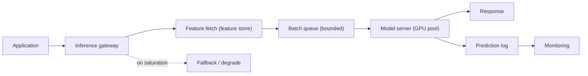

# Model Serving

## TL;DR

Model serving is the discipline of running a trained model as a production service whose request handler is unusually expensive: a single prediction may consume orders of magnitude more compute than an ordinary web request, often on hardware that costs dollars per hour, and the model must be *loaded* into accelerator memory before it can serve anything at all. This reframes serving away from data science and toward systems design. The defining tension is **latency versus throughput**: the techniques that keep expensive accelerators busy — batching, queueing — are the same techniques that inflate the tail of the latency distribution. A good serving system is one that navigates that tension deliberately: it chooses a serving topology, batches on a controlled wait, autoscales on the signal that actually predicts saturation, keeps replicas warm because cold starts are slow, and degrades gracefully instead of timing out. Everything below is a consequence of treating inference as a latency-bounded, throughput-constrained, hardware-bound service rather than a function call.

Serving is a production service first, so the general patterns apply directly: [capacity planning](../01-foundations/10-capacity-planning.md) for the latency budget, [retries, timeouts, and hedging](../06-scaling/10-retries-timeouts-hedging.md) for tail control, [deployment strategies](../15-deployment/01-deployment-strategies.md) for canary and blue-green rollouts, and [autoscaling](../06-scaling/08-auto-scaling.md) for capacity. The LLM regime — continuous batching, KV caches, the prefill/decode split — is its own world, covered in depth in [LLM Infrastructure](../17-llm-systems/05-llm-infrastructure.md).

---

## The Central Tension: Latency Versus Throughput

Almost every interesting decision in model serving is a point on a single trade-off curve between latency and throughput, and understanding why this trade-off is *fundamental* — not an implementation detail — is the key to the whole topic.

The reason it is fundamental is that modern accelerators are built for parallel work. A single small request may leave arithmetic units or memory bandwidth underused; batching can amortize weight traffic and launch overhead while exposing larger matrix operations. The gain is model- and shape-dependent and eventually saturates memory or compute, so a batch of thirty-two is not promised to deliver thirty-two times the work at the same latency. There are still two distinct objectives. **Latency** is how long one request waits. **Throughput** is how many valid requests the system finishes per second. They are in tension whenever raising achieved batch size requires queueing or larger batches increase service time.

The engineering implication is that you cannot tune a serving system without first deciding which number the product actually cares about. A fraud-authorization call that blocks a checkout cares about p99 latency and will pay for idle hardware to get it. An overnight batch that scores every user's churn risk cares only about total cost and will happily run enormous batches at terrible per-request latency. Most real systems sit between these poles, and the entire job of serving infrastructure is to give an operator a *knob* on that curve rather than an accident.

---

## The Serving Regimes

Before any topology or hardware decision, a model belongs to one of a few serving *regimes*, and the regime is fixed by how soon the prediction is needed relative to when its input arrives. Choosing the regime correctly is the highest-leverage decision in the whole design, because it determines which constraints even apply.

**Batch (offline) scoring** runs predictions on a schedule over a collected dataset — every user's daily churn score, an overnight recommendation refresh. It has a completion deadline rather than a per-request latency SLO, so it can use large batches and elastic capacity. The catch is *staleness*, invalidation, and materialized-output storage: a cheap computation is not cheap if most scores are never read or must be recomputed after every state change. Batch often has the lowest compute cost per prediction when the population is dense and the freshness window is real.

**Online synchronous** serving answers a request in the request's own latency budget — fraud authorization, search ranking, personalization on page load. This is the regime where every constraint in this document bites: tail latency, cold start, batching trade-offs, autoscaling on the right signal. It is also the most expensive, because it forces the hardware to be ready *now* rather than whenever convenient.

**Online asynchronous and streaming** serving decouples the prediction from a blocking call. An async scoring queue lets enrichment or review-routing happen within seconds-to-minutes without holding a user request open; streaming inference scores events as they flow through a pipeline (abuse detection, anomaly detection) at high throughput with per-event latency in the tens of milliseconds. These regimes relax the tail-latency constraint in exchange for queue semantics and delayed decisions.

The practical rule is to *push work toward the cheapest regime that still meets the freshness requirement*. Serving a daily-stable score through an expensive online endpoint is a common and avoidable waste; the same prediction precomputed in a nightly batch and cached costs a fraction as much. The regimes below — topologies, batching, autoscaling — are all refinements of the online synchronous case, because that is where the systems design is hardest.

---

## Why GPUs Change the Economics

Serving on CPUs and serving on accelerators have different cost curves because accelerators are expensive, coarse-grained capacity and gain efficiency from parallel work.

A GPU instance is a fixed hourly cost whether it is working or idle, and capacity usually arrives in whole devices or fixed slices. Utilization is therefore an important diagnostic, but it is not the objective: a device can report high utilization while processing inefficient shapes, recomputing work, or building a queue whose responses miss their deadlines. The economic metric is cost per *successful, in-SLO* prediction:

```text
cost_per_good_prediction = fleet_cost_per_second
                           / in_SLO_predictions_per_second
```

Batching, compilation, and consolidation matter only insofar as they improve that denominator without violating quality or latency. Deliberate idle headroom may be economically correct when it prevents a burst from turning paid compute into timed-out responses.

Batching amortizes weight reads and launch overhead across requests, often raising the number of in-SLO predictions per device. Consolidation can recover capacity stranded by thin traffic, but it introduces interference and a larger failure domain. Queue depth is usually a better autoscaling signal than CPU for a GPU-bound endpoint, yet direct accelerator metrics and end-to-end deadline misses remain necessary because feature fetch or serialization can be the real bottleneck. Hardware efficiency is a constrained optimization, not a mandate to keep every accelerator at 100%.

---

## Dynamic Batching Is a Queueing Decision

The cleanest way to understand batching is as a small, deliberate piece of queueing theory embedded in the request path.

Static batching — wait until exactly N requests have arrived, then run them together — is simple but wrong for online traffic, because under low load the Nth request may never arrive and early requests wait indefinitely. **Dynamic batching** fixes this with a bounded wait: the server holds incoming requests in a queue for at most a few milliseconds (TensorFlow Serving exposes this as `batch_timeout_micros`; NVIDIA Triton as a `max_queue_delay`), and it dispatches whichever requests have accumulated when either the batch fills or the timer expires. The wait is the price you pay to assemble a batch, and it is a knob directly on the latency/throughput curve: a longer wait builds bigger batches and higher throughput at the cost of added latency for every request, even the ones that arrive when the queue is empty.

The subtlety that catches teams is that this is a *queueing* decision, not a constant. Under heavy load, batches fill before the timer fires, so the wait adds little and throughput is high. Under light load, the timer dominates and adds its full delay to requests that did not need to wait at all. The worst regime is moderate, bursty load, where the queue oscillates and the added latency becomes unpredictable — which is exactly where the tail blows up. The right batch-wait is therefore a function of the traffic shape, and the honest way to set it is to measure p99 latency at the actual peak burst size rather than reasoning about averages. A serving system that batches without measuring its tail under burst has chosen a throughput it cannot describe and a latency it cannot promise.

A batching benchmark must separate device service time from queueing delay. Queue delay consumes the request's deadline but does not create accelerator capacity. For each request-shape bucket and candidate batch policy, record the achieved batch-size distribution, device service-time distribution, queue wait, memory high-water mark, rejection rate, and the resulting goodput:

```text
nominal_throughput(B) = B / service_time_for_batch_B
goodput                = completed_in_SLO_predictions / wall_time
```

`nominal_throughput` is only a kernel/service bound. The production denominator excludes responses that finish after their consumer's deadline, so a policy can raise nominal throughput while reducing goodput. Replay the measured arrival trace, including bursts and incompatible shapes, and sweep queue wait and batch limits until the in-SLO frontier is visible. [ML Capacity and Cost Planning](./14-ml-capacity-cost-planning.md) owns the subsequent fleet-size, failure-headroom, and cost calculation; this chapter supplies its benchmark contract rather than a replica count inferred from one batch measurement.

### Why the Tail Blows Up Nonlinearly

The queueing behavior behind "moderate bursty load is the worst regime" is worth making quantitative, because it is one of the most counterintuitive facts operators meet. For a single-server queue with random arrivals, the expected wait grows with utilization ρ roughly as:

```text
W ≈ (service_time × ρ) / (1 − ρ)      (M/M/1 approximation)

ρ = 0.50  →  W ≈ 1.0 × service_time
ρ = 0.70  →  W ≈ 2.3 × service_time
ρ = 0.90  →  W ≈ 9.0 × service_time
ρ = 0.95  →  W ≈ 19  × service_time
```

The wait *quadruples* between 70% and 90% utilization in this idealized queue. A dynamic batcher is not an M/M/1 server — service time depends on batch size and request shape, arrivals are often bursty, and several execution instances may share a device — so the equation does not prescribe a universal 70% target. It proves the qualitative point: as offered load approaches measured capacity, small estimation errors or bursts create disproportionate waiting. Select target load from a trace-driven load test and the permitted tail, then reserve explicit headroom for a replica failure and a rolling deployment.

### What the Knobs Look Like in Practice

In Triton, the whole batching decision is a few lines of `config.pbtxt`, and each line maps to a concept above:

```protobuf
# Triton 24.x — model config for a GPU-bound classifier
name: "fraud_classifier"
platform: "onnxruntime_onnx"
max_batch_size: 32                       # OOM bound and latency bound together
dynamic_batching {
  preferred_batch_size: [ 8, 16, 32 ]    # dispatch early at these sizes
  max_queue_delay_microseconds: 5000     # the bounded wait: 5 ms, on the tail budget
  default_queue_policy {
    max_queue_size: 128                  # bounded queue: shed load, don't buffer an incident
    timeout_action: REJECT
    default_timeout_microseconds: 100000 # a request older than 100 ms is already a failure
  }
}
instance_group [ { count: 2, kind: KIND_GPU, gpus: [0] } ]   # 2 execution streams on one GPU
```

Two details deserve attention. `max_queue_size` with `REJECT` is [load shedding](../06-scaling/07-backpressure.md) encoded in config: an unbounded queue converts a short saturation burst into a long queue of requests whose callers may already have timed out. `instance_group.count: 2` allows concurrent execution streams, which can overlap transfers and kernels for some models but also duplicates model state and can increase contention. It is a benchmark knob, not a free gain. TensorFlow Serving exposes analogous batch size, timeout, and worker controls.

---

## Tail Latency Is the Real Budget

Online serving is governed by a *latency budget*, and the number that matters in that budget is almost never the mean.

The reason is that an inference call is rarely the whole story. A user-facing prediction typically fans out: the request must be authenticated and routed, features must be fetched (often from a [feature store](./02-feature-stores.md) over the network), the model must run, and the result must be post-processed and logged. Each stage consumes part of a fixed end-to-end budget, and a useful design discipline is to write that budget down explicitly before choosing hardware — because if feature lookup is eating most of a 100 ms budget, a faster GPU will not fix the user experience.

```text
End-to-end p99 objective: 120 ms
Allocated stage deadlines (not measured stage p99s):
  ingress + auth/routing      15 ms
  feature fetch               40 ms   <- often the real bottleneck
  model inference             45 ms
  post-processing + logging   20 ms
```

Percentiles are not additive: the sum of four stage p99 measurements is neither the end-to-end p99 nor a defensible prediction of it, because slow stages may be correlated or occur on different requests. Stage deadlines are an engineering allocation; verify the end-to-end percentile from joint request traces and retain per-stage spans for attribution.

The deeper point is *which percentile* the budget applies to. A model whose mean latency is 20 ms but whose p99 is 300 ms will, in any request that fans out to several models or several features, produce a slow user experience surprisingly often — because a request that touches ten backends inherits roughly the p99 of the *slowest* of the ten. This is the tail-at-scale problem, and serving makes it worse in two specific ways. First, batching couples requests: one slow or oversized request in a batch delays every other request in that batch, so a single pathological input raises the tail for its innocent batchmates. Second, queueing under burst inflates the tail nonlinearly — when arrivals briefly exceed service rate, the queue grows faster than it drains and wait time spikes for everyone behind the burst. The defenses are the standard tail-control toolkit applied to inference: strict per-request timeouts, bounded queues with [load shedding](../06-scaling/07-backpressure.md), separate pools so an expensive model cannot starve a cheap one, and occasionally request hedging for read-only predictions. The governing rule is that **p99, not mean, is the contract**, because users experience the tail.

---

## Cold Start: Why Scale-to-Zero Is Dangerous

A serving replica is not ready merely because its process started. It must fetch and initialize the complete artifact/runtime path and pass a representative readiness inference before accepting traffic.

The mechanism is unavoidable: a replica must fetch and verify the artifact, initialize the runtime, allocate memory, place weights in host or device memory, compile or select kernels where required, and pass readiness inference. The duration varies by artifact bytes, storage locality, runtime, hardware, and cache state; model size alone does not justify a universal seconds-or-minutes claim. During that path the replica consumes capacity and serves nothing. Scale-to-zero is therefore valid only when the caller's deadline or asynchronous queue can absorb the measured cold path. Otherwise the first request times out regardless of how attractive idle-cost savings looked.

The engineering implications follow directly. Latency-critical models keep enough warm capacity to cover demand during the measured scale-up lead time, accepting idle headroom as the price of a predictable tail. Autoscaling must trigger early enough that a new replica passes readiness before the existing fleet saturates. Where idle cost must be minimized, alternatives include a smaller warm floor, explicitly non-interactive cold paths, artifact caches on local storage, or a multi-model pool that retains popular artifacts in memory. The decision is made by comparing the cold-path distribution with the deadline, not by classifying a model as categorically small or large.

---

## Serving Topologies

Where the model runs relative to the application is an architectural decision with consequences for latency, isolation, scaling, and language choice. There are three canonical topologies, and the right one depends on model size, update cadence, and how many services need predictions.

| Topology | Latency | Isolation & scaling | Best when |
|---|---|---|---|
| **Embedded (in-process)** | Lowest — no network hop | None; model scales with the app, same language runtime | Small, fast models; ultra-tight budgets; few callers |
| **Dedicated model server** | One local/network hop | Model scales and deploys independently; polyglot | Shared model, GPU consolidation, frequent model updates |
| **Managed inference endpoint** | Network hop + provider overhead | Fully external; provider owns capacity and scaling | Want to avoid running accelerators; bursty or experimental load |

**Embedded serving** links the model directly into the application process. It avoids a serialization and network boundary, but couples the model's lifecycle to the application's: every model update is an application redeploy, the model competes for the app's host or accelerator resources, and the app is locked into a compatible runtime. GPU-backed in-process inference is possible; the trade-off is that placement, memory ownership, failure isolation, batching across callers, and independent rollout now belong to the application. Embedded serving fits a tightly owned model with compatible lifecycle and resource needs, while a dedicated server is usually preferable when those concerns must scale or fail independently.

**A dedicated model server** — TensorFlow Serving, Triton, TorchServe, or a custom service — runs the model as its own deployable, reached over a local socket or the network. This is the workhorse topology for serious systems because it buys *independence*: models roll out separately from application code (essential for safe canary and rollback), multiple applications share one model and one set of accelerators, and the model can run in whatever language and runtime it wants while callers stay polyglot. The cost is a network hop and a new dependency in the request path, which means the model server now needs its own SLO, timeout, and fallback like any other downstream.

**A managed inference endpoint** — SageMaker, Vertex AI, or a hosted inference provider — pushes the whole problem to a vendor. It removes the burden of running and scaling accelerators, which is genuinely valuable for teams without ML-infra depth or for spiky, experimental workloads. The trade-offs are the usual ones of managed services: less control over batching and cold-start behavior, provider-imposed latency overhead, per-call cost that can exceed self-hosting at steady high volume, and the data-governance questions of sending features to a third party.

A useful diagram of the dedicated-server topology, which most production systems converge on:



The prediction log on that diagram is not optional. Capturing request metadata, model version, feature references, the prediction, and latency is what makes the system debuggable and is the raw material for [model monitoring](./04-model-monitoring.md) and later label joins.

A production serving contract should be explicit enough for an on-call engineer and an autoscaler to reason about:

```yaml
endpoint: fraud_authorization
model: fraud_classifier:v42
end_to_end_slo:
  percentile: p99
  max_ms: 120
stage_deadlines_ms:                  # allocations, not independently measured p99s
  ingress_auth: 15
  feature_fetch: 40
  inference: 45
  postprocess_logging: 20
capacity:
  min_warm_replicas: 12
  max_batch_size: 32
  max_queue_wait_ms: 5
  scale_up_signal: queue_wait_p95_ms > 8 for 2m
  scale_down_delay_minutes: 30
fallback_ladder:
  - fraud_classifier:v41          # previous model, warm
  - fraud_small_model:v9          # cheaper, lower recall
  - fraud_rules_policy:v3         # deterministic safe fallback
  - manual_review                 # fail closed for high-risk transactions
logging_required:
  - prediction_id
  - model_version
  - feature_versions
  - threshold_policy
  - experiment_bucket
```

The contract turns vague SLO talk into an executable design: autoscaling knows which signal leads saturation, deployment knows what must stay warm, and incident response knows the degradation order before the incident starts. The numbers are illustrative outputs of a workload benchmark and risk decision, not defaults to copy; the end-to-end SLO is verified jointly rather than inferred by summing stage percentiles.

---

## Autoscaling on the Right Signal

Autoscaling a model service on CPU utilization is a common and expensive mistake, because for a GPU-bound model CPU is nearly uncorrelated with whether the service is saturated.

The reason is that the bottleneck resource is the accelerator and the queue in front of it, neither of which shows up as CPU pressure. A GPU server can be at the edge of collapse — its batch queue growing, p99 climbing — while its CPU sits at thirty percent, because the work is happening on silicon the CPU metric does not see. Scaling on CPU therefore adds replicas too late, after latency has already broken, or never. The signals that actually predict saturation are **queue depth and batch wait time** (requests are piling up faster than the GPU drains them), **GPU utilization and memory** (the accelerator is the constraint, so measure it directly), and **inference latency and timeout rate** (the symptom the user feels). Scaling on queue depth is usually the best single choice because it is a *leading* indicator: the queue grows before latency breaks, giving the slow new replicas time to load.

The cold-start problem sharpens all of this. Autoscaling must trigger early enough to cover the measured replica-readiness distribution; reacting after the queue breaches its budget cannot restore capacity retroactively. Latency-critical pools therefore choose their warm floor, scale-down stabilization, and forecast horizon from arrival bursts, readiness lead time, and failure headroom. Scale-to-zero remains an explicit deadline-versus-cost decision rather than a rule inferred from model size.

---

## Caching

Caching in model serving operates at several layers, and each one trades a different kind of staleness for a different kind of speed.

**Response caching** stores the prediction for an equivalent decision input. It is effective when the input space is skewed and unsafe when equivalence cannot be named. The key must cover the full release manifest, tenant/authorization scope, relevant entity or feature generations, request-time inputs, and policy context. Model version alone is insufficient: the same model returns a stale decision after account state, inventory, eligibility, or threshold policy changes. The invalidation horizon must be shorter than the decision's semantic validity. The same thundering-herd dynamics that afflict any cache apply here: when a hot key expires, a burst of concurrent misses can stampede the accelerator ([cache stampede](../04-caching/04-cache-stampede.md) defenses transfer directly).

**Embedding and feature caching** memoizes the expensive intermediate representations rather than the final answer. Many recommendation and ranking systems compute a user embedding once and reuse it across many candidate scorings within a request; caching it cuts redundant model passes dramatically. This caches a *component* of the computation, which is often safer than caching the final prediction because embeddings change less frequently than scores.

**KV caching** is specific to autoregressive transformers and is less an optional optimization than a change in the unit of repeated work. With cached keys and values, one new-token attention step compares its query with a prefix whose length grows linearly, so that step's dense-attention work is linear in prefix length and total decode attention over generated tokens is quadratic. A naive implementation that reruns dense self-attention over the entire growing prefix at every step pays quadratic attention per rerun and cubic total attention in the generated length (holding prompt length aside). KV caching removes that repeated prefix projection and attention computation, but consumes accelerator memory proportional to live cached tokens; [GPU Inference Internals](../17-llm-systems/11-gpu-inference-internals.md) owns the exact equations and scheduler consequences.

---

## Hardware Heterogeneity as a Cost Decision

Choosing what hardware to serve a model on is a latency-versus-cost decision, not a default, and treating every model as a GPU model overspends badly.

The spectrum runs from CPUs through GPUs to specialized accelerators. **CPUs** are widely available and can be provisioned in finer increments; for small models, low query rates, or latency budgets that an optimized CPU model meets, they may be the cheaper choice. They still pay artifact fetch, deserialization, memory placement, runtime initialization, and warm-up, so their cold path must be measured rather than dismissed. **GPUs** win when parallel throughput or latency offsets their coarser, more expensive capacity. **Specialized accelerators** can improve price per valid inference for compatible workloads at the cost of a narrower software ecosystem and portability friction.

The engineering implication is to *measure the crossover* rather than reach for the GPU reflexively. A model serving ten queries per second within a 50 ms budget after quantization may be far cheaper on CPUs than on a barely-utilized GPU, and the utilization economics from earlier make a lightly-loaded GPU one of the worst cost outcomes available. Techniques that move the crossover — quantization to int8, distillation to a smaller model, compilation with TensorRT or ONNX Runtime — often let a model meet its budget on cheaper hardware, and are worth exhausting before paying for the next accelerator tier. Hardware choice is a per-model decision driven by the model's size, its latency budget, and its actual traffic, and the right fleet is usually heterogeneous.

---

## The Optimization Stack: Making the Model Cheaper Before Buying Hardware

The crossover-moving techniques deserve concrete treatment because each changes a different resource: compilation changes execution, reduced precision changes representation, and distillation changes the model itself. Their order is workload-dependent, but each candidate must pass the same release contract: output compatibility, slice quality, latency distribution, memory, and cost under production shapes.

**Compilation** can fuse operations, remove framework overhead, and specialize kernels for target hardware and allowed shapes. Export is not automatically semantics-preserving: unsupported operators, changed padding, precision conversion, or a too-narrow shape profile can alter outputs or fail only on rare inputs. Compare compiled and reference outputs on a versioned conformance corpus before benchmarking:

```python
# PyTorch 2.x → ONNX → TensorRT, the standard production path
torch.onnx.export(model, example_input, "model.onnx",
                  input_names=["input"], output_names=["output"],
                  dynamic_axes={"input": {0: "batch"}},   # allow dynamic batching
                  opset_version=17)
```

```bash
# Build a TensorRT engine with an explicit optimization profile for the batch range
trtexec --onnx=model.onnx --saveEngine=model.plan \
        --minShapes=input:1x256 --optShapes=input:16x256 --maxShapes=input:32x256 \
        --fp16
```

The `--fp16` flag halves bytes per represented element relative to fp32, but it does not imply half the end-to-end latency. Speedup depends on whether the workload is bandwidth-bound, whether kernels use reduced-precision units, how much time sits outside the model, and whether casts or unfused operators erase the gain.

**Quantization** stores weights (and optionally activations) in fewer bits. The arithmetic is what makes it compelling:

```text
7B-parameter model:
  fp32:  7B × 4 B = 28 GB    (packed weight bytes)
  fp16:  7B × 2 B = 14 GB    (packed weight bytes)
  int8:  7B × 1 B =  7 GB    (packed weight bytes)
  int4:  7B × 0.5 B = 3.5 GB (packed weight bytes only)
```

These are representation lower bounds, not deployment memory requirements. Runtime memory also includes quantization scales and metadata, temporary workspaces, activations, allocator fragmentation, and workload-specific state such as a KV cache. A weight-byte calculation therefore cannot establish that an artifact fits a device or partition.

Lower precision reduces the weight footprint and can improve throughput when compatible kernels and hardware exist. It can also add dequantization overhead or become compute-bound elsewhere, so speed is measured rather than inferred from bytes alone. Accuracy impact is model-, calibration-data-, operator-, and slice-dependent; global metric parity does not prove parity on rare or high-consequence inputs. The quantized artifact therefore has its own hash, runtime compatibility contract, and evaluation report rather than being treated as a packaging variant of the original.

**Distillation** trains a smaller student against teacher outputs and usually changes both quality and operating point. It can be valuable when a smaller architecture moves the service to cheaper hardware or creates more batching headroom, but the economic gain depends on achieved throughput and traffic volume. A common tiered design uses a cheap student to filter candidates and a larger model to rerank the survivors; evaluation must measure cascade recall, not just the student's standalone metric.

Choose by the measured bottleneck. Remove framework and serialization overhead when host time dominates; compile or select better kernels when device execution dominates; reduce precision when memory capacity or bandwidth dominates; change the architecture or distill when the model itself is structurally too expensive. Hardware changes belong in the same benchmark matrix because engineering time has a cost too. There is no universal ladder, only a resource diagnosis and a release-quality gate.

---

## Sharing the GPU: Multi-Model Serving

The utilization economics push toward consolidating many models onto few accelerators, and there is a ladder of mechanisms for doing it, in increasing order of isolation.

**In-process multi-model serving** (Triton loading many models in one server process, each with its own instance groups) shares everything: memory, SM time, PCIe bandwidth. Density is maximal and isolation is zero — one model's OOM kills its neighbors, and a burst on one model steals compute from all. Fine for a catalog of small internal models; wrong for mixing a latency-critical model with anything bursty.

**CUDA MPS (Multi-Process Service)** lets separate processes share a GPU with true concurrent kernel execution, without partitioning memory. Better fault isolation than one process, still no memory isolation.

**MIG (Multi-Instance GPU)** partitions supported GPUs into hardware-isolated profiles with dedicated fractions of memory and compute. Available profiles and isolation details depend on the exact device and software stack. Select a profile from measured peak runtime memory and service time under concurrency, not parameter count or quantized weight bytes. Fixed profile sizes improve isolation but can strand capacity when a workload falls just above a boundary; orchestration also has to treat profile identity as part of placement compatibility.

The decision mirrors any [multi-tenancy](../06-scaling/12-multi-tenancy.md) call: shared process for density among trusted equals, MIG for hard isolation between tenants with different SLOs. The anti-pattern is the unexamined default of one whole dedicated GPU per small model — the most expensive possible configuration, and the most common.

---

## LLM Serving as a System Problem

Autoregressive LLMs break several simplifying assumptions made by fixed-shape inference. Requests consume work over time rather than in one bounded call; input and output lengths vary widely; the scheduler can admit and retire sequences at token-step boundaries; and KV-cache memory grows with live sequence tokens. Consequently admission control must reserve memory and work, not merely count requests.

| Fixed-shape serving assumption | LLM replacement |
|---|---|
| one latency number | time to first token, inter-token latency, and end-to-end latency |
| request count approximates load | prompt tokens, generated tokens, model, and deadline define load |
| static/dynamic request batches | iteration-level continuous batching |
| activation memory bounded by batch shape | KV-cache capacity grows with active sequence lengths |
| replicas are interchangeable | prefix/cache locality and parallelism placement affect routing cost |

The general serving control loop still applies — bounded queues, admission control, degradation, versioned artifacts, and cost per in-SLO result — but its resource units change. A gateway that admits 100 one-token prompts and 100 long-context generations as equal requests has no defensible overload behavior. The detailed KV-memory equation, roofline limits, continuous-batching scheduler, and prefill/decode placement belong to [GPU Inference Internals](../17-llm-systems/11-gpu-inference-internals.md) and [LLM Infrastructure](../17-llm-systems/05-llm-infrastructure.md); duplicating them here would give two chapters ownership of the same mechanism.

---

## Security and Abuse Resistance

The inference gateway is a resource-security boundary. Input validation must happen before expensive allocation: authenticate the caller, enforce model and tenant quotas, bound tensor dimensions or sequence length, reject malformed dtypes and decompression bombs, and translate the request into an estimated work unit. A byte-size limit alone is insufficient when a small compressed or sparse input expands into a large dense tensor. Admission control protects availability from both hostile traffic and ordinary clients whose shape distribution changed.

Model artifacts and runtimes are part of the software supply chain. The release manifest pins artifact and runtime hashes, serving schema, preprocessing graph, and allowed hardware profile. Loading language-native serialized objects from an untrusted registry can execute code; prefer constrained formats where possible and validate or convert artifacts in an isolated build step. The serving identity reads only approved artifacts and feature namespaces and cannot promote a new release. Artifact verification happens before placement into a shared warm cache, so one compromised tenant cannot seed executable state for another.

Multi-tenant inference also creates confidentiality boundaries. Cache keys include tenant, authorization scope, full release version, and every input that affects the result; otherwise a response or embedding cache can leak data across callers. Prediction logs and feature payloads follow purpose-limited retention and access controls. Rate limiting raises the cost of model extraction and membership-inference probing, but it is not proof against either; sensitive systems combine quotas, output minimization appropriate to the product, anomaly detection, and governance over who may query which model.

The security fallback must preserve authorization semantics. Falling back from a tenant-specific model to a shared model, or from private features to a cached response, can be an information leak even when it restores latency. Every degradation rung is reviewed for both product safety and data isolation, not just compute availability.

---

## Failure Modes

The characteristic failures of model serving recur across organizations, and most of them are direct consequences of the constraints above.

**Cold-start latency spikes** appear when a scaling event or deploy brings up a replica that must fetch, verify, deserialize, compile, and place an artifact before serving. If readiness reports success before representative inference passes, traffic discovers the missing kernel or memory margin. The defense is artifact-locality planning, readiness that includes a conformance inference, and enough warm capacity for the stated SLO. Scale-to-zero is valid only when the caller's deadline explicitly includes cold-start time or an asynchronous queue absorbs it.

**Batch-induced tail latency** is the quiet cost of throughput optimization: mean latency looks fine, but p99 climbs because a too-long batch wait, or one oversized request poisoning its batch, delays everyone. The defense is to measure p99 under realistic burst load, cap batch wait and batch size, and isolate expensive models in their own pools.

**OOM from large batches** kills a replica when batch size times sequence length times activation memory exceeds device memory — often triggered by a traffic burst that builds an unusually large batch, or an unusually long input. Because accelerator memory is hard-limited and fragmentable, this is a crash, not a slowdown. The defense is to bound maximum batch size and input length explicitly, and to size capacity against *concurrent* batch memory rather than steady-state.

**Version-load failures** occur when a new artifact cannot be loaded — incompatible runtime, missing dependency, wrong tensor shape, corrupt file. The defense is to validate artifacts before promotion, roll out in stages, and keep the previous model loaded and serving until the new one passes health checks, so a bad load never takes down the endpoint.

**Silent wrong model** is the most dangerous: a valid artifact loads successfully but belongs to the wrong dataset, segment, or feature schema, so the service serves confident, wrong predictions with no error at all. The defense is metadata and schema-compatibility gates, artifact hashes, and stamping the model version onto every logged prediction so monitoring can catch the divergence.

**Thundering herd** strikes when many cache entries expire at once, a popular replica restarts, or a dependency recovers and a backlog floods in — a synchronized surge that overwhelms the GPU pool. The defense is request coalescing, jittered cache expiry, bounded queues with [load shedding](../06-scaling/07-backpressure.md), and [circuit breakers](../06-scaling/06-circuit-breakers.md) on downstream feature fetches.

**Retry amplification and zombie work** occur when a caller times out and retries while the original inference continues consuming the accelerator. The user sees a failure, the fleet performs the work twice, and overload deepens. End-to-end deadlines must propagate into the batch queue; expired requests must be removed before dispatch when possible, retries need one bounded owner, and an idempotency or request key should coalesce equivalent work. Successful device execution is not successful serving if the result missed its consumer's deadline.

**Partial observability** occurs when asynchronous logging is dropped under the same overload that triggers fallback. The service recovers, but no one can reconstruct which model, features, or degradation path made affected decisions. Prediction logs need their own bounded, durable path and an explicit failure policy: block high-risk actions, write a minimal local audit record, or count an acknowledged observability gap. Silently dropping logs makes the incident operationally unrecoverable.

A degradation ladder — full release, previous warm release, feature-light or cheaper model, deterministic policy, abstention/manual review — turns saturation into a bounded product behavior. It is not automatically ordered by compute cost: a cached prediction may be unsafe after a state change, and a previous model may depend on the same broken feature. Each rung therefore declares validity conditions, maximum age, user impact, and which failures it is independent of.

Containment should follow the saturated resource. Growing pre-inference time with idle devices points to feature fetch, serialization, or host scheduling. Growing device queue with stable service time points to insufficient accelerator capacity or a burst. Rising service time at a fixed shape points to interference or thermal/runtime regression; rising service time with shape identifies input mix. OOM tied to one shape is an admission-contract failure, while OOM after a deploy is an artifact-capacity failure. Roll back only when the timeline implicates the release; otherwise rollback can preserve the same dependency incident and waste recovery time.

---

## Decision Framework

Design the system from the decision deadline backward.

| Step | Quantitative question | Resulting choice |
|---|---|---|
| Regime | how stale may the decision be? | batch, asynchronous, streaming, or synchronous serving |
| Budget | what end-to-end percentile and deadline apply, including fallback? | stage budgets for features, queue, inference, post-processing, and logging |
| Workload | what are arrival bursts, shape/length distribution, model mix, and priority classes? | shape buckets, queue isolation, request weights, admission limits |
| Benchmark | for each hardware/runtime/batch point, what are service-time distribution, memory, quality, and power/cost? | feasible operating frontier rather than a vendor-spec estimate |
| Capacity | what target load meets the tail under a replica loss and rolling deploy? | warm floor, replica count, headroom, and scale-up lead time |
| Topology | which lifecycle needs independent scaling and rollout? | embedded, dedicated, shared, or managed endpoint |
| Failure semantics | what happens when a dependency is slow, the queue is full, or logging is unavailable? | timeout ownership, shedding priority, fallback validity, audit policy |
| Release | can one manifest bind artifact, runtime, feature schema, policy, and rollback target? | atomic promotion and decision reconstruction |

For each feasible point, calculate `cost_per_good_prediction`, not just hourly device price, and reject any point that misses the quality or tail constraint. Validate with replayed production traces plus adversarial bursts, cold replicas, one-replica loss, shard movement, and concurrent rollout. The selected operating point is then encoded as admission limits and autoscaling policy; it should not depend on an on-call engineer remembering benchmark assumptions.

---

## Key Takeaways

1. Model serving is a latency-bounded, throughput-constrained, hardware-bound service; its defining tension is that the techniques which raise throughput (batching, queueing) inflate the latency tail.
2. Optimize cost per successful, in-SLO prediction. Utilization is a diagnostic, not the objective; batching and consolidation are valuable only when they improve useful throughput without breaking the tail.
3. Dynamic batching is a queueing decision: a bounded wait trades a few milliseconds of latency for a larger batch, and its tail must be measured under realistic burst, not averaged.
4. p99, not mean, is the contract, because fan-out and batch coupling make tail latency the experience users actually feel.
5. Cold start includes artifact fetch, verification, deserialization, compilation, placement, and conformance inference; warm capacity is required whenever the deadline cannot absorb that path.
6. Choose the topology — embedded, dedicated server, or managed endpoint — by model size, update cadence, and how many callers need predictions.
7. Autoscale on queue depth and GPU saturation, not CPU, and lead demand by the replica warm-up time so slow-loading replicas arrive before the incident.
8. Cache at the right layer — response, embedding, or KV — and always include the model version in the cache key.
9. Hardware and optimization are bottleneck decisions: benchmark compilation, precision, architecture, and device choices under production shapes and the same release-quality gate.
10. LLM serving preserves the control loop but changes the resource unit from requests to token work and KV memory; its canonical mechanisms live in the dedicated LLM infrastructure chapters.
11. The gateway is a resource and confidentiality boundary: validate shapes before allocation, quota estimated work, verify artifacts, isolate tenant caches, and preserve authorization through fallback.

---

## References

1. [TensorFlow Serving: Flexible, High-Performance ML Serving](https://arxiv.org/abs/1712.06139) — Olston et al., 2017
2. [NVIDIA Triton Inference Server Documentation](https://docs.nvidia.com/deeplearning/triton-inference-server/user-guide/docs/) — dynamic batching, concurrent model execution
3. [Clipper: A Low-Latency Online Prediction Serving System](https://www.usenix.org/conference/nsdi17/technical-sessions/presentation/crankshaw) — Crankshaw et al., NSDI 2017
4. [Orca: A Distributed Serving System for Transformer-Based Generative Models](https://www.usenix.org/conference/osdi22/presentation/yu) — Yu et al., OSDI 2022 (continuous batching)
5. [Efficient Memory Management for Large Language Model Serving with PagedAttention](https://arxiv.org/abs/2309.06180) — Kwon et al., SOSP 2023 (vLLM)
6. [The Tail at Scale](https://research.google/pubs/pub40801/) — Dean & Barroso, 2013
7. [KServe Documentation](https://kserve.github.io/website/) — scale-to-zero and serverless inference
8. [Hidden Technical Debt in Machine Learning Systems](https://proceedings.neurips.cc/paper_files/paper/2015/file/86df7dcfd896fcaf2674f757a2463eba-Paper.pdf) — Sculley et al., 2015
